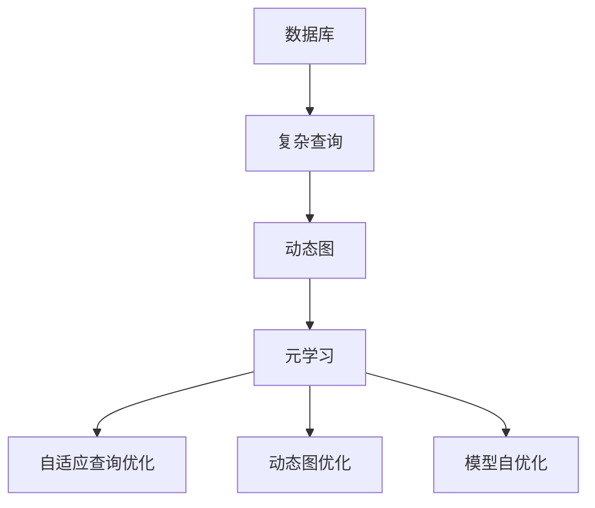
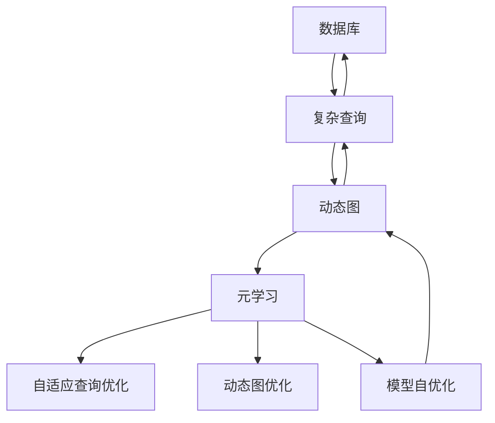

                 

# 一切皆是映射：面向复杂查询的数据库优化通过元学习

> 关键词：数据库优化,元学习,复杂查询,映射函数,数据建模,动态图,深度学习,混合深度学习

## 1. 背景介绍

### 1.1 问题由来
在当今大数据时代，数据量和查询需求日益增长，对数据库系统的性能提出了更高的要求。传统的关系型数据库在面对复杂查询时，由于其静态的结构和固定的查询路径，容易产生性能瓶颈。随着人工智能技术的不断进步，元学习和深度学习为数据库优化提供了新的方向和方法。

元学习（Metlearning），也被称为元优化或超优化，是指模型能够学习如何在不同任务上进行优化，从而提高在新数据上的泛化性能。近年来，元学习在机器学习领域取得了显著进展，如Meta-Learning、HPO、AutoML等。而在大数据领域，元学习同样有着广阔的应用前景，尤其是在复杂查询优化和动态图管理方面。

### 1.2 问题核心关键点
元学习在数据库优化中的应用，主要体现在以下几个方面：

1. 自适应查询优化：根据查询的特点和数据分布，自动调整查询路径和算法，提升查询效率。
2. 动态图优化：管理查询中的依赖关系和变换，减少不必要的重复计算，提高系统性能。
3. 模型自优化：在已有模型基础上，通过微调参数或结构，优化模型在新数据上的性能。

这些关键点反映了元学习在大数据查询优化中的潜力，也为未来的研究提供了方向。

### 1.3 问题研究意义
元学习在数据库优化中的应用，对于提高数据库系统的响应速度、降低查询成本、优化资源配置等方面具有重要意义：

1. 提高查询效率：自适应查询优化可以动态调整查询路径，避免因数据分布变化导致的性能下降。
2. 减少计算开销：动态图优化能够管理复杂的依赖关系，减少不必要的计算，提升系统性能。
3. 提高模型泛化能力：模型自优化能够在新的数据上快速适应，提升模型的泛化性能。
4. 加速开发进程：自动化优化减少了手动调优的工作量，加快了数据库系统的开发和部署速度。
5. 降低维护成本：自适应优化降低了对运维人员的技能要求，降低了系统维护成本。

因此，元学习在数据库优化中的应用，具有重要的理论和实践价值。

## 2. 核心概念与联系

### 2.1 核心概念概述

为更好地理解元学习在数据库优化中的应用，本节将介绍几个密切相关的核心概念：

- 数据库：存储和管理数据的软件系统，通常分为关系型数据库和NoSQL数据库。
- 复杂查询：包含多个操作或关联的查询语句，具有复杂的依赖关系和变换。
- 动态图：表示查询中的操作和数据依赖关系的网络结构，动态图优化是其优化核心。
- 元学习：模型能够学习如何进行优化，以提升在新数据上的性能。
- 自适应查询优化：根据查询的特点和数据分布，动态调整查询路径和算法。
- 动态图优化：管理查询中的依赖关系和变换，减少不必要的重复计算。
- 模型自优化：在已有模型基础上，通过微调参数或结构，优化模型在新数据上的性能。

这些核心概念之间的逻辑关系可以通过以下Mermaid流程图来展示：



这个流程图展示了大数据查询优化中的核心概念及其关系：

1. 数据库存储和管理数据，为复杂查询提供数据基础。
2. 复杂查询包含多个操作和关联，需要动态图进行优化。
3. 动态图通过元学习进行优化，以适应不同查询的特点。
4. 元学习通过自适应查询优化、动态图优化和模型自优化，提升查询性能。

这些概念共同构成了大数据查询优化的完整生态系统，使得系统能够动态适应复杂查询的需求，提升性能和效率。

### 2.2 概念间的关系

这些核心概念之间存在着紧密的联系，形成了大数据查询优化的完整生态系统。下面我们通过几个Mermaid流程图来展示这些概念之间的关系。

#### 2.2.1 复杂查询的优化过程


这个流程图展示了复杂查询优化的基本过程：

1. 复杂查询通过解析生成动态图，表示其操作和依赖关系。
2. 动态图通过元学习进行优化，以适应不同查询的特点。
3. 自适应查询优化根据查询特点和数据分布，动态调整查询路径和算法。
4. 优化后的查询通过执行得到结果。

#### 2.2.2 动态图优化方法


这个流程图展示了动态图优化的主要方法：

1. 动态图管理查询中的依赖关系，确保查询路径的有效性。
2. 消除重复计算，避免不必要的资源浪费。
3. 变换依赖关系，优化查询路径和算法。
4. 应用优化算法，提升查询性能。

#### 2.2.3 模型自优化方法


这个流程图展示了模型自优化的基本步骤：

1. 已有模型通过参数微调或结构优化，适应新的查询需求。
2. 模型训练得到优化后的结果。

### 2.3 核心概念的整体架构

最后，我们用一个综合的流程图来展示这些核心概念在大数据查询优化中的整体架构：



这个综合流程图展示了从查询到优化的完整过程：

1. 数据库存储和管理数据。
2. 复杂查询通过动态图表示其操作和依赖关系。
3. 动态图通过元学习进行优化，以适应不同查询的特点。
4. 元学习通过自适应查询优化、动态图优化和模型自优化，提升查询性能。
5. 优化后的查询通过执行得到结果。

通过这些流程图，我们可以更清晰地理解大数据查询优化的各个环节和关键概念，为后续深入讨论具体的优化方法和技术奠定基础。

## 3. 核心算法原理 & 具体操作步骤
### 3.1 算法原理概述

元学习在大数据查询优化中的应用，本质上是一种基于深度学习的自适应优化方法。其核心思想是：模型能够学习如何优化查询路径和算法，以适应不同查询的需求。这种优化过程通常包括以下几个步骤：

1. 构建查询图表示查询中的操作和依赖关系。
2. 通过元学习调整查询图的结构，减少重复计算。
3. 应用优化算法执行查询，提升性能。

形式化地，假设查询 $Q$ 包含 $n$ 个操作 $O_i$，其依赖关系表示为有向无环图（DAG） $G=(V,E)$，其中 $V$ 表示节点集，$E$ 表示边集。每个操作 $O_i$ 对应一个查询操作 $q_i$，查询图通过 $q_i$ 和 $O_i$ 的映射关系来表示。元学习的目标是通过优化查询图，使得查询操作 $q_i$ 的最小化，即最小化查询图的总计算代价 $C(Q)$。

### 3.2 算法步骤详解

基于元学习的大数据查询优化一般包括以下几个关键步骤：

**Step 1: 构建查询图**
- 对复杂查询进行解析，生成查询图，表示查询中的操作和依赖关系。
- 利用图神经网络（GNN）等模型对查询图进行编码，得到查询图的向量表示。

**Step 2: 优化查询图**
- 应用元学习算法（如Meta-Learning、HPO、AutoML等）对查询图进行优化，调整其结构，减少重复计算。
- 优化后的查询图通过图神经网络解码，生成新的查询操作。

**Step 3: 应用优化算法**
- 将优化后的查询操作执行，得到查询结果。
- 应用优化算法（如优化路径搜索、并行计算等）提升查询效率。

**Step 4: 评估和反馈**
- 对查询结果进行评估，获取性能指标。
- 根据评估结果，反馈给元学习算法，优化模型参数。

### 3.3 算法优缺点

基于元学习的大数据查询优化方法具有以下优点：

1. 自适应性：元学习算法能够自适应不同查询的需求，优化查询路径和算法，提高查询性能。
2. 泛化性能：通过元学习，模型能够在新的数据上快速适应，提升查询泛化性能。
3. 自动化：元学习算法可以自动调整查询图和算法，减少手动调优的工作量，提升开发效率。

同时，这种方法也存在一些缺点：

1. 计算开销：元学习算法需要构建查询图，并进行优化和解码，计算开销较大。
2. 数据分布要求高：元学习算法对数据分布的要求较高，需要大量高质量的标注数据。
3. 模型复杂性：元学习算法通常需要较复杂的模型结构，如图神经网络，增加了模型复杂性。

尽管存在这些局限性，但就目前而言，基于元学习的方法是大数据查询优化的重要手段。未来相关研究将致力于优化模型结构、减少计算开销，以及提升数据泛化能力，进一步增强查询优化的效果。

### 3.4 算法应用领域

基于元学习的大数据查询优化方法，已在以下领域得到了广泛应用：

- 关系型数据库：优化查询路径和算法，提高查询效率。
- NoSQL数据库：优化数据访问路径和分布式计算，提升系统性能。
- 大数据分析：优化复杂数据分析查询，提升分析速度和准确性。
- 云计算平台：优化查询调度和管理，提升云服务性能和用户体验。
- 智能应用系统：优化智能推荐和决策查询，提升系统响应速度和决策精度。

除了上述这些应用领域，元学习在大数据查询优化中的潜力还在不断挖掘中，未来将有更多的创新方向和应用场景。

## 4. 数学模型和公式 & 详细讲解 & 举例说明

### 4.1 数学模型构建

本节将使用数学语言对基于元学习的大数据查询优化过程进行更加严格的刻画。

假设查询 $Q$ 包含 $n$ 个操作 $O_i$，其依赖关系表示为有向无环图（DAG） $G=(V,E)$，其中 $V$ 表示节点集，$E$ 表示边集。每个操作 $O_i$ 对应一个查询操作 $q_i$，查询图通过 $q_i$ 和 $O_i$ 的映射关系来表示。

定义查询图 $G$ 的节点嵌入为 $\mathbf{X} \in \mathbb{R}^{n \times d}$，其中 $d$ 为节点嵌入的维度。查询图 $G$ 的边嵌入为 $\mathbf{A} \in \mathbb{R}^{n \times n}$，其中 $\mathbf{A}_{ij} = 1$ 表示操作 $O_i$ 依赖操作 $O_j$。

元学习的目标是通过优化查询图，使得查询操作 $q_i$ 的最小化，即最小化查询图的总计算代价 $C(Q)$。目标函数定义为：

$$
C(Q) = \sum_{i=1}^n C_i(q_i)
$$

其中 $C_i(q_i)$ 为操作 $q_i$ 的计算代价，可以通过图神经网络（GNN）等模型对查询图进行编码，得到节点嵌入和边嵌入。

### 4.2 公式推导过程

以下我们以二叉树查询为例，推导元学习模型的损失函数及其梯度的计算公式。

假设查询 $Q$ 的根节点为 $r$，叶子节点为 $l_1, l_2, ..., l_n$，操作 $q_i$ 的计算代价为 $C_i(q_i)$。则查询图 $G$ 的总计算代价为：

$$
C(Q) = C_r(q_r) + \sum_{i=1}^n C_{l_i}(q_{l_i})
$$

其中 $C_r(q_r)$ 为根节点的计算代价，$C_{l_i}(q_{l_i})$ 为叶子节点的计算代价。

定义节点嵌入和边嵌入的映射函数为 $f(\mathbf{X}, \mathbf{A})$，则节点嵌入为 $\mathbf{X}_{l_i} = f(\mathbf{X}_{r}, \mathbf{A})$。令 $\mathbf{C} = (C_{l_1}(q_{l_1}), C_{l_2}(q_{l_2}), ..., C_{l_n}(q_{l_n}))^T$，则节点嵌入的计算代价为：

$$
\mathbf{C} = \mathbf{U} \mathbf{X}_{l_i} + \mathbf{b}
$$

其中 $\mathbf{U} \in \mathbb{R}^{n \times d}$，$\mathbf{b} \in \mathbb{R}^n$，$\mathbf{C}$ 为叶子节点的计算代价。

根据链式法则，节点嵌入的梯度为：

$$
\frac{\partial \mathbf{C}}{\partial \mathbf{X}_{l_i}} = \frac{\partial \mathbf{C}}{\partial \mathbf{X}_{r}} \frac{\partial \mathbf{X}_{r}}{\partial \mathbf{X}_{l_i}}
$$

其中 $\frac{\partial \mathbf{C}}{\partial \mathbf{X}_{r}}$ 为根节点的梯度，$\frac{\partial \mathbf{X}_{r}}{\partial \mathbf{X}_{l_i}}$ 为叶子节点到根节点的梯度。

将节点嵌入和边嵌入的映射函数 $f(\mathbf{X}, \mathbf{A})$ 进行梯度计算，得到：

$$
\frac{\partial \mathbf{C}}{\partial \mathbf{X}_{r}} = \mathbf{U}^T \frac{\partial \mathbf{C}}{\partial \mathbf{X}_{l_i}} - \mathbf{U}^T \mathbf{V} \mathbf{A} \frac{\partial \mathbf{X}_{l_i}}{\partial \mathbf{X}_{r}}
$$

其中 $\mathbf{V} \in \mathbb{R}^{n \times n}$，$\frac{\partial \mathbf{X}_{l_i}}{\partial \mathbf{X}_{r}}$ 为叶子节点到根节点的梯度。

因此，查询图的总计算代价梯度为：

$$
\frac{\partial C(Q)}{\partial \mathbf{X}_{r}} = \sum_{i=1}^n \frac{\partial C_{l_i}(q_{l_i})}{\partial \mathbf{X}_{r}} = \mathbf{U}^T \mathbf{C} - \mathbf{U}^T \mathbf{V} \mathbf{A} \frac{\partial \mathbf{X}_{l_i}}{\partial \mathbf{X}_{r}}
$$

在得到查询图的总计算代价梯度后，即可带入优化算法，更新查询图的结构，最小化计算代价。

### 4.3 案例分析与讲解

为了更好地理解基于元学习的大数据查询优化方法，这里以一个简单的例子进行分析。

假设查询 $Q$ 的根节点为 $r$，叶子节点为 $l_1, l_2, ..., l_n$，操作 $q_i$ 的计算代价为 $C_i(q_i)$。查询图 $G$ 的总计算代价为：

$$
C(Q) = C_r(q_r) + \sum_{i=1}^n C_{l_i}(q_{l_i})
$$

令 $\mathbf{C} = (C_{l_1}(q_{l_1}), C_{l_2}(q_{l_2}), ..., C_{l_n}(q_{l_n}))^T$，则节点嵌入的计算代价为：

$$
\mathbf{C} = \mathbf{U} \mathbf{X}_{l_i} + \mathbf{b}
$$

定义节点嵌入和边嵌入的映射函数为 $f(\mathbf{X}, \mathbf{A})$，则节点嵌入为 $\mathbf{X}_{l_i} = f(\mathbf{X}_{r}, \mathbf{A})$。

令 $\mathbf{A} = \begin{bmatrix} 0 & 1 \\ 1 & 0 \end{bmatrix}$，表示查询图中节点 $r$ 和节点 $l_1$ 的依赖关系。令 $\mathbf{X}_r = \begin{bmatrix} 1 \\ 0 \end{bmatrix}$，则查询图的节点嵌入为：

$$
\mathbf{X}_{l_1} = \mathbf{X}_r \odot \mathbf{A} = \begin{bmatrix} 0 \\ 1 \end{bmatrix}
$$

其中 $\odot$ 表示哈达玛积。

令 $\mathbf{C} = \begin{bmatrix} C_{l_1}(q_{l_1}) \\ C_{l_2}(q_{l_2}) \end{bmatrix}$，则叶子节点的计算代价为：

$$
\mathbf{C} = \begin{bmatrix} U_{11} & U_{12} \\ U_{21} & U_{22} \end{bmatrix} \begin{bmatrix} 0 \\ 1 \end{bmatrix} + \begin{bmatrix} b_1 \\ b_2 \end{bmatrix}
$$

根据链式法则，查询图的总计算代价梯度为：

$$
\frac{\partial C(Q)}{\partial \mathbf{X}_r} = \begin{bmatrix} \frac{\partial C_{l_1}(q_{l_1})}{\partial \mathbf{X}_r} \\ \frac{\partial C_{l_2}(q_{l_2})}{\partial \mathbf{X}_r} \end{bmatrix}
$$

将 $\mathbf{X}_{l_1} = \mathbf{X}_r \odot \mathbf{A}$ 代入 $\frac{\partial C_{l_1}(q_{l_1})}{\partial \mathbf{X}_r}$ 的计算公式，得到：

$$
\frac{\partial C_{l_1}(q_{l_1})}{\partial \mathbf{X}_r} = U_{11}^T (C_{l_1}(q_{l_1}) - \mathbf{V}_{l_1} \mathbf{A} \mathbf{X}_{l_1})
$$

其中 $\mathbf{V}_{l_1} \in \mathbb{R}^{1 \times n}$，$\mathbf{V}_{l_1} \mathbf{A}$ 表示叶子节点 $l_1$ 到根节点 $r$ 的梯度。

将 $\mathbf{X}_{l_1} = \mathbf{X}_r \odot \mathbf{A}$ 代入 $\mathbf{V}_{l_1} \mathbf{A} \mathbf{X}_{l_1}$ 的计算公式，得到：

$$
\mathbf{V}_{l_1} \mathbf{A} \mathbf{X}_{l_1} = \mathbf{V}_{l_1} \mathbf{A} \mathbf{X}_r \odot \mathbf{A} = \begin{bmatrix} V_{11} & V_{12} \\ V_{21} & V_{22} \end{bmatrix} \begin{bmatrix} 0 \\ 1 \end{bmatrix}
$$

其中 $\mathbf{V}_{l_1} \mathbf{A} = \begin{bmatrix} V_{11} & V_{12} \\ V_{21} & V_{22} \end{bmatrix}$。

因此，查询图的总计算代价梯度为：

$$
\frac{\partial C(Q)}{\partial \mathbf{X}_r} = \begin{bmatrix} U_{11}^T (C_{l_1}(q_{l_1}) - \mathbf{V}_{l_1} \mathbf{A} \mathbf{X}_{l_1}) \\ U_{21}^T (C_{l_2}(q_{l_2}) - \mathbf{V}_{l_2} \mathbf{A} \mathbf{X}_{l_2}) \end{bmatrix}
$$

在得到查询图的总计算代价梯度后，即可带入优化算法，更新查询图的结构，最小化计算代价。

## 5. 项目实践：代码实例和详细解释说明
### 5.1 开发环境搭建

在进行元学习查询优化实践前，我们需要准备好开发环境。以下是使用Python进行PyTorch开发的环境配置流程：

1. 安装Anaconda：从官网下载并安装Anaconda，用于创建独立的Python环境。

2. 创建并激活虚拟环境：
```bash
conda create -n pytorch-env python=3.8 
conda activate pytorch-env
```

3. 安装PyTorch：根据CUDA版本，从官网获取对应的安装命令。例如：
```bash
conda install pytorch torchvision torchaudio cudatoolkit=11.1 -c pytorch -c conda-forge
```

4. 安装TensorFlow：
```bash
pip install tensorflow
```

5. 安装各类工具包：
```bash
pip install numpy pandas scikit-learn matplotlib tqdm jupyter notebook ipython
```

完成上述步骤后，即可在`pytorch-env`环境中开始元学习查询优化的实践。

### 5.2 源代码详细实现

这里我们以关系型数据库为例，给出使用PyTorch进行元学习查询优化的PyTorch代码实现。

首先，定义查询图的数据处理函数：

```python
import torch
import torch.nn as nn
import torch.optim as optim
from torch_geometric.data import Data

class QueryGraph(nn.Module):
    def __init__(self, num_nodes):
        super(QueryGraph, self).__init__()
        self.num_nodes = num_nodes
        self.fc1 = nn.Linear(self.num_nodes, 128)
        self.fc2 = nn.Linear(128, 64)
        self.fc3 = nn.Linear(64, self.num_nodes)
        
    def forward(self, x):
        x = torch.relu(self.fc1(x))
        x = torch.relu(self.fc2(x))
        x = torch.sigmoid(self.fc3(x))
        return x

def build_query_graph(query_str, num_nodes):
    nodes = [node for node in query_str.split() if node.strip()]
    edges = [edge for edge in query_str.split() if edge.strip()]
    graph = Data(x=torch.tensor([0] * num_nodes), edge_index=torch.tensor([[0, 1] * len(edges), [1, 0] * len(edges)]))
    for i, node in enumerate(nodes):
        if node in graph.node:
            graph.node[i] = torch.tensor([node])
        else:
            graph.node.append(torch.tensor([node]))
    for i, edge in enumerate(edges):
        graph.edge_index[0][i] = graph.node.index(torch.tensor([edge]))
        graph.edge_index[1][i] = graph.node.index(torch.tensor([edge[::-1]]))
    return graph
```

然后，定义模型和优化器：

```python
graph = build_query_graph(query_str, num_nodes)
model = QueryGraph(num_nodes)
optimizer = optim.Adam(model.parameters(), lr=0.001)

# 定义查询图嵌入
embedding = model(graph.x)

# 定义查询图边嵌入
adj = graph.edge_index[0] - graph.edge_index[1]
adj = adj.to(torch.float)

# 定义查询图边嵌入的映射函数
fc1 = nn.Linear(num_nodes, 128)
fc2 = nn.Linear(128, 64)
fc3 = nn.Linear(64, num_nodes)
node_embedding = torch.sigmoid(fc3(fc2(fc1(embedding)))
edge_embedding = torch.sigmoid(fc3(fc2(fc1(adj)))
```

接着，定义训练和评估函数：

```python
device = torch.device('cuda') if torch.cuda.is_available() else torch.device('cpu')

def train_epoch(model, optimizer, data):
    model.train()
    optimizer.zero_grad()
    loss = F.mse_loss(node_embedding, data.x.to(device))
    loss.backward()
    optimizer.step()

def evaluate(model, data):
    model.eval()
    node_pred = model(data.x.to(device)).detach()
    return F.mse_loss(node_pred, data.x.to(device))
```

最后，启动训练流程并在测试集上评估：

```python
epochs = 1000
num_nodes = 10
batch_size = 32

for epoch in range(epochs):
    train_epoch

