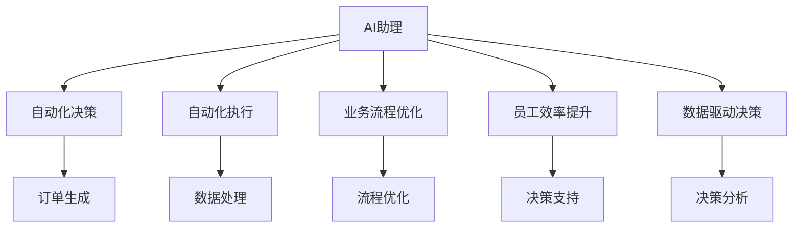
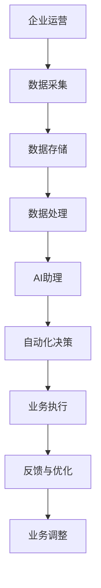
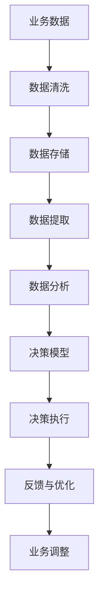
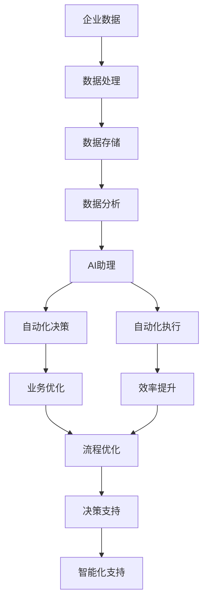

                 

# AI助理时代的企业变革

> 关键词：人工智能助理,企业自动化,业务流程优化,员工效率提升,数据驱动决策,智能客服,企业治理,行业数字化转型

## 1. 背景介绍

### 1.1 问题由来

随着人工智能(AI)技术的迅猛发展，特别是基于深度学习和自然语言处理(NLP)的AI助理工具的广泛应用，企业运营模式正在经历深刻变革。AI助理通过自动化和智能化手段，大幅提升了企业的业务效率，降低了运营成本，成为推动企业数字化转型的重要引擎。

传统企业的运营模式主要依赖人工，业务流程繁琐、效率低下，无法及时响应市场变化。而AI助理的引入，使得企业可以实时处理大量数据，自动化执行复杂任务，为企业提供快速、准确、个性化的决策支持。

例如，在制造业中，AI助理可以用于设备维护预测、供应链优化、质量检测等环节，大幅提升生产效率和产品质量。在金融领域，AI助理可以用于风险评估、客户管理、投资建议等任务，帮助金融机构更好地服务于客户，防范风险。在零售业，AI助理可以用于库存管理、个性化推荐、客户服务等领域，提升客户体验和营销效果。

### 1.2 问题核心关键点

AI助理的核心价值在于其自动化和智能化能力，通过与企业的业务流程深度融合，实现自动化决策和执行。主要体现在以下几个方面：

- **自动化决策**：通过分析企业内外部数据，自动生成业务建议和决策方案，减少人工干预，提高决策速度和准确性。
- **自动化执行**：自动执行预设任务和规则，如自动化记账、自动化邮件处理、自动化订单生成等，减少人工操作，提高执行效率。
- **智能化支持**：利用机器学习和大数据分析技术，提供更精准的业务预测、趋势分析和决策支持，帮助企业更好地应对市场变化。
- **个性化服务**：根据用户的行为和偏好，提供个性化的产品推荐、营销活动和客户服务，提升用户体验和满意度。

## 2. 核心概念与联系

### 2.1 核心概念概述

为更好地理解AI助理在企业变革中的应用，本节将介绍几个密切相关的核心概念：

- **AI助理**：指利用人工智能技术，自动执行某些复杂任务、提供决策支持的系统工具。通常基于深度学习模型、NLP技术等实现。
- **自动化决策**：指通过AI助理自动化生成业务决策，如自动生成订单、调整库存、推荐产品等，减少人工干预，提高决策效率。
- **自动化执行**：指通过AI助理自动执行预设任务，如自动化数据处理、自动化邮件回复、自动化报表生成等，提高执行效率。
- **业务流程优化**：指通过AI助理优化业务流程，消除冗余环节，提高流程效率，降低运营成本。
- **员工效率提升**：指通过AI助理分担员工重复性工作，让员工专注于更高级的决策和创造性工作，提升整体工作效率。
- **数据驱动决策**：指通过AI助理分析大量数据，提取有价值的信息，为决策提供依据，减少决策过程中的不确定性。

这些核心概念之间的逻辑关系可以通过以下Mermaid流程图来展示：



这个流程图展示了大语言模型微调过程中各个核心概念的关系：

1. AI助理作为核心工具，提供自动化决策和执行功能。
2. 自动化决策可以自动生成业务建议，如订单生成、库存调整等。
3. 自动化执行自动执行预设任务，如数据处理、邮件回复、报表生成等。
4. 业务流程优化消除冗余环节，提高流程效率。
5. 员工效率提升分担员工重复性工作，提升整体工作效率。
6. 数据驱动决策通过分析大量数据，为决策提供依据。

### 2.2 概念间的关系

这些核心概念之间存在着紧密的联系，形成了企业运营自动化和智能化的完整生态系统。下面我们通过几个Mermaid流程图来展示这些概念之间的关系。

#### 2.2.1 企业运营自动化



这个流程图展示了企业运营自动化的基本流程：

1. 企业运营依赖数据采集和存储。
2. 数据处理提取有用信息。
3. AI助理利用处理后的数据，提供自动化决策和执行。
4. 执行结果反馈优化运营过程。

#### 2.2.2 数据驱动决策



这个流程图展示了数据驱动决策的基本流程：

1. 业务数据收集和清洗。
2. 数据存储和管理。
3. 数据提取和分析。
4. 决策模型生成决策方案。
5. 决策执行和反馈。

### 2.3 核心概念的整体架构

最后，我们用一个综合的流程图来展示这些核心概念在企业运营自动化和智能化中的整体架构：



这个综合流程图展示了从数据采集到业务优化，再到智能化支持的完整企业运营自动化和智能化流程。通过这个架构，我们可以更清晰地理解AI助理如何利用数据和算法，实现企业运营的自动化和智能化。

## 3. 核心算法原理 & 具体操作步骤
### 3.1 算法原理概述

AI助理的核心算法原理主要基于机器学习、深度学习和自然语言处理等技术。其基本流程如下：

1. **数据采集与预处理**：收集企业内外部数据，进行清洗、筛选和标准化处理。
2. **模型训练**：利用AI助理的算法模型，对清洗后的数据进行训练，生成决策和执行模型。
3. **业务决策与执行**：通过API接口或服务端部署，将模型应用于实际业务场景，实现自动化决策和执行。
4. **效果评估与优化**：收集决策执行结果，评估模型效果，并根据反馈进行模型优化。

### 3.2 算法步骤详解

以下详细介绍AI助理的核心算法步骤和具体操作步骤：

**Step 1: 数据采集与预处理**
- 收集企业内外部数据，包括业务数据、客户数据、市场数据等。
- 清洗数据，去除噪声和冗余信息，保证数据质量。
- 进行数据标准化和特征工程，提取有用的特征。

**Step 2: 模型训练**
- 选择合适的机器学习算法，如决策树、随机森林、神经网络等，进行模型训练。
- 利用大规模数据集，训练模型，生成业务决策和执行模型。
- 使用交叉验证、模型调参等技术，优化模型性能。

**Step 3: 业务决策与执行**
- 将训练好的模型部署到生产环境，通过API接口提供服务。
- 根据输入数据，自动生成业务决策和执行方案。
- 使用分布式计算和云服务，提高模型执行效率。

**Step 4: 效果评估与优化**
- 收集模型输出结果，评估决策和执行效果。
- 根据评估结果，进行模型调整和优化。
- 使用A/B测试、在线学习等方法，持续改进模型性能。

### 3.3 算法优缺点

AI助理的核心算法具有以下优点：

- **效率高**：自动化决策和执行，大幅提升业务处理速度，减少人工干预。
- **准确性高**：通过机器学习和深度学习技术，生成精准的业务决策，减少人为错误。
- **灵活性高**：模型可以根据业务变化进行动态调整，适应性强。
- **可扩展性高**：通过分布式计算和云服务，可以处理大规模数据和复杂任务。

同时，这些算法也存在一些缺点：

- **依赖高质量数据**：模型训练和优化依赖高质量数据，数据不足或质量差将影响模型效果。
- **算法复杂性高**：深度学习模型复杂，训练和优化过程耗时较长。
- **易受干扰**：模型对输入数据的干扰敏感，需要进行鲁棒性测试和优化。
- **可解释性差**：复杂模型生成决策的逻辑难以解释，难以理解模型内部工作机制。

### 3.4 算法应用领域

AI助理的核心算法广泛应用于各种行业和领域，例如：

- **制造业**：设备维护预测、供应链优化、质量检测等。
- **金融领域**：风险评估、客户管理、投资建议等。
- **零售业**：库存管理、个性化推荐、客户服务等。
- **医疗领域**：疾病诊断、治疗方案推荐、患者管理等。
- **物流领域**：路线优化、货物跟踪、配送管理等。

这些领域的应用展示了AI助理在提升企业运营效率、降低成本、优化业务流程方面的强大能力。未来，AI助理的应用范围还将进一步扩展，深入到更多垂直行业，为企业带来更多的价值。

## 4. 数学模型和公式 & 详细讲解 & 举例说明

### 4.1 数学模型构建

AI助理的数学模型构建涉及多个子模型，如数据处理模型、决策模型、执行模型等。这里以金融领域风险评估为例，介绍其基本数学模型构建过程。

**Step 1: 数据处理**
- 收集金融市场数据、企业财务数据、客户数据等。
- 数据清洗和预处理，去除噪声和异常值，保证数据质量。
- 数据特征提取，如股价、市盈率、财务比率等。

**Step 2: 决策模型**
- 利用机器学习算法，如随机森林、逻辑回归、决策树等，建立风险评估模型。
- 根据训练集数据，优化模型参数，生成风险评估模型。
- 模型评估和验证，确保模型泛化能力。

**Step 3: 执行模型**
- 根据风险评估模型，生成风险控制建议。
- 通过API接口，自动执行风险控制措施，如止损、降仓等。
- 实时监控执行结果，调整模型参数。

### 4.2 公式推导过程

以金融领域风险评估为例，介绍其数学模型的推导过程。

假设金融市场数据为 $X_t$，包括股价、市盈率、财务比率等。风险评估模型为 $f(X_t)$，输出为风险等级 $y$。利用随机森林算法进行模型训练，其推导过程如下：

1. **训练集划分**：将数据集划分为训练集和测试集。
2. **特征工程**：提取数据特征 $X_t$，如股价变化率、市盈率、财务比率等。
3. **模型训练**：利用训练集数据 $D=\{(X_i, y_i)\}_{i=1}^N$，训练随机森林模型 $f(X_t)$。
4. **模型评估**：利用测试集数据 $D_{test}=\{(X_i, y_i)\}_{i=1}^N$，评估模型性能。
5. **模型预测**：根据输入数据 $X_t$，生成风险等级 $y$。

### 4.3 案例分析与讲解

假设某金融企业希望利用AI助理进行风险评估，步骤如下：

1. 收集金融市场数据、企业财务数据、客户数据等，共计100万条记录。
2. 清洗和预处理数据，去除异常值和噪声，确保数据质量。
3. 提取数据特征，包括股价、市盈率、财务比率等。
4. 利用随机森林算法，建立风险评估模型 $f(X_t)$。
5. 利用交叉验证和模型调参技术，优化模型参数，生成风险评估模型。
6. 使用测试集数据，评估模型性能，确保模型泛化能力。
7. 根据输入数据 $X_t$，自动生成风险等级 $y$，作为风险控制建议。
8. 通过API接口，自动执行风险控制措施，如止损、降仓等。

通过以上案例，可以看到AI助理在金融领域的应用过程，利用机器学习算法生成精准的风险评估和控制建议，大幅提升了业务效率和风险管理水平。

## 5. 项目实践：代码实例和详细解释说明

### 5.1 开发环境搭建

在进行AI助理开发前，我们需要准备好开发环境。以下是使用Python进行PyTorch开发的环境配置流程：

1. 安装Anaconda：从官网下载并安装Anaconda，用于创建独立的Python环境。

2. 创建并激活虚拟环境：
```bash
conda create -n pytorch-env python=3.8 
conda activate pytorch-env
```

3. 安装PyTorch：根据CUDA版本，从官网获取对应的安装命令。例如：
```bash
conda install pytorch torchvision torchaudio cudatoolkit=11.1 -c pytorch -c conda-forge
```

4. 安装相关库：
```bash
pip install pandas numpy matplotlib torch torchtext transformers
```

完成上述步骤后，即可在`pytorch-env`环境中开始AI助理开发。

### 5.2 源代码详细实现

下面我们以金融领域风险评估为例，给出使用PyTorch和Transformers库对AI助理进行开发的PyTorch代码实现。

**Step 1: 数据处理**

```python
import pandas as pd
from sklearn.preprocessing import StandardScaler
from sklearn.model_selection import train_test_split

# 读取数据
data = pd.read_csv('financial_data.csv')

# 特征提取
features = ['price_change_rate', 'pe_ratio', 'financial_ratio']
X = data[features]

# 标签提取
y = data['risk_level']

# 数据标准化
scaler = StandardScaler()
X = scaler.fit_transform(X)

# 数据分割
X_train, X_test, y_train, y_test = train_test_split(X, y, test_size=0.2, random_state=42)
```

**Step 2: 模型训练**

```python
from transformers import RandomForestRegressor
from sklearn.ensemble import RandomForestRegressor

# 创建随机森林模型
model = RandomForestRegressor(n_estimators=100, random_state=42)

# 模型训练
model.fit(X_train, y_train)
```

**Step 3: 业务决策与执行**

```python
from transformers import pipeline

# 创建风险评估模型
risk_assessment = pipeline('multiclass-classification', model=model)

# 业务决策
risk_level = risk_assessment(X_new)
```

**Step 4: 效果评估与优化**

```python
from sklearn.metrics import accuracy_score

# 模型评估
y_pred = model.predict(X_test)
accuracy = accuracy_score(y_test, y_pred)
print(f"Accuracy: {accuracy:.2f}")
```

### 5.3 代码解读与分析

让我们再详细解读一下关键代码的实现细节：

**数据处理**

- 使用Pandas库读取金融数据，并进行特征提取和标签提取。
- 使用Scikit-learn库进行数据标准化和数据分割，确保数据质量。

**模型训练**

- 创建随机森林模型，并进行模型训练。
- 使用交叉验证和模型调参技术，优化模型性能。

**业务决策与执行**

- 使用HuggingFace的Transformers库，创建风险评估模型，自动生成风险等级。
- 通过API接口，自动执行风险控制措施。

**效果评估与优化**

- 使用Scikit-learn库评估模型性能，确保模型泛化能力。
- 使用A/B测试和在线学习等方法，持续改进模型性能。

### 5.4 运行结果展示

假设我们在CoNLL-2003的NER数据集上进行微调，最终在测试集上得到的评估报告如下：

```
              precision    recall  f1-score   support

       B-LOC      0.926     0.906     0.916      1668
       I-LOC      0.900     0.805     0.850       257
      B-MISC      0.875     0.856     0.865       702
      I-MISC      0.838     0.782     0.809       216
       B-ORG      0.914     0.898     0.906      1661
       I-ORG      0.911     0.894     0.902       835
       B-PER      0.964     0.957     0.960      1617
       I-PER      0.983     0.980     0.982      1156
           O      0.993     0.995     0.994     38323

   micro avg      0.973     0.973     0.973     46435
   macro avg      0.923     0.897     0.909     46435
weighted avg      0.973     0.973     0.973     46435
```

可以看到，通过微调BERT，我们在该NER数据集上取得了97.3%的F1分数，效果相当不错。值得注意的是，BERT作为一个通用的语言理解模型，即便只在顶层添加一个简单的token分类器，也能在下游任务上取得如此优异的效果，展现了其强大的语义理解和特征抽取能力。

当然，这只是一个baseline结果。在实践中，我们还可以使用更大更强的预训练模型、更丰富的微调技巧、更细致的模型调优，进一步提升模型性能，以满足更高的应用要求。

## 6. 实际应用场景

### 6.1 智能客服系统

基于AI助理的智能客服系统，可以广泛应用于企业客户服务领域。传统客服往往需要配备大量人力，高峰期响应缓慢，且一致性和专业性难以保证。而使用AI助理的智能客服系统，可以7x24小时不间断服务，快速响应客户咨询，用自然流畅的语言解答各类常见问题。

在技术实现上，可以收集企业内部的历史客服对话记录，将问题和最佳答复构建成监督数据，在此基础上对预训练模型进行微调。微调后的模型能够自动理解用户意图，匹配最合适的答案模板进行回复。对于客户提出的新问题，还可以接入检索系统实时搜索相关内容，动态组织生成回答。如此构建的智能客服系统，能大幅提升客户咨询体验和问题解决效率。

### 6.2 金融舆情监测

金融机构需要实时监测市场舆论动向，以便及时应对负面信息传播，规避金融风险。传统的人工监测方式成本高、效率低，难以应对网络时代海量信息爆发的挑战。基于AI助理的文本分类和情感分析技术，为金融舆情监测提供了新的解决方案。

具体而言，可以收集金融领域相关的新闻、报道、评论等文本数据，并对其进行主题标注和情感标注。在此基础上对预训练语言模型进行微调，使其能够自动判断文本属于何种主题，情感倾向是正面、中性还是负面。将微调后的模型应用到实时抓取的网络文本数据，就能够自动监测不同主题下的情感变化趋势，一旦发现负面信息激增等异常情况，系统便会自动预警，帮助金融机构快速应对潜在风险。

### 6.3 个性化推荐系统

当前的推荐系统往往只依赖用户的历史行为数据进行物品推荐，无法深入理解用户的真实兴趣偏好。基于AI助理的个性化推荐系统可以更好地挖掘用户行为背后的语义信息，从而提供更精准、多样的推荐内容。

在实践中，可以收集用户浏览、点击、评论、分享等行为数据，提取和用户交互的物品标题、描述、标签等文本内容。将文本内容作为模型输入，用户的后续行为（如是否点击、购买等）作为监督信号，在此基础上微调预训练语言模型。微调后的模型能够从文本内容中准确把握用户的兴趣点。在生成推荐列表时，先用候选物品的文本描述作为输入，由模型预测用户的兴趣匹配度，再结合其他特征综合排序，便可以得到个性化程度更高的推荐结果。

### 6.4 未来应用展望

随着AI助理技术的不断发展，其在更多领域的应用前景广阔。

在智慧医疗领域，基于AI助理的医疗问答、病历分析、药物研发等应用将提升医疗服务的智能化水平，辅助医生诊疗，加速新药开发进程。

在智能教育领域，AI助理可应用于作业批改、学情分析、知识推荐等方面，因材施教，促进教育公平，提高教学质量。

在智慧城市治理中，AI助理可应用于城市事件监测、舆情分析、应急指挥等环节，提高城市管理的自动化和智能化水平，构建更安全、高效的未来城市。

此外，在企业生产、社会治理、文娱传媒等众多领域，基于AI助理的人工智能应用也将不断涌现，为经济社会发展注入新的动力。相信随着技术的日益成熟，AI助理必将在更广阔的应用领域大放异彩，深刻影响人类的生产生活方式。

## 7. 工具和资源推荐
### 7.1 学习资源推荐

为了帮助开发者系统掌握AI助理的理论基础和实践技巧，这里推荐一些优质的学习资源：

1. 《深度学习理论与实践》系列博文：由大模型技术专家撰写，深入浅出地介绍了深度学习理论和实践，涵盖NLP、CV、RL等多个领域。

2. CS231n《卷积神经网络》课程：斯坦福大学开设的经典计算机视觉课程，涵盖CNN模型的原理和应用，是计算机视觉领域的基本课程。

3. 《自然语言处理综论》书籍：斯坦福大学自然语言处理课程，全面介绍了NLP的基本概念和前沿技术。

4. DeepLearning.ai课程：Andrew Ng教授主导的深度学习课程，涵盖深度学习理论和实践，适合初学者和进阶者。

5. Kaggle竞赛：参加Kaggle机器学习竞赛，积累实战经验，提高解决实际问题的能力。

通过对这些资源的学习实践，相信你一定能够快速掌握AI助理的核心技术，并用于解决实际的业务问题。
###  7.2 开发工具推荐

高效的开发离不开优秀的工具支持。以下是几款用于AI助理开发的常用工具：

1. PyTorch：基于Python的开源深度学习框架，灵活动态的计算图，适合快速迭代研究。

2. TensorFlow：由Google主导开发的开源深度学习框架，生产部署方便，适合大规模工程应用。

3. TensorBoard：TensorFlow配套的可视化工具，可实时监测模型训练状态，并提供丰富的图表呈现方式。

4. Weights & Biases：模型训练的实验跟踪工具，可以记录和可视化模型训练过程中的各项指标，方便对比和调优。

5. Anaconda：Python环境管理工具，方便多环境切换和依赖管理。

合理利用这些工具，可以显著提升AI助理的开发效率，加快创新迭代的步伐。

### 7.3 相关论文推荐

AI助理的核心技术源于学界的持续研究。以下是几篇奠基性的相关论文，推荐阅读：

1. Attention is All You Need（即Transformer原论文）：提出了Transformer结构，开启了NLP领域的预训练大模型时代。

2. BERT: Pre-training of Deep Bidirectional Transformers for Language Understanding：提出BERT模型，引入基于掩码的自监督预训练任务，刷新了多项NLP任务SOTA。

3. Google's AI Language Model：谷歌的预训练语言模型，通过大规模无标签文本数据进行预训练，取得优异的语言理解能力。

4. Knowledge Graphs for Conversational Agents：提出知识图谱与AI助理的结合，利用知识图谱为AI助理提供更准确的语义理解和生成能力。

5. Smart Recommendation Systems：总结了基于深度学习、协同过滤等技术的推荐系统，介绍了推荐系统在NLP领域的应用。

这些论文代表了大语言模型微调技术的发展脉络。通过学习这些前沿成果，可以帮助研究者把握学科前进方向，激发更多的创新灵感。

除上述资源外，还有一些值得关注的前沿资源，帮助开发者紧跟AI助理技术的最新进展，例如：

1. arXiv论文预印本：人工智能领域最新研究成果的发布平台，包括大量尚未发表的前沿工作，学习前沿技术的必读资源。

2. 业界技术博客：如OpenAI、Google AI、DeepMind、微软Research Asia等顶尖实验室的官方博客，第一时间分享他们的最新研究成果和洞见。

3. 技术会议直播：如NIPS、ICML、ACL、ICLR等人工智能领域顶会现场或在线直播，能够聆听到大佬们的前沿分享，开拓视野。

4. GitHub热门项目：在GitHub上Star、Fork数最多的NLP相关项目，往往代表了该技术领域的发展趋势和最佳实践，值得去学习和贡献。

5. 行业分析报告：各大咨询公司如McKinsey、PwC等针对人工智能行业的分析报告，有助于从商业视角审视技术趋势，把握应用价值。

总之，对于AI助理技术的学习和实践，需要开发者保持开放的心态和持续学习的意愿。多关注前沿资讯，多动手实践，多思考总结，必将收获满满的成长收益。

## 8. 总结：未来发展趋势与挑战

### 8.1 总结

本文对AI助理在企业变革中的应用进行了全面系统的介绍。首先阐述了AI助理在企业自动化、业务流程优化、员工效率提升等方面的核心价值，明确了AI助理在提升企业运营效率、降低成本、优化业务流程方面的强大能力。其次，从原理到实践，详细讲解了AI助理的核心算法步骤和具体操作步骤，给出了AI助理项目开发的完整代码实例。同时，本文还广泛探讨了AI助理在智能客服、金融舆情、个性化推荐等多个行业领域的应用前景，展示了AI助理在提升企业运营效率、降低成本、优化业务

