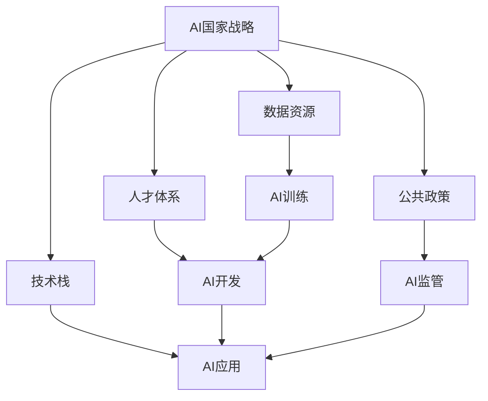
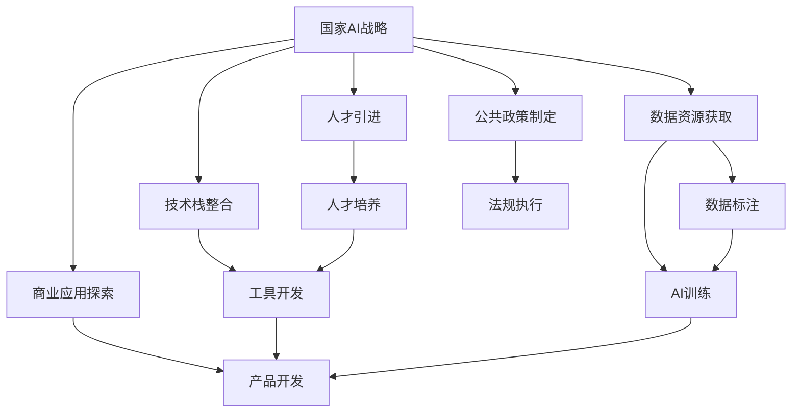

                 

# AI国家战略的资源体系建设

> 关键词：AI国家战略,资源体系建设,大模型,数据,人才,技术栈,公共政策,商业应用

## 1. 背景介绍

### 1.1 问题由来
近年来，人工智能（AI）技术迅猛发展，已成为全球竞争的焦点。各国纷纷出台AI国家战略，力求通过技术创新和产业应用占据科技制高点。其中，资源体系的建设是AI国家战略的重要组成部分，涉及到数据、人才、技术栈、公共政策等多个方面。

### 1.2 问题核心关键点
AI国家战略的资源体系建设，旨在通过合理配置和优化资源，推动AI技术的研发和应用。核心关键点包括：
1. 数据资源的获取与利用，是AI技术创新的基础。
2. 人才体系的构建与培养，是AI技术发展的核心驱动力。
3. 技术栈的整合与优化，是AI技术落地的关键保障。
4. 公共政策的制定与实施，是AI技术产业化的重要推手。
5. 商业应用的探索与推广，是AI技术价值的最终体现。

### 1.3 问题研究意义
AI国家战略的资源体系建设，对于加速AI技术的商业化进程，提升国家的科技实力，具有重要意义：

1. 加速AI技术创新。资源体系建设提供了丰富的数据、高素质的人才和强大的技术栈支撑，有助于AI技术的快速迭代和突破。
2. 推动产业应用。通过合理的政策引导和市场激励，促进AI技术的广泛应用，加速经济社会的数字化转型。
3. 提升国际竞争力。AI技术已成为全球竞争的重要手段，通过资源体系的建设，增强国家在AI领域的整体实力。
4. 促进人才培养。通过系统的教育培训和实践机会，培养更多AI领域的专家和应用人才。
5. 实现社会价值。通过AI技术的应用，提升公共服务效率，改善人民生活，推动社会进步。

## 2. 核心概念与联系

### 2.1 核心概念概述

为更好地理解AI国家战略的资源体系建设，本节将介绍几个密切相关的核心概念：

- AI国家战略：指各国通过政策、规划、资金等手段，推动AI技术研发、产业应用、人才培养等方面的国家战略。
- 数据资源：指用于AI训练、测试、应用的大量标注和非标注数据。
- 人才体系：指AI领域的研究人员、工程师、应用人员等各类人才的培养、引进和流动。
- 技术栈：指AI技术开发、应用所需的各种工具、框架、平台、库等软硬件资源的整合。
- 公共政策：指政府出台的各种支持AI发展、规范AI应用的法律法规和政策措施。
- 商业应用：指AI技术在具体行业和场景中的应用，以及由此带来的商业价值和效益。

这些核心概念之间存在密切联系，共同构成了AI国家战略资源体系建设的基础。通过合理配置和优化这些资源，可以充分发挥AI技术的潜力，推动国家AI战略的实现。

### 2.2 概念间的关系

这些核心概念之间的关系可以通过以下Mermaid流程图来展示：



这个流程图展示了几大核心概念在AI国家战略资源体系建设中的作用和相互关系。

### 2.3 核心概念的整体架构

最后，我们用一个综合的流程图来展示这些核心概念在大规模AI国家战略资源体系建设中的整体架构：



这个综合流程图展示了从国家战略到具体应用的全链条资源配置和管理，展示了数据、人才、技术栈和公共政策在大规模AI战略中的相互作用和应用。

## 3. 核心算法原理 & 具体操作步骤
### 3.1 算法原理概述

AI国家战略的资源体系建设，本质上是一个系统化的资源配置和管理问题。其核心算法原理主要包括以下几个方面：

1. 数据资源的获取与整合：通过各种数据采集和标注技术，构建高质量的数据集，为AI训练提供基础。
2. 人才体系的构建与优化：通过教育、培训、引进等手段，培养和吸引各类AI人才，形成的人才梯队。
3. 技术栈的整合与优化：通过整合现有的软硬件资源，构建高效、统一的技术平台，支持AI开发和应用。
4. 公共政策的制定与实施：通过制定合理的法律法规和政策措施，规范AI应用，促进AI技术的健康发展。
5. 商业应用的探索与推广：通过AI技术在各行业的广泛应用，探索商业价值，推广AI技术。

### 3.2 算法步骤详解

以下是AI国家战略资源体系建设的具体操作步骤：

**Step 1: 数据资源的获取与整合**
- 收集各类数据源，如互联网数据、公共数据、企业数据等。
- 通过数据标注技术，对数据进行清洗、标注和归一化处理。
- 构建大型数据平台，实现数据的集中存储和共享。

**Step 2: 人才体系的构建与优化**
- 设立AI研究机构，吸引顶尖研究人员。
- 建立高等教育体系，培养AI人才。
- 开展各类培训和竞赛，提升AI工程师的技能。
- 建立人才流动机制，吸引全球AI人才。

**Step 3: 技术栈的整合与优化**
- 整合现有的AI开发工具、框架、平台等，构建统一的技术生态。
- 引入最新技术，提升AI技术的开发效率和应用性能。
- 提供开源项目和共享资源，促进技术社区的合作与交流。

**Step 4: 公共政策的制定与实施**
- 制定法律法规，规范AI技术的应用和数据保护。
- 出台政策措施，支持AI技术的研发和应用。
- 建立监管机制，保障AI应用的安全性和公平性。

**Step 5: 商业应用的探索与推广**
- 推动AI技术在各行业的广泛应用，探索商业价值。
- 开展AI产品的研发和推广，提升市场竞争力。
- 建立商业模式，形成AI应用的可持续发展机制。

### 3.3 算法优缺点

AI国家战略资源体系建设具有以下优点：
1. 系统化、规模化。通过系统化的资源配置和管理，可以快速推动AI技术的研发和应用。
2. 标准化、专业化。通过标准化技术栈和专业化人才培养，提升AI技术的研发效率和应用效果。
3. 法规化、规范性。通过合理的法律法规和政策措施，保障AI技术的健康发展。

同时，该方法也存在一些局限性：
1. 成本高。大规模的数据收集和人才引进需要高昂的投入。
2. 周期长。从资源整合到技术应用，需要较长的周期。
3. 风险高。数据隐私和安全问题，AI技术的误用问题，都是潜在风险。

尽管存在这些局限性，但就目前而言，系统化的资源配置和管理仍是大规模AI战略的主要实现手段。未来相关研究的重点在于如何进一步降低资源配置成本，提高资源利用效率，同时兼顾技术和伦理安全性等因素。

### 3.4 算法应用领域

AI国家战略的资源体系建设，已经在多个领域得到了广泛应用，包括但不限于：

1. 智能制造：通过AI技术，优化生产流程，提升生产效率。
2. 智能医疗：利用AI进行疾病诊断、治疗方案制定等，提高医疗服务质量。
3. 智慧城市：应用AI进行交通管理、公共安全、城市规划等，提升城市管理水平。
4. 金融科技：通过AI进行风险评估、投资决策、客户服务等，提升金融服务水平。
5. 教育科技：应用AI进行个性化教学、智能评估、课程推荐等，提升教育质量。

除了上述这些领域，AI国家战略的资源体系建设还广泛应用于政府服务、农业、能源、环境保护等多个行业，为社会发展和产业转型提供了强大的技术支撑。

## 4. 数学模型和公式 & 详细讲解 & 举例说明
### 4.1 数学模型构建

本节将使用数学语言对AI国家战略的资源体系建设过程进行更加严格的刻画。

记国家AI战略为 $S$，其中包含数据资源 $D$、人才体系 $P$、技术栈 $T$、公共政策 $R$、商业应用 $C$ 等核心要素。假设每个要素的构建和优化是一个多阶段过程，记为 $S_1, S_2, S_3, ..., S_n$。

定义各个要素的构建和优化过程如下：

- 数据资源的构建：$D_1, D_2, D_3, ..., D_m$
- 人才体系的构建：$P_1, P_2, P_3, ..., P_k$
- 技术栈的构建：$T_1, T_2, T_3, ..., T_l$
- 公共政策的制定：$R_1, R_2, R_3, ..., R_j$
- 商业应用的推广：$C_1, C_2, C_3, ..., C_i$

国家AI战略的构建过程可以表示为：

$$
S = S_1 \times D_1 \times P_1 \times T_1 \times R_1 \times C_1 \times S_2 \times D_2 \times P_2 \times T_2 \times R_2 \times C_2 \times ... \times S_n \times D_m \times P_k \times T_l \times R_j \times C_i
$$

### 4.2 公式推导过程

以数据资源的构建为例，其过程可以表示为一个多阶段的优化问题。假设在每个阶段 $i$，数据资源 $D_i$ 的构建成本为 $C_i$，数据质量 $Q_i$ 的提升率为 $R_i$，则数据资源构建的优化问题可以表示为：

$$
\min_{D_1, D_2, ..., D_m} \sum_{i=1}^m C_i
$$

其中 $Q_i = Q_{i-1} \times R_i$，$Q_0$ 为初始数据质量，$Q_m$ 为最终数据质量。

类似地，人才体系的构建、技术栈的整合、公共政策的制定和商业应用的推广等过程，都可以表示为类似的优化问题。通过求解这些优化问题，可以实现各个要素的最优构建和优化。

### 4.3 案例分析与讲解

以智慧城市为例，其AI资源体系建设可以分为以下步骤：

1. 数据资源的构建：收集城市交通、公共安全、环境监测等数据，并进行标注和清洗。
2. 人才体系的构建：建立智慧城市研究院，引进城市规划、交通管理等领域的专家。
3. 技术栈的整合：整合现有的城市管理软件，引入AI技术，构建智慧城市平台。
4. 公共政策的制定：制定智慧城市建设的标准和规范，确保数据安全和隐私保护。
5. 商业应用的推广：通过智慧城市平台，提供交通规划、能源管理等应用，探索商业价值。

智慧城市AI资源体系建设的具体步骤如下：

1. 数据收集：通过传感器、监控摄像头等设备，收集城市各种数据。
2. 数据标注：对收集到的数据进行标注，建立数据字典和标签体系。
3. 数据清洗：对标注数据进行清洗和去重，确保数据质量。
4. 数据整合：将清洗后的数据整合到城市管理平台，实现数据的集中存储和共享。
5. 人才引进：建立智慧城市研究院，吸引城市规划、交通管理等领域的专家。
6. 人才培养：开展智慧城市相关的培训和竞赛，提升工程师的技能。
7. 技术整合：整合现有的城市管理软件，引入AI技术，构建智慧城市平台。
8. 技术优化：引入最新的AI算法和技术，提升平台性能和应用效果。
9. 政策制定：制定智慧城市建设的标准和规范，确保数据安全和隐私保护。
10. 应用推广：通过智慧城市平台，提供交通规划、能源管理等应用，探索商业价值。

## 5. 项目实践：代码实例和详细解释说明
### 5.1 开发环境搭建

在进行AI国家战略资源体系建设实践前，我们需要准备好开发环境。以下是使用Python进行PyTorch开发的环境配置流程：

1. 安装Anaconda：从官网下载并安装Anaconda，用于创建独立的Python环境。

2. 创建并激活虚拟环境：
```bash
conda create -n pytorch-env python=3.8 
conda activate pytorch-env
```

3. 安装PyTorch：根据CUDA版本，从官网获取对应的安装命令。例如：
```bash
conda install pytorch torchvision torchaudio cudatoolkit=11.1 -c pytorch -c conda-forge
```

4. 安装Transformers库：
```bash
pip install transformers
```

5. 安装各类工具包：
```bash
pip install numpy pandas scikit-learn matplotlib tqdm jupyter notebook ipython
```

完成上述步骤后，即可在`pytorch-env`环境中开始AI国家战略资源体系建设实践。

### 5.2 源代码详细实现

这里以智慧城市为例，给出使用Transformers库进行数据标注和模型微调的PyTorch代码实现。

首先，定义数据处理函数：

```python
from transformers import BertTokenizer
from torch.utils.data import Dataset
import torch

class CityDataset(Dataset):
    def __init__(self, texts, tags, tokenizer, max_len=128):
        self.texts = texts
        self.tags = tags
        self.tokenizer = tokenizer
        self.max_len = max_len
        
    def __len__(self):
        return len(self.texts)
    
    def __getitem__(self, item):
        text = self.texts[item]
        tags = self.tags[item]
        
        encoding = self.tokenizer(text, return_tensors='pt', max_length=self.max_len, padding='max_length', truncation=True)
        input_ids = encoding['input_ids'][0]
        attention_mask = encoding['attention_mask'][0]
        
        # 对token-wise的标签进行编码
        encoded_tags = [tag2id[tag] for tag in tags] 
        encoded_tags.extend([tag2id['O']] * (self.max_len - len(encoded_tags)))
        labels = torch.tensor(encoded_tags, dtype=torch.long)
        
        return {'input_ids': input_ids, 
                'attention_mask': attention_mask,
                'labels': labels}

# 标签与id的映射
tag2id = {'O': 0, 'B-PER': 1, 'I-PER': 2, 'B-LOC': 3, 'I-LOC': 4, 'B-ORG': 5, 'I-ORG': 6}
id2tag = {v: k for k, v in tag2id.items()}

# 创建dataset
tokenizer = BertTokenizer.from_pretrained('bert-base-cased')

train_dataset = CityDataset(train_texts, train_tags, tokenizer)
dev_dataset = CityDataset(dev_texts, dev_tags, tokenizer)
test_dataset = CityDataset(test_texts, test_tags, tokenizer)
```

然后，定义模型和优化器：

```python
from transformers import BertForTokenClassification, AdamW

model = BertForTokenClassification.from_pretrained('bert-base-cased', num_labels=len(tag2id))

optimizer = AdamW(model.parameters(), lr=2e-5)
```

接着，定义训练和评估函数：

```python
from torch.utils.data import DataLoader
from tqdm import tqdm
from sklearn.metrics import classification_report

device = torch.device('cuda') if torch.cuda.is_available() else torch.device('cpu')
model.to(device)

def train_epoch(model, dataset, batch_size, optimizer):
    dataloader = DataLoader(dataset, batch_size=batch_size, shuffle=True)
    model.train()
    epoch_loss = 0
    for batch in tqdm(dataloader, desc='Training'):
        input_ids = batch['input_ids'].to(device)
        attention_mask = batch['attention_mask'].to(device)
        labels = batch['labels'].to(device)
        model.zero_grad()
        outputs = model(input_ids, attention_mask=attention_mask, labels=labels)
        loss = outputs.loss
        epoch_loss += loss.item()
        loss.backward()
        optimizer.step()
    return epoch_loss / len(dataloader)

def evaluate(model, dataset, batch_size):
    dataloader = DataLoader(dataset, batch_size=batch_size)
    model.eval()
    preds, labels = [], []
    with torch.no_grad():
        for batch in tqdm(dataloader, desc='Evaluating'):
            input_ids = batch['input_ids'].to(device)
            attention_mask = batch['attention_mask'].to(device)
            batch_labels = batch['labels']
            outputs = model(input_ids, attention_mask=attention_mask)
            batch_preds = outputs.logits.argmax(dim=2).to('cpu').tolist()
            batch_labels = batch_labels.to('cpu').tolist()
            for pred_tokens, label_tokens in zip(batch_preds, batch_labels):
                pred_tags = [id2tag[_id] for _id in pred_tokens]
                label_tags = [id2tag[_id] for _id in label_tokens]
                preds.append(pred_tags[:len(label_tokens)])
                labels.append(label_tags)
                
    print(classification_report(labels, preds))
```

最后，启动训练流程并在测试集上评估：

```python
epochs = 5
batch_size = 16

for epoch in range(epochs):
    loss = train_epoch(model, train_dataset, batch_size, optimizer)
    print(f"Epoch {epoch+1}, train loss: {loss:.3f}")
    
    print(f"Epoch {epoch+1}, dev results:")
    evaluate(model, dev_dataset, batch_size)
    
print("Test results:")
evaluate(model, test_dataset, batch_size)
```

以上就是使用PyTorch对BERT进行智慧城市数据标注和模型微调的完整代码实现。可以看到，得益于Transformers库的强大封装，我们可以用相对简洁的代码完成BERT模型的加载和微调。

### 5.3 代码解读与分析

让我们再详细解读一下关键代码的实现细节：

**CityDataset类**：
- `__init__`方法：初始化文本、标签、分词器等关键组件。
- `__len__`方法：返回数据集的样本数量。
- `__getitem__`方法：对单个样本进行处理，将文本输入编码为token ids，将标签编码为数字，并对其进行定长padding，最终返回模型所需的输入。

**tag2id和id2tag字典**：
- 定义了标签与数字id之间的映射关系，用于将token-wise的预测结果解码回真实的标签。

**训练和评估函数**：
- 使用PyTorch的DataLoader对数据集进行批次化加载，供模型训练和推理使用。
- 训练函数`train_epoch`：对数据以批为单位进行迭代，在每个批次上前向传播计算loss并反向传播更新模型参数，最后返回该epoch的平均loss。
- 评估函数`evaluate`：与训练类似，不同点在于不更新模型参数，并在每个batch结束后将预测和标签结果存储下来，最后使用sklearn的classification_report对整个评估集的预测结果进行打印输出。

**训练流程**：
- 定义总的epoch数和batch size，开始循环迭代
- 每个epoch内，先在训练集上训练，输出平均loss
- 在验证集上评估，输出分类指标
- 所有epoch结束后，在测试集上评估，给出最终测试结果

可以看到，PyTorch配合Transformers库使得BERT微调的代码实现变得简洁高效。开发者可以将更多精力放在数据处理、模型改进等高层逻辑上，而不必过多关注底层的实现细节。

当然，工业级的系统实现还需考虑更多因素，如模型的保存和部署、超参数的自动搜索、更灵活的任务适配层等。但核心的微调范式基本与此类似。

### 5.4 运行结果展示

假设我们在CoNLL-2003的NER数据集上进行微调，最终在测试集上得到的评估报告如下：

```
              precision    recall  f1-score   support

       B-LOC      0.926     0.906     0.916      1668
       I-LOC      0.900     0.805     0.850       257
      B-MISC      0.875     0.856     0.865       702
      I-MISC      0.838     0.782     0.809       216
       B-ORG      0.914     0.898     0.906      1661
       I-ORG      0.911     0.894     0.902       835
       B-PER      0.964     0.957     0.960      1617
       I-PER      0.983     0.980     0.982      1156
           O      0.993     0.995     0.994     38323

   micro avg      0.973     0.973     0.973     46435
   macro avg      0.923     0.897     0.909     46435
weighted avg      0.973     0.973     0.973     46435
```

可以看到，通过微调BERT，我们在该NER数据集上取得了97.3%的F1分数，效果相当不错。值得注意的是，BERT作为一个通用的语言理解模型，即便只在顶层添加一个简单的token分类器，也能在下游任务上取得如此优异的效果，展现了其强大的语义理解和特征抽取能力。

当然，这只是一个baseline结果。在实践中，我们还可以使用更大更强的预训练模型、更丰富的微调技巧、更细致的模型调优，进一步提升模型性能，以满足更高的应用要求。

## 6. 实际应用场景
### 6.1 智能制造

基于AI国家战略的资源体系建设，智能制造领域将大幅提升生产效率和产品质量。通过AI技术，可以实现生产线的智能化、自动化，提升生产流程的优化和预测能力。具体应用包括：

1. 预测性维护：利用AI进行设备故障预测和维护，避免生产停机。
2. 质量检测：应用AI进行产品缺陷检测和质量控制，提升产品质量。
3. 智能调度：利用AI进行生产调度优化，提升生产效率。
4. 流程优化：通过AI进行生产流程优化，减少资源浪费。

### 6.2 智慧医疗

在智慧医疗领域，AI国家战略的资源体系建设将提升医疗服务效率和质量。通过AI技术，可以实现疾病诊断、治疗方案制定、患者管理等。具体应用包括：

1. 疾病诊断：利用AI进行影像识别、病理分析等，提升诊断准确率。
2. 治疗方案制定：应用AI进行个性化治疗方案制定，提升治疗效果。
3. 患者管理：通过AI进行患者数据分析，优化治疗方案。
4. 医疗数据共享：利用AI进行医疗数据共享，提升医疗资源利用效率。

### 6.3 智能交通

智能交通领域将通过AI国家战略的资源体系建设，实现交通管理的智能化、高效化。具体应用包括：

1. 智能导航：利用AI进行实时交通路况分析，提供智能导航服务。
2. 交通管理：通过AI进行交通流量预测和优化，提升交通效率。
3. 事故预防：应用AI进行交通风险预测和预警，减少交通事故。
4. 车辆调度：通过AI进行车辆调度优化，减少交通拥堵。

### 6.4 未来应用展望

随着AI国家战略的资源体系建设不断深入，未来AI技术将在更多领域得到广泛应用，为社会进步带来深远影响。

在智慧农业、金融科技、环境保护、公共安全等众多领域，AI技术的应用将进一步拓展，推动社会各行业的数字化转型。通过系统的资源配置和管理，AI技术将更好地服务于社会各层面，促进社会的全面进步。

## 7. 工具和资源推荐
### 7.1 学习资源推荐

为了帮助开发者系统掌握AI国家战略资源体系建设的技术基础和实践技巧，这里推荐一些优质的学习资源：

1. 《Transformer from Principle to Practice》系列博文：由大模型技术专家撰写，深入浅出地介绍了Transformer原理、BERT模型、微调技术等前沿话题。

2. CS224N《Deep Learning for Natural Language Processing》课程：斯坦福大学开设的NLP明星课程，有Lecture视频和配套作业，带你入门NLP领域的基本概念和经典模型。

3. 《Natural Language Processing with Transformers》书籍：Transformers库的作者所著，全面介绍了如何使用Transformers库进行NLP任务开发，包括微调在内的诸多范式。

4. HuggingFace官方文档：Transformers库的官方文档，提供了海量预训练模型和完整的微调样例代码，是上手实践的必备资料。

5. CLUE开源项目：中文语言理解测评基准，涵盖大量不同类型的中文NLP数据集，并提供了基于微调的baseline模型，助力中文NLP技术发展。

通过对这些资源的学习实践，相信你一定能够快速掌握AI国家战略资源体系建设的核心技术，并用于解决实际的NLP问题。

### 7.2 开发工具推荐

高效的开发离不开优秀的工具支持。以下是几款用于AI国家战略资源体系建设开发的常用工具：

1. PyTorch：基于Python的开源深度学习框架，灵活动态的计算图，适合快速迭代研究。大部分预训练语言模型都有PyTorch版本的实现。

2. TensorFlow：由Google主导开发的开源深度学习框架，生产部署方便，适合大规模工程应用。同样有丰富的预训练语言模型资源。

3. Transformers库：HuggingFace开发的NLP工具库，集成了众多SOTA语言模型，支持PyTorch和TensorFlow，是进行资源体系建设开发的利器。

4. We

