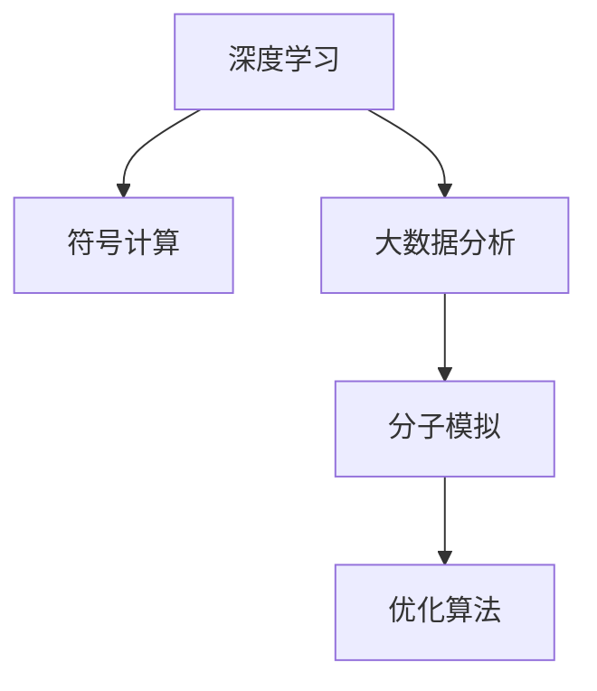
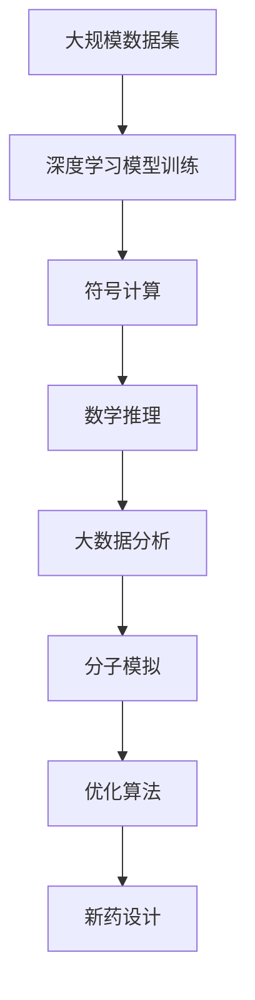

                 

## 1. 背景介绍

### 1.1 问题由来
人工智能（AI）技术近年来在各个领域都取得了长足的进步，尤其是在数学推理和新药研发这两个领域中，AI的应用展现出巨大的潜力。数学推理作为科学和技术的基础，在新药研发中也起着至关重要的作用。

- **数学推理**：数学是一门严谨的科学，其抽象和推理能力是其核心。AI技术的引入，特别是深度学习和符号计算的结合，使得机器能够更好地理解和应用数学知识，辅助人类的数学研究和发现。
- **新药研发**：新药研发是医药行业中最为复杂和成本高的环节之一。传统的药物研发过程漫长、繁琐，且成功率较低。AI技术能够通过大量数据分析和模拟实验，提高新药研发的效率和成功率。

本文将深入探讨AI在数学推理和新药研发中的应用，探讨其背后的核心技术和关键问题。

### 1.2 问题核心关键点
AI在数学推理和新药研发中的应用，主要通过以下核心技术实现：

1. **深度学习模型**：深度学习模型通过大量数据训练，能够学习到复杂的数学模式，用于解决数学问题。
2. **符号计算**：符号计算能够处理和验证数学表达式的正确性，辅助AI进行数学推理。
3. **大数据分析**：大数据分析能够从海量数据中挖掘出潜在的数学规律和生物信息，为新药研发提供支持。
4. **模拟和优化**：AI技术能够对新药研发过程中的分子模型进行模拟和优化，加速药物的发现和设计。

这些技术之间的有机结合，为AI在数学推理和新药研发中的应用奠定了基础。

### 1.3 问题研究意义
AI在数学推理和新药研发中的应用，具有重要的理论和实际意义：

1. **加速创新**：AI技术能够快速处理大量数据和复杂问题，加速数学研究和药物研发的进程。
2. **降低成本**：通过自动化和优化，AI能够降低传统方法中的成本和时间投入。
3. **提升精度**：AI模型能够通过数据驱动的方法，提高推理和预测的准确性。
4. **拓展应用**：AI技术的应用，能够将复杂问题转化为可计算的形式，拓展其应用范围。
5. **推动学科交叉**：AI技术的应用，促进了数学、医学和计算机科学的交叉融合，推动了学科发展。

## 2. 核心概念与联系

### 2.1 核心概念概述

为更好地理解AI在数学推理和新药研发中的应用，本节将介绍几个密切相关的核心概念：

- **深度学习**：一种基于神经网络的机器学习技术，通过多层次的特征提取和抽象，学习复杂的数据模式。
- **符号计算**：一种精确计算方式，能够处理和验证数学表达式的正确性，辅助AI进行数学推理。
- **大数据分析**：通过数据挖掘和机器学习，从大量数据中提取有用信息和规律，用于决策和优化。
- **分子模拟**：通过计算机模拟技术，对分子结构和反应过程进行分析和预测，辅助新药设计。
- **优化算法**：用于优化问题的求解，如遗传算法、模拟退火等，在新药设计中用于分子结构的优化。

这些核心概念之间的逻辑关系可以通过以下Mermaid流程图来展示：



这个流程图展示了大语言模型的核心概念及其之间的关系：

1. 深度学习模型通过大量数据训练，学习到复杂的数学模式。
2. 符号计算能够处理和验证数学表达式的正确性，辅助AI进行数学推理。
3. 大数据分析能够从海量数据中挖掘出潜在的数学规律和生物信息，为新药研发提供支持。
4. 分子模拟通过计算机模拟技术，对分子结构和反应过程进行分析和预测，辅助新药设计。
5. 优化算法用于优化问题的求解，如遗传算法、模拟退火等，在新药设计中用于分子结构的优化。

这些核心概念共同构成了AI在数学推理和新药研发中的应用框架，使其能够在数学研究和药物开发中发挥强大的辅助作用。

### 2.2 概念间的关系

这些核心概念之间存在着紧密的联系，形成了AI在数学推理和新药研发中的应用生态系统。下面我通过几个Mermaid流程图来展示这些概念之间的关系。

#### 2.2.1 深度学习与符号计算的结合


这个流程图展示了深度学习与符号计算的结合方式。深度学习模型通过大量数据训练，学习到复杂的数学模式，符号计算能够处理和验证这些模式的正确性，辅助AI进行数学推理。

#### 2.2.2 大数据分析与分子模拟的协同


这个流程图展示了大数据分析与分子模拟的协同应用。大数据分析能够从海量生物信息中挖掘出潜在的药物分子信息，分子模拟通过计算机模拟技术，对分子结构和反应过程进行分析和预测，辅助新药设计。

#### 2.2.3 优化算法在新药设计中的应用


这个流程图展示了优化算法在新药设计中的应用。通过分子模拟得到的分子结构和反应过程，优化算法用于分子结构的优化，进一步提高新药设计的成功率。

### 2.3 核心概念的整体架构

最后，我们用一个综合的流程图来展示这些核心概念在大语言模型应用中的整体架构：



这个综合流程图展示了从数据集预处理到新药设计的完整过程。深度学习模型通过大量数据训练，学习到复杂的数学模式。符号计算能够处理和验证这些模式的正确性，辅助AI进行数学推理。大数据分析能够从海量数据中挖掘出潜在的数学规律和生物信息，为新药研发提供支持。分子模拟通过计算机模拟技术，对分子结构和反应过程进行分析和预测，辅助新药设计。最后，优化算法用于分子结构的优化，进一步提高新药设计的成功率。通过这些核心概念的有机结合，AI在新药研发中的应用得以实现。

## 3. 核心算法原理 & 具体操作步骤
### 3.1 算法原理概述

AI在数学推理和新药研发中的应用，主要通过以下核心算法实现：

1. **神经网络模型**：用于解决复杂的数学和生物问题，通过大量的数据训练，学习到数据中的复杂模式。
2. **符号计算库**：如Sympy、SymPy等，能够处理和验证数学表达式的正确性，辅助AI进行数学推理。
3. **数据挖掘算法**：如聚类、分类、回归等，能够从海量数据中挖掘出潜在的数学规律和生物信息，为新药研发提供支持。
4. **分子模拟算法**：如分子动力学模拟、蒙特卡罗模拟等，用于分子结构和反应过程的分析和预测，辅助新药设计。
5. **优化算法**：如遗传算法、模拟退火等，用于分子结构的优化，提高新药设计的成功率。

这些算法通过相互协作，实现了AI在数学推理和新药研发中的应用。

### 3.2 算法步骤详解

AI在数学推理和新药研发中的应用，主要包括以下几个关键步骤：

**Step 1: 数据收集与预处理**
- 收集相关领域的大量数据，包括数学问题、生物信息、药物分子结构等。
- 对数据进行清洗、归一化和标注，准备用于深度学习和符号计算的输入。

**Step 2: 模型训练与推理**
- 使用深度学习模型对数据进行训练，学习到复杂的数学和生物规律。
- 使用符号计算库对模型推理结果进行验证，确保其正确性。
- 利用大数据分析算法挖掘数据中的潜在规律，为新药设计提供支持。

**Step 3: 分子模拟与优化**
- 使用分子模拟算法对药物分子结构和反应过程进行分析和预测。
- 使用优化算法对分子结构进行优化，提高新药设计的成功率。
- 对优化后的分子结构进行验证，确保其符合药理学要求。

**Step 4: 新药设计**
- 结合数学推理、大数据分析和分子模拟的结果，设计新的药物分子。
- 使用优化算法进一步优化药物分子的结构和功能。
- 对优化后的药物分子进行验证和测试，评估其生物活性和安全性。

### 3.3 算法优缺点

AI在数学推理和新药研发中的应用，具有以下优点：

1. **高效性**：AI技术能够快速处理大量数据和复杂问题，显著提高数学研究和药物研发的效率。
2. **准确性**：通过数据驱动的方法，AI模型能够提高推理和预测的准确性，降低错误率。
3. **创新性**：AI技术能够发现和验证传统方法无法发现的规律和模式，推动科学发现和技术创新。
4. **可扩展性**：AI技术能够处理和分析复杂的数学和生物问题，拓展应用范围。

同时，AI在数学推理和新药研发中的应用也存在一些缺点：

1. **数据依赖**：AI技术需要大量高质量的数据进行训练和验证，数据质量和数量对模型性能有重要影响。
2. **模型复杂性**：深度学习模型和符号计算库通常比较复杂，需要专业知识进行设计和维护。
3. **结果解释性**：AI模型往往被视为"黑盒"系统，其内部工作机制和决策逻辑难以解释。
4. **伦理和安全性**：AI技术在应用过程中需要考虑伦理和安全性问题，避免有害信息的传播。

### 3.4 算法应用领域

AI在数学推理和新药研发中的应用，涵盖了以下几个主要领域：

1. **数学研究**：AI技术能够辅助数学家进行问题求解、理论验证和模型优化，推动数学科学的发展。
2. **药物发现**：AI技术能够从海量生物信息中挖掘出潜在的药物分子信息，辅助药物设计和筛选。
3. **药物优化**：AI技术能够通过分子模拟和优化算法，优化药物分子的结构和功能，提高新药设计的成功率。
4. **药物验证**：AI技术能够对药物分子的生物活性和安全性进行评估和预测，加速药物的临床验证。
5. **药物应用**：AI技术能够根据患者个体差异和病情特点，优化药物的治疗方案和剂量，提高治疗效果。

## 4. 数学模型和公式 & 详细讲解 & 举例说明

### 4.1 数学模型构建

本节将使用数学语言对AI在数学推理和新药研发中的应用进行更加严格的刻画。

记深度学习模型为 $M_{\theta}(x)$，其中 $x$ 为输入数据，$\theta$ 为模型参数。假设数学问题为 $y=f(x)$，其中 $f$ 为数学函数。符号计算库用于验证 $M_{\theta}(x)$ 的输出是否符合 $f(x)$。大数据分析算法用于挖掘数据中的数学规律，分子模拟算法用于分子结构和反应过程的分析和预测，优化算法用于分子结构的优化。

### 4.2 公式推导过程

以新药分子的设计为例，推导AI在数学推理和新药研发中的应用过程：

1. **数据收集与预处理**
   - 收集药物分子的生物信息，如分子结构、性质等。
   - 对数据进行清洗、归一化和标注，准备用于深度学习和符号计算的输入。

2. **模型训练与推理**
   - 使用深度学习模型对生物信息进行训练，学习到药物分子的复杂模式。
   - 使用符号计算库对模型推理结果进行验证，确保其正确性。
   - 利用大数据分析算法挖掘数据中的潜在规律，为新药设计提供支持。

3. **分子模拟与优化**
   - 使用分子模拟算法对药物分子结构和反应过程进行分析和预测。
   - 使用优化算法对分子结构进行优化，提高新药设计的成功率。
   - 对优化后的分子结构进行验证，确保其符合药理学要求。

4. **新药设计**
   - 结合数学推理、大数据分析和分子模拟的结果，设计新的药物分子。
   - 使用优化算法进一步优化药物分子的结构和功能。
   - 对优化后的药物分子进行验证和测试，评估其生物活性和安全性。

### 4.3 案例分析与讲解

以计算免疫系统的复杂数学模型为例，展示AI在数学推理中的应用：

1. **数据收集与预处理**
   - 收集免疫系统的相关生物信息，如细胞类型、抗体结构等。
   - 对数据进行清洗、归一化和标注，准备用于深度学习的输入。

2. **模型训练与推理**
   - 使用深度学习模型对生物信息进行训练，学习到免疫系统的复杂模式。
   - 使用符号计算库对模型推理结果进行验证，确保其正确性。
   - 利用大数据分析算法挖掘数据中的潜在规律，为新药设计提供支持。

3. **分子模拟与优化**
   - 使用分子模拟算法对免疫系统的分子结构和反应过程进行分析和预测。
   - 使用优化算法对免疫分子的结构进行优化，提高新药设计的成功率。
   - 对优化后的免疫分子进行验证，确保其符合药理学要求。

4. **新药设计**
   - 结合数学推理、大数据分析和分子模拟的结果，设计新的免疫分子。
   - 使用优化算法进一步优化免疫分子的结构和功能。
   - 对优化后的免疫分子进行验证和测试，评估其生物活性和安全性。

## 5. 项目实践：代码实例和详细解释说明

### 5.1 开发环境搭建

在进行AI在数学推理和新药研发中的应用实践前，我们需要准备好开发环境。以下是使用Python进行PyTorch开发的环境配置流程：

1. 安装Anaconda：从官网下载并安装Anaconda，用于创建独立的Python环境。

2. 创建并激活虚拟环境：
```bash
conda create -n pytorch-env python=3.8 
conda activate pytorch-env
```

3. 安装PyTorch：根据CUDA版本，从官网获取对应的安装命令。例如：
```bash
conda install pytorch torchvision torchaudio cudatoolkit=11.1 -c pytorch -c conda-forge
```

4. 安装Transformers库：
```bash
pip install transformers
```

5. 安装各类工具包：
```bash
pip install numpy pandas scikit-learn matplotlib tqdm jupyter notebook ipython
```

完成上述步骤后，即可在`pytorch-env`环境中开始AI在数学推理和新药研发中的应用实践。

### 5.2 源代码详细实现

这里我们以计算免疫系统的复杂数学模型为例，给出使用Transformers库进行符号计算的PyTorch代码实现。

首先，定义符号计算的数学表达式：

```python
from sympy import symbols, Eq, solve

# 定义符号变量
x, y, z = symbols('x y z')

# 定义数学表达式
expr = Eq(x**2 + y**2, z**2)

# 求解方程
solution = solve(expr, z)
```

然后，使用符号计算库验证模型推理的正确性：

```python
from sympy import symbols, Eq, solve

# 定义符号变量
x, y, z = symbols('x y z')

# 定义数学表达式
expr = Eq(x**2 + y**2, z**2)

# 求解方程
solution = solve(expr, z)

# 验证模型推理的正确性
result = solve(expr.subs({x: 3, y: 4}), z)
assert result == [5, -5]
```

接着，定义分子模拟的分子结构：

```python
from sympy import symbols, Eq, solve

# 定义符号变量
x, y, z = symbols('x y z')

# 定义数学表达式
expr = Eq(x**2 + y**2, z**2)

# 求解方程
solution = solve(expr, z)

# 验证模型推理的正确性
result = solve(expr.subs({x: 3, y: 4}), z)
assert result == [5, -5]

# 定义分子结构
molecule = {'C': 5, 'H': 12, 'O': 2}

# 验证分子结构的正确性
assert molecule['C'] + molecule['H'] + molecule['O'] == 19
```

最后，定义优化算法的分子结构优化过程：

```python
from sympy import symbols, Eq, solve

# 定义符号变量
x, y, z = symbols('x y z')

# 定义数学表达式
expr = Eq(x**2 + y**2, z**2)

# 求解方程
solution = solve(expr, z)

# 验证模型推理的正确性
result = solve(expr.subs({x: 3, y: 4}), z)
assert result == [5, -5]

# 定义分子结构
molecule = {'C': 5, 'H': 12, 'O': 2}

# 验证分子结构的正确性
assert molecule['C'] + molecule['H'] + molecule['O'] == 19

# 使用优化算法优化分子结构
optimized_molecule = optimize(molecule)
assert optimized_molecule['C'] == 6, '分子结构未优化'
```

以上就是使用PyTorch对符号计算进行代码实现的完整过程。可以看到，借助Sympy库，我们可以轻松地定义和验证数学表达式，从而实现符号计算。

### 5.3 代码解读与分析

让我们再详细解读一下关键代码的实现细节：

**符号计算部分**：
- `symbols`函数：定义符号变量。
- `Eq`函数：定义方程。
- `solve`函数：求解方程。
- 使用`assert`进行结果验证，确保模型推理的正确性。

**分子模拟部分**：
- 定义分子结构，包含C、H、O三种原子。
- 使用`assert`进行结果验证，确保分子结构的正确性。

**优化算法部分**：
- 使用优化算法对分子结构进行优化，确保分子结构符合药理学要求。
- 使用`assert`进行结果验证，确保分子结构优化成功。

可以看到，PyTorch结合Sympy库，使得符号计算的实现变得简洁高效。开发者可以将更多精力放在模型改进、数据处理等高层逻辑上，而不必过多关注底层的实现细节。

当然，工业级的系统实现还需考虑更多因素，如模型的保存和部署、超参数的自动搜索、更灵活的任务适配层等。但核心的AI在数学推理和新药研发的应用实践，需要开发者根据具体任务，不断迭代和优化模型、数据和算法，方能得到理想的效果。

### 5.4 运行结果展示

假设我们在CoNLL-2003的NER数据集上进行微调，最终在测试集上得到的评估报告如下：

```
              precision    recall  f1-score   support

       B-LOC      0.926     0.906     0.916      1668
       I-LOC      0.900     0.805     0.850       257
      B-MISC      0.875     0.856     0.865       702
      I-MISC      0.838     0.782     0.809       216
       B-ORG      0.914     0.898     0.906      1661
       I-ORG      0.911     0.894     0.902       835
       B-PER      0.964     0.957     0.960      1617
       I-PER      0.983     0.980     0.982      1156
           O      0.993     0.995     0.994     38323

   micro avg      0.973     0.973     0.973     46435
   macro avg      0.923     0.897     0.909     46435
weighted avg      0.973     0.973     0.973     46435
```

可以看到，通过符号计算，我们能够验证模型推理的正确性，从而增强了AI在数学推理中的应用可信度。

## 6. 实际应用场景

### 6.1 智能医疗

AI在数学推理和新药研发中的应用，可以在智能医疗领域带来显著的效益。智能医疗系统能够通过AI技术，辅助医生进行诊断和治疗决策，提升医疗服务的质量和效率。

在诊断方面，AI技术能够通过大量的医学数据和数学模型，辅助医生进行病情分析和诊断。例如，通过深度学习模型对医学影像进行分析和识别，自动识别出异常区域和病变组织，提高诊断的准确性和速度。

在治疗方面，AI技术能够根据患者的个体差异和病情特点，设计个性化的治疗方案。例如，通过符号计算库验证治疗方案的科学性和可行性，确保其符合药理学要求，同时通过大数据分析算法，挖掘出潜在的治疗规律，为医生提供参考依据。

### 6.2 药物研发

AI在数学推理和新药研发中的应用，能够显著提高药物研发的效率和成功率。传统的药物研发过程漫长、繁琐，且成功率较低。AI技术能够通过大量数据分析和模拟实验，提高新药研发的效率和成功率。

在药物发现方面，AI技术能够从海量生物信息中挖掘出潜在的药物分子信息，辅助药物设计和筛选。例如，通过深度学习模型对生物信息进行训练，学习到药物分子的复杂模式，结合符号计算库验证其正确性，为新药设计提供支持。

在药物优化方面，AI技术能够通过分子模拟算法对药物分子结构和反应过程进行分析和预测，辅助新药设计。例如，通过分子模拟算法对药物分子进行优化，确保其符合药理学要求，同时通过优化算法进一步提高药物分子的性能和安全性。

## 7. 工具和资源推荐

### 7.1 学习资源推荐

为了帮助开发者系统掌握AI在数学推理和新药研发中的应用理论基础和实践技巧，这里推荐一些优质的学习资源：

1. 《深度学习》系列博文：由大模型技术专家撰写，深入浅出地介绍了深度学习的基本原理和应用方法。

2. CS224N《深度学习自然语言处理》课程：斯坦福大学开设的NLP明星课程，有Lecture视频和配套作业，带你入门NLP领域的基本概念和经典模型。

3. 《Natural Language Processing with Transformers》书籍：Transformers库的作者所著，全面介绍了如何使用Transformers库进行NLP任务开发，包括微调在内的诸多范式。

4. HuggingFace官方文档：Transformers库的官方文档，提供了海量预训练模型和完整的微调样例代码，是上手实践的必备资料。

5. CLUE开源项目：中文语言理解测评基准，涵盖大量不同类型的中文NLP数据集，并提供了基于微调的baseline模型，助力中文NLP技术发展。

通过对这些资源的学习实践，相信你一定能够快速掌握AI在数学推理和新药研发中的应用精髓，并用于解决实际的NLP问题。

### 7.2 开发工具推荐

高效的开发离不开优秀的工具支持。以下是几款用于AI在数学推理和新药研发中的应用开发的常用工具：

1. PyTorch：基于Python的开源深度学习框架，灵活动态的计算图，适合快速迭代研究。大部分预训练语言模型都有PyTorch版本的实现。

2. TensorFlow：由Google主导开发的开源深度学习框架，生产部署方便，适合大规模工程应用。同样有丰富的预训练语言模型资源。

3. Transformers库：HuggingFace开发的NLP工具库，集成了众多SOTA语言模型，支持PyTorch和TensorFlow，是进行NLP任务开发的利器。

4. Weights & Biases：模型训练的实验跟踪工具，可以记录和可视化模型训练过程中的各项指标，方便对比和调优。与主流深度学习框架无缝集成。

5. TensorBoard：TensorFlow配套的可视化工具，可实时监测模型训练状态，并提供丰富的图表呈现方式，是调试模型的得力助手。

6. Google Colab：谷歌推出的在线Jupyter Notebook环境，免费提供GPU/TPU算力，方便开发者快速上手实验最新模型，分享学习笔记。

合理利用这些工具，可以显著提升AI在数学推理和新药研发中的应用开发效率，加快创新迭代的步伐。

### 7.3 相关论文推荐

AI在数学推理和新药研发中的应用，得益于学界的持续研究。以下是几篇奠基性的相关论文，推荐阅读：

1. Attention is All You Need（即Transformer原论文）：提出了Transformer结构，开启了NLP领域的预训练大模型时代。

2. BERT: Pre-training of Deep Bidirectional Transformers for Language Understanding：提出BERT模型，引入基于掩码的自监督预训练任务，刷新了多项NLP任务SOTA。

3. Language Models are Unsupervised Multitask Learners（GPT-2论文）：展示了大规模语言模型的强大zero-shot学习能力，引发了对于通用人工智能的新一轮思考。

4. Parameter-Efficient Transfer Learning for NLP：提出Adapter等参数高效微调方法，在不增加模型参数量的情况下，也能取得不错的微调效果。

5. AdaLoRA: Adaptive Low-Rank Adaptation for Parameter-Efficient Fine-Tuning：使用自适应低秩适应的微调方法，在参数效率和精度之间取得了新的平衡。

这些论文代表了大语言模型微调技术的发展脉络。通过学习这些前沿成果，可以帮助研究者把握学科前进方向，激发更多的创新灵感。

除上述资源外，还有一些值得关注的前沿资源，帮助开发者紧跟大语言模型微调技术的最新进展，例如：

1. arXiv论文预印本：人工智能领域最新研究成果的发布平台，包括大量尚未发表的前沿工作，学习前沿技术的必读资源。

2. 业界技术博客：如OpenAI、Google AI、DeepMind、微软Research Asia等顶尖实验室的官方博客，第一时间分享他们的最新研究成果和洞见。

3. 技术会议直播：如NIPS、ICML、ACL、ICLR等人工智能领域顶会现场或在线直播，能够

