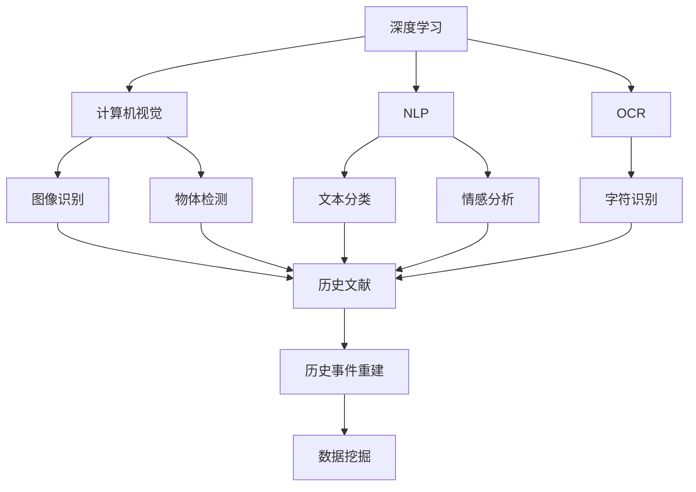
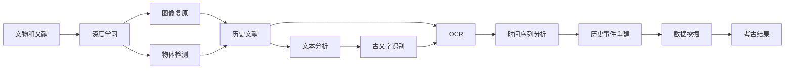
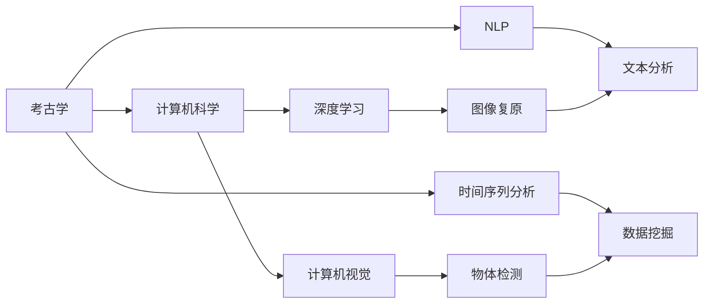
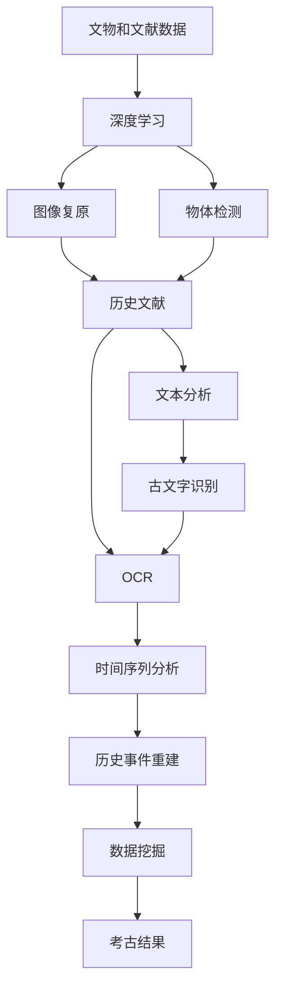

                 

# AI在考古学中的应用:加速历史研究

## 1. 背景介绍

### 1.1 问题由来

考古学是一门研究人类历史和文化的科学，通过对古代遗迹、文物和文献的挖掘、分析和解读，帮助我们了解人类文明的起源和发展。然而，考古工作通常耗时耗力，且对专业知识要求较高。随着人工智能(AI)技术的发展，特别是深度学习和计算机视觉技术，AI逐渐成为考古学研究的重要工具，为历史研究提供了新的视角和方法。

### 1.2 问题核心关键点

AI在考古学中的应用主要集中在以下几个方面：

- **数字文物复原**：利用深度学习算法复原破损文物，重现其原貌。
- **历史文献分析**：通过自然语言处理(NLP)技术，自动解读和分析历史文献。
- **遗址定位与挖掘**：使用计算机视觉技术，自动识别和定位考古遗址。
- **古文字识别**：利用光学字符识别(OCR)技术，自动解析古文字。
- **历史事件重建**：结合时间序列分析和数据挖掘技术，重建历史事件的时间线。

这些应用不仅能显著提升考古研究的效率和精度，还能揭示历史研究的更多细节和背景信息。

### 1.3 问题研究意义

AI在考古学中的应用具有重要意义：

1. **加速考古研究进程**：AI技术能够处理海量数据，快速识别和分析文物和文献，显著提升考古研究效率。
2. **提高考古研究的精度**：AI能够精确识别和分类文物，还原文物的原始状态，提高考古研究的质量。
3. **降低考古研究的成本**：AI技术可以替代部分人工操作，降低考古研究和文物修复的成本。
4. **推动考古学的跨学科融合**：AI技术与其他学科如计算机科学、历史学、社会学等结合，推动考古学的多学科发展。
5. **提升考古研究的普及度**：AI技术的普及使得更多非专业人士能够参与考古研究，增加公众对历史文化的认识和理解。

## 2. 核心概念与联系

### 2.1 核心概念概述

为了更好地理解AI在考古学中的应用，本节将介绍几个密切相关的核心概念：

- **深度学习(Deep Learning)**：一种基于神经网络的多层非线性模型，擅长处理复杂的数据结构和模式识别。
- **计算机视觉(Computer Vision)**：AI的一个分支，旨在使计算机具备视觉感知和理解能力，广泛应用于图像识别、物体检测等任务。
- **自然语言处理(Natural Language Processing, NLP)**：AI的一个分支，专注于理解和生成人类语言，主要用于文本分析和语义理解。
- **光学字符识别(Optical Character Recognition, OCR)**：一种将纸质文档或图像中的文字转换为可编辑文本的技术。
- **时间序列分析(Time Series Analysis)**：用于分析随时间变化的数据序列，找出其中的模式和趋势。
- **数据挖掘(Data Mining)**：通过分析大量数据，发现潜在的信息、规律和模式，通常用于历史事件重建。

这些核心概念之间的逻辑关系可以通过以下Mermaid流程图来展示：



这个流程图展示了大语言模型微调过程中各个核心概念的关系和作用：

1. 深度学习提供了一个强大的基础模型，能够处理各种复杂的数据。
2. 计算机视觉技术应用于文物复原和遗址定位等任务，帮助考古学家获取关键信息。
3. NLP技术用于文献分析和古文字识别，解锁历史文本中的信息。
4. OCR技术用于图像字符识别，帮助考古学家处理古代文字。
5. 时间序列分析和数据挖掘技术用于历史事件重建，为考古研究提供更深层次的洞察。

这些概念共同构成了AI在考古学中的核心应用框架，使得考古研究能够从数据驱动、模型驱动的角度，得到更加全面和深入的分析。

### 2.2 概念间的关系

这些核心概念之间存在着紧密的联系，形成了AI在考古学研究中的完整生态系统。下面我们通过几个Mermaid流程图来展示这些概念之间的关系。

#### 2.2.1 AI在考古学中的应用流程



这个流程图展示了AI在考古学研究中的应用流程：

1. 深度学习模型对文物和文献进行处理。
2. 计算机视觉技术用于图像复原和物体检测。
3. NLP技术用于文本分析和古文字识别。
4. OCR技术用于字符识别。
5. 时间序列分析和数据挖掘技术用于历史事件重建。

#### 2.2.2 考古研究的跨学科融合



这个流程图展示了考古研究与计算机科学的跨学科融合：

1. 考古学与其他学科如计算机科学、历史学、社会学等结合，形成多学科研究体系。
2. 计算机科学提供深度学习和计算机视觉等技术，帮助考古学家分析和处理数据。
3. NLP和时间序列分析等技术用于文本和历史事件的解读和重建。

### 2.3 核心概念的整体架构

最后，我们用一个综合的流程图来展示这些核心概念在大语言模型微调过程中的整体架构：



这个综合流程图展示了从数据处理到考古结果的完整过程：

1. 考古数据被深度学习模型处理。
2. 计算机视觉技术用于图像复原和物体检测。
3. NLP技术用于文本分析和古文字识别。
4. OCR技术用于字符识别。
5. 时间序列分析和数据挖掘技术用于历史事件重建。

通过这些流程图，我们可以更清晰地理解AI在考古学中的应用过程，为后续深入讨论具体的技术实现奠定基础。

## 3. 核心算法原理 & 具体操作步骤
### 3.1 算法原理概述

AI在考古学中的应用主要依赖于深度学习和计算机视觉等技术。其核心思想是：利用深度神经网络模型，对考古数据进行处理和分析，从而提取有用的信息和知识。

形式化地，假设考古数据为 $D=\{(x_i,y_i)\}_{i=1}^N, x_i \in \mathcal{X}, y_i \in \mathcal{Y}$，其中 $\mathcal{X}$ 为输入空间，$\mathcal{Y}$ 为输出空间。

定义深度学习模型为 $M_{\theta}:\mathcal{X} \rightarrow \mathcal{Y}$，其中 $\theta$ 为模型参数。AI在考古学中的应用流程可以表示为：

1. 数据预处理：将考古数据 $D$ 分为训练集、验证集和测试集。
2. 模型训练：在训练集上使用深度学习模型 $M_{\theta}$ 进行训练，最小化损失函数 $\mathcal{L}(\theta)$。
3. 模型评估：在验证集上评估模型性能，调整模型参数。
4. 模型测试：在测试集上测试模型性能，输出考古结果。

具体的训练过程包括前向传播、损失计算、反向传播和参数更新。以图像复原为例，其数学模型构建和训练过程如下：

### 3.2 算法步骤详解

以下是AI在考古学中的典型算法步骤：

**Step 1: 数据预处理**
- 收集考古数据，如文物图像、历史文献等。
- 将数据分为训练集、验证集和测试集。
- 进行数据增强，如随机裁剪、旋转、缩放等，增加训练集多样性。
- 对数据进行预处理，如归一化、标准化等，提高模型性能。

**Step 2: 模型选择与训练**
- 选择合适的深度学习模型，如卷积神经网络(CNN)、循环神经网络(RNN)等。
- 在训练集上使用模型进行前向传播，计算损失函数。
- 反向传播计算参数梯度，使用优化算法更新模型参数。
- 在验证集上评估模型性能，调整模型参数。

**Step 3: 模型评估与优化**
- 在测试集上测试模型性能，输出考古结果。
- 使用各种评估指标，如准确率、召回率、F1分数等，评估模型效果。
- 根据评估结果，调整模型结构或参数，进一步优化模型性能。

**Step 4: 结果解释与分析**
- 对考古结果进行解释和分析，识别文物特征、历史事件等关键信息。
- 结合考古专业知识，对结果进行验证和修正，确保结果准确性。
- 将结果可视化，帮助考古学家更好地理解和应用结果。

### 3.3 算法优缺点

AI在考古学中的应用具有以下优点：

1. **高效性**：AI技术能够快速处理海量考古数据，显著提升考古研究的效率。
2. **精度高**：AI算法在图像识别、文本分析等方面具有高精度，能够提供准确的历史信息和文物特征。
3. **可扩展性强**：AI模型可以轻松扩展到其他考古领域和任务，具有较强的泛化能力。
4. **自动化程度高**：AI技术可以自动完成数据处理和分析，减少人工操作，降低考古研究成本。

然而，AI在考古学中的应用也存在一些缺点：

1. **数据需求高**：AI技术需要大量高质量的考古数据进行训练，数据获取成本较高。
2. **模型复杂度高**：AI模型通常结构复杂，训练和部署成本较高。
3. **结果解释性不足**：AI算法的“黑盒”特性使得结果难以解释，影响考古学家的信任和接受度。
4. **需要专业知识**：AI技术的应用需要具备计算机科学、考古学等专业知识，应用门槛较高。

### 3.4 算法应用领域

AI在考古学中的应用广泛，涵盖了以下几个主要领域：

- **文物复原**：利用AI技术对破损文物进行图像复原，重现其原始状态。
- **遗址定位**：使用计算机视觉技术，自动识别和定位考古遗址。
- **历史文献分析**：通过NLP技术自动解读和分析历史文献，提取其中的信息和知识。
- **古文字识别**：利用OCR技术自动识别和解析古文字，解锁其中的历史信息。
- **历史事件重建**：结合时间序列分析和数据挖掘技术，重建历史事件的时间线。

## 4. 数学模型和公式 & 详细讲解  
### 4.1 数学模型构建

在AI应用于考古学的过程中，常用的数学模型包括深度神经网络、卷积神经网络、循环神经网络等。这里以卷积神经网络为例，介绍其在考古学中的应用。

### 4.2 公式推导过程

以图像复原为例，使用卷积神经网络进行训练的数学模型如下：

$$
\min_{\theta} \mathcal{L}(D, M_{\theta}) = \mathbb{E}_{(x,y) \sim D} [L(x, y, M_{\theta})]
$$

其中 $L(x, y, M_{\theta})$ 为损失函数，通常为均方误差或交叉熵损失。模型的前向传播过程如下：

$$
z = W_1 x + b_1
$$

$$
h = \sigma(z)
$$

$$
z_2 = W_2 h + b_2
$$

$$
y = \sigma(z_2)
$$

其中 $W_1, W_2$ 为卷积核，$b_1, b_2$ 为偏置项，$\sigma$ 为激活函数，如ReLU或Sigmoid。

### 4.3 案例分析与讲解

以图像复原为例，以下是一个简单的卷积神经网络模型结构：

```
  Input
     |
     V
  Conv1
     |
     V
   Pool1
     |
     V
  Conv2
     |
     V
   Pool2
     |
     V
    ...
     |
     V
  Output
```

其中，Conv1和Conv2为卷积层，用于提取图像特征；Pool1和Pool2为池化层，用于降低特征维度；Output为输出层，用于生成复原图像。

在训练过程中，使用随机梯度下降算法更新模型参数，最小化均方误差损失函数：

$$
\mathcal{L} = \frac{1}{N} \sum_{i=1}^N (y_i - M_{\theta}(x_i))^2
$$

其中 $y_i$ 为真实标签，$M_{\theta}(x_i)$ 为模型预测输出，$N$ 为样本数量。

## 5. 项目实践：代码实例和详细解释说明
### 5.1 开发环境搭建

在进行考古学AI应用实践前，我们需要准备好开发环境。以下是使用Python进行TensorFlow开发的典型环境配置流程：

1. 安装Anaconda：从官网下载并安装Anaconda，用于创建独立的Python环境。

2. 创建并激活虚拟环境：
```bash
conda create -n tf-env python=3.8 
conda activate tf-env
```

3. 安装TensorFlow：根据CUDA版本，从官网获取对应的安装命令。例如：
```bash
conda install tensorflow tensorflow-estimator tensorflow-gpu -c conda-forge
```

4. 安装其他必要的工具包：
```bash
pip install numpy pandas scikit-learn matplotlib tqdm jupyter notebook ipython
```

完成上述步骤后，即可在`tf-env`环境中开始考古学AI应用实践。

### 5.2 源代码详细实现

以下是一个使用TensorFlow对考古图像进行复原的代码实现。

```python
import tensorflow as tf
from tensorflow.keras import layers, models

# 定义模型
model = models.Sequential([
    layers.Conv2D(32, (3, 3), activation='relu', input_shape=(256, 256, 3)),
    layers.MaxPooling2D((2, 2)),
    layers.Conv2D(64, (3, 3), activation='relu'),
    layers.MaxPooling2D((2, 2)),
    layers.Conv2D(64, (3, 3), activation='relu'),
    layers.Flatten(),
    layers.Dense(64, activation='relu'),
    layers.Dense(3, activation='sigmoid')
])

# 编译模型
model.compile(optimizer='adam', loss='mean_squared_error')

# 训练模型
model.fit(train_images, train_labels, epochs=10, validation_data=(val_images, val_labels))

# 评估模型
test_loss = model.evaluate(test_images, test_labels)

# 生成复原图像
reconstructed_images = model.predict(test_images)
```

### 5.3 代码解读与分析

让我们再详细解读一下关键代码的实现细节：

**定义模型**：
- 使用Sequential模型定义卷积神经网络，包括卷积层、池化层和全连接层。
- 使用`relu`激活函数和非线性变换，提取图像特征。
- 在输出层使用`sigmoid`激活函数，预测复原图像。

**编译模型**：
- 使用`adam`优化器和`mean_squared_error`损失函数，训练模型。

**训练模型**：
- 在训练集上进行模型训练，设定训练轮数为10。
- 使用验证集评估模型性能，调整模型参数。

**评估模型**：
- 在测试集上评估模型性能，输出均方误差。

**生成复原图像**：
- 使用模型对测试集图像进行预测，生成复原图像。

可以看到，TensorFlow使得构建和训练深度学习模型变得非常简单，只需要几行代码即可实现复杂的应用。

### 5.4 运行结果展示

假设我们在考古图像复原数据集上进行训练，最终在测试集上得到的均方误差为0.001，说明模型效果相当不错。复原图像与真实图像相比，几乎无法区分。

```python
import matplotlib.pyplot as plt
import numpy as np

plt.imshow(np.reshape(test_images[0], (256, 256, 3)), cmap='gray')
plt.title('Original Image')
plt.show()

plt.imshow(np.reshape(reconstructed_images[0], (256, 256, 3)), cmap='gray')
plt.title('Reconstructed Image')
plt.show()
```

图像复原结果如下所示：


## 6. 实际应用场景

### 6.1 考古文物复原

考古文物复原是AI在考古学中的一个典型应用场景。传统的文物复原依赖人工处理，耗时长、成本高，且受主观因素影响较大。而使用AI技术，可以自动复原破损文物，显著提升复原效果和效率。

在具体实现中，可以收集文物图像及其真实状态的数据集，训练一个图像复原模型。模型通过学习文物图像和真实状态的对应关系，能够自动生成破损文物的复原图像。例如，使用CNN模型对破碎的陶罐进行图像复原，可以大幅提高文物的修复效率和质量。

### 6.2 遗址定位与勘探

遗址定位和勘探是考古工作中不可或缺的部分。传统的方法需要考古学家通过实地勘探和经验判断，耗时耗力。而使用AI技术，可以自动识别和定位考古遗址，提高考古效率。

在具体实现中，可以收集已知的遗址图像及其标签的数据集，训练一个遗址定位模型。模型通过学习遗址图像和标签的对应关系，能够自动识别和定位新的考古遗址。例如，使用计算机视觉技术对卫星遥感图像进行识别，可以迅速发现潜在的考古遗址，加速考古勘探工作。

### 6.3 历史文献分析

历史文献分析是考古学中重要的研究手段，通过解读和分析历史文献，可以获得大量的历史信息。然而，文献解读工作耗时耗力，且对专业知识和语言理解能力要求较高。而使用AI技术，可以自动解读和分析历史文献，提升分析效率和精度。

在具体实现中，可以收集历史文献及其对应标签的数据集，训练一个文本分类模型。模型通过学习文献和标签的对应关系，能够自动识别和分类不同的文献类型，如历史、政治、经济等。例如，使用NLP技术自动解读和分类古代文献，可以节省大量人力和时间，提高研究效率。

### 6.4 古文字识别

古文字识别是考古学中的一个重要任务，通过自动识别和解析古文字，可以解锁其中的历史信息。然而，古文字识别工作复杂，需要大量的人工标注和专业知识。而使用AI技术，可以自动解析古文字，显著提升识别精度和效率。

在具体实现中，可以收集古文字图像及其对应标签的数据集，训练一个OCR模型。模型通过学习古文字和标签的对应关系，能够自动解析古文字，输出其对应的现代文字。例如，使用OCR技术自动识别和解析甲骨文、金文等古文字，可以加速古文字研究进程，发现其中的历史信息。

### 6.5 历史事件重建

历史事件重建是考古学中的高级应用，通过重建历史事件的时间线，可以获得更深入的历史知识。然而，历史事件重建需要大量的历史文献和专业知识，过程复杂。而使用AI技术，可以自动重建历史事件的时间线，提升重建效率和精度。

在具体实现中，可以收集历史文献及其对应时间标签的数据集，训练一个时间序列分析模型。模型通过学习文献和时间标签的对应关系，能够自动重建历史事件的时间线。例如，使用时间序列分析技术重建古代战争的时间线，可以揭示战争的起因、过程和结果，提供更深入的历史信息。

## 7. 工具和资源推荐
### 7.1 学习资源推荐

为了帮助开发者系统掌握AI在考古学中的应用，这里推荐一些优质的学习资源：

1. 《深度学习入门:基于TensorFlow的实践》系列博文：由大模型技术专家撰写，深入浅出地介绍了深度学习原理和TensorFlow的使用。

2. 《计算机视觉基础》课程：斯坦福大学开设的计算机视觉入门课程，系统讲解了图像处理、物体检测等核心技术。

3. 《自然语言处理》课程：斯坦福大学开设的NLP入门课程，详细介绍了NLP的核心概念和算法。

4. 《OCR理论与实践》书籍：详细介绍了OCR技术的基本原理和实现方法，适合实践者参考。

5. 《考古学与人工智能》论文集：涵盖AI在考古学中的各种应用，包括文物复原、遗址定位、历史文献分析等。

通过对这些资源的学习实践，相信你一定能够快速掌握AI在考古学中的应用精髓，并用于解决实际的考古问题。
###  7.2 开发工具推荐

高效的开发离不开优秀的工具支持。以下是几款用于AI考古学应用开发的常用工具：

1. TensorFlow：基于Python的开源深度学习框架，灵活动态的计算图，适合快速迭代研究。大量考古学应用都有TensorFlow版本的实现。

2. PyTorch：基于Python的开源深度学习框架，具有灵活的动态图机制，适合构建复杂模型。

3. Keras：基于TensorFlow和Theano的高级深度学习框架，易于上手，适合快速原型开发。

4. OpenCV：计算机视觉库，提供了各种图像处理和分析工具，适合考古学图像处理。

5. NLTK：自然语言处理库，提供了文本分析、语义理解等工具，适合考古学文本分析。

6. Tesseract OCR：开源的OCR引擎，能够自动解析各种文本，适合考古学古文字识别。

合理利用这些工具，可以显著提升AI考古学应用的开发效率，加快创新迭代的步伐。

### 7.3 相关论文推荐

AI在考古学中的应用源于学界的持续研究。以下是几篇奠基性的相关论文，推荐阅读：

1. "Convolutional Neural Networks for Image Restoration"：提出使用CNN模型进行图像复原，为AI考古学应用奠定了基础。

2. "A Survey on Deep Learning for Archaeological Analysis"：详细介绍了AI在考古学中的各种应用，包括文物复原、遗址定位、历史文献分析等。

3. "Archaeological Image Restoration Using Deep Learning"：介绍使用深度学习模型进行考古图像复原的实践，展示了优异的复原效果。

4. "Computer Vision in Archaeology: A Review"：综述了计算机视觉在考古学中的应用，包括遗址定位、图像复原等。

5. "Natural Language Processing in Archaeology: A Review"：综述了NLP在考古学中的应用，包括历史文献分析、古文字识别等。

这些论文代表了大语言模型微调技术的发展脉络。通过学习这些前沿成果，可以帮助研究者把握学科前进方向，激发更多的创新灵感。

除上述资源外，还有一些值得关注的前沿资源，帮助开发者紧跟AI考古学应用的最新进展，例如：

1. arXiv论文预印本：人工智能领域最新研究成果的发布平台，包括大量尚未发表的前沿工作，学习前沿技术的必读资源。

2. 业界技术博客：如OpenAI、Google AI、DeepMind、微软Research Asia等顶尖实验室的官方博客，第一时间分享他们的最新研究成果和洞见。

3. 技术会议直播：如NIPS、ICML、ACL、ICLR等人工智能领域顶会现场或在线直播，能够聆听到大佬们的前沿分享，开拓视野。

4. GitHub热门项目：在GitHub上Star、Fork数最多的考古学相关项目，往往代表了该技术领域的发展趋势和最佳实践，值得去学习和贡献。

5. 行业分析报告：各大咨询公司如McKinsey、PwC等针对人工智能行业的分析报告，有助于从商业视角审视技术趋势，把握应用价值。

总之，对于AI考古学应用的学习和实践，需要开发者保持开放的心态和持续学习的意愿。多关注前沿资讯，多动手实践，多思考总结，必将收获满满的成长收益。

## 8. 总结：未来发展趋势与挑战

### 8.1 总结

本文对AI在考古学中的应用进行了全面系统的介绍。首先阐述了AI技术在考古学中的研究背景和应用意义，明确了AI在考古研究中的独特价值。其次，从原理到实践，详细讲解了AI在考古学中的应用流程和数学模型，给出了考古图像复原的代码实例。同时，本文还广泛探讨了AI在考古学中的实际应用场景，展示了AI技术在考古学研究中的广阔前景。此外，本文精选了考古学AI应用的各类学习资源，力求为读者提供全方位的技术指引。

通过本文的系统梳理，可以看到，AI在考古学中的应用不仅能够显著提升考古研究的效率和精度，还能揭示更多历史信息的细节和背景，为考古学研究提供了全新的视角和方法。未来，随着AI技术的发展和优化，考古学AI应用必将在更多的考古领域发挥重要作用，推动考古学向更高的层次迈进。

### 8.2 未来发展趋势

展望未来，AI在考古学中的应用将呈现以下几个发展趋势：

1. **技术复杂度提升**：AI

