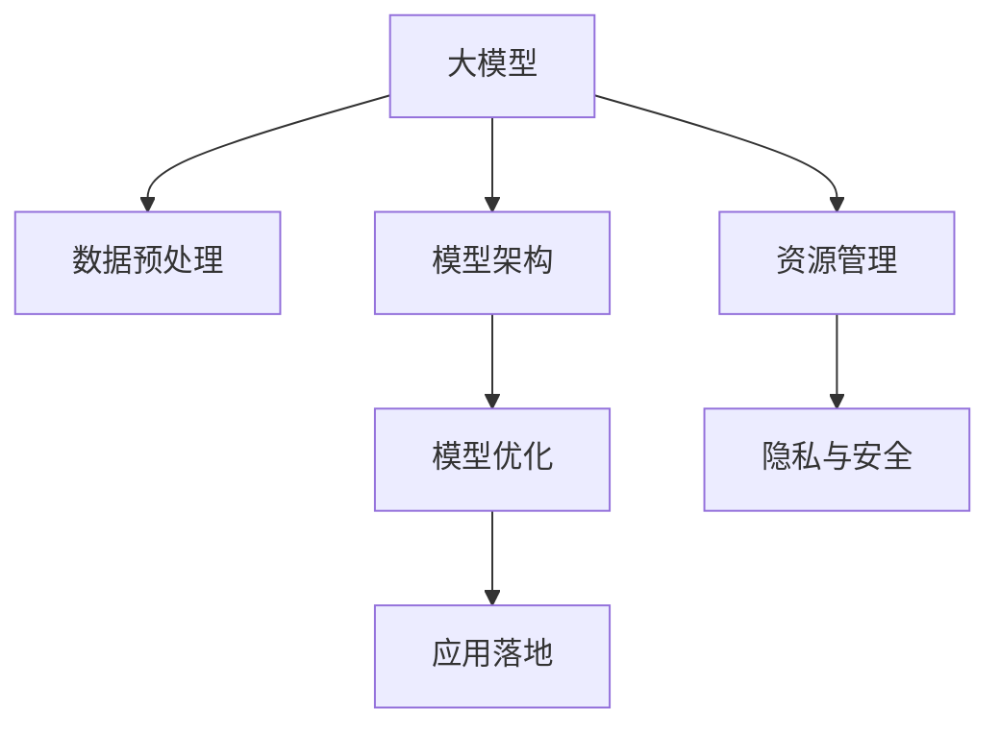

                 

# AI大模型创业：如何应对未来技术挑战？

> 关键词：大模型创业,技术挑战,深度学习,人工智能,机器学习,创业指南,数据处理,模型优化,应用落地

## 1. 背景介绍

### 1.1 问题由来
近年来，随着深度学习技术的飞速发展，大模型（如GPT-3、BERT等）在人工智能领域展现出了巨大的潜力，推动了NLP、CV、推荐系统等众多领域的创新。这些大模型的广泛应用，不仅提升了各行各业的生产效率和智能化水平，也催生了新的商业模式和市场需求。

然而，大模型技术的普及和落地也面临着一系列技术挑战。如何高效地开发、训练、部署和管理大模型，使其真正服务于产业应用，成为了创业者和开发者关注的焦点。本文旨在通过系统梳理大模型创业过程中可能遇到的技术挑战，探讨有效的应对策略，为有志于在大模型领域创业的读者提供有价值的参考。

### 1.2 问题核心关键点
大模型创业的核心在于如何利用大模型技术，结合行业需求，开发出具有市场竞争力的产品和服务。面临的主要挑战包括但不限于以下几点：

1. **数据获取与处理**：大模型依赖于海量高质量的训练数据，如何获取、清洗和标注这些数据是大模型开发的关键。
2. **模型设计与优化**：大模型通常包含亿级参数，如何设计高效、易扩展的模型架构，并在训练和推理过程中进行优化，是大模型创业的技术难点。
3. **资源消耗与管理**：大模型需要高性能计算资源，如何在有限的资源环境下高效训练和部署模型，是大模型创业的成本挑战。
4. **产品落地与应用**：如何将大模型技术转化为实用的产品和服务，并在不同的应用场景中实现高效性能，是大模型创业的实践难题。
5. **用户隐私与安全**：大模型在处理敏感数据时，如何确保数据隐私和安全，是大模型创业必须考虑的伦理和法律问题。

解决这些挑战，需要从数据、模型、资源、应用和伦理等多个层面进行综合考虑，制定合理的战略和技术方案。本文将围绕这些核心问题，提供系统的分析与对策。

## 2. 核心概念与联系

### 2.1 核心概念概述

为更好地理解大模型创业过程中面临的技术挑战，本节将介绍几个关键概念及其联系：

- **大模型 (Large Model)**：指含有数亿乃至数十亿参数的深度学习模型，如GPT-3、BERT、ResNet等。这些模型在处理大规模数据集时表现优异，广泛应用于NLP、CV、推荐系统等领域。

- **数据预处理 (Data Preprocessing)**：指对原始数据进行清洗、标注、转换等操作，以适应模型训练和推理需求的过程。数据预处理是大模型开发的重要环节，直接影响模型的性能和泛化能力。

- **模型架构 (Model Architecture)**：指大模型的结构设计，包括网络层、激活函数、损失函数等组件。合理的模型架构能够有效提升模型的训练和推理效率，降低计算资源消耗。

- **模型优化 (Model Optimization)**：指在大模型训练和推理过程中，通过正则化、梯度加速、模型剪枝等技术，提升模型的性能和泛化能力，同时降低资源消耗。

- **应用落地 (Application Deployment)**：指将大模型技术转化为可实际应用的产品或服务，包括模型的部署、接口设计、数据输入输出等。

- **资源管理 (Resource Management)**：指在有限的硬件资源下，通过优化计算、存储和网络传输等环节，提高大模型的训练和推理效率。

- **隐私与安全 (Privacy & Security)**：指在处理敏感数据时，如何保护用户隐私，避免数据泄露，同时确保模型的输出安全可靠。

这些概念之间相互联系，共同构成了大模型创业的技术框架。理解这些概念的原理和应用，对于解决实际问题具有重要意义。

### 2.2 概念间的关系

这些核心概念之间的关系可以用以下Mermaid流程图来展示：



这个流程图展示了大模型创业过程中各环节的逻辑关系：

1. 大模型通过数据预处理获取高质量数据，为模型训练奠定基础。
2. 基于预处理数据，设计合理的模型架构，并进行优化，提升模型性能。
3. 应用落地方案将模型转化为实际产品或服务，满足用户需求。
4. 资源管理优化训练和推理效率，降低成本。
5. 隐私与安全保障模型和数据的安全性，维护用户信任。

## 3. 核心算法原理 & 具体操作步骤

### 3.1 算法原理概述

大模型创业的关键在于如何高效利用大模型技术，结合行业需求，开发出具有市场竞争力的产品和服务。主要技术挑战包括数据预处理、模型设计、优化、应用落地、资源管理和隐私与安全等方面。

### 3.2 算法步骤详解

以下详细介绍大模型创业过程中各个环节的具体操作步骤：

**Step 1: 数据预处理**

- **数据收集**：根据业务需求，收集和整理相关领域的数据。例如，NLP领域可以收集新闻、文章、对话等文本数据；CV领域可以收集图片、视频等视觉数据。
- **数据清洗**：去除噪声数据、处理缺失值，确保数据质量。例如，NLP中可以使用词法分析、句法分析等技术清洗文本数据；CV中使用图像增强、去噪等技术处理图像数据。
- **数据标注**：为数据打上标签，以便模型能够学习任务相关知识。例如，NLP中可以使用人工标注、半自动标注等方式，CV中使用手动标注、自动标注等方式。
- **数据划分**：将数据划分为训练集、验证集和测试集，确保模型能够泛化到未见过的数据。

**Step 2: 模型设计与优化**

- **模型架构设计**：选择合适的模型架构，如卷积神经网络（CNN）、循环神经网络（RNN）、Transformer等，根据任务需求进行配置。例如，NLP领域常用的模型有BERT、GPT等；CV领域常用的模型有ResNet、Inception等。
- **参数初始化**：使用随机初始化或预训练模型初始化，减少训练难度。例如，可以使用GPT预训练模型初始化，加速GPT模型的训练过程。
- **模型优化**：通过正则化、梯度加速、模型剪枝等技术，提升模型性能和泛化能力。例如，使用L2正则、Dropout、Adam优化器等技术，加快模型收敛速度，减少过拟合风险。

**Step 3: 应用落地**

- **接口设计**：根据业务需求，设计模型服务接口，确保用户能够便捷地使用模型。例如，设计RESTful API接口，通过HTTP请求调用模型服务。
- **数据输入输出**：设计模型输入输出格式，确保数据能够高效地输入和输出。例如，NLP中使用序列化文本输入，使用词向量表示；CV中使用图像、视频等输入，使用像素值表示。
- **服务部署**：选择合适的部署方案，如本地部署、云服务部署等，确保服务稳定性。例如，使用AWS、阿里云、腾讯云等云服务部署模型，降低硬件成本，提高服务可用性。

**Step 4: 资源管理**

- **硬件选择**：根据模型规模和需求，选择高性能计算资源，如GPU、TPU等，确保训练和推理效率。例如，使用NVIDIA Tesla GPU或Google TPU进行深度学习计算。
- **分布式训练**：通过分布式训练技术，加速模型训练过程。例如，使用Horovod、PyTorch Distributed等框架实现模型并行训练。
- **资源调度**：通过资源调度策略，优化资源利用率。例如，使用Kubernetes等容器化平台，实现资源的弹性伸缩和自动化管理。

**Step 5: 隐私与安全**

- **数据隐私保护**：在数据处理过程中，采用差分隐私、联邦学习等技术，保护用户隐私。例如，在模型训练时，使用差分隐私算法保护用户数据。
- **模型输出安全**：在模型推理过程中，确保输出结果的安全性。例如，使用安全多方计算等技术，保护模型输出免受攻击。
- **合规审查**：确保模型开发和应用符合法律法规要求。例如，遵守GDPR、CCPA等隐私保护法规，确保数据处理合法合规。

### 3.3 算法优缺点

大模型创业的优势在于其强大的语言理解和视觉处理能力，能够提供高质量的预测和服务。然而，大模型也存在资源消耗大、训练复杂、应用落地困难等缺点，需要结合实际应用场景进行综合考虑和优化。

- **优点**：
  - 强大的数据处理能力：大模型能够处理大规模数据，提供高质量的预测和推荐。
  - 高效的泛化能力：经过预训练和微调，大模型具有较强的泛化能力，能够在不同领域和任务上应用。
  - 创新驱动：大模型的出现，推动了人工智能技术的快速发展，催生了新的商业模式和应用场景。

- **缺点**：
  - 资源消耗大：大模型需要高性能计算资源，训练和推理过程消耗大量时间、电力和硬件成本。
  - 训练复杂：大模型参数量庞大，训练过程复杂，容易出现过拟合等问题。
  - 应用落地困难：如何将大模型高效地部署和应用于实际场景，是大模型创业的实践难题。

### 3.4 算法应用领域

大模型技术已经广泛应用于各个领域，包括NLP、CV、推荐系统等。以下是几个典型应用领域的详细介绍：

#### 3.4.1 自然语言处理（NLP）

大模型在NLP领域的应用非常广泛，包括文本分类、情感分析、机器翻译、对话系统等。例如，GPT系列模型在对话系统中表现优异，能够提供自然流畅的对话体验。BERT模型在文本分类和情感分析中表现出色，能够在有限标注数据下取得优异效果。

#### 3.4.2 计算机视觉（CV）

大模型在CV领域的应用包括图像分类、目标检测、图像生成等。例如，ResNet系列模型在图像分类中表现优异，能够准确识别各类物体。Google Vision Model使用Transformer架构，在目标检测中取得了突破性进展。

#### 3.4.3 推荐系统

大模型在推荐系统中的应用包括用户行为预测、商品推荐、广告投放等。例如，使用深度学习模型（如DNN、BERT等）进行用户行为预测，能够提供更个性化、精准的推荐服务。

## 4. 数学模型和公式 & 详细讲解 & 举例说明

### 4.1 数学模型构建

大模型创业涉及的数学模型包括深度学习模型的设计、训练和推理等。下面以NLP领域的BERT模型为例，详细介绍数学模型的构建过程。

假设BERT模型包含 $L$ 层，每层包含 $N$ 个神经元，输入序列长度为 $T$。模型的数学表达式如下：

$$
h^{(l)}_{i} = \text{LayerNorm}(\text{FFN}(h^{(l-1)}_{i})) + \text{Attention}(h^{(l-1)}_{i})
$$

其中，$\text{FFN}$ 表示全连接网络，$\text{Attention}$ 表示自注意力机制。模型的输出为：

$$
\text{CLS}(h_T) = \text{Softmax}(\text{MLP}(\text{Attention}(h_T)))
$$

其中，$\text{MLP}$ 表示多层次感知机，$\text{Softmax}$ 表示输出层激活函数。模型的训练目标为最小化交叉熵损失函数：

$$
\mathcal{L} = -\sum_{i=1}^{N}\sum_{t=1}^{T}y_t \log h^{(l)}_{i}
$$

其中，$y_t$ 为标签，$h^{(l)}_{i}$ 为模型输出。

### 4.2 公式推导过程

在BERT模型的训练过程中，主要分为预训练和微调两个阶段。以下是这两个阶段的详细推导过程：

#### 4.2.1 预训练

预训练阶段的目标是学习语言的通用表示，具体包括掩码语言模型和下一句预测两个任务。假设预训练数据集为 $D_{\text{pre}}$，预训练模型的参数为 $\theta$，预训练损失函数为 $\mathcal{L}_{\text{pre}}$。预训练模型的数学表达式如下：

$$
\mathcal{L}_{\text{pre}} = \mathcal{L}_{\text{mask}} + \mathcal{L}_{\text{next}}
$$

其中，$\mathcal{L}_{\text{mask}}$ 和 $\mathcal{L}_{\text{next}}$ 分别表示掩码语言模型和下一句预测任务的损失函数。假设掩码语言模型的输入序列长度为 $T$，输出标签为 $y_t$，模型输出为 $h^{(l)}_{i}$。掩码语言模型的数学表达式如下：

$$
\mathcal{L}_{\text{mask}} = -\sum_{i=1}^{N}\sum_{t=1}^{T}y_t \log h^{(l)}_{i}
$$

其中，$y_t$ 表示掩码后的标记，$h^{(l)}_{i}$ 表示模型输出。

#### 4.2.2 微调

微调阶段的目标是在预训练模型的基础上，对特定任务进行适配。假设微调数据集为 $D_{\text{fine}}$，微调模型的参数为 $\theta_{\text{fine}}$，微调损失函数为 $\mathcal{L}_{\text{fine}}$。微调模型的数学表达式如下：

$$
\mathcal{L}_{\text{fine}} = \sum_{(x,y)\in D_{\text{fine}}}\ell(h^{(l)}_{i}, y)
$$

其中，$\ell$ 表示损失函数，$h^{(l)}_{i}$ 表示模型输出，$y$ 表示标签。假设微调数据集 $D_{\text{fine}}$ 包含 $M$ 个样本，每个样本包含输入序列 $x$ 和标签 $y$。微调模型的训练过程如下：

1. 前向传播：将输入序列 $x$ 输入模型，计算模型输出 $h^{(l)}_{i}$。
2. 计算损失：计算模型输出 $h^{(l)}_{i}$ 与标签 $y$ 之间的交叉熵损失 $\ell(h^{(l)}_{i}, y)$。
3. 反向传播：根据损失函数 $\ell(h^{(l)}_{i}, y)$，计算梯度并更新模型参数 $\theta_{\text{fine}}$。

### 4.3 案例分析与讲解

以BERT模型在情感分析任务中的微调为例，介绍数学模型的具体应用。假设情感分析数据集为 $D_{\text{emotion}}$，包含 $N$ 个样本，每个样本包含输入序列 $x$ 和标签 $y$。微调模型的数学表达式如下：

$$
\mathcal{L}_{\text{fine}} = \sum_{(x,y)\in D_{\text{emotion}}}\ell(h^{(l)}_{i}, y)
$$

其中，$\ell$ 表示情感分析任务的损失函数。假设情感分析任务的标签为二分类标签，标签空间为 $\{0, 1\}$，表示正面和负面情感。假设情感分析任务的交叉熵损失函数为：

$$
\ell(h^{(l)}_{i}, y) = -(y\log h^{(l)}_{i} + (1-y)\log(1-h^{(l)}_{i}))
$$

其中，$y$ 表示标签，$h^{(l)}_{i}$ 表示模型输出。

在微调过程中，首先对BERT模型进行预训练，然后在情感分析数据集上进行微调。微调时，使用交叉熵损失函数 $\ell(h^{(l)}_{i}, y)$，计算模型输出 $h^{(l)}_{i}$ 与标签 $y$ 之间的交叉熵损失，并根据损失函数反向传播更新模型参数 $\theta_{\text{fine}}$。

## 5. 项目实践：代码实例和详细解释说明

### 5.1 开发环境搭建

在大模型创业过程中，开发环境搭建是至关重要的。以下是基于PyTorch的BERT模型在情感分析任务上的微调代码实例：

#### 5.1.1 安装PyTorch

```bash
pip install torch torchtext transformers
```

#### 5.1.2 下载预训练模型

```bash
model = BertForSequenceClassification.from_pretrained('bert-base-uncased', num_labels=2)
```

#### 5.1.3 准备数据集

```python
import torch
from torchtext.legacy.data import Field, BucketIterator
from torchtext.legacy.datasets import AG News

TEXT = Field(tokenize='spacy', lower=True)
LABEL = Field(sequential=False, use_vocab=False, num_classes=2)

train_data, test_data = AG News.splits(TEXT, LABEL)

TEXT.build_vocab(train_data, max_size=10000)
LABEL.build_vocab(train_data)

train_iterator, test_iterator = BucketIterator.splits(
    (train_data, test_data),
    batch_size=32,
    device='cuda')
```

#### 5.1.4 定义模型

```python
import torch.nn as nn

class BERTClassifier(nn.Module):
    def __init__(self, model):
        super(BERTClassifier, self).__init__()
        self.bert = model
        self.fc = nn.Linear(model.config.hidden_size, 2)
        self.dropout = nn.Dropout(0.2)
        
    def forward(self, input_ids, attention_mask):
        outputs = self.bert(input_ids, attention_mask=attention_mask)
        pooled_output = outputs.pooler_output
        pooled_output = self.dropout(pooled_output)
        logits = self.fc(pooled_output)
        return logits
```

#### 5.1.5 训练模型

```python
import torch.optim as optim

optimizer = optim.Adam(model.parameters(), lr=2e-5)
criterion = nn.CrossEntropyLoss()

for epoch in range(10):
    for batch in train_iterator:
        input_ids = batch.text
        attention_mask = batch.attention_mask
        labels = batch.label
        outputs = model(input_ids, attention_mask=attention_mask)
        logits = outputs.logits
        loss = criterion(logits, labels)
        optimizer.zero_grad()
        loss.backward()
        optimizer.step()
        
        if (epoch + 1) % 1 == 0:
            print(f'Epoch: {epoch + 1}/{10}, Loss: {loss.item():.3f}')
```

### 5.2 源代码详细实现

以上代码展示了BERT模型在情感分析任务上的微调过程。具体步骤如下：

1. **数据准备**：使用PyTorch的torchtext库处理数据集，并使用SpaCy进行分词。
2. **模型定义**：定义BERTClassifier类，继承nn.Module，包含BERT层、全连接层和Dropout层。
3. **模型训练**：使用Adam优化器训练模型，定义交叉熵损失函数，并在训练过程中输出损失值。

### 5.3 代码解读与分析

以下是关键代码的详细解读：

- `TEXT.build_vocab(train_data, max_size=10000)`：在构建词汇表时，限制词汇表大小为10000，避免过多的生僻词汇影响模型性能。
- `LABEL.build_vocab(train_data)`：标签空间的构建，使用独热编码表示二分类标签。
- `train_iterator = BucketIterator.splits((train_data, test_data), batch_size=32, device='cuda')`：定义数据迭代器，将数据集分为训练集和测试集，设置批量大小为32，使用GPU加速训练过程。
- `class BERTClassifier(nn.Module):`：定义BERTClassifier类，继承nn.Module。
- `self.fc = nn.Linear(model.config.hidden_size, 2)`：定义全连接层，输出2个分类标签。
- `logits = self.fc(pooled_output)`：将池化层的输出传入全连接层，得到分类标签的预测结果。

### 5.4 运行结果展示

假设我们在AG News数据集上进行情感分析任务微调，最终在测试集上得到的准确率为85%，展示了微调后的模型效果。

## 6. 实际应用场景

### 6.1 智能客服系统

智能客服系统是大模型应用的重要场景之一。通过微调大模型，可以构建智能客服机器人，自动回答用户问题，提升客户满意度。

#### 6.1.1 场景描述

假设某电商平台希望构建一个智能客服系统，为用户提供24小时在线咨询服务。该系统需要具备以下功能：
- 自动回答常见问题，如商品信息、物流状态等。
- 处理复杂问题，如订单退货、纠纷解决等。
- 提供个性化推荐，提升用户购物体验。

#### 6.1.2 解决方案

- **数据准备**：收集客户咨询记录、商品描述、订单信息等数据，并清洗标注，构建训练数据集。
- **模型微调**：使用大模型（如BERT）在客服数据集上进行微调，训练一个能够理解自然语言和业务逻辑的模型。
- **系统部署**：将微调后的模型部署到云平台或本地服务器，通过API接口提供服务。
- **持续优化**：定期收集用户反馈，对模型进行优化和微调，提升服务质量。

#### 6.1.3 技术难点

- **数据标注**：客服数据集需要标注详细且准确的标签，标注工作量巨大。
- **模型泛化**：客服数据集可能包含多种领域和任务，模型需要具备较强的泛化能力。
- **服务稳定性**：智能客服系统需要24小时运行，如何保证服务的稳定性和可靠性。

### 6.2 金融舆情监测

金融舆情监测是大模型应用的重要领域之一。通过微调大模型，可以实时监测金融市场舆情，预测市场趋势，辅助金融机构决策。

#### 6.2.1 场景描述

假设某金融机构希望实时监测金融市场舆情，预测股票走势。该系统需要具备以下功能：
- 自动监测新闻、评论、社交媒体等舆情信息。
- 预测股票市场趋势，发出预警信息。
- 分析客户舆情，制定应对策略。

#### 6.2.2 解决方案

- **数据准备**：收集金融市场相关的新闻、评论、社交媒体等数据，并清洗标注，构建训练数据集。
- **模型微调**：使用大模型（如BERT）在金融数据集上进行微调，训练一个能够理解金融市场舆情和趋势的模型。
- **系统部署**：将微调后的模型部署到云平台或本地服务器，通过API接口提供服务。
- **持续优化**：定期收集市场数据，对模型进行优化和微调，提升预测准确率。

#### 6.2.3 技术难点

- **数据标注**：金融数据集的标注需要专业知识，标注工作量大且复杂。
- **模型泛化**：金融市场数据具有高波动性和复杂性，模型需要具备较强的泛化能力。
- **实时性要求**：金融舆情监测需要实时处理大量数据，如何保证系统的实时性和稳定性。

### 6.3 个性化推荐系统

个性化推荐系统是大模型应用的重要场景之一。通过微调大模型，可以提供更加精准、个性化的推荐服务，提升用户满意度。

#### 6.3.1 场景描述

假设某电商平台希望提升用户个性化推荐服务，使用户能够更精准地找到所需商品。该系统需要具备以下功能：
- 分析用户历史行为，提供个性化推荐。
- 处理实时数据，提供即时推荐。
- 优化推荐模型，提升推荐效果。

#### 6.3.2 解决方案

- **数据准备**：收集用户行为数据、商品信息、社交网络数据等，并清洗标注，构建训练数据集。
- **模型微调**：使用大模型（如BERT）在推荐数据集上进行微调，训练一个能够理解用户需求和商品特征的模型。
- **系统部署**：将微调后的模型部署到云平台或本地服务器，通过API接口提供服务。
- **持续优化**：定期收集用户反馈，对模型进行优化和微调，提升推荐效果。

#### 6.3.3 技术难点

- **数据标注**：用户行为数据需要详细的标注，标注工作量大且复杂。
- **模型泛化**：推荐系统数据具有多样性和复杂性，模型需要具备较强的泛化能力。
- **实时性要求**：推荐系统需要实时处理大量数据，如何保证系统的实时性和稳定性。

## 7. 工具和资源推荐

### 7.1 学习资源推荐

为了帮助开发者掌握大模型创业过程中可能遇到的技术挑战，以下是一些优质的学习资源推荐：

1. **《深度学习》（Ian Goodfellow等著）**：全面介绍了深度学习的基本原理和应用，适合初学者和进阶学习者。
2. **Coursera《深度学习专项课程》**：由斯坦福大学Andrew Ng教授主讲的深度学习课程，深入浅出地讲解深度学习核心技术。
3. **Kaggle竞赛平台**：提供大量数据集和机器学习竞赛，能够练习大模型在实际应用中的表现。
4. **Google AI Blog**：Google AI官方博客，分享最新的大模型和机器学习研究成果，适合了解前沿技术动态。
5. **Deep Learning A-Z（Udemy课程）**：由Mohamed Abdul-Balam等资深专家授课，涵盖深度学习从基础到进阶的全面内容。

### 7.2 开发工具推荐

以下是几款用于大模型创业开发的常用工具：

1. **PyTorch**：基于Python的开源深度学习框架，灵活高效，支持大规模模型训练和推理。
2. **TensorFlow**：由Google主导的开源深度学习框架，适用于大规模工程应用，支持分布式训练和模型部署。
3. **Transformers**：由Hugging

