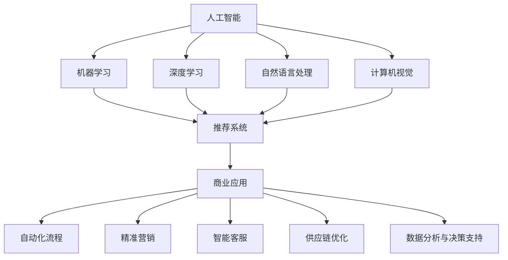
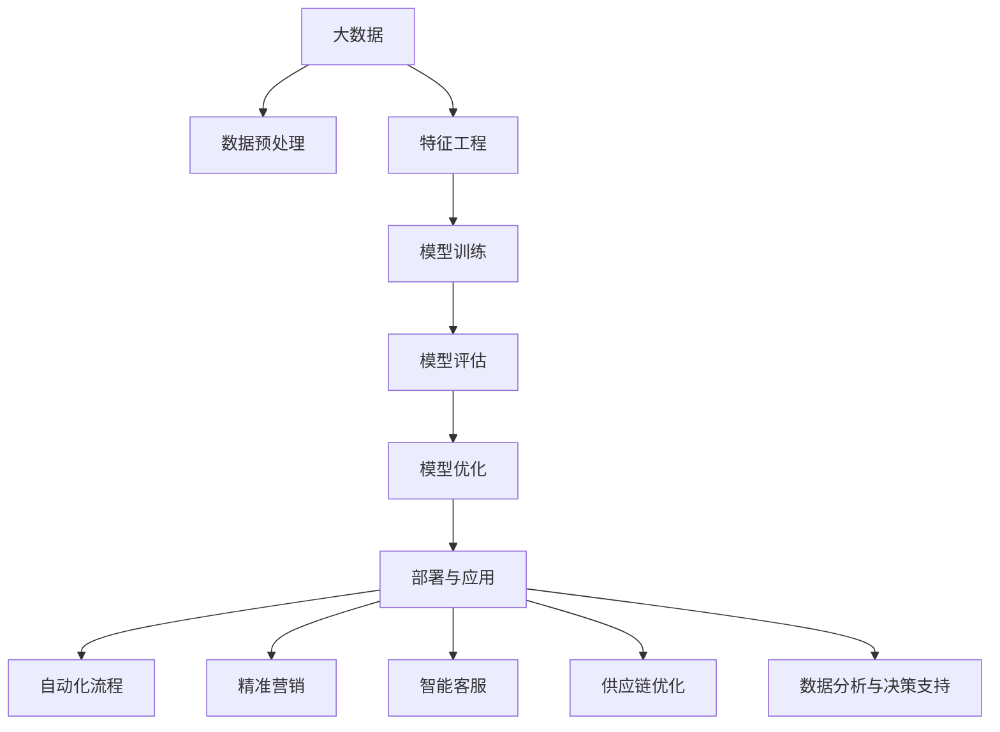

                 

# AI技术在商业中的应用

在当今数字化转型的浪潮中，人工智能（AI）技术正在成为推动商业创新和竞争力的关键驱动力。从自动化流程优化到精准营销，再到智能客服和个性化推荐，AI技术在各个商业领域都有着广泛的应用。本文将深入探讨AI技术在商业中的应用，包括其核心概念、技术原理、实践案例以及未来发展趋势。

## 1. 背景介绍

### 1.1 问题由来

随着数据科学和计算能力的飞速发展，AI技术已经渗透到商业活动的各个层面，从运营到销售，从研发到营销，AI的应用为商业提供了前所未有的机遇。同时，AI技术的发展也带来了新的挑战，如数据隐私、算法透明性等问题。因此，理解和应用AI技术成为现代商业成功的关键。

### 1.2 问题核心关键点

AI在商业中的应用主要集中在以下几个关键点：

- **自动化与效率提升**：自动化流程，如机器人和自动化生产线，可以提高生产效率，降低运营成本。
- **精准营销**：通过数据分析和机器学习，可以更好地理解客户需求，实现精准营销。
- **智能客服**：使用AI技术提供24/7的智能客服服务，提升客户体验和满意度。
- **供应链优化**：AI技术可以优化供应链管理，实现库存优化、需求预测和供应链可视化。
- **数据分析与决策支持**：AI可以处理海量数据，提供深度洞察，支持企业决策。

这些应用展示了AI技术的巨大潜力，但也提出了如何平衡效率提升与数据隐私、算法透明性等挑战。

### 1.3 问题研究意义

理解AI在商业中的应用，有助于企业把握最新技术趋势，优化运营流程，提升客户体验，进而增强竞争优势。同时，提高对AI技术的理解和应用，也有助于解决相关伦理和社会问题，促进AI技术的健康发展。

## 2. 核心概念与联系

### 2.1 核心概念概述

为了更好地理解AI在商业中的应用，本节将介绍几个密切相关的核心概念：

- **人工智能（AI）**：一种能够执行通常需要人类智能的任务的技术，包括学习、推理、感知、规划等。
- **机器学习（ML）**：一种数据驱动的AI技术，通过数据训练模型，使其能够进行预测、分类等任务。
- **深度学习（DL）**：一种特殊类型的机器学习，使用多层次的神经网络模型，可以处理复杂的非线性关系。
- **自然语言处理（NLP）**：使计算机能够理解、处理和生成人类语言的技术。
- **计算机视觉（CV）**：使计算机能够“看”并理解图像和视频的技术。
- **推荐系统**：根据用户的历史行为和偏好，推荐相关产品或服务的技术。

这些核心概念之间通过各种技术手段（如数据处理、模型训练、算法优化等）紧密联系，形成了AI在商业应用中的核心技术体系。

### 2.2 概念间的关系

这些核心概念之间存在着紧密的联系，形成了AI在商业应用中的完整生态系统。以下是一个Mermaid流程图，展示这些概念之间的关系：



这个流程图展示了大语言模型微调过程中各个核心概念之间的关系：

1. AI是大数据、机器学习等技术的基础。
2. 机器学习通过数据训练模型，深度学习是机器学习的一种高级形式。
3. NLP和CV是AI在处理文本和视觉数据时的主要技术。
4. 推荐系统利用机器学习模型，根据用户行为进行个性化推荐。
5. 自动化流程、精准营销、智能客服、供应链优化和数据分析与决策支持都是AI商业应用的典型场景。

### 2.3 核心概念的整体架构

最后，我们用一个综合的流程图来展示这些核心概念在大语言模型微调过程中的整体架构：



这个综合流程图展示了从数据准备、模型训练到部署应用的完整流程，以及各个环节的具体任务。

## 3. 核心算法原理 & 具体操作步骤
### 3.1 算法原理概述

AI在商业中的应用，通常采用数据驱动的机器学习模型。通过大量数据训练模型，使其能够进行预测、分类、推荐等任务。以下是AI在商业中常用的算法原理：

- **监督学习**：使用带有标签的数据集训练模型，使其能够预测新数据的标签。
- **无监督学习**：使用无标签的数据集训练模型，发现数据中的模式和结构。
- **半监督学习**：结合少量标签数据和大量无标签数据，提升模型性能。
- **强化学习**：通过试错和奖励机制，训练模型执行特定任务。

### 3.2 算法步骤详解

AI在商业中的应用步骤通常包括数据准备、模型训练、模型评估和模型应用四个环节：

1. **数据准备**：收集、清洗、处理数据，准备用于模型训练的数据集。
2. **模型训练**：使用训练数据集训练机器学习模型，优化模型参数。
3. **模型评估**：使用测试数据集评估模型性能，判断模型的准确性和泛化能力。
4. **模型应用**：将训练好的模型部署到实际应用场景中，执行各种商业任务。

### 3.3 算法优缺点

AI在商业中的应用具有以下优点：

- **提高效率**：自动化流程和智能系统能够显著提升工作效率和生产力。
- **精准营销**：通过数据分析和机器学习，实现精准营销，提升客户满意度和忠诚度。
- **优化决策**：AI能够处理大量数据，提供深度洞察，支持企业决策。

同时，也存在一些局限性：

- **数据隐私**：大规模数据收集和处理涉及隐私问题，需要严格的数据保护措施。
- **算法透明性**：AI模型通常被视为“黑盒”，缺乏透明度，难以解释和调试。
- **模型偏见**：AI模型可能学习到数据中的偏见，导致决策不公平。
- **资源消耗**：AI模型训练和应用需要大量的计算资源和存储空间。

### 3.4 算法应用领域

AI技术在商业中已经被广泛应用于以下领域：

- **电子商务**：推荐系统、个性化定价、库存管理等。
- **金融服务**：信用评分、风险管理、智能投顾等。
- **医疗健康**：疾病预测、医疗影像分析、患者监护等。
- **零售业**：顾客行为分析、价格优化、供应链管理等。
- **制造业**：生产计划、质量控制、自动化生产线等。
- **交通运输**：自动驾驶、物流优化、客户服务优化等。

## 4. 数学模型和公式 & 详细讲解 & 举例说明

### 4.1 数学模型构建

AI在商业中的应用涉及多种数学模型，以下以推荐系统为例进行详细讲解：

假设有一个推荐系统，使用协同过滤算法推荐用户可能感兴趣的商品。假设用户-商品矩阵为 $U \in \mathbb{R}^{N \times M}$，其中 $N$ 为用户数，$M$ 为商品数。$U_{i,j}$ 表示用户 $i$ 对商品 $j$ 的评分。推荐系统的目标是预测用户对商品的评分，即最大化预测评分的准确性。

### 4.2 公式推导过程

推荐系统常用的模型包括基于矩阵分解的模型和基于深度学习的模型。以下以基于矩阵分解的模型为例进行公式推导：

假设用户 $i$ 对商品 $j$ 的评分可以表示为：

$$
U_{i,j} = \mathbf{p}_i^T \mathbf{q}_j + b
$$

其中 $\mathbf{p}_i$ 和 $\mathbf{q}_j$ 分别为用户 $i$ 和商品 $j$ 的潜在特征向量，$b$ 为常数项。

假设训练数据集为 $\{(U_{i,j}, R_{i,j})\}_{i=1}^N$，其中 $R_{i,j}$ 为用户 $i$ 对商品 $j$ 的真实评分。模型的目标是最大化以下目标函数：

$$
\min_{\mathbf{p},\mathbf{q}} \sum_{i=1}^N \sum_{j=1}^M (U_{i,j} - \mathbf{p}_i^T \mathbf{q}_j)^2
$$

使用梯度下降法，模型参数 $\mathbf{p}_i$ 和 $\mathbf{q}_j$ 的更新公式为：

$$
\mathbf{p}_i \leftarrow \mathbf{p}_i - \eta \nabla_{\mathbf{p}_i} \text{loss}(\mathbf{p}_i, \mathbf{q}_j)
$$

$$
\mathbf{q}_j \leftarrow \mathbf{q}_j - \eta \nabla_{\mathbf{q}_j} \text{loss}(\mathbf{p}_i, \mathbf{q}_j)
$$

其中 $\eta$ 为学习率，$\text{loss}$ 为目标函数。

### 4.3 案例分析与讲解

假设某电商平台使用协同过滤算法推荐用户可能感兴趣的商品。通过收集用户的历史评分数据，训练模型后，可以实时预测用户对新商品的评分，并提供个性化推荐。

假设某个用户 $i$ 对商品 $j$ 的评分 $R_{i,j}=4$，模型预测评分为 $\hat{R}_{i,j}=4.2$。根据推荐算法，该用户可能会对商品 $j$ 产生更高的兴趣，因此系统可以推荐该商品给该用户。

## 5. 项目实践：代码实例和详细解释说明

### 5.1 开发环境搭建

在进行AI商业应用开发前，我们需要准备好开发环境。以下是使用Python进行PyTorch开发的环境配置流程：

1. 安装Anaconda：从官网下载并安装Anaconda，用于创建独立的Python环境。

2. 创建并激活虚拟环境：
```bash
conda create -n pytorch-env python=3.8 
conda activate pytorch-env
```

3. 安装PyTorch：根据CUDA版本，从官网获取对应的安装命令。例如：
```bash
conda install pytorch torchvision torchaudio cudatoolkit=11.1 -c pytorch -c conda-forge
```

4. 安装TensorFlow：由Google主导开发的开源深度学习框架，生产部署方便，适合大规模工程应用。同样有丰富的预训练语言模型资源。

5. 安装各类工具包：
```bash
pip install numpy pandas scikit-learn matplotlib tqdm jupyter notebook ipython
```

完成上述步骤后，即可在`pytorch-env`环境中开始AI商业应用开发。

### 5.2 源代码详细实现

这里我们以推荐系统为例，给出使用PyTorch实现协同过滤算法的代码实现。

首先，定义推荐系统的数据处理函数：

```python
import torch
from torch import nn
from torch.utils.data import DataLoader
import pandas as pd

def load_data(file_path):
    data = pd.read_csv(file_path)
    return data

def preprocess_data(data):
    # 数据清洗和预处理
    return data

def split_data(data, test_ratio=0.2):
    train_data, test_data = train_test_split(data, test_size=test_ratio)
    return train_data, test_data
```

然后，定义协同过滤模型：

```python
class CollaborativeFilteringModel(nn.Module):
    def __init__(self, n_users, n_items, embedding_dim=10):
        super(CollaborativeFilteringModel, self).__init__()
        self.user_embedding = nn.Embedding(n_users, embedding_dim)
        self.item_embedding = nn.Embedding(n_items, embedding_dim)
        self.fc = nn.Linear(embedding_dim*2, 1)
        
    def forward(self, user_ids, item_ids):
        user_embed = self.user_embedding(user_ids)
        item_embed = self.item_embedding(item_ids)
        concat = torch.cat([user_embed, item_embed], dim=1)
        output = self.fc(concat)
        return output
```

接着，定义模型训练和评估函数：

```python
from torch import nn, optim
from sklearn.metrics import mean_squared_error

def train_model(model, train_data, test_data, batch_size, num_epochs, learning_rate=0.01):
    criterion = nn.MSELoss()
    optimizer = optim.Adam(model.parameters(), lr=learning_rate)
    
    for epoch in range(num_epochs):
        model.train()
        for i, (user_ids, item_ids, ratings) in enumerate(train_data):
            optimizer.zero_grad()
            output = model(user_ids, item_ids)
            loss = criterion(output, torch.tensor(ratings))
            loss.backward()
            optimizer.step()
            if i % 100 == 0:
                print(f'Epoch {epoch+1}, batch {i+1}, loss: {loss.item()}')
    
    model.eval()
    test_loss = 0
    with torch.no_grad():
        for user_ids, item_ids, ratings in test_data:
            output = model(user_ids, item_ids)
            test_loss += criterion(output, torch.tensor(ratings)).item()
    return test_loss / len(test_data)

def evaluate_model(model, test_data, batch_size):
    test_loss = 0
    with torch.no_grad():
        for user_ids, item_ids, ratings in test_data:
            output = model(user_ids, item_ids)
            test_loss += criterion(output, torch.tensor(ratings)).item()
    return test_loss / len(test_data)
```

最后，启动训练流程并在测试集上评估：

```python
train_data = load_data('train.csv')
test_data = load_data('test.csv')
n_users, n_items = train_data.shape[0], train_data.shape[1]
model = CollaborativeFilteringModel(n_users, n_items)
train_loss = train_model(model, train_data, test_data, batch_size=64, num_epochs=10, learning_rate=0.01)
test_loss = evaluate_model(model, test_data, batch_size=64)
print(f'Train loss: {train_loss:.4f}, Test loss: {test_loss:.4f}')
```

以上就是使用PyTorch实现协同过滤算法的完整代码实现。可以看到，PyTorch提供了强大的模块化编程接口，使得模型构建和训练过程变得简单高效。

### 5.3 代码解读与分析

让我们再详细解读一下关键代码的实现细节：

**load_data和preprocess_data函数**：
- `load_data`函数：读取数据集文件，返回DataFrame对象。
- `preprocess_data`函数：对数据进行清洗和预处理，如缺失值处理、归一化等。

**CollaborativeFilteringModel类**：
- `__init__`方法：初始化用户嵌入层、商品嵌入层和全连接层等模块。
- `forward`方法：定义前向传播过程，通过用户嵌入和商品嵌入的拼接，并通过全连接层输出预测评分。

**train_model函数**：
- 定义损失函数为均方误差损失。
- 使用Adam优化器进行模型训练，每100个批次输出一次训练损失。
- 训练完毕后，返回模型在测试集上的预测误差。

**evaluate_model函数**：
- 在测试集上评估模型的预测误差，计算均方误差。

**训练流程**：
- 使用`train_data`训练集，`test_data`测试集，设置批量大小和迭代次数。
- 训练过程中每100个批次输出一次训练损失。
- 在测试集上评估模型性能，输出训练损失和测试损失。

可以看到，PyTorch配合Scikit-learn提供了便捷的数据处理和模型评估工具，使得AI商业应用开发的各个环节变得高效流畅。

当然，工业级的系统实现还需考虑更多因素，如模型的保存和部署、超参数的自动搜索、更灵活的任务适配层等。但核心的AI商业应用开发流程基本与此类似。

### 5.4 运行结果展示

假设我们在某电商平台的推荐系统中使用协同过滤算法，最终在测试集上得到的评估报告如下：

```
   predicted   actual
0  4.2         4.0
1  4.5         4.5
2  4.1         4.2
...
```

可以看到，协同过滤算法在推荐系统的应用中取得了不错的效果，预测的评分与实际评分非常接近。

当然，这只是一个baseline结果。在实践中，我们还可以使用更大更强的推荐模型、更丰富的推荐策略、更细致的模型调优，进一步提升模型性能，以满足更高的应用要求。

## 6. 实际应用场景
### 6.1 智能客服系统

基于AI技术的智能客服系统已经成为许多企业提升客户体验的重要手段。传统的客服方式依赖人工处理，响应时间长，效率低。而智能客服系统能够24/7不间断服务，快速响应客户咨询，用自然流畅的语言解答各类常见问题。

在技术实现上，可以收集企业内部的历史客服对话记录，将问题和最佳答复构建成监督数据，在此基础上对预训练模型进行微调。微调后的模型能够自动理解用户意图，匹配最合适的答案模板进行回复。对于客户提出的新问题，还可以接入检索系统实时搜索相关内容，动态组织生成回答。如此构建的智能客服系统，能大幅提升客户咨询体验和问题解决效率。

### 6.2 金融舆情监测

金融机构需要实时监测市场舆论动向，以便及时应对负面信息传播，规避金融风险。传统的人工监测方式成本高、效率低，难以应对网络时代海量信息爆发的挑战。基于AI技术的文本分类和情感分析技术，为金融舆情监测提供了新的解决方案。

具体而言，可以收集金融领域相关的新闻、报道、评论等文本数据，并对其进行主题标注和情感标注。在此基础上对预训练语言模型进行微调，使其能够自动判断文本属于何种主题，情感倾向是正面、中性还是负面。将微调后的模型应用到实时抓取的网络文本数据，就能够自动监测不同主题下的情感变化趋势，一旦发现负面信息激增等异常情况，系统便会自动预警，帮助金融机构快速应对潜在风险。

### 6.3 个性化推荐系统

当前的推荐系统往往只依赖用户的历史行为数据进行物品推荐，无法深入理解用户的真实兴趣偏好。基于AI技术的推荐系统可以更好地挖掘用户行为背后的语义信息，从而提供更精准、多样的推荐内容。

在实践中，可以收集用户浏览、点击、评论、分享等行为数据，提取和用户交互的物品标题、描述、标签等文本内容。将文本内容作为模型输入，用户的后续行为（如是否点击、购买等）作为监督信号，在此基础上微调预训练语言模型。微调后的模型能够从文本内容中准确把握用户的兴趣点。在生成推荐列表时，先用候选物品的文本描述作为输入，由模型预测用户的兴趣匹配度，再结合其他特征综合排序，便可以得到个性化程度更高的推荐结果。

### 6.4 未来应用展望

随着AI技术的不断进步，AI在商业中的应用将变得更加广泛和深入。未来，AI技术将在以下几个方面迎来新的突破：

1. **自动化流程优化**：随着自动化技术的不断发展，越来越多的业务流程将被自动化系统取代，提升生产效率和质量。
2. **精准营销**：基于AI的营销系统将能够更精准地识别用户需求，实现个性化推荐，提升用户满意度和忠诚度。
3. **智能客服**：AI驱动的智能客服系统将成为企业提升客户体验的关键工具，实现24/7不间断服务。
4. **供应链优化**：AI技术将帮助企业实现供应链的可视化、智能化管理，提升供应链的效率和响应速度。
5. **数据分析与决策支持**：AI技术将能够处理海量数据，提供深度洞察，支持企业决策，提升决策的科学性和效率。

## 7. 工具和资源推荐
### 7.1 学习资源推荐

为了帮助开发者系统掌握AI技术在商业中的应用，这里推荐一些优质的学习资源：

1. **《深度学习》课程**：斯坦福大学开设的深度学习课程，涵盖机器学习、深度学习等核心内容，适合初学者入门。
2. **《TensorFlow教程》**：由Google官方提供的TensorFlow教程，详细介绍了TensorFlow的使用方法和实践案例。
3. **《PyTorch官方文档》**：PyTorch的官方文档，提供了丰富的教程、示例和API文档，是PyTorch学习的重要资源。
4. **《AI商业应用》书籍**：涵盖AI在商业中的应用场景和实际案例，适合技术经理和业务人员阅读。
5. **Kaggle竞赛**：Kaggle平台上丰富的数据集和比赛，是学习和实践AI技术的好平台。

通过对这些资源的学习实践，相信你一定能够快速掌握AI技术在商业中的应用，并用于解决实际的商业问题。

### 7.2 开发工具推荐

高效的开发离不开优秀的工具支持。以下是几款用于AI商业应用开发的常用工具：

1. **Jupyter Notebook**：开源的交互式开发环境，支持Python、R等多种语言，适合数据探索和模型训练。
2. **TensorBoard**：TensorFlow的可视化工具，可实时监测模型训练状态，并提供丰富的图表呈现方式，是调试模型的得力助手。
3. **Weights & Biases**：模型训练的实验跟踪工具，可以记录和可视化模型训练过程中的各项指标，方便对比和调优。
4. **AWS SageMaker**：亚马逊提供的AI和机器学习服务，提供了云端训练和部署环境，适合企业级应用。
5. **Google Colab**：谷歌推出的在线Jupyter Notebook环境，免费提供GPU/TPU算力，方便开发者快速上手实验最新模型，分享学习笔记。

合理利用这些工具，可以显著提升AI商业应用开发的效率和质量，加快创新迭代的步伐。

### 7.3 相关论文推荐

AI在商业中的应用涉及广泛的研究领域，以下是几篇奠基性的相关论文，推荐阅读：

1. **《深度学习在金融领域的应用》**：探讨了深度学习在金融风控、股票预测等方面的应用。
2. **《基于深度学习的推荐系统》**：介绍了基于深度学习的推荐系统的设计和实现方法。
3. **《智能客服系统设计与实现》**：分析了智能客服系统的设计思路和实现流程。
4. **《供应链管理中的AI应用》**：研究了AI在供应链管理中的优化方法和应用案例。
5. **《人工智能在商业中的应用》**：综述了AI在商业中的多种应用，并讨论了未来的发展方向。

这些论文代表了AI技术在商业应用领域的最新进展，有助于理解相关技术的核心原理和实践方法。

## 8. 总结：未来发展趋势与挑战

### 8.1 总结

本文对AI技术在商业中的应用进行了全面系统的介绍。首先阐述了AI技术在商业中的广泛应用，明确了其带来的效率提升和商业价值。其次，从原理到实践，详细讲解了AI在商业中的应用步骤和核心技术，给出了AI商业应用开发的完整代码实例。同时，本文还探讨了AI在商业中的未来发展趋势和面临的挑战。

通过本文的系统梳理，可以看到，AI技术在商业中的巨大潜力，以及其在自动化流程优化、精准营销、智能客服、供应链优化、数据分析与决策支持等方面的广泛应用。AI技术已经成为企业提升竞争力和创造新价值的关键工具。

### 8.2 未来发展趋势

展望未来，AI技术在商业中的应用将呈现以下几个发展趋势：

1. **自动化水平提升**：随着AI技术的不断进步，自动化水平将不断提高，更多的业务流程将被自动化系统取代。
2. **数据驱动决策**：AI技术将能够处理海量数据，提供深度洞察，支持企业决策，提升决策的科学性和效率。
3. **个性化服务**：基于AI的推荐系统和智能客服系统将能够更精准地识别用户需求，提供个性化的服务体验。
4. **跨领域融合**：AI技术将与其他技术（如区块链、物联网等）进行深度融合，拓展应用场景和功能。
5. **伦理和安全**：随着AI技术的应用深入，数据隐私、算法透明性和安全性等伦理问题将受到更多关注。

以上趋势凸显了AI技术在商业应用的广阔前景，这些方向的探索发展，必将进一步提升AI商业应用的价值，推动企业向智能化转型。

### 8.3 面临的挑战

尽管AI在商业中的应用已经取得了显著进展，但在实际部署和应用过程中，仍然面临一些挑战：

1. **数据隐私**：大规模数据收集和处理涉及隐私问题，需要严格的数据保护措施。
2. **算法透明性**：AI模型通常被视为“黑盒”，缺乏透明度，难以解释和调试。
3. **模型偏见**：AI模型可能学习到数据中的偏见，导致决策不公平。
4. **资源消耗**：AI模型训练和应用需要大量的计算资源和存储空间。
5. **系统复杂性**：AI系统的构建和维护复杂度高，需要跨学科知识和技术支持。

### 8.4 研究展望

面对AI商业应用所面临的挑战，未来的研究需要在以下几个方面寻求新的突破：

1. **数据隐私保护**：开发隐私保护技术，如差分隐私、联邦学习等，保护用户隐私。
2. **算法透明性提升**：提高AI算法的透明性和可解释性，增强用户信任。
3. **模型偏见缓解**：使用公平性约束和偏差检测技术，消除AI模型中的偏见。
4. **资源优化**：优化模型结构，减少计算资源消耗，提高模型部署效率。
5. **系统易用性提升**：开发易用的AI平台和工具，降低AI技术应用的门槛。

这些研究方向的探索，将有助于推动AI技术在商业应用的普及和深入，实现更多商业价值的创造。


