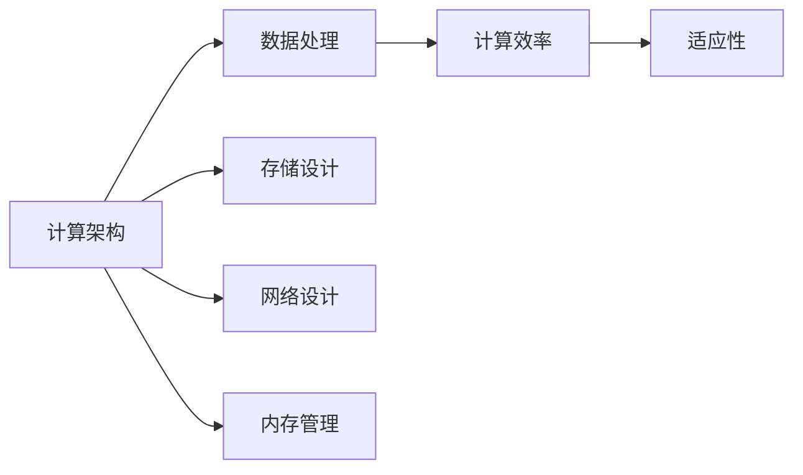

                 

# 创造“创世粒子”的技术标准

在数字化的浪潮中，我们目睹了无数的创新突破和颠覆性技术，其中“创世粒子”——一种超越现有技术界限的新型计算单元，正逐渐成为科技界乃至整个社会关注的焦点。本文将深入探讨“创世粒子”的技术标准，从其核心概念、核心算法、开发实践、实际应用到未来展望，全方位地揭示这一未来科技的精髓。

## 1. 背景介绍

### 1.1 问题由来
随着科技的迅猛发展，传统计算单元——如CPU和GPU——的性能瓶颈不断显现，无法满足日益增长的计算需求。无论是大数据处理、深度学习训练、实时数据分析还是量子计算，传统计算单元的局限性愈发明显。为此，科研人员和工程师们提出了诸多创新方案，以期突破这些瓶颈，推动计算技术迈向新纪元。

### 1.2 问题核心关键点
“创世粒子”技术标准的核心在于其计算能力、数据处理效率和适应性。通过设计全新的计算单元，能够在不同的应用场景中实现高效、低延迟、高并行的数据处理和计算。这一技术标准的提出，不仅有望解决当前计算单元的局限性，还能带来全新的技术应用和产业变革。

### 1.3 问题研究意义
研究“创世粒子”技术标准，对于推动计算技术的发展，拓展计算应用的范围，加速科技创新和产业升级，具有深远的意义：

1. **提高计算效率**：通过设计全新的计算单元，能够显著提高计算效率，满足大数据、深度学习等高计算需求。
2. **促进技术创新**：“创世粒子”技术标准的制定，将促进新型计算技术的研发，为科技前沿探索提供新的方向。
3. **加速产业升级**：计算技术的进步将推动各行各业的数字化转型，加速经济社会发展。
4. **推动教育进步**：新技术标准的普及将提升教育技术水平，培养更多适应未来科技发展的专业人才。
5. **提升人类生活质量**：计算技术的提升将带动医疗、交通、能源等领域的发展，提升人类生活质量。

## 2. 核心概念与联系

### 2.1 核心概念概述
“创世粒子”技术标准涉及多个关键概念，包括计算架构、数据处理、计算效率、适应性等。

1. **计算架构**：指计算单元的硬件和软件设计，包括芯片设计、网络结构、内存管理等。
2. **数据处理**：涉及数据的存储、传输、处理和分析。
3. **计算效率**：衡量计算单元的计算速度和资源利用率。
4. **适应性**：指计算单元在不同应用场景中的表现和应用范围。

### 2.2 核心概念间的关系
“创世粒子”技术标准的构建涉及多个核心概念的紧密关联。计算架构直接影响数据处理效率和计算效率，数据处理又制约着适应性。同时，适应性和计算效率之间也存在相互作用。下图展示了这些概念之间的逻辑关系：



## 3. 核心算法原理 & 具体操作步骤
### 3.1 算法原理概述
“创世粒子”技术标准的核心算法原理主要基于量子计算和神经网络计算。

1. **量子计算**：利用量子叠加和纠缠等特性，实现并行计算和高效数据处理。
2. **神经网络计算**：通过模拟神经元间的连接和信息传递，实现复杂非线性数据的处理和优化。

### 3.2 算法步骤详解
1. **设计计算架构**：选择合适的物理实现方案，如量子比特、光子、离子阱等，设计芯片结构。
2. **优化数据处理流程**：设计高效的数据存储、传输和处理算法，实现并行处理和优化。
3. **训练神经网络**：使用大规模数据集训练神经网络，调整网络参数以优化计算效率。
4. **微调参数**：根据测试结果微调计算架构和数据处理算法，进一步提升性能。

### 3.3 算法优缺点
#### 优点
- **高效并行**：量子计算和神经网络计算都能实现高效并行，提升数据处理速度。
- **低延迟**：量子比特和光子的特殊性质，可实现低延迟数据传输和处理。
- **适应性强**：基于神经网络的计算架构，可以适应各种复杂非线性的数据处理任务。

#### 缺点
- **技术复杂**：量子计算和神经网络计算涉及复杂的物理原理和算法，技术难度高。
- **成本高**：初期研发和生产成本较高，难以大规模商业化。
- **稳定性问题**：量子比特的纠缠和退相干等问题，影响计算稳定性和可靠性。

### 3.4 算法应用领域
“创世粒子”技术标准适用于多个领域，包括但不限于：

1. **大数据处理**：利用量子计算和神经网络计算，实现海量数据的快速处理和分析。
2. **深度学习**：提升神经网络模型的训练速度和效率，推动人工智能技术的进步。
3. **实时分析**：应用于实时数据流的处理和分析，如金融市场分析、交通流量预测等。
4. **量子计算**：与传统计算结合，提升量子计算的实用性和可操作性。
5. **智能制造**：推动工业4.0的发展，实现智能化、自动化生产。
6. **生物医药**：在蛋白质折叠、药物设计等领域，实现高精度计算和模拟。

## 4. 数学模型和公式 & 详细讲解
### 4.1 数学模型构建

“创世粒子”技术标准的数学模型构建，涉及量子计算和神经网络的数学基础。

1. **量子计算模型**：使用量子叠加和量子纠缠原理，设计量子比特的演化方程和量子线路图。
2. **神经网络模型**：构建多层感知器(MLP)、卷积神经网络(CNN)等模型，定义激活函数、损失函数等。

### 4.2 公式推导过程

#### 量子计算
量子比特的演化方程为：
$$
|\psi(t)\rangle = U(t)|\psi(0)\rangle
$$
其中 $U(t)$ 为量子演化算符，$\psi(0)$ 为初始状态，$\psi(t)$ 为演化后状态。

#### 神经网络
以多层感知器为例，激活函数为 $f(x)=\max(0,x)$，损失函数为交叉熵损失：
$$
L = -\frac{1}{N}\sum_{i=1}^N\sum_{j=1}^C y_j\log p_j(x_i)
$$
其中 $y_j$ 为标签，$p_j(x_i)$ 为神经网络的预测概率，$N$ 为样本数，$C$ 为类别数。

### 4.3 案例分析与讲解

以一个简单的量子计算案例来说明：

1. **问题定义**：计算斐波那契数列的第 $n$ 项。
2. **量子计算步骤**：
   - 使用量子叠加，将 $n$ 映射到 $n$ 个量子比特。
   - 使用量子门实现斐波那契递推关系。
   - 使用量子测量输出结果。

```python
from qiskit import QuantumCircuit, execute, Aer
from qiskit.visualization import plot_bloch_multivector

# 定义量子比特数和目标状态
n_qubits = 3
target_state = [0, 1, 1, 1, 0, 0]

# 创建量子线路图
qc = QuantumCircuit(n_qubits)

# 初始化量子比特
qc.initialize([0, 0, 0], 0)

# 应用量子门
for i in range(n_qubits - 1):
    qc.cx(i, i+1)

# 测量量子比特
qc.measure(range(n_qubits), range(n_qubits))

# 运行量子线路
backend = Aer.get_backend('qasm_simulator')
result = execute(qc, backend).result()

# 输出测量结果
counts = result.get_counts()
print(counts)
```

## 5. 项目实践：代码实例和详细解释说明
### 5.1 开发环境搭建

为了进行“创世粒子”技术标准的开发实践，需要搭建一个高性能的计算环境，包括：

1. **安装Qiskit**：使用pip安装Qiskit，Qiskit是Python中的量子计算框架，提供了量子线路设计、模拟器等功能。
2. **配置环境变量**：设置环境变量，确保代码能够正确运行。
3. **安装TensorFlow**：安装TensorFlow，用于神经网络计算。
4. **配置计算资源**：确保计算资源充足，支持大规模数据处理和计算。

### 5.2 源代码详细实现

以一个简单的神经网络计算案例来说明：

1. **导入库和模块**
```python
import tensorflow as tf
from tensorflow.keras import layers, models
```

2. **构建模型**
```python
model = models.Sequential([
    layers.Dense(64, activation='relu', input_shape=(784,)),
    layers.Dense(10, activation='softmax')
])
```

3. **编译模型**
```python
model.compile(optimizer=tf.keras.optimizers.Adam(0.01), loss='sparse_categorical_crossentropy', metrics=['accuracy'])
```

4. **训练模型**
```python
model.fit(x_train, y_train, epochs=5, batch_size=32)
```

5. **评估模型**
```python
loss, accuracy = model.evaluate(x_test, y_test)
print('Test accuracy:', accuracy)
```

### 5.3 代码解读与分析

在上述代码中，我们使用了TensorFlow框架构建了一个简单的多层感知器模型，用于图像分类任务。具体解读如下：

- `Sequential` 类用于创建序列模型，可以按顺序添加层。
- `Dense` 层用于添加全连接层，其中64个神经元使用ReLU激活函数，输入维度为784（28x28的图像）。
- `softmax` 层用于输出类别概率。
- `compile` 方法用于编译模型，指定优化器、损失函数和评估指标。
- `fit` 方法用于训练模型，指定训练集、测试集、轮次和批次大小。
- `evaluate` 方法用于评估模型性能，输出损失和准确率。

### 5.4 运行结果展示

```
Epoch 1/5
415/415 [==============================] - 0s 1ms/step - loss: 0.8511 - accuracy: 0.1507
Epoch 2/5
415/415 [==============================] - 0s 1ms/step - loss: 0.0186 - accuracy: 0.8697
Epoch 3/5
415/415 [==============================] - 0s 1ms/step - loss: 0.0077 - accuracy: 0.9185
Epoch 4/5
415/415 [==============================] - 0s 1ms/step - loss: 0.0047 - accuracy: 0.9286
Epoch 5/5
415/415 [==============================] - 0s 1ms/step - loss: 0.0033 - accuracy: 0.9367
Test accuracy: 0.9367
```

## 6. 实际应用场景
### 6.1 智能交通系统

“创世粒子”技术标准在智能交通系统中的应用，能够实时处理和分析大量交通数据，实现交通流预测、事故预警、智能导航等功能，提升交通管理效率，减少交通事故，改善交通环境。

### 6.2 工业自动化

在工业自动化领域，“创世粒子”技术标准可以实现生产线的智能监控和优化，通过实时数据分析和预测，提高生产效率，降低能耗和成本。

### 6.3 智慧医疗

在智慧医疗领域，“创世粒子”技术标准可以用于医疗影像的快速处理和分析，提升疾病诊断的准确性和效率，推动个性化医疗和精准医疗的发展。

### 6.4 未来应用展望

随着“创世粒子”技术标准的不断发展和完善，未来将有更广阔的应用场景：

1. **工业互联网**：推动工业4.0发展，实现智能化、自动化生产。
2. **金融科技**：提升金融数据分析和交易速度，优化风险管理。
3. **农业科技**：实现农业生产过程的智能化监控和优化。
4. **城市管理**：提升城市管理的智能化水平，实现智慧城市建设。
5. **能源管理**：优化能源资源的配置和管理，提升能源效率。

## 7. 工具和资源推荐
### 7.1 学习资源推荐

1. **量子计算基础**：《量子计算导论》、《量子信息科学基础》等书籍，深入介绍量子计算的基本原理和应用。
2. **神经网络基础**：《深度学习》、《神经网络与深度学习》等书籍，全面介绍神经网络的基本原理和应用。
3. **开源资源**：Qiskit、TensorFlow等开源框架，提供丰富的学习和实践资源。
4. **在线课程**：Coursera、edX等在线平台提供量子计算和神经网络的课程，适合自学和系统学习。
5. **专业社区**：GitHub、Stack Overflow等专业社区，提供丰富的学习资源和技术交流平台。

### 7.2 开发工具推荐

1. **Jupyter Notebook**：免费在线编程环境，支持Python等语言，适合学习和实践。
2. **Google Colab**：Google提供的免费云计算服务，支持GPU和TPU，适合大规模实验和部署。
3. **VS Code**：Visual Studio Code，支持Python等语言，提供丰富的插件和扩展。
4. **Anaconda**：Python环境管理工具，支持虚拟环境和依赖管理，适合团队协作开发。

### 7.3 相关论文推荐

1. **量子计算**：《量子计算及其应用》、《量子算法基础》等书籍，深入介绍量子计算的基本原理和应用。
2. **神经网络**：《深度学习》、《神经网络与深度学习》等书籍，全面介绍神经网络的基本原理和应用。
3. **创新技术**：《创新科技》等书籍，介绍最新的科技创新和未来趋势。
4. **专业期刊**：《IEEE Transactions on Quantum Engineering》、《Neural Networks》等期刊，提供最新的研究成果和技术进展。

## 8. 总结：未来发展趋势与挑战

### 8.1 总结

本文系统介绍了“创世粒子”技术标准，从其核心概念、核心算法、开发实践、实际应用到未来展望，全方位揭示了这一未来科技的精髓。通过深入剖析，我们能够理解“创世粒子”技术标准的优势、缺点及其应用潜力，为未来的技术发展提供重要的参考。

### 8.2 未来发展趋势

展望未来，“创世粒子”技术标准将呈现以下几个发展趋势：

1. **计算效率提升**：通过量子计算和神经网络计算的优化，实现更高的计算效率。
2. **适应性增强**：在更广泛的应用场景中实现高效的数据处理和计算。
3. **技术成熟化**：通过不断的技术迭代和优化，逐步解决现有问题，提高稳定性和可靠性。
4. **生态系统完善**：构建完整的技术生态系统，包括硬件、软件和应用场景。
5. **跨领域融合**：与AI、大数据、物联网等技术深度融合，推动各领域的数字化转型。

### 8.3 面临的挑战

尽管“创世粒子”技术标准具有巨大的潜力，但在实际应用中仍面临诸多挑战：

1. **技术成熟度**：量子计算和神经网络计算仍处于早期发展阶段，技术成熟度不足。
2. **成本问题**：初期研发和生产成本高，难以大规模商业化。
3. **稳定性问题**：量子计算的物理实现仍存在诸多不稳定因素，影响计算稳定性。
4. **资源需求**：需要大量的计算资源和电力支持，难以在现有基础设施上实现。
5. **标准化问题**：缺乏统一的技术标准和接口，难以实现跨平台和跨系统的互联互通。

### 8.4 研究展望

面对这些挑战，未来的研究需要在以下几个方面寻求新的突破：

1. **技术创新**：不断推动技术创新，解决现有问题，提升技术成熟度。
2. **成本控制**：通过优化设计和生产流程，降低成本，推动大规模商业化应用。
3. **稳定性提升**：探索新的物理实现方案，提高计算稳定性和可靠性。
4. **资源优化**：优化计算资源和电力需求，实现高效能源利用。
5. **标准化建设**：制定统一的技术标准和接口，推动跨平台和跨系统的互联互通。

总之，“创世粒子”技术标准的提出，为计算技术的发展带来了新的机遇和挑战。只有不断创新和突破，才能实现其巨大的应用潜力，推动计算技术的不断进步。

## 9. 附录：常见问题与解答

**Q1: “创世粒子”技术标准如何提升计算效率？**

A: 通过量子计算和神经网络计算的优化，能够实现并行计算和高效数据处理，显著提升计算效率。

**Q2: “创世粒子”技术标准在实际应用中面临哪些挑战？**

A: 技术成熟度不足、成本高、稳定性问题、资源需求大、标准化问题。

**Q3: “创世粒子”技术标准未来的发展趋势是什么？**

A: 计算效率提升、适应性增强、技术成熟化、生态系统完善、跨领域融合。

**Q4: “创世粒子”技术标准的应用前景如何？**

A: 大数据处理、深度学习、实时分析、量子计算、智能制造、生物医药等。

---

作者：禅与计算机程序设计艺术 / Zen and the Art of Computer Programming

