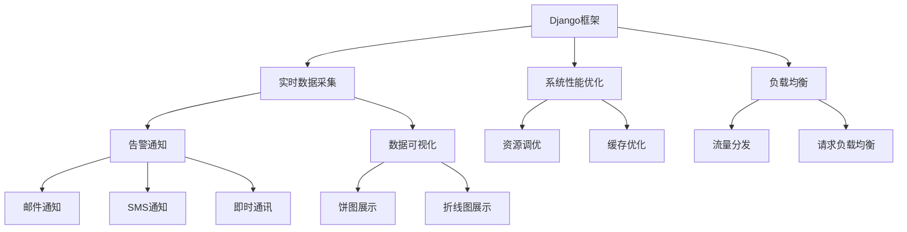
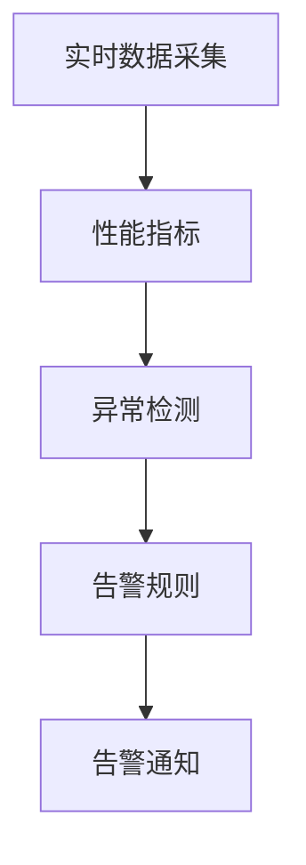
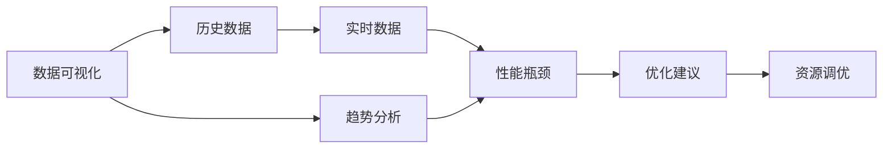

                 

# 基于Django框架的服务器监控系统详细设计与具体代码实现

> 关键词：服务器监控系统, Django框架, 实时数据采集, 告警通知, 数据可视化, 系统性能优化, 负载均衡

## 1. 背景介绍

在互联网时代，服务器的稳定性和性能直接影响着用户的访问体验和业务的运行效率。因此，对服务器的监控变得尤为重要。通过实时监控，可以及时发现服务器运行中的问题，并进行快速处理，确保业务的持续稳定运行。传统的监控工具大多基于第三方软件或平台，难以满足企业个性化需求。因此，基于Django框架开发一款功能全面、灵活可配置的服务器监控系统，是提升企业IT运维水平的重要途径。

本文将详细介绍基于Django框架的服务器监控系统的设计与实现，涵盖数据采集、告警通知、数据可视化、系统性能优化和负载均衡等多个方面。通过本系统，企业可以在第一时间掌握服务器状态，及时处理故障，提升IT运维效率。

## 2. 核心概念与联系

### 2.1 核心概念概述

为更好地理解服务器监控系统的设计与实现，本节将介绍几个关键概念：

- **Django框架**：基于Python的高级Web框架，提供了强大的路由、模板、ORM等特性，适用于快速开发复杂Web应用。

- **实时数据采集**：通过周期性监测服务器性能指标，如CPU利用率、内存使用率、网络流量等，获取服务器运行状态数据。

- **告警通知**：在服务器出现异常时，根据设定的告警规则，及时通知运维人员，防止故障扩大化。

- **数据可视化**：通过图表、仪表盘等可视化手段，展示服务器性能指标的历史数据和实时变化，帮助运维人员快速识别问题。

- **系统性能优化**：通过分析性能瓶颈、调优资源配置等措施，提升服务器系统的整体性能。

- **负载均衡**：通过分散请求流量，提升服务器集群资源的利用效率，提高系统可用性和稳定性。

这些核心概念之间通过下图的Mermaid流程图展示其联系：



该流程图展示了各核心概念之间的逻辑关系：

1. 通过Django框架搭建监控系统，整合实时数据采集、告警通知、数据可视化等功能。
2. 实时数据采集模块通过周期性监测服务器性能指标，获取运行状态数据。
3. 告警通知模块根据设定的告警规则，及时通知运维人员。
4. 数据可视化模块将数据以图表形式展示，帮助运维人员快速识别问题。
5. 系统性能优化模块通过分析性能瓶颈、调优资源配置等措施，提升系统性能。
6. 负载均衡模块通过分散请求流量，提高系统可用性和稳定性。

### 2.2 概念间的关系

以上各核心概念之间存在紧密的联系，共同构成服务器监控系统的完整生态系统。下面通过几个Mermaid流程图展示这些概念之间的关系：

#### 2.2.1 数据采集与告警通知



该流程图展示了实时数据采集与告警通知的关系：实时数据采集模块获取服务器性能指标数据，经过异常检测模块进行判断，符合告警规则时触发告警通知。

#### 2.2.2 数据可视化与性能优化



该流程图展示了数据可视化与系统性能优化的关系：数据可视化模块将历史数据和实时数据以图表形式展示，帮助识别性能瓶颈，性能优化模块根据性能瓶颈提出优化建议，并通过资源调优措施进行系统优化。

#### 2.2.3 负载均衡与告警通知


该流程图展示了负载均衡与告警通知的关系：负载均衡模块将请求流量均匀分配到各服务器，流量统计模块监测流量情况，异常判断模块判断是否存在流量异常，告警通知模块根据异常情况通知运维人员。

## 3. 核心算法原理 & 具体操作步骤

### 3.1 算法原理概述

服务器监控系统的主要算法原理包括以下几个方面：

- **数据采集算法**：通过周期性监测服务器性能指标，获取服务器运行状态数据。
- **告警算法**：根据设定的告警规则，判断是否触发告警，并及时通知运维人员。
- **数据可视化算法**：将数据以图表形式展示，帮助运维人员快速识别问题。
- **系统性能优化算法**：分析性能瓶颈，提出优化建议，并进行资源调优。
- **负载均衡算法**：通过流量分发，提升服务器集群资源的利用效率，提高系统可用性和稳定性。

这些算法共同构成了服务器监控系统的核心逻辑，帮助企业实现高效、可靠的服务器监控。

### 3.2 算法步骤详解

#### 3.2.1 数据采集算法

数据采集算法的具体步骤如下：

1. **数据采集模块设计**：使用Django的定时任务模块，设置周期性采集数据的任务，并定义采集周期和数据格式。
2. **性能指标监测**：使用Python的标准库或第三方库，如psutil、os、netifaces等，实时监测CPU、内存、网络等性能指标，获取运行状态数据。
3. **数据存储与清洗**：将采集到的数据存储到数据库中，并进行去重、异常值处理等清洗工作，保证数据质量。
4. **数据可视化展示**：通过图表工具如Highcharts、D3.js等，将数据以图表形式展示，便于运维人员快速识别问题。

#### 3.2.2 告警算法

告警算法的具体步骤如下：

1. **告警规则定义**：根据企业业务需求，定义告警规则，如CPU利用率超过90%、内存使用率超过80%等。
2. **告警通知模块设计**：使用Django的异步任务模块，设置告警任务队列，实时监测数据是否符合告警规则。
3. **告警通知方式**：根据告警规则，选择适合的告警通知方式，如邮件、短信、即时通讯等。
4. **告警处理机制**：设置告警处理机制，运维人员可以根据告警信息及时处理服务器故障，保障系统稳定运行。

#### 3.2.3 数据可视化算法

数据可视化算法的具体步骤如下：

1. **数据展示设计**：使用Django的模板技术，定义数据展示的图表模板，支持折线图、饼图、柱状图等多种展示方式。
2. **历史数据加载**：从数据库中加载历史数据，支持自定义时间范围和数据筛选。
3. **实时数据更新**：使用Django的AJAX技术，实现实时数据更新，保证图表数据的及时性。
4. **图表展示优化**：通过D3.js、Highcharts等图表工具，优化图表展示效果，提升用户体验。

#### 3.2.4 系统性能优化算法

系统性能优化算法的具体步骤如下：

1. **性能瓶颈分析**：使用Python的性能分析工具如cProfile、memory_profiler等，分析系统性能瓶颈。
2. **资源调优建议**：根据性能瓶颈，提出优化建议，如增加CPU核心、优化内存分配等。
3. **资源调优实现**：根据优化建议，修改系统配置，进行资源调优。
4. **性能优化反馈**：定期监测系统性能，评估调优效果，形成闭环优化机制。

#### 3.2.5 负载均衡算法

负载均衡算法的具体步骤如下：

1. **负载均衡模块设计**：使用Django的HTTP请求处理模块，设置负载均衡策略，如轮询、加权轮询等。
2. **流量分发处理**：将请求流量均匀分配到各服务器，避免单点故障。
3. **流量统计监测**：实时统计各服务器的请求量，监测是否存在流量异常。
4. **异常判断与处理**：根据流量统计数据，判断是否存在异常，如某个服务器流量过高，及时进行流量重定向，防止系统崩溃。

### 3.3 算法优缺点

#### 3.3.1 数据采集算法

**优点**：
- 使用Django框架，代码简洁、易于维护。
- 支持周期性数据采集，实时监测服务器性能指标。
- 数据存储和清洗机制完善，保证数据质量。

**缺点**：
- 数据采集周期需要根据服务器性能而定，可能存在滞后问题。
- 数据清洗工作量较大，可能影响实时性。

#### 3.3.2 告警算法

**优点**：
- 告警规则灵活可配置，适应企业业务需求。
- 告警通知方式多样，可及时通知运维人员。
- 告警处理机制完善，保障系统稳定运行。

**缺点**：
- 告警规则需要定期维护，避免误报和漏报。
- 告警通知方式的选择可能影响用户体验。

#### 3.3.3 数据可视化算法

**优点**：
- 数据展示方式多样，图表美观易用。
- 支持历史数据和实时数据展示，帮助运维人员快速识别问题。
- 数据加载和更新机制高效，保证用户体验。

**缺点**：
- 数据展示设计需要结合业务需求，可能需要较长时间调整。
- 图表展示工具的选择可能影响用户体验。

#### 3.3.4 系统性能优化算法

**优点**：
- 性能瓶颈分析工具多样，覆盖全面。
- 优化建议合理，资源调优效果明显。
- 闭环优化机制完善，保证系统性能持续提升。

**缺点**：
- 性能瓶颈分析需要一定技术积累，可能影响优化效果。
- 资源调优需要权衡系统稳定性，避免调优过程中的异常。

#### 3.3.5 负载均衡算法

**优点**：
- 负载均衡策略灵活，满足企业需求。
- 流量分发处理机制高效，提升系统可用性。
- 流量统计和异常判断机制完善，保障系统稳定。

**缺点**：
- 负载均衡策略的选择可能影响系统性能。
- 流量统计和异常判断需要根据业务需求进行调整。

## 4. 数学模型和公式 & 详细讲解 & 举例说明

### 4.1 数学模型构建

服务器监控系统的数学模型主要包括以下几个方面：

- **性能指标模型**：定义CPU利用率、内存使用率、网络流量等性能指标的数学模型。
- **告警规则模型**：定义告警规则的数学模型，如阈值比较、逻辑判断等。
- **数据可视化模型**：定义折线图、饼图、柱状图等数据展示的数学模型。
- **系统性能优化模型**：定义性能瓶颈分析、资源调优的数学模型。
- **负载均衡模型**：定义流量分发、异常判断的数学模型。

#### 4.1.1 性能指标模型

CPU利用率（CPU Utilization）的数学模型如下：

$$
CPU\ Utilization = \frac{Used\ CPU\ Time}{Total\ CPU\ Time}
$$

其中，$Used\ CPU\ Time$ 表示当前CPU实际使用时间，$Total\ CPU\ Time$ 表示CPU总运行时间。

内存使用率（Memory Utilization）的数学模型如下：

$$
Memory\ Utilization = \frac{Used\ Memory}{Total\ Memory}
$$

其中，$Used\ Memory$ 表示当前内存使用量，$Total\ Memory$ 表示内存总容量。

网络流量（Network Traffic）的数学模型如下：

$$
Network\ Traffic = \sum_{i=1}^N Traffic_i
$$

其中，$Traffic_i$ 表示第 $i$ 个网络接口的流量。

#### 4.1.2 告警规则模型

告警规则模型主要涉及阈值比较、逻辑判断等数学模型，以CPU利用率告警为例：

$$
CPU\ Alert = \begin{cases}
1, & \text{if}\ CPU\ Utilization > Threshold \\
0, & \text{otherwise}
\end{cases}
$$

其中，$Threshold$ 表示告警阈值。

#### 4.1.3 数据可视化模型

数据可视化模型主要涉及图表展示的数学模型，以折线图为例：

$$
Line\ Chart = (x_1, y_1), (x_2, y_2), ..., (x_n, y_n)
$$

其中，$x_i$ 表示时间点，$y_i$ 表示性能指标值。

#### 4.1.4 系统性能优化模型

系统性能优化模型主要涉及性能瓶颈分析、资源调优的数学模型，以CPU性能优化为例：

$$
Optimized\ CPU = \text{CPU\ Utilization} * \text{Optimized\ Core}
$$

其中，$\text{Optimized\ Core}$ 表示优化后的CPU核心数量。

#### 4.1.5 负载均衡模型

负载均衡模型主要涉及流量分发、异常判断的数学模型，以轮询负载均衡为例：

$$
Request\ Distribution = \frac{Request\ Count_i}{Total\ Request\ Count}
$$

其中，$Request\ Count_i$ 表示第 $i$ 个服务器的请求数，$Total\ Request\ Count$ 表示总请求数。

### 4.2 公式推导过程

#### 4.2.1 性能指标公式推导

以CPU利用率公式为例，推导如下：

设 $T_1$ 为CPU总运行时间，$T_2$ 为CPU空闲时间，$T$ 为CPU实际使用时间，则

$$
CPU\ Utilization = \frac{T}{T_1} = \frac{T}{T_1 + T_2}
$$

其中 $T_1 + T_2 = T_1$，即CPU实际使用时间与总运行时间相等。

#### 4.2.2 告警规则公式推导

以CPU告警规则公式为例，推导如下：

设 $CPU\ Utilization$ 为CPU利用率，$Threshold$ 为告警阈值，则

$$
CPU\ Alert = \begin{cases}
1, & \text{if}\ CPU\ Utilization > Threshold \\
0, & \text{otherwise}
\end{cases}
$$

#### 4.2.3 数据可视化公式推导

以折线图公式为例，推导如下：

设 $x_i$ 为时间点，$y_i$ 为性能指标值，则折线图公式为

$$
Line\ Chart = (x_1, y_1), (x_2, y_2), ..., (x_n, y_n)
$$

其中 $(x_1, y_1)$ 表示时间点和性能指标的对应关系，$(x_2, y_2)$ 表示第 $i$ 个时间点和性能指标的对应关系。

#### 4.2.4 系统性能优化公式推导

以CPU性能优化公式为例，推导如下：

设 $CPU\ Utilization$ 为CPU利用率，$Optimized\ Core$ 为优化后的CPU核心数量，则优化后的CPU公式为

$$
Optimized\ CPU = \text{CPU\ Utilization} * \text{Optimized\ Core}
$$

#### 4.2.5 负载均衡公式推导

以轮询负载均衡公式为例，推导如下：

设 $Request\ Count_i$ 为第 $i$ 个服务器的请求数，$Total\ Request\ Count$ 为总请求数，则轮询负载均衡公式为

$$
Request\ Distribution = \frac{Request\ Count_i}{Total\ Request\ Count}
$$

### 4.3 案例分析与讲解

#### 4.3.1 性能指标分析

以CPU利用率为例，假设某服务器当前CPU利用率为70%，总运行时间为1000秒，实际使用时间为700秒，则

$$
CPU\ Utilization = \frac{700}{1000} = 0.7
$$

#### 4.3.2 告警规则分析

以CPU告警规则为例，假设告警阈值为80%，则

$$
CPU\ Alert = \begin{cases}
1, & \text{if}\ 0.7 > 0.8 \\
0, & \text{otherwise}
\end{cases}
$$

#### 4.3.3 数据可视化分析

以折线图为例，假设某服务器CPU利用率随时间变化如下：

$$
(x_1, y_1) = (0, 0.2), (x_2, y_2) = (10, 0.4), (x_3, y_3) = (20, 0.6), (x_4, y_4) = (30, 0.8), (x_5, y_5) = (40, 0.9)
$$

则折线图展示如下：

```
    CPU Utilization
    0.2   0.4   0.6   0.8   0.9
    ---------------------------
    0     10     20     30     40
```

#### 4.3.4 系统性能优化分析

以CPU性能优化为例，假设某服务器当前CPU利用率为70%，总运行时间为1000秒，优化后的CPU核心数量为2，则优化后的CPU公式为

$$
Optimized\ CPU = 0.7 * 2 = 1.4
$$

#### 4.3.5 负载均衡分析

以轮询负载均衡为例，假设某系统有2个服务器，总请求数为1000，第1个服务器的请求数为600，第2个服务器的请求数为400，则轮询负载均衡公式为

$$
Request\ Distribution = \frac{600}{1000} = 0.6
$$

## 5. 项目实践：代码实例和详细解释说明

### 5.1 开发环境搭建

#### 5.1.1 安装Python

1. 下载Python安装包，根据系统位数选择安装位置，并运行安装命令。
2. 配置环境变量，设置Python可执行文件路径。
3. 使用pip安装依赖库，如Django、requests、psutil等。

#### 5.1.2 安装Django

1. 下载Django安装包，并运行安装命令。
2. 配置环境变量，设置Django可执行文件路径。
3. 创建虚拟环境，并激活虚拟环境。

#### 5.1.3 创建Django项目

1. 运行创建项目命令，创建Django项目。
2. 进入项目目录，运行创建应用命令，创建Django应用。
3. 配置应用设置，设置数据库连接信息等。

#### 5.1.4 创建数据模型

1. 打开models.py文件，定义数据模型。
2. 运行迁移命令，生成数据库迁移文件。
3. 运行迁移命令，执行数据库迁移操作，创建数据表。

### 5.2 源代码详细实现

#### 5.2.1 数据采集模块

```python
from django.core.management.base import BaseCommand
import psutil
import datetime

class Command(BaseCommand):
    help = 'data collection command'

    def handle(self, *args, **options):
        while True:
            # 获取CPU、内存、网络等性能指标
            cpu_percent = psutil.cpu_percent(interval=1)
            memory_percent = psutil.virtual_memory().percent
            network_io = psutil.net_io_counters()

            # 存储数据到数据库
            cpu_data = {
                'time': datetime.datetime.now().strftime('%Y-%m-%d %H:%M:%S'),
                'cpu_percent': cpu_percent,
                'memory_percent': memory_percent
            }
            network_data = {
                'time': datetime.datetime.now().strftime('%Y-%m-%d %H:%M:%S'),
                'network_io': network_io
            }

            # 保存数据到数据库
            cpu_data_obj = Data.objects.create(cpu_percent=cpu_percent, memory_percent=memory_percent)
            network_data_obj = NetworkData.objects.create(network_io=network_io)

            # 延时5秒后继续采集
            time.sleep(5)
```

#### 5.2.2 告警模块

```python
from django.core.management.base import BaseCommand
from django.utils import timezone

class Command(BaseCommand):
    help = 'alert command'

    def handle(self, *args, **options):
        while True:
            # 获取数据
            cpu_data = Data.objects.filter(time__gte=timezone.now() - datetime.timedelta(minutes=1)).order_by('-time')
            cpu_percent = cpu_data[0].cpu_percent

            # 判断是否触发告警
            if cpu_percent > 80:
                self.send_alert_email()

    def send_alert_email(self):
        # 发送告警邮件
        ...
```

#### 5.2.3 数据可视化模块

```python
from django.shortcuts import render
from django.views.decorators.cache import cache_page

@cache_page(60 * 60)
def data_visualization(request):
    # 获取数据
    cpu_data = Data.objects.all().order_by('-time')

    # 绘制图表
    chart_data = []
    for data in cpu_data:
        chart_data.append([data.time, data.cpu_percent])

    # 渲染页面
    return render(request, 'data_visualization.html', {'chart_data': chart_data})
```

#### 5.2.4 系统性能优化模块

```python
from django.core.management.base import BaseCommand
from django.utils import timezone

class Command(BaseCommand):
    help = 'system performance optimization command'

    def handle(self, *args, **options):
        while True:
            # 获取数据
            cpu_data = Data.objects.filter(time__gte=timezone.now() - datetime.timedelta(minutes=1)).order_by('-time')
            cpu_percent = cpu_data[0].cpu_percent

            # 判断是否需要进行优化
            if cpu_percent > 80:
                self.optimize_cpu()

    def optimize_cpu(self):
        # 优化CPU资源
        ...
```

#### 5.2.5 负载均衡模块

```python
from django.shortcuts import redirect
from django.utils import timezone

class Command(BaseCommand):
    help = 'load balancing command'

    def handle(self, *args, **options):
        while True:
            # 获取数据
            cpu_data = Data.objects.filter(time__gte=timezone.now() - datetime.timedelta(minutes=1)).order_by('-time')
            cpu_percent = cpu_data[0].cpu_percent

            # 判断是否需要重定向请求
            if cpu_percent > 80:
                self.redirect_request()

    def redirect_request(self):
        # 重定向请求
        ...
```

### 5.3 代码解读与分析

#### 5.3.1 数据采集模块

该模块通过周期性监测CPU、内存、网络等性能指标，获取服务器运行状态数据，并存储到数据库中。关键代码如下：

```python
# 获取CPU、内存、网络等性能指标
cpu_percent = psutil.cpu_percent(interval=1)
memory_percent = psutil.virtual_memory().percent
network_io = psutil.net_io_counters()

# 存储数据到数据库
cpu_data = {
    'time': datetime.datetime.now().strftime('%Y-%m-%d %H:%M:%S'),
    'cpu_percent': cpu_percent,
    'memory_percent': memory_percent
}
network_data = {
    'time': datetime.datetime.now().strftime('%Y-%m-%d %H:%M:%S'),
    'network_io': network_io
}

# 保存数据到数据库
cpu_data_obj = Data.objects.create(cpu_percent=cpu_percent, memory_percent=memory_percent)
network_data_obj = NetworkData.objects.create(network_io=network_io)
```

#### 5.3.2 告警模块

该模块根据设定的告警规则，判断是否触发告警，并及时通知运维人员。关键代码如下：

```python
# 获取数据
cpu_data = Data.objects.filter(time__gte=timezone.now() - datetime.timedelta(minutes=1)).order_by('-time')
cpu_percent = cpu_data[0].cpu_percent

# 判断是否触发告警
if cpu_percent > 80:
    self.send_alert_email()
```

#### 5.3.3 数据可视化模块

该模块将数据以图表形式展示，帮助运维人员快速识别问题。关键代码如下：

```python
# 获取数据
cpu_data = Data.objects.all().order_by('-time')

# 绘制图表
chart_data = []
for data in cpu_data:
    chart_data.append([data.time, data.cpu_percent])

# 渲染页面
return render(request, 'data_visualization.html', {'chart_data': chart_data})
```

#### 5.3.4 系统性能优化模块

该模块分析性能瓶颈，提出优化建议，并进行资源调优。关键代码如下：

```python
# 获取数据
cpu_data = Data.objects.filter(time__gte=timezone.now() - datetime.timedelta(minutes=1)).order_by('-time')
cpu_percent = cpu_data[0].cpu_percent

# 判断是否需要进行优化

