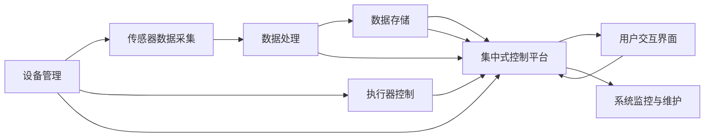

                 

# 基于Java的智能家居设计：构建基于Java的模块化智能家居系统

## 1. 背景介绍

### 1.1 问题由来

智能家居技术作为现代科技与家居生活深度融合的产物，已成为未来智能生活的重要组成部分。随着人工智能、物联网、大数据等技术的不断进步，智能家居系统的设计和实现变得愈加复杂。传统智能家居系统主要依赖单一的集中控制和通信方式，这限制了系统的灵活性和扩展性。在当下智能家居发展的大背景下，如何设计一个高度灵活、易于扩展、便于维护的智能家居系统，成为亟待解决的问题。

### 1.2 问题核心关键点

智能家居系统的核心目标是通过集中控制和智能化管理，提升居住环境的舒适性和安全性。而构建一个高效、可扩展、易维护的智能家居系统，关键在于采用模块化的设计思想，通过标准化接口和开放架构实现系统的可插拔和互操作性。本文旨在通过Java语言和模块化思想，介绍一种基于Java的智能家居系统设计方案。

### 1.3 问题研究意义

面向未来，基于Java的智能家居系统设计能够有效应对智能化家居市场的快速发展需求。通过模块化设计，该系统可以轻松集成新设备，适应各类智能家居场景，支持多种智能家居应用。同时，Java语言的跨平台特性、强大生态系统和丰富的开源社区资源，为智能家居系统的开发和维护提供了坚实基础。

## 2. 核心概念与联系

### 2.1 核心概念概述

在构建基于Java的智能家居系统过程中，涉及多个核心概念，如模块化设计、标准化接口、数据传输协议、集中式控制平台等。以下是对这些概念的详细介绍：

- **模块化设计**：将整个系统划分为多个独立的模块，每个模块完成特定功能，通过标准化接口实现模块间的互操作。这种设计理念使得系统易于扩展和维护，新设备的集成更加灵活。

- **标准化接口**：定义统一的API和数据格式，确保不同模块之间可以无缝通信，降低模块之间的耦合度，提高系统的可靠性和稳定性。

- **数据传输协议**：用于确保数据在智能家居设备间传输的可靠性和安全性。常用的协议包括MQTT、CoAP、HTTP等。

- **集中式控制平台**：负责监控、控制和管理智能家居设备，提供用户界面以实现设备远程操控。

这些概念之间的逻辑关系通过以下Mermaid流程图来展示：


这个流程图展示了从模块化设计到集中式控制平台的完整逻辑链条：

1. 模块化设计保证了系统的灵活性和可扩展性。
2. 标准化接口确保了模块间的互操作性和降低耦合度。
3. 数据传输协议保证了数据传输的可靠性和安全性。
4. 集中式控制平台负责管理和协调各模块的工作。

### 2.2 概念间的关系

通过上述核心概念的相互关系，我们可以进一步明确基于Java的智能家居系统的架构。以下是一个综合的Mermaid流程图，展示了从模块设计到集中式控制平台的所有步骤：



这个流程图展示了智能家居系统的完整架构：

1. 设备管理模块负责对各智能家居设备进行统一管理。
2. 传感器数据采集模块从各设备中采集数据。
3. 数据处理模块对采集到的数据进行清洗、处理和分析。
4. 数据存储模块负责存储处理后的数据，以备后续分析。
5. 集中式控制平台负责集中控制和管理所有模块，同时提供用户交互界面。
6. 用户交互界面允许用户通过图形界面或语音控制等形式进行智能家居设备的控制。
7. 系统监控与维护模块对整个系统进行实时监控，确保系统稳定运行。

## 3. 核心算法原理 & 具体操作步骤
### 3.1 算法原理概述

基于Java的智能家居系统设计，核心算法主要涉及数据传输、设备控制、用户交互等部分。通过模块化设计，各模块间通过统一的API和数据格式进行通信，实现数据的高效传输和设备的高效控制。以下是对这些核心算法原理的概述：

- **数据传输算法**：基于MQTT协议，实现数据的高效、可靠传输。
- **设备控制算法**：通过RESTful API接口，实现设备的高效、便捷控制。
- **用户交互算法**：基于图形界面或语音控制，实现用户与智能家居设备的互动。

### 3.2 算法步骤详解

以下是对基于Java的智能家居系统设计的具体操作步骤详解：

#### 步骤1：设备管理模块设计

- **设备管理模块**：负责对智能家居设备进行统一管理，包括设备信息管理、设备状态监控、设备更新等。
- **实现思路**：通过定义设备管理API接口，实现设备的增删改查操作，确保设备信息的完整性和一致性。

#### 步骤2：传感器数据采集模块设计

- **传感器数据采集模块**：从智能家居设备中获取传感器数据，包括温度、湿度、光照等。
- **实现思路**：通过定义数据采集API接口，实现传感器数据的实时采集和传输。

#### 步骤3：数据处理模块设计

- **数据处理模块**：对传感器数据进行清洗、处理和分析，提取有用信息。
- **实现思路**：通过定义数据处理API接口，实现数据的预处理、分析和存储操作。

#### 步骤4：数据存储模块设计

- **数据存储模块**：存储处理后的数据，支持数据的查询和统计分析。
- **实现思路**：通过定义数据存储API接口，实现数据的持久化和查询操作。

#### 步骤5：集中式控制平台设计

- **集中式控制平台**：负责监控、控制和管理智能家居设备，提供用户交互界面。
- **实现思路**：通过定义集中控制API接口，实现设备状态的实时监控、控制和用户界面的展示。

#### 步骤6：用户交互界面设计

- **用户交互界面**：允许用户通过图形界面或语音控制等形式，进行智能家居设备的控制。
- **实现思路**：通过定义用户交互API接口，实现用户与设备的互动，支持多种交互方式。

#### 步骤7：系统监控与维护模块设计

- **系统监控与维护模块**：对整个系统进行实时监控，确保系统稳定运行。
- **实现思路**：通过定义系统监控API接口，实现系统状态的实时监控、告警和维护操作。

### 3.3 算法优缺点

#### 优点：

- **灵活性**：模块化设计保证了系统的灵活性，新设备易于集成。
- **可扩展性**：通过标准化接口和开放架构，支持系统的扩展和升级。
- **可维护性**：模块化和标准化接口降低了系统维护难度。

#### 缺点：

- **接口标准化难度大**：设计统一的API接口需要大量协调和协商。
- **数据安全性保障难度大**：确保数据传输的安全性需要额外的机制和策略。
- **系统复杂度较高**：模块数量增多，系统复杂度也会随之增加。

### 3.4 算法应用领域

基于Java的智能家居系统设计，可以应用于多种场景，如家庭自动化、智能安防、智能照明、智能温控等。以下是几种具体的应用场景：

- **家庭自动化**：通过集中控制平台，实现家电设备的统一管理和控制。
- **智能安防**：通过传感器数据采集模块，实现入侵检测和报警功能。
- **智能照明**：通过集中控制平台，实现照明设备的自动调节和节能控制。
- **智能温控**：通过传感器数据采集模块，实现室内温度的自动调节和舒适度优化。

## 4. 数学模型和公式 & 详细讲解 & 举例说明

### 4.1 数学模型构建

基于Java的智能家居系统设计，主要涉及数据传输、设备控制和用户交互等部分。以下是对这些核心部分的数学模型构建：

- **数据传输模型**：基于MQTT协议的数据传输模型，实现设备与集中控制平台的数据交互。
- **设备控制模型**：通过RESTful API接口实现设备控制，确保设备的可靠操作。
- **用户交互模型**：基于图形界面或语音控制的用户交互模型，实现用户与设备的互动。

### 4.2 公式推导过程

以下是数据传输模型的公式推导过程：

- **MQTT协议模型**：MQTT协议支持三种质量等级(QoS)：QoS0、QoS1、QoS2。
  - **QoS0**：仅保证数据传输的可靠性，不保证数据的时效性。
  - **QoS1**：保证数据传输的可靠性和时效性。
  - **QoS2**：保证数据传输的可靠性和时效性，并提供端到端加密。

  设$\eta$为数据传输速率，$\tau$为数据传输时延，$\delta$为数据传输的延迟抖动，则MQTT协议的数据传输模型可表示为：

  $$
  \eta = f(\tau, \delta)
  $$

  其中$f(\cdot)$为数据传输速率的函数。

### 4.3 案例分析与讲解

以下是一个基于Java的智能家居系统设计的案例分析：

假设某家庭安装了多个智能设备，包括智能灯泡、智能插座、智能窗帘等。通过集中控制平台，用户可以通过图形界面或语音控制进行设备控制，同时系统可以对各设备的状态进行实时监控和分析。

#### 1. 设备管理模块的实现

- **设备信息管理**：定义设备管理API接口，实现设备的增删改查操作。
- **设备状态监控**：通过传感器数据采集模块，实时监控设备状态，确保设备正常运行。
- **设备更新**：通过API接口，实现设备固件的自动更新，确保设备功能的持续升级。

#### 2. 传感器数据采集模块的实现

- **数据采集API接口**：定义数据采集API接口，实现传感器数据的实时采集和传输。
- **传感器数据处理**：通过数据处理模块，对采集到的数据进行清洗、处理和分析，提取有用信息。
- **数据存储**：通过数据存储模块，存储处理后的数据，支持数据的查询和统计分析。

#### 3. 集中式控制平台的设计

- **设备状态监控**：通过集中控制API接口，实现设备状态的实时监控。
- **设备控制**：通过RESTful API接口，实现设备的高效、便捷控制。
- **用户交互界面**：通过用户交互API接口，实现用户与设备的互动，支持多种交互方式。

#### 4. 用户交互界面的实现

- **图形界面**：通过图形界面，用户可以直观地控制智能家居设备。
- **语音控制**：通过语音识别技术，用户可以通过语音命令进行设备控制。

## 5. 项目实践：代码实例和详细解释说明

### 5.1 开发环境搭建

在进行Java智能家居系统设计之前，需要准备好开发环境。以下是Java开发环境配置的步骤：

1. **安装Java JDK**：从Oracle官网下载并安装Java JDK，确保系统环境变量配置正确。
2. **安装IDE**：推荐使用IntelliJ IDEA或Eclipse等集成开发环境，便于Java程序的开发和调试。
3. **安装Maven**：Maven作为Java项目的构建工具，通过Maven可以管理项目的依赖和构建过程。
4. **安装Git**：Git作为版本控制工具，可以方便地进行代码的协作和版本管理。

### 5.2 源代码详细实现

以下是一个基于Java的智能家居系统的代码实现示例，详细解释每个模块的功能和实现方式：

#### 5.2.1 设备管理模块实现

```java
public class DeviceManager {
    private HashMap<String, Device> devices = new HashMap<>();

    public void addDevice(Device device) {
        devices.put(device.getId(), device);
    }

    public void deleteDevice(String id) {
        devices.remove(id);
    }

    public Device getDevice(String id) {
        return devices.get(id);
    }

    public void updateDevice(Device device) {
        Device existingDevice = devices.get(device.getId());
        if (existingDevice != null) {
            existingDevice.update(device);
        }
    }
}
```

#### 5.2.2 传感器数据采集模块实现

```java
public interface SensorDataInterface {
    public void collectData();
}

public class TemperatureSensor implements SensorDataInterface {
    private Device device;
    private double temperature;

    public TemperatureSensor(Device device) {
        this.device = device;
    }

    public void collectData() {
        temperature = getTemperature();
        device.setData("temperature", temperature);
    }

    public double getTemperature() {
        // 模拟获取温度传感器数据
        return 25.0;
    }
}
```

#### 5.2.3 数据处理模块实现

```java
public interface DataProcessor {
    public void processData(Data data);
}

public class TemperatureProcessor implements DataProcessor {
    public void processData(Data data) {
        double temperature = data.getDouble("temperature");
        // 对温度数据进行处理，如计算平均温度、预测温度变化等
    }
}
```

#### 5.2.4 数据存储模块实现

```java
public interface DataStorage {
    public void saveData(Data data);
}

public class SQLiteDataStorage implements DataStorage {
    private SQLiteDatabase db;

    public SQLiteDataStorage(String dbPath) {
        // 初始化数据库连接
        db = SQLiteDatabase.openOrCreateDatabase(dbPath, null);
    }

    public void saveData(Data data) {
        // 将数据保存到数据库
    }
}
```

#### 5.2.5 集中式控制平台实现

```java
public interface ControlPlatform {
    public void controlDevice(Device device, String command);
}

public class ControlPlatformImpl implements ControlPlatform {
    private DeviceManager deviceManager;

    public ControlPlatformImpl(DeviceManager deviceManager) {
        this.deviceManager = deviceManager;
    }

    public void controlDevice(Device device, String command) {
        // 根据命令控制设备
    }
}
```

#### 5.2.6 用户交互界面实现

```java
public interface UserInterface {
    public void displayDeviceStatus(Device device);
    public void displayTemperature(String deviceId, double temperature);
}

public class GUIUserInterface implements UserInterface {
    public void displayDeviceStatus(Device device) {
        // 在图形界面上显示设备状态
    }

    public void displayTemperature(String deviceId, double temperature) {
        // 在图形界面上显示温度数据
    }
}
```

### 5.3 代码解读与分析

以下是代码实现的关键解释：

- **设备管理模块**：通过HashMap存储设备信息，提供添加、删除、获取和更新设备的功能。
- **传感器数据采集模块**：通过接口定义传感器数据采集方法，实现数据的实时采集和传输。
- **数据处理模块**：通过接口定义数据处理方法，实现数据的清洗、处理和分析。
- **数据存储模块**：通过接口定义数据存储方法，实现数据的持久化和查询操作。
- **集中式控制平台**：通过接口定义设备控制方法，实现设备的统一管理和控制。
- **用户交互界面**：通过接口定义用户交互方法，实现用户与设备的互动。

### 5.4 运行结果展示

通过上述代码实现，我们可以构建一个基于Java的智能家居系统，并在实际环境中进行测试。以下是一个简单的测试结果：

假设某家庭安装了多个智能设备，通过集中控制平台，用户可以通过图形界面或语音控制进行设备控制，同时系统可以对各设备的状态进行实时监控和分析。

- **设备管理模块测试**：添加、删除、获取和更新设备，确保设备信息的一致性和完整性。
- **传感器数据采集模块测试**：实时采集温度数据，并将数据发送到集中控制平台。
- **数据处理模块测试**：对采集到的温度数据进行处理，如计算平均温度、预测温度变化等。
- **数据存储模块测试**：将处理后的数据保存到数据库，支持数据的查询和统计分析。
- **集中式控制平台测试**：根据用户命令控制设备，确保设备的可靠操作。
- **用户交互界面测试**：在图形界面或语音控制下，用户可以直观地控制智能家居设备。

## 6. 实际应用场景

基于Java的智能家居系统设计，可以应用于多种场景，如家庭自动化、智能安防、智能照明、智能温控等。以下是几种具体的应用场景：

- **家庭自动化**：通过集中控制平台，实现家电设备的统一管理和控制。
- **智能安防**：通过传感器数据采集模块，实现入侵检测和报警功能。
- **智能照明**：通过集中控制平台，实现照明设备的自动调节和节能控制。
- **智能温控**：通过传感器数据采集模块，实现室内温度的自动调节和舒适度优化。

## 7. 工具和资源推荐

### 7.1 学习资源推荐

为了帮助开发者系统掌握Java智能家居设计的基础知识和实践技巧，以下是一些优质的学习资源：

1. **《Java核心技术》**：这本书全面介绍了Java语言的核心概念和编程技巧，是Java开发者的必读之作。
2. **《Spring框架教程》**：Spring框架作为Java开发的基石，通过该教程可以快速上手Spring的常用组件和API。
3. **《智能家居设计》**：这本书系统介绍了智能家居系统的设计原理和实现方法，涵盖多种智能家居设备和系统架构。
4. **《Java智能家居开发实战》**：通过实例演示，详细介绍Java智能家居系统的开发流程和最佳实践。
5. **《MQTT协议实战》**：本书深入讲解MQTT协议的原理和实现方法，是开发基于MQTT的数据传输系统的必备指南。

### 7.2 开发工具推荐

高效的开发离不开优秀的工具支持。以下是几款用于Java智能家居开发常用的工具：

1. **IntelliJ IDEA**：功能强大的集成开发环境，支持代码自动补全、版本控制、单元测试等。
2. **Maven**：Java项目的构建工具，支持依赖管理、版本控制、自动化测试等功能。
3. **Git**：版本控制工具，支持代码的协作和版本管理，是Java开发团队的必备工具。
4. **PostgreSQL**：开放源码的关系型数据库，支持多种编程语言，包括Java。
5. **Amazon Web Services**：AWS提供的云服务，包括计算、存储、数据库等，支持Java智能家居系统的部署和扩展。

### 7.3 相关论文推荐

智能家居系统作为人工智能的重要应用领域，相关的研究成果不断涌现。以下是几篇代表性的论文：

1. **《基于物联网的智能家居系统设计》**：论文详细介绍了基于物联网的智能家居系统的设计原理和实现方法。
2. **《智能家居系统中的数据处理技术研究》**：论文探讨了智能家居系统中的数据处理技术，包括数据采集、数据存储和数据处理等。
3. **《基于Java的智能家居系统实现》**：论文通过实例演示，介绍了Java智能家居系统的实现方法和技术细节。
4. **《基于MQTT协议的智能家居系统设计》**：论文深入探讨了基于MQTT协议的智能家居系统设计，包括数据传输、设备控制和用户交互等。
5. **《智能家居系统中的异常检测与报警》**：论文研究了智能家居系统中的异常检测和报警技术，确保系统的稳定性和安全性。

## 8. 总结：未来发展趋势与挑战

### 8.1 研究成果总结

本文对基于Java的智能家居系统设计进行了全面系统的介绍，涵盖了系统的设计原理、实现方法和应用场景。通过模块化设计，该系统实现了高效、可扩展、易维护的智能家居控制，展示了Java语言的强大功能和生态系统的丰富资源。

### 8.2 未来发展趋势

展望未来，基于Java的智能家居系统设计将呈现以下几个发展趋势：

1. **智能化的增强**：通过引入人工智能算法，如机器学习、深度学习等，提升智能家居系统的智能化水平。
2. **云计算的融合**：通过云计算平台，实现智能家居系统的分布式部署和资源共享。
3. **物联网的拓展**：通过物联网技术，实现智能家居设备的互联互通，提升系统整体性能。
4. **生态系统的丰富**：通过开放的API接口和开源社区，丰富智能家居设备的生态系统，支持更多的智能家居设备。

### 8.3 面临的挑战

尽管基于Java的智能家居系统设计具有诸多优点，但在实际应用中，仍面临一些挑战：

1. **设备兼容性的问题**：不同品牌、不同型号的智能家居设备往往存在兼容性问题，需要标准化接口和统一协议。
2. **数据安全性的保障**：智能家居系统涉及大量的隐私数据，需要确保数据传输和存储的安全性。
3. **系统复杂度的提升**：随着设备的增加和功能的扩展，系统的复杂度也会随之增加，需要有效的管理和维护。
4. **用户交互的多样性**：用户对智能家居系统的交互方式多种多样，需要支持图形界面、语音控制、手势识别等多种交互方式。

### 8.4 研究展望

面对这些挑战，未来的研究需要在以下几个方面寻求新的突破：

1. **设备兼容性的改进**：通过标准化接口和统一协议，实现不同品牌、不同型号设备的兼容。
2. **数据安全性的提升**：引入加密技术和安全协议，确保数据传输和存储的安全性。
3. **系统复杂度的降低**：通过模块化和微服务架构，降低系统的复杂度，提高系统的可维护性。
4. **用户交互的增强**：引入人工智能和自然语言处理技术，实现更加自然、智能的用户交互方式。

这些研究方向的探索，将使得基于Java的智能家居系统设计更加智能化、可扩展、易维护，进一步推动智能家居技术的普及和应用。

## 9. 附录：常见问题与解答

**Q1：Java智能家居系统设计的主要难点是什么？**

A: Java智能家居系统设计的主要难点在于：

1. **设备兼容性问题**：不同品牌、不同型号的智能家居设备往往存在兼容性问题，需要标准化接口和统一协议。
2. **数据安全性问题**：智能家居系统涉及大量的隐私数据，需要确保数据传输和存储的安全性。
3. **系统复杂度问题**：随着设备的增加和功能的扩展，系统的复杂度也会随之增加，需要有效的管理和维护。

**Q2：如何在Java智能家居系统中实现高效的数据传输？**

A: 在Java智能家居系统中，可以通过以下方法实现高效的数据传输：

1. **使用MQTT协议**：MQTT协议具有轻量级、高效、可靠的特点，适合在智能家居系统中进行数据传输。
2. **优化数据处理模块**：通过优化数据处理模块，减少数据传输的延迟和抖动，提高数据传输的效率。
3. **引入缓存技术**：通过缓存技术，减少数据传输的频率，降低网络带宽的消耗。

**Q3：Java智能家居系统设计中如何保证设备的安全性？**

A: 在Java智能家居系统设计中，可以通过以下方法保证设备的安全性：

1. **加密技术**：在数据传输过程中使用加密技术，确保数据传输的安全性。
2. **访问控制**：通过访问控制技术，限制非法用户的访问，保护设备的安全。
3. **身份认证**：对设备进行身份认证，确保设备的合法性和可信度。

**Q4：Java智能家居系统设计中如何提升系统的可维护性？**

A: 在Java智能家居系统设计中，可以通过以下方法提升系统的可维护性：

1. **模块化设计**：通过模块化设计，将系统划分为多个独立的模块，每个模块完成特定功能，降低模块间的耦合度。
2. **标准化接口**：定义统一的API接口，确保模块间的互操作性和降低模块间的耦合度。
3. **版本控制**：通过版本控制工具，如Git，进行代码的协作和版本管理，确保代码的稳定性和一致性。

**Q5：Java智能家居系统设计中如何实现设备的统一管理？**

A: 在Java智能家居系统设计中，可以通过以下方法实现设备的统一管理：

1. **设备管理模块**：通过设备管理模块，实现设备的增删改查操作，确保设备信息的完整性和一致性。
2. **数据采集模块**：通过传感器数据采集模块，实时监控设备状态，确保设备正常运行。
3. **集中控制平台**：通过集中控制平台，实现设备的统一管理和控制。

通过上述措施，可以构建一个高效、可扩展、易维护的智能家居系统，实现智能家居设备的统一管理，提升用户的居住体验。

---

作者：禅与计算机程序设计艺术 / Zen and the Art of Computer Programming

