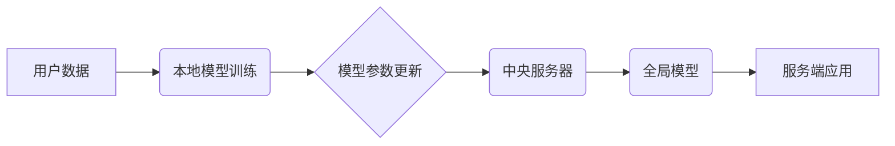

## 大规模语言模型从理论到实践 去中心化架构

> 关键词：大规模语言模型、去中心化架构、分布式训练、联邦学习、数据隐私、模型可解释性、开源社区

### 1. 背景介绍

近年来，大规模语言模型（LLM）在自然语言处理领域取得了令人瞩目的成就，例如GPT-3、LaMDA和BERT等模型展现出强大的文本生成、翻译、问答和代码生成能力。这些模型的训练通常依赖于海量文本数据和强大的计算资源，这导致了训练成本高昂、数据隐私风险和模型可解释性差等问题。

去中心化架构作为一种新兴的计算模式，为解决这些问题提供了新的思路。它通过将模型训练和数据存储分散到多个节点上，可以有效降低训练成本、提升数据隐私保护和促进模型的可解释性。

### 2. 核心概念与联系

**2.1 去中心化架构的概念**

去中心化架构是指将系统中的控制权和数据分散到多个节点上，每个节点都是独立的且具有自主决策能力。与传统的集中式架构相比，去中心化架构具有以下特点：

* **分布式存储:** 数据存储在多个节点上，而不是集中在单个服务器上。
* **协同计算:** 计算任务在多个节点上并行执行，提高计算效率。
* **容错性强:** 即使部分节点出现故障，系统仍然可以正常运行。
* **数据隐私保护:** 数据分散存储，降低了数据泄露的风险。

**2.2 去中心化架构与LLM的结合**

将去中心化架构应用于LLM训练，可以有效解决以下问题：

* **降低训练成本:** 将模型训练分散到多个节点上，可以利用闲置计算资源，降低训练成本。
* **提升数据隐私保护:** 将数据分散存储，可以避免将敏感数据集中存储在单个服务器上，降低数据泄露风险。
* **促进模型的可解释性:** 将模型训练分散到多个节点上，可以使模型训练过程更加透明，更容易理解模型的决策机制。

**2.3 去中心化架构的实现方式**

常见的去中心化架构实现方式包括：

* **分布式训练:** 将模型参数分散存储在多个节点上，并通过异步或同步的方式进行参数更新。
* **联邦学习:** 将模型训练分散到多个节点上，每个节点只训练自己的数据，并将模型参数更新上传到一个中央服务器，最终得到一个全局模型。

**Mermaid 流程图**



### 3. 核心算法原理 & 具体操作步骤

**3.1 算法原理概述**

去中心化LLM训练的核心算法原理是将模型参数分散存储在多个节点上，并通过一种协同学习机制进行参数更新。常见的算法包括分布式训练和联邦学习。

* **分布式训练:** 将模型参数分散存储在多个节点上，每个节点对部分数据进行训练，并通过异步或同步的方式进行参数更新。
* **联邦学习:** 将模型训练分散到多个节点上，每个节点只训练自己的数据，并将模型参数更新上传到一个中央服务器，最终得到一个全局模型。

**3.2 算法步骤详解**

**3.2.1 分布式训练**

1. 将模型参数分散存储在多个节点上。
2. 每个节点对部分数据进行训练，并计算梯度。
3. 通过异步或同步的方式将梯度上传到中央服务器。
4. 中央服务器汇总所有梯度，并更新全局模型参数。
5. 将更新后的模型参数下发到各个节点。
6. 重复步骤2-5，直到模型收敛。

**3.2.2 联邦学习**

1. 将模型参数初始化，并分散存储在多个节点上。
2. 每个节点对本地数据进行训练，并计算梯度。
3. 每个节点将梯度上传到中央服务器。
4. 中央服务器汇总所有梯度，并更新全局模型参数。
5. 将更新后的模型参数下发到各个节点。
6. 重复步骤2-5，直到模型收敛。

**3.3 算法优缺点**

**3.3.1 分布式训练**

* **优点:** 训练速度快，可以利用多个节点的计算资源。
* **缺点:** 需要协调多个节点的通信，容易出现数据不一致问题。

**3.3.2 联邦学习**

* **优点:** 数据隐私保护好，数据不会离开本地节点。
* **缺点:** 训练速度相对较慢，需要多个迭代才能达到相同的精度。

**3.4 算法应用领域**

* **自然语言处理:** 训练大型语言模型，例如GPT-3、LaMDA和BERT。
* **计算机视觉:** 训练图像识别、目标检测和图像分割模型。
* **推荐系统:** 训练个性化推荐模型。
* **医疗保健:** 训练疾病诊断和药物发现模型。

### 4. 数学模型和公式 & 详细讲解 & 举例说明

**4.1 数学模型构建**

假设我们有一个包含N个样本的数据集D，每个样本由输入特征x和标签y组成。我们的目标是训练一个模型f(x)来预测给定输入特征x的标签y。

在去中心化LLM训练中，我们将模型参数分散存储在多个节点上，每个节点都训练一个局部模型f_i(x)。

**4.2 公式推导过程**

* **损失函数:** 我们使用交叉熵损失函数来衡量模型预测结果与真实标签之间的差异。

$$
L(f(x), y) = - \sum_{i=1}^{N} y_i \log(f(x)_i) + (1-y_i) \log(1-f(x)_i)
$$

* **梯度下降:** 我们使用梯度下降算法来更新模型参数，目标是最小化损失函数。

$$
\theta = \theta - \alpha \nabla L(f(x), y)
$$

其中，$\theta$是模型参数，$\alpha$是学习率，$\nabla L(f(x), y)$是损失函数的梯度。

* **分布式梯度下降:** 在分布式训练中，每个节点计算局部梯度，并将其上传到中央服务器。中央服务器汇总所有梯度，并更新全局模型参数。

**4.3 案例分析与讲解**

假设我们有一个包含1000个样本的数据集，将其分散到10个节点上，每个节点训练100个样本。

在分布式训练中，每个节点计算其局部梯度，并将其上传到中央服务器。中央服务器汇总所有梯度，并更新全局模型参数。

在联邦学习中，每个节点对本地数据进行训练，并计算梯度。每个节点将梯度上传到中央服务器，中央服务器汇总所有梯度，并更新全局模型参数。

### 5. 项目实践：代码实例和详细解释说明

**5.1 开发环境搭建**

* **操作系统:** Linux
* **编程语言:** Python
* **深度学习框架:** TensorFlow或PyTorch
* **分布式计算框架:** Apache Spark或Ray

**5.2 源代码详细实现**

```python
# 使用 TensorFlow 分布式训练示例

import tensorflow as tf

# 定义模型
model = tf.keras.models.Sequential([
    tf.keras.layers.Embedding(input_dim=10000, output_dim=128),
    tf.keras.layers.LSTM(128),
    tf.keras.layers.Dense(1, activation='sigmoid')
])

# 定义损失函数和优化器
loss_fn = tf.keras.losses.BinaryCrossentropy()
optimizer = tf.keras.optimizers.Adam(learning_rate=0.001)

# 分布式训练
strategy = tf.distribute.MirroredStrategy()
with strategy.scope():
    model.compile(optimizer=optimizer, loss=loss_fn)
    model.fit(x_train, y_train, epochs=10)
```

**5.3 代码解读与分析**

* **模型定义:** 我们定义了一个简单的LSTM模型，用于文本分类任务。
* **损失函数和优化器:** 我们使用交叉熵损失函数和Adam优化器。
* **分布式训练:** 我们使用`tf.distribute.MirroredStrategy()`创建分布式训练策略，并将模型训练分散到多个GPU上。

**5.4 运行结果展示**

运行上述代码后，模型将在多个GPU上并行训练，并输出训练过程中的损失值和准确率。

### 6. 实际应用场景

**6.1 自然语言处理**

* **文本生成:** 使用去中心化LLM训练生成高质量的文本，例如小说、诗歌和新闻报道。
* **机器翻译:** 使用去中心化LLM训练进行更准确和流畅的机器翻译。
* **问答系统:** 使用去中心化LLM训练构建更智能和更准确的问答系统。

**6.2 计算机视觉**

* **图像识别:** 使用去中心化LLM训练识别图像中的物体、场景和人物。
* **目标检测:** 使用去中心化LLM训练检测图像中的特定目标，例如车辆、行人和其他物体。
* **图像分割:** 使用去中心化LLM训练将图像分割成不同的区域，例如前景和背景。

**6.3 其他领域**

* **推荐系统:** 使用去中心化LLM训练个性化推荐系统，例如电影、音乐和商品推荐。
* **医疗保健:** 使用去中心化LLM训练疾病诊断和药物发现模型。
* **金融科技:** 使用去中心化LLM训练欺诈检测和风险评估模型。

**6.4 未来应用展望**

随着去中心化技术的不断发展，LLM的应用场景将会更加广泛。未来，我们可能会看到：

* **更强大的LLM:** 去中心化架构可以帮助训练更强大、更复杂的LLM。
* **更个性化的LLM:** 去中心化架构可以帮助训练更个性化的LLM，满足不同用户的需求。
* **更安全的LLM:** 去中心化架构可以帮助保护LLM的训练数据和模型参数，提高安全性。

### 7. 工具和资源推荐

**7.1 学习资源推荐**

* **书籍:**
    * Deep Learning by Ian Goodfellow, Yoshua Bengio, and Aaron Courville
    * Hands-On Machine Learning with Scikit-Learn, Keras & TensorFlow by Aurélien Géron
* **在线课程:**
    * TensorFlow Developer Certificate
    * PyTorch Deep Learning Specialization
* **博客和论坛:**
    * TensorFlow Blog
    * PyTorch Forum

**7.2 开发工具推荐**

* **深度学习框架:** TensorFlow, PyTorch
* **分布式计算框架:** Apache Spark, Ray
* **云平台:** Google Cloud Platform, Amazon Web Services, Microsoft Azure

**7.3 相关论文推荐**

* **分布式训练:**
    * Dean, J., Corrado, G. S., Monga, R., Chen, K., Devin, M., Le, Q. V.,... & Ng, A. Y. (2012). Large scale distributed deep networks.
* **联邦学习:**
    * McMahan, B., Moore, E., Ramage, D., Hampson, S., & y Arcas, B. (2017). Communication-efficient learning of deep networks from decentralized data.

### 8. 总结：未来发展趋势与挑战

**8.1 研究成果总结**

去中心化LLM训练是一个新兴的研究领域，取得了一些重要的成果。例如，分布式训练和联邦学习等算法已经成功应用于训练大型语言模型，并取得了不错的效果。

**8.2 未来发展趋势**

* **模型效率提升:** 研究更有效的去中心化训练算法，提高模型训练效率。
* **数据隐私保护:** 研究更强大的数据隐私保护机制，确保用户数据安全。
* **模型可解释性:** 研究更有效的模型可解释性方法，帮助用户理解模型的决策机制。

**8.3 面临的挑战**

* **