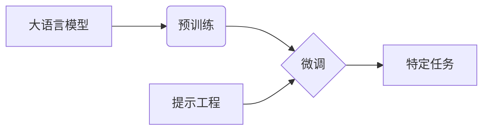

## 大语言模型原理与工程实践：提示工程的作用

> 关键词：大语言模型、提示工程、自然语言处理、Transformer、预训练、微调、应用场景

## 1. 背景介绍

近年来，大语言模型（Large Language Models，LLMs）在自然语言处理（Natural Language Processing，NLP）领域取得了令人瞩目的成就。从文本生成、翻译到问答和代码编写，LLMs展现出强大的能力，深刻地改变了我们与语言交互的方式。然而，LLMs的强大并非一蹴而就，其背后蕴含着复杂的原理和工程实践。其中，提示工程（Prompt Engineering）作为一项关键技术，在LLMs的应用中发挥着至关重要的作用。

传统的机器学习模型需要大量人工标注数据进行训练，而LLMs则通过预训练的方式学习语言的丰富结构和语义。预训练模型在海量文本数据上学习通用语言表示，为后续的特定任务微调提供了强大的基础。然而，即使是经过预训练的LLMs，也需要精心设计的提示（Prompt）来引导其完成特定的任务。

提示工程旨在通过设计有效的提示，引导LLMs生成更准确、更符合预期结果的输出。它涉及到对语言的深刻理解、对模型行为的洞察以及对任务需求的精准把握。

## 2. 核心概念与联系

### 2.1  大语言模型

大语言模型是指参数量巨大、训练数据海量的人工智能模型，能够理解和生成人类语言。它们通常基于Transformer架构，并通过自监督学习的方式进行预训练。

### 2.2  提示工程

提示工程是指设计和优化输入提示，以引导大语言模型生成更准确、更符合预期结果的输出。它是一个迭代的过程，需要不断地调整和改进提示，以达到最佳效果。

### 2.3  预训练与微调

预训练是指在大量通用文本数据上训练大语言模型，使其学习语言的通用表示。微调是指在特定任务数据上对预训练模型进行进一步训练，使其能够更好地完成特定任务。

**核心概念关系流程图:**



## 3. 核心算法原理 & 具体操作步骤

### 3.1  算法原理概述

提示工程的核心算法原理是基于Transformer模型的注意力机制。Transformer模型能够捕捉文本序列中不同词语之间的关系，并根据这些关系生成更准确的输出。提示工程通过设计特定的提示结构，引导Transformer模型关注关键信息，从而提高模型的性能。

### 3.2  算法步骤详解

1. **理解任务需求:** 首先需要明确LLM需要完成的任务是什么，例如文本生成、翻译、问答等。
2. **设计提示结构:** 根据任务需求，设计合适的提示结构，例如提供上下文信息、指定输出格式、设置语气等。
3. **选择预训练模型:** 选择合适的预训练模型，例如GPT-3、BERT、T5等。
4. **微调模型:** 在特定任务数据上对预训练模型进行微调，以提高模型在该任务上的性能。
5. **测试和评估:** 测试不同提示结构的效果，并根据评估结果进行调整和优化。

### 3.3  算法优缺点

**优点:**

* **提高模型性能:**  精心设计的提示可以显著提高LLM在特定任务上的性能。
* **降低训练成本:**  通过微调预训练模型，可以降低训练成本和时间。
* **提高模型灵活性:**  提示工程可以使LLM更加灵活，能够适应不同的任务和场景。

**缺点:**

* **提示设计复杂:**  设计有效的提示需要对语言和模型行为有深入的理解。
* **提示工程成本高:**  需要投入大量时间和精力进行提示设计和优化。
* **提示偏差问题:**  提示本身可能存在偏差，导致模型输出存在偏见。

### 3.4  算法应用领域

提示工程在NLP领域有着广泛的应用，例如:

* **文本生成:**  生成小说、诗歌、剧本等创意文本。
* **机器翻译:**  将文本从一种语言翻译成另一种语言。
* **问答系统:**  回答用户提出的问题。
* **代码生成:**  根据自然语言描述生成代码。
* **对话系统:**  构建更自然、更流畅的对话系统。

## 4. 数学模型和公式 & 详细讲解 & 举例说明

### 4.1  数学模型构建

LLMs通常基于Transformer架构，其核心是注意力机制。注意力机制允许模型关注输入序列中不同部分的词语，并根据这些词语之间的关系生成输出。

**注意力机制公式:**

$$
Attention(Q, K, V) = softmax(\frac{QK^T}{\sqrt{d_k}})V
$$

其中:

* $Q$：查询矩阵
* $K$：键矩阵
* $V$：值矩阵
* $d_k$：键向量的维度
* $softmax$：softmax函数

### 4.2  公式推导过程

注意力机制的公式通过计算查询向量与键向量的点积，并使用softmax函数进行归一化，得到每个键向量对应的权重。然后，将这些权重与值向量相乘，得到最终的注意力输出。

### 4.3  案例分析与讲解

例如，在机器翻译任务中，查询向量可以是目标语言的词向量，键向量可以是源语言的词向量，值向量可以是源语言词语的嵌入向量。通过注意力机制，模型可以关注源语言中与目标语言词语相关的词语，从而生成更准确的翻译结果。

## 5. 项目实践：代码实例和详细解释说明

### 5.1  开发环境搭建

* Python 3.7+
* PyTorch 或 TensorFlow
* Transformers 库

### 5.2  源代码详细实现

```python
from transformers import pipeline

# 使用预训练模型进行文本生成
generator = pipeline("text-generation", model="gpt2")

# 定义提示
prompt = "写一首关于春天的诗:"

# 生成文本
output = generator(prompt, max_length=100, num_return_sequences=3)

# 打印结果
for text in output:
    print(text["generated_text"])
```

### 5.3  代码解读与分析

* 使用 `transformers` 库加载预训练模型 `gpt2`。
* 定义提示 `prompt`，引导模型生成关于春天的诗。
* 使用 `generator` 函数生成文本，设置最大长度 `max_length` 和生成序列数量 `num_return_sequences`。
* 打印生成的文本。

### 5.4  运行结果展示

```
春风拂面暖意融融
花儿绽放色彩鲜艳
小鸟歌唱声声欢快
万物复苏生机勃勃

春雨绵绵滋润大地
绿草如茵遍野生机
柳枝摇曳轻盈飘逸
桃花盛开满园春色

春光烂漫景色宜人
鸟语花香沁人心脾
春风送暖万物复苏
美好春天充满希望
```

## 6. 实际应用场景

### 6.1  文本生成

* **小说、诗歌、剧本创作:**  LLMs可以根据提示生成创意文本，帮助作家克服创作瓶颈。
* **广告文案、营销内容创作:**  LLMs可以根据产品特点和目标受众生成吸引人的广告文案和营销内容。
* **新闻报道、技术文档撰写:**  LLMs可以根据事件信息和技术规范生成新闻报道和技术文档。

### 6.2  机器翻译

* **跨语言沟通:**  LLMs可以帮助人们跨越语言障碍进行沟通，促进国际交流。
* **海外市场拓展:**  LLMs可以帮助企业将产品和服务推广到海外市场。
* **学术研究:**  LLMs可以帮助研究人员阅读和理解不同语言的学术文献。

### 6.3  问答系统

* **客户服务:**  LLMs可以作为客户服务机器人，回答客户常见问题，提高服务效率。
* **教育辅助:**  LLMs可以作为学习助手，回答学生提出的问题，帮助学生理解知识。
* **搜索引擎:**  LLMs可以帮助搜索引擎理解用户查询意图，提供更精准的搜索结果。

### 6.4  未来应用展望

随着LLMs技术的不断发展，其应用场景将更加广泛，例如:

* **个性化教育:**  根据学生的学习进度和特点，提供个性化的学习内容和辅导。
* **智能写作助手:**  帮助人们更高效地写作，例如语法检查、风格调整、内容生成等。
* **虚拟助手:**  更加智能、更加人性化的虚拟助手，能够理解和执行用户的复杂指令。

## 7. 工具和资源推荐

### 7.1  学习资源推荐

* **Hugging Face:**  https://huggingface.co/
* **OpenAI:**  https://openai.com/
* **Stanford NLP Group:**  https://nlp.stanford.edu/

### 7.2  开发工具推荐

* **PyTorch:**  https://pytorch.org/
* **TensorFlow:**  https://www.tensorflow.org/
* **Transformers 库:**  https://huggingface.co/docs/transformers/index

### 7.3  相关论文推荐

* **Attention Is All You Need:**  https://arxiv.org/abs/1706.03762
* **BERT: Pre-training of Deep Bidirectional Transformers for Language Understanding:**  https://arxiv.org/abs/1810.04805
* **T5: Text-to-Text Transfer Transformer:**  https://arxiv.org/abs/1910.10683

## 8. 总结：未来发展趋势与挑战

### 8.1  研究成果总结

近年来，LLMs取得了令人瞩目的成就，在文本生成、机器翻译、问答系统等领域展现出强大的能力。提示工程作为一项关键技术，在LLMs的应用中发挥着至关重要的作用。

### 8.2  未来发展趋势

* **模型规模和能力的提升:**  未来LLMs的规模和能力将继续提升，能够处理更复杂的任务，生成更高质量的文本。
* **多模态LLMs的开发:**  LLMs将融合视觉、音频等多模态信息，能够理解和生成更丰富的内容。
* **可解释性和安全性研究:**  LLMs的决策过程需要更加透明可解释，并确保其安全性、可靠性和公平性。

### 8.3  面临的挑战

* **数据获取和标注成本:**  训练大型LLMs需要海量数据，数据获取和标注成本仍然是一个挑战。
* **模型训练和部署成本:**  训练大型LLMs需要强大的计算资源，部署成本也相对较高。
* **伦理和社会影响:**  LLMs的应用可能带来伦理和社会问题，例如信息操纵、隐私泄露等，需要引起重视和研究。

### 8.4  研究展望

未来，LLMs的研究将更加注重模型的可解释性、安全性、鲁棒性和泛化能力。同时，LLMs的应用将更加广泛，渗透到各个领域，改变我们的生活方式。

## 9. 附录：常见问题与解答

**Q1: 如何设计有效的提示？**

A1: 设计有效的提示需要对任务需求、模型行为和语言理解有深入的了解。可以参考以下几点:

* 明确任务目标
* 提供上下文信息
* 指定输出格式
* 设置语气和风格
* 使用示例数据

**Q2: LLMs的输出是否总是准确可靠？**

A2: LLMs的输出并非总是准确可靠，它们可能会受到训练数据、提示设计和模型本身的限制。需要对LLMs的输出进行评估和验证，并根据实际情况进行调整和修正。

**Q3: LLMs的应用有哪些伦理和社会问题？**

A3: LLMs的应用可能带来以下伦理和社会问题:

* 信息操纵和虚假信息生成
* 隐私泄露和数据安全
* 算法偏见和歧视
* 工作岗位替代