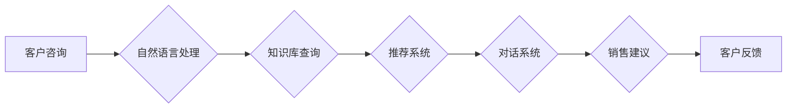

## 实战五：基于知识库的销售顾问 Sales-Consultant

> 关键词：知识库、销售顾问、自然语言处理、机器学习、对话系统、推荐系统、客户关系管理

### 1. 背景介绍

在当今数据爆炸的时代，企业积累了海量的客户数据，但如何有效地利用这些数据来提升销售效率是一个关键问题。传统的销售模式依赖于人工客服，效率低下，成本高昂。而基于知识库的销售顾问，则利用人工智能技术，将知识库中的产品信息、客户数据、市场趋势等整合在一起，为客户提供个性化、智能化的销售服务。

基于知识库的销售顾问，可以帮助企业实现以下目标：

* **提升销售效率:** 自动化处理客户咨询，解放人工客服，提高销售人员的工作效率。
* **提供个性化服务:** 根据客户的具体需求和历史购买记录，推荐合适的商品和服务。
* **提升客户满意度:** 提供快速、准确、便捷的售前售后服务，提升客户体验。
* **挖掘潜在客户:** 通过分析客户数据，识别潜在客户，并提供精准的营销方案。

### 2. 核心概念与联系

#### 2.1 知识库

知识库是基于知识表示和推理的数据库，它存储着关于特定领域的知识，并通过规则和逻辑关系连接这些知识。在销售顾问系统中，知识库可以存储产品信息、客户信息、市场趋势、竞争对手信息等。

#### 2.2 自然语言处理 (NLP)

自然语言处理是人工智能领域的一个重要分支，它致力于使计算机能够理解和处理人类语言。在销售顾问系统中，NLP技术可以用于理解客户的自然语言咨询，并将其转换为计算机可以理解的格式。

#### 2.3 机器学习 (ML)

机器学习是人工智能领域的一个重要分支，它致力于使计算机能够从数据中学习，并根据学习到的知识进行预测和决策。在销售顾问系统中，机器学习技术可以用于分析客户数据，预测客户需求，并推荐合适的商品和服务。

#### 2.4 对话系统

对话系统是能够与人类进行自然语言交互的计算机系统。在销售顾问系统中，对话系统可以与客户进行实时对话，回答客户的咨询，并提供个性化的销售服务。

#### 2.5 推荐系统

推荐系统是根据用户的历史行为和偏好，推荐用户可能感兴趣的商品或服务。在销售顾问系统中，推荐系统可以根据客户的购买记录、浏览历史、兴趣爱好等信息，推荐合适的商品和服务。

**核心架构流程图**



### 3. 核心算法原理 & 具体操作步骤

#### 3.1 算法原理概述

基于知识库的销售顾问系统通常采用以下核心算法：

* **自然语言理解 (NLU):** 用于理解客户的自然语言咨询，并将其转换为机器可理解的格式。常用的NLU算法包括词性标注、依存句法分析、命名实体识别等。
* **知识图谱推理:** 用于根据知识库中的知识和规则，推断出客户的需求和意图。常用的知识图谱推理算法包括规则引擎、逻辑推理、深度学习等。
* **推荐算法:** 用于根据客户的特征和历史行为，推荐合适的商品和服务。常用的推荐算法包括协同过滤、内容过滤、基于知识的推荐等。

#### 3.2 算法步骤详解

1. **客户咨询:** 客户通过自然语言向销售顾问系统提出咨询。
2. **自然语言理解:** NLU算法对客户的咨询进行分析，识别出关键信息，例如产品名称、属性、需求等。
3. **知识库查询:** 根据NLU分析结果，查询知识库，获取相关产品信息、客户信息、市场趋势等。
4. **知识图谱推理:** 利用知识图谱推理算法，根据知识库中的知识和规则，推断出客户的需求和意图。
5. **推荐系统:** 推荐算法根据客户的需求和意图，推荐合适的商品和服务。
6. **对话系统:** 对话系统将推荐结果以自然语言的形式呈现给客户，并与客户进行交互，解答客户的疑问，提供个性化的销售建议。
7. **客户反馈:** 客户对销售建议进行反馈，系统根据反馈信息进行优化和改进。

#### 3.3 算法优缺点

**优点:**

* **个性化服务:** 根据客户的具体需求和历史购买记录，提供个性化的销售建议。
* **提升效率:** 自动化处理客户咨询，解放人工客服，提高销售效率。
* **24/7服务:** 不受时间和地域限制，随时随地为客户提供服务。

**缺点:**

* **知识库建设成本高:** 建立一个完善的知识库需要投入大量的人力和时间成本。
* **算法准确性:** 算法的准确性取决于知识库的质量和算法的复杂度，存在一定的误差率。
* **缺乏情感理解:** 现有的算法难以完全理解客户的情感，可能无法提供最佳的客户服务体验。

#### 3.4 算法应用领域

基于知识库的销售顾问系统可以应用于各个行业，例如：

* **电商:** 为客户提供个性化的商品推荐，提高转化率。
* **金融:** 为客户提供理财建议，提升客户体验。
* **医疗:** 为患者提供医疗咨询，提高医疗效率。
* **教育:** 为学生提供个性化的学习建议，提升学习效果。

### 4. 数学模型和公式 & 详细讲解 & 举例说明

#### 4.1 数学模型构建

在推荐系统中，常用的数学模型包括协同过滤和内容过滤。

* **协同过滤:** 基于用户的历史行为和商品的相似度进行推荐。
* **内容过滤:** 基于商品的特征和用户的偏好进行推荐。

#### 4.2 公式推导过程

**协同过滤:**

假设用户 $u$ 对商品 $i$ 的评分为 $r_{ui}$，则可以使用以下公式计算用户 $u$ 对商品 $j$ 的评分预测值 $\hat{r}_{uj}$:

$$\hat{r}_{uj} = \bar{r}_u + \frac{\sum_{i \in N(u) \cap N(j)} (r_{ui} - \bar{r}_u) \cdot s_{ij}}{\sum_{i \in N(u) \cap N(j)} s_{ij}^2}$$

其中:

* $\bar{r}_u$ 是用户 $u$ 的平均评分。
* $N(u)$ 是用户 $u$ 评分过的商品集合。
* $N(j)$ 是商品 $j$ 评分过的用户集合。
* $s_{ij}$ 是商品 $i$ 和商品 $j$ 的相似度。

**内容过滤:**

假设商品 $i$ 的特征向量为 $f_i$，用户 $u$ 的偏好向量为 $p_u$，则可以使用以下公式计算用户 $u$ 对商品 $i$ 的评分预测值 $\hat{r}_{ui}$:

$$\hat{r}_{ui} = f_i \cdot p_u$$

#### 4.3 案例分析与讲解

**协同过滤案例:**

假设有两个用户 $u_1$ 和 $u_2$，他们都评分过商品 $i_1$ 和 $i_2$。

* $u_1$ 对 $i_1$ 的评分为 5，对 $i_2$ 的评分为 3。
* $u_2$ 对 $i_1$ 的评分为 4，对 $i_2$ 的评分为 5。

如果我们想预测用户 $u_1$ 对商品 $i_3$ 的评分，我们可以使用协同过滤算法，找到与 $u_1$ 评分相似度的用户，并根据这些用户的评分对 $i_3$ 进行预测。

**内容过滤案例:**

假设一个商品的特征向量为 $[“动作”，“喜剧”，“爱情”]，用户 $u$ 的偏好向量为 $[0.8, 0.5, 0.7]$。

则可以使用内容过滤算法计算用户 $u$ 对该商品的评分预测值。

### 5. 项目实践：代码实例和详细解释说明

#### 5.1 开发环境搭建

* Python 3.x
* TensorFlow 或 PyTorch
* NLTK 或 SpaCy
* RDKit 或其他知识图谱库

#### 5.2 源代码详细实现

```python
# 自然语言理解
import nltk
from nltk.tokenize import word_tokenize
from nltk.tag import pos_tag

def understand_query(query):
  tokens = word_tokenize(query)
  pos_tags = pos_tag(tokens)
  #... (其他NLU算法)

# 知识库查询
def query_knowledge_base(query_intent):
  #... (查询知识库并返回相关信息)

# 推荐系统
def recommend_products(user_profile, product_data):
  #... (使用协同过滤或内容过滤算法推荐产品)

# 对话系统
def generate_response(query, recommended_products):
  #... (生成自然语言回复)
```

#### 5.3 代码解读与分析

* **自然语言理解模块:** 使用 NLTK 库对客户的咨询进行分词、词性标注等处理，识别出关键信息。
* **知识库查询模块:** 根据NLU分析结果，查询知识库，获取相关产品信息、客户信息、市场趋势等。
* **推荐系统模块:** 使用协同过滤或内容过滤算法，根据用户的特征和历史行为，推荐合适的商品和服务。
* **对话系统模块:** 使用自然语言生成技术，将推荐结果以自然语言的形式呈现给客户，并与客户进行交互。

#### 5.4 运行结果展示

当客户向销售顾问系统提出咨询时，系统会首先进行自然语言理解，识别出客户的需求。然后，系统会查询知识库，获取相关信息。最后，系统会使用推荐算法推荐合适的商品和服务，并通过对话系统与客户进行交互。

### 6. 实际应用场景

#### 6.1 电商平台

基于知识库的销售顾问可以帮助电商平台提供个性化的商品推荐，提高转化率。例如，当用户浏览商品页面时，销售顾问可以根据用户的浏览历史、购买记录、兴趣爱好等信息，推荐用户可能感兴趣的其他商品。

#### 6.2 金融服务

基于知识库的销售顾问可以帮助金融机构提供个性化的理财建议，提升客户体验。例如，当客户咨询投资理财时，销售顾问可以根据客户的风险承受能力、投资目标、资产配置等信息，推荐合适的投资产品。

#### 6.3 医疗保健

基于知识库的销售顾问可以帮助医疗机构提供个性化的医疗咨询，提高医疗效率。例如，当患者咨询疾病症状时，销售顾问可以根据患者的症状描述、病史、体检结果等信息，推荐合适的医院、医生、治疗方案。

#### 6.4 未来应用展望

随着人工智能技术的不断发展，基于知识库的销售顾问系统将会有更广泛的应用场景。例如，可以用于教育、旅游、娱乐等领域，为用户提供个性化的服务。

### 7. 工具和资源推荐

#### 7.1 学习资源推荐

* **书籍:**
    * 《深度学习》
    * 《自然语言处理》
    * 《机器学习》
* **在线课程:**
    * Coursera
    * edX
    * Udacity

#### 7.2 开发工具推荐

* **Python:** 
    * TensorFlow
    * PyTorch
    * NLTK
    * SpaCy
* **知识图谱库:**
    * RDKit
    * Neo4j

#### 7.3 相关论文推荐

* **自然语言理解:**
    * BERT: Pre-training of Deep Bidirectional Transformers for Language Understanding
* **推荐系统:**
    * Collaborative Filtering for Implicit Feedback Datasets
* **知识图谱推理:**
    * A Survey on Knowledge Graph Embedding

### 