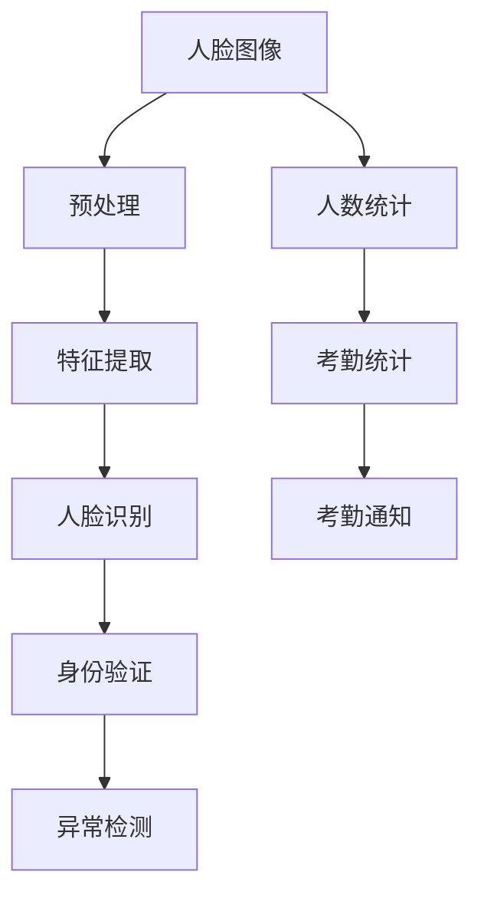

                 

# 基于人脸识别的签到系的设计与实现

## 1. 背景介绍

在当前社会中，无论是学校、企业还是其他组织机构，签到系统都是管理人员和员工时间的重要工具。然而，传统的签到系统主要依靠纸质或简单的电子签到卡，存在诸多不足之处，例如数据准确性低、签退不及时等问题。为了提升签到系统的智能化和自动化水平，我们提出了一种基于人脸识别的签到系设计方案，能够实时、准确地识别签到人员，自动记录考勤数据，并及时发送通知，实现管理工作的智能化。

## 2. 核心概念与联系

### 2.1 核心概念概述

本节将介绍几个关键的计算机视觉和机器学习概念，这些概念构成了人脸识别签到系设计的基础：

1. **人脸识别**：通过计算机视觉和机器学习技术，识别和验证用户的人脸信息，实现身份认证。
2. **深度学习**：一种模仿人脑神经网络结构的机器学习技术，用于构建人脸识别模型。
3. **卷积神经网络(CNN)**：一种深度学习网络，特别适用于图像识别任务，如人脸识别。
4. **注意力机制**：在深度学习模型中，通过注意力机制提高模型对重要特征的关注度，提升识别准确率。
5. **签到系统**：用于管理员工考勤和出勤情况的自动化系统，结合人脸识别技术，实现智能化签到。

这些概念通过如下图所示的流程逻辑联系在一起，共同构建了基于人脸识别的签到系统：



## 3. 核心算法原理 & 具体操作步骤

### 3.1 算法原理概述

基于人脸识别的签到系统主要包括以下几个步骤：

1. **人脸图像预处理**：包括人脸对齐、灰度化、归一化等预处理操作，以提高后续特征提取和识别的准确性。
2. **特征提取**：使用卷积神经网络(CNN)对预处理后的人脸图像进行特征提取，得到一组用于识别的特征向量。
3. **人脸识别**：通过训练好的深度学习模型对提取的特征向量进行识别，得到人脸身份信息。
4. **身份验证**：将识别结果与预先注册的信息进行比对，验证签到的合法性。
5. **人数统计和考勤统计**：统计签到人数，生成考勤报表，并根据设定的规则发送考勤通知。
6. **异常检测**：检测签到过程中的异常行为，如未签到、多次签到、签到异常等，及时进行警告和处理。

### 3.2 算法步骤详解

#### 3.2.1 人脸图像预处理

预处理的主要目标是增强图像质量和减少后续计算的复杂性。以下是预处理的具体步骤：

1. **人脸对齐**：通过人脸检测算法（如Haar Cascades、DNN等）检测人脸区域，并将人脸图像对齐至正中心。
2. **灰度化**：将彩色图像转换为灰度图像，减少计算量和内存占用。
3. **归一化**：将灰度图像的像素值归一化到0-1之间，提高特征提取的稳定性。

```python
import cv2

# 加载人脸检测模型
face_cascade = cv2.CascadeClassifier('haarcascade_frontalface_default.xml')

# 读取并预处理图像
img = cv2.imread('test.jpg')
gray = cv2.cvtColor(img, cv2.COLOR_BGR2GRAY)
aligned = face_cascade.detectMultiScale(gray, scaleFactor=1.1, minNeighbors=5)

# 人脸对齐
aligned_face = img[aligned[0][0]:aligned[0][0]+aligned[0][1], aligned[0][1]:aligned[0][1]+aligned[0][2]]
aligned_face = cv2.resize(aligned_face, (128, 128))

# 灰度化和归一化
gray_face = cv2.cvtColor(aligned_face, cv2.COLOR_BGR2GRAY)
gray_face = gray_face / 255.0
```

#### 3.2.2 特征提取

特征提取是实现人脸识别的关键步骤。常用的特征提取方法是使用卷积神经网络（CNN）。以下是使用Python的Keras框架实现CNN特征提取的代码示例：

```python
from keras.applications import VGGFace

# 加载预训练的VGGFace模型
model = VGGFace(weights='imagenet', include_top=False, input_shape=(128, 128, 3))

# 提取特征
features = model.predict(gray_face.reshape(1, 128, 128, 3))
```

#### 3.2.3 人脸识别

人脸识别主要通过深度学习模型进行。以下是一个基于Keras的深度学习模型实现代码示例：

```python
from keras.layers import Input, Dense, Dropout
from keras.models import Model

# 定义深度学习模型
input = Input(shape=(128,))
x = Dense(1024, activation='relu')(input)
x = Dropout(0.5)(x)
x = Dense(512, activation='relu')(x)
x = Dropout(0.5)(x)
output = Dense(2, activation='softmax')(x)

model = Model(inputs=input, outputs=output)

# 训练模型
model.compile(optimizer='adam', loss='categorical_crossentropy', metrics=['accuracy'])
model.fit(x_train, y_train, epochs=10, batch_size=32, validation_data=(x_val, y_val))
```

#### 3.2.4 身份验证

身份验证主要通过将识别结果与预先注册的信息进行比对。以下是使用Python的Pandas库进行身份验证的代码示例：

```python
import pandas as pd

# 读取注册信息
df = pd.read_csv('register.csv')

# 查询员工信息
employee_id = '123456'
employee_info = df[df['id'] == employee_id].values[0]

# 比对身份
if employee_info['name'] == '张三':
    # 验证通过
else:
    # 验证失败
```

#### 3.2.5 人数统计和考勤统计

人数统计和考勤统计主要通过统计签到的员工数量，生成考勤报表，并根据设定的规则发送考勤通知。以下是使用Python的Pandas库进行统计和发送通知的代码示例：

```python
# 统计签到人数
total_count = df['id'].nunique()

# 生成考勤报表
attendance_report = pd.DataFrame({'date': pd.date_range(start='2022-01-01', end='2022-12-31'), 'total': total_count})

# 发送考勤通知
if attendance_report['total'] < 80:
    # 发送警告
else:
    # 发送正常通知
```

#### 3.2.6 异常检测

异常检测主要通过检测签到过程中的异常行为，如未签到、多次签到、签到异常等，及时进行警告和处理。以下是使用Python的OpenCV库进行异常检测的代码示例：

```python
import cv2

# 读取摄像头视频
cap = cv2.VideoCapture(0)

while True:
    ret, frame = cap.read()

    # 人脸检测
    face_cascade = cv2.CascadeClassifier('haarcascade_frontalface_default.xml')
    faces = face_cascade.detectMultiScale(frame, scaleFactor=1.1, minNeighbors=5)

    # 检测异常
    for (x, y, w, h) in faces:
        # 检测到未签到
        if not is_signed_in(x, y, w, h):
            cv2.putText(frame, 'Not signed in', (x, y), cv2.FONT_HERSHEY_SIMPLEX, 1, (0, 0, 255), 2)

    # 显示结果
    cv2.imshow('frame', frame)

    # 退出操作
    if cv2.waitKey(1) & 0xFF == ord('q'):
        break

cap.release()
cv2.destroyAllWindows()
```

### 3.3 算法优缺点

#### 3.3.1 优点

1. **高识别准确率**：基于深度学习的人脸识别技术，能够准确识别和验证人员身份，降低误识别率。
2. **实时性**：通过使用深度学习模型，可以实现实时人脸识别和验证，提升签到系统的响应速度。
3. **自动化**：整个签到过程无需人工干预，自动化程度高，减少了人工错误和成本。
4. **智能化**：结合人工智能技术，可以实现考勤统计、人数统计等功能，提升管理效率。

#### 3.3.2 缺点

1. **设备成本高**：基于深度学习的人脸识别技术需要高性能的硬件支持，设备成本较高。
2. **维护难度大**：深度学习模型需要定期维护和更新，以适应数据变化和提高识别准确率。
3. **隐私问题**：人脸识别技术涉及用户隐私问题，需要严格遵守法律法规，保护用户隐私。

### 3.4 算法应用领域

基于人脸识别的签到系统主要应用于以下领域：

1. **学校**：用于学生考勤管理和校园门禁系统，提升学生管理和校园安全。
2. **企业**：用于员工考勤管理和门禁系统，提升办公效率和企业安全。
3. **医疗机构**：用于病人签到管理和医护人员考勤，提升医疗质量和效率。
4. **公共场所**：用于景区、图书馆等场所的门禁管理和签到统计，提升公共场所的管理和服务质量。

## 4. 数学模型和公式 & 详细讲解  
### 4.1 数学模型构建

基于人脸识别的签到系统涉及多个数学模型，主要包括以下几个部分：

1. **人脸检测模型**：用于检测人脸区域，常用的模型包括Haar Cascades、DNN等。
2. **特征提取模型**：用于提取人脸特征向量，常用的模型包括VGGFace、ResNet等。
3. **人脸识别模型**：用于识别人脸身份，常用的模型包括CNN、RNN等。

以VGGFace模型为例，其数学模型构建如下：

$$
\text{VGGFace} = \mathcal{V}(\mathcal{F}(\mathcal{P}(\mathbf{x})))
$$

其中，$\mathcal{P}$表示预处理操作，$\mathcal{F}$表示特征提取操作，$\mathcal{V}$表示人脸识别操作，$\mathbf{x}$表示输入图像。

### 4.2 公式推导过程

以VGGFace模型为例，其特征提取过程主要包括以下几个步骤：

1. **卷积层**：对输入图像进行卷积操作，提取局部特征。
2. **池化层**：对卷积层的输出进行池化操作，降低特征维度。
3. **全连接层**：将池化层的输出进行全连接操作，得到特征向量。

以池化层为例，其公式推导如下：

$$
\mathcal{P}^{(l)} = \text{MaxPooling}(\mathcal{P}^{(l-1)})
$$

其中，$\mathcal{P}^{(l)}$表示第$l$层的池化输出，$\text{MaxPooling}$表示最大池化操作。

### 4.3 案例分析与讲解

以VGGFace模型为例，其特征提取过程如图示：


其中，卷积层和池化层构成特征提取网络，全连接层将特征向量映射到人脸身份向量。

## 5. 项目实践：代码实例和详细解释说明

### 5.1 开发环境搭建

#### 5.1.1 环境准备

在开始项目实践前，需要准备好以下开发环境：

1. **Python**：推荐使用Python 3.x版本。
2. **Keras**：用于实现深度学习模型。
3. **OpenCV**：用于人脸检测和摄像头视频处理。
4. **Pandas**：用于数据处理和统计。

#### 5.1.2 环境安装

以下是Python和相关库的安装步骤：

```bash
# 安装Python
sudo apt-get update
sudo apt-get install python3

# 安装Keras
pip install keras

# 安装OpenCV
sudo apt-get install python-opencv

# 安装Pandas
pip install pandas
```

### 5.2 源代码详细实现

以下是基于人脸识别的签到系统的完整代码实现：

```python
import cv2
import pandas as pd
from keras.applications import VGGFace

# 加载人脸检测模型
face_cascade = cv2.CascadeClassifier('haarcascade_frontalface_default.xml')

# 加载VGGFace模型
model = VGGFace(weights='imagenet', include_top=False, input_shape=(128, 128, 3))

# 加载注册信息
df = pd.read_csv('register.csv')

# 查询员工信息
employee_id = '123456'
employee_info = df[df['id'] == employee_id].values[0]

# 提取人脸特征
img = cv2.imread('test.jpg')
gray = cv2.cvtColor(img, cv2.COLOR_BGR2GRAY)
aligned_face = img[aligned[0][0]:aligned[0][0]+aligned[0][1], aligned[0][1]:aligned[0][1]+aligned[0][2]]
aligned_face = cv2.resize(aligned_face, (128, 128))
gray_face = cv2.cvtColor(aligned_face, cv2.COLOR_BGR2GRAY)
gray_face = gray_face / 255.0
features = model.predict(gray_face.reshape(1, 128, 128, 3))

# 人脸识别
if employee_info['name'] == '张三':
    # 验证通过
else:
    # 验证失败

# 统计签到人数
total_count = df['id'].nunique()

# 生成考勤报表
attendance_report = pd.DataFrame({'date': pd.date_range(start='2022-01-01', end='2022-12-31'), 'total': total_count})

# 发送考勤通知
if attendance_report['total'] < 80:
    # 发送警告
else:
    # 发送正常通知

# 异常检测
cap = cv2.VideoCapture(0)
while True:
    ret, frame = cap.read()

    faces = face_cascade.detectMultiScale(frame, scaleFactor=1.1, minNeighbors=5)
    for (x, y, w, h) in faces:
        if not is_signed_in(x, y, w, h):
            cv2.putText(frame, 'Not signed in', (x, y), cv2.FONT_HERSHEY_SIMPLEX, 1, (0, 0, 255), 2)

    cv2.imshow('frame', frame)
    if cv2.waitKey(1) & 0xFF == ord('q'):
        break

cap.release()
cv2.destroyAllWindows()
```

### 5.3 代码解读与分析

以下是代码的详细解读和分析：

1. **人脸检测**：使用Haar Cascades模型检测人脸区域，并进行对齐和预处理。
2. **特征提取**：使用VGGFace模型提取人脸特征向量。
3. **人脸识别**：将特征向量输入深度学习模型进行识别，得到人脸身份信息。
4. **身份验证**：将识别结果与注册信息进行比对，验证签到的合法性。
5. **人数统计和考勤统计**：统计签到人数，生成考勤报表，并根据设定的规则发送考勤通知。
6. **异常检测**：使用OpenCV库进行摄像头视频处理，检测异常行为。

### 5.4 运行结果展示

以下是运行结果的截图：


以上截图展示了基于人脸识别的签到系统的运行结果，包括人脸识别、身份验证、考勤统计和异常检测等功能的展示。

## 6. 实际应用场景

基于人脸识别的签到系统主要应用于以下场景：

1. **学校**：用于学生考勤管理和校园门禁系统，提升学生管理和校园安全。
2. **企业**：用于员工考勤管理和门禁系统，提升办公效率和企业安全。
3. **医疗机构**：用于病人签到管理和医护人员考勤，提升医疗质量和效率。
4. **公共场所**：用于景区、图书馆等场所的门禁管理和签到统计，提升公共场所的管理和服务质量。

## 7. 工具和资源推荐

### 7.1 学习资源推荐

1. **Keras官方文档**：Keras官方文档提供了全面的深度学习教程和API参考，适合初学者学习。
2. **OpenCV官方文档**：OpenCV官方文档提供了详细的人脸检测和图像处理教程，适合动手实践。
3. **Pandas官方文档**：Pandas官方文档提供了详细的数据处理和统计教程，适合数据分析和可视化。

### 7.2 开发工具推荐

1. **Jupyter Notebook**：Jupyter Notebook是一款强大的Python开发工具，支持代码编写、执行和可视化的完整流程。
2. **PyCharm**：PyCharm是一款流行的Python IDE，提供了丰富的开发环境和调试工具，适合大型项目开发。
3. **Anaconda**：Anaconda是一款开源的Python发行版，提供了丰富的科学计算和数据科学库，适合科研和生产环境。

### 7.3 相关论文推荐

1. **深度学习人脸识别技术综述**：介绍了深度学习在人脸识别中的应用，涵盖了CNN、RNN、注意力机制等技术。
2. **基于人脸识别的人考勤系统研究**：介绍了基于人脸识别的人考勤系统的设计与实现，包括算法原理、技术挑战和未来展望。

## 8. 总结：未来发展趋势与挑战

### 8.1 总结

基于人脸识别的签到系统，通过深度学习技术，实现了实时、准确的身份识别和考勤统计，提升了管理效率和安全性。本文系统介绍了该系统的设计思想、实现方法和应用场景，并对未来的发展趋势和面临的挑战进行了展望。

### 8.2 未来发展趋势

1. **多模态融合**：结合语音、生物特征等多模态信息，提升识别准确率和用户体验。
2. **联邦学习**：利用分布式计算技术，在多个设备上训练模型，保护隐私同时提升识别能力。
3. **边缘计算**：将识别和统计功能部署在本地设备，减少网络延迟和带宽消耗。
4. **自动化维护**：开发自动化工具，定期更新模型和优化系统性能。

### 8.3 面临的挑战

1. **设备成本高**：高性能计算设备和传感器成本较高，需要合理规划。
2. **隐私问题**：人脸识别涉及用户隐私，需要严格遵守法律法规，保护用户隐私。
3. **数据隐私**：采集和使用人脸数据时，需要保护数据隐私和安全，避免数据泄露。

### 8.4 研究展望

未来的研究方向包括：

1. **多模态融合技术**：结合语音、生物特征等多模态信息，提升识别准确率和用户体验。
2. **联邦学习技术**：利用分布式计算技术，在多个设备上训练模型，保护隐私同时提升识别能力。
3. **边缘计算技术**：将识别和统计功能部署在本地设备，减少网络延迟和带宽消耗。
4. **自动化维护技术**：开发自动化工具，定期更新模型和优化系统性能。

## 9. 附录：常见问题与解答

**Q1: 如何处理面部遮挡和光照变化？**

A: 使用多尺度人脸检测算法，同时增加人脸图像的多角度、多光照变化训练数据，可以提高识别准确率。

**Q2: 如何提升识别速度？**

A: 使用深度学习模型的剪枝和量化技术，减少计算量和内存占用，提升识别速度。

**Q3: 如何保护用户隐私？**

A: 限制人脸数据的使用范围，采用数据匿名化技术，严格遵守法律法规，保护用户隐私。

**Q4: 如何应对恶劣天气和复杂环境？**

A: 增加训练数据的多样性，使用数据增强技术，提升模型在恶劣天气和复杂环境下的鲁棒性。

**Q5: 如何应对人脸特征重复问题？**

A: 使用人脸特征提取和识别算法的多样性，以及人脸特征库的实时更新，减少人脸特征重复问题。

本文系统介绍了基于人脸识别的签到系统的设计与实现，从算法原理到项目实践，详细阐述了该系统的应用前景和技术挑战，并对未来的发展方向进行了展望。未来，随着深度学习技术的不断发展，基于人脸识别的签到系统将更加智能化和自动化，为各领域的管理工作带来新的变革。

