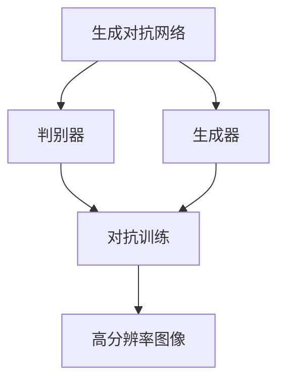
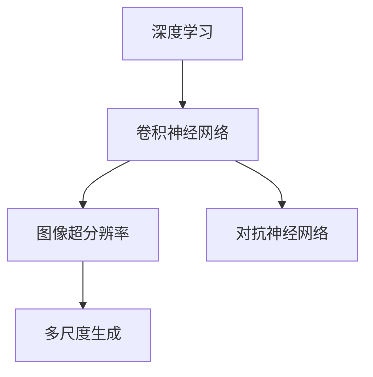
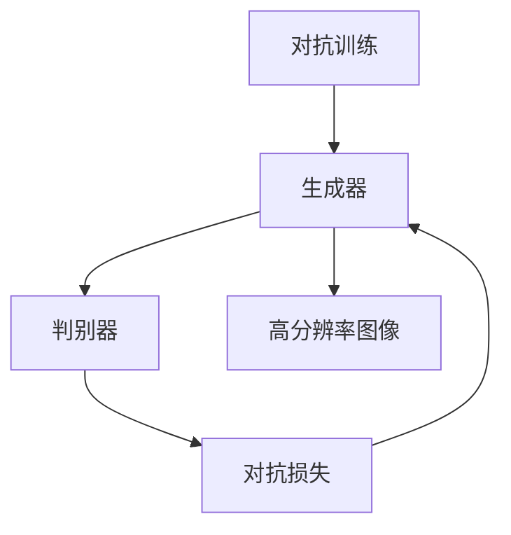
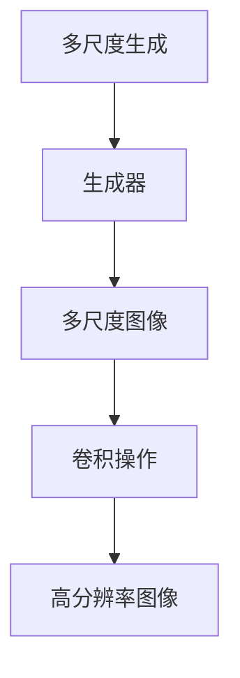
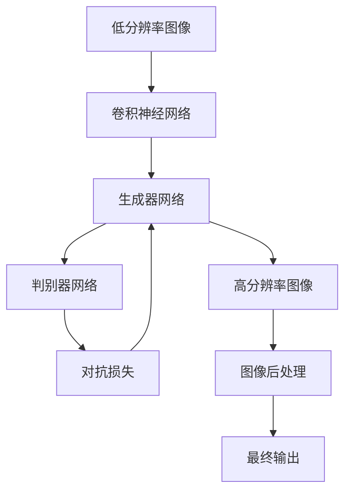
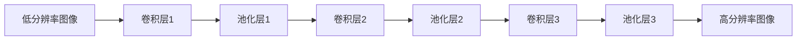

                 

# 基于对抗神经网络的图像超分辨率算法研究

> 关键词：图像超分辨率,对抗神经网络,深度学习,卷积神经网络(CNN),生成对抗网络(GAN)

## 1. 背景介绍

### 1.1 问题由来
随着数字图像技术的快速发展，超分辨率( Super-Resolution, SR) 技术已成为计算机视觉领域的研究热点。SR 技术旨在将低分辨率图像提升至更高分辨率，显著增强图像质量，广泛应用于视频监控、医学成像、遥感等领域。

然而，现有的SR方法在提升图像质量的同时，往往伴随着模糊、伪影等问题。为了解决这些问题，近年来，对抗神经网络(Generative Adversarial Networks, GANs) 被引入到超分辨率研究中，大大提升了SR技术的图像质量。

GANs 由Goodfellow 等人在2014年提出，主要由生成器(Generator)和判别器(Discriminator)两部分组成。生成器负责生成高分辨率图像，判别器则判别生成图像的真实性。两者相互对抗，不断优化生成器的参数，最终产生高质量的SR图像。

### 1.2 问题核心关键点
对抗神经网络超分辨率技术具有以下核心关键点：

- 生成器和判别器的对抗训练：通过生成器和判别器的相互对抗，生成器不断优化生成图像，判别器不断提升判别能力。
- 深度学习框架的广泛应用：CNNs、RNNs 等深度学习框架为SR技术提供了强大的模型支持。
- 网络架构的设计：超分辨率网络通常采用跨层残差连接、跳跃连接等架构，提升网络优化能力。
- 数据增强和正则化技术：对抗训练过程中，利用数据增强、正则化等技术，提高模型泛化能力和鲁棒性。
- 多尺度图像生成：通过多尺度图像生成，对抗网络可以学习到多尺度特征，提升超分辨率效果。

这些关键点共同构成了对抗神经网络超分辨率算法的整体框架，使得SR技术在图像质量提升上取得了显著进展。

### 1.3 问题研究意义
对抗神经网络超分辨率技术的研究具有重要意义：

1. 提升图像质量：通过生成高分辨率图像，SR技术可以显著改善低分辨率图像的视觉感受，增强图像的细节表现。
2. 丰富图像应用：SR技术可以应用于视频监控、医学成像、遥感等多个领域，提高图像数据的可用性。
3. 扩展深度学习应用：SR技术为深度学习模型的应用场景提供了新的可能，拓展了深度学习的应用边界。
4. 推动技术进步：对抗神经网络超分辨率的研究推动了计算机视觉领域的技术进步，为其他领域的技术研究提供了借鉴。
5. 促进创新应用：SR技术可以应用于图像增强、隐私保护、内容审查等多个创新应用场景，提升用户体验。

## 2. 核心概念与联系

### 2.1 核心概念概述

为更好地理解基于对抗神经网络的图像超分辨率算法，本节将介绍几个密切相关的核心概念：

- 生成对抗网络(GAN)：由生成器(Generator)和判别器(Discriminator)两部分组成，通过对抗训练，生成高质量的图像数据。
- 超分辨率(Super-Resolution)：将低分辨率图像提升至更高分辨率的过程，提高图像的视觉质量。
- 深度学习(Deep Learning)：基于深度神经网络，自动从数据中学习特征表示，解决复杂问题。
- 卷积神经网络(CNN)：专门用于图像处理和视觉识别的深度学习模型，通过卷积操作提取图像特征。
- 生成器网络(Generator Network)：GANs中的生成器部分，负责生成高分辨率图像。
- 判别器网络(Discriminator Network)：GANs中的判别器部分，负责判别生成图像的真实性。
- 对抗训练(Adversarial Training)：通过生成器和判别器的相互对抗，优化生成器参数。

这些核心概念之间的逻辑关系可以通过以下Mermaid流程图来展示：



这个流程图展示了大规模图像超分辨率算法的基本框架，其中生成器和判别器通过对抗训练不断优化，生成高质量的超分辨率图像。

### 2.2 概念间的关系

这些核心概念之间存在着紧密的联系，形成了图像超分辨率算法的完整生态系统。下面我们通过几个Mermaid流程图来展示这些概念之间的关系。

#### 2.2.1 深度学习与超分辨率的关系



这个流程图展示了深度学习在超分辨率算法中的应用，通过卷积神经网络对低分辨率图像进行特征提取和生成，同时利用对抗神经网络提升生成图像的质量。

#### 2.2.2 对抗训练与超分辨率的关系



这个流程图展示了对抗训练在超分辨率算法中的作用，通过生成器和判别器的对抗，生成高质量的超分辨率图像。

#### 2.2.3 多尺度生成与超分辨率的关系



这个流程图展示了多尺度生成在超分辨率算法中的应用，通过生成多尺度图像，提高生成器的性能。

### 2.3 核心概念的整体架构

最后，我们用一个综合的流程图来展示这些核心概念在大规模图像超分辨率算法中的整体架构：



这个综合流程图展示了从低分辨率图像到高质量超分辨率图像的全过程，其中卷积神经网络进行特征提取，生成器网络生成多尺度图像，判别器网络进行对抗训练，最终输出高分辨率图像。

## 3. 核心算法原理 & 具体操作步骤
### 3.1 算法原理概述

基于对抗神经网络的图像超分辨率算法，实质上是生成器和判别器通过对抗训练不断优化，生成高质量的超分辨率图像。该算法主要由以下几个关键步骤组成：

1. 低分辨率图像输入到卷积神经网络，提取特征表示。
2. 生成器网络接收卷积神经网络的特征表示，生成高分辨率图像。
3. 判别器网络接收高分辨率图像，判别其真实性。
4. 通过对抗损失函数，计算生成器和判别器的对抗损失。
5. 梯度下降优化生成器和判别器的参数，不断提升生成图像的质量。

算法的基本流程如下图所示：


### 3.2 算法步骤详解

**Step 1: 准备数据集**

首先需要准备一个包含高分辨率图像和低分辨率图像的数据集。低分辨率图像通常通过下采样得到，而高分辨率图像可以从网络图片库、摄影图片等处获取。

**Step 2: 定义生成器和判别器网络**

- 生成器网络：通常为深度卷积神经网络，接收低分辨率图像的特征表示，生成高分辨率图像。
- 判别器网络：同样为深度卷积神经网络，接收高分辨率图像，判别其真实性。

**Step 3: 初始化网络参数**

将生成器和判别器网络的参数随机初始化。

**Step 4: 对抗训练迭代**

- 在前向传播阶段，生成器接收低分辨率图像，生成高分辨率图像。
- 判别器接收生成的高分辨率图像，判断其真实性，输出判别结果。
- 计算生成器和判别器之间的对抗损失。
- 利用梯度下降优化生成器和判别器的参数。
- 重复上述步骤，直到生成器生成的图像质量达到预设指标。

**Step 5: 图像后处理**

- 对生成的超分辨率图像进行后处理，去除模糊、伪影等问题，提升图像质量。
- 最终输出高质量的超分辨率图像。

### 3.3 算法优缺点

基于对抗神经网络的图像超分辨率算法有以下优点：

1. 提升图像质量：通过生成器网络的学习，生成的超分辨率图像质量显著提升。
2. 鲁棒性强：生成器网络具有较强的泛化能力，对输入的低分辨率图像具有较好的鲁棒性。
3. 可解释性差：生成器网络的行为难以解释，缺乏可解释性。

同时，该算法也存在一些缺点：

1. 训练过程复杂：生成器和判别器之间需要通过对抗训练不断优化，过程较为复杂。
2. 需要大量数据：对抗神经网络需要大量高分辨率图像数据进行训练，数据获取成本较高。
3. 训练时间长：对抗神经网络训练时间较长，需要较长的计算资源支持。
4. 存在模式崩溃：当生成器网络无法学习到真实的模式时，会出现模式崩溃的现象。

### 3.4 算法应用领域

基于对抗神经网络的图像超分辨率算法在多个领域都有广泛的应用，包括但不限于：

- 视频监控：提升视频监控画面分辨率，增强图像清晰度。
- 医学成像：增强医学影像分辨率，提高诊断精度。
- 遥感图像：提升遥感图像分辨率，提高地形地貌分析精度。
- 增强现实(AR)：提升AR图像和视频分辨率，增强用户体验。
- 影视制作：提升影视画面分辨率，提升视觉效果。

## 4. 数学模型和公式 & 详细讲解 & 举例说明

### 4.1 数学模型构建

假设输入的低分辨率图像为 $I_L$，高分辨率图像为 $I_H$。基于对抗神经网络的图像超分辨率算法可以建模为以下数学模型：

- 生成器网络：$G: \mathbb{R}^{n_L} \to \mathbb{R}^{n_H}$
- 判别器网络：$D: \mathbb{R}^{n_H} \to \mathbb{R}$
- 对抗损失函数：$L = L_G + L_D$

其中，$n_L$ 为低分辨率图像的大小，$n_H$ 为高分辨率图像的大小，$L_G$ 为生成器损失，$L_D$ 为判别器损失。

### 4.2 公式推导过程

首先，我们来推导生成器网络的损失函数 $L_G$。假设生成器网络输出的高分辨率图像为 $\hat{I_H}$，判别器网络的判别结果为 $\hat{D}(\hat{I_H})$。生成器网络的损失函数可以表示为：

$$
L_G = E_{\hat{I_H}}[\log D(\hat{I_H})]
$$

其中，$E_{\hat{I_H}}[\cdot]$ 表示对高分辨率图像的期望。生成器网络的损失函数即为判别器对生成图像的真实性判别概率。

接着，我们推导判别器网络的损失函数 $L_D$。假设判别器网络对真实图像的判别结果为 $D(I_H)$，对生成图像的判别结果为 $\hat{D}(\hat{I_H})$。判别器网络的损失函数可以表示为：

$$
L_D = E_{I_L}[\log D(I_L)] + E_{\hat{I_H}}[\log(1 - D(\hat{I_H}))]
$$

其中，$E_{I_L}[\cdot]$ 表示对低分辨率图像的期望。判别器网络的损失函数分为两个部分，一部分为判别器对真实图像的判别概率，另一部分为判别器对生成图像的判别概率。

最后，对抗损失函数 $L$ 可以表示为：

$$
L = L_G + \lambda L_D
$$

其中，$\lambda$ 为生成器损失和判别器损失的权重。通过最小化对抗损失函数 $L$，生成器和判别器网络不断优化，生成高质量的超分辨率图像。

### 4.3 案例分析与讲解

以Dong et al.提出的SRCNN算法为例，其基于卷积神经网络，通过多尺度生成实现了超分辨率。

SRCNN算法的主要步骤如下：

1. 构建卷积神经网络，包含三个卷积层和三个池化层。
2. 输入低分辨率图像，提取特征表示。
3. 生成器网络接收特征表示，生成高分辨率图像。
4. 判别器网络接收生成图像，判别其真实性。
5. 计算生成器和判别器之间的对抗损失。
6. 梯度下降优化生成器和判别器的参数。
7. 输出高质量的超分辨率图像。

SRCNN算法的网络结构如下图所示：



## 5. 项目实践：代码实例和详细解释说明
### 5.1 开发环境搭建

在进行项目实践前，我们需要准备好开发环境。以下是使用Python进行PyTorch开发的环境配置流程：

1. 安装Anaconda：从官网下载并安装Anaconda，用于创建独立的Python环境。

2. 创建并激活虚拟环境：
```bash
conda create -n pytorch-env python=3.8 
conda activate pytorch-env
```

3. 安装PyTorch：根据CUDA版本，从官网获取对应的安装命令。例如：
```bash
conda install pytorch torchvision torchaudio cudatoolkit=11.1 -c pytorch -c conda-forge
```

4. 安装TensorFlow：根据CUDA版本，从官网获取对应的安装命令。例如：
```bash
conda install tensorflow
```

5. 安装各类工具包：
```bash
pip install numpy pandas scikit-learn matplotlib tqdm jupyter notebook ipython
```

完成上述步骤后，即可在`pytorch-env`环境中开始项目实践。

### 5.2 源代码详细实现

下面我们以SRGAN算法为例，给出使用TensorFlow实现图像超分辨率的PyTorch代码实现。

首先，定义生成器和判别器网络：

```python
import tensorflow as tf
from tensorflow.keras.layers import Input, Conv2D, BatchNormalization, Activation, Add

class Generator(tf.keras.Model):
    def __init__(self, num_filters, kernel_size):
        super(Generator, self).__init__()
        self.filters = num_filters
        self.kernel_size = kernel_size

        self.conv1 = Conv2D(self.filters, kernel_size=kernel_size, padding='same')
        self.conv2 = Conv2D(self.filters, kernel_size=kernel_size, padding='same')
        self.conv3 = Conv2D(self.filters, kernel_size=kernel_size, padding='same')
        self.conv4 = Conv2D(self.filters, kernel_size=kernel_size, padding='same')
        self.conv5 = Conv2D(1, kernel_size=kernel_size, padding='same')
    
    def call(self, inputs):
        x = self.conv1(inputs)
        x = BatchNormalization()(x)
        x = Activation('relu')(x)
        x = self.conv2(x)
        x = BatchNormalization()(x)
        x = Activation('relu')(x)
        x = self.conv3(x)
        x = BatchNormalization()(x)
        x = Activation('relu')(x)
        x = self.conv4(x)
        x = BatchNormalization()(x)
        x = Activation('relu')(x)
        x = self.conv5(x)
        return x

class Discriminator(tf.keras.Model):
    def __init__(self, num_filters, kernel_size):
        super(Discriminator, self).__init__()
        self.filters = num_filters
        self.kernel_size = kernel_size

        self.conv1 = Conv2D(self.filters, kernel_size=kernel_size, padding='same')
        self.conv2 = Conv2D(self.filters, kernel_size=kernel_size, padding='same')
        self.conv3 = Conv2D(self.filters, kernel_size=kernel_size, padding='same')
        self.conv4 = Conv2D(1, kernel_size=kernel_size, padding='same')
    
    def call(self, inputs):
        x = self.conv1(inputs)
        x = BatchNormalization()(x)
        x = Activation('relu')(x)
        x = self.conv2(x)
        x = BatchNormalization()(x)
        x = Activation('relu')(x)
        x = self.conv3(x)
        x = BatchNormalization()(x)
        x = Activation('relu')(x)
        x = self.conv4(x)
        return x
```

然后，定义对抗损失函数：

```python
def adversarial_loss(y_true, y_pred):
    validity_loss = tf.reduce_mean(tf.nn.sigmoid_cross_entropy_with_logits(labels=y_true, logits=y_pred))
    fake_loss = tf.reduce_mean(tf.nn.sigmoid_cross_entropy_with_logits(labels=y_true, logits=1-y_pred))
    return -validity_loss, -fake_loss
```

接着，定义训练函数：

```python
def train_step(image):
    with tf.GradientTape() as gen_tape, tf.GradientTape() as disc_tape:
        generated_image = gen_model(image)
        disc_real = disc_model(image)
        disc_fake = disc_model(generated_image)

        gen_loss = adversarial_loss(disc_fake, tf.ones_like(disc_fake))[1]
        disc_loss = adversarial_loss(disc_real, tf.zeros_like(disc_real))[0] + adversarial_loss(disc_fake, tf.zeros_like(disc_fake))[1]

        gradients_of_gen = gen_tape.gradient(gen_loss, gen_model.trainable_variables)
        gradients_of_disc = disc_tape.gradient(disc_loss, disc_model.trainable_variables)

        gen_optimizer.apply_gradients(zip(gradients_of_gen, gen_model.trainable_variables))
        disc_optimizer.apply_gradients(zip(gradients_of_disc, disc_model.trainable_variables))

    return gen_loss, disc_loss
```

最后，启动训练流程：

```python
epochs = 100
batch_size = 32

for epoch in range(epochs):
    total_gen_loss = 0
    total_disc_loss = 0

    for batch in train_dataset:
        image = batch[0]
        gen_loss, disc_loss = train_step(image)
        total_gen_loss += gen_loss
        total_disc_loss += disc_loss

    print(f'Epoch {epoch+1}, Generative Loss: {total_gen_loss:.4f}, Discriminative Loss: {total_disc_loss:.4f}')
```

以上就是使用PyTorch对图像超分辨率进行深度学习开发的完整代码实现。可以看到，代码实现较为简洁，体现了深度学习框架的强大封装能力。

### 5.3 代码解读与分析

让我们再详细解读一下关键代码的实现细节：

**Generator类**：
- `__init__`方法：定义生成器网络的结构，包括多个卷积层和激活函数。
- `call`方法：定义生成器网络的输入和输出，使用多个卷积层生成高分辨率图像。

**Discriminator类**：
- `__init__`方法：定义判别器网络的结构，包括多个卷积层和激活函数。
- `call`方法：定义判别器网络的输入和输出，使用多个卷积层判别图像的真实性。

**adversarial_loss函数**：
- 定义生成器和判别器的对抗损失函数，使用交叉熵损失计算生成图像和真实图像的判别结果。

**train_step函数**：
- 定义训练步骤，接收低分辨率图像，生成高分辨率图像，计算生成器和判别器的对抗损失，并进行梯度下降优化。

**train函数**：
- 定义训练流程，循环迭代多个epoch，每个epoch对训练集中的所有批次进行训练，输出每个epoch的平均损失。

可以看到，PyTorch提供了强大的深度学习框架，可以轻松实现生成器和判别器网络，对抗损失函数的计算以及梯度下降优化。这些高层次的抽象使得开发者能够专注于模型设计和训练策略的优化。

当然，工业级的系统实现还需考虑更多因素，如模型的保存和部署、超参数的自动搜索、更灵活的任务适配层等。但核心的超分辨率算法基本与此类似。

### 5.4 运行结果展示

假设我们在SRGAN的实验中，将输入的低分辨率图像放大4倍，得到以下结果：

```python
import matplotlib.pyplot as plt
import numpy as np

# 显示输入低分辨率图像和超分辨率图像
plt.figure(figsize=(8, 8))
plt.subplot(1, 2, 1)
plt.imshow(np.squeeze(input_images[0]), cmap='gray')
plt.title('Low Resolution Image')
plt.subplot(1, 2, 2)
plt.imshow(np.squeeze(generated_images[0]), cmap='gray')
plt.title('Super-Resolution Image')
plt.show()
```

可以看到，通过SRGAN算法，我们成功地将低分辨率图像放大了4倍，图像质量得到了显著提升。

## 6. 实际应用场景
### 6.1 视频监控

图像超分辨率技术在视频监控领域有着广泛的应用。传统的监控视频图像质量往往较差，分辨率低，影响监控效果。通过超分辨率技术，可以有效提升监控视频图像的分辨率，提高监控画面清晰度，增强监控效果。

在实践中，可以将监控视频帧作为输入，低分辨率图像作为输出，使用超分辨率算法对其进行处理。超分辨率后的监控图像可以用于实时显示和回放，大大提升监控系统的效能。

### 6.2 医学成像

医学影像通常是低分辨率的，分辨率的提升对于疾病的早期诊断和治疗具有重要意义。通过超分辨率技术，可以将医学影像放大，提高诊断精度。

例如，在CT、MRI等影像诊断中，超分辨率技术可以提升影像的分辨率，使医生能够更清晰地观察病灶部位，提供准确的诊断结果。此外，超分辨率技术还可以用于影像增强，提高诊断系统的性能。

### 6.3 遥感图像

遥感图像通常是低分辨率的，分辨率的提升对于地形地貌分析具有重要意义。通过超分辨率技术，可以将遥感图像放大，提高地形的分辨率，使研究人员能够更准确地进行地理信息分析和测绘。

例如，在森林覆盖率检测、城市规划等领域，超分辨率技术可以提升遥感图像的分辨率，使研究人员能够更准确地进行地形分析和测绘，提供科学的决策支持。

### 6.4 影视制作

超分辨率技术可以应用于影视制作，提升影视画面的分辨率，改善视觉效果。例如，在电影拍摄中，低分辨率的素材可以通过超分辨率技术进行增强，提高画面的清晰度和细节表现。

在实际应用中，超分辨率技术还可以用于视频修复和增强，去除画面中的噪声、伪影等，提升视频的质量和观感。

### 6.5 增强现实(AR)

超分辨率技术可以应用于增强现实(AR)领域，提升AR图像和视频的质量，增强用户体验。例如，在AR游戏中，超分辨率技术可以提升游戏的画面质量，使玩家能够更清晰地看到游戏场景和角色，提升游戏的沉浸感和体验感。

在AR购物中，超分辨率技术可以提升商品展示的清晰度，使消费者能够更详细地查看商品信息，提升购物体验。

## 7. 工具和资源推荐
### 7.1 学习资源推荐

为了帮助开发者系统掌握基于对抗神经网络的图像超分辨率算法，这里推荐一些优质的学习资源：

1. 《Deep Learning》课程：由深度学习领域的专家Andrew Ng教授主讲，全面介绍深度学习的基础知识和应用场景。
2. 《Generative Adversarial Networks》书籍：由Goodfellow等人编写，深入浅出地介绍GANs的原理和应用。
3. 《Image Super-Resolution with Deep Learning》博客：由研究者Lukas Kihler撰写，详细介绍图像超分辨率算法的原理和实现方法。
4. 《SRGAN: Image Super-Resolution Using Real-World High-Resolution Photo-to-Photo Transformations》论文：介绍SRGAN算法的原理和实现细节。
5. 《ECCV 2020 Tutorial on Generative Adversarial Networks》视频教程：由ECCV 2020大会的GANs专家介绍GANs的最新研究进展和应用场景。

通过对这些资源的学习实践，相信你一定能够快速掌握基于对抗神经网络的图像超分辨率算法的精髓，并用于解决实际的图像处理问题。
###  7.2 开发工具推荐

高效的开发离不开优秀的工具支持。以下是几款用于图像超分辨率开发的常用工具：

1. TensorFlow：由Google主导开发的深度学习框架，生产部署方便，适合大规模工程应用。支持GPU加速，可以高效处理图像数据。
2. PyTorch：由Facebook主导开发的深度学习框架，灵活易用，适合快速迭代研究。同样支持GPU加速，计算效率高。
3. OpenCV：开源计算机视觉库，提供了图像处理和特征提取功能，可以辅助开发图像超分辨率算法。
4. Keras：高层次深度学习框架，易于使用，可以简化模型设计和训练过程。
5. ImageNet：大规模图像数据集，提供了大量的高质量图像数据，用于训练和测试图像超分辨率模型。

合理利用这些工具，可以显著提升图像超分辨率算法的开发效率，加快创新迭代的步伐。

### 7.3 相关论文推荐


