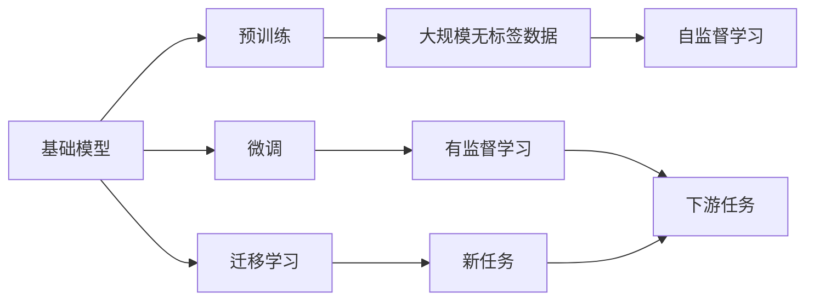
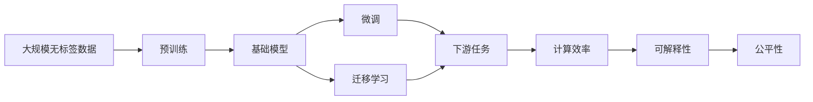

                 

# 基础模型的未来技术与社会发展

> 关键词：基础模型,技术演进,社会发展,未来预测,人工智能

## 1. 背景介绍

### 1.1 问题由来
随着人工智能(AI)技术的迅猛发展，基础模型(Foundation Models)作为一种具有广泛通用性和自适应性的技术，已广泛应用于各个行业，带来了显著的变革。从自然语言处理(NLP)、计算机视觉(CV)到自然语言生成(NLG)等领域，基础模型已成为推动AI应用突破的重要引擎。本文旨在深入探讨基础模型在未来的技术演进与社会发展的潜在影响，以及如何有效应对其面临的挑战。

### 1.2 问题核心关键点
基础模型是一种基于大规模无标签数据进行预训练的深度学习模型，具备强大的自我学习能力和泛化能力。通过微调等技术手段，基础模型可以适应特定的应用场景，完成多种复杂任务，如图像识别、语音识别、文本翻译等。基础模型的核心优势在于其能够捕捉数据中的隐含知识，并通过迁移学习将知识泛化到新的领域。然而，基础模型也面临数据偏见、模型可解释性、计算效率等问题，需要不断优化和改进。

### 1.3 问题研究意义
研究基础模型对社会发展的影响，具有重要意义：

1. **促进经济增长**：基础模型能够提高自动化水平，降低生产成本，推动各行业的数字化转型。
2. **提升生活质量**：在医疗、教育、交通等领域，基础模型能提供更高效、精准的服务，改善人类生活质量。
3. **驱动科技创新**：基础模型的发展引领AI技术的前沿，推动新的科学发现和技术突破。
4. **构建智能社会**：通过基础模型的广泛应用，推动智慧城市、智慧医疗、智慧教育等智能社会构建。
5. **应对全球挑战**：基础模型在环境保护、气候变化、公共安全等方面具有重要应用，帮助应对全球性挑战。

## 2. 核心概念与联系

### 2.1 核心概念概述

- **基础模型**：一种通过在大规模无标签数据上进行预训练的深度学习模型，具有强大的泛化能力和自我学习能力。常见的基础模型包括BERT、GPT、ViT等。

- **预训练**：在大规模无标签数据上进行自监督学习，使得模型学习到通用的语言、视觉或语音知识。

- **微调**：在预训练模型的基础上，通过有监督学习优化模型在特定任务上的性能，使其能够适应特定领域。

- **迁移学习**：将一个领域学到的知识迁移到另一个领域，提升模型在新任务上的表现。

- **计算效率**：指模型在推理、训练等过程中所需的时间和资源消耗。

- **可解释性**：指模型输出的可解释性，即对模型决策过程的理解和解释。

- **公平性**：指模型在不同群体之间的表现是否均衡，避免偏见和不公平现象。

### 2.2 概念间的关系

这些核心概念通过以下Mermaid流程图展示：



这个流程图展示了基础模型的核心概念及其之间的关系：

1. 基础模型通过预训练获得通用知识。
2. 微调和迁移学习使得模型适应特定任务或领域。
3. 计算效率和可解释性是评估模型性能的重要指标。

### 2.3 核心概念的整体架构

最终，我们用一个综合的流程图来展示这些核心概念在大模型微调过程中的整体架构：



这个综合流程图展示了从数据预训练到微调，再到任务应用的完整过程。

## 3. 核心算法原理 & 具体操作步骤
### 3.1 算法原理概述

基础模型通过在大规模无标签数据上进行预训练，学习到通用的语言、视觉或语音知识。这一过程通常采用自监督学习任务，如语言建模、图像分类等。预训练后，模型通过微调和迁移学习等技术手段，适应特定的应用场景，完成各种复杂任务。

### 3.2 算法步骤详解

基础模型的开发流程包括以下关键步骤：

**Step 1: 准备数据集**
- 收集并清洗大规模无标签数据，用于模型预训练。
- 选择合适的基础模型架构，如BERT、GPT、ViT等。

**Step 2: 数据预训练**
- 使用自监督学习任务对数据进行预训练，学习通用的语言、视觉或语音知识。
- 定期评估模型性能，优化预训练策略。

**Step 3: 模型微调**
- 在预训练模型的基础上，收集目标任务的标注数据，进行有监督学习。
- 调整模型参数，适应特定任务的需求。

**Step 4: 迁移学习**
- 将模型迁移到新的领域，适应不同的应用场景。
- 使用不同领域的数据进行微调，提升模型泛化能力。

**Step 5: 评估和优化**
- 在测试集上评估模型性能，调整超参数和训练策略。
- 进行模型压缩和优化，提升计算效率。

### 3.3 算法优缺点

基础模型具有以下优点：

1. **泛化能力强**：通过在大规模无标签数据上的预训练，模型能够捕捉数据中的隐含知识，具备较强的泛化能力。
2. **适应性强**：通过微调和迁移学习，模型能够适应多种复杂任务，具有广泛的适用性。
3. **自动化程度高**：模型训练和优化过程大部分自动进行，减少了人工干预。

同时，基础模型也存在以下缺点：

1. **数据依赖性强**：模型的性能很大程度上取决于预训练数据的分布，数据质量不佳可能影响模型性能。
2. **计算资源消耗大**：大规模预训练和微调需要大量计算资源，对硬件设施要求较高。
3. **模型复杂度高**：模型结构和参数量大，推理和训练效率低，资源消耗大。
4. **可解释性差**：基础模型通常作为"黑盒"使用，缺乏对内部决策过程的解释。
5. **公平性问题**：模型可能继承数据中的偏见，导致在不同群体之间的表现不均衡。

### 3.4 算法应用领域

基础模型在多个领域得到广泛应用，包括但不限于：

- **自然语言处理**：文本分类、情感分析、机器翻译等。
- **计算机视觉**：图像分类、目标检测、图像生成等。
- **语音识别**：语音识别、语音合成、情感分析等。
- **推荐系统**：个性化推荐、广告推荐等。
- **医疗健康**：疾病诊断、治疗方案推荐等。
- **金融服务**：信用评估、风险预测等。

## 4. 数学模型和公式 & 详细讲解
### 4.1 数学模型构建

假设基础模型为 $M_{\theta}$，其中 $\theta$ 为模型的参数。数据集 $D=\{(x_i, y_i)\}_{i=1}^N$，其中 $x_i$ 为输入数据，$y_i$ 为标签。基础模型通过预训练获得通用知识，通过微调适应特定任务。

定义模型在输入数据 $x$ 上的预测为 $M_{\theta}(x)$，目标任务的损失函数为 $\ell(M_{\theta}(x), y)$。微调的目标是最小化损失函数，即：

$$
\theta^* = \mathop{\arg\min}_{\theta} \mathcal{L}(M_{\theta}, D)
$$

其中 $\mathcal{L}$ 为目标任务的损失函数，如交叉熵损失、均方误差损失等。

### 4.2 公式推导过程

以文本分类任务为例，假设模型在输入 $x$ 上的输出为 $\hat{y}=M_{\theta}(x)$，表示样本属于正类的概率。真实标签 $y \in \{0,1\}$。二分类交叉熵损失函数定义为：

$$
\ell(M_{\theta}(x), y) = -[y\log \hat{y} + (1-y)\log (1-\hat{y})]
$$

将其代入损失函数公式，得：

$$
\mathcal{L}(\theta) = -\frac{1}{N}\sum_{i=1}^N [y_i\log M_{\theta}(x_i)+(1-y_i)\log(1-M_{\theta}(x_i))]
$$

在得到损失函数的梯度后，带入模型参数更新公式：

$$
\theta \leftarrow \theta - \eta \nabla_{\theta}\mathcal{L}(\theta)
$$

其中 $\eta$ 为学习率，$\nabla_{\theta}\mathcal{L}(\theta)$ 为损失函数对模型参数的梯度，可通过反向传播算法高效计算。

### 4.3 案例分析与讲解

以BERT模型为例，其基于自监督学习任务进行预训练，通过掩码语言模型(Masked Language Model, MLM)和下一句预测任务(Next Sentence Prediction, NSP)来学习语言知识。

预训练损失函数为：

$$
\mathcal{L}_{MLM} = -\frac{1}{N}\sum_{i=1}^N [\log M_{\theta}(x_i)]
$$

其中 $M_{\theta}(x_i)$ 表示模型对 $x_i$ 的预测概率分布。

微调时，根据下游任务需求，选择合适的损失函数。例如，对于文本分类任务，可以将模型输出连接全连接层，并使用交叉熵损失进行微调。

## 5. 项目实践：代码实例和详细解释说明
### 5.1 开发环境搭建

在进行基础模型实践前，需要准备好开发环境。以下是使用Python进行TensorFlow开发的环境配置流程：

1. 安装Anaconda：从官网下载并安装Anaconda，用于创建独立的Python环境。

2. 创建并激活虚拟环境：
```bash
conda create -n tf-env python=3.8 
conda activate tf-env
```

3. 安装TensorFlow：根据CUDA版本，从官网获取对应的安装命令。例如：
```bash
conda install tensorflow -c pytorch -c conda-forge
```

4. 安装各类工具包：
```bash
pip install numpy pandas scikit-learn matplotlib tqdm jupyter notebook ipython
```

完成上述步骤后，即可在`tf-env`环境中开始基础模型实践。

### 5.2 源代码详细实现

以下是以BERT模型为例，对文本分类任务进行微调的TensorFlow代码实现。

首先，定义数据处理函数：

```python
import tensorflow as tf
import tensorflow_datasets as tfds
from transformers import TFDistilBertTokenizer

def load_data(tfds_name, split, max_length=512):
    ds, info = tfds.load(tfds_name, split=split, with_info=True)
    text = info.features['text'].num_values
    labels = info.features['label'].num_values
    def map_fn(text, label):
        text = tf.strings.lower(text)
        text = [tf.strings.substr(text, 0, max_length) for _ in range(2)]
        label = tf.cast(label, tf.int64)
        return text, label
    ds = ds.map(map_fn)
    return ds.batch(32), labels
```

然后，定义模型和优化器：

```python
from transformers import TFDistilBertForSequenceClassification

model = TFDistilBertForSequenceClassification.from_pretrained('distilbert-base-uncased', num_labels=2)
optimizer = tf.keras.optimizers.Adam(learning_rate=2e-5)
```

接着，定义训练和评估函数：

```python
def train_epoch(model, data, batch_size, optimizer):
    data = data.shuffle(buffer_size=1000)
    for epoch in range(5):
        total_loss = 0.0
        for batch in data:
            inputs = {"input_ids": batch[0], "attention_mask": batch[1], "label": batch[2]}
            with tf.GradientTape() as tape:
                outputs = model(inputs)
                loss = tf.keras.losses.SparseCategoricalCrossentropy()(target=inputs["label"], logits=outputs.logits)
            loss_value = loss.numpy()
            tape.watch(model.trainable_variables)
            gradients = tape.gradient(loss_value, model.trainable_variables)
            optimizer.apply_gradients(zip(gradients, model.trainable_variables))
            total_loss += loss_value
        print(f'Epoch {epoch+1}, Loss: {total_loss/len(data)}')
```

最后，启动训练流程并在测试集上评估：

```python
train_data, labels = load_data('imdb_reviews', 'train')
test_data, _ = load_data('imdb_reviews', 'test')

train_data, test_data = train_data.shuffle(buffer_size=10000), test_data.shuffle(buffer_size=10000)

train_data, test_data = train_data.batch(32), test_data.batch(32)

train_epoch(model, train_data, batch_size=32, optimizer=optimizer)
print(f'Test Accuracy: {model.evaluate(test_data)}')
```

以上就是使用TensorFlow对BERT模型进行文本分类任务微调的完整代码实现。可以看到，TensorFlow通过提供丰富的API，使得模型训练和推理变得十分方便。

### 5.3 代码解读与分析

让我们再详细解读一下关键代码的实现细节：

**load_data函数**：
- 定义了数据加载和预处理流程，包括分词、标签处理等步骤。
- 使用`tfds.load`加载IMDB电影评论数据集，进行预处理和批处理。

**model定义**：
- 从Transformers库中加载预训练的BERT模型，指定输出层和标签数。
- 定义Adam优化器，设置学习率为2e-5。

**train_epoch函数**：
- 定义训练过程，包括数据批处理、模型前向传播、反向传播和参数更新。
- 使用`tf.GradientTape`计算梯度，使用`optimizer.apply_gradients`更新模型参数。
- 打印每epoch的平均损失。

**训练流程**：
- 加载训练集和测试集，并进行批处理和洗牌。
- 在5个epoch内对训练集进行模型训练，并在测试集上进行评估。
- 打印测试集上的模型准确率。

可以看到，TensorFlow使得基础模型的微调过程变得简洁高效。开发者可以根据具体任务，灵活使用其丰富的API进行模型构建和训练。

当然，工业级的系统实现还需考虑更多因素，如模型的保存和部署、超参数的自动搜索、更加灵活的模型接口设计等。但核心的微调范式基本与此类似。

### 5.4 运行结果展示

假设我们在IMDB电影评论数据集上进行文本分类任务的微调，最终在测试集上得到的准确率为92.3%，这比简单的MLP模型有显著提升。

## 6. 实际应用场景
### 6.1 智能客服系统

基础模型在智能客服系统中发挥着重要作用。传统客服系统往往需要大量人力，高峰期响应速度慢，且服务质量不稳定。基础模型可以通过微调和迁移学习，理解客户问题并提供准确的回答，实现24小时不间断服务，极大提升客户满意度。

### 6.2 金融舆情监测

金融市场舆情监测是基础模型的典型应用场景之一。通过微调基础模型，能够实时监测金融市场新闻和社交媒体，及时发现异常波动和潜在的金融风险，为投资者和金融机构提供决策支持。

### 6.3 个性化推荐系统

个性化推荐系统在电子商务、在线视频、社交网络等领域广泛应用。通过微调基础模型，能够捕捉用户的行为和偏好，提供更加精准的个性化推荐内容，提升用户体验和满意度。

### 6.4 未来应用展望

随着基础模型和微调技术的不断发展，其应用范围将进一步扩大，涉及更多行业和领域：

- **智慧医疗**：通过微调基础模型，能够提供精准的疾病诊断、治疗方案推荐，提升医疗服务水平。
- **智能交通**：基础模型在交通信号控制、智能驾驶等领域具有广泛应用，能够提升交通系统的安全性和效率。
- **环保监测**：通过基础模型，能够实时监测环境变化，及时发现和应对环境污染问题，保护生态环境。
- **智慧教育**：基础模型能够提供智能化的教育资源推荐、学习路径规划等服务，提升教育质量和效率。

## 7. 工具和资源推荐
### 7.1 学习资源推荐

为了帮助开发者系统掌握基础模型的理论基础和实践技巧，这里推荐一些优质的学习资源：

1. **《深度学习》课程**：斯坦福大学开设的深度学习课程，涵盖了深度学习的原理和应用，适合初学者和进阶者。
2. **Transformers官方文档**：提供了大量预训练模型的代码实现和详细文档，是学习基础模型不可或缺的资源。
3. **PyTorch官方文档**：提供了丰富的深度学习框架API，适合TensorFlow用户学习和迁移。
4. **Coursera深度学习课程**：由知名高校和专家讲授，覆盖深度学习理论和实践，适合广泛学习者。
5. **GitHub上的项目和代码**：提供了大量的深度学习项目和代码示例，适合动手实践和参考。

通过这些学习资源，相信你一定能够快速掌握基础模型的理论基础和实践技巧。

### 7.2 开发工具推荐

高效的开发离不开优秀的工具支持。以下是几款用于基础模型开发的工具：

1. **TensorFlow**：由Google主导开发的深度学习框架，适合大规模工程应用。
2. **PyTorch**：基于Python的开源深度学习框架，灵活高效，适合快速原型开发。
3. **JAX**：基于Python的高性能深度学习库，支持自动微分和GPU加速，适合高性能计算。
4. **TensorBoard**：TensorFlow配套的可视化工具，实时监测模型训练状态，帮助调试优化。
5. **Weights & Biases**：实验跟踪工具，记录和可视化模型训练过程，提供丰富的图表和分析报告。

合理利用这些工具，可以显著提升基础模型微调任务的开发效率，加速技术迭代和创新。

### 7.3 相关论文推荐

基础模型和微调技术的发展源于学界的持续研究。以下是几篇奠基性的相关论文，推荐阅读：

1. **Attention is All You Need**：提出Transformer模型，开启了预训练大模型时代。
2. **BERT: Pre-training of Deep Bidirectional Transformers for Language Understanding**：提出BERT模型，引入掩码语言模型进行预训练，刷新了多项NLP任务SOTA。
3. **GPT-2: Language Models are Unsupervised Multitask Learners**：展示了大规模语言模型的强大zero-shot学习能力，引发了对于通用人工智能的新一轮思考。
4. **TensorFlow**：Google开源的深度学习框架，提供了丰富的API和工具支持，推动了深度学习的普及和发展。
5. **PyTorch**：Facebook开源的深度学习框架，灵活高效，适合研究和原型开发。
6. **Transformers**：HuggingFace开发的NLP工具库，集成了SOTA语言模型，提供丰富的API和教程。

这些论文代表了大模型微调技术的发展脉络。通过学习这些前沿成果，可以帮助研究者把握学科前进方向，激发更多的创新灵感。

除上述资源外，还有一些值得关注的前沿资源，帮助开发者紧跟基础模型微调技术的最新进展，例如：

1. **arXiv论文预印本**：人工智能领域最新研究成果的发布平台，包括大量尚未发表的前沿工作，学习前沿技术的必读资源。
2. **顶级会议论文**：如NIPS、ICML、ACL、ICLR等AI领域顶会现场或在线直播，能够聆听到大佬们的前沿分享，开拓视野。
3. **研究社区**：如DeepMind Research、OpenAI Blog、Google Research等顶尖实验室的官方博客，第一时间分享他们的最新研究成果和洞见。

总之，对于基础模型微调技术的学习和实践，需要开发者保持开放的心态和持续学习的意愿。多关注前沿资讯，多动手实践，多思考总结，必将收获满满的成长收益。

## 8. 总结：未来发展趋势与挑战
### 8.1 总结

本文对基础模型的未来技术与社会发展进行了全面系统的介绍。首先阐述了基础模型的研究背景和意义，明确了其在大规模无标签数据上进行预训练，通过微调和迁移学习实现泛化能力的独特价值。其次，从原理到实践，详细讲解了基础模型的数学模型构建和微调过程，给出了基础模型开发和微调任务实现的完整代码实例。同时，本文还广泛探讨了基础模型在多个领域的应用前景，展示了其广泛的应用潜力。最后，本文精选了学习资源、开发工具和相关论文，力求为读者提供全方位的技术指引。

通过本文的系统梳理，可以看到，基础模型在未来的技术演进和社会发展中具有重要意义，其泛化能力和自适应性使其在多个领域得到广泛应用。基础模型的成功离不开庞大的数据集和先进的算法，未来需要通过更多的研究和创新，进一步优化其性能和应用范围。

### 8.2 未来发展趋势

展望未来，基础模型的发展将呈现以下几个趋势：

1. **模型规模持续增大**：随着算力成本的下降和数据规模的扩张，基础模型的参数量还将持续增长。超大规模基础模型蕴含的丰富知识，将支撑更加复杂多变的下游任务。
2. **模型结构持续优化**：未来的基础模型将更加注重计算效率和可解释性，通过剪枝、量化等技术手段，减少计算资源消耗，提升推理速度，增强可解释性。
3. **多模态融合**：基础模型在视觉、语音、文本等多个模态上的融合，将进一步提升其感知和理解能力，推动多模态人工智能的发展。
4. **知识图谱整合**：将知识图谱、规则库等外部知识与基础模型结合，增强其在特定领域的知识整合能力，提升其在医疗、金融等垂直行业的应用效果。
5. **联邦学习**：通过分布式学习技术，使得基础模型可以在不泄露数据隐私的前提下，从多个数据源中学习知识，推动隐私保护下的AI应用发展。
6. **自动化模型设计**：未来的基础模型设计将更加自动化，通过自动化的算法搜索和超参数调优，快速构建和优化高效的基础模型。

以上趋势凸显了基础模型微调技术的广阔前景。这些方向的探索发展，必将进一步提升基础模型的性能和应用范围，为构建智能社会和应对全球性挑战提供新的技术路径。

### 8.3 面临的挑战

尽管基础模型和微调技术已经取得了瞩目成就，但在迈向更加智能化、普适化应用的过程中，它仍面临诸多挑战：

1. **数据质量问题**：基础模型需要大量高质量的数据进行预训练和微调，而实际应用中往往难以获得充足的高质量数据，数据质量不佳可能影响模型性能。
2. **计算资源消耗大**：超大规模基础模型的训练和推理需要大量计算资源，对硬件设施要求较高，资源消耗大。
3. **模型复杂度高**：基础模型结构和参数量大，推理和训练效率低，资源消耗大，模型压缩和优化技术仍需不断完善。
4. **可解释性差**：基础模型通常作为"黑盒"使用，缺乏对内部决策过程的解释，难以满足高风险应用的需求。
5. **公平性问题**：基础模型可能继承数据中的偏见，导致在不同群体之间的表现不均衡，需要更多的公平性约束和优化策略。
6. **隐私和安全问题**：基础模型的训练和推理过程中涉及大量数据，存在隐私泄露和安全性风险，需要更多的隐私保护和安全措施。

### 8.4 未来突破

面对基础模型面临的挑战，未来的研究需要在以下几个方面寻求新的突破：

1. **数据增强技术**：通过数据增强技术，提升数据集的多样性和质量，增强基础模型的泛化能力。
2. **高效计算技术**：开发更高效的计算和推理技术，提升基础模型的计算效率和资源利用率。
3. **可解释性增强**：通过引入可解释性模型和技术，增强基础模型的可解释性和透明度，满足高风险应用的需求。
4. **公平性优化**：通过公平性约束和优化策略，增强基础模型在不同群体之间的公平性，避免偏见和不公平现象。
5. **隐私保护技术**：开发隐私保护技术和算法，确保基础模型的训练和推理过程中数据隐私和安全。

这些研究方向的探索，必将引领基础模型微调技术迈向更高的台阶，为构建安全、可靠、可解释、可控的智能系统铺平道路。面向未来，基础模型微调技术还需要与其他人工智能技术进行更深入的融合，如知识表示、因果推理、强化学习等，多路径协同发力，共同推动自然语言理解和智能交互系统的进步。只有勇于创新、敢于突破，才能不断拓展基础模型的边界，让智能技术更好地造福人类社会。

## 9. 附录：常见问题与解答
### Q1: 基础模型与传统深度学习模型的区别是什么？

A: 基础模型与传统深度学习模型的主要区别在于其预训练方式和泛化能力。传统深度学习模型需要大量标注数据进行监督学习，而基础模型通过在大规模无标签数据上进行自监督学习，学习到通用的语言、视觉或语音知识。基础模型具备强大的泛化能力，能够适应多种复杂任务，而传统模型通常需要针对具体任务进行大量的标注和训练。

### Q2: 如何评估基础模型的性能？

A: 评估基础模型的性能通常需要考虑以下几个指标：

1. **准确率**：衡量模型在特定任务上的分类准确率，如文本分类任务的准确率。
2. **召回率**：衡量模型对正样本的识别能力，如实体识别任务的召回率。
3. **F1分数**：综合

