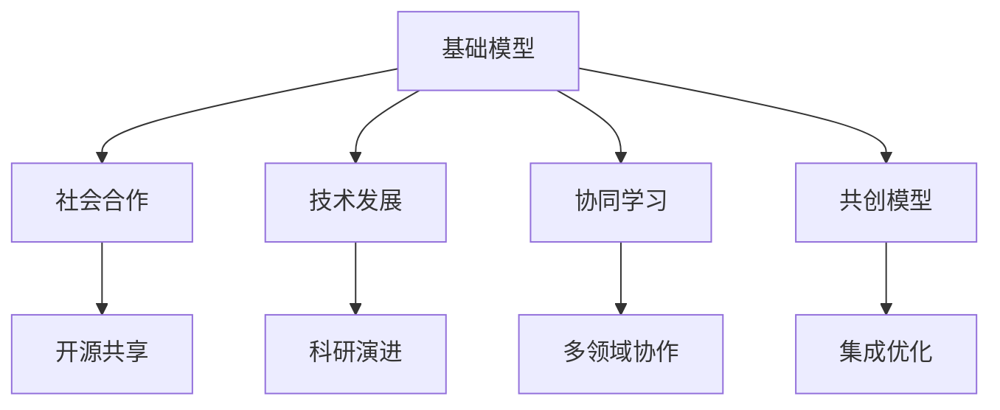
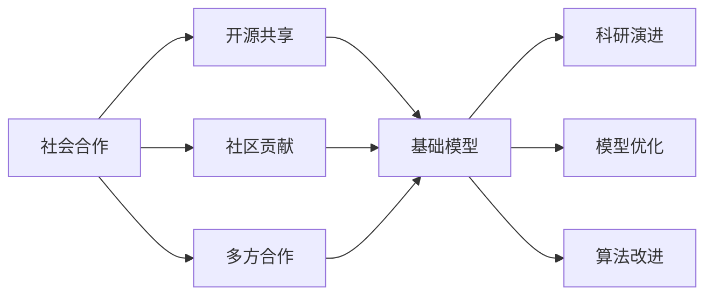
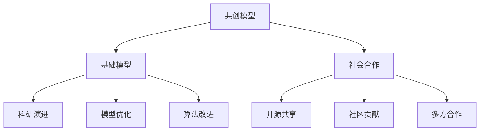
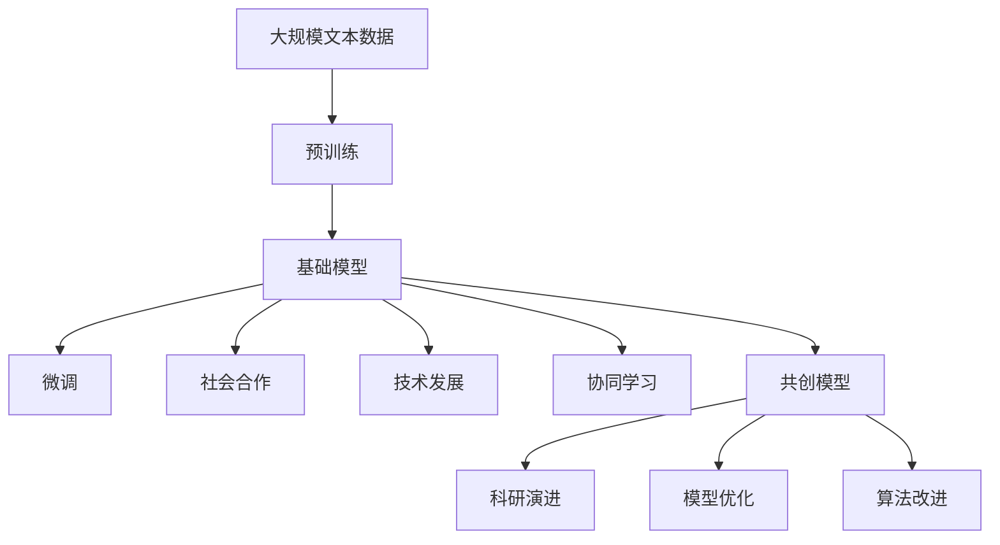

                 

# 基础模型的社会合作与技术发展

> 关键词：基础模型,社会合作,技术发展,人工智能,协同学习,共创模型,深度学习

## 1. 背景介绍

### 1.1 问题由来
在过去几十年中，人工智能(AI)技术取得了长足的进步，尤其是在深度学习领域。深度学习模型的广泛应用，使得AI在图像识别、自然语言处理、语音识别等多个领域取得了突破性成果。然而，尽管深度学习模型在精度和性能上取得了巨大进展，其黑箱特性和可解释性不足的问题仍然困扰着研究人员和开发者。

为了解决这些问题，学者们提出了基础模型(Foundation Model)的概念，即构建一个具有广泛适用性和通用性的深度学习模型，通过社会合作和技术发展，逐步实现其基础性价值。基础模型能够通过不断的社会合作和技术演进，不断提升其性能和应用范围，最终成为构建智能系统的基石。

### 1.2 问题核心关键点
基础模型是一个大规模、高质量、可扩展的深度学习模型，旨在通过社会合作和技术发展，不断提升其基础性价值。其核心在于以下几个方面：

- **大规模**：模型参数规模达到亿级，能够在复杂和多样化的场景中表现出色。
- **高质量**：通过大量的数据训练和算法优化，模型性能稳定可靠。
- **可扩展性**：模型能够通过微调和集成，适应不同的任务和领域。
- **社会合作**：模型通过开源共享和多方协作，不断吸纳新的数据、算法和应用，实现共同进步。

基础模型的目标是构建一个通用的、可信赖的、自适应的AI系统，以解决现实世界的复杂问题。其社会合作和技术发展的过程，类似于开源软件和科学研究的演进，通过不断的迭代和优化，实现技术的突破和应用价值的最大化。

### 1.3 问题研究意义
基础模型的研究具有重要意义，包括：

1. **提升AI的可解释性和可信赖性**：基础模型通过公开数据和算法，鼓励多方协作，提升其可解释性和可信赖性，减少对AI的质疑和恐惧。
2. **促进AI技术的普及和应用**：基础模型通过开源共享，降低技术门槛，促进AI技术的普及和应用，加速各行各业的数字化转型。
3. **推动跨学科研究和合作**：基础模型需要跨学科的知识和技术支持，通过多方合作，推动AI领域的研究和应用。
4. **实现AI的公平性和普惠性**：基础模型通过开放平台和资源，促进AI技术的公平和普惠应用，缩小数字鸿沟。

## 2. 核心概念与联系

### 2.1 核心概念概述

为了更好地理解基础模型的社会合作与技术发展，本节将介绍几个密切相关的核心概念：

- **基础模型**：指一个广泛适用、高质量、可扩展的深度学习模型，旨在通过社会合作和技术发展，实现其基础性价值。
- **社会合作**：指通过开源、社区贡献、多方合作等方式，吸纳新的数据、算法和应用，实现模型的持续改进和优化。
- **技术发展**：指通过科研和技术演进，提升模型的性能和应用范围，实现其基础性价值。
- **协同学习**：指通过多方协作，共同解决复杂问题，提升模型的泛化能力和适应性。
- **共创模型**：指通过多方合作，共同构建和改进模型，实现模型的最优性能和广泛应用。

这些核心概念之间的逻辑关系可以通过以下Mermaid流程图来展示：



这个流程图展示了大语言模型和微调过程中各个核心概念的关系：

1. 基础模型通过社会合作和技术发展，不断提升其基础性价值。
2. 社会合作包括开源共享、社区贡献、多方合作等多种形式。
3. 技术发展包括科研演进、模型优化、算法改进等多个方面。
4. 协同学习指多方合作，共同解决复杂问题。
5. 共创模型指通过多方合作，共同构建和改进模型。

这些概念共同构成了基础模型的演进框架，使其能够在多个领域和应用场景中实现其基础性价值。

### 2.2 概念间的关系

这些核心概念之间存在着紧密的联系，形成了基础模型的演进生态系统。下面我们通过几个Mermaid流程图来展示这些概念之间的关系。

#### 2.2.1 基础模型的学习范式


这个流程图展示了基础模型的核心概念及其之间的关系：

1. 基础模型通过社会合作和技术发展，不断提升其基础性价值。
2. 社会合作包括开源共享、社区贡献、多方合作等多种形式。
3. 技术发展包括科研演进、模型优化、算法改进等多个方面。
4. 协同学习指多方合作，共同解决复杂问题。
5. 共创模型指通过多方合作，共同构建和改进模型。

#### 2.2.2 社会合作与技术发展的关系



这个流程图展示了社会合作与技术发展的关系：

1. 社会合作通过开源共享、社区贡献、多方合作等方式，为基础模型的技术发展提供了丰富的数据和算法资源。
2. 技术发展通过科研演进、模型优化、算法改进等手段，提升基础模型的性能和应用范围。
3. 基础模型通过不断的技术演进，成为通用的、高质量的、可扩展的深度学习模型。

#### 2.2.3 共创模型与社会合作的关系



这个流程图展示了共创模型与社会合作的关系：

1. 共创模型通过社会合作，吸纳新的数据、算法和应用，实现模型的持续改进和优化。
2. 社会合作通过开源共享、社区贡献、多方合作等方式，为共创模型提供了丰富的资源和动力。
3. 共创模型通过不断的技术演进和优化，成为通用的、高质量的、可扩展的深度学习模型。

### 2.3 核心概念的整体架构

最后，我们用一个综合的流程图来展示这些核心概念在大语言模型微调过程中的整体架构：



这个综合流程图展示了从预训练到微调，再到社会合作和技术发展的完整过程。基础模型首先在大规模文本数据上进行预训练，然后通过微调和社会合作，不断改进和优化模型。通过技术发展，提升模型性能和应用范围。协同学习和共创模型则进一步推动模型的社会合作和技术发展，实现模型的最优性能和广泛应用。通过这些流程，基础模型在各个环节不断提升其基础性价值，最终成为通用的、高质量的、可扩展的深度学习模型。

## 3. 核心算法原理 & 具体操作步骤
### 3.1 算法原理概述

基础模型的构建过程是一个动态的、开放的社会合作和技术演进过程。其核心思想是：通过社会合作吸纳新的数据和算法，通过技术演进提升模型的性能和应用范围，最终实现其基础性价值。

形式化地，假设基础模型为 $M_{\theta}$，其中 $\theta$ 为模型参数。给定社会合作的数据集 $D=\{(x_i,y_i)\}_{i=1}^N, x_i \in \mathcal{X}, y_i \in \mathcal{Y}$。技术演进的目标是最小化经验风险，即找到新的模型参数 $\hat{\theta}$，使得：

$$
\hat{\theta}=\mathop{\arg\min}_{\theta} \mathcal{L}(M_{\theta},D)
$$

其中 $\mathcal{L}$ 为针对社会合作任务设计的损失函数，用于衡量模型预测输出与真实标签之间的差异。常见的损失函数包括交叉熵损失、均方误差损失等。

通过梯度下降等优化算法，技术演进过程不断更新模型参数 $\theta$，最小化损失函数 $\mathcal{L}$，使得模型输出逼近真实标签。由于 $\theta$ 已经通过预训练获得了较好的初始化，因此即便在社会合作的小规模数据集 $D$ 上进行技术演进，也能较快收敛到理想的模型参数 $\hat{\theta}$。

### 3.2 算法步骤详解

基础模型的技术演进过程包括以下几个关键步骤：

**Step 1: 准备基础模型和社会合作数据集**
- 选择合适的预训练基础模型 $M_{\theta}$ 作为初始化参数，如 GPT、BERT等。
- 准备社会合作任务 $T$ 的社会合作数据集 $D$，划分为训练集、验证集和测试集。一般要求合作数据与预训练数据的分布不要差异过大。

**Step 2: 添加任务适配层**
- 根据社会合作任务类型，在基础模型顶层设计合适的输出层和损失函数。
- 对于分类任务，通常在顶层添加线性分类器和交叉熵损失函数。
- 对于生成任务，通常使用语言模型的解码器输出概率分布，并以负对数似然为损失函数。

**Step 3: 设置技术演进超参数**
- 选择合适的优化算法及其参数，如 AdamW、SGD 等，设置学习率、批大小、迭代轮数等。
- 设置正则化技术及强度，包括权重衰减、Dropout、Early Stopping 等。
- 确定冻结预训练参数的策略，如仅微调顶层，或全部参数都参与技术演进。

**Step 4: 执行梯度训练**
- 将社会合作数据集数据分批次输入模型，前向传播计算损失函数。
- 反向传播计算参数梯度，根据设定的优化算法和学习率更新模型参数。
- 周期性在验证集上评估模型性能，根据性能指标决定是否触发 Early Stopping。
- 重复上述步骤直到满足预设的迭代轮数或 Early Stopping 条件。

**Step 5: 测试和部署**
- 在测试集上评估技术演进后模型 $M_{\hat{\theta}}$ 的性能，对比技术演进前后的精度提升。
- 使用技术演进后的模型对新样本进行推理预测，集成到实际的应用系统中。
- 持续收集新的数据，定期重新技术演进模型，以适应数据分布的变化。

以上是基础模型的技术演进过程的一般流程。在实际应用中，还需要针对具体任务的特点，对技术演进过程的各个环节进行优化设计，如改进训练目标函数，引入更多的正则化技术，搜索最优的超参数组合等，以进一步提升模型性能。

### 3.3 算法优缺点

基础模型的技术演进方法具有以下优点：

- **简单高效**：只需要准备少量社会合作数据，即可对基础模型进行快速适配，获得较大的性能提升。
- **通用适用**：适用于各种社会合作任务，包括分类、匹配、生成等，设计简单的任务适配层即可实现技术演进。
- **参数高效**：利用参数高效技术，在固定大部分预训练参数的情况下，仍可取得不错的技术演进效果。
- **效果显著**：在学术界和工业界的诸多任务上，技术演进方法已经刷新了最先进的性能指标。

同时，该方法也存在一定的局限性：

- **依赖社会合作数据**：技术演进的效果很大程度上取决于社会合作数据的质量和数量，获取高质量社会合作数据的成本较高。
- **迁移能力有限**：当合作任务与预训练数据的分布差异较大时，技术演进的性能提升有限。
- **负面效果传递**：基础模型的固有偏见、有害信息等，可能通过技术演进传递到合作任务，造成负面影响。
- **可解释性不足**：技术演进模型的决策过程通常缺乏可解释性，难以对其推理逻辑进行分析和调试。

尽管存在这些局限性，但就目前而言，基础模型的技术演进方法仍是社会合作和技术发展的主流范式。未来相关研究的重点在于如何进一步降低技术演进对社会合作数据的依赖，提高模型的少样本学习和跨领域迁移能力，同时兼顾可解释性和伦理安全性等因素。

### 3.4 算法应用领域

基础模型的技术演进方法在多个领域中得到了广泛应用，覆盖了几乎所有常见任务，例如：

- **文本分类**：如情感分析、主题分类、意图识别等。通过技术演进使模型学习文本-标签映射。
- **命名实体识别**：识别文本中的人名、地名、机构名等特定实体。通过技术演进使模型掌握实体边界和类型。
- **关系抽取**：从文本中抽取实体之间的语义关系。通过技术演进使模型学习实体-关系三元组。
- **问答系统**：对自然语言问题给出答案。将问题-答案对作为技术演进数据，训练模型学习匹配答案。
- **机器翻译**：将源语言文本翻译成目标语言。通过技术演进使模型学习语言-语言映射。
- **文本摘要**：将长文本压缩成简短摘要。将文章-摘要对作为技术演进数据，使模型学习抓取要点。
- **对话系统**：使机器能够与人自然对话。将多轮对话历史作为上下文，技术演进模型进行回复生成。

除了上述这些经典任务外，基础模型的技术演进方法也被创新性地应用到更多场景中，如可控文本生成、常识推理、代码生成、数据增强等，为NLP技术带来了全新的突破。随着预训练模型和微调方法的不断进步，相信NLP技术将在更广阔的应用领域大放异彩。

## 4. 数学模型和公式 & 详细讲解  
### 4.1 数学模型构建

本节将使用数学语言对基础模型的技术演进过程进行更加严格的刻画。

记基础模型为 $M_{\theta}$，其中 $\theta$ 为模型参数。假设社会合作任务 $T$ 的社会合作数据集 $D=\{(x_i,y_i)\}_{i=1}^N, x_i \in \mathcal{X}, y_i \in \mathcal{Y}$。

定义模型 $M_{\theta}$ 在数据样本 $(x,y)$ 上的损失函数为 $\ell(M_{\theta}(x),y)$，则在数据集 $D$ 上的经验风险为：

$$
\mathcal{L}(\theta) = \frac{1}{N} \sum_{i=1}^N \ell(M_{\theta}(x_i),y_i)
$$

技术演进的目标是最小化经验风险，即找到最优参数：

$$
\theta^* = \mathop{\arg\min}_{\theta} \mathcal{L}(\theta)
$$

在实践中，我们通常使用基于梯度的优化算法（如SGD、Adam等）来近似求解上述最优化问题。设 $\eta$ 为学习率，$\lambda$ 为正则化系数，则参数的更新公式为：

$$
\theta \leftarrow \theta - \eta \nabla_{\theta}\mathcal{L}(\theta) - \eta\lambda\theta
$$

其中 $\nabla_{\theta}\mathcal{L}(\theta)$ 为损失函数对参数 $\theta$ 的梯度，可通过反向传播算法高效计算。

### 4.2 公式推导过程

以下我们以二分类任务为例，推导交叉熵损失函数及其梯度的计算公式。

假设模型 $M_{\theta}$ 在输入 $x$ 上的输出为 $\hat{y}=M_{\theta}(x) \in [0,1]$，表示样本属于正类的概率。真实标签 $y \in \{0,1\}$。则二分类交叉熵损失函数定义为：

$$
\ell(M_{\theta}(x),y) = -[y\log \hat{y} + (1-y)\log (1-\hat{y})]
$$

将其代入经验风险公式，得：

$$
\mathcal{L}(\theta) = -\frac{1}{N}\sum_{i=1}^N [y_i\log M_{\theta}(x_i)+(1-y_i)\log(1-M_{\theta}(x_i))]
$$

根据链式法则，损失函数对参数 $\theta_k$ 的梯度为：

$$
\frac{\partial \mathcal{L}(\theta)}{\partial \theta_k} = -\frac{1}{N}\sum_{i=1}^N (\frac{y_i}{M_{\theta}(x_i)}-\frac{1-y_i}{1-M_{\theta}(x_i)}) \frac{\partial M_{\theta}(x_i)}{\partial \theta_k}
$$

其中 $\frac{\partial M_{\theta}(x_i)}{\partial \theta_k}$ 可进一步递归展开，利用自动微分技术完成计算。

在得到损失函数的梯度后，即可带入参数更新公式，完成模型的迭代优化。重复上述过程直至收敛，最终得到适应社会合作任务的最优模型参数 $\theta^*$。

## 5. 项目实践：代码实例和详细解释说明
### 5.1 开发环境搭建

在进行技术演进实践前，我们需要准备好开发环境。以下是使用Python进行PyTorch开发的环境配置流程：

1. 安装Anaconda：从官网下载并安装Anaconda，用于创建独立的Python环境。

2. 创建并激活虚拟环境：
```bash
conda create -n pytorch-env python=3.8 
conda activate pytorch-env
```

3. 安装PyTorch：根据CUDA版本，从官网获取对应的安装命令。例如：
```bash
conda install pytorch torchvision torchaudio cudatoolkit=11.1 -c pytorch -c conda-forge
```

4. 安装Transformers库：
```bash
pip install transformers
```

5. 安装各类工具包：
```bash
pip install numpy pandas scikit-learn matplotlib tqdm jupyter notebook ipython
```

完成上述步骤后，即可在`pytorch-env`环境中开始技术演进实践。

### 5.2 源代码详细实现

下面我们以命名实体识别(NER)任务为例，给出使用Transformers库对BERT模型进行技术演进的PyTorch代码实现。

首先，定义NER任务的数据处理函数：

```python
from transformers import BertTokenizer
from torch.utils.data import Dataset
import torch

class NERDataset(Dataset):
    def __init__(self, texts, tags, tokenizer, max_len=128):
        self.texts = texts
        self.tags = tags
        self.tokenizer = tokenizer
        self.max_len = max_len
        
    def __len__(self):
        return len(self.texts)
    
    def __getitem__(self, item):
        text = self.texts[item]
        tags = self.tags[item]
        
        encoding = self.tokenizer(text, return_tensors='pt', max_length=self.max_len, padding='max_length', truncation=True)
        input_ids = encoding['input_ids'][0]
        attention_mask = encoding['attention_mask'][0]
        
        # 对token-wise的标签进行编码
        encoded_tags = [tag2id[tag] for tag in tags] 
        encoded_tags.extend([tag2id['O']] * (self.max_len - len(encoded_tags)))
        labels = torch.tensor(encoded_tags, dtype=torch.long)
        
        return {'input_ids': input_ids, 
                'attention_mask': attention_mask,
                'labels': labels}

# 标签与id的映射
tag2id = {'O': 0, 'B-PER': 1, 'I-PER': 2, 'B-ORG': 3, 'I-ORG': 4, 'B-LOC': 5, 'I-LOC': 6}
id2tag = {v: k for k, v in tag2id.items()}

# 创建dataset
tokenizer = BertTokenizer.from_pretrained('bert-base-cased')

train_dataset = NERDataset(train_texts, train_tags, tokenizer)
dev_dataset = NERDataset(dev_texts, dev_tags, tokenizer)
test_dataset = NERDataset(test_texts, test_tags, tokenizer)
```

然后，定义模型和优化器：

```python
from transformers import BertForTokenClassification, AdamW

model = BertForTokenClassification.from_pretrained('bert-base-cased', num_labels=len(tag2id))

optimizer = AdamW(model.parameters(), lr=2e-5)
```

接着，定义训练和评估函数：

```python
from torch.utils.data import DataLoader
from tqdm import tqdm
from sklearn.metrics import classification_report

device = torch.device('cuda') if torch.cuda.is_available() else torch.device('cpu')
model.to(device)

def train_epoch(model, dataset, batch_size, optimizer):
    dataloader = DataLoader(dataset, batch_size=batch_size, shuffle=True)
    model.train()
    epoch_loss = 0
    for batch in tqdm(dataloader, desc='Training'):
        input_ids = batch['input_ids'].to(device)
        attention_mask = batch['attention_mask'].to(device)
        labels = batch['labels'].to(device)
        model.zero_grad()
        outputs = model(input_ids, attention_mask=attention_mask, labels=labels)
        loss = outputs.loss
        epoch_loss += loss.item()
        loss.backward()
        optimizer.step()
    return epoch_loss / len(dataloader)

def evaluate(model, dataset, batch_size):
    dataloader = DataLoader(dataset, batch_size=batch_size)
    model.eval()
    preds, labels = [], []
    with torch.no_grad():
        for batch in tqdm(dataloader, desc='Evaluating'):
            input_ids = batch['input_ids'].to(device)
            attention_mask = batch['attention_mask'].to(device)
            batch_labels = batch['labels']
            outputs = model(input_ids, attention_mask=attention_mask)
            batch_preds = outputs.logits.argmax(dim=2).to('cpu').tolist()
            batch_labels = batch_labels.to('cpu').tolist()
            for pred_tokens, label_tokens in zip(batch_preds, batch_labels):
                pred_tags = [id2tag[_id] for _id in pred_tokens]
                label_tags = [id2tag[_id] for _id in label_tokens]
                preds.append(pred_tags[:len(label_tags)])
                labels.append(label_tags)
                
    print(classification_report(labels, preds))
```

最后，启动训练流程并在测试集上评估：

```python
epochs = 5
batch_size = 16

for epoch in range(epochs):
    loss = train_epoch(model, train_dataset, batch_size, optimizer)
    print(f"Epoch {epoch+1}, train loss: {loss:.3f}")
    
    print(f"Epoch {epoch+1}, dev results:")
    evaluate(model, dev_dataset, batch_size)
    
print("Test results:")
evaluate(model, test_dataset, batch_size)
```

以上就是使用PyTorch对BERT进行命名实体识别任务技术演进的完整代码实现。可以看到，得益于Transformers库的强大封装，我们可以用相对简洁的代码完成BERT模型的加载和技术演进。

### 5.3 代码解读与分析

让我们再详细解读一下关键代码的实现细节：

**NERDataset类**：
- `__init__`方法：初始化文本、标签、分词器等关键组件。
- `__len__`方法：返回数据集的样本数量。
- `__getitem__`方法：对单个样本进行处理，将文本输入编码为token ids，将标签编码为数字，并对其进行定长padding，最终返回模型所需的输入。

**tag2id和id2tag字典**：
- 定义了标签与数字id之间的映射关系，用于将token-wise的预测结果解码回真实的标签。

**训练和评估函数**：
- 使用PyTorch的DataLoader对数据集进行批次化加载，供模型训练和推理使用。
- 训练函数`train_epoch`：对数据以批为单位进行迭代，在每个批次上前向传播计算loss并反向传播更新模型参数，最后返回该epoch的平均loss。
- 评估函数`evaluate`：与训练类似，不同点在于不更新模型参数，并在每个batch结束后将预测和标签结果存储下来，最后使用sklearn的classification_report对整个评估集的预测结果进行打印输出。

**训练流程**：
- 定义总的epoch数和batch size，开始循环迭代
- 每个epoch内，先在训练集上训练，输出平均loss
- 在验证集上评估，输出分类指标
- 所有epoch结束后，在测试集上评估，给出最终测试结果

可以看到，PyTorch配合Transformers库使得BERT技术演进的代码实现变得简洁高效。开发者可以将更多精力放在数据处理、模型改进等高层逻辑上，而不必过多关注底层的实现细节。

当然，工业级的系统实现还需考虑更多因素，如模型的保存和部署、超参数的自动搜索、更灵活的任务适配层等。但核心的技术演进范式基本与此类似。

### 5.4 运行结果展示

假设我们在CoNLL

