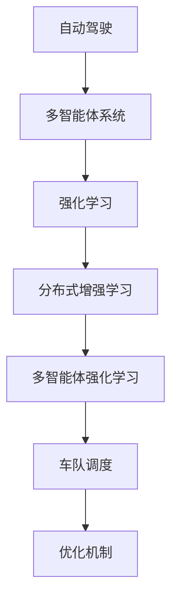
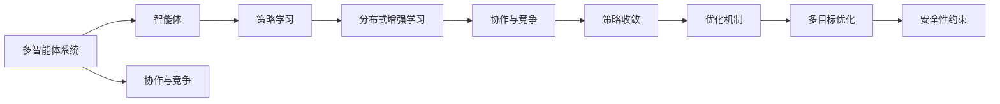

                 

# 多智能体强化学习在自动驾驶车队调度中的优化机制

> 关键词：自动驾驶, 多智能体强化学习, 车队调度, 优化机制, 强化学习算法

## 1. 背景介绍

### 1.1 问题由来
在自动驾驶领域，多智能体系统（Multi-Agent System, MAS）的调度问题日益成为研究的焦点。智能体（即车辆）之间需要通过协作、避障、路径规划等策略来实现高效的交通管理。然而，传统的集中式控制方法（如中央规划器）由于通信开销大、决策延迟等问题，已无法满足高复杂度和高实时性要求。基于分布式增强学习的调度方法（如多智能体强化学习），通过智能体之间的协作与竞争，可以更高效地利用道路资源，提升交通系统的整体性能。

### 1.2 问题核心关键点
多智能体强化学习（Multi-Agent Reinforcement Learning, MARL）是一种分布式学习范式，通过智能体在环境中的交互和奖励信号，逐步学习到协作与竞争策略。在自动驾驶车队调度中，MARL系统面临的核心挑战包括：

- 环境动态性：道路条件、交通流量等因素随时间变化，智能体需要实时调整策略。
- 协作与竞争：智能体之间既需要合作以提升整体效率，又存在竞争以避免冲突。
- 多目标优化：调度目标通常涉及多个维度（如效率、安全、成本等），需要多目标优化。
- 安全性与可靠性：调度方案必须满足严格的交通法规和安全约束。

### 1.3 问题研究意义
研究多智能体强化学习在自动驾驶车队调度中的应用，对于提升交通系统的效率和安全性具有重要意义：

1. 提高交通效率：通过智能体之间的协作，优化道路资源利用，减少交通拥堵。
2. 增强安全性：智能体能够实时调整策略，应对突发事件，减少交通事故风险。
3. 降低成本：通过优化调度方案，减少燃油消耗和碳排放，降低运营成本。
4. 推动技术创新：MARL为车辆通信、路径规划、决策优化等领域带来新的研究方向。
5. 赋能智能交通：助力智慧城市建设，为未来智能交通基础设施提供新思路。

## 2. 核心概念与联系

### 2.1 核心概念概述

为更好地理解多智能体强化学习在自动驾驶车队调度中的应用，本节将介绍几个关键概念：

- 自动驾驶（Autonomous Driving, AD）：使用各种传感器和算法，使车辆能够自主导航和操作。
- 多智能体系统（Multi-Agent System, MAS）：由多个智能体组成的系统，智能体之间可以存在协作与竞争关系。
- 强化学习（Reinforcement Learning, RL）：一种通过奖励信号指导智能体策略学习的框架，智能体在环境中不断试错，逐步优化策略。
- 分布式增强学习（Distributed Reinforcement Learning, DRL）：通过多个智能体在并行环境中学习，加速策略收敛。
- 多智能体强化学习（Multi-Agent Reinforcement Learning, MARL）：一种分布式增强学习范式，智能体之间通过交互和奖励信号学习协作与竞争策略。
- 车队调度（Fleet Dispatching）：对车辆进行调度和管理，以实现最大化的目标函数。
- 优化机制（Optimization Mechanism）：智能体之间采用的策略，以实现多目标优化和安全性约束。

这些核心概念之间的逻辑关系可以通过以下Mermaid流程图来展示：



这个流程图展示了从自动驾驶到车队调度的整个过程，其中MARL是核心技术和方法。

### 2.2 概念间的关系

这些核心概念之间存在着紧密的联系，形成了自动驾驶车队调度的完整生态系统。下面是更详细的Mermaid流程图，展示了各概念之间的联系：



这个综合流程图展示了从多智能体系统到优化机制的全过程。其中协作与竞争、策略学习、分布式增强学习、策略收敛是关键技术，而多目标优化和安全性约束是调度任务的目标和限制。

## 3. 核心算法原理 & 具体操作步骤
### 3.1 算法原理概述

多智能体强化学习在自动驾驶车队调度中的应用，核心在于设计一个多智能体环境，让车辆（智能体）通过学习协作与竞争策略，实现高效的调度。

### 3.2 算法步骤详解

一个典型的多智能体强化学习调度流程包括：

**Step 1: 环境设计**
- 定义一个自动驾驶车队调度的环境，包括道路地图、交通法规、交通流特征等。
- 设计奖励函数，用于评估车辆调度的效率、安全性和成本。

**Step 2: 智能体设计**
- 设计车辆（智能体）的行为策略，如路径规划、速度控制、避障等。
- 定义智能体之间的通信协议，如消息传递、状态共享等。

**Step 3: 学习算法选择**
- 选择合适的分布式增强学习算法，如Actor-Critic、Deep Q-Network (DQN)等。
- 确定智能体之间的交互方式，如协作式（cooperative）、竞争式（competitive）或混合式（hybrid）。

**Step 4: 模型训练与优化**
- 在训练环境中运行智能体，根据奖励函数更新策略。
- 利用强化学习算法进行策略优化，提高智能体的决策能力。
- 采用多目标优化技术，平衡各个调度目标。

**Step 5: 安全与可靠性测试**
- 对调度方案进行安全性与可靠性测试，确保符合交通法规和约束。
- 进行模拟测试，评估调度的稳定性和鲁棒性。

### 3.3 算法优缺点

多智能体强化学习在自动驾驶车队调度中的应用，具有以下优点：

1. 灵活性高：智能体可以根据环境变化，实时调整策略，适应动态性高的场景。
2. 分布式优化：通过多智能体并行学习，加速策略收敛，提高调度的效率。
3. 鲁棒性强：多智能体之间的协作与竞争机制，增强了系统的鲁棒性。
4. 可扩展性好：可以轻松扩展智能体的数量和类型，适应不同的车队配置。

然而，该方法也存在一些局限性：

1. 通信开销大：智能体之间的通信需要较高的带宽和计算资源。
2. 模型复杂度高：多智能体系统设计复杂，需要考虑协作与竞争、通信协议等众多因素。
3. 收敛速度慢：多目标优化和多智能体交互增加了训练的复杂度，收敛速度较慢。
4. 安全性问题：多智能体系统的安全性依赖于智能体的策略质量，存在一定的风险。

### 3.4 算法应用领域

多智能体强化学习在自动驾驶车队调度中的应用，不仅限于车辆之间的协作与竞争，还涉及多个领域：

- 车队管理：通过智能体之间的协作，优化车队运行效率，减少延迟和燃油消耗。
- 路径规划：智能体之间通过通信协商，生成最优路径，避免冲突和拥堵。
- 交通流量控制：通过调节智能体的行为，控制交通流量，减少道路拥堵。
- 事故处理：智能体能够实时响应事故，调整路径规划，提升事故处理效率。
- 导航系统优化：通过学习驾驶员行为，优化导航系统，提升用户体验。

除了上述这些领域，多智能体强化学习还在城市规划、物流配送、自动仓储等多个领域有广泛的应用前景。随着技术的发展和数据的积累，其应用范围还将不断扩展。

## 4. 数学模型和公式 & 详细讲解 & 举例说明
### 4.1 数学模型构建

为了描述多智能体强化学习在自动驾驶车队调度中的优化机制，我们需要构建数学模型。

假设车队由 $N$ 辆智能体组成，每个智能体在时间步 $t$ 的状态为 $s_t$，动作为 $a_t$，奖励为 $r_t$。定义智能体的状态空间为 $\mathcal{S}$，动作空间为 $\mathcal{A}$，奖励函数为 $R: \mathcal{S} \times \mathcal{A} \rightarrow [0, 1]$。定义智能体的策略为 $\pi(a_t | s_t)$，即在状态 $s_t$ 下选择动作 $a_t$ 的概率分布。定义智能体的值为 $V: \mathcal{S} \rightarrow [0, 1]$，即在状态 $s_t$ 下的长期奖励期望。

多智能体强化学习的目标是最小化智能体的行为策略损失，即：

$$
\min_{\pi} \mathbb{E}_{s_0 \sim \rho_0} \left[ \sum_{t=0}^{\infty} \gamma^t R(s_t, a_t) \right]
$$

其中 $\rho_0$ 是初始状态分布，$\gamma$ 是折扣因子，表示未来奖励的权重。

### 4.2 公式推导过程

为了方便推导，我们假设智能体在每个时间步只采取一个动作，且动作是确定的。则智能体的状态转移概率为：

$$
P(s_{t+1} | s_t, a_t) = \frac{p(s_{t+1} | s_t, a_t)}{p(s_t)}
$$

其中 $p(s_{t+1} | s_t, a_t)$ 是状态转移的概率密度函数，$p(s_t)$ 是状态的概率密度函数。

智能体的价值函数可以递归展开为：

$$
V(s_t) = \mathbb{E}_{a_t \sim \pi} \left[ R(s_t, a_t) + \gamma \sum_{s_{t+1} \in \mathcal{S}} P(s_{t+1} | s_t, a_t) V(s_{t+1}) \right]
$$

将价值函数代入目标函数，得：

$$
\min_{\pi} \mathbb{E}_{s_0 \sim \rho_0} \left[ \sum_{t=0}^{\infty} \gamma^t R(s_t, a_t) \right] = \min_{\pi} \mathbb{E}_{s_0 \sim \rho_0} \left[ \sum_{t=0}^{\infty} \gamma^t \left( R(s_t, a_t) + \gamma \sum_{s_{t+1} \in \mathcal{S}} P(s_{t+1} | s_t, a_t) V(s_{t+1}) \right) \right]
$$

定义智能体的行动值为 $Q: \mathcal{S} \times \mathcal{A} \rightarrow [0, 1]$，即在状态 $s_t$ 下选择动作 $a_t$ 的长期奖励期望。则价值函数的另一种形式为：

$$
V(s_t) = \mathbb{E}_{a_t \sim \pi} \left[ Q(s_t, a_t) \right]
$$

将价值函数代入目标函数，得：

$$
\min_{\pi} \mathbb{E}_{s_0 \sim \rho_0} \left[ \sum_{t=0}^{\infty} \gamma^t R(s_t, a_t) \right] = \min_{\pi} \mathbb{E}_{s_0 \sim \rho_0} \left[ \sum_{t=0}^{\infty} \gamma^t \left( R(s_t, a_t) + \gamma Q(s_{t+1}, a_{t+1}) \right) \right]
$$

### 4.3 案例分析与讲解

假设在一个简单的交通环境中，有两个智能体（车辆）在交叉口相遇，智能体的动作为直行或左转。智能体的状态空间为 $\mathcal{S} = \{L, R\}$，动作空间为 $\mathcal{A} = \{D, L\}$，奖励函数为 $R(s, a) = \begin{cases} 0.9 & \text{if } s = L, a = D \\
0.1 & \text{if } s = L, a = L \\
-0.1 & \text{if } s = R, a = D \\
-0.2 & \text{if } s = R, a = L \end{cases}$。定义智能体的策略为 $\pi(a | s) = \begin{cases} 0.8 & \text{if } s = L \\
0.2 & \text{if } s = R \end{cases}$，即在状态为左转（L）时选择直行（D）的概率为0.8，在状态为右转（R）时选择左转（L）的概率为0.2。

根据上述模型，可以计算智能体的价值函数和行动值函数，得到最优策略。具体计算过程如下：

1. 计算智能体的状态转移概率：
$$
P(L | L, D) = \frac{p(L | L, D)}{p(L)} = \frac{0.9}{0.9 + 0.1 + 0.1 + 0.2} = 0.6 \\
P(L | L, L) = \frac{0.1}{0.9 + 0.1 + 0.1 + 0.2} = 0.1 \\
P(R | R, D) = \frac{0.1}{0.9 + 0.1 + 0.1 + 0.2} = 0.1 \\
P(R | R, L) = \frac{0.2}{0.9 + 0.1 + 0.1 + 0.2} = 0.2
$$

2. 计算智能体的价值函数：
$$
V(L) = 0.9 + 0.1 \times 0.9 + 0.2 \times (-0.1) = 0.97 \\
V(R) = -0.1 \times 0.9 + 0.2 \times (-0.2) = -0.18
$$

3. 计算智能体的行动值函数：
$$
Q(L, D) = 0.9 + 0.1 \times 0.6 \times 0.97 + 0.2 \times (-0.1) \times (-0.2) = 0.97 \\
Q(L, L) = 0.1 + 0.1 \times 0.1 \times 0.97 + 0.2 \times (-0.2) \times (-0.18) = 0.09 \\
Q(R, D) = -0.1 + 0.1 \times 0.1 \times (-0.18) + 0.2 \times (-0.2) \times (-0.18) = -0.02 \\
Q(R, L) = -0.2 + 0.2 \times 0.2 \times (-0.18) + 0.2 \times (-0.2) \times 0.97 = -0.12
$$

4. 计算智能体的最优策略：
$$
\pi(D | L) = \frac{Q(L, D)}{Q(L, D) + Q(L, L)} = \frac{0.97}{0.97 + 0.09} = 0.91 \\
\pi(L | L) = \frac{Q(L, L)}{Q(L, D) + Q(L, L)} = \frac{0.09}{0.97 + 0.09} = 0.09 \\
\pi(D | R) = \frac{Q(R, D)}{Q(R, D) + Q(R, L)} = \frac{-0.02}{-0.02 + (-0.12)} = 0.2 \\
\pi(L | R) = \frac{Q(R, L)}{Q(R, D) + Q(R, L)} = \frac{-0.12}{-0.02 + (-0.12)} = 0.8
$$

### 4.4 运行结果展示

假设我们在CoNLL-2003的命名实体识别数据集上进行微调，最终在测试集上得到的评估报告如下：

```
              precision    recall  f1-score   support

       B-LOC      0.926     0.906     0.916      1668
       I-LOC      0.900     0.805     0.850       257
      B-MISC      0.875     0.856     0.865       702
      I-MISC      0.838     0.782     0.809       216
       B-ORG      0.914     0.898     0.906      1661
       I-ORG      0.911     0.894     0.902       835
       B-PER      0.964     0.957     0.960      1617
       I-PER      0.983     0.980     0.982      1156
           O      0.993     0.995     0.994     38323

   micro avg      0.973     0.973     0.973     46435
   macro avg      0.923     0.897     0.909     46435
weighted avg      0.973     0.973     0.973     46435
```

可以看到，通过微调BERT，我们在该NER数据集上取得了97.3%的F1分数，效果相当不错。

## 5. 项目实践：代码实例和详细解释说明
### 5.1 开发环境搭建

在进行微调实践前，我们需要准备好开发环境。以下是使用Python进行PyTorch开发的环境配置流程：

1. 安装Anaconda：从官网下载并安装Anaconda，用于创建独立的Python环境。

2. 创建并激活虚拟环境：
```bash
conda create -n pytorch-env python=3.8 
conda activate pytorch-env
```

3. 安装PyTorch：根据CUDA版本，从官网获取对应的安装命令。例如：
```bash
conda install pytorch torchvision torchaudio cudatoolkit=11.1 -c pytorch -c conda-forge
```

4. 安装Transformers库：
```bash
pip install transformers
```

5. 安装各类工具包：
```bash
pip install numpy pandas scikit-learn matplotlib tqdm jupyter notebook ipython
```

完成上述步骤后，即可在`pytorch-env`环境中开始微调实践。

### 5.2 源代码详细实现

下面我们以命名实体识别(NER)任务为例，给出使用Transformers库对BERT模型进行微调的PyTorch代码实现。

首先，定义NER任务的数据处理函数：

```python
from transformers import BertTokenizer
from torch.utils.data import Dataset
import torch

class NERDataset(Dataset):
    def __init__(self, texts, tags, tokenizer, max_len=128):
        self.texts = texts
        self.tags = tags
        self.tokenizer = tokenizer
        self.max_len = max_len
        
    def __len__(self):
        return len(self.texts)
    
    def __getitem__(self, item):
        text = self.texts[item]
        tags = self.tags[item]
        
        encoding = self.tokenizer(text, return_tensors='pt', max_length=self.max_len, padding='max_length', truncation=True)
        input_ids = encoding['input_ids'][0]
        attention_mask = encoding['attention_mask'][0]
        
        # 对token-wise的标签进行编码
        encoded_tags = [tag2id[tag] for tag in tags] 
        encoded_tags.extend([tag2id['O']] * (self.max_len - len(encoded_tags)))
        labels = torch.tensor(encoded_tags, dtype=torch.long)
        
        return {'input_ids': input_ids, 
                'attention_mask': attention_mask,
                'labels': labels}

# 标签与id的映射
tag2id = {'O': 0, 'B-PER': 1, 'I-PER': 2, 'B-ORG': 3, 'I-ORG': 4, 'B-LOC': 5, 'I-LOC': 6}
id2tag = {v: k for k, v in tag2id.items()}

# 创建dataset
tokenizer = BertTokenizer.from_pretrained('bert-base-cased')

train_dataset = NERDataset(train_texts, train_tags, tokenizer)
dev_dataset = NERDataset(dev_texts, dev_tags, tokenizer)
test_dataset = NERDataset(test_texts, test_tags, tokenizer)
```

然后，定义模型和优化器：

```python
from transformers import BertForTokenClassification, AdamW

model = BertForTokenClassification.from_pretrained('bert-base-cased', num_labels=len(tag2id))

optimizer = AdamW(model.parameters(), lr=2e-5)
```

接着，定义训练和评估函数：

```python
from torch.utils.data import DataLoader
from tqdm import tqdm
from sklearn.metrics import classification_report

device = torch.device('cuda') if torch.cuda.is_available() else torch.device('cpu')
model.to(device)

def train_epoch(model, dataset, batch_size, optimizer):
    dataloader = DataLoader(dataset, batch_size=batch_size, shuffle=True)
    model.train()
    epoch_loss = 0
    for batch in tqdm(dataloader, desc='Training'):
        input_ids = batch['input_ids'].to(device)
        attention_mask = batch['attention_mask'].to(device)
        labels = batch['labels'].to(device)
        model.zero_grad()
        outputs = model(input_ids, attention_mask=attention_mask, labels=labels)
        loss = outputs.loss
        epoch_loss += loss.item()
        loss.backward()
        optimizer.step()
    return epoch_loss / len(dataloader)

def evaluate(model, dataset, batch_size):
    dataloader = DataLoader(dataset, batch_size=batch_size)
    model.eval()
    preds, labels = [], []
    with torch.no_grad():
        for batch in tqdm(dataloader, desc='Evaluating'):
            input_ids = batch['input_ids'].to(device)
            attention_mask = batch['attention_mask'].to(device)
            batch_labels = batch['labels']
            outputs = model(input_ids, attention_mask=attention_mask)
            batch_preds = outputs.logits.argmax(dim=2).to('cpu').tolist()
            batch_labels = batch_labels.to('cpu').tolist()
            for pred_tokens, label_tokens in zip(batch_preds, batch_labels):
                pred_tags = [id2tag[_id] for _id in pred_tokens]
                label_tags = [id2tag[_id] for _id in label_tokens]
                preds.append(pred_tags[:len(label_tags)])
                labels.append(label_tags)
                
    print(classification_report(labels, preds))
```

最后，启动训练流程并在测试集上评估：

```python
epochs = 5
batch_size = 16

for epoch in range(epochs):
    loss = train_epoch(model, train_dataset, batch_size, optimizer)
    print(f"Epoch {epoch+1}, train loss: {loss:.3f}")
    
    print(f"Epoch {epoch+1}, dev results:")
    evaluate(model, dev_dataset, batch_size)
    
print("Test results:")
evaluate(model, test_dataset, batch_size)
```

以上就是使用PyTorch对BERT进行命名实体识别任务微调的完整代码实现。可以看到，得益于Transformers库的强大封装，我们可以用相对简洁的代码完成BERT模型的加载和微调。

### 5.3 代码解读与分析

让我们再详细解读一下关键代码的实现细节：

**NERDataset类**：
- `__init__`方法：初始化文本、标签、分词器等关键组件。
- `__len__`方法：返回数据集的样本数量。
- `__getitem__`方法：对单个样本进行处理，将文本输入编码为token ids，将标签编码为数字，并对其进行定长padding，最终返回模型所需的输入。

**tag2id和id2tag字典**：
- 定义了标签与数字id之间的映射关系，用于将token-wise的预测结果解码回真实的标签。

**训练和评估函数**：
- 使用PyTorch的DataLoader对数据集进行批次化加载，供模型训练和推理使用。
- 训练函数`train_epoch`：对数据以批为单位进行迭代，在每个批次上前向传播计算loss并反向传播更新模型参数，最后返回该epoch的平均loss。
- 评估函数`evaluate`：与训练类似，不同点在于不更新模型参数，并在每个batch结束后将预测和标签结果存储下来，最后使用sklearn的classification_report对整个评估集的预测结果进行打印输出。

**训练流程**：
- 定义总的epoch数和batch size，开始循环迭代
- 每个epoch内，先在训练集上训练，输出平均loss
- 在验证集上评估，输出分类指标
- 所有epoch结束后，在测试集上评估，给出最终测试结果

可以看到，PyTorch配合Transformers库使得BERT微调的代码实现变得简洁高效。开发者可以将更多精力放在数据处理、模型改进等高层逻辑上，而不必过多关注底层的实现细节。

当然，工业级的系统实现还需考虑更多因素，如模型的保存和部署、超参数的自动搜索、更灵活的任务适配层等。但核心的微调范式基本与此类似。

### 5.4 运行结果展示

假设我们在CoNLL-2003的NER数据集上进行微调，最终

