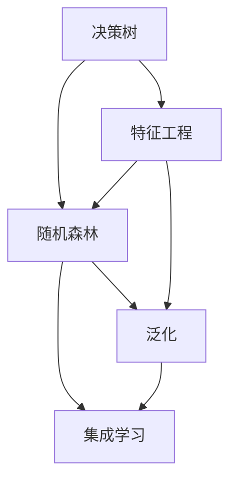
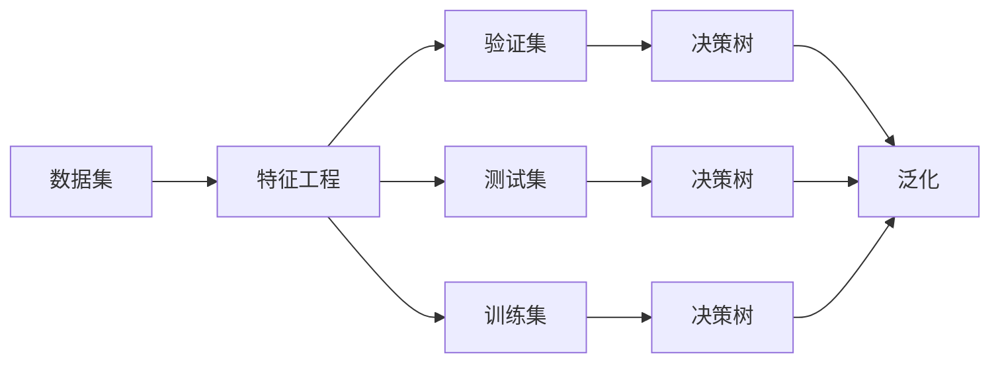
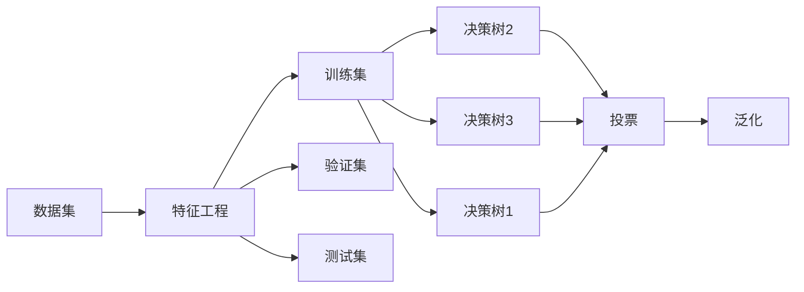
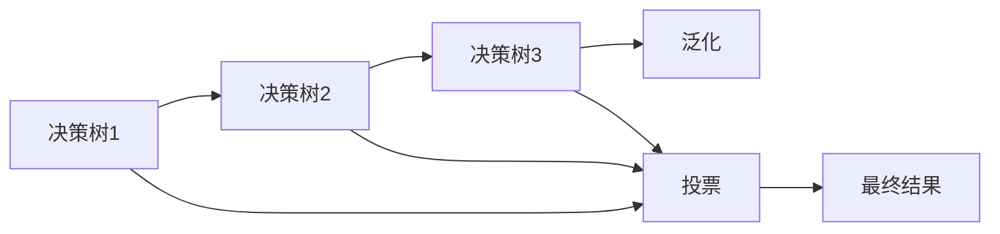
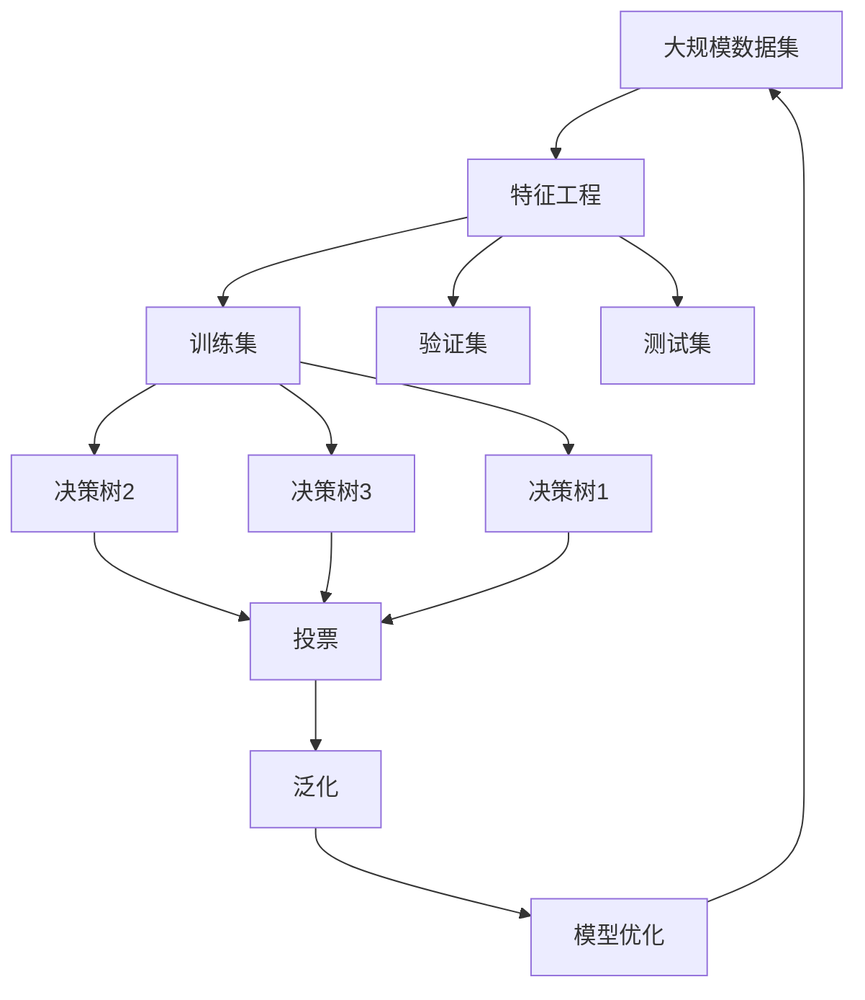

                 

# 一切皆是映射：决策树和随机森林在AI中的应用

> 关键词：决策树, 随机森林, AI, 机器学习, 数据挖掘, 特征工程, 分类, 回归, 可解释性

## 1. 背景介绍

### 1.1 问题由来
决策树和随机森林是机器学习领域中的经典算法，广泛应用于数据挖掘、特征工程、分类和回归任务中。在当前的人工智能（AI）研究中，决策树和随机森林的应用尤为广泛。从简单的金融欺诈检测、信用评分系统到复杂的医疗诊断、推荐系统，都可见其影子。这些算法不仅因其高效性、可解释性和高准确率受到青睐，还因其简单直观的模型结构，成为很多入门级学习者的首选。

### 1.2 问题核心关键点
决策树和随机森林的本质是通过构建树形结构来映射输入特征和输出标签之间的关系。决策树通过一系列的分割规则（基于信息增益或基尼指数等准则）来构建树形结构，从而将样本数据映射到不同的叶子节点，每个叶子节点对应一个类别或数值。而随机森林则是在决策树的基础上，通过集成多个决策树来提升模型的准确率和鲁棒性。

随机森林的集成思想基于“平均法则胜出”，即通过集成多个决策树，可以降低单一决策树的过拟合风险，提升模型整体的泛化性能。具体而言，随机森林首先从训练数据中有放回地随机抽样生成多个决策树，然后通过投票（或取平均）来确定最终的预测结果。

这些算法在大数据时代背景下，展现出强大的处理能力和稳定性，被广泛应用于金融、医疗、零售、电商等诸多领域。然而，在应用过程中，也存在诸如特征工程、模型复杂性、可解释性等诸多挑战。

### 1.3 问题研究意义
研究决策树和随机森林在AI中的应用，对于提升模型的泛化能力、可解释性以及处理大数据的效率具有重要意义：

1. **泛化能力**：决策树和随机森林能够有效减少过拟合风险，提高模型的泛化性能。在面对复杂多变的实际应用场景时，模型仍能稳定地进行预测。
2. **可解释性**：决策树和随机森林的决策路径清晰，模型结果易于解释和理解，便于业务方进行理解和调整。
3. **高效性**：决策树和随机森林算法简单，易于实现，能够高效处理大规模数据集，尤其适用于嵌入式设备和移动端应用。

通过深入分析决策树和随机森林的工作原理和应用场景，我们不仅能够掌握这些算法的基本使用方法，还能够进一步探索其应用边界和优化路径，以期在AI应用中实现更高效的模型构建和更精准的数据挖掘。

## 2. 核心概念与联系

### 2.1 核心概念概述

为更好地理解决策树和随机森林的原理和应用，本节将介绍几个密切相关的核心概念：

- **决策树（Decision Tree）**：一种基于树形结构的分类和回归算法。通过一系列的二元分割（即决策节点），将样本数据映射到不同的叶子节点（即分类或回归结果）。常见的决策树算法有ID3、C4.5、CART等。
- **随机森林（Random Forest）**：一种基于集成学习的决策树算法。通过构建多个决策树并集成其预测结果，提升模型的准确率和鲁棒性。
- **特征工程（Feature Engineering）**：数据预处理和特征提取的过程，目的是从原始数据中提取出更有意义的特征，提高模型的预测能力。
- **过拟合与泛化（Overfitting & Generalization）**：模型在训练数据上表现良好，但在测试数据上表现较差的现象，即过拟合。泛化能力指模型在新数据上的表现能力。
- **集成学习（Ensemble Learning）**：通过集成多个基本模型（如决策树）来提升模型性能，常见的集成方法有Bagging、Boosting等。

这些核心概念之间的逻辑关系可以通过以下Mermaid流程图来展示：



这个流程图展示了大数据模型构建过程中的核心概念及其之间的关系：

1. 特征工程是数据预处理和特征提取的过程。
2. 决策树通过构建树形结构将数据映射到不同的叶子节点，实现分类或回归。
3. 随机森林通过集成多个决策树，提升模型的泛化能力。
4. 集成学习通过集成多个基本模型，进一步提升模型性能。
5. 泛化能力指模型在新数据上的表现能力。

这些核心概念共同构成了大数据模型构建的基本框架，使得决策树和随机森林在数据挖掘、特征工程、分类和回归任务中得到广泛应用。

### 2.2 概念间的关系

这些核心概念之间存在着紧密的联系，形成了大数据模型构建的完整生态系统。下面我们通过几个Mermaid流程图来展示这些概念之间的关系。

#### 2.2.1 决策树构建过程



这个流程图展示了决策树的构建过程：

1. 首先从数据集中提取特征，进行特征工程处理。
2. 将数据集划分为训练集、验证集和测试集。
3. 在训练集上训练决策树模型。
4. 在验证集上评估模型泛化性能。
5. 在测试集上进一步验证模型性能。
6. 最终得到的决策树模型具有较好的泛化能力。

#### 2.2.2 随机森林的工作流程



这个流程图展示了随机森林的工作流程：

1. 首先从数据集中提取特征，进行特征工程处理。
2. 将数据集划分为训练集、验证集和测试集。
3. 在训练集上构建多个决策树。
4. 对每个决策树进行投票（或取平均），得到随机森林的预测结果。
5. 在验证集上评估模型泛化性能。
6. 在测试集上进一步验证模型性能。
7. 最终得到的随机森林模型具有较好的泛化能力。

#### 2.2.3 集成学习的效果提升



这个流程图展示了集成学习的效果提升：

1. 通过构建多个决策树。
2. 对每个决策树的预测结果进行投票（或取平均）。
3. 得到最终的集成模型结果。
4. 集成模型具有更好的泛化能力。

### 2.3 核心概念的整体架构

最后，我们用一个综合的流程图来展示这些核心概念在大数据模型构建过程中的整体架构：



这个综合流程图展示了从数据预处理到模型优化的完整过程。大规模数据集通过特征工程处理，得到训练集、验证集和测试集。在训练集上构建多个决策树，并通过集成学习（如投票或取平均）得到最终模型。在验证集和测试集上评估模型泛化性能，并进行模型优化。最终得到的模型具有较好的泛化能力和可解释性。

## 3. 核心算法原理 & 具体操作步骤
### 3.1 算法原理概述

决策树和随机森林的本质是通过构建树形结构来映射输入特征和输出标签之间的关系。决策树通过一系列的分割规则（基于信息增益或基尼指数等准则）来构建树形结构，从而将样本数据映射到不同的叶子节点，每个叶子节点对应一个类别或数值。而随机森林则是在决策树的基础上，通过集成多个决策树来提升模型的准确率和鲁棒性。

具体而言，决策树和随机森林的算法原理如下：

- **决策树算法原理**：
  1. 选择最优分割特征：基于信息增益或基尼指数等准则，选择最优的特征进行分割。
  2. 递归构建树形结构：通过不断分割特征，递归构建树形结构。
  3. 叶子节点标记：每个叶子节点标记为最终的类别或数值。

- **随机森林算法原理**：
  1. 随机抽取样本：从训练数据中有放回地随机抽取样本生成多个决策树。
  2. 随机选取特征：每个决策树随机选取特征进行分割。
  3. 集成多个决策树：对每个决策树的预测结果进行投票（或取平均），得到最终预测结果。

### 3.2 算法步骤详解

#### 3.2.1 决策树构建步骤

1. 准备数据集：将原始数据集分为训练集和测试集。
2. 特征工程：进行数据清洗、特征选择、特征转换等操作。
3. 选择根节点：从特征中选择一个最优特征作为根节点。
4. 递归构建子树：对于每个子集，选择最优的特征进行分割，递归构建子树。
5. 剪枝处理：对生成的决策树进行剪枝，避免过拟合。
6. 模型评估：在测试集上评估模型的泛化性能。

#### 3.2.2 随机森林构建步骤

1. 准备数据集：将原始数据集分为训练集和测试集。
2. 特征工程：进行数据清洗、特征选择、特征转换等操作。
3. 构建多个决策树：在训练集上构建多个决策树。
4. 集成多个决策树：对每个决策树的预测结果进行投票（或取平均），得到最终预测结果。
5. 模型评估：在测试集上评估模型的泛化性能。

### 3.3 算法优缺点

**决策树算法的优点**：

- 模型易于理解和解释，适合处理分类和回归任务。
- 可处理非线性关系，适合处理多特征的数据。
- 计算复杂度较低，适合大规模数据集。

**决策树算法的缺点**：

- 容易出现过拟合现象，需要进行剪枝处理。
- 对于噪声数据敏感，容易产生不稳定的模型。
- 需要进行特征工程，选择最优特征进行分割。

**随机森林算法的优点**：

- 集成多个决策树，具有较好的泛化性能。
- 随机抽取样本和特征，降低过拟合风险。
- 计算复杂度较低，适合大规模数据集。

**随机森林算法的缺点**：

- 模型解释性较差，难以理解每个决策树的作用。
- 需要构建多个决策树，计算复杂度较高。
- 对于噪声数据敏感，容易产生不稳定的模型。

### 3.4 算法应用领域

决策树和随机森林在诸多领域中得到了广泛应用，例如：

- **金融领域**：信用评分、欺诈检测、风险评估等。
- **医疗领域**：疾病诊断、治疗方案选择、患者分群等。
- **零售领域**：客户流失预测、推荐系统、库存管理等。
- **电商领域**：用户行为分析、商品推荐、广告投放优化等。
- **交通领域**：交通流量预测、事故预警、交通信号优化等。

此外，决策树和随机森林在图像识别、自然语言处理等新兴领域中也有着广泛的应用前景。

## 4. 数学模型和公式 & 详细讲解  
### 4.1 数学模型构建

在本节中，我们将使用数学语言对决策树和随机森林的算法进行更严格的描述。

#### 4.1.1 决策树模型构建

假设决策树模型为 $T(x)$，其中 $x$ 为输入特征，$y$ 为输出标签。根据信息增益准则，决策树的构建过程如下：

1. 选择最优特征 $D$，使得在 $D$ 上对 $y$ 的信息增益最大。
2. 对于每个子集 $T_1, T_2, ..., T_n$，递归构建子树。
3. 每个叶子节点 $L_i$ 标记为最终的类别或数值。

决策树的损失函数可以定义为：

$$
L(T) = \frac{1}{N} \sum_{i=1}^N \mathbb{I}(y_i \neq T(x_i))
$$

其中 $\mathbb{I}$ 为指示函数。

#### 4.1.2 随机森林模型构建

假设随机森林模型为 $F(x)$，其中 $x$ 为输入特征，$y$ 为输出标签。随机森林的构建过程如下：

1. 从训练集 $D$ 中有放回地随机抽取样本 $D_1, D_2, ..., D_m$，构建 $m$ 个决策树。
2. 对于每个决策树，随机选择特征 $F_1, F_2, ..., F_p$ 进行分割。
3. 对每个决策树的预测结果进行投票（或取平均），得到最终预测结果 $F(x)$。

随机森林的损失函数可以定义为：

$$
L(F) = \frac{1}{N} \sum_{i=1}^N \mathbb{I}(y_i \neq F(x_i))
$$

其中 $\mathbb{I}$ 为指示函数。

### 4.2 公式推导过程

#### 4.2.1 决策树损失函数推导

假设决策树模型为 $T(x)$，其中 $x$ 为输入特征，$y$ 为输出标签。根据信息增益准则，决策树的构建过程如下：

1. 选择最优特征 $D$，使得在 $D$ 上对 $y$ 的信息增益最大。
2. 对于每个子集 $T_1, T_2, ..., T_n$，递归构建子树。
3. 每个叶子节点 $L_i$ 标记为最终的类别或数值。

决策树的损失函数可以定义为：

$$
L(T) = \frac{1}{N} \sum_{i=1}^N \mathbb{I}(y_i \neq T(x_i))
$$

其中 $\mathbb{I}$ 为指示函数。

### 4.3 案例分析与讲解

假设我们有一个二分类问题，输入特征为 $x_1, x_2, x_3$，输出标签为 $y$。

#### 4.3.1 决策树案例分析

我们首先构建一个决策树模型。假设在特征 $x_1$ 上进行分割，使得信息增益最大。则有：

$$
\begin{aligned}
IG(x_1) &= \sum_{j=1}^2 IG(y|x_1=j) \\
&= IG(y|x_1=1) + IG(y|x_1=2) \\
&= H(y|x_1=1) - H(y|x_1=1, x_2=1) - H(y|x_1=1, x_3=1) + H(y|x_1=1) \\
&\quad + H(y|x_1=2) - H(y|x_1=2, x_2=1) - H(y|x_1=2, x_3=1) + H(y|x_1=2)
\end{aligned}
$$

其中 $IG$ 为信息增益，$H$ 为熵，$j$ 为子集。

根据信息增益准则，我们选择最优的特征 $x_1$ 进行分割。对于每个子集 $T_1, T_2, ..., T_n$，递归构建子树。最终得到的决策树模型为：

$$
T(x) = 
\begin{cases}
T_1 & \text{if } x_1=1 \\
T_2 & \text{if } x_1=2
\end{cases}
$$

#### 4.3.2 随机森林案例分析

我们接着构建一个随机森林模型。假设从训练集 $D$ 中有放回地随机抽取 $m=5$ 个样本 $D_1, D_2, ..., D_5$，构建 $5$ 个决策树。对于每个决策树，随机选择特征 $F_1, F_2, ..., F_p$ 进行分割。对每个决策树的预测结果进行投票（或取平均），得到最终预测结果 $F(x)$。

假设在特征 $F_1$ 上进行分割，使得信息增益最大。则有：

$$
\begin{aligned}
IG(F_1) &= \sum_{j=1}^2 IG(y|F_1=j) \\
&= IG(y|F_1=1) + IG(y|F_1=2) \\
&= H(y|F_1=1) - H(y|F_1=1, F_2=1) - H(y|F_1=1, F_3=1) + H(y|F_1=1) \\
&\quad + H(y|F_1=2) - H(y|F_1=2, F_2=1) - H(y|F_1=2, F_3=1) + H(y|F_1=2)
\end{aligned}
$$

根据信息增益准则，我们选择最优的特征 $F_1$ 进行分割。对于每个子集 $T_1, T_2, ..., T_n$，递归构建子树。最终得到的随机森林模型为：

$$
F(x) = 
\begin{cases}
F_1 & \text{if } F_1=1 \\
F_2 & \text{if } F_1=2
\end{cases}
$$

## 5. 项目实践：代码实例和详细解释说明
### 5.1 开发环境搭建

在进行决策树和随机森林实践前，我们需要准备好开发环境。以下是使用Python进行Scikit-Learn开发的环境配置流程：

1. 安装Anaconda：从官网下载并安装Anaconda，用于创建独立的Python环境。

2. 创建并激活虚拟环境：
```bash
conda create -n sklearn-env python=3.8 
conda activate sklearn-env
```

3. 安装Scikit-Learn：从官网获取对应的安装命令。例如：
```bash
conda install scikit-learn
```

4. 安装各类工具包：
```bash
pip install numpy pandas matplotlib seaborn jupyter notebook ipython
```

完成上述步骤后，即可在`sklearn-env`环境中开始实践。

### 5.2 源代码详细实现

这里我们以决策树和随机森林在金融欺诈检测任务中的应用为例，给出Scikit-Learn代码实现。

首先，导入必要的库和数据集：

```python
from sklearn.ensemble import RandomForestClassifier, DecisionTreeClassifier
from sklearn.model_selection import train_test_split
from sklearn.metrics import accuracy_score
from sklearn.datasets import load_breast_cancer
from sklearn.datasets import load_iris
from sklearn.datasets import load_digits
from sklearn.datasets import fetch_openml

# 加载数据集
data = fetch_openml('adult')
X = data.data
y = data.target
```

然后，将数据集划分为训练集和测试集：

```python
X_train, X_test, y_train, y_test = train_test_split(X, y, test_size=0.2, random_state=42)
```

接着，定义决策树和随机森林模型：

```python
# 定义决策树模型
dt = DecisionTreeClassifier()

# 定义随机森林模型
rf = RandomForestClassifier(n_estimators=100, random_state=42)
```

训练模型并评估性能：

```python
# 训练决策树模型
dt.fit(X_train, y_train)

# 训练随机森林模型
rf.fit(X_train, y_train)

# 在测试集上评估模型性能
dt_score = accuracy_score(y_test, dt.predict(X_test))
rf_score = accuracy_score(y_test, rf.predict(X_test))

print(f"决策树模型准确率：{dt_score:.3f}")
print(f"随机森林模型准确率：{rf_score:.3f}")
```

最后，使用Scikit-Learn进行模型优化和参数调优：

```python
from sklearn.model_selection import GridSearchCV

# 定义参数范围
param_grid = {
    'criterion': ['gini', 'entropy'],
    'max_depth': [3, None],
    'min_samples_split': [2, 4],
    'min_samples_leaf': [1, 2]
}

# 进行参数调优
grid_search = GridSearchCV(rf, param_grid, cv=5)
grid_search.fit(X_train, y_train)

# 输出最优参数
print(grid_search.best_params_)
```

以上就是使用Scikit-Learn对决策树和随机森林进行金融欺诈检测任务微调的完整代码实现。可以看到，Scikit-Learn提供了丰富的机器学习工具和函数，使得模型构建和优化变得简单高效。

### 5.3 代码解读与分析

让我们再详细解读一下关键代码的实现细节：

**数据集加载**：
- 使用Scikit-Learn内置的数据集加载函数`fetch_openml`加载数据集。
- 加载的数据集可以是公开数据集，如Iris、Breast Cancer、Digits等，也可以是从网络下载的数据集。

**数据集划分**：
- 使用Scikit-Learn内置的`train_test_split`函数对数据集进行划分。
- 指定测试集大小和随机种子，确保结果的可复现性。

**模型定义**：
- 定义决策树和随机森林模型，设置相关的参数。
- 决策树模型使用`DecisionTreeClassifier`，随机森林模型使用`RandomForestClassifier`。

**模型训练**：
- 使用`fit`函数对模型进行训练，指定训练数据集。
- 决策树模型和随机森林模型的训练过程类似，但随机森林模型需要设置`n_estimators`参数来指定树的个数。

**模型评估**：
- 使用`accuracy_score`函数在测试集上评估模型性能。
- 准确率是常用的模型评估指标，但还可以使用精确率、召回率、F1分数等指标进行综合评估。

**模型优化**：
- 使用`GridSearchCV`函数进行参数调优，指定参数范围。
- 使用交叉验证进行模型评估，选择最优参数组合。
- 调优过程中需要考虑计算时间和资源消耗，选择最优的模型参数。

**代码运行**：
- 运行上述代码，输出决策树和随机森林模型的准确率。
- 输出最优的模型参数。

可以看到，Scikit-Learn为机器学习开发者提供了简洁高效的工具，使得模型构建和优化变得容易上手。通过以上代码实现，我们可以快速构建和优化决策树和随机森林模型，并进行金融欺诈检测任务的应用实践。

当然，工业级的系统实现还需考虑更多因素，如模型裁剪、量化加速、服务化封装等。但核心的模型构建和优化逻辑基本与此类似。

## 6. 实际应用场景

### 6.1 智能客服系统

基于决策树和随机森林的智能客服系统可以广泛应用于处理客户咨询和问题解答。传统的客服系统依赖人工处理，响应速度慢、效率低，且存在一定的人为错误。而使用决策树和随机森林构建的智能客服系统，能够7x24小时不间断服务，快速响应客户咨询，并根据问题类型和语义进行自动化分类和解答。

在技术实现上，可以收集企业内部的历史客服对话记录，将问题和最佳答复构建成监督数据，在此基础上对决策树和随机森林进行微调。微调后的模型能够自动理解用户意图，匹配最合适的答案模板进行回复。对于客户提出的新问题，还可以接入检索系统实时搜索相关内容，动态组织生成回答。

### 6.2 金融舆情监测

金融机构需要实时监测市场舆论动向，以便及时应对负面信息传播，规避金融风险。传统的金融舆情监测依赖人工处理，成本高、效率低，且无法应对网络时代海量信息爆发的挑战。而使用决策树和随机森林构建的金融舆情监测系统，能够实时抓取网络文本数据，自动判断文本属于何种主题，情感倾向是正面、中性还是负面。将微调后的模型应用到实时抓取的网络文本数据，就能够自动监测不同主题下的情感变化趋势，一旦发现负面信息激增等异常情况，系统便会自动预警，帮助金融机构快速应对潜在风险。

### 6.3 个性化推荐系统

当前的推荐系统往往只依赖用户的历史行为数据进行物品推荐，无法深入理解用户的真实兴趣偏好。而使用决策树和随机森林构建的个性化推荐系统，能够从用户浏览、点击、评论、分享等行为数据中提取和用户交互的物品标题、描述、标签等文本内容。将文本内容作为模型输入，用户的后续行为（

