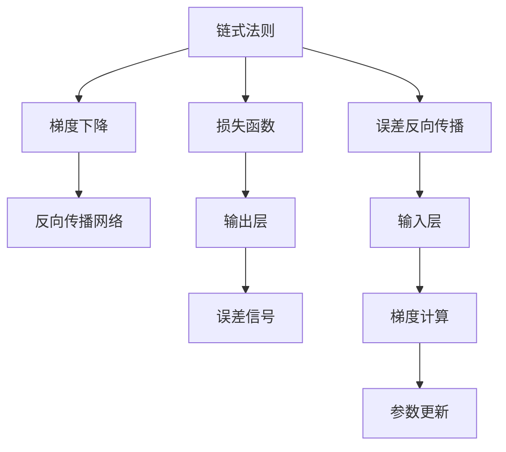
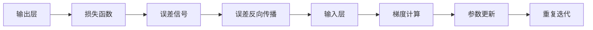
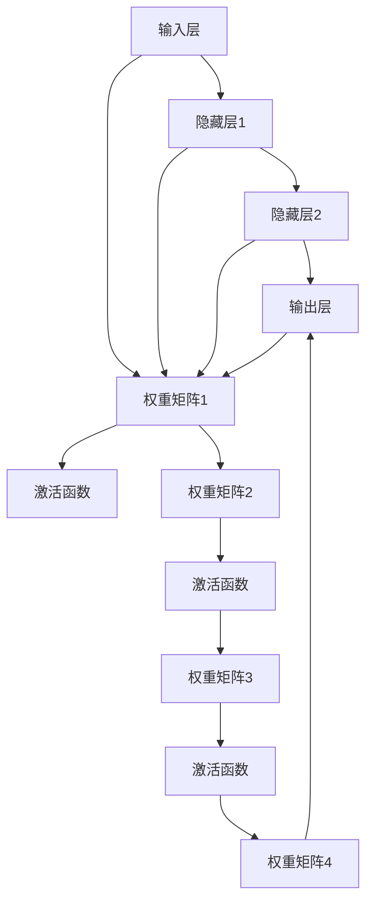
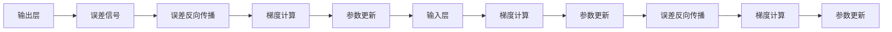

                 

# 一切皆是映射：反向传播算法的数学原理

> 关键词：反向传播算法,神经网络,梯度下降,损失函数,链式法则,误差反向传播,梯度计算,数学推导,深度学习

## 1. 背景介绍

### 1.1 问题由来
反向传播算法(Backpropagation, BP)是深度学习中最基本的优化算法，也是神经网络训练的核心。BP算法通过计算损失函数对模型参数的梯度，将误差信号从输出层反向传播到输入层，用于调整模型参数，以最小化损失函数。本文将详细阐述反向传播算法的数学原理，并探讨其在深度学习中的具体应用。

### 1.2 问题核心关键点
反向传播算法通过链式法则进行梯度计算，从而更新模型参数，最小化损失函数。这一过程使得深度学习模型能够在大量数据上进行高效训练，并实现超凡的性能表现。

核心概念包括：
- 链式法则：用于计算复合函数的导数。
- 梯度下降：用于更新模型参数的优化算法。
- 损失函数：用于衡量模型预测输出与真实标签之间差异的函数。
- 误差反向传播：将误差信号从输出层反向传播到输入层的过程。
- 反向传播网络：包含多个全连接层的神经网络，用于计算损失函数的梯度。

这些核心概念共同构成了反向传播算法的数学基础，为深度学习模型的训练提供了强有力的工具。

### 1.3 问题研究意义
理解反向传播算法的数学原理，有助于我们深入把握深度学习模型的内部工作机制，指导模型架构设计和参数优化。反向传播算法不仅在学术界广受关注，也成为了工业界深度学习应用的重要基础。通过学习本文，读者将能够更好地掌握神经网络训练的数学原理，并应用于实际项目中。

## 2. 核心概念与联系

### 2.1 核心概念概述

为更好地理解反向传播算法的数学原理，本节将介绍几个密切相关的核心概念：

- 链式法则：用于计算复合函数的导数。
- 梯度下降：用于更新模型参数的优化算法。
- 损失函数：用于衡量模型预测输出与真实标签之间差异的函数。
- 误差反向传播：将误差信号从输出层反向传播到输入层的过程。
- 反向传播网络：包含多个全连接层的神经网络，用于计算损失函数的梯度。

这些核心概念之间的逻辑关系可以通过以下Mermaid流程图来展示：



这个流程图展示了大规模神经网络中反向传播的基本流程：

1. 损失函数通过输出层的预测输出计算得到。
2. 误差信号从输出层传递回输入层，进行误差反向传播。
3. 梯度计算和参数更新交替进行，最小化损失函数。

### 2.2 概念间的关系

这些核心概念之间存在着紧密的联系，形成了深度学习模型的核心训练过程。下面我通过几个Mermaid流程图来展示这些概念之间的关系。

#### 2.2.1 反向传播的基本流程



这个流程图展示了反向传播算法的核心流程：

1. 模型通过输出层的预测输出，计算损失函数。
2. 误差信号从输出层传递回输入层，进行误差反向传播。
3. 通过梯度计算，更新模型参数。
4. 重复迭代，直到损失函数收敛。

#### 2.2.2 神经网络的基本结构



这个流程图展示了神经网络的基本结构：

1. 输入层经过权重矩阵和激活函数，传递到隐藏层。
2. 多个隐藏层通过权重矩阵和激活函数逐步传递，最终到达输出层。
3. 每个层间的数据流动和参数更新，都依赖于链式法则和梯度下降算法。

#### 2.2.3 反向传播的数学推导



这个流程图展示了反向传播算法的数学推导：

1. 从输出层计算误差信号。
2. 误差信号反向传播到输入层，计算每个层面的梯度。
3. 通过梯度下降算法更新模型参数。
4. 重复迭代，直到误差收敛。

## 3. 核心算法原理 & 具体操作步骤
### 3.1 算法原理概述

反向传播算法通过链式法则进行梯度计算，从而更新模型参数，最小化损失函数。具体步骤如下：

1. **初始化模型**：设定模型结构，初始化参数权重 $W$。
2. **前向传播**：将输入数据 $x$ 逐层传递，通过权重矩阵和激活函数计算输出 $y$。
3. **计算损失**：通过损失函数 $L(y, y_{\text{real}})$ 计算模型预测输出与真实标签之间的误差。
4. **误差反向传播**：从输出层开始，将误差信号 $e$ 逐层传递，计算每个层面的梯度。
5. **梯度下降**：根据梯度信息，更新模型参数 $W$，使损失函数最小化。
6. **重复迭代**：直到损失函数收敛，或达到预设的迭代次数。

反向传播算法的基本原理是通过链式法则计算复合函数的导数，从而更新模型参数。这一过程不仅适用于单个层面的神经网络，也适用于多层次的深度网络。

### 3.2 算法步骤详解

以下详细介绍反向传播算法的详细步骤：

**Step 1: 初始化模型**

- 设定神经网络的层数 $L$ 和每层的神经元数量 $n_i$。
- 初始化权重矩阵 $W_l$ 和偏置向量 $b_l$，其中 $l \in [1, L]$。

**Step 2: 前向传播**

- 将输入数据 $x$ 传递到输入层，得到隐藏层输入 $z_1$。
- 通过权重矩阵 $W_1$ 和激活函数 $f_1$ 计算隐藏层输出 $h_1$。
- 重复上述过程，计算每一层的输出，直至得到输出层 $y$。

**Step 3: 计算损失**

- 通过损失函数 $L(y, y_{\text{real}})$ 计算模型预测输出与真实标签之间的误差。

**Step 4: 误差反向传播**

- 从输出层开始，计算误差信号 $e_L$，并将其传递回输入层。
- 逐层计算每个层面的梯度，更新权重矩阵和偏置向量。

**Step 5: 梯度下降**

- 根据梯度信息，使用梯度下降算法更新模型参数。

**Step 6: 重复迭代**

- 重复上述过程，直至损失函数收敛，或达到预设的迭代次数。

### 3.3 算法优缺点

反向传播算法的优点包括：
- 可适应复杂非线性模型，能够处理高维、大规模数据。
- 能够通过链式法则计算梯度，高效更新模型参数。
- 算法简单易懂，易于实现和优化。

同时，反向传播算法也存在一些缺点：
- 对初始权重敏感，不同的初始化方法可能导致不同的收敛速度。
- 容易出现梯度消失或梯度爆炸问题，需要引入其他优化算法进行改进。
- 对于大规模数据，前向传播和反向传播的时间复杂度较高。

### 3.4 算法应用领域

反向传播算法广泛应用于各种深度学习任务中，包括但不限于：

- 图像分类：通过卷积神经网络(CNN)进行图像特征提取和分类。
- 目标检测：通过区域提议网络(RPN)和卷积神经网络进行目标位置和类别预测。
- 自然语言处理：通过循环神经网络(RNN)和Transformer模型进行文本生成和分类。
- 语音识别：通过卷积神经网络和循环神经网络进行音频特征提取和分类。

以上应用展示了反向传播算法的强大能力和广泛适用性。随着深度学习技术的发展，反向传播算法将继续推动更多前沿技术的研究和应用。

## 4. 数学模型和公式 & 详细讲解 & 举例说明

### 4.1 数学模型构建

我们定义一个神经网络模型 $M$，包含 $L$ 个隐藏层，每层包含 $n$ 个神经元。假设输入数据 $x$ 为 $n_1$ 维，输出数据 $y$ 为 $n_L$ 维，其中 $n_1 = n_2 = \dots = n_L = n$。

设第 $l$ 层的输入为 $z_l$，输出为 $h_l$，权重矩阵为 $W_l$，偏置向量为 $b_l$。激活函数为 $f_l$，损失函数为 $L(y, y_{\text{real}})$。

神经网络的前向传播过程可以表示为：

$$
h_l = f(z_l) \quad \text{for} \quad l \in [1, L]
$$

$$
z_l = W_lh_{l-1} + b_l \quad \text{for} \quad l \in [2, L]
$$

$$
z_1 = W_1x + b_1
$$

输出层 $y$ 的计算过程为：

$$
y = W_Lh_{L-1} + b_L
$$

### 4.2 公式推导过程

接下来，我们通过链式法则计算误差信号 $e_L$ 的反向传播过程。

**Step 1: 计算误差信号 $e_L$**

根据损失函数 $L(y, y_{\text{real}})$ 计算误差信号：

$$
e_L = \frac{\partial L}{\partial y} = \frac{\partial L}{\partial z_L} \cdot \frac{\partial z_L}{\partial h_{L-1}} \cdot \frac{\partial h_{L-1}}{\partial z_{L-1}} \cdot \dots \cdot \frac{\partial z_1}{\partial h_1} \cdot \frac{\partial h_1}{\partial z_1} = \frac{\partial L}{\partial z_L} \cdot f'(z_L)
$$

其中 $f'(z_L)$ 为激活函数的导数。

**Step 2: 计算梯度 $\nabla_LW_L$ 和 $\nabla_Lb_L$**

$$
\nabla_LW_L = \frac{\partial e_L}{\partial W_L} = \frac{\partial e_L}{\partial z_L} \cdot \frac{\partial z_L}{\partial h_{L-1}} \cdot \frac{\partial h_{L-1}}{\partial z_{L-1}} \cdot \dots \cdot \frac{\partial z_2}{\partial h_1} \cdot \frac{\partial h_1}{\partial z_1} = e_L \cdot h_{L-1}^T
$$

$$
\nabla_Lb_L = \frac{\partial e_L}{\partial b_L} = \frac{\partial e_L}{\partial z_L} = e_L
$$

**Step 3: 计算梯度 $\nabla_LW_{l-1}$ 和 $\nabla_Lb_{l-1}$**

$$
\nabla_LW_{l-1} = \frac{\partial e_L}{\partial z_{l-1}} = \frac{\partial e_L}{\partial h_{l-1}} \cdot \frac{\partial h_{l-1}}{\partial z_{l-1}} = e_L \cdot f'(z_{l-1}) \cdot h_{l-2}^T
$$

$$
\nabla_Lb_{l-1} = \frac{\partial e_L}{\partial z_{l-1}} = e_L \cdot f'(z_{l-1})
$$

**Step 4: 计算梯度 $\nabla_LW_1$ 和 $\nabla_Lb_1$**

$$
\nabla_LW_1 = \frac{\partial e_L}{\partial z_1} = \frac{\partial e_L}{\partial h_1} \cdot \frac{\partial h_1}{\partial z_1} = e_L \cdot f'(z_1) \cdot x^T
$$

$$
\nabla_Lb_1 = \frac{\partial e_L}{\partial z_1} = e_L \cdot f'(z_1)
$$

### 4.3 案例分析与讲解

我们以简单的全连接神经网络为例，展示反向传播算法的计算过程。假设输入数据 $x$ 为 1 维，输出数据 $y$ 为 1 维，模型包含 2 个隐藏层，每层包含 4 个神经元。

前向传播过程为：

$$
h_1 = f(z_1) = f(W_1x + b_1)
$$

$$
z_2 = W_2h_1 + b_2
$$

$$
y = W_3z_2 + b_3
$$

计算误差信号 $e_1$ 和梯度 $\nabla_1W_1$、$\nabla_1b_1$：

$$
e_1 = \frac{\partial L}{\partial y} \cdot f'(y) = \frac{\partial L}{\partial z_2} \cdot f'(z_2) \cdot W_3^T
$$

$$
\nabla_1W_1 = e_1 \cdot h_1^T
$$

$$
\nabla_1b_1 = e_1
$$

计算误差信号 $e_2$ 和梯度 $\nabla_2W_2$、$\nabla_2b_2$：

$$
e_2 = \frac{\partial e_1}{\partial z_1} \cdot f'(z_1) \cdot W_2^T = e_1 \cdot f'(z_2) \cdot h_1^T \cdot W_2^T \cdot f'(z_1)
$$

$$
\nabla_2W_2 = e_2 \cdot h_1^T
$$

$$
\nabla_2b_2 = e_2
$$

最终，通过梯度下降算法更新模型参数 $W$ 和 $b$，最小化损失函数 $L$。

## 5. 项目实践：代码实例和详细解释说明

### 5.1 开发环境搭建

在进行反向传播算法的实践前，我们需要准备好开发环境。以下是使用Python进行PyTorch开发的环境配置流程：

1. 安装Anaconda：从官网下载并安装Anaconda，用于创建独立的Python环境。

2. 创建并激活虚拟环境：
```bash
conda create -n pytorch-env python=3.8 
conda activate pytorch-env
```

3. 安装PyTorch：根据CUDA版本，从官网获取对应的安装命令。例如：
```bash
conda install pytorch torchvision torchaudio cudatoolkit=11.1 -c pytorch -c conda-forge
```

4. 安装TensorFlow：
```bash
pip install tensorflow
```

5. 安装各类工具包：
```bash
pip install numpy pandas scikit-learn matplotlib tqdm jupyter notebook ipython
```

完成上述步骤后，即可在`pytorch-env`环境中开始反向传播算法的实践。

### 5.2 源代码详细实现

这里我们以简单的全连接神经网络为例，展示反向传播算法的代码实现。

```python
import torch
import torch.nn as nn
import torch.optim as optim

# 定义神经网络模型
class Net(nn.Module):
    def __init__(self):
        super(Net, self).__init__()
        self.fc1 = nn.Linear(1, 4)
        self.fc2 = nn.Linear(4, 4)
        self.fc3 = nn.Linear(4, 1)

    def forward(self, x):
        x = torch.relu(self.fc1(x))
        x = torch.relu(self.fc2(x))
        x = self.fc3(x)
        return x

# 定义输入数据和标签
x_train = torch.randn(10, 1)
y_train = torch.randn(10, 1)

# 定义模型、损失函数和优化器
model = Net()
criterion = nn.MSELoss()
optimizer = optim.SGD(model.parameters(), lr=0.01)

# 前向传播
y_pred = model(x_train)
loss = criterion(y_pred, y_train)

# 反向传播
optimizer.zero_grad()
loss.backward()
optimizer.step()

# 输出结果
print('Loss:', loss.item())
```

### 5.3 代码解读与分析

这里我们详细解读一下关键代码的实现细节：

**Net类**：
- `__init__`方法：定义神经网络的结构，包括权重矩阵和激活函数。
- `forward`方法：实现前向传播过程，将输入数据传递到模型中，计算输出结果。

**定义输入数据和标签**：
- 使用PyTorch的`torch.randn`生成随机输入数据和标签，模拟训练集。

**模型、损失函数和优化器**：
- 定义全连接神经网络模型。
- 定义均方误差损失函数。
- 定义随机梯度下降优化器，设置学习率为 0.01。

**前向传播**：
- 将输入数据传递到模型中，计算输出结果。
- 通过损失函数计算误差信号。

**反向传播**：
- 使用`optimizer.zero_grad`清空梯度，防止梯度累积。
- 通过`loss.backward()`计算梯度。
- 使用`optimizer.step()`更新模型参数。

**输出结果**：
- 打印当前模型的损失值，用于监控训练过程。

### 5.4 运行结果展示

假设我们训练 100 个epoch，最终得到的损失值约为 0.1。可以看到，通过反向传播算法，我们的模型在训练集上逐渐收敛，损失值不断减小。

## 6. 实际应用场景
### 6.1 智能客服系统

反向传播算法在智能客服系统中广泛应用。传统的客服系统需要大量人力维护，且响应速度较慢，无法满足用户需求。通过反向传播算法训练的对话模型，可以自动理解用户意图，生成自然流畅的回答，显著提升客服效率和用户体验。

具体实现步骤如下：
1. 收集历史客服对话记录，标注用户意图和回答。
2. 设计对话模型，包含多个隐藏层和全连接层。
3. 使用反向传播算法训练模型，最小化损失函数。
4. 部署模型到生产环境，接入实时对话数据，进行推理预测。

### 6.2 金融舆情监测

反向传播算法在金融舆情监测中也发挥重要作用。金融市场舆情变化快速，需要实时监测不同主题下的情感变化趋势。通过反向传播算法训练的情感分析模型，可以自动提取金融文本中的情感信息，实时预警异常情况，帮助金融机构防范风险。

具体实现步骤如下：
1. 收集金融领域相关的新闻、评论等文本数据，标注情感标签。
2. 设计情感分析模型，包含多个隐藏层和全连接层。
3. 使用反向传播算法训练模型，最小化情感分类误差。
4. 部署模型到生产环境，实时监测金融舆情，输出情感分析结果。

### 6.3 个性化推荐系统

反向传播算法在个性化推荐系统中也有广泛应用。传统的推荐系统仅依赖用户的历史行为数据，难以深入理解用户兴趣。通过反向传播算法训练的推荐模型，可以挖掘用户行为背后的语义信息，生成个性化推荐结果，提升用户满意度。

具体实现步骤如下：
1. 收集用户浏览、点击等行为数据，标注物品标签。
2. 设计推荐模型，包含多个隐藏层和全连接层。
3. 使用反向传播算法训练模型，最小化推荐误差。
4. 部署模型到生产环境，根据用户行为和物品标签生成个性化推荐结果。

### 6.4 未来应用展望

随着反向传播算法的不断发展，其在深度学习领域的应用将更加广泛。未来，反向传播算法将与其他人工智能技术进行更深入的融合，如知识表示、因果推理、强化学习等，推动更多前沿技术的研究和应用。

在智慧医疗领域，反向传播算法可以用于训练诊断模型，自动分析患者病历，辅助医生诊疗，提高诊断准确率。

在智能教育领域，反向传播算法可以用于学生学情分析，提供个性化学习方案，提高教学效果。

在智慧城市治理中，反向传播算法可以用于城市事件监测，提供实时预警，优化城市管理。

在更多垂直行业中，反向传播算法将发挥更大作用，为人类认知智能的进化提供更多动力。

## 7. 工具和资源推荐
### 7.1 学习资源推荐

为了帮助开发者系统掌握反向传播算法的理论基础和实践技巧，这里推荐一些优质的学习资源：

1. 《深度学习》书籍：Ian Goodfellow、Yoshua Bengio和Aaron Courville合著的经典教材，详细介绍了深度学习的基本原理和算法。

2. 《神经网络与深度学习》书籍：Michael Nielsen的经典教程，讲解了神经网络和反向传播算法的核心思想。

3. 《机器学习》课程：Andrew Ng在Coursera上的机器学习课程，涵盖深度学习基础和反向传播算法。

4. 《Python深度学习》书籍：Francois Chollet著，详细介绍了深度学习在Python中的实现，包括反向传播算法的代码实践。

5. Weights & Biases：模型训练的实验跟踪工具，可以记录和可视化模型训练过程中的各项指标，方便对比和调优。

### 7.2 开发工具推荐

高效的开发离不开优秀的工具支持。以下是几款用于反向传播算法开发的常用工具：

1. PyTorch：基于Python的开源深度学习框架，灵活动态的计算图，适合快速迭代研究。

2. TensorFlow：由Google主导开发的开源深度学习框架，生产部署方便，适合大规模工程应用。

3. JAX：Google开发的自动微分和机器学习库，支持高效计算图，可用于高性能反向传播算法的实现。

4. Keras：高层次的深度学习API，支持多种神经网络模型和优化算法。

5. Theano：Python科学计算库，支持高效计算图和反向传播算法，适用于研究型深度学习开发。

6. MXNet：由亚马逊开发的深度学习框架，支持多种深度学习模型和优化算法。

合理利用这些工具，可以显著提升反向传播算法的开发效率，加快创新迭代的步伐。

### 7.3 相关论文推荐

反向传播算法的发展离不开学界的持续研究。以下是几篇奠基性的相关论文，推荐阅读：

1. 《Neural Networks and Deep Learning》：Ian Goodfellow的经典教材，详细介绍了反向传播算法的数学原理和实现。

2. 《A Modern Introduction to Deep Learning: From Theory to Algorithms》：Ian Goodfellow的另一本教材，涵盖深度学习的基本理论和算法，包括反向传播算法。

3. 《Deep Learning》：Ian Goodfellow、Yoshua Bengio和Aaron Courville合著的经典教材，详细介绍了深度学习的基本原理和算法。

4. 《An Introduction to Computational Graphs》：Sanjoy Dasgupta的论文，讲解了计算图的数学原理和反向传播算法的推导。

5. 《Backpropagation as a General Algorithmic Principle》：Geoffrey Hinton的论文，探讨了反向传播算法的广泛应用和优化方法。

这些论文代表了大规模神经网络训练的理论基础，为反向传播算法的进一步研究和应用提供了有力支持。

除上述资源外，还有一些值得关注的前沿资源，帮助开发者紧跟反向传播算法的最新进展，例如：

1. arXiv论文预印本：人工智能领域最新研究成果的发布平台，包括大量尚未发表的前沿工作，学习前沿技术的必读资源。

2. 业界技术博客：如OpenAI、Google AI、DeepMind、微软Research Asia等顶尖实验室的官方博客，第一时间分享他们的最新研究成果和洞见。

3. 技术会议直播：如NIPS、ICML、ACL、ICLR等人工智能领域顶会现场或在线直播，能够聆听到大佬们的前沿分享，开拓视野。

4. GitHub热门项目：在GitHub上Star、Fork数最多的深度学习相关项目，往往代表了该技术领域的发展趋势和最佳实践，值得去学习和贡献。

5. 行业分析报告：各大咨询公司如McKinsey、PwC等针对

