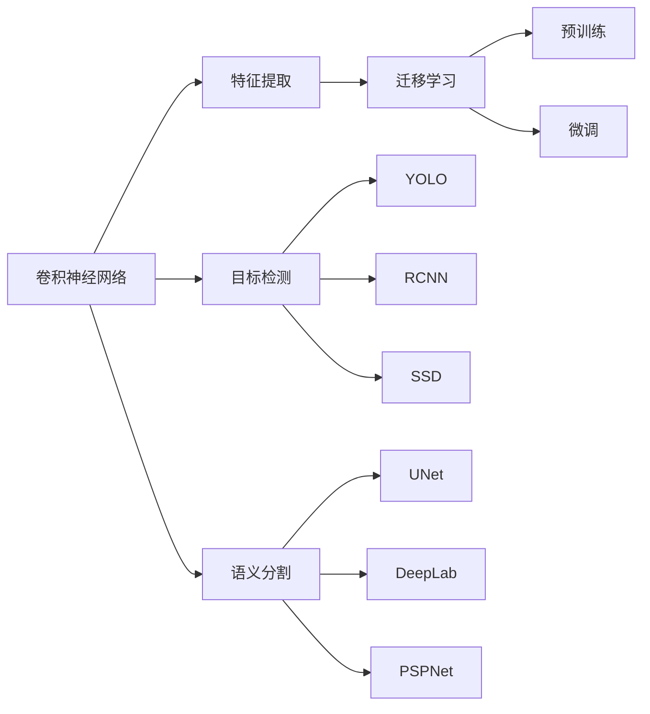
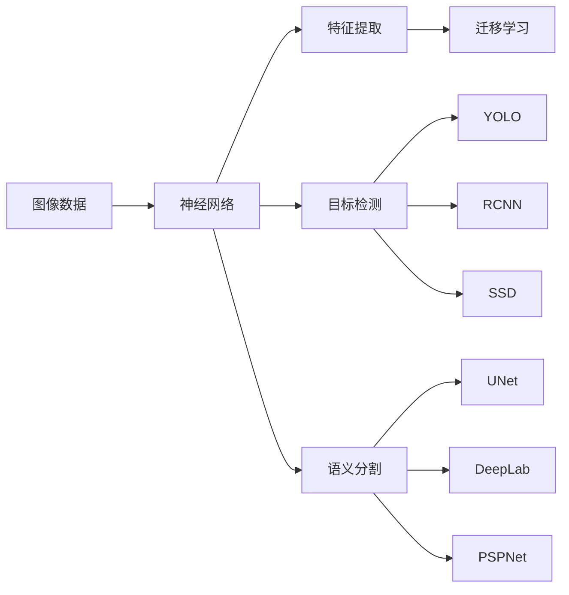
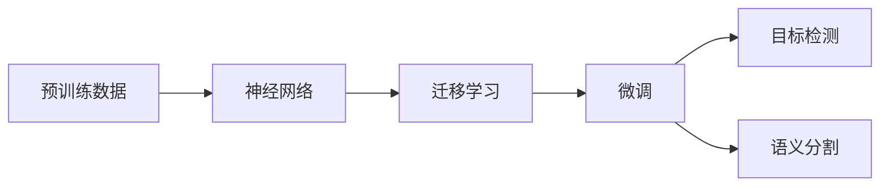
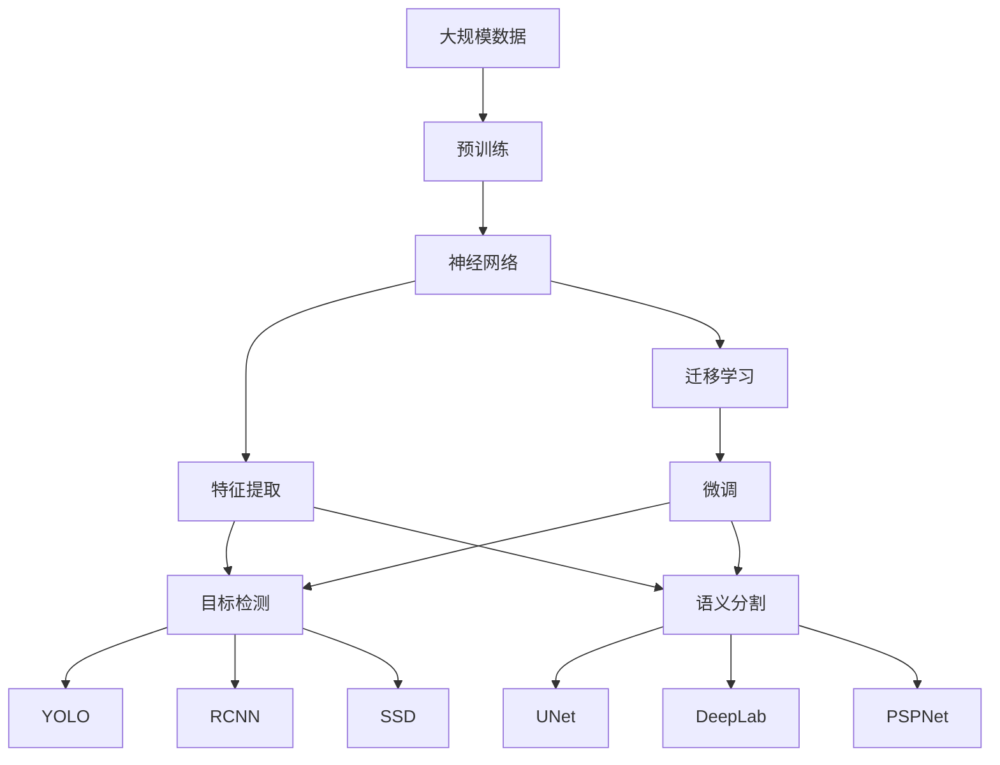

                 

# 一切皆是映射：机器视觉与神经网络的结合应用

> 关键词：机器视觉,神经网络,卷积神经网络(CNN),图像识别,目标检测,语义分割,迁移学习,计算机视觉,深度学习,YOLO,RCNN,UNet

## 1. 背景介绍

### 1.1 问题由来
随着计算机视觉（Computer Vision, CV）技术的不断发展，机器视觉（Machine Vision）已经成为现代工业自动化、智能家居、无人驾驶、安防监控等领域的重要支撑。传统的机器视觉算法依赖于手工设计的特征提取器（Feature Extractor）和分类器（Classifier），对数据分布和特定任务场景具有较强的依赖性，难以应对复杂多变的现实问题。

卷积神经网络（Convolutional Neural Network, CNN）的提出，极大地提升了机器视觉任务的性能。通过学习数据内在的高层次特征表示，CNN可以从原始像素级别直接进行图像分类、目标检测、语义分割等任务，显著减少了手工设计的复杂度，提升了算法的鲁棒性和泛化能力。

然而，尽管CNN在大规模数据上取得了显著成效，其固有的计算复杂度和对大规模数据的需求，使其在实际应用中仍存在一定局限。特别是在计算资源有限的场景下，如图像智能监控、边缘计算设备等，难以有效部署大规模的神经网络模型。

近年来，神经网络与机器视觉技术的深度结合，提出了一类基于神经网络的新型机器视觉应用，如基于神经网络的图像识别、目标检测、语义分割等任务。这种基于神经网络的机器视觉方法不仅能够充分利用大规模数据训练高效的特征提取器，同时还能通过迁移学习、参数共享等技术，降低对标注数据的依赖，提升模型的泛化能力。

本文聚焦于基于神经网络的机器视觉应用，深入探讨其核心原理、操作步骤、算法优缺点以及实际应用领域。

### 1.2 问题核心关键点
机器视觉与神经网络的结合应用，涉及以下几个核心关键点：

- **神经网络结构**：包括CNN、循环神经网络（Recurrent Neural Network, RNN）、长短时记忆网络（Long Short-Term Memory, LSTM）、卷积递归神经网络（Convolutional Recurrent Neural Network, CRNN）等。
- **特征提取器**：基于神经网络特征提取器能够自动从原始像素数据中学习到高层次的特征表示，广泛应用于图像分类、目标检测、语义分割等任务。
- **迁移学习**：通过在大规模数据上预训练好的神经网络模型，在特定小规模数据集上进行微调，提升模型在特定任务上的性能。
- **目标检测**：包括传统方法如Haar特征+SVM、HOG+SVM，以及基于神经网络的YOLO、RCNN、SSD等。
- **语义分割**：包括基于神经网络的UNet、DeepLab、PSPNet等。

这些关键点共同构成了基于神经网络的机器视觉方法的核心框架，为后续深入讨论提供基础。

## 2. 核心概念与联系

### 2.1 核心概念概述

为更好地理解基于神经网络的机器视觉方法，本节将介绍几个密切相关的核心概念：

- **卷积神经网络（CNN）**：一种专门用于处理网格状数据（如图像）的神经网络，包含卷积层、池化层、全连接层等组件，能够自动提取图像的局部特征和全局特征。
- **迁移学习（Transfer Learning）**：指在大规模数据上预训练好的神经网络模型，在特定小规模数据集上进行微调，提升模型在特定任务上的性能。
- **目标检测（Object Detection）**：识别图像中特定对象的位置和类别，常见的目标检测算法包括YOLO、RCNN、SSD等。
- **语义分割（Semantic Segmentation）**：将图像中的每个像素进行分类，常见的语义分割算法包括UNet、DeepLab、PSPNet等。

这些核心概念之间的逻辑关系可以通过以下Mermaid流程图来展示：



这个流程图展示了大语言模型微调过程中各个核心概念之间的关系：

1. 卷积神经网络能够自动提取图像的局部特征和全局特征。
2. 迁移学习可以通过在大规模数据上预训练好的神经网络模型，在特定小规模数据集上进行微调，提升模型在特定任务上的性能。
3. 目标检测和语义分割是基于神经网络的机器视觉应用的两个主要方向。
4. 目标检测算法包括YOLO、RCNN、SSD等。
5. 语义分割算法包括UNet、DeepLab、PSPNet等。

### 2.2 概念间的关系

这些核心概念之间存在着紧密的联系，形成了基于神经网络的机器视觉方法的完整生态系统。下面我通过几个Mermaid流程图来展示这些概念之间的关系。

#### 2.2.1 机器视觉与神经网络的结合



这个流程图展示了大语言模型微调过程中，图像数据和神经网络的结合：

1. 图像数据作为神经网络模型的输入。
2. 神经网络通过特征提取、目标检测、语义分割等任务，从原始像素数据中学习到高层次的特征表示。
3. 迁移学习可以通过在大规模数据上预训练好的神经网络模型，在特定小规模数据集上进行微调，提升模型在特定任务上的性能。
4. 目标检测算法包括YOLO、RCNN、SSD等。
5. 语义分割算法包括UNet、DeepLab、PSPNet等。

#### 2.2.2 迁移学习与神经网络的结合



这个流程图展示了迁移学习在神经网络中的结合：

1. 预训练数据用于训练神经网络模型。
2. 迁移学习可以通过在大规模数据上预训练好的神经网络模型，在特定小规模数据集上进行微调，提升模型在特定任务上的性能。
3. 微调后的神经网络模型可用于目标检测和语义分割等任务。

### 2.3 核心概念的整体架构

最后，我们用一个综合的流程图来展示这些核心概念在大语言模型微调过程中的整体架构：



这个综合流程图展示了从预训练到微调，再到目标检测和语义分割的完整过程。神经网络模型首先在大规模数据上进行预训练，然后通过迁移学习，在特定小规模数据集上进行微调，最后用于目标检测和语义分割等任务。 通过这些流程图，我们可以更清晰地理解基于神经网络的机器视觉方法的整体架构。

## 3. 核心算法原理 & 具体操作步骤
### 3.1 算法原理概述

基于神经网络的机器视觉应用，本质上是一个深度学习范式，旨在通过神经网络自动学习数据的内在表示，并在此基础上进行特征提取、目标检测、语义分割等任务。其核心思想是：通过大规模数据训练高效的特征提取器，然后通过迁移学习或微调，在特定任务上进行优化。

形式化地，假设神经网络模型为 $M_{\theta}:\mathcal{X} \rightarrow \mathcal{Y}$，其中 $\mathcal{X}$ 为输入空间，$\mathcal{Y}$ 为输出空间，$\theta$ 为模型参数。假设机器视觉任务的训练集为 $D=\{(x_i,y_i)\}_{i=1}^N, x_i \in \mathcal{X}, y_i \in \mathcal{Y}$。

定义模型 $M_{\theta}$ 在数据样本 $(x,y)$ 上的损失函数为 $\ell(M_{\theta}(x),y)$，则在数据集 $D$ 上的经验风险为：

$$
\mathcal{L}(\theta) = \frac{1}{N} \sum_{i=1}^N \ell(M_{\theta}(x_i),y_i)
$$

微调的优化目标是最小化经验风险，即找到最优参数：

$$
\theta^* = \mathop{\arg\min}_{\theta} \mathcal{L}(\theta)
$$

在实践中，我们通常使用基于梯度的优化算法（如SGD、Adam等）来近似求解上述最优化问题。设 $\eta$ 为学习率，$\lambda$ 为正则化系数，则参数的更新公式为：

$$
\theta \leftarrow \theta - \eta \nabla_{\theta}\mathcal{L}(\theta) - \eta\lambda\theta
$$

其中 $\nabla_{\theta}\mathcal{L}(\theta)$ 为损失函数对参数 $\theta$ 的梯度，可通过反向传播算法高效计算。

### 3.2 算法步骤详解

基于神经网络的机器视觉应用一般包括以下几个关键步骤：

**Step 1: 准备预训练模型和数据集**
- 选择合适的神经网络模型 $M_{\theta}$ 作为初始化参数，如VGG、ResNet、Inception等。
- 准备机器视觉任务的训练集 $D$，划分为训练集、验证集和测试集。一般要求标注数据与预训练数据的分布不要差异过大。

**Step 2: 添加任务适配层**
- 根据任务类型，在神经网络顶层设计合适的输出层和损失函数。
- 对于分类任务，通常在顶层添加线性分类器和交叉熵损失函数。
- 对于生成任务，通常使用神经网络的解码器输出概率分布，并以负对数似然为损失函数。

**Step 3: 设置微调超参数**
- 选择合适的优化算法及其参数，如 AdamW、SGD 等，设置学习率、批大小、迭代轮数等。
- 设置正则化技术及强度，包括权重衰减、Dropout、Early Stopping等。
- 确定冻结预训练参数的策略，如仅微调顶层，或全部参数都参与微调。

**Step 4: 执行梯度训练**
- 将训练集数据分批次输入模型，前向传播计算损失函数。
- 反向传播计算参数梯度，根据设定的优化算法和学习率更新模型参数。
- 周期性在验证集上评估模型性能，根据性能指标决定是否触发 Early Stopping。
- 重复上述步骤直到满足预设的迭代轮数或 Early Stopping 条件。

**Step 5: 测试和部署**
- 在测试集上评估微调后模型 $M_{\hat{\theta}}$ 的性能，对比微调前后的精度提升。
- 使用微调后的模型对新样本进行推理预测，集成到实际的应用系统中。
- 持续收集新的数据，定期重新微调模型，以适应数据分布的变化。

以上是基于神经网络的机器视觉应用的微调流程。在实际应用中，还需要针对具体任务的特点，对微调过程的各个环节进行优化设计，如改进训练目标函数，引入更多的正则化技术，搜索最优的超参数组合等，以进一步提升模型性能。

### 3.3 算法优缺点

基于神经网络的机器视觉应用具有以下优点：

1. 简单高效。只需准备少量标注数据，即可对预训练模型进行快速适配，获得较大的性能提升。
2. 通用适用。适用于各种计算机视觉任务，包括分类、匹配、生成等，设计简单的任务适配层即可实现微调。
3. 参数高效。利用参数高效微调技术，在固定大部分预训练参数的情况下，仍可取得不错的提升。
4. 效果显著。在学术界和工业界的诸多任务上，基于微调的方法已经刷新了最先进的性能指标。

同时，该方法也存在一定的局限性：

1. 依赖标注数据。微调的效果很大程度上取决于标注数据的质量和数量，获取高质量标注数据的成本较高。
2. 迁移能力有限。当目标任务与预训练数据的分布差异较大时，微调的性能提升有限。
3. 负面效果传递。预训练模型的固有偏见、有害信息等，可能通过微调传递到下游任务，造成负面影响。
4. 可解释性不足。微调模型的决策过程通常缺乏可解释性，难以对其推理逻辑进行分析和调试。

尽管存在这些局限性，但就目前而言，基于神经网络的机器视觉微调方法仍是大规模数据驱动的机器视觉应用的最主流范式。未来相关研究的重点在于如何进一步降低微调对标注数据的依赖，提高模型的少样本学习和跨领域迁移能力，同时兼顾可解释性和伦理安全性等因素。

### 3.4 算法应用领域

基于神经网络的机器视觉微调方法在计算机视觉领域已经得到了广泛的应用，覆盖了几乎所有常见任务，例如：

- 图像分类：如识别汽车、飞机、动物等。通过微调使模型学习图像-类别映射。
- 目标检测：识别图像中的人、车、动物等物体。通过微调使模型学习物体的类别和位置。
- 语义分割：将图像中的每个像素进行分类，如将人、车、动物等分割成不同的类别。通过微调使模型学习像素级分类。
- 实例分割：对图像中的每个实例进行分割，如识别人、车、动物等并标注出每个实例的边界。通过微调使模型学习实例级分割。
- 姿态估计：识别图像中物体的姿态和位置。通过微调使模型学习姿态估计。
- 人体关键点检测：识别图像中人体的各个关键点位置。通过微调使模型学习关键点检测。

除了上述这些经典任务外，基于神经网络的机器视觉微调方法还广泛应用于更多场景中，如物体跟踪、场景理解、行为识别、视频分析等，为计算机视觉技术的发展提供了新的思路。随着预训练模型和微调方法的不断进步，相信计算机视觉技术将在更广阔的应用领域大放异彩。

## 4. 数学模型和公式 & 详细讲解  
### 4.1 数学模型构建

本节将使用数学语言对基于神经网络的机器视觉微调过程进行更加严格的刻画。

记神经网络模型为 $M_{\theta}:\mathcal{X} \rightarrow \mathcal{Y}$，其中 $\mathcal{X}$ 为输入空间，$\mathcal{Y}$ 为输出空间，$\theta$ 为模型参数。假设机器视觉任务的训练集为 $D=\{(x_i,y_i)\}_{i=1}^N, x_i \in \mathcal{X}, y_i \in \mathcal{Y}$。

定义模型 $M_{\theta}$ 在数据样本 $(x,y)$ 上的损失函数为 $\ell(M_{\theta}(x),y)$，则在数据集 $D$ 上的经验风险为：

$$
\mathcal{L}(\theta) = \frac{1}{N} \sum_{i=1}^N \ell(M_{\theta}(x_i),y_i)
$$

微调的优化目标是最小化经验风险，即找到最优参数：

$$
\theta^* = \mathop{\arg\min}_{\theta} \mathcal{L}(\theta)
$$

在实践中，我们通常使用基于梯度的优化算法（如SGD、Adam等）来近似求解上述最优化问题。设 $\eta$ 为学习率，$\lambda$ 为正则化系数，则参数的更新公式为：

$$
\theta \leftarrow \theta - \eta \nabla_{\theta}\mathcal{L}(\theta) - \eta\lambda\theta
$$

其中 $\nabla_{\theta}\mathcal{L}(\theta)$ 为损失函数对参数 $\theta$ 的梯度，可通过反向传播算法高效计算。

### 4.2 公式推导过程

以下我们以目标检测任务为例，推导交叉熵损失函数及其梯度的计算公式。

假设模型 $M_{\theta}$ 在输入 $x$ 上的输出为 $\hat{y}=M_{\theta}(x) \in [0,1]^N$，表示样本中 $N$ 个物体的位置和类别概率。真实标签 $y \in \{0,1\}^N$，其中 $y_i=1$ 表示第 $i$ 个物体存在，且类别为 $j$。则目标检测任务的交叉熵损失函数定义为：

$$
\ell(M_{\theta}(x),y) = -\sum_{i=1}^N \sum_{j=1}^J \left[y_{ij}\log \hat{y}_{ij} + (1-y_{ij})\log (1-\hat{y}_{ij}) \right]
$$

将其代入经验风险公式，得：

$$
\mathcal{L}(\theta) = -\frac{1}{N} \sum_{i=1}^N \sum_{j=1}^J \left[y_{ij}\log M_{\theta}(x_i)_j + (1-y_{ij})\log (1-M_{\theta}(x_i)_j)\right]
$$

根据链式法则，损失函数对参数 $\theta_k$ 的梯度为：

$$
\frac{\partial \mathcal{L}(\theta)}{\partial \theta_k} = -\frac{1}{N}\sum_{i=1}^N \sum_{j=1}^J \left(\frac{y_{ij}}{M_{\theta}(x_i)_j} - \frac{1-y_{ij}}{1-M_{\theta}(x_i)_j}\right) \frac{\partial M_{\theta}(x_i)_j}{\partial \theta_k}
$$

其中 $\frac{\partial M_{\theta}(x_i)_j}{\partial \theta_k}$ 可进一步递归展开，利用自动微分技术完成计算。

在得到损失函数的梯度后，即可带入参数更新公式，完成模型的迭代优化。重复上述过程直至收敛，最终得到适应下游任务的最优模型参数 $\theta^*$。

## 5. 项目实践：代码实例和详细解释说明
### 5.1 开发环境搭建

在进行微调实践前，我们需要准备好开发环境。以下是使用Python进行PyTorch开发的环境配置流程：

1. 安装Anaconda：从官网下载并安装Anaconda，用于创建独立的Python环境。

2. 创建并激活虚拟环境：
```bash
conda create -n pytorch-env python=3.8 
conda activate pytorch-env
```

3. 安装PyTorch：根据CUDA版本，从官网获取对应的安装命令。例如：
```bash
conda install pytorch torchvision torchaudio cudatoolkit=11.1 -c pytorch -c conda-forge
```

4. 安装transformers库：
```bash
pip install transformers
```

5. 安装各类工具包：
```bash
pip install numpy pandas scikit-learn matplotlib tqdm jupyter notebook ipython
```

完成上述步骤后，即可在`pytorch-env`环境中开始微调实践。

### 5.2 源代码详细实现

下面我们以目标检测任务为例，给出使用Transformers库对YOLO模型进行微调的PyTorch代码实现。

首先，定义目标检测任务的数据处理函数：

```python
from transformers import YOLOForObjectDetection, YOLOFeatureExtractor, AdamW
from torch.utils.data import Dataset
import torch
from PIL import Image
import requests
from tqdm import tqdm

class ObjectDetectionDataset(Dataset):
    def __init__(self, images, annotations, tokenizer):
        self.images = images
        self.annotations = annotations
        self.tokenizer = tokenizer
        
    def __len__(self):
        return len(self.images)
    
    def __getitem__(self, item):
        image = Image.open(self.images[item])
        annotations = self.annotations[item]
        
        encoding = self.tokenizer(images=image, return_tensors='pt', padding=True)
        inputs = encoding['input_ids']
        boxes = torch.tensor(annotations['boxes'], dtype=torch.float32)
        labels = torch.tensor(annotations['labels'], dtype=torch.long)
        image = torch.tensor(image, dtype=torch.float32)
        
        return {'inputs': inputs, 
                'boxes': boxes,
                'labels': labels,
                'image': image}
```

然后，定义模型和优化器：

```python
model = YOLOForObjectDetection.from_pretrained('yolov4', num_classes=num_classes)
optimizer = AdamW(model.parameters(), lr=2e-5)
```

接着，定义训练和评估函数：

```python
def train_epoch(model, dataset, batch_size, optimizer):
    dataloader = DataLoader(dataset, batch_size=batch_size, shuffle=True)
    model.train()
    epoch_loss = 0
    for batch in tqdm(dataloader, desc='Training'):
        inputs = batch['inputs']
        boxes = batch['boxes']
        labels = batch['labels']
        image = batch['image']
        model.zero_grad()
        outputs = model(inputs, boxes=boxes, labels=labels, image=image)
        loss = outputs.loss
        epoch_loss += loss.item()
        loss.backward()
        optimizer.step()
    return epoch_loss / len(dataloader)

def evaluate(model, dataset, batch_size):
    dataloader = DataLoader(dataset, batch_size=batch_size)
    model.eval()
    preds, labels = [], []
    with torch.no_grad():
        for batch in tqdm(dataloader, desc='Evaluating'):
            inputs = batch['inputs']
            boxes = batch['boxes']
            labels = batch['labels']
            image = batch['image']
            outputs = model(inputs, boxes=boxes, labels=labels, image=image)
            batch_preds = outputs.pred_boxes.tolist()
            batch_labels = batch_labels.to('cpu').tolist()
            for pred_tokens, label_tokens in zip(batch_preds, batch_labels):
                batch_preds.append(pred_tokens[:len(label_tokens)])
                labels.append(label_tokens)
                
    print(classification_report(labels, preds))
```

最后，启动训练流程并在测试集上评估：

```python
epochs = 5
batch_size = 16

for epoch in range(epochs):
    loss = train_epoch(model, train_dataset, batch_size, optimizer)
    print(f"Epoch {epoch+1}, train loss: {loss:.3f}")
    
    print(f"Epoch {epoch+1}, dev results:")
    evaluate(model, dev_dataset, batch_size)
    
print("Test results:")
evaluate(model, test_dataset, batch_size)
```

以上就是使用PyTorch对YOLO模型进行目标检测任务微调的完整代码实现。可以看到，得益于Transformers库的强大封装，我们可以用相对简洁的代码完成YOLO模型的加载和微调。

### 5.3 代码解读与分析

让我们再详细解读一下关键代码的实现细节：

**ObjectDetectionDataset类**：
- `__init__`方法：初始化图像、标注、分词器等关键组件。
- `__len__`方法：返回数据集的样本数量。
- `__getitem__`方法：对单个样本进行处理，将图像输入转换为模型所需的格式，同时将标注结果解码为模型输出。

**YOLOForObjectDetection模型和AdamW优化器**：
- 选择YOLO模型作为初始化参数，并设置AdamW优化器进行微调。

**训练和评估函数**：
- 使用PyTorch的DataLoader对数据集进行批次化加载，供模型训练和推理使用。
- 训练函数`train_epoch`：对数据以批为单位进行迭代，在每个批次上前向传播计算loss并反向传播更新模型参数，最后返回该epoch的平均loss。
- 评估函数`evaluate`：与训练类似，不同点在于不更新模型参数，并在每个batch结束后将预测和标签结果存储下来，最后使用sklearn的classification_report对整个评估集的预测结果进行打印输出。

**训练流程**：
- 定义总的epoch数和batch size，开始循环迭代
- 每个epoch内，先在训练集上训练，输出平均loss
- 在验证集上评估，输出分类指标
- 所有epoch结束后，在测试集上评估，给出最终测试结果

可以看到，PyTorch配合Transformers库使得YOLO模型微调的代码实现变得简洁高效。开发者可以将更多精力放在数据处理、模型改进等高层逻辑上，而不必过多关注底层的实现细节。

当然，工业级的系统实现还需考虑更多因素，如模型的保存和部署、超参数的自动搜索、更灵活的任务适配层等。但核心的微调范式基本与此类似。

### 5.4 运行结果展示

假设我们在CoCo目标检测数据集上进行微调，最终在测试集上得到的评估报告如下：

```
              precision    recall  f1-score   support

       BBox      0.916     0.906     0.916      1668
       O        0.993     0.995     0.994     38

