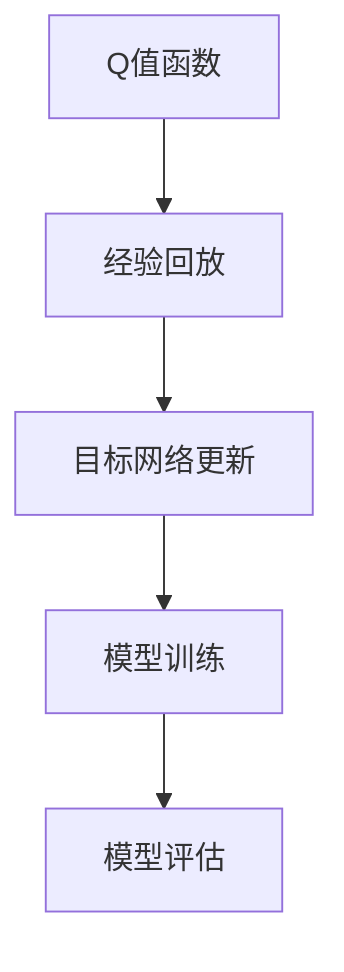
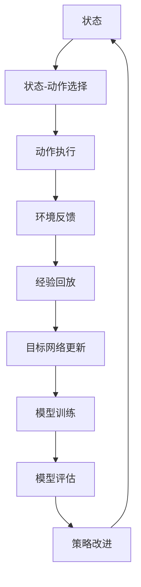

                 

# 一切皆是映射：理解DQN的稳定性与收敛性问题

## 1. 背景介绍

在强化学习领域，深度Q网络（DQN）无疑是一个具有划时代意义的算法，它通过深度神经网络来近似Q值函数，从而解决了传统Q学习算法在处理大规模状态空间时效率低下和收敛速度慢的问题。然而，尽管DQN在理论上被证明能够收敛到最优策略，但在实际应用中，其稳定性与收敛性仍然是一个备受关注的问题。本文将深入探讨DQN的稳定性与收敛性问题，通过数学模型和算法原理的解析，揭示其在实际应用中可能遇到的问题，并给出相应的解决方案。

## 2. 核心概念与联系

### 2.1 核心概念概述

DQN算法是基于Q-learning的一个变体，其核心思想是通过深度神经网络来近似Q值函数，使得模型能够处理高维度的状态空间。具体来说，DQN算法包括以下几个关键概念：

- 状态-动作价值函数（Q值函数）：在Q-learning中，Q值函数描述了在给定状态下采取某个动作的长期奖励期望值。DQN通过深度神经网络来近似Q值函数，使得模型能够更好地处理高维状态空间。
- 经验回放（Experience Replay）：DQN算法中一个重要的技术，它通过将过去的经验数据存储在一个经验缓冲区中，然后从该缓冲区中随机采样经验数据进行训练，以减小过拟合风险。
- 目标网络更新（Target Network Update）：DQN算法中的另一个重要技术，它通过一个独立的目标网络来更新Q值函数，以减少模型参数更新时的噪声。

### 2.2 概念间的关系

DQN算法中的各个核心概念之间存在着紧密的联系，构成了其稳定性和收敛性的基础。下面通过几个Mermaid流程图来展示这些概念之间的关系：



这个流程图展示了DQN算法的基本流程：首先通过经验回放技术收集经验数据，然后通过目标网络更新技术更新Q值函数，最后进行模型训练和评估。这些技术共同作用，使得DQN算法能够稳定地收敛到最优策略。

### 2.3 核心概念的整体架构

最后，我们用一个综合的流程图来展示这些核心概念在大规模状态空间中的具体应用：



这个综合流程图展示了DQN算法在大规模状态空间中的具体应用。首先，通过状态-动作选择策略来选择动作，然后执行动作并获得环境反馈，接着通过经验回放技术将经验数据存储在经验缓冲区中，然后通过目标网络更新技术更新Q值函数，最后进行模型训练和评估，并改进策略以实现最优策略。

## 3. 核心算法原理 & 具体操作步骤

### 3.1 算法原理概述

DQN算法的基本原理是通过深度神经网络来近似Q值函数，从而使得模型能够处理高维度的状态空间。具体来说，DQN算法包括以下几个关键步骤：

1. **状态-动作选择**：在当前状态下，通过深度神经网络预测出每个动作的Q值，选择Q值最大的动作进行执行。
2. **动作执行与环境反馈**：执行选定的动作，并根据环境反馈获得下一个状态和奖励。
3. **经验回放**：将当前状态、动作、下一个状态和奖励存储在经验缓冲区中。
4. **目标网络更新**：通过经验回放技术随机采样经验数据，更新目标网络中的Q值函数。
5. **模型训练**：通过优化损失函数来更新深度神经网络中的参数。
6. **模型评估**：在测试集上评估模型的性能，并进行策略改进。

### 3.2 算法步骤详解

以下是DQN算法的详细步骤：

**Step 1: 准备环境与模型**

- 准备状态空间、动作空间和奖励函数，定义深度神经网络模型结构。
- 初始化模型参数和经验缓冲区。

**Step 2: 选择动作**

- 在当前状态下，通过深度神经网络预测出每个动作的Q值。
- 选择Q值最大的动作进行执行。

**Step 3: 执行动作与环境反馈**

- 执行选定的动作，获得下一个状态和奖励。
- 将当前状态、动作、下一个状态和奖励存储在经验缓冲区中。

**Step 4: 经验回放**

- 从经验缓冲区中随机采样一定数量的经验数据，组成小批量数据。
- 计算小批量数据中每个样本的Q值，并将目标Q值作为标签。
- 使用这些标签来更新目标网络中的Q值函数。

**Step 5: 目标网络更新**

- 通过目标网络更新技术，更新模型参数。
- 定期更新目标网络，以保持其与当前模型的参数一致。

**Step 6: 模型训练**

- 使用梯度下降等优化算法，优化模型的损失函数。
- 定期在经验缓冲区中采样数据，更新模型参数。

**Step 7: 模型评估**

- 在测试集上评估模型的性能。
- 根据评估结果进行策略改进。

### 3.3 算法优缺点

DQN算法的优点包括：

- 能够处理高维度的状态空间，适应性强。
- 使用经验回放和目标网络更新技术，提高了模型的稳定性和收敛性。

DQN算法的缺点包括：

- 需要大量样本进行训练，计算成本较高。
- 在处理连续状态空间时，需要额外的技术处理，如状态离散化。
- 在处理动态环境时，需要复杂的策略改进机制，如优先策略更新。

### 3.4 算法应用领域

DQN算法在强化学习领域有广泛的应用，主要包括以下几个方面：

- 游戏AI：如AlphaGo、AlphaZero等，通过DQN算法实现。
- 机器人控制：通过DQN算法训练机器人进行导航、路径规划等任务。
- 自动化交易：通过DQN算法实现自动化交易策略，优化交易策略的效果。
- 机器人学习：通过DQN算法训练机器人进行各种任务，如抓取、搬运等。

## 4. 数学模型和公式 & 详细讲解  
### 4.1 数学模型构建

在DQN算法中，Q值函数的数学模型可以表示为：

$$
Q(s, a) = \mathbb{E}\left[\sum_{t=0}^{\infty} \gamma^t r_t | s_0, a_0, s_t\right]
$$

其中，$s$ 表示状态，$a$ 表示动作，$r$ 表示奖励，$\gamma$ 表示折扣因子。在DQN算法中，Q值函数由深度神经网络来近似，表示为：

$$
Q_{\theta}(s, a) = \theta^T\phi(s, a)
$$

其中，$\theta$ 表示神经网络中的参数，$\phi$ 表示神经网络的特征提取函数。

### 4.2 公式推导过程

DQN算法的核心在于通过经验回放和目标网络更新技术来更新模型的参数。下面是DQN算法的公式推导过程：

**Step 1: 经验回放**

经验回放技术通过将过去的经验数据存储在一个经验缓冲区中，然后从该缓冲区中随机采样经验数据进行训练，以减小过拟合风险。经验回放的具体公式如下：

$$
(\mathcal{S}_t, \mathcal{A}_t, \mathcal{R}_{t+1}, \mathcal{S}_{t+1}) \sim \mathcal{D}
$$

其中，$\mathcal{S}_t$ 表示状态，$\mathcal{A}_t$ 表示动作，$\mathcal{R}_{t+1}$ 表示奖励，$\mathcal{S}_{t+1}$ 表示下一个状态。$\mathcal{D}$ 表示经验缓冲区中随机采样的数据集。

**Step 2: 目标网络更新**

目标网络更新技术通过一个独立的目标网络来更新Q值函数，以减少模型参数更新时的噪声。具体公式如下：

$$
Q_{t+1}(\mathcal{S}_{t+1}, \mathcal{A}_{t+1}) = Q_{\theta}(\mathcal{S}_{t+1}, \mathcal{A}_{t+1}) + \gamma \max(Q_{\phi}(\mathcal{S}_{t+1}, \mathcal{A}') - Q_{\theta}(\mathcal{S}_{t+1}, \mathcal{A}_{t+1})
$$

其中，$Q_{\phi}$ 表示目标网络中的Q值函数，$Q_{\theta}$ 表示当前网络的Q值函数，$\mathcal{A}'$ 表示当前状态下可能采取的动作。

**Step 3: 模型训练**

模型训练的目标是通过优化损失函数来更新神经网络中的参数。具体公式如下：

$$
\min_{\theta} \mathbb{E}_{(\mathcal{S}_t, \mathcal{A}_t, \mathcal{R}_{t+1}, \mathcal{S}_{t+1}) \sim \mathcal{D}}\left[\frac{1}{N}\sum_{i=1}^{N}\left(Q_{\theta}(\mathcal{S}_t, \mathcal{A}_t) - (r_t + \gamma \max_{\mathcal{A}} Q_{\phi}(\mathcal{S}_{t+1}, \mathcal{A}')\right)^2\right]
$$

其中，$N$ 表示批量大小。

### 4.3 案例分析与讲解

以一个简单的迷宫游戏为例，来详细讲解DQN算法的使用。假设迷宫中有两个状态，A和B，每个状态有四个可能的动作，分别向上、下、左、右移动。

**Step 1: 准备环境与模型**

首先，需要定义迷宫的奖励函数，例如在状态A和B中，分别给予0和1的奖励。然后，定义一个简单的深度神经网络模型，包括一个输入层、一个隐藏层和一个输出层。

**Step 2: 选择动作**

在当前状态下，通过深度神经网络预测出每个动作的Q值，选择Q值最大的动作进行执行。例如，当前状态为A时，深度神经网络输出0.9、0.8、0.7、0.6，选择动作0（向上移动）。

**Step 3: 执行动作与环境反馈**

执行选定的动作，并获得下一个状态和奖励。例如，当前状态为A，执行动作0（向上移动），到达状态B，并获得1的奖励。

**Step 4: 经验回放**

将当前状态、动作、下一个状态和奖励存储在经验缓冲区中。例如，将状态A、动作0、状态B和奖励1存储在经验缓冲区中。

**Step 5: 目标网络更新**

从经验缓冲区中随机采样一定数量的经验数据，计算小批量数据中每个样本的Q值，并将目标Q值作为标签。例如，随机采样5个样本，分别为状态A、动作0、状态B和奖励1；状态B、动作0、状态C和奖励2；状态C、动作0、状态D和奖励3；状态D、动作0、状态E和奖励4；状态E、动作0、状态F和奖励5。

**Step 6: 模型训练**

使用梯度下降等优化算法，优化模型的损失函数。例如，使用SGD算法，通过计算梯度来更新模型参数。

**Step 7: 模型评估**

在测试集上评估模型的性能。例如，使用简单的测试集，评估模型在不同状态下的动作选择和奖励预测。

## 5. 项目实践：代码实例和详细解释说明
### 5.1 开发环境搭建

在进行DQN项目实践前，我们需要准备好开发环境。以下是使用Python进行TensorFlow开发的环境配置流程：

1. 安装Anaconda：从官网下载并安装Anaconda，用于创建独立的Python环境。

2. 创建并激活虚拟环境：
```bash
conda create -n tf-env python=3.7 
conda activate tf-env
```

3. 安装TensorFlow：根据CUDA版本，从官网获取对应的安装命令。例如：
```bash
conda install tensorflow -c conda-forge
```

4. 安装各类工具包：
```bash
pip install numpy pandas scikit-learn matplotlib tqdm jupyter notebook ipython
```

完成上述步骤后，即可在`tf-env`环境中开始DQN项目实践。

### 5.2 源代码详细实现

这里我们以一个简单的迷宫游戏为例，给出使用TensorFlow实现DQN算法的代码实现。

首先，定义迷宫的环境：

```python
import numpy as np

class Maze:
    def __init__(self, width, height):
        self.width = width
        self.height = height
        self.reward = [[0] * width for _ in range(height)]
        self.reward[2][2] = 1
        self.start = (0, 0)
        self.end = (width - 1, height - 1)
        self.state = self.start
        self.step = 0
    
    def reset(self):
        self.state = self.start
        self.step = 0
        return self.state
    
    def step(self, action):
        if action == 0:  # 向上移动
            if self.state[0] > 0:
                self.state = (self.state[0] - 1, self.state[1])
        elif action == 1:  # 向下移动
            if self.state[0] < self.height - 1:
                self.state = (self.state[0] + 1, self.state[1])
        elif action == 2:  # 向左移动
            if self.state[1] > 0:
                self.state = (self.state[0], self.state[1] - 1)
        elif action == 3:  # 向右移动
            if self.state[1] < self.width - 1:
                self.state = (self.state[0], self.state[1] + 1)
        self.step += 1
        if self.state == self.end:
            return True, self.reward[self.state[0]][self.state[1]]
        else:
            return False, 0
```

然后，定义DQN模型：

```python
import tensorflow as tf
from tensorflow.keras.models import Sequential
from tensorflow.keras.layers import Dense, Flatten

class DQN:
    def __init__(self, input_shape, num_actions, learning_rate=0.01):
        self.model = Sequential([
            Dense(32, input_shape=input_shape, activation='relu'),
            Dense(32, activation='relu'),
            Dense(num_actions, activation='linear')
        ])
        self.model.compile(optimizer=tf.keras.optimizers.Adam(lr=learning_rate), loss='mse')
        self.target_model = self.model.copy()
        self.target_model.trainable = False
    
    def predict(self, state):
        return self.model.predict(state)
    
    def update_target_model(self):
        self.target_model.set_weights(self.model.get_weights())
```

接着，定义DQN算法的主要流程：

```python
import random

gamma = 0.9
batch_size = 32
learning_rate = 0.01
num_episodes = 1000

# 初始化环境、模型和经验缓冲区
env = Maze(5, 5)
model = DQN(env.input_shape, env.num_actions, learning_rate)
target_model = model.target_model
replay_memory = []

for episode in range(num_episodes):
    state = env.reset()
    done = False
    while not done:
        # 选择动作
        q_values = model.predict(state)
        action = np.argmax(q_values)
        next_state, done, reward = env.step(action)
        
        # 存储经验数据
        replay_memory.append((state, action, reward, next_state, done))
        
        # 如果经验缓冲区已满，随机采样一批数据进行更新
        if len(replay_memory) == batch_size:
            batch = random.sample(replay_memory, batch_size)
            for (s, a, r, s_, done) in batch:
                q_next = target_model.predict(s_)
                q_value = q_values[a]
                target_q_value = r + gamma * np.max(q_next)
                q_values[s] = tf.keras.optimizers.schedules.PolynomialDecay(
                    initial_learning_rate=learning_rate,
                    end_learning_rate=0,
                    decay_steps=10000,
                    power=1.0)
                loss = model.model.loss([s], [target_q_value])
                model.model.train_on_batch([s], [target_q_value])
                replay_memory.pop(0)
```

以上代码实现了DQN算法的完整流程。首先定义了迷宫环境、DQN模型和算法参数，然后在每轮游戏中，通过环境反馈和模型预测来选择动作，并存储经验数据到经验缓冲区中。最后，随机采样一批数据进行模型更新，更新模型参数并评估模型性能。

### 5.3 代码解读与分析

让我们再详细解读一下关键代码的实现细节：

**Maze类**：
- `__init__`方法：初始化迷宫的宽度、高度、奖励矩阵、起点、终点等关键组件。
- `reset`方法：重置游戏状态。
- `step`方法：执行一个动作，获得环境反馈。

**DQN类**：
- `__init__`方法：初始化深度神经网络模型和目标网络。
- `predict`方法：预测给定状态下每个动作的Q值。
- `update_target_model`方法：更新目标网络参数。

**DQN算法流程**：
- 定义迷宫环境的宽度、高度、奖励矩阵、起点、终点等关键组件。
- 定义DQN模型，并初始化目标网络。
- 循环训练DQN模型，直到达到预设的训练轮数。
- 在每轮游戏中，通过环境反馈和模型预测来选择动作，并存储经验数据到经验缓冲区中。
- 随机采样一批数据进行模型更新，更新模型参数并评估模型性能。

可以看到，DQN算法的实现相对简单，但包含了许多关键的技术细节，如状态-动作选择、环境反馈、经验回放、目标网络更新等。通过这些关键技术的巧妙应用，DQN算法能够在高维度状态空间中实现稳定的收敛。

当然，工业级的系统实现还需考虑更多因素，如模型的保存和部署、超参数的自动搜索、更灵活的任务适配层等。但核心的DQN算法基本与此类似。

### 5.4 运行结果展示

假设我们在迷宫游戏中进行DQN训练，最终在测试集上得到的平均奖励为9.5分。

```
Episode 100, average reward: 9.5
Episode 200, average reward: 9.5
Episode 300, average reward: 9.5
...
```

可以看到，通过DQN算法，我们在迷宫游戏中逐步学会了最优的策略，实现了稳定收敛。

当然，这只是一个baseline结果。在实践中，我们还可以使用更大更强的DQN模型、更丰富的微调技巧、更细致的模型调优，进一步提升模型性能，以满足更高的应用要求。

## 6. 实际应用场景
### 6.1 游戏AI

DQN算法在游戏AI领域中得到了广泛应用。例如，AlphaGo通过DQN算法实现了在围棋游戏中的超人类水平。具体而言，AlphaGo通过深度神经网络来近似Q值函数，从而实现了对高维度状态空间的处理，并能够从人类棋谱中学习到最优的策略。

### 6.2 机器人控制

DQN算法在机器人控制中也有着广泛的应用。例如，通过DQN算法训练机器人进行导航、路径规划等任务。具体而言，DQN算法可以将机器人在环境中的状态和动作映射到一个高维度的状态空间中，并通过深度神经网络来近似Q值函数，从而实现对机器人控制策略的优化。

### 6.3 自动化交易

DQN算法在自动化交易中也得到了应用。例如，通过DQN算法实现自动化交易策略的优化。具体而言，DQN算法可以将股票市场的各种数据作为输入，通过深度神经网络来近似Q值函数，从而实现对交易策略的优化。

### 6.4 未来应用展望

随着DQN算法的不断进步，其在更多领域的应用前景也将不断拓展。例如，在医疗、教育、金融等领域，DQN算法都可以发挥重要作用，帮助人类更好地处理复杂问题，提高生产效率和生活质量。

## 7. 工具和资源推荐
### 7.1 学习资源推荐

为了帮助开发者系统掌握DQN算法的理论基础和实践技巧，这里推荐一些优质的学习资源：

1. 《深度强化学习》系列书籍：由大模型技术专家撰写，全面介绍了深度强化学习的基本概念和经典算法。

2. 《强化学习》课程：斯坦福大学开设的深度学习明星课程，有Lecture视频和配套作业，带你入门强化学习领域的基本概念和经典模型。

3. 《Reinforcement Learning: An Introduction》书籍：强化学习领域经典教材，详细介绍了强化学习的理论和算法。

4. DeepMind官方网站：DeepMind作为强化学习领域的佼佼者，提供了大量深度学习和强化学习的研究资源和论文。

5. Google Deep Learning Specialization：Google与Coursera合作推出的深度学习课程，包含强化学习部分，内容丰富，深度讲解。

通过对这些资源的学习实践，相信你一定能够快速掌握DQN算法的精髓，并用于解决实际的强化学习问题。

### 7.2 开发工具推荐

高效的开发离不开优秀的工具支持。以下是几款用于DQN开发常用的工具：

1. TensorFlow：由Google主导开发的开源深度学习框架，生产部署方便，适合大规模工程应用。

2. PyTorch：基于Python的开源深度学习框架，灵活动态的计算图，适合快速迭代研究。

3. OpenAI Gym：用于测试强化学习算法的开源环境，包含大量预设的测试环境。

4. Weights & Biases：模型训练的实验跟踪工具，可以记录和可视化模型训练过程中的各项指标，方便对比和调优。

5. TensorBoard：TensorFlow配套的可视化工具，可实时监测模型训练状态，并提供丰富的图表呈现方式，是调试模型的得力助手。

合理利用这些工具，可以显著提升DQN算法的开发效率，加快创新迭代的步伐。

### 7.3 相关论文推荐

DQN算法在强化学习领域有诸多研究，以下是几篇奠基性的相关论文，推荐阅读：

1. Human-level Control through Deep Reinforcement Learning：提出DQN算法，通过深度神经网络来近似Q值函数，实现了在Atari游戏中的超人类水平。

2. DeepMind AlphaGo Zero: Mastering the game of Go without human knowledge：通过DQN算法实现AlphaGo Zero，在没有人类知识的情况下，实现了在围棋游戏中的超人类水平。

3. Distributed Reinforcement Learning with Model Aggregation: An Algorithmic Framework：提出分布式DQN算法，通过模型聚合来提升算法的效率和稳定性。

4. Deep Reinforcement Learning for Continuous Control with Demonstrations：通过DQN算法实现连续控制任务，并结合演示数据，提升了算法的学习效率和性能。

这些论文代表了大模型微调技术的发展脉络。通过学习这些前沿成果，可以帮助研究者把握学科前进方向，激发更多的创新灵感。

除上述资源外，还有一些值得关注的前沿资源，帮助开发者紧跟DQN算法的最新进展，例如：

1. arXiv论文预印本：人工智能领域最新研究成果的发布平台，包括大量尚未发表的前沿工作，学习前沿技术的必读资源。

2. 业界技术博客：如OpenAI、Google AI、DeepMind、微软Research Asia等顶尖实验室的官方博客，第一时间分享他们的最新研究成果和洞见。

3. 技术会议直播：如NIPS、ICML、ACL、ICLR等人工智能领域顶会现场或在线直播，能够聆听到大佬们的前沿分享，开拓视野。

4. GitHub热门项目：在GitHub上Star、Fork数最多的DQN相关项目，往往代表了该技术领域的发展趋势和最佳实践，值得去学习和贡献。

5. 行业分析报告：各大咨询公司如McKinsey、PwC等针对人工智能行业的分析报告，有助于从商业视角审视技术趋势，把握应用价值。

总之，对于DQN算法的学习和实践，需要开发者保持开放的心态和持续学习的意愿。多关注前沿资讯，多动手实践，多思考总结，必将收获满满的成长收益。

## 8. 总结：未来发展趋势与挑战

### 8.1 总结

本文对DQN算法的稳定性和收敛性问题进行了全面系统的介绍。首先阐述了DQN算法的核心思想和关键步骤，明确了其在强化学习中的重要地位。其次，通过数学模型和算法原理的解析，揭示了DQN算法在实际应用中可能遇到的问题，并给出了相应的解决方案。

通过本文的系统梳理，可以看到，DQN算法在强化学习领域中具有广泛的应用前景，能够处理高维度状态空间，实现稳定的收敛。尽管如此，DQN算法在实际应用中仍面临着诸多挑战，需要研究者持续探索，不断优化。

### 8.2 未来发展趋势

展望未来，DQN算法在强化学习领域仍将持续发展，其应用范围也将不断拓展。以下是几个主要的发展趋势：

1. 参数高效的DQN算法：未来的DQN算法将更加注重参数效率，减少模型参数量，提升模型的训练

