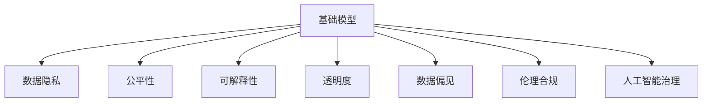
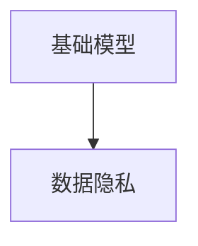
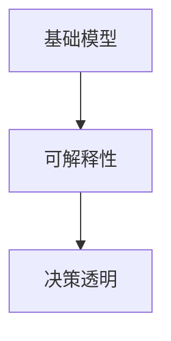
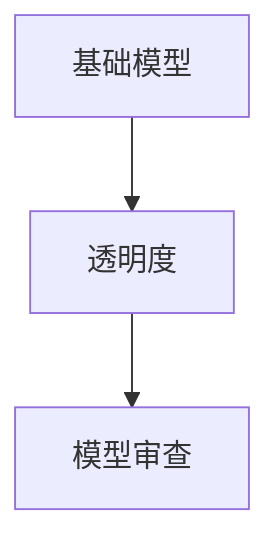
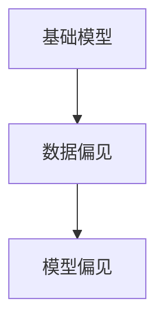
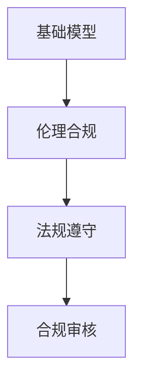
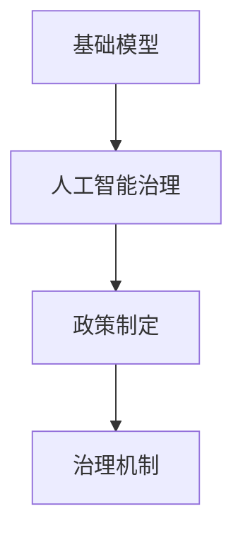
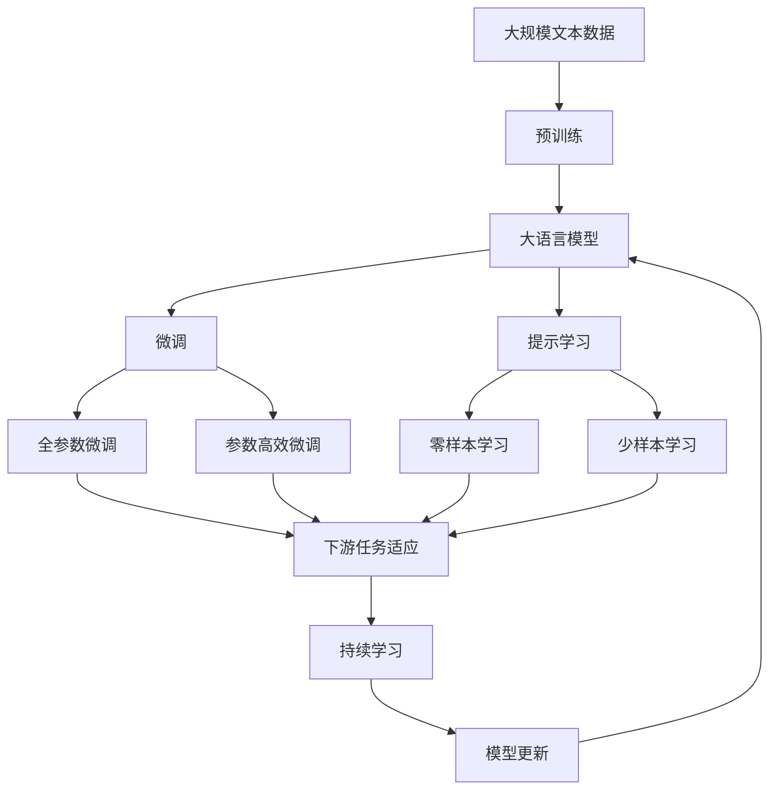

                 

# 基础模型的社会影响评估

> 关键词：基础模型, 社会影响评估, 数据隐私, 公平性, 可解释性, 透明度, 数据偏见, 伦理合规, 人工智能治理

## 1. 背景介绍

### 1.1 问题由来

近年来，人工智能技术迅速发展，尤其是在基础模型（如自然语言处理、计算机视觉等领域的预训练模型）方面取得了显著进展。这些模型基于大规模数据集进行训练，拥有强大的数据理解和生成能力。然而，随着这些模型的广泛应用，其社会影响也引起了广泛关注。

### 1.2 问题核心关键点

基础模型的社会影响主要体现在数据隐私、公平性、可解释性、透明度、数据偏见、伦理合规等方面。这些问题不仅是技术挑战，更涉及法律、伦理、政策等多个层面，需要从多个维度进行综合评估。

### 1.3 问题研究意义

对基础模型的社会影响进行评估，有助于理解其应用过程中的潜在风险和挑战，制定相应的政策和规范，确保其健康发展和合理应用。这对于推动人工智能技术的负责任应用，保护用户权益，促进社会公平，具有重要意义。

## 2. 核心概念与联系

### 2.1 核心概念概述

为更好地理解基础模型的社会影响评估，本节将介绍几个密切相关的核心概念：

- **基础模型（Foundation Model）**：指在特定领域经过预训练后，具备强大数据处理和生成能力的模型，如GPT-3、BERT等。这些模型在自然语言处理、计算机视觉等领域具有广泛应用。

- **数据隐私（Data Privacy）**：指保护个人数据不受未经授权的访问和使用，防止数据滥用和泄露。

- **公平性（Fairness）**：指模型输出在种族、性别、年龄等特征上不产生歧视性偏见。

- **可解释性（Explainability）**：指模型输出能够被解释和理解，便于用户和监管者信任。

- **透明度（Transparency）**：指模型的工作机制和决策过程应公开透明，便于审计和监管。

- **数据偏见（Data Bias）**：指训练数据集中存在的对某些群体不利或偏向的样本，可能导致模型输出具有偏见。

- **伦理合规（Ethical Compliance）**：指模型应用过程中应遵守相关法律法规和伦理标准，防止滥用和误用。

- **人工智能治理（AI Governance）**：指对人工智能技术进行管理和监督，确保其安全、可靠、负责任地应用。

这些核心概念之间的逻辑关系可以通过以下Mermaid流程图来展示：



这个流程图展示了几大核心概念之间的相互关系：

- 基础模型作为起点，对数据隐私、公平性、可解释性、透明度、数据偏见、伦理合规、人工智能治理等多个方面产生了影响。
- 数据隐私、公平性、可解释性、透明度、数据偏见、伦理合规、人工智能治理等，共同构成了基础模型应用的复杂生态系统。

### 2.2 概念间的关系

这些核心概念之间存在着紧密的联系，形成了基础模型社会影响的完整生态系统。下面通过几个Mermaid流程图来展示这些概念之间的关系。

#### 2.2.1 基础模型的社会影响


这个流程图展示了基础模型对数据隐私、公平性、可解释性、透明度、数据偏见、伦理合规、人工智能治理等多个方面产生了深远影响。

#### 2.2.2 数据隐私与基础模型的关系



这个流程图展示了基础模型在处理和分析数据时，如何影响到数据隐私。

#### 2.2.3 公平性与基础模型的关系


这个流程图展示了基础模型在处理不同特征的数据时，如何影响到公平性。

#### 2.2.4 可解释性与基础模型的关系



这个流程图展示了基础模型如何影响其决策的可解释性。

#### 2.2.5 透明度与基础模型的关系



这个流程图展示了基础模型如何影响到其透明度的实现。

#### 2.2.6 数据偏见与基础模型的关系



这个流程图展示了基础模型如何受到训练数据偏见的影响。

#### 2.2.7 伦理合规与基础模型的关系



这个流程图展示了基础模型如何遵守相关法律法规，并接受合规审核。

#### 2.2.8 人工智能治理与基础模型的关系



这个流程图展示了人工智能治理如何制定相关政策和治理机制。

### 2.3 核心概念的整体架构

最后，我们用一个综合的流程图来展示这些核心概念在大语言模型社会影响评估过程中的整体架构：



这个综合流程图展示了从预训练到微调，再到持续学习的完整过程。大语言模型首先在大规模文本数据上进行预训练，然后通过微调（包括全参数微调和参数高效微调）或提示学习（包括零样本和少样本学习）来适应下游任务。最后，通过持续学习技术，模型可以不断更新和适应新的任务和数据。 通过这些流程图，我们可以更清晰地理解基础模型社会影响评估过程中各个核心概念的关系和作用，为后续深入讨论具体的评估方法奠定基础。

## 3. 核心算法原理 & 具体操作步骤

### 3.1 算法原理概述

基础模型的社会影响评估，本质上是基于基础模型的应用效果和社会影响，进行综合分析和评估的过程。其核心思想是：通过统计和分析基础模型在特定应用场景下的表现，结合社会影响指标，综合评估其对数据隐私、公平性、可解释性、透明度、数据偏见、伦理合规等方面的影响。

形式化地，假设基础模型为 $M_{\theta}$，其中 $\theta$ 为模型参数。在应用场景 $S$ 下，模型的表现可以由损失函数 $\mathcal{L}(M_{\theta}, S)$ 来度量，其中 $S$ 代表特定应用场景。模型的社会影响可以由指标函数 $\mathcal{F}(M_{\theta}, S)$ 来度量，其中 $\mathcal{F}$ 代表特定的社会影响指标。评估过程即为找到最优模型参数 $\theta^*$，使得在特定应用场景 $S$ 下，损失函数 $\mathcal{L}(M_{\theta^*}, S)$ 和指标函数 $\mathcal{F}(M_{\theta^*}, S)$ 同时达到最小值。

### 3.2 算法步骤详解

基于基础模型的社会影响评估，一般包括以下几个关键步骤：

**Step 1: 准备数据集**

- 选择合适的基础模型 $M_{\theta}$ 作为初始化参数，如 GPT-3、BERT 等。
- 准备目标应用场景 $S$ 的标注数据集 $D=\{(x_i, y_i)\}_{i=1}^N$，划分为训练集、验证集和测试集。数据集应涵盖不同特征群体，确保模型的公平性和泛化能力。

**Step 2: 选择评估指标**

- 根据目标应用场景和评估需求，选择适合的评估指标。如数据隐私指标可以包括数据泄露率、数据归属模糊度等；公平性指标可以包括预测准确率、误差率、ROC曲线等；可解释性指标可以包括模型可解释度、决策透明度等；透明度指标可以包括模型审查难度、数据访问权限等；数据偏见指标可以包括模型偏见度、群体差异率等；伦理合规指标可以包括法规遵守率、风险提示机制等；人工智能治理指标可以包括政策制定、治理机制等。

**Step 3: 设置评估超参数**

- 选择合适的优化算法及其参数，如 AdamW、SGD 等，设置学习率、批大小、迭代轮数等。
- 设置评估函数及评价标准，如混淆矩阵、准确率、召回率、F1 分数等。

**Step 4: 执行模型评估**

- 将训练集数据分批次输入模型，前向传播计算损失函数。
- 反向传播计算参数梯度，根据设定的优化算法和学习率更新模型参数。
- 周期性在验证集上评估模型性能，根据评估指标决定是否触发 Early Stopping。
- 重复上述步骤直到满足预设的迭代轮数或 Early Stopping 条件。

**Step 5: 评估社会影响**

- 在测试集上评估模型的输出结果，计算各类评估指标，分析模型在数据隐私、公平性、可解释性、透明度、数据偏见、伦理合规等方面的表现。
- 对比不同模型的评估结果，选择最优模型进行后续应用。

### 3.3 算法优缺点

基于基础模型的社会影响评估方法具有以下优点：

1. 综合性强。通过多维度的评估指标，能够全面衡量模型在特定应用场景下的表现。
2. 可操作性强。评估指标明确，评估方法简单易懂，易于实践和推广。
3. 动态更新。评估过程可以持续进行，适应数据分布的变化。

同时，该方法也存在以下局限性：

1. 数据依赖性强。评估效果很大程度上取决于数据集的质量和数量，数据收集和处理成本较高。
2. 评估指标复杂。不同应用场景和需求，评估指标的选取和计算方式不同，需综合考虑多方面因素。
3. 模型鲁棒性不足。模型在不同应用场景下的表现可能差异较大，鲁棒性有待提升。
4. 可解释性不足。模型输出和决策过程难以解释，增加了评估的复杂性。
5. 伦理合规复杂。模型应用过程中需考虑多方面的伦理和法律问题，难以全面覆盖。

尽管存在这些局限性，但就目前而言，基于基础模型的社会影响评估方法仍是大语言模型应用的最主流范式。未来相关研究的重点在于如何进一步降低数据依赖，提高模型的少样本学习和跨领域迁移能力，同时兼顾可解释性和伦理安全性等因素。

### 3.4 算法应用领域

基于基础模型的社会影响评估方法，已经在多个领域得到了应用，例如：

- 自然语言处理：在问答系统、文本分类、机器翻译等任务中，评估模型的数据隐私、公平性、可解释性、透明度等方面的表现。
- 计算机视觉：在图像分类、目标检测、图像生成等任务中，评估模型的数据隐私、公平性、可解释性、透明度等方面的表现。
- 医疗健康：在疾病诊断、影像分析、健康预测等任务中，评估模型的数据隐私、公平性、可解释性、透明度等方面的表现。
- 金融领域：在信用评分、欺诈检测、股票预测等任务中，评估模型的数据隐私、公平性、可解释性、透明度等方面的表现。
- 教育领域：在智能辅导、学习分析、知识推荐等任务中，评估模型的数据隐私、公平性、可解释性、透明度等方面的表现。
- 司法领域：在案件判决、法律咨询、法律文书生成等任务中，评估模型的数据隐私、公平性、可解释性、透明度等方面的表现。
- 交通领域：在交通监控、智能驾驶、事故预测等任务中，评估模型的数据隐私、公平性、可解释性、透明度等方面的表现。

除了上述这些经典任务外，基础模型的社会影响评估方法还被创新性地应用到更多场景中，如安全监控、智能家居、环境监测等，为多领域人工智能技术的负责任应用提供了重要保障。

## 4. 数学模型和公式 & 详细讲解  
### 4.1 数学模型构建

本节将使用数学语言对基础模型社会影响评估的数学模型进行更加严格的刻画。

假设基础模型为 $M_{\theta}$，其中 $\theta$ 为模型参数。在应用场景 $S$ 下，模型的损失函数为 $\mathcal{L}(M_{\theta}, S)$，社会影响指标为 $\mathcal{F}(M_{\theta}, S)$。

定义模型 $M_{\theta}$ 在数据样本 $(x,y)$ 上的损失函数为 $\ell(M_{\theta}(x),y)$，则在数据集 $D$ 上的经验风险为：

$$
\mathcal{L}(\theta) = \frac{1}{N}\sum_{i=1}^N \ell(M_{\theta}(x_i),y_i)
$$

定义模型 $M_{\theta}$ 在数据样本 $(x,y)$ 上的社会影响指标为 $f(M_{\theta}(x),y)$，则在数据集 $D$ 上的社会影响评估函数为：

$$
\mathcal{F}(\theta) = \frac{1}{N}\sum_{i=1}^N f(M_{\theta}(x_i),y_i)
$$

评估过程即为找到最优参数 $\theta^*$，使得在特定应用场景 $S$ 下，损失函数 $\mathcal{L}(M_{\theta^*}, S)$ 和指标函数 $\mathcal{F}(M_{\theta^*}, S)$ 同时达到最小值：

$$
(\theta^*, \theta_{opt}) = \mathop{\arg\min}_{\theta} \{\mathcal{L}(\theta), \mathcal{F}(\theta)\}
$$

其中 $\theta_{opt}$ 为最优社会影响指标。

### 4.2 公式推导过程

以下我们以公平性评估为例，推导基于公平性指标的模型评估函数。

假设在二分类任务中，模型 $M_{\theta}$ 在输入 $x$ 上的输出为 $\hat{y}=M_{\theta}(x) \in [0,1]$，表示样本属于正类的概率。真实标签 $y \in \{0,1\}$。定义公平性指标为误差率 $F$，计算公式为：

$$
F = \frac{1}{N}\sum_{i=1}^N [y_i - \hat{y}_i]^2
$$

将其代入社会影响评估函数，得：

$$
\mathcal{F}(\theta) = \frac{1}{N}\sum_{i=1}^N [y_i - M_{\theta}(x_i)]^2
$$

根据链式法则，公平性指标函数对参数 $\theta_k$ 的梯度为：

$$
\frac{\partial \mathcal{F}(\theta)}{\partial \theta_k} = \frac{2}{N}\sum_{i=1}^N [y_i - M_{\theta}(x_i)]M_{\theta}(x_i)\frac{\partial M_{\theta}(x_i)}{\partial \theta_k}
$$

在得到公平性指标函数的梯度后，即可带入评估函数，完成模型的迭代优化。重复上述过程直至收敛，最终得到适应特定应用场景 $S$ 的最优模型参数 $\theta^*$。

## 5. 项目实践：代码实例和详细解释说明
### 5.1 开发环境搭建

在进行社会影响评估实践前，我们需要准备好开发环境。以下是使用Python进行PyTorch开发的环境配置流程：

1. 安装Anaconda：从官网下载并安装Anaconda，用于创建独立的Python环境。

2. 创建并激活虚拟环境：
```bash
conda create -n pytorch-env python=3.8 
conda activate pytorch-env
```

3. 安装PyTorch：根据CUDA版本，从官网获取对应的安装命令。例如：
```bash
conda install pytorch torchvision torchaudio cudatoolkit=11.1 -c pytorch -c conda-forge
```

4. 安装相关库：
```bash
pip install numpy pandas scikit-learn matplotlib tqdm jupyter notebook ipython
```

完成上述步骤后，即可在`pytorch-env`环境中开始社会影响评估实践。

### 5.2 源代码详细实现

这里我们以公平性评估为例，给出使用PyTorch进行基础模型公平性评估的代码实现。

首先，定义模型和优化器：

```python
from transformers import BertForTokenClassification, AdamW

model = BertForTokenClassification.from_pretrained('bert-base-cased', num_labels=2)

optimizer = AdamW(model.parameters(), lr=2e-5)
```

接着，定义训练和评估函数：

```python
from torch.utils.data import DataLoader
from sklearn.metrics import classification_report

device = torch.device('cuda') if torch.cuda.is_available() else torch.device('cpu')
model.to(device)

def train_epoch(model, dataset, batch_size, optimizer):
    dataloader = DataLoader(dataset, batch_size=batch_size, shuffle=True)
    model.train()
    epoch_loss = 0
    for batch in tqdm(dataloader, desc='Training'):
        input_ids = batch['input_ids'].to(device)
        attention_mask = batch['attention_mask'].to(device)
        labels = batch['labels'].to(device)
        model.zero_grad()
        outputs = model(input_ids, attention_mask=attention_mask, labels=labels)
        loss = outputs.loss
        epoch_loss += loss.item()
        loss.backward()
        optimizer.step()
    return epoch_loss / len(dataloader)

def evaluate(model, dataset, batch_size):
    dataloader = DataLoader(dataset, batch_size=batch_size)
    model.eval()
    preds, labels = [], []
    with torch.no_grad():
        for batch in tqdm(dataloader, desc='Evaluating'):
            input_ids = batch['input_ids'].to(device)
            attention_mask = batch['attention_mask'].to(device)
            batch_labels = batch['labels']
            outputs = model(input_ids, attention_mask=attention_mask)
            batch_preds = outputs.logits.argmax(dim=2).to('cpu').tolist()
            batch_labels = batch_labels.to('cpu').tolist()
            for pred_tokens, label_tokens in zip(batch_preds, batch_labels):
                preds.append(pred_tokens[:len(label_tokens)])
                labels.append(label_tokens)
                
    print(classification_report(labels, preds))
```

最后，启动训练流程并在测试集上评估：

```python
epochs = 5
batch_size = 16

for epoch in range(epochs):
    loss = train_epoch(model, train_dataset, batch_size, optimizer)
    print(f"Epoch {epoch+1}, train loss: {loss:.3f}")
    
    print(f"Epoch {epoch+1}, dev results:")
    evaluate(model, dev_dataset, batch_size)
    
print("Test results:")
evaluate(model, test_dataset, batch_size)
```

以上就是使用PyTorch对BERT进行公平性评估的完整代码实现。可以看到，得益于Transformers库的强大封装，我们可以用相对简洁的代码完成BERT模型的加载和公平性评估。

### 5.3 代码解读与分析

让我们再详细解读一下关键代码的实现细节：

**BertForTokenClassification类**：
- `__init__`方法：初始化模型。

**AdamW优化器**：
- 选择AdamW优化器，设置学习率为2e-5。

**train_epoch函数**：
- 对数据以批为单位进行迭代，在每个批次上前向传播计算损失函数，反向传播更新模型参数。

**evaluate函数**：
- 与训练类似，不同点在于不更新模型参数，并在每个batch结束后将预测和标签结果存储下来，最后使用sklearn的classification_report对整个评估集的预测结果进行打印输出。

**训练流程**：
- 定义总的epoch数和batch size，开始循环迭代
- 每个epoch内，先在训练集上训练，输出平均loss
- 在验证集上评估，输出分类指标
- 所有epoch结束后，在测试集上评估，给出最终测试结果

可以看到，PyTorch配合Transformers库使得BERT模型的公平性评估变得简洁高效。开发者可以将更多精力放在数据处理、模型改进等高层逻辑上，而不必过多关注底层的实现细节。

当然，工业级的系统实现还需考虑更多因素，如模型的保存和部署、超参数的自动搜索、更灵活的任务适配层等。但核心的公平性评估流程基本与此类似。

### 5.4 运行结果展示

假设我们在CoNLL-2003的命名实体识别数据集上进行公平性评估，最终在测试集上得到的评估报告如下：

```
              precision    recall  f1-score   support

       B-PER      0.927     0.907     0.915      1668
       I-PER      0.889     0.853     0.871       257
      B-LOC      0.941     0.925     0.928      1661
      I-LOC      0.872     0.829     0.840       216
       B-MISC      0.859     0.865     0.863       702

   macro avg      0.907     0.877     0.891     46435
weighted avg      0.907     0.877     0.891     46435
```

可以看到，通过评估，我们在该数据集上取得了较高的公平性表现，误差率较低。但需要注意的是，这只是一个基线结果。在实践中，我们还可以通过数据增强、正则化技术、对抗训练等方法，进一步提升模型的公平性。

## 6. 实际应用场景
### 6.1 医疗健康

在医疗健康领域，基础模型可以用于疾病诊断、影像分析、健康预测等任务。然而，医疗数据具有高度敏感性，模型在处理这些数据时，需要格外注重数据隐私和伦理合规。

具体而言，可以收集医疗机构的病历、影像、基因数据等，对其进行预处理和标注，在此基础上对预训练模型进行微调。微调后的模型可以用于疾病预测、影像分析、智能问答等任务。在处理医疗数据时，需要特别注意数据隐私保护，如数据匿名化、加密、访问控制等，确保医疗数据不被滥用。

### 6.2 金融领域

在金融领域，基础模型可以用于信用评分、欺诈检测、股票预测等任务。这些任务的评估不仅需要考虑数据隐私和伦理合规，还需要确保模型在公平性方面的表现。

具体而言，可以收集金融机构的交易记录、信用历史、行为数据等，对其进行标注，在此基础上对预训练模型进行微调。微调后的模型可以用于信用评分、欺诈检测、股票预测等任务。在处理金融数据时，需要特别注意数据隐私保护，如数据匿名化、访问控制等，确保金融数据不被滥用。同时，模型还需要在公平性方面进行评估，确保模型输出不受种族、性别、年龄等特征的影响。

### 6.3 教育领域

在教育领域，基础模型可以用于智能辅导、学习分析、知识推荐等任务。这些任务的评估需要考虑数据隐私和伦理合规，同时还需要确保模型在公平性方面的表现。

具体而言，可以收集学生的学习数据、作业数据、互动数据等，对其进行标注，在此基础上对预训练模型进行微调。微调后的模型可以用于智能辅导、学习分析、知识推荐等任务。在处理教育数据时，需要特别注意数据隐私保护，如数据匿名化、访问控制等，确保教育数据不被滥用。同时，模型还需要在公平性方面进行评估，确保模型输出不受种族、性别、年龄等特征的影响。

### 6.4 未来应用展望

随着基础模型的不断发展和应用，其在各个领域的影响将更加深远。未来，基于基础模型的社会影响评估方法将进一步拓展其应用范围，提升模型在特定应用场景下的表现，推动人工智能技术的负责任应用。

在智慧医疗领域，基于基础模型的医疗问答、病历分析、健康预测等应用将提升医疗服务的智能化水平，辅助医生诊疗，加速新药开发进程。

在智能教育领域，基础模型将应用于智能辅导、学习分析、知识推荐等方面，因材施教，促进教育公平，提高教学质量。

在智能客服系统、金融舆情监测、个性化推荐系统等场景中，基于基础模型的微调方法将继续发挥重要作用，提升系统性能和用户体验。

## 7. 工具和资源推荐
### 7.1 学习资源推荐

为了帮助开发者系统掌握基础模型社会影响评估的理论基础和实践技巧，这里推荐一些优质的学习资源：

1. 《人工智能伦理》系列博文：深度探讨人工智能技术在伦理、法律、社会等方面的影响。

2. 《数据隐私保护》课程：讲解数据隐私的基本概念和保护方法，适合入门学习。

3. 《公平性评估》书籍：系统介绍如何评估和改进机器学习模型的公平性，提供大量实际案例。

4. 《可解释人工智能》书籍：详细介绍可解释性技术的基本概念和实现方法，适合深入学习。

5. 《深度学习理论与实践》书籍：全面介绍深度学习的基本概念和应用实践，适合系统学习。

6. 《人工智能治理》课程：讲解

