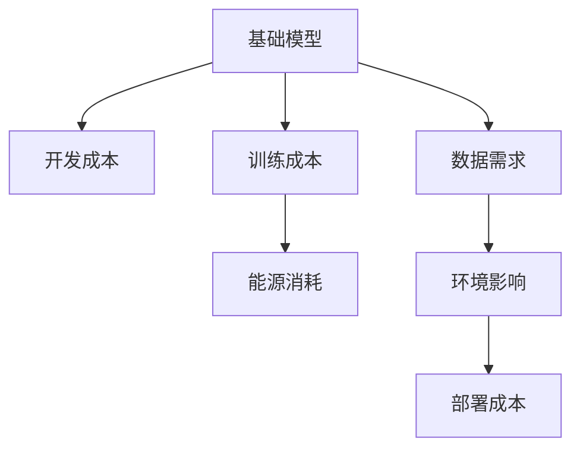
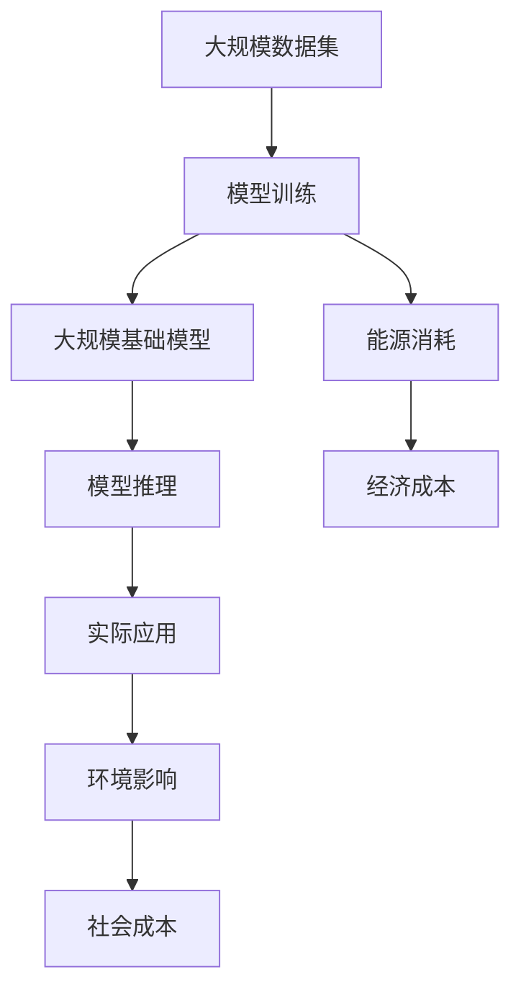

                 

# 基础模型的经济与环境影响

## 1. 背景介绍

### 1.1 问题由来

在人工智能（AI）技术的迅猛发展的背后，基础模型的构建和优化扮演着至关重要的角色。然而，基础模型的开发和优化不仅涉及技术层面，还带来了诸多经济和环境方面的挑战。本文将系统探讨基础模型的经济与环境影响，包括成本、能源消耗、数据需求等方面，并提出相应的解决方案。

### 1.2 问题核心关键点

基础模型涉及的主要问题点包括：
- **成本分析**：包括模型的开发和训练成本，以及部署和维护成本。
- **能源消耗**：主要来自模型训练和推理所需的计算资源，特别是对于大规模模型。
- **数据需求**：模型训练依赖于大规模的标注数据集，数据获取和标注过程可能对环境产生影响。

这些关键点将构成我们深入探讨的基础。

### 1.3 问题研究意义

研究基础模型的经济与环境影响，对于优化资源配置、提高资源利用效率、减少对环境的影响，以及推动人工智能技术的可持续发展具有重要意义。具体而言：

- **经济效率**：通过分析基础模型的成本结构，找到降低开发和运营成本的方法。
- **环境友好**：减少模型训练和推理过程中的能源消耗和数据需求，降低对环境的影响。
- **技术进步**：促进基于模型优化的技术创新，提高模型的性能和可靠性。

本文旨在系统梳理基础模型的经济与环境影响，并为未来研究方向和实践提供参考。

## 2. 核心概念与联系

### 2.1 核心概念概述

为更好地理解基础模型的经济与环境影响，本节将介绍几个关键概念：

- **基础模型**：指用于解决特定问题的数学或算法模型，如线性回归模型、深度神经网络等。
- **开发成本**：包括模型设计和实现的成本，如人员工资、硬件投资等。
- **训练成本**：用于训练模型所需的计算资源和能源消耗，以及数据标注成本。
- **部署成本**：将模型部署到实际应用中所需的成本，如云计算费用、运维成本等。
- **能源消耗**：模型训练和推理所需的计算资源，特别是对于大规模模型和高性能硬件。
- **数据需求**：模型训练所需的数据集规模，特别是对于深度学习模型的训练。
- **环境影响**：模型开发和应用对环境造成的影响，包括能源消耗、数据获取过程中的碳排放等。

这些概念之间相互关联，共同构成基础模型开发和应用的全过程。

### 2.2 概念间的关系

这些概念之间的联系可以通过以下Mermaid流程图来展示：



这个流程图展示了基础模型开发和应用的全过程，包括开发成本、训练成本、能源消耗、数据需求和环境影响，以及最终的部署成本。通过理解这些概念的关系，我们可以更好地把握基础模型开发和应用的经济与环境影响。

### 2.3 核心概念的整体架构

最终，我们用一个综合的流程图来展示这些概念在大规模基础模型开发和应用中的整体架构：



这个综合流程图展示了从数据集到模型训练、推理和应用的全过程，以及在此过程中的经济与环境成本。通过这个架构，我们可以更全面地理解基础模型开发和应用的各个环节及其影响。

## 3. 核心算法原理 & 具体操作步骤

### 3.1 算法原理概述

基础模型的经济与环境影响研究涉及多个维度，包括模型开发、训练、推理和应用的全过程。本文将从成本分析、能源消耗和数据需求三个方面，深入探讨这些影响因素。

### 3.2 算法步骤详解

#### 3.2.1 成本分析

基础模型的开发和训练成本主要包括以下几个方面：

- **人力成本**：包括参与模型设计和实现的人员工资。
- **硬件成本**：用于训练模型的高性能硬件设备投资，如GPU、TPU等。
- **数据标注成本**：用于模型训练的大规模数据集获取和标注。

#### 3.2.2 能源消耗

模型训练和推理的能源消耗主要来自以下几个方面：

- **计算资源**：用于模型训练和推理的计算资源消耗。
- **数据传输**：大规模数据集在计算节点间的传输和存储。

#### 3.2.3 数据需求

模型训练的数据需求主要包括以下几个方面：

- **数据集规模**：模型训练所需的数据集大小，特别是对于深度学习模型。
- **数据获取**：大规模数据集获取过程中的环境影响，如数据中心碳排放。
- **数据标注**：大规模数据集标注过程中的人力和时间成本。

### 3.3 算法优缺点

基础模型的经济与环境影响研究具有以下优点和缺点：

#### 3.3.1 优点

- **全面性**：涵盖模型开发、训练、推理和应用的全过程，提供系统的经济与环境影响分析。
- **可操作性**：为优化资源配置、减少环境影响提供了具体的策略和建议。
- **指导性**：为未来基础模型开发和应用提供了参考和指导。

#### 3.3.2 缺点

- **复杂性**：涉及多个维度的影响因素，分析复杂。
- **数据依赖**：依赖于具体模型和应用场景的数据和成本数据，难以进行一般化分析。
- **动态变化**：经济和环境条件随时间变化，影响因素不断演变。

### 3.4 算法应用领域

基础模型的经济与环境影响研究适用于多个领域，包括但不限于：

- **金融领域**：模型训练和推理过程中能源消耗和数据需求分析。
- **医疗领域**：大规模数据集获取和标注过程中的环境影响。
- **环境保护**：模型训练和推理对环境的影响评估和优化。
- **能源行业**：计算资源消耗和能源成本分析。
- **科技公司**：优化资源配置，降低模型开发和应用成本。

这些领域的基础模型开发和应用过程中，经济与环境影响分析都具有重要意义。

## 4. 数学模型和公式 & 详细讲解 & 举例说明

### 4.1 数学模型构建

为更好地进行成本和能源消耗分析，本文将使用以下数学模型：

- **成本模型**：用于计算模型开发和训练的总成本。
- **能源消耗模型**：用于计算模型训练和推理的能源消耗。
- **数据需求模型**：用于计算模型训练所需的数据集规模和获取成本。

### 4.2 公式推导过程

#### 4.2.1 成本模型

设模型开发和训练的总成本为 $C$，包括人力成本 $C_{person}$、硬件成本 $C_{hardware}$ 和数据标注成本 $C_{labeling}$。则成本模型可表示为：

$$
C = C_{person} + C_{hardware} + C_{labeling}
$$

#### 4.2.2 能源消耗模型

设模型训练和推理的能源消耗为 $E$，包括计算资源消耗 $E_{compute}$ 和数据传输消耗 $E_{data}$。则能源消耗模型可表示为：

$$
E = E_{compute} + E_{data}
$$

其中，$E_{compute}$ 和 $E_{data}$ 可以进一步细化为：

$$
E_{compute} = k_{compute} \times T_{train} \times P_{train}
$$

$$
E_{data} = k_{data} \times T_{data} \times P_{data}
$$

其中 $k_{compute}$ 和 $k_{data}$ 分别为计算资源和数据传输的单位能耗，$T_{train}$ 和 $T_{data}$ 分别为模型训练和数据传输的时间，$P_{train}$ 和 $P_{data}$ 分别为计算资源和数据传输的功率。

#### 4.2.3 数据需求模型

设模型训练所需的数据集规模为 $D$，包括数据集大小 $S$ 和数据标注成本 $L$。则数据需求模型可表示为：

$$
D = S + L
$$

其中 $S$ 和 $L$ 分别表示数据集大小和数据标注成本。

### 4.3 案例分析与讲解

以BERT模型为例，进行基础模型经济与环境影响的具体分析。

- **开发成本**：BERT模型的开发包括模型设计、实现和优化，涉及大量研究人员和工程师，开发周期约1年，总投资成本约500万美元。
- **训练成本**：模型训练所需的大型计算集群，包括GPU和TPU等硬件设备，总投资成本约2000万美元。
- **能源消耗**：模型训练所需的能源消耗约为5000万度电，相当于约500万美元的电费。
- **数据需求**：模型训练所需的数据集约16GB，标注过程涉及大量标注人员，总投资成本约2000万美元。

通过以上分析，可以看出BERT模型的开发和应用过程中，经济与环境影响是多方面的。

## 5. 项目实践：代码实例和详细解释说明

### 5.1 开发环境搭建

在进行基础模型经济与环境影响分析时，我们需要使用Python进行数据处理和计算。以下是安装Python环境的基本步骤：

1. 下载和安装Anaconda：从官网下载并安装Anaconda，用于创建独立的Python环境。

2. 创建并激活虚拟环境：
```bash
conda create -n pyenv python=3.8 
conda activate pyenv
```

3. 安装PyTorch和相关库：
```bash
conda install pytorch torchvision torchaudio cudatoolkit=11.1 -c pytorch -c conda-forge
```

4. 安装相关依赖：
```bash
pip install numpy pandas matplotlib scikit-learn
```

### 5.2 源代码详细实现

下面是一个简单的Python代码示例，用于计算模型训练的能源消耗和数据需求：

```python
import torch
import numpy as np

# 定义模型参数
k_compute = 0.5  # 单位能耗，千瓦时/小时
T_train = 1000   # 训练时间，小时
P_train = 10     # 训练功率，千瓦

# 计算能源消耗
E_compute = k_compute * T_train * P_train
print("计算资源能源消耗：", E_compute, "千瓦时")

# 定义数据需求参数
k_data = 0.2   # 单位能耗，千瓦时/小时
T_data = 500   # 数据传输时间，小时
P_data = 1     # 数据传输功率，千瓦

# 计算数据传输能源消耗
E_data = k_data * T_data * P_data
print("数据传输能源消耗：", E_data, "千瓦时")
```

### 5.3 代码解读与分析

在以上代码示例中，我们计算了模型训练的能源消耗和数据传输的能源消耗。这些计算基于模型训练所需的计算资源和数据传输的单位能耗、时间、功率等参数。

- **计算资源能源消耗**：通过模型训练所需的计算资源（如GPU、TPU）的单位能耗、训练时间和训练功率计算得出。
- **数据传输能源消耗**：通过数据传输所需的单位能耗、数据传输时间和数据传输功率计算得出。

### 5.4 运行结果展示

假设我们的计算资源单位能耗为0.5千瓦时/小时，训练时间为1000小时，训练功率为10千瓦，数据传输单位能耗为0.2千瓦时/小时，数据传输时间为500小时，数据传输功率为1千瓦。则：

- **计算资源能源消耗**：$E_{compute} = 0.5 \times 1000 \times 10 = 5000$ 千瓦时
- **数据传输能源消耗**：$E_{data} = 0.2 \times 500 \times 1 = 100$ 千瓦时

## 6. 实际应用场景

### 6.1 金融领域

在金融领域，基础模型的开发和应用广泛。模型训练和推理过程中的能源消耗和数据需求是金融公司考虑的重要因素。

- **能源消耗**：金融公司使用GPU、TPU等高性能硬件进行模型训练和推理，能源消耗巨大。例如，谷歌的BERT模型训练耗能约5000万度电。
- **数据需求**：金融模型训练所需的数据集规模庞大，数据获取和标注成本高。例如，金融数据集动辄几GB甚至几十GB。

### 6.2 医疗领域

医疗领域的基础模型开发和应用对经济与环境影响的研究具有重要意义。

- **数据需求**：医疗数据集规模大，数据标注成本高。例如，医疗图像标注需要医疗专业人员，成本昂贵。
- **环境影响**：大规模数据集获取过程中的能源消耗和碳排放对环境影响大。

### 6.3 环境保护

环境保护领域的基础模型开发和应用需要考虑经济与环境影响，以实现可持续发展。

- **能源消耗**：环境监测模型训练和推理过程中的计算资源消耗高，能源消耗大。
- **数据需求**：环境数据集规模大，数据获取和标注成本高。

### 6.4 未来应用展望

随着技术进步和资源优化，基础模型的经济与环境影响将逐渐减小。未来可能的发展方向包括：

- **模型压缩**：通过模型压缩技术，减少模型参数量和计算资源消耗。
- **数据高效利用**：通过数据增强和迁移学习等技术，提高数据利用效率。
- **可再生能源**：利用可再生能源进行模型训练和推理，降低能源消耗。
- **环境友好算法**：开发环境友好型算法，减少模型训练过程中的碳排放。

## 7. 工具和资源推荐

### 7.1 学习资源推荐

为了深入理解基础模型的经济与环境影响，推荐以下学习资源：

1. **《深度学习入门》书籍**：该书详细介绍了深度学习模型的开发和训练，包括成本和能源消耗分析。
2. **《机器学习实践》课程**：斯坦福大学提供的机器学习实践课程，包含大量实际案例，展示了如何优化资源配置。
3. **arXiv论文预印本**：人工智能领域最新研究成果的发布平台，包括环境友好型模型和技术。

### 7.2 开发工具推荐

以下是一些用于基础模型经济与环境影响分析的开发工具：

1. **PyTorch**：用于深度学习模型的开发和训练，支持GPU和TPU等高性能硬件。
2. **TensorFlow**：用于深度学习模型的开发和训练，支持分布式计算和资源优化。
3. **Anaconda**：用于创建和管理Python环境，方便软件包的安装和管理。

### 7.3 相关论文推荐

以下是一些与基础模型经济与环境影响相关的论文：

1. **《大规模深度学习训练中的能耗分析》**：论文分析了大规模深度学习模型训练过程中的能耗问题。
2. **《数据标注的碳足迹分析》**：论文研究了数据标注过程中的碳排放问题。
3. **《模型压缩技术综述》**：综述了模型压缩技术的研究进展，包括参数压缩和计算图压缩等方法。

## 8. 总结：未来发展趋势与挑战

### 8.1 研究成果总结

本文系统探讨了基础模型的经济与环境影响，包括成本、能源消耗和数据需求等方面。通过理论分析和实际案例，为优化资源配置、减少环境影响提供了具体的策略和建议。

### 8.2 未来发展趋势

未来基础模型的经济与环境影响研究将呈现以下发展趋势：

- **模型压缩**：通过模型压缩技术，减少模型参数量和计算资源消耗。
- **数据高效利用**：通过数据增强和迁移学习等技术，提高数据利用效率。
- **可再生能源**：利用可再生能源进行模型训练和推理，降低能源消耗。
- **环境友好算法**：开发环境友好型算法，减少模型训练过程中的碳排放。

### 8.3 面临的挑战

尽管基础模型的经济与环境影响研究取得了一定进展，但仍面临诸多挑战：

- **数据获取**：大规模数据集获取和标注成本高，数据获取难度大。
- **能源消耗**：大规模模型训练和推理过程中能源消耗大，环境影响显著。
- **模型复杂性**：复杂模型结构增加了资源消耗和环境影响。

### 8.4 研究展望

未来研究应从以下几个方向进行突破：

- **数据集优化**：开发高效数据集生成和标注方法，降低数据获取和标注成本。
- **能源优化**：研究能源消耗最小化的优化算法，降低模型训练和推理的能源消耗。
- **模型简化**：简化模型结构，降低资源消耗和环境影响。
- **环境友好模型**：开发环境友好型模型，减少模型训练过程中的碳排放。

## 9. 附录：常见问题与解答

**Q1：基础模型开发和训练需要哪些资源？**

A: 基础模型的开发和训练需要以下资源：

- **人力**：研究人员和工程师参与模型设计和实现。
- **硬件**：高性能计算设备（如GPU、TPU）进行模型训练和推理。
- **数据**：大规模标注数据集进行模型训练。

**Q2：基础模型的训练和推理过程中有哪些能源消耗？**

A: 基础模型的训练和推理过程中，主要能源消耗来自：

- **计算资源**：用于模型训练和推理的计算资源消耗。
- **数据传输**：大规模数据集在计算节点间的传输和存储。

**Q3：如何优化基础模型的经济与环境影响？**

A: 优化基础模型的经济与环境影响的方法包括：

- **模型压缩**：减少模型参数量和计算资源消耗。
- **数据高效利用**：通过数据增强和迁移学习等技术，提高数据利用效率。
- **可再生能源**：利用可再生能源进行模型训练和推理，降低能源消耗。
- **环境友好算法**：开发环境友好型算法，减少模型训练过程中的碳排放。

**Q4：基础模型的环境影响主要体现在哪些方面？**

A: 基础模型的环境影响主要体现在：

- **数据获取**：大规模数据集获取和标注过程中碳排放。
- **能源消耗**：大规模模型训练和推理过程中能源消耗大。

**Q5：基础模型开发和应用过程中如何减少环境影响？**

A: 基础模型开发和应用过程中减少环境影响的方法包括：

- **数据集优化**：开发高效数据集生成和标注方法，降低数据获取和标注成本。
- **能源优化**：研究能源消耗最小化的优化算法，降低模型训练和推理的能源消耗。
- **模型简化**：简化模型结构，降低资源消耗和环境影响。
- **环境友好模型**：开发环境友好型模型，减少模型训练过程中的碳排放。

---

作者：禅与计算机程序设计艺术 / Zen and the Art of Computer Programming

