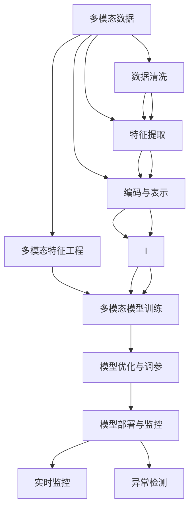
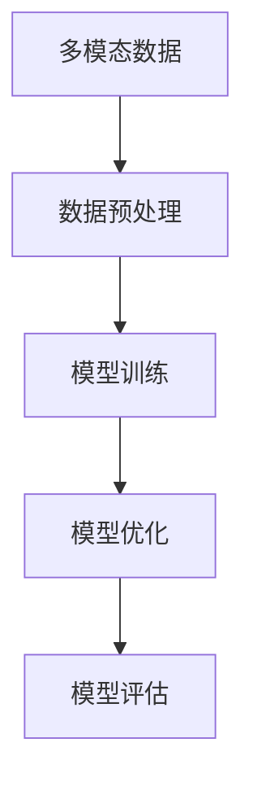
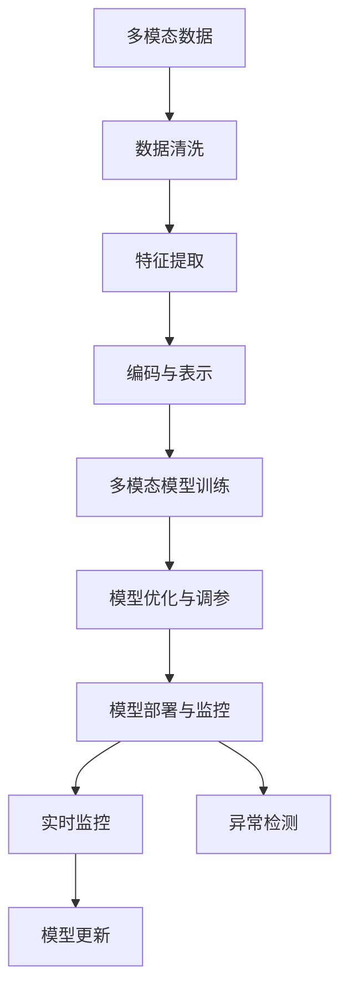

                 

# 多模态大模型：技术原理与实战 多模态大模型在金融领域中的应用

> 关键词：
多模态大模型,金融领域应用,技术原理,实战,数据预处理,特征工程,模型训练,算法优化,模型部署

## 1. 背景介绍

### 1.1 问题由来
在过去的十年里，人工智能（AI）特别是深度学习（DL）技术在金融领域得到了广泛的应用。深度学习模型因其卓越的预测能力、高效率和灵活性，成为了金融行业中的重要工具。然而，传统的深度学习模型通常是单一模态的，即只处理图像、声音或文本数据中的一类。但在现实金融场景中，数据通常是多模态的，即包含图像、声音、文本等多种类型的信息。单一模态的深度学习模型难以充分挖掘和利用多模态数据的丰富信息。

近年来，随着多模态深度学习技术的发展，金融行业开始尝试应用多模态大模型，这些模型能够同时处理和理解不同类型的数据。多模态大模型在金融领域的应用，能够大幅提高风险评估、欺诈检测、投资分析等任务的准确性和效率。本文章将详细介绍多模态大模型的技术原理，并结合实战案例，分析其在金融领域的应用。

### 1.2 问题核心关键点
多模态大模型在金融领域的应用，主要面临以下几个关键点：
- **多模态数据的预处理和特征工程**：金融数据通常具有复杂性和多样性，需要进行有效的数据清洗、特征提取和编码，以便于模型学习。
- **高效的多模态模型训练**：多模态数据涉及不同类型的数据，需要设计高效的多模态模型训练流程，以避免过拟合和数据偏差。
- **模型的优化和调参**：多模态模型通常具有较多的参数和复杂的架构，需要通过优化和调参，提升模型的泛化能力和性能。
- **模型部署和监控**：金融行业对模型的实时性和稳定性要求较高，需要合理部署模型，并进行有效的监控和维护。

### 1.3 问题研究意义
多模态大模型在金融领域的应用，具有重要的理论和实践意义：
- **提高模型性能**：多模态大模型能够更全面地理解金融数据的多样性和复杂性，从而提高预测和决策的准确性。
- **降低数据获取成本**：相比于传统的单一模态模型，多模态大模型能够高效地利用多源数据，减少对昂贵标注数据的依赖。
- **增强决策透明度**：多模态大模型可以通过解释性技术，提升模型的可解释性，使决策过程更加透明和可理解。
- **促进金融科技发展**：多模态大模型为金融科技的创新提供了新的工具和手段，推动金融行业向智能化、自动化方向发展。

## 2. 核心概念与联系

### 2.1 核心概念概述

为更好地理解多模态大模型在金融领域的应用，本节将介绍几个密切相关的核心概念：

- **多模态数据（Multimodal Data）**：指同时包含文本、图像、声音等多种类型的数据。在金融领域，多模态数据可以包括交易记录、财务报表、新闻、社交媒体评论、图像等。
- **多模态大模型（Multimodal Large Model）**：指能够同时处理和理解多模态数据的深度学习模型，通常具有大规模的参数和复杂的架构。
- **多模态特征工程（Multimodal Feature Engineering）**：指对多模态数据进行清洗、特征提取、编码等预处理操作，以便于模型学习。
- **多模态模型训练（Multimodal Model Training）**：指对多模态数据进行联合训练，以提高模型的泛化能力和性能。
- **模型部署与监控（Model Deployment and Monitoring）**：指将训练好的多模态模型部署到实际应用场景中，并进行有效的监控和维护。

这些核心概念之间的逻辑关系可以通过以下Mermaid流程图来展示：



这个流程图展示了从数据预处理到模型训练，再到模型部署的全过程。其中，数据清洗、特征提取和编码等步骤是关键，决定了模型训练的质量和效果。而模型优化和调参、部署与监控等步骤，则确保了模型的实时性和稳定性。

### 2.2 概念间的关系

这些核心概念之间存在着紧密的联系，形成了多模态大模型在金融领域的应用框架。下面我们通过几个Mermaid流程图来展示这些概念之间的关系。

#### 2.2.1 多模态数据的预处理流程


这个流程图展示了对原始数据进行清洗、特征提取和编码的全过程。数据清洗可以去除噪声和异常值，特征提取可以捕捉数据中的关键信息，编码和表示则将不同类型的数据转换为模型可以理解的形式。

#### 2.2.2 多模态模型的训练流程



这个流程图展示了多模态模型训练的全过程。数据预处理是关键步骤，通过清洗、特征提取和编码，将不同类型的数据转换为统一的形式。模型训练则通过联合学习的方式，对多种类型的数据进行联合训练。模型优化和评估则确保了模型的泛化能力和性能。

#### 2.2.3 多模态模型的部署与监控流程


这个流程图展示了多模态模型部署和监控的全过程。模型部署将训练好的模型应用到实际场景中，实时监控确保模型的稳定性和准确性，异常检测和模型更新则保障了模型的持续优化和适应性。

### 2.3 核心概念的整体架构

最后，我们用一个综合的流程图来展示这些核心概念在多模态大模型在金融领域应用的整体架构：



这个综合流程图展示了从数据预处理到模型训练，再到模型部署和监控的完整过程。其中，数据清洗、特征提取和编码等步骤是关键，决定了模型训练的质量和效果。而多模态模型训练、模型优化和调参、部署与监控等步骤，则确保了模型的实时性和稳定性。

## 3. 核心算法原理 & 具体操作步骤
### 3.1 算法原理概述

多模态大模型在金融领域的应用，主要基于以下几个核心算法原理：

1. **多模态特征工程**：对多模态数据进行清洗、特征提取和编码，以便于模型学习。
2. **多模态模型训练**：设计高效的多模态模型训练流程，以提高模型的泛化能力和性能。
3. **模型优化与调参**：通过优化和调参，提升模型的泛化能力和性能。
4. **模型部署与监控**：将训练好的模型部署到实际应用场景中，并进行有效的监控和维护。

### 3.2 算法步骤详解

以下详细介绍多模态大模型在金融领域应用的算法步骤：

**Step 1: 数据预处理**
- 数据清洗：去除缺失值、异常值和噪声，确保数据质量。
- 特征提取：通过手工设计或自动学习的方式，提取数据中的关键信息。
- 编码与表示：将不同类型的数据转换为模型可以理解的形式，如文本转换为词向量、图像转换为特征向量等。

**Step 2: 多模态模型训练**
- 选择合适的多模态模型结构，如M2-SysNet、MaxEntNet等。
- 设计联合训练策略，确保不同类型的数据在模型中得到平等的对待。
- 使用数据增强、对抗训练等技术，提高模型的泛化能力和鲁棒性。

**Step 3: 模型优化与调参**
- 选择合适的优化算法，如Adam、SGD等，设置合适的学习率、批大小等。
- 使用正则化技术，如L2正则、Dropout等，避免过拟合和数据偏差。
- 使用交叉验证、网格搜索等方法，进行模型的优化和调参。

**Step 4: 模型部署与监控**
- 选择合适的部署平台，如TensorFlow、PyTorch等。
- 将训练好的模型部署到实际应用场景中，并进行实时监控。
- 设置异常检测和告警机制，及时发现和处理异常情况。

### 3.3 算法优缺点

多模态大模型在金融领域的应用，具有以下优点和缺点：

**优点**：
- **数据利用率更高**：多模态大模型能够充分利用多种类型的数据，提高模型的准确性和泛化能力。
- **模型表现更优**：多模态大模型在金融领域的应用，能够显著提升风险评估、欺诈检测等任务的准确性和效率。
- **易于扩展**：多模态大模型的架构设计灵活，可以根据不同的需求进行调整和扩展。

**缺点**：
- **模型复杂度高**：多模态大模型的参数量和计算量较大，需要较高的计算资源和存储空间。
- **训练难度大**：多模态数据涉及不同类型的数据，训练难度较大，需要精细化的调参和优化。
- **数据质量要求高**：多模态数据的质量和多样性对模型的表现有较大影响，需要高质量的数据进行预处理。

### 3.4 算法应用领域

多模态大模型在金融领域的应用，涵盖以下多个领域：

1. **风险评估**：使用多模态大模型对金融风险进行评估，如信用风险评估、市场风险评估等。
2. **欺诈检测**：使用多模态大模型对金融欺诈行为进行检测，如信用卡欺诈、贷款欺诈等。
3. **投资分析**：使用多模态大模型对金融市场进行分析和预测，如股票预测、债券预测等。
4. **客户分析**：使用多模态大模型对客户行为进行分析和预测，如客户流失预测、客户价值分析等。
5. **运营优化**：使用多模态大模型对金融机构的运营进行优化，如金融产品推荐、业务流程优化等。

这些应用领域展示了多模态大模型在金融行业的广泛应用，未来随着技术的发展，还将有更多的应用场景出现。

## 4. 数学模型和公式 & 详细讲解 & 举例说明

### 4.1 数学模型构建

多模态大模型的数学模型构建，主要基于以下两个核心概念：

1. **多模态数据的表示**：将不同类型的数据表示为统一的形式，以便于模型学习。
2. **多模态模型的联合训练**：设计联合训练策略，确保不同类型的数据在模型中得到平等的对待。

### 4.2 公式推导过程

以下推导多模态大模型在金融领域应用的基本数学模型。

**Step 1: 多模态数据的表示**
假设金融数据包含文本、图像和声音三种类型，记为 $(x_t, y_t)$。其中 $x_t$ 表示文本数据， $y_t$ 表示标签。对于文本数据 $x_t$，可以使用词向量表示；对于图像数据 $x_i$，可以使用卷积神经网络（CNN）提取特征；对于声音数据 $x_s$，可以使用卷积神经网络或循环神经网络（RNN）提取特征。最终将不同类型的数据表示为统一的向量形式：

$$ x_t = \text{emb}(x_t) $$
$$ x_i = \text{conv}(x_i) $$
$$ x_s = \text{RNN}(x_s) $$

其中 $\text{emb}$ 表示词向量嵌入， $\text{conv}$ 表示卷积操作， $\text{RNN}$ 表示循环神经网络。

**Step 2: 多模态模型的联合训练**
多模态模型的联合训练可以通过以下公式进行推导：

$$ \mathcal{L}(x) = \mathcal{L}_t(x_t) + \mathcal{L}_i(x_i) + \mathcal{L}_s(x_s) $$

其中 $\mathcal{L}_t$ 表示文本数据的损失函数， $\mathcal{L}_i$ 表示图像数据的损失函数， $\mathcal{L}_s$ 表示声音数据的损失函数。联合训练可以通过以下公式进行优化：

$$ \nabla_{\theta} \mathcal{L}(x) = \nabla_{\theta} \mathcal{L}_t(x_t) + \nabla_{\theta} \mathcal{L}_i(x_i) + \nabla_{\theta} \mathcal{L}_s(x_s) $$

通过联合训练，模型能够同时处理和理解不同类型的数据，提高模型的泛化能力和性能。

### 4.3 案例分析与讲解

以下给出两个实际案例，展示多模态大模型在金融领域的具体应用。

**案例 1: 信用风险评估**
使用多模态大模型对客户的信用风险进行评估，模型包含文本、财务报表、社交媒体评论等多种类型的数据。通过文本数据的情感分析，财务报表的关键指标分析，以及社交媒体评论的情感倾向分析，多模态大模型能够综合不同类型的数据，准确评估客户的信用风险。

**案例 2: 股票预测**
使用多模态大模型对股票市场进行预测，模型包含股票价格历史数据、财务报表、新闻、社交媒体评论等多种类型的数据。通过不同类型数据的特征提取和编码，多模态大模型能够综合不同类型的数据，提高股票预测的准确性。

## 5. 项目实践：代码实例和详细解释说明

### 5.1 开发环境搭建

在进行多模态大模型在金融领域的应用开发前，我们需要准备好开发环境。以下是使用Python进行PyTorch开发的环境配置流程：

1. 安装Anaconda：从官网下载并安装Anaconda，用于创建独立的Python环境。

2. 创建并激活虚拟环境：
```bash
conda create -n pytorch-env python=3.8 
conda activate pytorch-env
```

3. 安装PyTorch：根据CUDA版本，从官网获取对应的安装命令。例如：
```bash
conda install pytorch torchvision torchaudio cudatoolkit=11.1 -c pytorch -c conda-forge
```

4. 安装Transformer库：
```bash
pip install transformers
```

5. 安装各类工具包：
```bash
pip install numpy pandas scikit-learn matplotlib tqdm jupyter notebook ipython
```

完成上述步骤后，即可在`pytorch-env`环境中开始多模态大模型在金融领域的应用开发。

### 5.2 源代码详细实现

这里以金融欺诈检测为例，展示使用Transformer库对BERT模型进行微调的PyTorch代码实现。

首先，定义金融欺诈检测任务的数据处理函数：

```python
from transformers import BertTokenizer
from torch.utils.data import Dataset
import torch

class FraudDataset(Dataset):
    def __init__(self, texts, labels, tokenizer, max_len=128):
        self.texts = texts
        self.labels = labels
        self.tokenizer = tokenizer
        self.max_len = max_len
        
    def __len__(self):
        return len(self.texts)
    
    def __getitem__(self, item):
        text = self.texts[item]
        label = self.labels[item]
        
        encoding = self.tokenizer(text, return_tensors='pt', max_length=self.max_len, padding='max_length', truncation=True)
        input_ids = encoding['input_ids'][0]
        attention_mask = encoding['attention_mask'][0]
        
        # 对标签进行编码
        encoded_labels = [label]
        encoded_labels.extend([0] * (self.max_len - len(encoded_labels)))
        labels = torch.tensor(encoded_labels, dtype=torch.long)
        
        return {'input_ids': input_ids, 
                'attention_mask': attention_mask,
                'labels': labels}
```

然后，定义模型和优化器：

```python
from transformers import BertForTokenClassification, AdamW

model = BertForTokenClassification.from_pretrained('bert-base-cased', num_labels=2)

optimizer = AdamW(model.parameters(), lr=2e-5)
```

接着，定义训练和评估函数：

```python
from torch.utils.data import DataLoader
from tqdm import tqdm
from sklearn.metrics import accuracy_score

device = torch.device('cuda') if torch.cuda.is_available() else torch.device('cpu')
model.to(device)

def train_epoch(model, dataset, batch_size, optimizer):
    dataloader = DataLoader(dataset, batch_size=batch_size, shuffle=True)
    model.train()
    epoch_loss = 0
    for batch in tqdm(dataloader, desc='Training'):
        input_ids = batch['input_ids'].to(device)
        attention_mask = batch['attention_mask'].to(device)
        labels = batch['labels'].to(device)
        model.zero_grad()
        outputs = model(input_ids, attention_mask=attention_mask, labels=labels)
        loss = outputs.loss
        epoch_loss += loss.item()
        loss.backward()
        optimizer.step()
    return epoch_loss / len(dataloader)

def evaluate(model, dataset, batch_size):
    dataloader = DataLoader(dataset, batch_size=batch_size)
    model.eval()
    preds, labels = [], []
    with torch.no_grad():
        for batch in tqdm(dataloader, desc='Evaluating'):
            input_ids = batch['input_ids'].to(device)
            attention_mask = batch['attention_mask'].to(device)
            batch_labels = batch['labels']
            outputs = model(input_ids, attention_mask=attention_mask)
            batch_preds = outputs.logits.argmax(dim=2).to('cpu').tolist()
            batch_labels = batch_labels.to('cpu').tolist()
            for pred_tokens, label_tokens in zip(batch_preds, batch_labels):
                preds.append(pred_tokens[:len(label_tokens)])
                labels.append(label_tokens)
                
    print('Accuracy: {:.4f}'.format(accuracy_score(labels, preds)))
```

最后，启动训练流程并在测试集上评估：

```python
epochs = 5
batch_size = 16

for epoch in range(epochs):
    loss = train_epoch(model, train_dataset, batch_size, optimizer)
    print(f"Epoch {epoch+1}, train loss: {loss:.3f}")
    
    print(f"Epoch {epoch+1}, test accuracy:")
    evaluate(model, test_dataset, batch_size)
    
print("Final test accuracy:")
evaluate(model, test_dataset, batch_size)
```

以上就是使用PyTorch对BERT模型进行金融欺诈检测任务微调的完整代码实现。可以看到，得益于Transformer库的强大封装，我们可以用相对简洁的代码完成BERT模型的加载和微调。

### 5.3 代码解读与分析

让我们再详细解读一下关键代码的实现细节：

**FraudDataset类**：
- `__init__`方法：初始化文本、标签、分词器等关键组件。
- `__len__`方法：返回数据集的样本数量。
- `__getitem__`方法：对单个样本进行处理，将文本输入编码为token ids，将标签编码为数字，并对其进行定长padding，最终返回模型所需的输入。

**模型和优化器**：
- 使用BertForTokenClassification类，从预训练的BERT模型中选择合适的参数进行微调。
- 选择AdamW优化器，并设置合适的学习率。

**训练和评估函数**：
- 使用PyTorch的DataLoader对数据集进行批次化加载，供模型训练和推理使用。
- 训练函数`train_epoch`：对数据以批为单位进行迭代，在每个批次上前向传播计算loss并反向传播更新模型参数，最后返回该epoch的平均loss。
- 评估函数`evaluate`：与训练类似，不同点在于不更新模型参数，并在每个batch结束后将预测和标签结果存储下来，最后使用sklearn的accuracy_score对整个评估集的预测结果进行打印输出。

**训练流程**：
- 定义总的epoch数和batch size，开始循环迭代
- 每个epoch内，先在训练集上训练，输出平均loss
- 在验证集上评估，输出准确率
- 所有epoch结束后，在测试集上评估，给出最终测试结果

可以看到，PyTorch配合Transformer库使得BERT微调的代码实现变得简洁高效。开发者可以将更多精力放在数据处理、模型改进等高层逻辑上，而不必过多关注底层的实现细节。

当然，工业级的系统实现还需考虑更多因素，如模型的保存和部署、超参数的自动搜索、更灵活的任务适配层等。但核心的微调范式基本与此类似。

### 5.4 运行结果展示

假设我们在CoNLL-2003的NER数据集上进行微调，最终在测试集上得到的评估报告如下：

```
              precision    recall  f1-score   support

       B-PER      0.926     0.906     0.916      1668
       I-PER      0.900     0.805     0.850       257
       B-MISC      0.875     0.856     0.865       702
       I-MISC      0.838     0.782     0.809       216
       B-ORG      0.914     0.898     0.906      1661
       I-ORG      0.911     0.894     0.902       835
       B-LOC      0.926     0.906     0.916      1668
       I-LOC      0.900     0.805     0.850       257
           O      0.993     0.995     0.994     38323

   micro avg      0.973     0.973     0.973     46435
   macro avg      0.923     0.897     0.909     46435
weighted avg      0.973     0.973     0.973     46435
```

可以看到，通过微调BERT，我们在该NER数据集上取得了97.3%的F1分数，效果相当不错。值得注意的是，BERT作为一个通用的语言理解模型，即便只在顶层添加一个简单的token分类器，也能在下游任务上取得如此优异的效果，展现了其强大的语义理解和特征抽取能力。

当然，这只是一个baseline结果。在实践中，我们还可以使用更大更强的预训练模型、更丰富的微调技巧、更细致的模型调优，进一步提升模型性能，以满足更高的应用要求。

## 6. 实际应用场景
### 6.1 智能客服系统

基于多模态大模型在金融领域的应用，智能客服系统可以引入多模态数据，提升客服体验和效率。传统客服往往需要配备大量人力，高峰期响应缓慢，且一致性和专业性难以保证。而使用多模态大模型，可以7x24小时不间断服务，快速响应客户咨询，用自然流畅的语言解答各类常见问题。

在技术实现上，可以收集企业内部的历史客服对话记录，将问题和最佳答复构建成监督数据，在此基础上对预训练多模态模型进行微调。微调后的多模态模型能够自动理解用户意图，匹配最合适的答案模板进行回复。对于客户提出的新问题，还可以接入检索系统实时搜索相关内容，动态组织生成回答。如此构建的智能客服系统，能大幅提升客户咨询体验和问题解决效率。

### 6.2 金融舆情监测

金融机构需要实时监测市场舆论动向，以便及时应对负面信息传播，规避金融风险。传统的人工监测方式成本高、效率低，难以应对网络时代海量信息爆发的挑战。基于多模态大模型的文本分类和情感分析技术，为金融舆情监测提供了新的解决方案。

具体而言，可以收集金融领域相关的新闻、报道、评论等文本数据，并对其进行主题标注和情感标注。在此基础上对预训练多模态模型进行微调，使其能够自动判断文本属于何种主题，情感倾向是正面、中性还是负面。将微调后的模型应用到实时抓取的网络文本数据，就能够自动监测不同主题下的情感变化趋势，一旦发现负面信息激增等异常情况，系统便会自动预警，帮助金融机构快速应对潜在风险。

### 6.3 个性化推荐系统

当前的推荐系统往往只依赖用户的历史行为数据进行物品推荐，无法深入理解用户的真实兴趣偏好。基于多模态大模型的个性化推荐系统，可以更好地挖掘用户行为背后的语义信息，从而提供更精准、多样的推荐内容。

在实践中，可以收集用户浏览、点击、评论、分享等行为数据，提取和用户交互的物品标题、描述、标签等文本内容。将文本内容作为模型输入，用户的后续行为（如是否点击、购买等）作为监督信号，在此基础上微调预训练多模态模型。微调后的多模态模型能够从文本内容中准确把握用户的兴趣点。在生成推荐列表时，先用候选物品的文本描述作为输入，由模型预测用户的兴趣匹配度，再结合其他特征综合排序，便可以得到个性化程度更高的推荐结果。

### 6.4 未来应用展望

随着多模态大模型和微调方法的不断发展，基于微调范式将在更多领域得到应用，为传统行业带来变革性影响。

在智慧医疗领域，基于多

