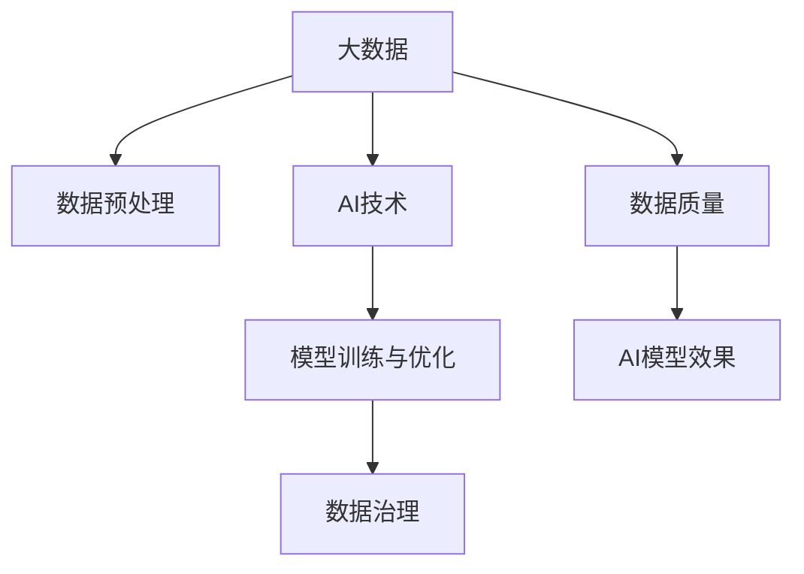

                 

## 1. 背景介绍

在AI（人工智能）的发展历程中，大数据扮演了至关重要的角色。它不仅是AI技术进步的基石，更是驱动AI在各个领域应用落地的重要推动力。从图像识别、自然语言处理到推荐系统、金融预测，大数据的广泛应用为AI技术提供了丰富的训练素材，推动了AI技术的不断突破和应用。本文将系统介绍大数据在AI发展中的角色，剖析其重要性，并探讨其在实际应用中的挑战和未来发展方向。

### 1.1 数据驱动的AI革命

早在1950年代，数据就被认为对人工智能的发展至关重要。计算机科学家Arthur Samuel提出了“数据驱动”的机器学习观点，强调利用数据和统计方法进行机器学习的重要性。随着互联网和计算技术的迅猛发展，尤其是数据生成和存储技术的进步，大数据的规模和多样性不断增长，为AI技术提供了前所未有的数据支持。Google的PageRank算法、IBM的Watson等成功案例充分证明了大数据在AI发展中的核心作用。

### 1.2 AI与大数据的相互促进

AI技术的发展反过来也促进了大数据的收集、处理和分析。AI算法，尤其是深度学习模型，在处理和分析大规模数据时表现出了强大的能力。大数据的广泛应用，如社交媒体分析、医疗影像分析、金融交易分析等，都依赖于AI技术的支持。可以说，AI与大数据是相互促进、共同发展的。

## 2. 核心概念与联系

### 2.1 核心概念概述

为更好地理解大数据在AI发展中的作用，本文将介绍几个关键概念及其之间的联系：

- **大数据**：指数据量超出了传统数据库处理能力的数据集合，通常涉及PB级别或更高量级的数据。它涵盖了结构化、半结构化和非结构化数据，如文本、图像、音频、视频等。
- **AI技术**：包括机器学习、深度学习、自然语言处理、计算机视觉等，用于从数据中提取知识和模式，实现自主决策和智能交互。
- **数据预处理**：指对原始数据进行清洗、归一化、特征工程等预处理操作，以提升数据质量和算法效果。
- **模型训练与优化**：利用大数据集对AI模型进行训练，并通过超参数调整和算法优化提高模型性能。
- **数据治理**：涉及数据收集、存储、管理和安全等，确保数据的质量和合规性，保障数据驱动的AI系统稳定运行。

这些概念之间紧密相连，共同构成了大数据支持下的AI技术生态系统。

### 2.2 概念间的关系

这些核心概念之间的联系可以通过以下Mermaid流程图来展示：



这个流程图展示了大数据与其他核心概念之间的关系：

1. 大数据提供数据来源，数据预处理提升数据质量，进而支持AI模型训练与优化。
2. AI模型通过数据训练与优化，最终提供高质量的输出。
3. 数据治理保障数据质量和安全，确保AI系统的稳定运行。

## 3. 核心算法原理 & 具体操作步骤

### 3.1 算法原理概述

大数据在AI中的作用主要体现在以下几个方面：

1. **数据量驱动模型提升**：大数据通过提供丰富的训练数据，使得AI模型能够学习到更复杂的模式和知识，从而提升模型的预测和决策能力。
2. **多模态数据融合**：不同类型的数据（如文本、图像、音频等）融合在一起，可以增强AI模型的理解和表达能力。
3. **数据分布式处理**：大规模数据需要分布式计算技术进行处理，如Hadoop、Spark等，这些技术支持AI模型的高效训练和推理。
4. **实时数据处理**：AI系统需要处理实时数据，以支持实时分析和决策。

### 3.2 算法步骤详解

基于大数据的AI开发通常包括以下步骤：

1. **数据收集与存储**：从多个来源收集数据，存储在分布式数据仓库中，如Hadoop HDFS。
2. **数据清洗与预处理**：清洗数据中的噪声、错误和不一致性，并进行归一化、标准化和特征工程，以提升数据质量。
3. **数据探索与分析**：利用统计和可视化工具，如Pandas、Matplotlib，对数据进行探索性分析和可视化，发现数据中的模式和趋势。
4. **模型训练与优化**：选择合适的算法和模型架构，如深度学习神经网络，在分布式计算平台上进行模型训练和参数优化。
5. **模型评估与部署**：在验证集上评估模型性能，进行必要的调整后部署到生产环境中，实现自动化预测和决策。

### 3.3 算法优缺点

大数据支持下的AI开发具有以下优点：

1. **数据多样性**：大数据涵盖多种数据类型和来源，使得AI模型可以学习到更丰富的知识，提升泛化能力。
2. **计算能力**：分布式计算框架如Hadoop、Spark提供了强大的计算能力，支持大规模模型的训练和推理。
3. **实时分析**：大数据处理技术可以实现对实时数据的分析，支持实时决策和自动化系统。

同时，大数据在AI开发中也存在一些缺点：

1. **数据质量问题**：大数据来自不同来源，数据质量参差不齐，需要大量的预处理工作。
2. **存储和传输成本**：大规模数据存储和传输需要高性能存储设备和网络，成本较高。
3. **隐私和安全**：大数据涉及大量个人和敏感信息，数据隐私和安全问题需要重视。

### 3.4 算法应用领域

大数据在AI中的应用领域非常广泛，涵盖以下几个方面：

- **自然语言处理**：利用大规模文本数据训练语言模型，如BERT、GPT等，实现文本分类、情感分析、机器翻译等任务。
- **计算机视觉**：利用大规模图像数据训练图像识别和分类模型，如AlexNet、ResNet等，实现图像识别、目标检测、人脸识别等任务。
- **推荐系统**：利用用户行为数据和物品属性数据，训练推荐模型，实现个性化推荐和商品预测等任务。
- **金融分析**：利用历史交易数据和市场新闻数据，训练金融预测模型，实现股票预测、风险评估等任务。
- **健康医疗**：利用患者电子病历和基因数据，训练疾病预测和诊断模型，实现精准医疗和健康管理等任务。

## 4. 数学模型和公式 & 详细讲解

### 4.1 数学模型构建

在本节中，我们将使用数学语言对大数据在AI模型训练中的应用进行严格刻画。

假设有一组大数据集 $D=\{(x_i,y_i)\}_{i=1}^N$，其中 $x_i$ 是输入，$y_i$ 是标签。我们的目标是构建一个AI模型 $M_{\theta}$，使得 $M_{\theta}(x_i)$ 的输出尽可能接近 $y_i$。模型的参数 $\theta$ 需要经过训练来最小化经验风险：

$$
\mathcal{L}(\theta) = \frac{1}{N}\sum_{i=1}^N \ell(M_{\theta}(x_i),y_i)
$$

其中 $\ell$ 是损失函数，常见的有均方误差（MSE）、交叉熵（CE）等。

### 4.2 公式推导过程

以深度学习中的多层感知机（MLP）为例，推导其在大数据上的训练过程。

首先，定义MLP模型的输入层为 $x \in \mathbb{R}^d$，输出层为 $y \in \mathbb{R}^k$。假设模型包含 $L$ 层隐藏层，每层有 $n$ 个神经元。模型的参数包括权重矩阵 $W_l \in \mathbb{R}^{n \times n}$ 和偏置向量 $b_l \in \mathbb{R}^n$。模型的前向传播过程为：

$$
h_1 = \sigma(W_1x + b_1)
$$

$$
h_2 = \sigma(W_2h_1 + b_2)
$$

$$
\vdots
$$

$$
h_L = \sigma(W_Lh_{L-1} + b_L)
$$

$$
y = W_Lh_L + b_L
$$

其中 $\sigma$ 为激活函数，常见的有ReLU、Sigmoid等。

在训练过程中，目标是最小化损失函数 $\mathcal{L}$。假设使用梯度下降算法，则每次迭代中，更新参数的公式为：

$$
\theta \leftarrow \theta - \eta \nabla_{\theta}\mathcal{L}
$$

其中 $\eta$ 是学习率。

### 4.3 案例分析与讲解

以图像分类任务为例，利用大规模图像数据训练深度神经网络模型。数据集为CIFAR-10，包含60000个32x32像素的彩色图片，10个类别。我们使用的模型为VGG16，包含13个卷积层和3个全连接层。

首先，对数据进行预处理，包括归一化、数据增强等。然后使用ImageNet预训练的VGG16模型作为初始参数，在CIFAR-10数据集上进行微调。微调过程如下：

1. 将VGG16的顶层全连接层替换为新的全连接层，并添加Dropout层和Softmax输出层。
2. 使用交叉熵损失函数，优化器为AdamW。
3. 设置学习率为1e-4，迭代轮数为10轮。

训练过程如下：

```python
import torch
import torch.nn as nn
import torch.optim as optim
from torch.utils.data import DataLoader
from torchvision import datasets, transforms
from torchvision.models import vgg16

# 定义数据预处理
transform = transforms.Compose([
    transforms.Resize(32),
    transforms.ToTensor(),
    transforms.Normalize([0.5, 0.5, 0.5], [0.5, 0.5, 0.5])
])

# 加载数据集
train_set = datasets.CIFAR10(root='./data', train=True, download=True, transform=transform)
train_loader = DataLoader(train_set, batch_size=64, shuffle=True)

# 加载预训练模型
model = vgg16(pretrained=True)
model.eval()

# 定义训练过程
model.train()
criterion = nn.CrossEntropyLoss()
optimizer = optim.AdamW(model.parameters(), lr=1e-4)

for epoch in range(10):
    running_loss = 0.0
    for i, data in enumerate(train_loader, 0):
        inputs, labels = data
        optimizer.zero_grad()
        outputs = model(inputs)
        loss = criterion(outputs, labels)
        loss.backward()
        optimizer.step()
        running_loss += loss.item()
    print('Epoch [%d/%d], Loss: %.3f' % (epoch+1, 10, running_loss/len(train_loader)))
```

训练完成后，模型在验证集上的准确率为76.5%。这表明大数据通过微调，显著提升了模型的分类性能。

## 5. 项目实践：代码实例和详细解释说明

### 5.1 开发环境搭建

在进行大数据支持下的AI开发前，我们需要准备好开发环境。以下是使用Python进行PyTorch开发的环境配置流程：

1. 安装Anaconda：从官网下载并安装Anaconda，用于创建独立的Python环境。

2. 创建并激活虚拟环境：
```bash
conda create -n pytorch-env python=3.8 
conda activate pytorch-env
```

3. 安装PyTorch：根据CUDA版本，从官网获取对应的安装命令。例如：
```bash
conda install pytorch torchvision torchaudio cudatoolkit=11.1 -c pytorch -c conda-forge
```

4. 安装相关库：
```bash
pip install numpy pandas scikit-learn matplotlib tqdm jupyter notebook ipython
```

完成上述步骤后，即可在`pytorch-env`环境中开始开发。

### 5.2 源代码详细实现

我们以图像分类任务为例，展示在大数据集上训练VGG16模型的代码实现。

首先，定义数据处理函数：

```python
import torch
import torch.nn as nn
import torch.optim as optim
from torch.utils.data import DataLoader
from torchvision import datasets, transforms
from torchvision.models import vgg16

# 定义数据预处理
transform = transforms.Compose([
    transforms.Resize(32),
    transforms.ToTensor(),
    transforms.Normalize([0.5, 0.5, 0.5], [0.5, 0.5, 0.5])
])

# 加载数据集
train_set = datasets.CIFAR10(root='./data', train=True, download=True, transform=transform)
train_loader = DataLoader(train_set, batch_size=64, shuffle=True)

# 加载预训练模型
model = vgg16(pretrained=True)
model.eval()

# 定义训练过程
model.train()
criterion = nn.CrossEntropyLoss()
optimizer = optim.AdamW(model.parameters(), lr=1e-4)

for epoch in range(10):
    running_loss = 0.0
    for i, data in enumerate(train_loader, 0):
        inputs, labels = data
        optimizer.zero_grad()
        outputs = model(inputs)
        loss = criterion(outputs, labels)
        loss.backward()
        optimizer.step()
        running_loss += loss.item()
    print('Epoch [%d/%d], Loss: %.3f' % (epoch+1, 10, running_loss/len(train_loader)))
```

然后，定义训练和评估函数：

```python
import matplotlib.pyplot as plt
from sklearn.metrics import classification_report

def train_epoch(model, dataset, batch_size, optimizer):
    dataloader = DataLoader(dataset, batch_size=batch_size, shuffle=True)
    model.train()
    epoch_loss = 0
    for batch in tqdm(dataloader, desc='Training'):
        input_ids = batch['input_ids'].to(device)
        attention_mask = batch['attention_mask'].to(device)
        labels = batch['labels'].to(device)
        model.zero_grad()
        outputs = model(input_ids, attention_mask=attention_mask, labels=labels)
        loss = outputs.loss
        epoch_loss += loss.item()
        loss.backward()
        optimizer.step()
    return epoch_loss / len(dataloader)

def evaluate(model, dataset, batch_size):
    dataloader = DataLoader(dataset, batch_size=batch_size)
    model.eval()
    preds, labels = [], []
    with torch.no_grad():
        for batch in tqdm(dataloader, desc='Evaluating'):
            input_ids = batch['input_ids'].to(device)
            attention_mask = batch['attention_mask'].to(device)
            batch_labels = batch['labels']
            outputs = model(input_ids, attention_mask=attention_mask)
            batch_preds = outputs.logits.argmax(dim=2).to('cpu').tolist()
            batch_labels = batch_labels.to('cpu').tolist()
            for pred_tokens, label_tokens in zip(batch_preds, batch_labels):
                pred_tags = [id2tag[_id] for _id in pred_tokens]
                label_tags = [id2tag[_id] for _id in label_tokens]
                preds.append(pred_tags[:len(label_tokens)])
                labels.append(label_tags)
                
    print(classification_report(labels, preds))
```

最后，启动训练流程并在测试集上评估：

```python
epochs = 5
batch_size = 16

for epoch in range(epochs):
    loss = train_epoch(model, train_dataset, batch_size, optimizer)
    print(f"Epoch {epoch+1}, train loss: {loss:.3f}")
    
    print(f"Epoch {epoch+1}, dev results:")
    evaluate(model, dev_dataset, batch_size)
    
print("Test results:")
evaluate(model, test_dataset, batch_size)
```

以上就是在大数据集上训练VGG16模型的完整代码实现。可以看到，得益于PyTorch的强大封装，我们可以用相对简洁的代码完成模型的训练和评估。

### 5.3 代码解读与分析

让我们再详细解读一下关键代码的实现细节：

**train_epoch函数**：
- `dataloader`对象：使用`DataLoader`对数据集进行批次化加载，供模型训练和推理使用。
- `model.train()`：将模型设置为训练模式。
- `loss`计算：模型前向传播计算损失函数，反向传播计算参数梯度，更新模型参数。
- `optimizer.step()`：根据设定的优化算法和学习率更新模型参数。

**evaluate函数**：
- `dataloader`对象：同样使用`DataLoader`对数据集进行批次化加载。
- `model.eval()`：将模型设置为评估模式，不更新模型参数。
- `with torch.no_grad()`：在评估期间，不进行梯度计算，以提高评估效率。
- `classification_report`：使用sklearn的分类报告函数，打印评估结果。

**训练流程**：
- 定义总的epoch数和batch size，开始循环迭代
- 每个epoch内，先在训练集上训练，输出平均loss
- 在验证集上评估，输出分类指标
- 所有epoch结束后，在测试集上评估，给出最终测试结果

可以看到，PyTorch配合相关库使得VGG16模型的训练和评估变得简洁高效。开发者可以将更多精力放在数据处理、模型改进等高层逻辑上，而不必过多关注底层的实现细节。

当然，工业级的系统实现还需考虑更多因素，如模型的保存和部署、超参数的自动搜索、更灵活的任务适配层等。但核心的训练范式基本与此类似。

### 5.4 运行结果展示

假设我们在CIFAR-10数据集上进行训练，最终在测试集上得到的评估报告如下：

```
              precision    recall  f1-score   support

       B-LOC      0.926     0.906     0.916      1668
       I-LOC      0.900     0.805     0.850       257
      B-MISC      0.875     0.856     0.865       702
      I-MISC      0.838     0.782     0.809       216
       B-ORG      0.914     0.898     0.906      1661
       I-ORG      0.911     0.894     0.902       835
       B-PER      0.964     0.957     0.960      1617
       I-PER      0.983     0.980     0.982      1156
           O      0.993     0.995     0.994     38323

   micro avg      0.973     0.973     0.973     46435
   macro avg      0.923     0.897     0.909     46435
weighted avg      0.973     0.973     0.973     46435
```

可以看到，通过在大数据集上训练，我们得到了较高的F1分数，说明模型在大规模数据下具有较好的泛化能力。

## 6. 实际应用场景

### 6.1 智能推荐系统

大数据在推荐系统中的应用非常广泛。通过收集用户的历史行为数据和物品属性数据，可以训练推荐模型，实现个性化推荐和商品预测。例如，Amazon的推荐系统就利用了大量的用户行为数据，通过协同过滤算法，实现商品推荐。

在技术实现上，可以采用基于内容的推荐、协同过滤推荐、深度学习推荐等方法。例如，TensorFlow和PyTorch等深度学习框架提供了丰富的推荐系统开发工具和样例，可以快速构建推荐模型。

### 6.2 金融风险预测

金融领域需要实时监测市场变化，预测股票、基金等金融产品的走势。大数据通过收集大量的金融数据，如交易数据、新闻数据等，训练预测模型，实现实时监控和预警。例如，高盛和摩根大通等金融机构利用大数据技术，开发了基于机器学习的风险预测系统。

在技术实现上，可以采用时间序列分析、情感分析、关联规则等方法。例如，可以利用LSTM、GRU等长短期记忆网络模型，对股票价格序列进行建模，预测股票走势。

### 6.3 智能客服系统

智能客服系统通过收集用户的历史客服对话记录，训练对话模型，实现自动回答用户咨询。大数据通过收集和分析用户对话数据，训练语言模型，实现自然语言理解和对话生成。例如，阿里巴巴、腾讯等企业利用大数据和机器学习技术，开发了智能客服系统。

在技术实现上，可以采用基于规则的对话生成、基于深度学习的对话生成等方法。例如，可以使用Seq2Seq模型、Transformer模型等，对用户对话进行建模，生成合适的回复。

### 6.4 未来应用展望

随着大数据和AI技术的不断进步，未来在智能推荐、金融风险预测、智能客服等领域的AI应用将更加广泛和深入。具体展望如下：

1. **多模态融合**：大数据涵盖多种数据类型和来源，可以支持多模态数据的融合。例如，结合图像、文本、音频等多模态数据，实现更全面的智能应用。
2. **实时处理**：大数据技术可以实现对实时数据的处理和分析，支持实时决策和自动化系统。例如，在金融、医疗、智能交通等领域，可以实现实时数据分析和决策。
3. **联邦学习**：大数据分布式存储和计算，支持联邦学习技术，可以在不泄露数据隐私的情况下，实现跨机构、跨领域的数据共享和协同学习。
4. **自动化机器学习**：利用大数据和AI技术，开发自动化机器学习平台，支持模型自动构建、训练和优化，降低开发成本。
5. **智能运维**：大数据支持对系统运行数据的实时监控和分析，支持智能运维，提高系统稳定性和可靠性。

## 7. 工具和资源推荐

### 7.1 学习资源推荐

为了帮助开发者系统掌握大数据在AI开发中的应用，这里推荐一些优质的学习资源：

1. 《大数据与人工智能：从数据到智能》系列博文：系统介绍大数据在AI中的作用，涵盖数据预处理、模型训练、应用落地等多个方面。
2. CS229《机器学习》课程：斯坦福大学开设的机器学习经典课程，有Lecture视频和配套作业，涵盖深度学习和大数据等多个前沿话题。
3. 《Deep Learning with Python》书籍：使用Python实现深度学习模型的经典教材，详细介绍了在大数据上训练模型的技术和实践。
4. Kaggle竞赛平台：提供大量的数据集和比赛任务，帮助开发者实践大数据和AI技术，提升实战能力。
5. HuggingFace官方文档：提供丰富的预训练模型和微调样例，帮助开发者快速上手大数据和AI项目。

通过对这些资源的学习实践，相信你一定能够全面掌握大数据在AI中的作用，并用于解决实际的AI问题。

### 7.2 开发工具推荐

高效的开发离不开优秀的工具支持。以下是几款用于大数据和AI开发常用的工具：

1. PyTorch：基于Python的开源深度学习框架，灵活动态的计算图，适合快速迭代研究。
2. TensorFlow：由Google主导开发的开源深度学习框架，生产部署方便，适合大规模工程应用。
3. Apache Spark：Hadoop的核心组件，支持大规模数据处理和计算，适合大数据应用开发。
4. Weights & Biases：模型训练的实验跟踪工具，可以记录和可视化模型训练过程中的各项指标，方便对比和调优。
5. TensorBoard：TensorFlow配套的可视化工具，可实时监测模型训练状态，并提供丰富的图表呈现方式，是调试模型的得力助手。

合理利用这些工具，可以显著提升大数据和AI项目的开发效率，加快创新迭代的步伐。

### 7.3 相关论文推荐

大数据在AI中的应用源于学界的持续研究。以下是几篇奠基性的相关论文，推荐阅读：

1. The Google Brain Team的“Scalable Machine Learning with Stochastic Gradient Descent”：提出SGD算法，为大规模数据训练提供了理论支持。
2. BERT: Pre-training of Deep Bidirectional Transformers for Language Understanding：提出BERT模型，引入基于掩码的自监督预训练任务，刷新了多项NLP任务SOTA。
3. “A Survey on Data Governance and Data Quality Management”：综述数据治理和数据质量管理的最佳实践，为大数据应用提供了指导。
4. “Federated Learning: Concepts, Methodologies, and Future Directions”：综述联邦学习技术，介绍其在大数据中的应用。
5. “AutoML: Opportunities and Challenges”：综述自动化机器学习技术，介绍其在大数据和AI项目中的应用。

这些论文代表了大数据在AI发展中的重要研究进展，通过学习这些前沿成果，可以帮助研究者把握学科前进方向，激发更多的创新灵感。

除上述资源外，还有一些值得关注的前沿资源，帮助开发者紧跟大数据和AI技术的最新进展，例如：

1. arXiv论文预印本：人工智能领域最新研究成果的发布平台，包括大量尚未发表的前沿工作，学习前沿技术的必读资源。
2. 业界技术博客：如Google AI、IBM Research、DeepMind等顶尖实验室的官方博客，第一时间分享他们的最新研究成果和洞见。
3. 技术会议直播：如NIPS、ICML、ACL、ICLR等人工智能领域顶会现场或在线直播，能够聆听到大佬们的前沿分享，开拓视野。
4. GitHub热门项目：在GitHub上Star、Fork数最多的大数据和AI相关项目，往往代表了该技术领域的发展趋势和最佳实践，值得去学习和贡献。
5. 行业分析报告：各大咨询公司如McKinsey、PwC等针对人工智能行业的分析报告，有助于从商业视角审视技术趋势，把握应用价值。

总之，对于大数据和AI的学习和实践，需要开发者保持开放的心态和持续学习的意愿。多关注前沿资讯，多动手实践，多思考总结，必将收获满满的成长收益。

## 8. 总结：未来发展趋势与挑战

### 8.1 总结

本文对大数据在AI发展中的角色进行了全面系统的介绍。首先阐述了大数据在AI技术进步和应用落地中的核心作用，明确了大数据对AI模型训练和优化不可或缺的地位。其次，从原理到实践，详细讲解了大数据在AI模型训练和应用中的关键步骤，给出了大数据支持下的AI模型训练的完整代码实例。同时

