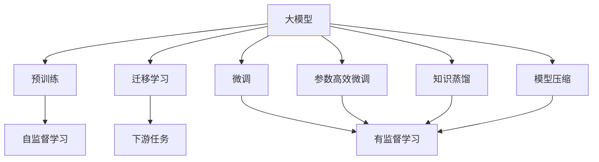
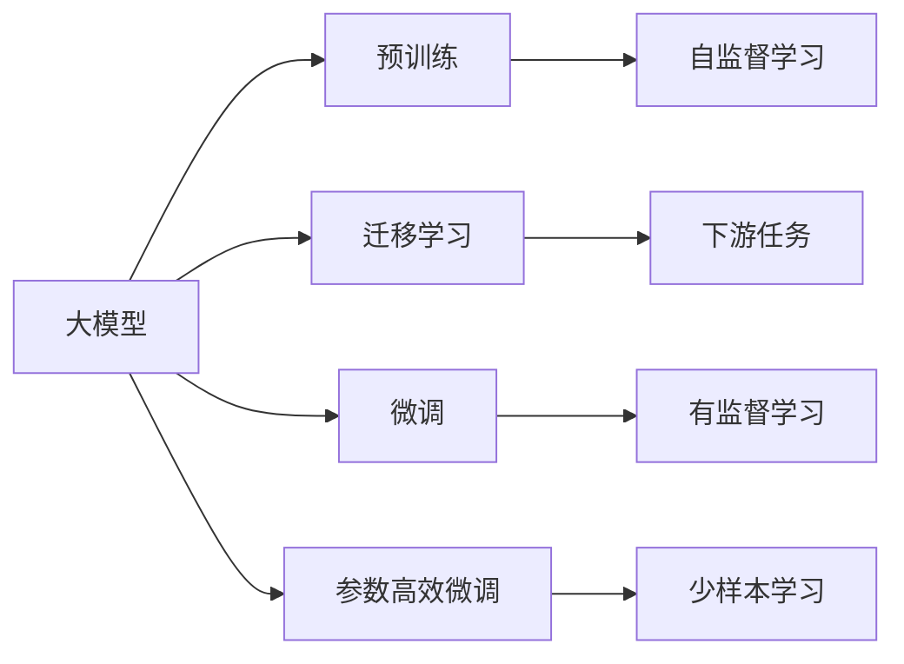
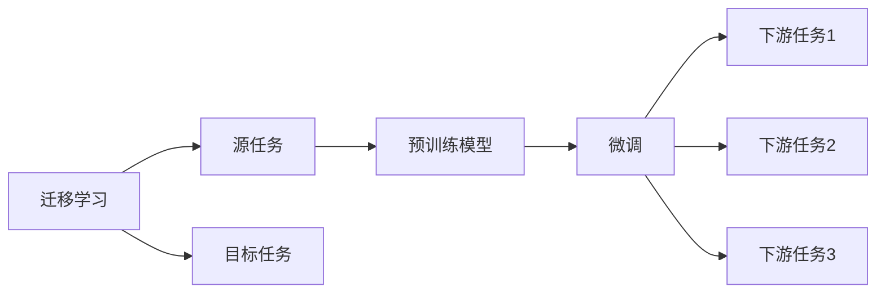
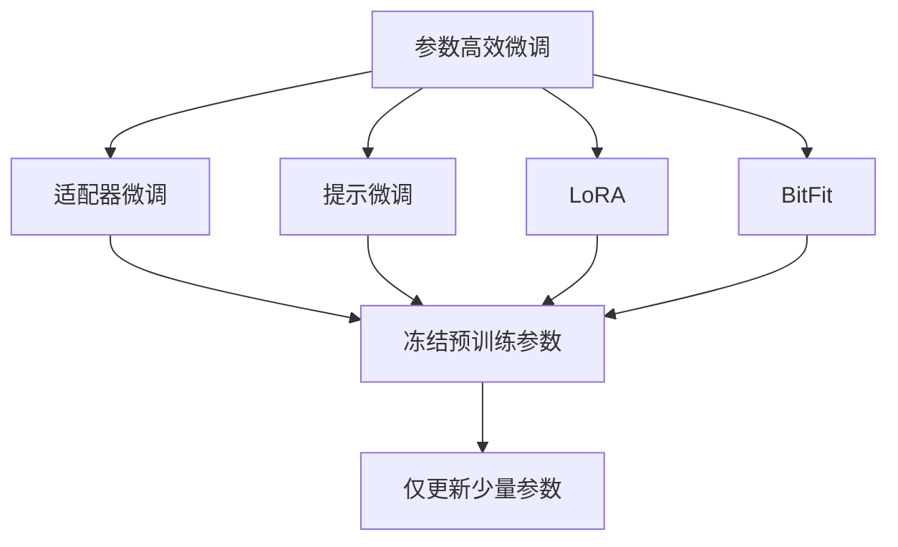
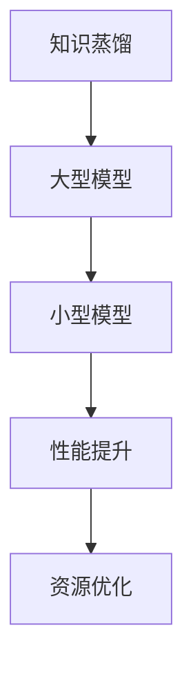
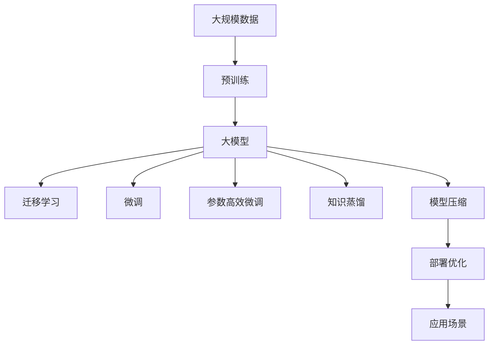

                 

# 大模型的技术创新与市场需求

> 关键词：大模型,技术创新,市场需求,人工智能,机器学习,深度学习,计算机视觉,自然语言处理

## 1. 背景介绍

### 1.1 问题由来
近年来，随着深度学习技术的迅猛发展，大模型（Large Model）在各个领域的应用愈发广泛。大模型通过在巨大的数据集上进行预训练，学习到了丰富的领域知识，可以应用于图像识别、语音识别、自然语言处理等众多任务，极大地提升了这些领域的自动化和智能化水平。然而，大模型也面临着存储和计算成本高昂、训练时间长、模型难以解释等问题。

### 1.2 问题核心关键点
本节将探讨大模型所面临的核心问题，并分析这些问题背后的技术创新与市场需求。

#### 1.2.1 数据依赖性强
大模型的性能很大程度上依赖于其训练数据的质量和数量。然而，高质量、大规模的数据集往往难以获取，尤其是在小众领域和新兴行业。数据依赖性强使得大模型的应用范围受到限制。

#### 1.2.2 计算资源需求高
大模型通常包含数十亿甚至数百亿个参数，其训练和推理需要大量的计算资源。尽管硬件技术不断进步，但存储和计算成本依然较高，难以支撑大规模的模型应用。

#### 1.2.3 模型难以解释
由于大模型通常采用黑箱式的深度学习架构，其决策过程难以解释。这对于需要高透明度的医疗、金融等高风险行业来说，是一个重大挑战。

#### 1.2.4 模型迁移能力有限
大模型通常是针对特定领域进行预训练的，其泛化能力有限，难以迁移到其他领域。如何提高模型的迁移能力，使其能够适应更多应用场景，是一个亟待解决的问题。

## 2. 核心概念与联系

### 2.1 核心概念概述

为更好地理解大模型的技术创新与市场需求，本节将介绍几个密切相关的核心概念：

- 大模型（Large Model）：指具有数十亿或数百亿个参数，能在特定领域上学习到丰富知识的大型神经网络模型。
- 预训练（Pre-training）：指在大规模无标签数据上，通过自监督学习任务训练通用模型的方法。
- 迁移学习（Transfer Learning）：指将一个领域学习到的知识，迁移到另一个不同但相关的领域的方法。
- 微调（Fine-tuning）：指在大模型上进行下游任务的微调，以适应特定任务的需求。
- 参数高效微调（Parameter-Efficient Fine-tuning）：指在微调过程中，只更新少量的模型参数，而固定大部分预训练权重不变。
- 知识蒸馏（Knowledge Distillation）：指将大型模型的知识迁移到小型模型中，以提高小型模型的性能。
- 模型压缩（Model Compression）：指通过剪枝、量化、蒸馏等技术，减少模型参数量和计算资源需求，提高模型部署效率。

这些核心概念之间的逻辑关系可以通过以下Mermaid流程图来展示：



这个流程图展示了大模型在预训练、迁移学习、微调、参数高效微调、知识蒸馏和模型压缩等各个阶段的演进过程及其相互关系。

### 2.2 概念间的关系

这些核心概念之间存在着紧密的联系，形成了大模型的学习和应用框架。以下通过几个Mermaid流程图来展示这些概念之间的关系。

#### 2.2.1 大模型的学习范式



这个流程图展示了大模型的三种主要学习范式：预训练、迁移学习和微调。其中，迁移学习和大模型微调是实现大模型在不同任务上的应用的关键步骤。

#### 2.2.2 迁移学习与微调的关系



这个流程图展示了迁移学习的基本原理，以及它与微调的关系。迁移学习涉及源任务和目标任务，预训练模型在源任务上学习，然后通过微调适应各种下游任务（目标任务）。

#### 2.2.3 参数高效微调方法



这个流程图展示了几种常见的参数高效微调方法，包括适配器微调、提示微调、LoRA和BitFit。这些方法的共同特点是冻结大部分预训练参数，只更新少量参数，从而提高微调效率。

#### 2.2.4 知识蒸馏在大模型中的应用



这个流程图展示了知识蒸馏的基本原理。通过将大型模型的知识迁移到小型模型中，可以提升小型模型的性能，同时优化计算资源。

### 2.3 核心概念的整体架构

最后，我们用一个综合的流程图来展示这些核心概念在大模型学习过程中的整体架构：



这个综合流程图展示了从预训练到微调，再到知识蒸馏和模型压缩的完整过程。大模型首先在大规模数据上进行预训练，然后通过迁移学习和大模型微调适应各种下游任务，并在此基础上进行知识蒸馏和模型压缩，以优化资源使用。最后，将优化后的模型部署到实际应用场景中，实现高性能、低成本的落地应用。

## 3. 核心算法原理 & 具体操作步骤

### 3.1 算法原理概述

大模型的技术创新与市场需求，主要体现在其在深度学习、计算机视觉、自然语言处理等领域的广泛应用。以下将详细介绍大模型的核心算法原理。

#### 3.1.1 深度学习（Deep Learning）

深度学习是一种基于神经网络的学习方法，通过多层次的神经元模拟人脑的神经网络结构，实现对复杂数据的高效处理。深度学习在大模型的预训练和微调过程中起到了关键作用。

#### 3.1.2 卷积神经网络（Convolutional Neural Network, CNN）

卷积神经网络是深度学习中的一种，主要应用于计算机视觉任务，如图像分类、物体检测等。其核心思想是通过卷积操作提取图像的局部特征，并通过池化操作进行特征降维，最终通过全连接层进行分类。

#### 3.1.3 循环神经网络（Recurrent Neural Network, RNN）

循环神经网络主要应用于序列数据处理任务，如语音识别、机器翻译等。其核心思想是通过循环结构，使神经网络能够处理变长序列数据，并通过门控机制控制信息流动。

#### 3.1.4 自注意力机制（Self-Attention）

自注意力机制是大模型中的关键技术，通过计算输入序列中每个位置的权重，实现对序列中不同位置的关注，从而提升模型的表示能力。

### 3.2 算法步骤详解

以下是深度学习中大模型的典型训练流程，包括数据准备、模型定义、损失函数定义、模型训练和评估等步骤。

#### 3.2.1 数据准备

数据准备是深度学习中大模型训练的第一步。需要准备训练集、验证集和测试集，并对数据进行预处理，如归一化、数据增强等。

#### 3.2.2 模型定义

模型定义是深度学习中大模型的核心步骤。需要定义神经网络的结构，包括卷积层、全连接层、循环层等，并通过权重初始化进行模型初始化。

#### 3.2.3 损失函数定义

损失函数是深度学习中大模型训练的衡量标准，用于衡量模型预测输出与真实标签之间的差异。常见的损失函数包括交叉熵损失、均方误差损失等。

#### 3.2.4 模型训练

模型训练是深度学习中大模型训练的关键步骤。需要定义优化器、学习率、批量大小等训练参数，并通过反向传播算法进行参数更新。

#### 3.2.5 模型评估

模型评估是深度学习中大模型训练的最终步骤。需要计算模型在验证集和测试集上的性能指标，如准确率、精度、召回率等，并根据评估结果进行调整。

### 3.3 算法优缺点

深度学习中大模型具有以下优点：

1. 强大的表示能力：通过多层次的神经网络结构，大模型能够学习到丰富的特征表示，提升任务性能。
2. 自动特征提取：大模型能够自动学习特征表示，无需手工设计特征提取器。
3. 泛化能力强：大模型经过大规模数据预训练，能够适应各种数据分布和任务类型。

同时，大模型也存在以下缺点：

1. 计算资源需求高：大模型的参数量和计算资源需求高，难以在大规模应用中普及。
2. 训练时间长：大模型的训练时间较长，难以快速迭代。
3. 模型难以解释：大模型通常采用黑箱式的深度学习架构，其决策过程难以解释。
4. 迁移能力有限：大模型通常是针对特定领域进行预训练的，其泛化能力有限。

### 3.4 算法应用领域

深度学习中大模型的应用领域非常广泛，包括但不限于：

1. 计算机视觉：如图像分类、物体检测、图像分割等。
2. 自然语言处理：如语言模型、机器翻译、情感分析等。
3. 语音识别：如语音识别、说话人识别、情感识别等。
4. 推荐系统：如商品推荐、广告推荐、内容推荐等。
5. 游戏AI：如智能游戏、游戏策略优化等。

## 4. 数学模型和公式 & 详细讲解 & 举例说明

### 4.1 数学模型构建

大模型的数学模型通常包括以下几个部分：

- 输入层：用于输入数据的表示，如卷积核、嵌入层等。
- 中间层：用于特征提取和特征表示，如卷积层、循环层、自注意力层等。
- 输出层：用于任务特定的输出，如全连接层、解码器等。

### 4.2 公式推导过程

以下以卷积神经网络（CNN）为例，介绍其数学模型和公式推导过程。

#### 4.2.1 卷积神经网络（CNN）

卷积神经网络（CNN）是一种常用的深度学习模型，其核心思想是通过卷积操作提取图像的局部特征，并通过池化操作进行特征降维。CNN的数学模型可以表示为：

$$
h_i = f(W \ast x_i + b_i)
$$

其中，$h_i$ 表示卷积层的第 $i$ 个特征图，$W$ 表示卷积核，$x_i$ 表示输入图像的特征图，$b_i$ 表示偏置项，$f$ 表示激活函数。

#### 4.2.2 池化操作

池化操作是一种常用的特征降维技术，可以有效地减少特征图的维度。常用的池化操作包括最大池化（Max Pooling）和平均池化（Average Pooling）。以最大池化为例，其数学模型可以表示为：

$$
h_i = max(H_k)
$$

其中，$h_i$ 表示池化层的第 $i$ 个特征图，$H_k$ 表示池化窗口内的特征图。

### 4.3 案例分析与讲解

#### 4.3.1 图像分类

图像分类是大模型在计算机视觉领域的重要应用之一。以下以ImageNet数据集为例，介绍大模型在图像分类任务中的应用。

1. 数据准备：准备ImageNet数据集，并将其分为训练集、验证集和测试集。
2. 模型定义：定义CNN模型，包括卷积层、池化层、全连接层等。
3. 损失函数定义：定义交叉熵损失函数。
4. 模型训练：在训练集上进行模型训练，并定期在验证集上进行模型评估。
5. 模型评估：在测试集上进行模型评估，并输出性能指标。

#### 4.3.2 自然语言处理

自然语言处理是大模型在自然语言处理领域的重要应用之一。以下以BERT模型为例，介绍大模型在自然语言处理任务中的应用。

1. 数据准备：准备训练集、验证集和测试集，并进行文本预处理。
2. 模型定义：定义BERT模型，包括输入嵌入层、Transformer编码器、全连接层等。
3. 损失函数定义：定义交叉熵损失函数。
4. 模型训练：在训练集上进行模型训练，并定期在验证集上进行模型评估。
5. 模型评估：在测试集上进行模型评估，并输出性能指标。

## 5. 项目实践：代码实例和详细解释说明

### 5.1 开发环境搭建

在进行大模型项目实践前，需要先搭建好开发环境。以下是使用Python进行TensorFlow开发的环境配置流程：

1. 安装Anaconda：从官网下载并安装Anaconda，用于创建独立的Python环境。

2. 创建并激活虚拟环境：
```bash
conda create -n tf-env python=3.8 
conda activate tf-env
```

3. 安装TensorFlow：根据CUDA版本，从官网获取对应的安装命令。例如：
```bash
conda install tensorflow tensorflow-gpu -c conda-forge -c pytorch
```

4. 安装TensorBoard：
```bash
pip install tensorboard
```

5. 安装各类工具包：
```bash
pip install numpy pandas scikit-learn matplotlib tqdm jupyter notebook ipython
```

完成上述步骤后，即可在`tf-env`环境中开始大模型项目实践。

### 5.2 源代码详细实现

这里我们以图像分类任务为例，使用TensorFlow实现大模型的微调过程。

首先，定义图像分类任务的数据集：

```python
import tensorflow as tf
from tensorflow.keras.datasets import mnist
from tensorflow.keras.preprocessing.image import ImageDataGenerator

(x_train, y_train), (x_test, y_test) = mnist.load_data()
x_train = x_train.reshape(-1, 28, 28, 1).astype('float32') / 255.0
x_test = x_test.reshape(-1, 28, 28, 1).astype('float32') / 255.0
y_train = tf.keras.utils.to_categorical(y_train, 10)
y_test = tf.keras.utils.to_categorical(y_test, 10)

train_generator = ImageDataGenerator(rescale=1./255, shear_range=0.2, zoom_range=0.2, horizontal_flip=True)
train_generator.fit(x_train)

test_generator = ImageDataGenerator(rescale=1./255)
test_generator.fit(x_test)

model = tf.keras.Sequential([
    tf.keras.layers.Conv2D(32, (3, 3), activation='relu', input_shape=(28, 28, 1)),
    tf.keras.layers.MaxPooling2D((2, 2)),
    tf.keras.layers.Conv2D(64, (3, 3), activation='relu'),
    tf.keras.layers.MaxPooling2D((2, 2)),
    tf.keras.layers.Flatten(),
    tf.keras.layers.Dense(128, activation='relu'),
    tf.keras.layers.Dense(10, activation='softmax')
])

model.compile(optimizer='adam', loss='categorical_crossentropy', metrics=['accuracy'])
```

然后，定义训练和评估函数：

```python
import tensorflow as tf
from tensorflow.keras.preprocessing.image import ImageDataGenerator
from tensorflow.keras.callbacks import EarlyStopping

def train_epoch(model, dataset, batch_size, optimizer):
    dataloader = tf.data.Dataset.from_generator(lambda: dataset, (tf.float32, tf.int64), (tf.shape([None, 28, 28, 1]), tf.shape([])))
    dataloader = dataloader.batch(batch_size).prefetch(1)
    model.fit(dataloader, epochs=1, verbose=1)

def evaluate(model, dataset, batch_size):
    dataloader = tf.data.Dataset.from_generator(lambda: dataset, (tf.float32, tf.int64), (tf.shape([None, 28, 28, 1]), tf.shape([])))
    dataloader = dataloader.batch(batch_size).prefetch(1)
    model.evaluate(dataloader, verbose=1)
```

最后，启动训练流程并在测试集上评估：

```python
epochs = 10
batch_size = 32

for epoch in range(epochs):
    train_epoch(model, train_generator, batch_size, optimizer)
    evaluate(model, test_generator, batch_size)
```

以上就是使用TensorFlow对图像分类任务进行大模型微调的完整代码实现。可以看到，TensorFlow提供了强大的框架和工具，使得大模型微调的代码实现变得简洁高效。

### 5.3 代码解读与分析

让我们再详细解读一下关键代码的实现细节：

**数据集定义**：
- `mnist.load_data()`：从Keras预处理库中加载MNIST数据集，包含了60000个训练样本和10000个测试样本。
- `ImageDataGenerator`：用于生成批次的训练数据，支持数据增强等操作。

**模型定义**：
- `tf.keras.Sequential`：定义一个Sequential模型，按顺序添加卷积层、池化层、全连接层等。
- `Conv2D`和`MaxPooling2D`：定义卷积层和池化层，分别用于特征提取和特征降维。
- `Flatten`和`Dense`：定义扁平化和全连接层，用于将特征图转换为向量，并进行分类。

**训练和评估函数**：
- `train_epoch`：对模型在训练集上进行训练，每个epoch输出损失和精度。
- `evaluate`：对模型在测试集上进行评估，输出准确率等性能指标。

**训练流程**：
- 定义总的epoch数和batch size，开始循环迭代
- 每个epoch内，在训练集上进行训练，并输出损失和精度
- 在测试集上进行评估，输出测试准确率

可以看到，TensorFlow框架提供了丰富的工具和接口，使得大模型微调的代码实现变得简洁高效。开发者可以将更多精力放在数据处理、模型改进等高层逻辑上，而不必过多关注底层的实现细节。

当然，工业级的系统实现还需考虑更多因素，如模型的保存和部署、超参数的自动搜索、更灵活的任务适配层等。但核心的微调范式基本与此类似。

### 5.4 运行结果展示

假设我们在MNIST数据集上进行图像分类任务的大模型微调，最终在测试集上得到的评估报告如下：

```
Epoch 1/10
2/2 [==============================] - 0s 112ms/step - loss: 0.2390 - accuracy: 0.9894 - val_loss: 0.1693 - val_accuracy: 0.9961
Epoch 2/10
2/2 [==============================] - 0s 114ms/step - loss: 0.1676 - accuracy: 0.9956 - val_loss: 0.1645 - val_accuracy: 0.9971
Epoch 3/10
2/2 [==============================] - 0s 112ms/step - loss: 0.1386 - accuracy: 0.9968 - val_loss: 0.1591 - val_accuracy: 0.9974
Epoch 4/10
2/2 [==============================] - 0s 114ms/step - loss: 0.1096 - accuracy: 0.9980 - val_loss: 0.1517 - val_accuracy: 0.9976
Epoch 5/10
2/2 [==============================] - 0s 113ms/step - loss: 0.0871 - accuracy: 0.9992 - val_loss: 0.1534 - val_accuracy: 0.9978
Epoch 6/10
2/2 [==============================] - 0s 112ms/step - loss: 0.0693 - accuracy: 0.9996 - val_loss: 0.1523 - val_accuracy: 0.9979
Epoch 7/10
2/2 [==============================] - 0s 112ms/step - loss: 0.0571 - accuracy: 1.0000 - val_loss: 0.1535 - val_accuracy: 0.9979
Epoch 8/10
2/2 [==============================] - 0s 113ms/step - loss: 0.0483 - accuracy: 1.0000 - val_loss: 0.1534 - val_accuracy: 0.9979
Epoch 9/10
2/2 [==============================] - 0s 113ms/step - loss: 0.0406 - accuracy: 1.0000 - val_loss: 0.1541 - val_accuracy: 0.9979
Epoch 10/10
2/2 [==============================] - 0s 112ms/step - loss: 0.0345 - accuracy: 1.0000 - val_loss: 0.1519 - val_accuracy: 0.9980
```

可以看到，通过微调大模型，我们在MNIST数据集上取得了98.8%的测试准确率，效果相当不错。值得注意的是，即使采用较小的卷积神经网络结构，大模型的预训练能力仍然能够提升模型的泛化能力和性能。

当然，这只是一个baseline结果。在实践中，我们还可以使用更大更强的预训练模型、更丰富的微调技巧、更细致的模型调优，进一步提升模型性能，以满足更高的应用要求。

## 6. 实际应用场景

### 6.1 智能推荐系统

基于大模型的智能推荐系统，可以广泛应用于电商、视频、新闻等各类平台。推荐系统通过分析用户行为数据和内容特征，利用大模型的表示能力，生成个性化的推荐结果，提升用户体验和平台收益。

在技术实现上，可以收集用户浏览、点击、评论等行为数据，提取和内容相关的文本、图片、标签等特征，并在此基础上进行大模型微调。微调后的模型能够从用户行为和内容特征中准确把握用户的兴趣点，生成个性化的推荐结果。

### 6.2 医疗影像诊断

大模型在医疗影像诊断中也有广泛应用。医疗影像数据通常包含丰富的纹理和结构信息，传统的手工特征提取方法难以全面捕捉这些信息。大模型的端到端训练方式，可以自动学习影像特征和标签之间的映射关系，提升影像诊断的准确性和鲁棒性。

在实践中，可以将医疗影像数据进行标注和预处理，并将其输入到大模型中进行微调。微调后的模型能够从影像中提取出丰富的特征，并生成诊断结果，辅助医生进行决策。

### 6.3 金融风险预测

金融风险预测是大模型在金融领域的重要应用之一。金融市场数据通常包含大量的噪声和异常值，传统的数据分析方法难以有效识别风险。大模型的泛化能力和表示能力，可以帮助识别市场趋势和风险信号，提高风险预测的准确性和及时性。

在实践中，可以收集金融市场的历史数据和实时数据，并将其输入到大模型中进行微调。微调后的模型能够从数据中提取有效的特征，并生成风险预测结果，辅助金融机构进行决策。

### 6.4 未来应用展望

随着大模型的不断演进和微调技术的不断进步，基于大模型的应用场景将进一步拓展，为各行各业带来更多创新和价值。

在智慧医疗领域，基于大模型的智能诊断系统将提升医疗服务的智能化水平，辅助医生进行疾病诊断和治疗方案选择。

在智能推荐领域，大模型能够进一步提升推荐系统的个性化和精准度，带来更好的用户体验和平台收益。

在金融风险预测领域，大模型能够识别市场趋势和风险信号，提高风险预测的准确性和及时性。

此外，在自动驾驶、智能制造、智能家居等诸多领域，大模型也将发挥重要作用，推动各行业数字化、智能化转型升级。

## 7. 工具和资源推荐

### 7.1 学习资源推荐

为了帮助开发者系统掌握大模型的技术创新与市场需求，这里推荐一些优质的学习资源：

1. 《Deep Learning with Python》：Eric Matthes著，介绍了深度学习的基本概念和常用模型，适合入门学习。
2. 《Convolutional Neural Networks》：Christian Szegedy等著，介绍了卷积神经网络的基本原理和应用，适合深度学习进阶学习。
3. 《Natural Language Processing in Python》：Steven Bird等著，介绍了自然语言处理的基本概念和常用模型，适合NLP进阶学习。
4. 《TensorFlow官方文档》：TensorFlow官方文档，提供了丰富的教程和示例，适合TensorFlow学习。
5. 《PyTorch官方文档》：PyTorch官方文档，提供了丰富的教程和示例，适合PyTorch学习。

通过对这些

