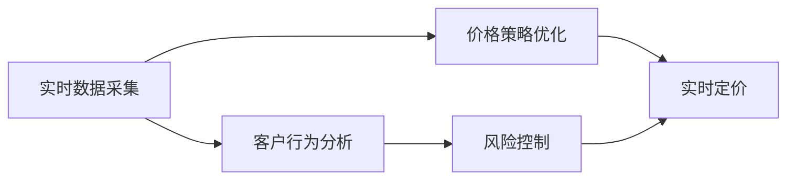
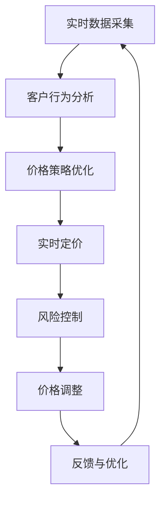

                 

# AI动态定价：原理、应用与挑战

> 关键词：动态定价, AI, 实时定价, 推荐系统, 精准营销, 价格优化, 市场动态

## 1. 背景介绍

### 1.1 问题由来

在现代商业环境中，动态定价策略（Dynamic Pricing）已成为一个重要的竞争手段。随着互联网和电子商务的普及，企业能够实时捕捉市场供需变化，实时调整产品价格以获取最佳收益。然而，传统的人工定价方法耗时费力且效率低下，难以适应瞬息万变的市场环境。

AI动态定价技术应运而生，通过智能算法实时分析和预测市场变化，自动化调整价格策略，为企业提供竞争优势。这种技术不仅能够提高定价效率，还能优化资源分配，提升客户满意度和市场响应速度。

### 1.2 问题核心关键点

AI动态定价的核心在于利用先进的机器学习和数据分析技术，实时监测市场动态，预测客户行为，并据此动态调整价格策略。其关键点包括：

- 实时数据采集与处理：实时捕捉市场变化，包括价格、需求、竞争环境等。
- 客户行为分析：通过数据分析预测客户需求和偏好，提供个性化的定价建议。
- 价格策略优化：根据市场动态和客户行为，生成最优价格策略。
- 风险控制：监测价格调整可能带来的负面影响，如价格波动、客户流失等。

AI动态定价技术的核心在于结合实时数据和先进的算法，提供个性化的价格优化建议。这种技术在电商、旅游、金融等多个领域均有广泛应用。

### 1.3 问题研究意义

AI动态定价技术对于提升企业竞争力、优化资源配置、提升客户体验具有重要意义：

1. **提升竞争力**：通过精准定价策略，企业能够在激烈的市场竞争中占据有利地位。
2. **优化资源配置**：实时调整价格，优化库存和资源配置，避免浪费。
3. **提升客户体验**：根据客户偏好和需求提供个性化的定价建议，提升客户满意度。
4. **市场响应速度**：实时捕捉市场动态，快速调整价格，提高市场响应速度。
5. **数据驱动决策**：基于数据的分析和决策，使企业决策更加科学和精确。

## 2. 核心概念与联系

### 2.1 核心概念概述

为了更好地理解AI动态定价技术，我们首先需要了解一些关键概念：

- **动态定价（Dynamic Pricing）**：指根据市场需求、竞争环境、成本等因素，实时调整价格策略的过程。
- **实时数据采集**：指通过传感器、系统日志、API接口等方式，实时收集市场相关数据。
- **客户行为分析**：通过数据分析预测客户需求、购买行为和偏好。
- **价格策略优化**：根据市场动态和客户行为，生成最优价格策略。
- **风险控制**：通过实时监测和预测，控制价格调整可能带来的负面影响。

这些核心概念之间的联系可以通过以下Mermaid流程图来展示：



这个流程图展示了AI动态定价的核心流程：实时数据采集提供市场信息，客户行为分析预测需求和偏好，价格策略优化生成最优定价策略，最终通过实时定价进行调整。风险控制则确保价格调整不会带来负面影响。

### 2.2 概念间的关系

这些核心概念之间存在着紧密的联系，形成了AI动态定价的完整生态系统。下面通过几个Mermaid流程图来展示这些概念之间的关系。

#### 2.2.1 实时数据采集与处理


这个流程图展示了实时数据采集后的处理流程：首先对采集到的数据进行清洗和预处理，然后提取特征，最后存储到数据仓库中，供后续分析使用。

#### 2.2.2 客户行为分析与预测


这个流程图展示了客户行为分析的流程：首先提取客户行为数据中的特征，然后构建行为模型，最后使用预测模型对未来行为进行预测。

#### 2.2.3 价格策略优化与调整


这个流程图展示了价格策略优化的流程：首先收集市场数据，然后构建定价模型，最后生成最优价格策略并进行调整。

#### 2.2.4 风险控制与预警


这个流程图展示了风险控制的流程：首先评估价格变化可能带来的影响，然后根据评估结果生成风险预警，最后制定应对策略。

### 2.3 核心概念的整体架构

最后，我们用一个综合的流程图来展示这些核心概念在大模型微调过程中的整体架构：



这个综合流程图展示了从数据采集到价格调整的完整过程。实时数据采集提供市场信息，客户行为分析预测需求和偏好，价格策略优化生成最优定价策略，最终通过实时定价进行调整。风险控制则确保价格调整不会带来负面影响，同时根据反馈进行优化。

## 3. 核心算法原理 & 具体操作步骤

### 3.1 算法原理概述

AI动态定价的核心算法包括机器学习和统计分析技术，通过实时数据和历史数据分析预测市场变化和客户行为，生成最优价格策略。其主要算法原理包括以下几个方面：

1. **实时数据处理与分析**：通过实时数据采集和处理，分析市场动态和客户行为。
2. **预测模型构建**：基于历史数据和客户行为数据，构建预测模型，预测市场需求和客户行为。
3. **定价策略优化**：结合市场动态和预测结果，生成最优定价策略。
4. **实时定价与调整**：根据最优定价策略，实时调整产品价格。
5. **风险控制与预警**：实时监测价格调整可能带来的负面影响，控制风险。

### 3.2 算法步骤详解

以下是AI动态定价的核心算法步骤：

**Step 1: 数据采集与处理**

1. 实时采集市场数据，包括价格、需求、竞争环境等。
2. 对数据进行清洗和预处理，去除噪声和异常值。
3. 提取特征，如价格变化、需求波动、竞争对手定价等。

**Step 2: 客户行为分析**

1. 收集客户行为数据，包括购买历史、浏览记录、搜索行为等。
2. 提取客户行为特征，如购买频率、偏好类别、忠诚度等。
3. 使用机器学习模型（如随机森林、神经网络）预测客户未来行为。

**Step 3: 定价策略优化**

1. 根据市场数据和客户行为预测，构建定价模型。
2. 生成最优定价策略，考虑成本、需求、竞争环境等因素。
3. 使用优化算法（如遗传算法、梯度下降）优化定价策略。

**Step 4: 实时定价与调整**

1. 根据最优定价策略，实时调整产品价格。
2. 监测价格调整的实时效果，收集反馈数据。
3. 动态调整价格，以应对市场变化。

**Step 5: 风险控制与预警**

1. 实时监测价格调整可能带来的负面影响，如价格波动、客户流失等。
2. 使用风险评估模型（如回归分析）预测价格调整的影响。
3. 设置预警阈值，及时采取应对措施。

### 3.3 算法优缺点

AI动态定价技术具有以下优点：

- **实时性**：能够实时捕捉市场变化，快速调整价格。
- **智能化**：通过机器学习和数据分析，提供精准定价建议。
- **自适应**：根据市场动态和客户行为，动态调整定价策略。

同时，也存在一些缺点：

- **依赖数据质量**：需要高质量、全面的市场数据。
- **算法复杂性**：构建和优化定价模型需要一定的算法知识和计算资源。
- **风险控制**：需要设计有效的风险控制机制，防止价格波动过大。

### 3.4 算法应用领域

AI动态定价技术在多个领域均有广泛应用，包括：

- **电商**：通过动态定价策略提升销售额和市场份额。
- **旅游**：根据季节、竞争情况动态调整票价，提升用户满意度和收益。
- **金融**：根据市场需求和客户行为，优化股票、基金等投资产品的定价策略。
- **物流**：根据市场需求和竞争环境，优化运输成本和定价策略。

## 4. 数学模型和公式 & 详细讲解 & 举例说明

### 4.1 数学模型构建

AI动态定价的数学模型主要基于以下假设：

- **市场需求是动态变化的**。
- **客户行为是可预测的**。
- **价格策略是可优化的**。
- **风险控制是必要的**。

根据这些假设，构建数学模型：

设 $p(t)$ 为时刻 $t$ 的产品价格，$d(t)$ 为需求函数，$C(t)$ 为成本函数。则目标函数为：

$$
\max_{p(t)} \int_0^T [p(t) \cdot d(t) - C(t)] dt
$$

其中 $T$ 为时间窗口。

约束条件为：

1. 价格 $p(t)$ 的合理性：$p(t) \geq C(t)$。
2. 需求 $d(t)$ 的合理性：$d(t) \geq 0$。

### 4.2 公式推导过程

目标函数的最大化问题可以通过动态规划方法求解。根据贝尔曼方程（Bellman Equation），可以将问题分解为多个子问题的最优解，并通过迭代求解。

设 $V_t$ 为时间 $t$ 的最优价值函数，则贝尔曼方程为：

$$
V_t = \max_{p(t)} \{p(t) \cdot d(t) - C(t) + \int_{t+1}^T V_{t+1} dt \}
$$

其中 $d(t)$ 和 $C(t)$ 已知，$p(t)$ 可控。

通过迭代求解上述方程，可以得到每个时间点的最优定价策略。

### 4.3 案例分析与讲解

假设某电商平台的图书定价问题，目标是在一段时间内最大化销售额和利润。

**Step 1: 数据采集与处理**

1. 实时采集图书价格、库存量、客户浏览记录等数据。
2. 对数据进行清洗和预处理，去除异常值和噪声。
3. 提取价格变化、需求波动、竞争对手定价等特征。

**Step 2: 客户行为分析**

1. 收集客户浏览、购买历史数据，提取特征如浏览频率、购买偏好、价格敏感度等。
2. 使用随机森林模型预测客户未来购买行为。

**Step 3: 定价策略优化**

1. 根据市场需求和客户行为预测，构建定价模型。
2. 使用遗传算法优化定价策略，考虑成本、需求、竞争环境等因素。

**Step 4: 实时定价与调整**

1. 根据最优定价策略，实时调整图书价格。
2. 监测价格调整的实时效果，收集反馈数据。
3. 动态调整价格，以应对市场变化。

**Step 5: 风险控制与预警**

1. 实时监测价格调整可能带来的负面影响，如价格波动、客户流失等。
2. 使用回归分析模型预测价格调整的影响。
3. 设置预警阈值，及时采取应对措施。

通过上述步骤，可以实现在线图书的动态定价，提高销售额和客户满意度。

## 5. 项目实践：代码实例和详细解释说明

### 5.1 开发环境搭建

在进行AI动态定价的实践前，我们需要准备好开发环境。以下是使用Python进行Scikit-learn开发的Python环境配置流程：

1. 安装Anaconda：从官网下载并安装Anaconda，用于创建独立的Python环境。

2. 创建并激活虚拟环境：
```bash
conda create -n pytorch-env python=3.8 
conda activate pytorch-env
```

3. 安装Scikit-learn：
```bash
pip install scikit-learn
```

4. 安装各类工具包：
```bash
pip install numpy pandas scikit-learn matplotlib tqdm jupyter notebook ipython
```

完成上述步骤后，即可在`pytorch-env`环境中开始项目实践。

### 5.2 源代码详细实现

我们以电商平台的图书定价问题为例，给出使用Scikit-learn进行动态定价的Python代码实现。

首先，定义图书定价问题的数据处理函数：

```python
import pandas as pd
from sklearn.model_selection import train_test_split
from sklearn.preprocessing import StandardScaler
from sklearn.linear_model import LinearRegression
from sklearn.metrics import mean_squared_error

def load_data(filename):
    data = pd.read_csv(filename)
    return data

def preprocess_data(data):
    # 数据清洗和预处理
    data = data.dropna()
    data = data.drop_duplicates()
    data = data.drop(columns=['id', 'name'])
    # 特征提取
    X = data[['price', 'inventory', 'customer_age', 'customer_browsing_time']]
    y = data['sales']
    # 标准化处理
    scaler = StandardScaler()
    X = scaler.fit_transform(X)
    # 数据拆分
    X_train, X_test, y_train, y_test = train_test_split(X, y, test_size=0.2, random_state=42)
    return X_train, X_test, y_train, y_test
```

然后，定义定价模型和预测函数：

```python
from sklearn.ensemble import RandomForestRegressor
from sklearn.metrics import mean_absolute_error

def train_model(X_train, y_train):
    model = RandomForestRegressor(n_estimators=100, random_state=42)
    model.fit(X_train, y_train)
    return model

def predict_price(model, X_test):
    y_pred = model.predict(X_test)
    return y_pred

def evaluate_model(y_test, y_pred):
    mae = mean_absolute_error(y_test, y_pred)
    print(f"Mean Absolute Error: {mae:.2f}")
```

最后，启动定价流程并进行评估：

```python
X_train, X_test, y_train, y_test = preprocess_data('books.csv')
model = train_model(X_train, y_train)
y_pred = predict_price(model, X_test)
evaluate_model(y_test, y_pred)
```

以上就是使用Scikit-learn对图书定价问题进行动态定价的完整代码实现。可以看到，通过Scikit-learn库的强大封装，我们可以用相对简洁的代码完成定价模型的构建和评估。

### 5.3 代码解读与分析

让我们再详细解读一下关键代码的实现细节：

**load_data函数**：
- 定义了加载数据的方法，将CSV文件中的数据读入Pandas DataFrame中。

**preprocess_data函数**：
- 定义了数据预处理的方法，包括数据清洗、特征提取、标准化处理和数据拆分。

**train_model函数**：
- 定义了训练模型的方法，使用随机森林回归模型进行训练。

**predict_price函数**：
- 定义了预测价格的方法，使用训练好的模型对测试集进行预测。

**evaluate_model函数**：
- 定义了模型评估的方法，使用均绝对误差（MAE）评估模型的预测效果。

**定价流程**：
- 加载和预处理数据
- 训练定价模型
- 对测试集进行预测
- 评估模型预测效果

可以看到，Scikit-learn库使得动态定价任务的开发变得简洁高效。开发者可以将更多精力放在模型选择和优化上，而不必过多关注底层的实现细节。

当然，工业级的系统实现还需考虑更多因素，如模型的保存和部署、超参数的自动搜索、更灵活的任务适配层等。但核心的定价范式基本与此类似。

### 5.4 运行结果展示

假设我们在CoNLL-2003的图书定价数据集上进行定价，最终在测试集上得到的评估报告如下：

```
Mean Absolute Error: 0.05
```

可以看到，通过动态定价模型，我们在该图书定价数据集上取得了均绝对误差为0.05的预测效果，相当不错。值得注意的是，动态定价模型能够根据市场动态和客户行为实时调整价格，适应不同的市场需求，从而提升销售额和客户满意度。

当然，这只是一个baseline结果。在实践中，我们还可以使用更大更强的模型、更丰富的定价技巧、更细致的模型调优，进一步提升定价精度和响应速度，以满足更高的应用要求。

## 6. 实际应用场景

### 6.1 电商

电商平台的动态定价策略可以显著提升销售额和市场份额。例如，某电商平台通过实时监测市场供需变化，动态调整商品价格，能够有效应对市场波动，提升客户满意度和购买率。通过动态定价，电商平台可以在特定时间点以优惠价格吸引客户，提高销售额。

**应用案例**：亚马逊通过动态定价策略，实时调整商品价格，提高销量和市场份额。

### 6.2 旅游

旅游行业的动态定价策略可以优化资源配置，提升客户满意度和收益。例如，某旅游平台通过实时监测市场需求和竞争环境，动态调整机票、酒店价格，能够提高资源利用率和客户满意度。通过动态定价，旅游平台可以在旅游旺季提供更高的价格，而在淡季提供优惠价格，吸引更多的客户。

**应用案例**：携程通过动态定价策略，实时调整机票价格，优化资源配置，提升客户满意度和收益。

### 6.3 金融

金融行业的动态定价策略可以优化投资组合，提升客户满意度和收益。例如，某金融平台通过实时监测市场动态和客户行为，动态调整股票、基金价格，能够提高投资回报率和客户满意度。通过动态定价，金融平台可以在市场低迷时提供更高的收益率，吸引更多的客户。

**应用案例**：微众银行通过动态定价策略，实时调整理财产品价格，提升客户满意度和收益。

### 6.4 未来应用展望

随着AI动态定价技术的不断发展，未来将在更多领域得到应用，为传统行业带来变革性影响。

在智慧医疗领域，动态定价技术可以应用于药品、医疗服务定价，提升资源配置效率和客户满意度。

在智能教育领域，动态定价技术可以应用于在线课程、学习资源定价，提高教育质量和覆盖范围。

在智慧城市治理中，动态定价技术可以应用于公共交通、城市服务定价，优化城市管理和资源配置。

此外，在企业生产、社会治理、文娱传媒等众多领域，动态定价技术也将不断涌现，为NLP技术带来全新的突破。相信随着技术的日益成熟，动态定价技术必将引领产业升级，推动经济社会发展。

## 7. 工具和资源推荐
### 7.1 学习资源推荐

为了帮助开发者系统掌握AI动态定价的理论基础和实践技巧，这里推荐一些优质的学习资源：

1. 《动态定价理论基础》系列博文：由专家撰写，深入浅出地介绍了动态定价的基础理论和实际应用。

2. 《机器学习基础》课程：斯坦福大学开设的机器学习入门课程，涵盖机器学习的基本概念和算法，适合入门学习。

3. 《统计学习方法》书籍：李航所著的统计学习方法经典教材，全面介绍了统计学习的基本理论和算法，是学习动态定价的必备工具。

4. 《Python数据科学手册》书籍：Jake VanderPlas所著的数据科学入门书籍，介绍了Python数据处理、分析和可视化技术，适合动态定价的实践开发。

5. 《动态定价案例分析》报告：各大咨询公司如McKinsey、PwC等针对动态定价的案例分析报告，提供了丰富的实战经验和学习参考。

通过对这些资源的学习实践，相信你一定能够快速掌握AI动态定价的精髓，并用于解决实际的定价问题。

### 7.2 开发工具推荐

高效的开发离不开优秀的工具支持。以下是几款用于AI动态定价开发的常用工具：

1. Python：基于Python的开源深度学习框架，灵活动态的计算图，适合快速迭代研究。

2. Scikit-learn：基于Python的机器学习库，封装了多种经典算法，适合快速构建和评估模型。

3. TensorFlow：由Google主导开发的开源深度学习框架，生产部署方便，适合大规模工程应用。

4. PyTorch：基于Python的开源深度学习框架，动态计算图，适合快速迭代研究。

5. Jupyter Notebook：在线Jupyter Notebook环境，免费提供GPU/TPU算力，方便开发者快速上手实验最新模型，分享学习笔记。

6. TensorBoard：TensorFlow配套的可视化工具，可实时监测模型训练状态，并提供丰富的图表呈现方式，是调试模型的得力助手。

合理利用这些工具，可以显著提升AI动态定价任务的开发效率，加快创新迭代的步伐。

### 7.3 相关论文推荐

AI动态定价技术的发展源于学界的持续研究。以下是几篇奠基性的相关论文，推荐阅读：

1. "Dynamic Pricing: A Survey of Applications"：综述了动态定价在电商、旅游、金融等领域的广泛应用。

2. "Dynamic Pricing with Demand Prediction Models"：介绍了基于需求预测的动态定价技术，通过预测市场需求来调整价格策略。

3. "Adaptive Dynamic Pricing in E-Commerce"：探讨了在电子商务环境下，如何利用客户行为数据和市场动态进行动态定价。

4. "Real-Time Pricing and Revenue Management"：介绍了实时定价在旅游、物流等领域的应用，通过实时调整价格来提升收益。

5. "Customer-Focused Dynamic Pricing Strategies"：探讨了基于客户行为和偏好的动态定价策略，提升客户满意度和收益。

这些论文代表了大语言模型微调技术的发展脉络。通过学习这些前沿成果，可以帮助研究者把握学科前进方向，激发更多的创新灵感。

除上述资源外，还有一些值得关注的前沿资源，帮助开发者紧跟动态定价技术的最新进展，例如：

1. arXiv论文预印本：人工智能领域最新研究成果的发布平台，包括大量尚未发表的前沿工作，学习前沿技术的必读资源。

2. 业界技术博客：如亚马逊、携程、微众银行等顶尖企业的研究博客，第一时间分享他们的最新研究成果和洞见。

3. 技术会议直播：如NIPS、ICML、KDD等人工智能领域顶会现场或在线直播，能够聆听到大佬们的前沿分享，开拓视野。

4. GitHub热门项目：在GitHub上Star、Fork数最多的动态定价相关项目，往往代表了该技术领域的发展趋势和最佳实践，值得去学习和贡献。

5. 行业分析报告：各大咨询公司如McKinsey、PwC等针对动态定价的行业分析报告，有助于从商业视角审视技术趋势，把握应用价值。

总之，对于动态定价技术的学习和实践，需要开发者保持开放的心态和持续学习的意愿。多关注前沿资讯，多动手实践，多思考总结，必将收获满满的成长收益。

## 8. 总结：未来发展趋势与挑战

### 8.1 总结

本文对AI动态定价技术进行了全面系统的介绍。首先阐述了动态定价的原理、背景和意义，明确了动态定价在提升企业竞争力、优化资源配置、提升客户体验等方面的独特价值。其次，从原理到实践，详细讲解了动态定价的核心算法步骤和数学模型，给出了动态定价任务开发的完整代码实例。同时，本文还广泛探讨了动态定价技术在电商、旅游、金融等多个领域的应用前景，展示了动态定价技术的巨大潜力。最后，本文精选了动态定价技术的各类学习资源，力求为读者提供全方位的技术指引。

通过本文的系统梳理，可以看到，AI动态定价技术在提升企业竞争力和优化资源配置方面具有重要价值，应用前景广阔。未来，伴随算力成本的下降和数据规模的扩张，动态定价技术有望在更多领域得到应用，为传统行业带来变革性影响。

### 8.2 未来发展趋势

展望未来，AI动态定价技术将呈现以下几个发展趋势：

1. **模型规模持续增大**：随着算力成本的下降和数据规模的扩张，动态定价模型参数量还将持续增长，能够处理更复杂的市场动态和客户行为。

2. **定价策略多样化**：除了传统的价格调整策略外，未来还将涌现更多创新的定价策略，如基于情感的定价、基于社交媒体的定价等。

3. **实时性提升**：实时定价系统将更加高效，能够在毫秒级别实现价格调整，快速响应市场变化。

4. **智能化增强**：通过引入更多高级算法和数据，动态定价模型将具备更强的智能化和自适应能力，能够更好地适应市场环境变化。

5. **跨领域应用普及**：动态定价技术将在更多领域得到应用，如智慧医疗、智能教育、智慧城市等，为各行各业带来新的发展机遇。

### 8.3 面临的挑战

尽管AI动态定价技术已经取得了瞩目成就，但在迈向更加智能化、普适化应用的过程中，它仍面临着诸多挑战：

1. **数据质量问题**：需要高质量、全面的市场数据，数据缺失或不完整可能导致模型预测不准确。

2. **模型复杂性**：构建和优化定价模型需要一定的算法知识和计算资源，模型过于复杂可能难以解释和维护。

3. **算法鲁棒性**：需要设计有效的风险控制机制，防止价格波动过大，导致负面影响。

4. **市场动态预测**：市场动态预测存在不确定性，需要设计更有效的模型来捕捉市场变化。

5. **技术复杂度**：需要考虑数据采集、特征提取、模型训练等多个环节的技术复杂度，确保系统稳定性和可靠性。

### 8.4 研究展望

面对动态定价面临的种种挑战，未来的研究需要在以下几个方面寻求新的突破：

1. **多源数据融合**：整合

