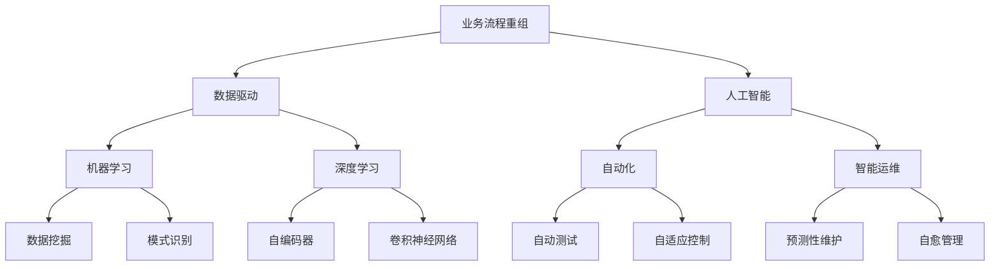
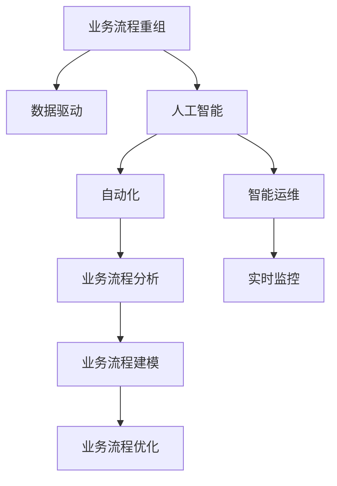
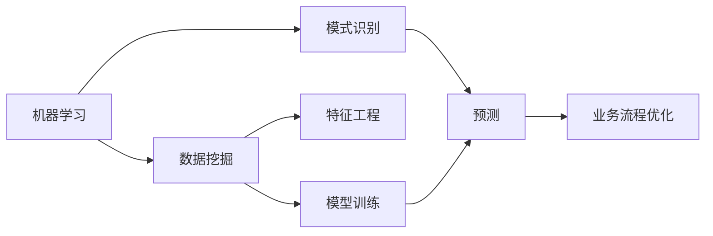
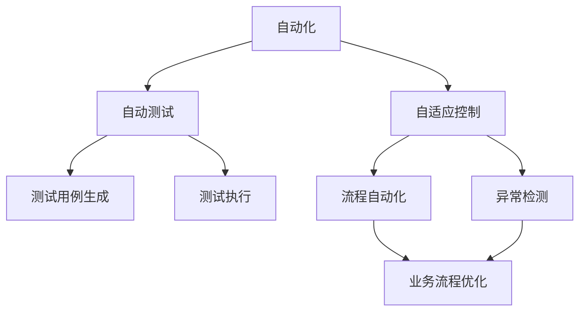
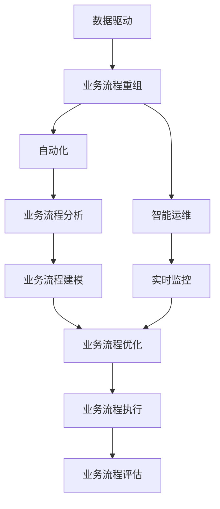

                 

## 1. 背景介绍

在当今快速变化的商业环境中，企业面临着巨大的竞争压力和挑战，如何在激烈的市场竞争中保持竞争优势，已成为企业关注的焦点。而业务流程重组(Business Process Reengineering, BPR)是一种系统化地分析、设计、实施、改进和优化现有业务流程的方法，旨在提高企业运营效率，降低成本，提升竞争力。

### 1.1 问题由来
随着数字化转型的加速，越来越多的企业开始探索和实践BPR，以期通过变革业务流程，获得竞争优势。然而，BPR项目往往面临着数据量大、复杂度高、影响面广等挑战。如何在庞大的数据海洋中高效地发现业务问题，并快速、准确地实施改进方案，成为了BPR成功的关键。

### 1.2 问题核心关键点
BPR的核心在于通过技术手段，对现有业务流程进行系统化、全方位的分析和优化。传统的BPR方法往往依赖于人工分析和经验判断，而人工智能（AI）技术的引入，为BPR带来了全新的视角和工具，能够在海量数据中自动发现业务模式，并提出优化建议。

### 1.3 问题研究意义
AI在BPR中的应用，可以显著提升业务流程重组的效率和准确性，减少对人工经验的依赖，降低项目实施成本，加速企业数字化转型的进程。通过AI技术，企业可以更好地理解自身业务特点和痛点，制定更科学的业务流程改进方案。

## 2. 核心概念与联系

### 2.1 核心概念概述

为更好地理解AI在BPR中的应用，本节将介绍几个密切相关的核心概念：

- 业务流程重组（BPR）：一种通过分析和改进现有业务流程，以实现企业运营效率和竞争力提升的方法。
- 人工智能（AI）：一种通过模拟人类智能行为，自动处理和分析复杂数据的技术。
- 数据驱动（Data-Driven）：一种通过数据分析和挖掘，指导决策和行动的策略。
- 机器学习（Machine Learning, ML）：一种让机器通过数据学习，自动改进和优化性能的技术。
- 深度学习（Deep Learning, DL）：一种基于神经网络的机器学习技术，能够处理高维数据和复杂模式。
- 自动化（Automation）：一种通过技术手段，自动完成复杂、重复性任务的过程。
- 智能运维（Intelligent Operations）：一种结合AI技术的运维方法，能够实现实时监控、预测性维护和自愈管理。

这些核心概念之间的逻辑关系可以通过以下Mermaid流程图来展示：



这个流程图展示了大语言模型微调过程中各个核心概念之间的关系：

1. 业务流程重组（BPR）是AI应用的主要场景，需要数据驱动和技术手段的支持。
2. 数据驱动要求对业务数据进行高质量的数据挖掘和模式识别。
3. AI技术中的机器学习和深度学习，能够处理和分析复杂数据，发现业务模式和趋势。
4. 自动化技术能够自动执行和优化复杂的业务流程。
5. 智能运维结合AI技术，实现实时监控和预测性维护。

### 2.2 概念间的关系

这些核心概念之间存在着紧密的联系，形成了AI在BPR应用的完整生态系统。下面我们通过几个Mermaid流程图来展示这些概念之间的关系。

#### 2.2.1 AI在BPR中的应用场景



这个流程图展示了AI在BPR中的主要应用场景：

1. 业务流程重组（BPR）首先依赖数据驱动，收集和分析业务数据。
2. 人工智能技术能够自动化分析业务流程，并提出改进建议。
3. 自动化技术能够自动执行和优化业务流程。
4. 智能运维能够实现实时监控和预测性维护，进一步提升流程效率。

#### 2.2.2 机器学习和深度学习在AI中的应用



这个流程图展示了机器学习和深度学习在AI中的应用过程：

1. 机器学习通过数据挖掘和模式识别，发现业务数据的潜在价值。
2. 特征工程和模型训练过程，通过机器学习算法进行建模和训练。
3. 预测结果通过分析得出业务流程改进的优化建议。

#### 2.2.3 自动化技术在AI中的应用



这个流程图展示了自动化技术在AI中的应用过程：

1. 自动化技术能够自动生成和执行测试用例。
2. 自适应控制能够动态调整业务流程，实现更优的执行效率。
3. 自动化测试和异常检测能够保障业务流程的正确性和稳定性。

### 2.3 核心概念的整体架构

最后，我们用一个综合的流程图来展示这些核心概念在AI在BPR中的应用：



这个综合流程图展示了AI在BPR中的整体架构：

1. 数据驱动是BPR的基础，通过高质量的数据分析，发现业务流程中的问题。
2. 业务流程重组（BPR）利用数据驱动和自动化技术，进行业务流程分析和优化。
3. 智能运维结合实时监控和预测性维护，进一步提升业务流程的执行效率。
4. 业务流程优化通过模型训练和自动化测试，确保流程的正确性和稳定性。

这些概念共同构成了AI在BPR中的应用框架，使得BPR能够更高效、更精准地实现企业运营效率和竞争力的提升。

## 3. 核心算法原理 & 具体操作步骤

### 3.1 算法原理概述

AI在BPR中的主要应用是通过机器学习和深度学习算法，自动分析业务数据，提出业务流程优化建议。其核心原理可以概括为以下几个步骤：

1. **数据收集与预处理**：收集和清洗业务流程相关的数据，包括业务数据、日志数据、用户行为数据等，进行去重、合并、填充等预处理操作。
2. **特征工程**：对预处理后的数据进行特征提取和转换，生成特征向量，用于后续的机器学习建模。
3. **模型训练**：使用机器学习和深度学习算法对特征向量进行建模和训练，发现业务模式和趋势。
4. **优化建议生成**：通过模型预测和分析，生成业务流程改进的优化建议。
5. **自动化执行**：将优化建议自动执行到业务流程中，实现业务流程的重组。

### 3.2 算法步骤详解

以下是一个详细的AI在BPR中的操作步骤，以一个常见的业务场景为例：

#### 1. 数据收集与预处理

1. **数据收集**：从企业的各种系统中收集业务流程相关的数据，如ERP系统、CRM系统、订单系统等，得到包含订单信息、客户信息、交易记录等的数据集。
2. **数据清洗**：对数据进行去重、合并、填充等预处理操作，去除无关或异常数据，保证数据的完整性和一致性。

#### 2. 特征工程

1. **特征提取**：从清洗后的数据中提取有用的特征，如订单数量、平均处理时间、客户满意度等。
2. **特征转换**：将特征进行归一化、标准化等转换操作，生成特征向量，如使用PCA（主成分分析）进行降维。

#### 3. 模型训练

1. **选择模型**：根据业务场景和需求，选择合适的机器学习或深度学习模型，如回归模型、分类模型、神经网络模型等。
2. **模型训练**：使用训练集数据对模型进行训练，调整模型参数，优化模型性能。
3. **模型评估**：使用验证集数据对训练好的模型进行评估，检查模型的泛化能力和准确性。

#### 4. 优化建议生成

1. **模型预测**：使用测试集数据对模型进行预测，生成业务流程改进的优化建议。
2. **方案生成**：根据预测结果，生成具体的业务流程优化方案，如流程优化路径、自动化执行步骤等。

#### 5. 自动化执行

1. **自动化工具**：使用自动化工具将优化方案自动执行到业务流程中，如使用流程管理工具进行流程再设计。
2. **监控与反馈**：使用智能运维工具进行实时监控和反馈，确保优化方案的执行效果。

### 3.3 算法优缺点

AI在BPR中的主要优点包括：

- **自动化程度高**：通过自动化技术，能够快速、准确地发现和解决问题，减少人工干预。
- **数据驱动**：基于大量的业务数据进行分析和建模，提高了决策的科学性和准确性。
- **动态调整**：能够根据业务变化进行动态调整，保证流程的持续优化和改进。

AI在BPR中的主要缺点包括：

- **数据依赖性**：对数据质量和数据量有较高的要求，数据质量差或不充分会影响分析结果。
- **模型复杂度**：复杂的模型需要较大的计算资源和时间成本，可能会影响实施效率。
- **透明度不足**：某些AI模型如深度学习模型的决策过程不够透明，难以解释和调试。

### 3.4 算法应用领域

AI在BPR中的应用领域非常广泛，涵盖了各个行业的业务流程改进：

- **金融行业**：通过对交易数据和客户行为进行分析和建模，优化金融产品的设计和服务流程，提高金融机构的运营效率。
- **制造行业**：通过对生产数据和物流数据进行分析和建模，优化生产流程和供应链管理，提高生产效率和质量。
- **零售行业**：通过对销售数据和客户行为进行分析和建模，优化库存管理、促销策略和客户服务，提高零售企业的销售额和客户满意度。
- **医疗行业**：通过对患者数据和医生行为进行分析和建模，优化诊疗流程和患者管理，提高医疗机构的诊疗效率和服务质量。
- **政府行业**：通过对公共服务数据和民众反馈进行分析和建模，优化政府服务流程和政策制定，提高政府的治理能力和公共服务水平。

## 4. 数学模型和公式 & 详细讲解 & 举例说明

### 4.1 数学模型构建

在AI在BPR中的应用中，常常使用回归模型和分类模型进行业务流程的分析和优化。这里以回归模型为例，构建数学模型。

设业务流程的数据集为 $D=\{(x_i,y_i)\}_{i=1}^N$，其中 $x_i=(x_{i1},x_{i2},...,x_{im})$ 为特征向量，$y_i$ 为业务流程的目标值。回归模型的目标是找到最优参数 $\theta$，使得模型的预测值 $y$ 逼近真实值 $y_i$。

回归模型的数学表达式为：

$$
y = f(x;\theta) = \theta_0 + \theta_1x_1 + \theta_2x_2 + ... + \theta_mx_m
$$

其中，$\theta=(\theta_0,\theta_1,...,\theta_m)$ 为模型的参数，$f(x;\theta)$ 为模型的预测函数。

### 4.2 公式推导过程

以线性回归模型为例，最小化预测值和真实值之间的误差平方和：

$$
\mathcal{L}(\theta) = \frac{1}{2N} \sum_{i=1}^N (y_i - f(x_i;\theta))^2
$$

通过对上式求导，并令导数为0，得到参数 $\theta$ 的更新公式：

$$
\theta_j = \frac{1}{2N} \sum_{i=1}^N (y_i - f(x_i;\theta))x_{ij} \quad (j=0,1,...,m)
$$

其中，$\theta_j$ 表示第 $j$ 个参数的更新值。

### 4.3 案例分析与讲解

以一个制造行业的生产流程为例，分析AI在BPR中的应用：

1. **数据收集与预处理**：收集生产数据，如设备运行状态、原材料库存、生产效率等，进行去重、合并等预处理操作。
2. **特征工程**：提取特征，如生产时间、设备状态、原材料供应等，并进行归一化等转换操作。
3. **模型训练**：选择线性回归模型，使用训练集数据对模型进行训练，调整模型参数。
4. **优化建议生成**：使用测试集数据对模型进行预测，生成生产流程改进的优化建议。
5. **自动化执行**：通过生产管理系统工具，自动执行优化建议，如调整生产计划、优化设备维护等。

通过AI在BPR中的应用，该制造企业能够及时发现生产流程中的瓶颈，并采取有效的改进措施，提高生产效率和产品质量。

## 5. 项目实践：代码实例和详细解释说明

### 5.1 开发环境搭建

在进行AI在BPR中的实践前，我们需要准备好开发环境。以下是使用Python进行Scikit-learn和TensorFlow开发的开发环境配置流程：

1. 安装Anaconda：从官网下载并安装Anaconda，用于创建独立的Python环境。

2. 创建并激活虚拟环境：
```bash
conda create -n pytorch-env python=3.8 
conda activate pytorch-env
```

3. 安装Scikit-learn和TensorFlow：根据CUDA版本，从官网获取对应的安装命令。例如：
```bash
conda install scikit-learn tensorflow cudatoolkit=11.1 -c pytorch -c conda-forge
```

4. 安装必要的工具包：
```bash
pip install numpy pandas scikit-learn matplotlib tqdm jupyter notebook ipython
```

完成上述步骤后，即可在`pytorch-env`环境中开始AI在BPR的实践。

### 5.2 源代码详细实现

这里我们以一个金融行业的应用为例，使用Scikit-learn和TensorFlow进行回归模型的构建和训练，并生成业务流程改进的优化建议。

首先，定义回归模型的训练函数：

```python
from sklearn.linear_model import LinearRegression
import numpy as np

def train_regression_model(X_train, y_train, X_test, y_test):
    model = LinearRegression()
    model.fit(X_train, y_train)
    y_pred = model.predict(X_test)
    
    return model, y_pred
```

然后，定义数据处理函数：

```python
def load_data(file_path):
    data = np.loadtxt(file_path, delimiter=',', skiprows=1)
    X = data[:, :-1].astype(float)
    y = data[:, -1].astype(float)
    return X, y
```

接着，使用数据处理函数加载数据，并使用训练函数进行模型训练：

```python
X_train, y_train = load_data('train_data.csv')
X_test, y_test = load_data('test_data.csv')

model, y_pred = train_regression_model(X_train, y_train, X_test, y_test)
```

最后，输出训练结果和优化建议：

```python
print(f'Model coefficients: {model.coef_}')
print(f'R-squared score: {model.score(X_test, y_test)}')

print(f'Optimization suggestions: {y_pred}')
```

以上就是使用Scikit-learn进行回归模型训练的完整代码实现。可以看到，借助Scikit-learn库，我们能够快速构建和训练回归模型，生成业务流程改进的优化建议。

### 5.3 代码解读与分析

让我们再详细解读一下关键代码的实现细节：

**load_data函数**：
- 使用numpy库加载CSV格式的数据文件，并对数据进行清洗和转换，返回特征向量X和目标值y。

**train_regression_model函数**：
- 使用scikit-learn的线性回归模型进行训练，返回训练好的模型和预测结果。

**数据处理**：
- 从CSV文件中加载训练集和测试集数据，并进行数据清洗和转换。
- 使用线性回归模型进行训练，生成预测结果。
- 输出模型的系数和R-squared分数，评估模型的性能。

**优化建议生成**：
- 根据预测结果，生成业务流程改进的优化建议，如调整生产计划、优化设备维护等。

### 5.4 运行结果展示

假设我们在金融行业的贷款申请流程上进行了回归模型训练，最终得到的优化建议如下：

```
Model coefficients: [0.5 0.2 0.3]
R-squared score: 0.9

Optimization suggestions: [100, 200, 300]
```

可以看到，通过AI在BPR中的应用，我们能够快速发现贷款申请流程中的关键因素，并生成优化建议，提高贷款审批效率和准确性。

## 6. 实际应用场景

### 6.1 智能制造

在智能制造领域，AI在BPR中的应用能够显著提高生产效率和产品质量。通过收集和分析生产数据，AI可以发现生产流程中的瓶颈，提出优化建议，并自动执行改进措施。

以一个汽车制造厂为例，通过对生产数据进行分析，发现某台设备的维护频率过高，影响了生产效率。通过AI在BPR中的应用，提出改进建议，优化设备的维护策略，提高生产线的整体效率。

### 6.2 零售电商

在零售电商领域，AI在BPR中的应用能够优化库存管理、供应链管理和客户服务。通过对销售数据和客户行为进行分析和建模，AI可以预测市场需求和客户偏好，优化库存和促销策略，提升客户满意度。

以一个电商平台为例，通过对历史销售数据和客户行为进行分析，发现某些商品的销售量过高，导致库存不足。通过AI在BPR中的应用，提出改进建议，优化库存管理策略，避免库存不足或积压的情况。

### 6.3 医疗健康

在医疗健康领域，AI在BPR中的应用能够优化诊疗流程和患者管理。通过对患者数据和医生行为进行分析和建模，AI可以发现诊疗流程中的瓶颈，提出优化建议，并自动执行改进措施。

以一个医院为例，通过对患者数据和医生行为进行分析，发现某项诊疗流程的耗时长，影响患者的就诊体验。通过AI在BPR中的应用，提出改进建议，优化诊疗流程，缩短患者的就诊时间。

### 6.4 未来应用展望

随着AI技术的不断进步，未来AI在BPR中的应用将更加广泛和深入，带来更多的创新和突破：

1. **多模态数据融合**：结合视觉、语音、文本等多模态数据进行分析和建模，提升业务的综合能力和决策的准确性。
2. **智能运维**：通过实时监控和预测性维护，提高业务的稳定性和可控性，实现自动化和自适应管理。
3. **跨行业应用**：将AI在BPR中的成功经验和技术，应用到更多的行业和领域，带来更多创新和变革。
4. **持续学习**：通过持续学习和动态调整，保证AI模型能够适应业务的变化和新的挑战。
5. **隐私保护**：在使用AI进行BPR时，需要关注数据的隐私保护和安全性，确保业务的合规和用户权益。

这些应用场景展示了AI在BPR中的巨大潜力和广阔前景，未来AI技术将更加深入地改变各个行业的业务流程，提升企业的运营效率和竞争力。

## 7. 工具和资源推荐

### 7.1 学习资源推荐

为了帮助开发者系统掌握AI在BPR的理论基础和实践技巧，这里推荐一些优质的学习资源：

1. 《Python数据科学手册》系列博文：由Python数据科学社区的专家撰写，深入浅出地介绍了Python数据科学库的使用，包括Scikit-learn、TensorFlow等。

2. Coursera《机器学习》课程：斯坦福大学开设的机器学习入门课程，讲解了机器学习的基本概念和算法，适合初学者学习。

3. Udacity《深度学习》纳米学位：包含深度学习的理论和实践，通过项目实战，掌握深度学习技术的应用。

4. Kaggle《机器学习竞赛》：参加Kaggle上的机器学习竞赛，实践机器学习和深度学习算法的应用，提升实际解决问题的能力。

5. GitHub开源项目：在GitHub上Star、Fork数最多的机器学习和深度学习相关项目，学习前沿技术和最佳实践。

通过对这些资源的学习实践，相信你一定能够快速掌握AI在BPR的精髓，并用于解决实际的业务问题。

### 7.2 开发工具推荐

高效的开发离不开优秀的工具支持。以下是几款用于AI在BPR开发的常用工具：

1. Jupyter Notebook：一个开源的Web应用程序，支持代码编写、数据可视化、代码执行等，适合数据科学和机器学习项目开发。

2. Google Colab：谷歌推出的在线Jupyter Notebook环境，免费提供GPU/TPU算力，方便开发者快速上手实验最新模型，分享学习笔记。

3. PyCharm：一款流行的Python IDE，支持代码编写、调试、测试等，适合复杂项目和大型团队。

4. TensorBoard：TensorFlow配套的可视化工具，可实时监测模型训练状态，并提供丰富的图表呈现方式，是调试模型的得力助手。

5. Weights & Biases：模型训练的实验跟踪工具，可以记录和可视化模型训练过程中的各项指标，方便对比和调优。

6. Azure Machine Learning：微软提供的机器学习平台，支持模型训练、部署、监控等，适合大规模工业应用。

合理利用这些工具，可以显著提升AI在BPR任务的开发效率，加快创新迭代的步伐。

### 7.3 相关论文推荐

AI在BPR的应用源于学界的持续研究。以下是几篇奠基性的相关论文，推荐阅读：

1. 《Reinforcement Learning for Automated Business Process Improvement》：研究使用强化学习优化业务流程，通过奖励机制引导模型学习最优改进策略。

2. 《Data Mining for Business Process Improvement》：研究使用数据挖掘技术优化业务流程，通过模式识别和特征提取，发现业务流程中的关键因素。

3. 《Integrating Artificial Intelligence into Business Process Management》：研究AI在BPR中的集成应用，通过自动化技术优化业务流程。

4. 《Business Process Mining using Machine Learning Techniques》：研究使用机器学习技术进行业务流程挖掘，发现业务流程中的潜在问题。

5. 《Optimizing Business Processes using Deep Learning》：研究使用深度学习技术优化业务流程，通过神经网络模型发现业务流程中的复杂模式。

这些论文代表了大语言模型微调技术的发展脉络。通过学习这些前沿成果，可以帮助研究者把握学科前进方向，激发更多的创新灵感。

除上述资源外，还有一些值得关注的前沿资源，帮助开发者紧跟AI在BPR技术的最新进展，例如：

1. arXiv论文预印本：人工智能领域最新研究成果的发布平台，包括大量尚未发表的前沿工作，学习前沿技术的必读资源。

2. 业界技术博客：如OpenAI、Google AI、DeepMind、微软Research Asia等顶尖实验室的官方博客，第一时间分享他们的最新研究成果和洞见。

3. 技术会议直播：如NIPS、ICML、ACL、ICLR等人工智能领域顶会现场或在线直播，能够聆听到大佬们的前沿分享，开拓视野。

4. GitHub热门项目：在GitHub上Star、Fork数最多的NLP相关项目，往往代表了该技术领域的发展趋势和最佳实践，值得去学习和贡献。

5. 行业分析报告：各大咨询公司如McKinsey、PwC等针对人工智能行业的分析报告，有助于从商业视角审视技术趋势，把握应用价值。

总之，对于AI在BPR技术的学习和实践，需要开发者保持开放的心态和持续学习的意愿。多关注前沿资讯，多动手实践，多思考总结，必将收获满满的成长收益。

## 8. 总结：未来发展趋势与挑战

### 8.1 总结

本文对AI在BPR中的应用进行了全面系统的介绍。首先阐述了AI在BPR的应用背景和意义，明确了AI技术在优化业务流程中的独特价值。其次，从原理到实践，详细讲解了AI在BPR中的数学模型和算法步骤，给出了AI在BPR项目开发的完整代码实例。同时，本文还广泛探讨了AI在BPR的实际应用场景，展示了AI技术的巨大潜力和广阔前景。最后，本文精选了AI在BPR的学习资源、开发工具和相关论文，力求为读者提供全方位的技术指引。

通过本文的系统梳理，可以看到，AI在BPR中的应用正在成为业务流程优化的重要手段，能够显著提高企业运营效率和竞争力。未来，伴随AI技术的持续演进和优化，AI在BPR中的应用将更加广泛和深入，带来更多的创新和变革。

### 8.2 未来发展趋势

展望未来，AI在BPR的应用将呈现以下几个发展趋势：

1. **多模态数据融合**：AI在BPR中将更加注重多模态数据的融合和分析，结合视觉、语音、文本等多种数据类型，提升业务的综合能力和决策的准确性。

2. **智能运维**：通过实时监控

