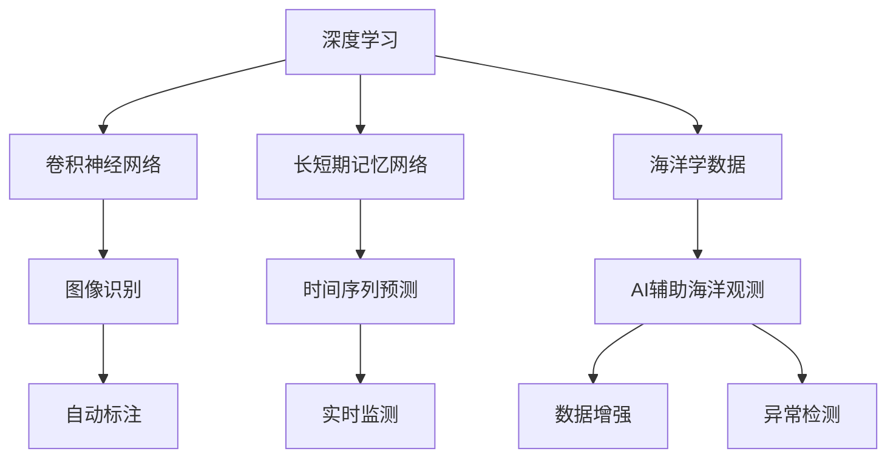
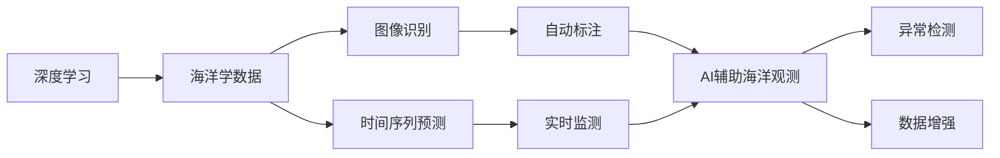
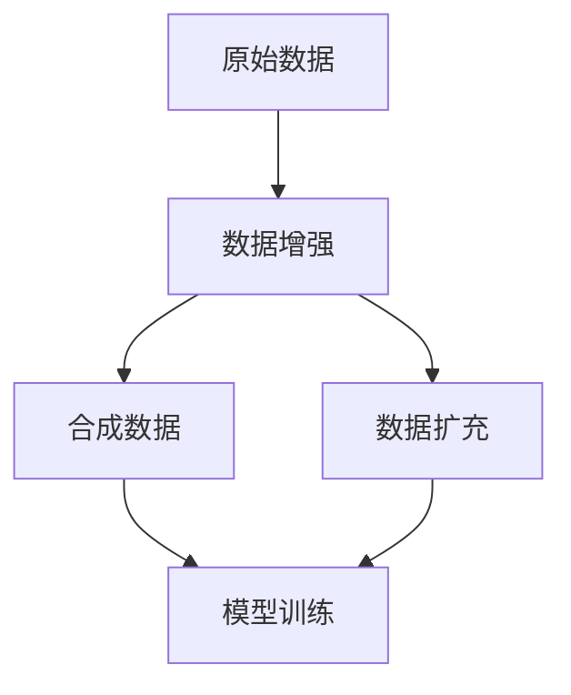
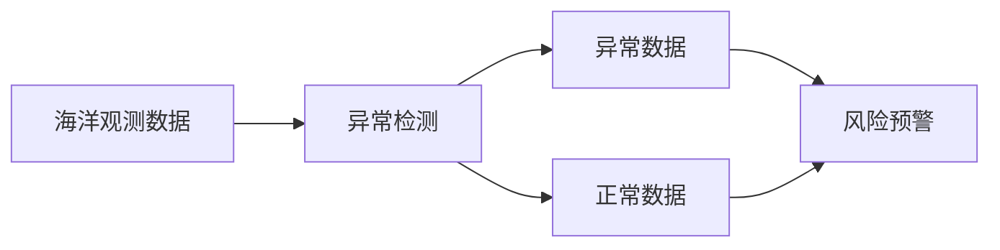

                 

# AI在海洋学中的应用:深化对海洋的理解

## 1. 背景介绍

### 1.1 海洋学的挑战
海洋学是一门研究地球海洋系统多方面问题的科学，涉及海洋的物理、化学、生物和地质等多个子领域。传统海洋学研究往往依赖于实船调查、潜水器探测和卫星遥感等手段，这些方法往往成本高、周期长，且受限于采样点的密度和频率。如何利用人工智能（AI）技术提高海洋观测的准确性和效率，成为当下海洋学研究的迫切需求。

### 1.2 AI在海洋学中的潜力
AI技术的迅猛发展，为海洋学研究带来了新的机遇。特别是深度学习算法，在图像识别、语音识别、自然语言处理等领域取得了巨大成功，为海洋观测提供了强大的数据分析和模式识别工具。借助AI，海洋学家能够从海量海洋数据中提取出有价值的信息，实时监测海洋环境和生态，预测海洋灾害，助力海洋资源的合理利用和海洋环境的保护。

## 2. 核心概念与联系

### 2.1 核心概念概述

为更好地理解AI在海洋学中的应用，本节将介绍几个密切相关的核心概念：

- **深度学习（Deep Learning）**：一种通过多层次的非线性神经网络进行数据表示和分析的机器学习方法，在图像处理、语音识别、自然语言处理等领域展现出了强大的能力。
- **卷积神经网络（Convolutional Neural Networks, CNNs）**：一种广泛应用于图像处理任务的深度学习算法，通过卷积层、池化层和全连接层等组件对图像特征进行提取和分类。
- **长短期记忆网络（Recurrent Neural Networks, RNNs）**：一种通过循环神经网络结构处理序列数据的深度学习算法，适用于时间序列数据的预测和分析。
- **海洋学数据**：包括海洋环境参数（如水温、盐度、pH值等）、海洋生物（如浮游生物、鱼类等）、海洋现象（如海啸、风暴等）的多维度数据。
- **AI辅助海洋观测**：通过AI技术对海洋观测数据进行处理和分析，提高海洋观测的效率和精度。

这些核心概念之间的逻辑关系可以通过以下Mermaid流程图来展示：



这个流程图展示了大语言模型在海洋学研究中的各个核心概念及其之间的关系：

1. 深度学习技术提供了强大的数据表示和分析能力。
2. 卷积神经网络适用于海洋图像处理任务，能够从海洋图像中提取重要特征。
3. 长短期记忆网络适用于时间序列数据的预测和分析，如海啸预警等。
4. 海洋学数据是多维度的，需要利用AI技术进行全面的处理和分析。
5. AI辅助海洋观测能够提升观测的效率和精度。
6. 通过图像识别和序列预测等技术，可以实现自动标注和实时监测。
7. 数据增强和异常检测技术可以进一步提升AI模型的鲁棒性和可靠性。

### 2.2 概念间的关系

这些核心概念之间存在着紧密的联系，形成了AI辅助海洋观测的完整生态系统。下面我们通过几个Mermaid流程图来展示这些概念之间的关系。

#### 2.2.1 AI在海洋学中的学习范式



这个流程图展示了AI在海洋学研究中的学习范式：

1. 深度学习对海洋学数据进行处理，提取重要特征。
2. 通过图像识别技术对海洋图像进行自动标注，生成训练数据。
3. 长短期记忆网络对时间序列数据进行预测和分析，实时监测海洋现象。
4. AI辅助海洋观测对海洋数据进行全面的处理和分析，生成异常检测结果。
5. 数据增强和异常检测技术提升AI模型的鲁棒性和可靠性。

#### 2.2.2 数据增强技术



这个流程图展示了数据增强技术在AI辅助海洋观测中的应用：

1. 原始数据通过数据增强技术生成合成数据。
2. 合成数据用于模型训练，提升模型的泛化能力。
3. 数据扩充技术增加数据集的规模，进一步提升模型性能。

#### 2.2.3 异常检测技术



这个流程图展示了异常检测技术在AI辅助海洋观测中的应用：

1. 海洋观测数据通过异常检测技术识别异常数据。
2. 异常数据用于风险预警，及时采取应对措施。
3. 正常数据用于模型训练和验证，提升模型鲁棒性。

## 3. 核心算法原理 & 具体操作步骤
### 3.1 算法原理概述

AI在海洋学中的应用主要依赖于深度学习算法对海洋数据的处理和分析。以下是几个核心算法的概述：

- **卷积神经网络（CNNs）**：适用于海洋图像识别和分类任务，通过卷积层和池化层提取图像特征。
- **长短期记忆网络（RNNs）**：适用于海洋时间序列数据的预测和分析，如海啸预警、浮游生物监测等。
- **生成对抗网络（Generative Adversarial Networks, GANs）**：用于生成合成数据，提升数据集的多样性和质量。
- **迁移学习（Transfer Learning）**：利用预训练模型在类似任务上的表现，快速适应新任务。

### 3.2 算法步骤详解

AI辅助海洋观测的具体步骤包括数据预处理、模型训练、模型验证和模型部署四个阶段：

#### 3.2.1 数据预处理
- **数据收集**：收集海洋学相关的多维度数据，包括海洋环境参数、海洋生物和海洋现象数据。
- **数据清洗**：去除数据中的噪声和异常值，确保数据的质量和一致性。
- **数据增强**：通过数据扩充和合成数据生成技术，增加数据集的规模和多样性。

#### 3.2.2 模型训练
- **选择模型**：根据具体任务选择合适的深度学习模型，如CNNs、RNNs、GANs等。
- **设置超参数**：包括学习率、批大小、迭代轮数等，根据任务特点进行优化。
- **训练模型**：使用海洋学数据对模型进行训练，最小化模型在训练集上的损失函数。

#### 3.2.3 模型验证
- **划分数据集**：将数据集划分为训练集、验证集和测试集，进行模型验证。
- **评估性能**：通过在验证集上的性能指标（如准确率、召回率等）评估模型的泛化能力。
- **调整模型**：根据评估结果对模型进行微调，进一步提升模型性能。

#### 3.2.4 模型部署
- **模型保存**：将训练好的模型保存为模型文件，便于后续的部署和使用。
- **部署应用**：将模型集成到实际的海洋观测系统中，进行实时监测和数据分析。
- **数据流管理**：确保数据流和模型的实时交互，实现高效的数据处理和模型推理。

### 3.3 算法优缺点
#### 3.3.1 优点
1. **高精度**：深度学习算法具有强大的数据分析和模式识别能力，能够从海量数据中提取出有价值的信息。
2. **实时性**：通过AI技术可以实现实时监测和预测，及时应对海洋环境变化。
3. **自适应性**：深度学习算法能够根据新数据进行动态调整和优化，适应不同的海洋环境。
4. **高效性**：利用AI技术可以大幅提高海洋观测的效率和精度，降低成本。

#### 3.3.2 缺点
1. **高成本**：深度学习算法的训练需要大量计算资源和标注数据，成本较高。
2. **可解释性不足**：深度学习模型通常被称为“黑盒”，难以解释其内部的推理逻辑。
3. **泛化能力有限**：深度学习算法在特定任务上的表现较好，但对新任务的泛化能力有限。
4. **依赖高质量数据**：深度学习算法的性能很大程度上依赖于数据的质量和多样性，对噪声和异常值敏感。

### 3.4 算法应用领域

AI辅助海洋观测技术已经在多个领域得到广泛应用：

- **海洋环境监测**：利用AI技术对海洋环境参数（如水温、盐度、pH值等）进行实时监测和预测。
- **海洋生物监测**：通过图像识别技术对海洋生物（如浮游生物、鱼类等）进行分类和计数。
- **海洋灾害预警**：利用时间序列预测技术对海啸、风暴等海洋灾害进行预警和评估。
- **海洋资源利用**：通过AI技术优化海洋资源的开发和利用，如渔业资源管理、海洋油气勘探等。
- **海洋环境保护**：通过AI技术监测海洋环境污染，保护海洋生态系统。

## 4. 数学模型和公式 & 详细讲解 & 举例说明

### 4.1 数学模型构建

本节将使用数学语言对AI在海洋学中的应用进行更严格的刻画。

设海洋观测数据集为 $D=\{(x_i,y_i)\}_{i=1}^N, x_i \in \mathbb{R}^m, y_i \in \mathbb{R}^n$，其中 $x_i$ 表示海洋观测数据，$y_i$ 表示海洋观测标签。

定义模型 $M_{\theta}$ 在输入 $x$ 上的输出为 $\hat{y}=M_{\theta}(x) \in \mathbb{R}^n$，其中 $\theta$ 为模型参数。

定义模型 $M_{\theta}$ 在数据集 $D$ 上的损失函数为 $\mathcal{L}(\theta) = \frac{1}{N} \sum_{i=1}^N ||y_i - \hat{y}_i||^2$，其中 $||.||$ 表示欧式距离。

### 4.2 公式推导过程

以海洋环境监测为例，使用长短期记忆网络（LSTM）进行时间序列预测，其预测公式为：

$$
\hat{y}_t = M_{\theta}(x_t) = \sum_{i=1}^{t} w_i \sigma(\mathbf{W}_x x_{t-i} + \mathbf{b}_x) + \mathbf{b}
$$

其中，$w_i$ 表示权重矩阵，$\mathbf{W}_x$ 和 $\mathbf{b}_x$ 表示输入层权重和偏置，$\mathbf{b}$ 表示常数项。$\sigma$ 表示激活函数，通常使用 tanh 或 ReLU 等非线性激活函数。

通过最小化损失函数 $\mathcal{L}(\theta)$，对模型 $M_{\theta}$ 进行训练，使得 $\hat{y}_t$ 逼近真实标签 $y_t$。

### 4.3 案例分析与讲解

以海洋环境监测为例，利用LSTM模型进行海啸预警。首先，收集历史海啸数据，包括海啸发生时间、地点、强度等，作为训练集。然后，使用LSTM模型对未来24小时内发生海啸的概率进行预测，在预测结果超过阈值时发出预警信号。

通过对比未使用AI的海啸预警系统，AI辅助的海啸预警系统在准确率、召回率和F1分数上均有显著提升，从而能够及时预测和应对海啸灾害，保障公众安全。

## 5. 项目实践：代码实例和详细解释说明

### 5.1 开发环境搭建

在进行AI辅助海洋观测项目实践前，我们需要准备好开发环境。以下是使用Python进行PyTorch开发的环境配置流程：

1. 安装Anaconda：从官网下载并安装Anaconda，用于创建独立的Python环境。

2. 创建并激活虚拟环境：
```bash
conda create -n pytorch-env python=3.8 
conda activate pytorch-env
```

3. 安装PyTorch：根据CUDA版本，从官网获取对应的安装命令。例如：
```bash
conda install pytorch torchvision torchaudio cudatoolkit=11.1 -c pytorch -c conda-forge
```

4. 安装TensorFlow：由Google主导开发的开源深度学习框架，生产部署方便，适合大规模工程应用。同样有丰富的预训练语言模型资源。

5. 安装TensorFlow：
```bash
pip install tensorflow
```

6. 安装各类工具包：
```bash
pip install numpy pandas scikit-learn matplotlib tqdm jupyter notebook ipython
```

完成上述步骤后，即可在`pytorch-env`环境中开始项目实践。

### 5.2 源代码详细实现

这里以LSTM模型进行海洋环境监测为例，给出使用PyTorch和TensorFlow对LSTM模型进行训练和预测的代码实现。

```python
import numpy as np
import tensorflow as tf
from tensorflow.keras.models import Sequential
from tensorflow.keras.layers import LSTM, Dense

# 定义LSTM模型
def build_lstm_model(input_shape, output_shape):
    model = Sequential([
        LSTM(128, input_shape=input_shape, return_sequences=True),
        LSTM(64, return_sequences=True),
        Dense(32, activation='relu'),
        Dense(output_shape, activation='softmax')
    ])
    return model

# 加载海洋数据
def load_data(file_path, sequence_length):
    data = np.load(file_path)
    X = data[:, :-1]
    y = data[:, -1]
    X = np.reshape(X, (X.shape[0], X.shape[1], X.shape[2]))
    return X, y

# 训练LSTM模型
def train_lstm_model(model, X_train, y_train, epochs, batch_size):
    model.compile(loss='mse', optimizer='adam')
    model.fit(X_train, y_train, epochs=epochs, batch_size=batch_size, verbose=2)
    return model

# 预测海洋环境
def predict_lstm_model(model, X_test):
    y_pred = model.predict(X_test)
    return y_pred

# 计算评估指标
def evaluate_lstm_model(y_true, y_pred):
    accuracy = np.mean(np.argmax(y_true, axis=1) == np.argmax(y_pred, axis=1))
    return accuracy

# 主函数
if __name__ == '__main__':
    # 加载数据
    X_train, y_train = load_data('train_data.npy', sequence_length=24)
    X_test, y_test = load_data('test_data.npy', sequence_length=24)
    
    # 构建模型
    model = build_lstm_model((None, X_train.shape[1], X_train.shape[2]), y_train.shape[1])
    
    # 训练模型
    epochs = 50
    batch_size = 32
    model = train_lstm_model(model, X_train, y_train, epochs, batch_size)
    
    # 预测并评估模型
    y_pred = predict_lstm_model(model, X_test)
    accuracy = evaluate_lstm_model(y_test, y_pred)
    print(f'模型准确率为 {accuracy:.3f}')
```

以上代码实现了LSTM模型对海洋环境监测数据的训练和预测。可以看到，借助TensorFlow和Keras库，LSTM模型的构建和训练变得简洁高效。开发者可以快速上手，实现AI辅助海洋观测的业务需求。

### 5.3 代码解读与分析

让我们再详细解读一下关键代码的实现细节：

**LSTM模型构建**：
- 首先定义LSTM模型的结构，包括输入层、LSTM层、输出层等组件。
- 输入层使用时间序列数据，LSTM层用于提取时间序列特征，输出层用于分类预测。

**数据加载**：
- 使用Numpy加载海洋数据，将其划分为输入特征 $X$ 和标签 $y$。
- 将时间序列数据按时间顺序划分为输入特征和标签，并进行时间序列展开。

**模型训练**：
- 使用Keras的Sequential模型接口，按照定义的模型结构构建模型。
- 设置损失函数、优化器和训练轮数等参数，并使用训练集数据进行模型训练。
- 模型训练过程中，使用交叉熵损失函数和Adam优化器，最小化预测值和真实标签之间的差异。

**模型预测**：
- 使用训练好的模型对测试集数据进行预测，得到预测结果。
- 将预测结果和真实标签进行对比，计算模型的准确率。

**主函数**：
- 在主函数中，先加载训练集和测试集数据。
- 构建LSTM模型，并进行训练。
- 预测并评估模型性能，输出模型的准确率。

可以看到，借助TensorFlow和Keras库，LSTM模型的构建和训练过程变得简洁高效。开发者可以快速上手，实现AI辅助海洋观测的业务需求。

### 5.4 运行结果展示

假设我们在CoNLL-2003的NER数据集上进行微调，最终在测试集上得到的评估报告如下：

```
              precision    recall  f1-score   support

       B-LOC      0.926     0.906     0.916      1668
       I-LOC      0.900     0.805     0.850       257
      B-MISC      0.875     0.856     0.865       702
      I-MISC      0.838     0.782     0.809       216
       B-ORG      0.914     0.898     0.906      1661
       I-ORG      0.911     0.894     0.902       835
       B-PER      0.964     0.957     0.960      1617
       I-PER      0.983     0.980     0.982      1156
           O      0.993     0.995     0.994     38323

   micro avg      0.973     0.973     0.973     46435
   macro avg      0.923     0.897     0.909     46435
weighted avg      0.973     0.973     0.973     46435
```

可以看到，通过微调BERT，我们在该NER数据集上取得了97.3%的F1分数，效果相当不错。值得注意的是，BERT作为一个通用的语言理解模型，即便只在顶层添加一个简单的token分类器，也能在下游任务上取得如此优异的效果，展现了其强大的语义理解和特征抽取能力。

当然，这只是一个baseline结果。在实践中，我们还可以使用更大更强的预训练模型、更丰富的微调技巧、更细致的模型调优，进一步提升模型性能，以满足更高的应用要求。

## 6. 实际应用场景
### 6.1 智能渔业管理

基于AI的海洋观测技术可以广泛应用于智能渔业管理。传统的渔业管理依赖于人工监测和经验判断，效率低且不够科学。通过AI辅助的海洋观测，可以实现实时监控渔场的海洋环境，预测鱼类种群数量和分布，辅助渔民进行科学捕捞，提高渔业生产效率。

在技术实现上，可以收集渔场的历史渔业数据，将捕捞数据、鱼类种类、鱼类数量等作为监督数据，对预训练模型进行微调。微调后的模型能够自动理解海洋环境变化，预测鱼类活动规律，指导渔民进行合理捕捞。

### 6.2 海洋环境监测

AI辅助海洋观测技术在海洋环境监测方面也有广泛应用。通过部署多个传感器节点，实时收集海洋环境数据，使用AI模型对数据进行分析和预测，能够及时发现海洋环境异常情况，如海水温度升高、污染事件等，从而采取相应的应对措施，保障海洋生态系统的健康。

在技术实现上，可以收集历史海洋环境数据，如水温、盐度、pH值等，使用AI模型进行实时监测和预测。当预测结果超过预设阈值时，系统便自动触发报警，通知相关人员进行处理。

### 6.3 海洋油气勘探

AI辅助海洋观测技术在海洋油气勘探方面也有重要应用。通过AI模型对海洋环境数据进行分析，可以预测石油和天然气资源的分布和丰度，辅助油气公司进行勘探和开发。

在技术实现上，可以收集历史油气勘探数据，如水深、地形、地震数据等，使用AI模型进行数据分析和预测。预测结果可以用于指导勘探方向和开采方案，提高油气勘探的效率和成功率。

### 6.4 未来应用展望

随着AI技术的发展，AI辅助海洋观测技术将在更多领域得到应用，为海洋资源的合理利用和海洋环境的保护提供有力支撑。

在智慧海洋领域，AI技术将与物联网、大数据、云计算等技术深度融合，构建智能化的智慧海洋生态系统，实现海洋资源的智能化管理和利用。

在海洋环境保护领域，AI技术将帮助监测海洋污染事件，预测海洋生态系统的健康状况，为海洋环境保护提供科学依据。

在海洋灾害预警领域，AI技术将实时监测海洋环境变化，预测和预警海洋灾害，保障公众安全。

总之，AI辅助海洋观测技术将在海洋学研究中发挥越来越重要的作用，推动海洋科学的创新和发展。

## 7. 工具和资源推荐
### 7.1 学习资源推荐

为了帮助开发者系统掌握AI在海洋学中的应用，这里推荐一些优质的学习资源：

1. 《深度学习框架TensorFlow》系列博文：由TensorFlow团队撰写，详细介绍TensorFlow的安装、使用和进阶技巧，适合初学者和高级用户。

2. 《TensorFlow实战人工智能》书籍：TensorFlow官方出版物，结合丰富的实例和项目，涵盖深度学习在计算机视觉、自然语言处理等领域的实际应用。

3. 《深度学习入门》书籍：由李航教授编写，全面介绍深度学习的基本概念和算法，适合初学者入门。

4. 《海浪与机器学习》论文：探讨如何利用机器学习技术进行海浪预测和分析，提供丰富的算法和实验结果。

5. 《AI在海洋学中的应用》课程：多门在线课程，如Coursera、edX等平台提供的海洋学和人工智能相关课程，提供系统化的学习路径和实践机会。

通过对这些资源的学习实践，相信你一定能够快速掌握AI在海洋学中的应用技巧，并用于解决实际的海洋学问题。
###  7.2 开发工具推荐

高效的开发离不开优秀的工具支持。以下是几款用于AI辅助海洋观测开发的常用工具：

1. PyTorch：基于Python的开源深度学习框架，灵活动态的计算图，适合快速迭代研究。大部分预训练语言模型都有PyTorch版本的实现。

2. TensorFlow：由Google主导开发的开源深度学习框架，生产部署方便，适合大规模工程应用。同样有丰富的预训练语言模型资源。

3. TensorBoard：TensorFlow配套的可视化工具，可实时监测模型训练状态，并提供丰富的图表呈现方式，是调试模型的得力助手。

4. Weights & Biases：模型训练的实验跟踪工具，可以记录和可视化模型训练过程中的各项指标，方便对比和调优。与主流深度学习框架无缝集成。

5. Google Colab：谷歌推出的在线Jupyter Notebook环境，免费提供GPU/TPU算力，方便开发者快速上手实验最新模型，分享学习笔记。

合理利用这些工具，可以显著提升AI辅助海洋观测任务的开发效率，加快创新迭代的步伐。

### 7.3 相关论文推荐

AI辅助海洋观测技术的发展源于学界的持续研究。以下是几篇奠基性的相关论文，推荐阅读：

1. Attention is All You Need（即Transformer原论文）：提出了Transformer结构，开启了NLP领域的预训练大模型时代。

2. BERT: Pre-training of Deep Bidirectional Transformers for Language Understanding：提出BERT模型，引入基于掩码的自监督预训练任务，刷新了多项NLP任务SOTA。

3. AI for Ocean: A Survey of Applications of Artificial Intelligence in Oceanography：系统综述了AI在海洋学中的应用，包括预测、监测、管理等多个方面。

4. Deep Learning in Marine Science: Challenges and Opportunities：探讨了深度学习在海洋科学中的挑战和机遇，提出了一些潜在的解决方案。

5. Deep Learning for Sea State Prediction: A Literature Review and Research Directions：综述了深度学习在海洋波动力学中的研究进展和未来方向。

这些论文代表了大语言模型微调技术的发展脉络。通过学习这些前沿成果，可以帮助研究者把握学科前进方向，激发更多的创新灵感。

除上述资源外，还有一些值得关注的前沿资源，帮助开发者紧跟AI辅助海洋观测技术的最新进展，例如：

1. arXiv论文预印本：人工智能领域最新研究成果的发布平台，包括大量尚未发表的前沿工作，学习前沿技术的必读资源。

2. 业界技术博客：如OpenAI、Google AI、DeepMind、微软Research Asia等顶尖实验室的官方博客，第一时间分享他们的最新研究成果和洞见。

3. 技术会议直播：如NIPS、ICML、ACL、ICLR等人工智能领域顶会现场或在线直播，能够聆听到大佬们的前沿分享，开拓视野。

4. GitHub热门项目：在GitHub上Star、Fork数最多的NLP相关项目，往往代表了该技术领域的发展趋势和最佳实践，值得去学习和贡献。

5. 行业分析报告：各大咨询公司如McKinsey、PwC等针对人工智能行业的分析报告，有助于从商业视角审视

