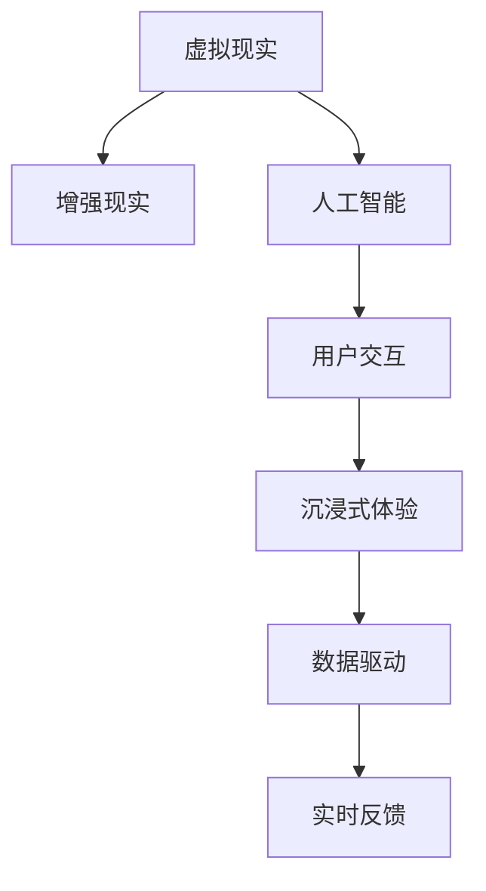
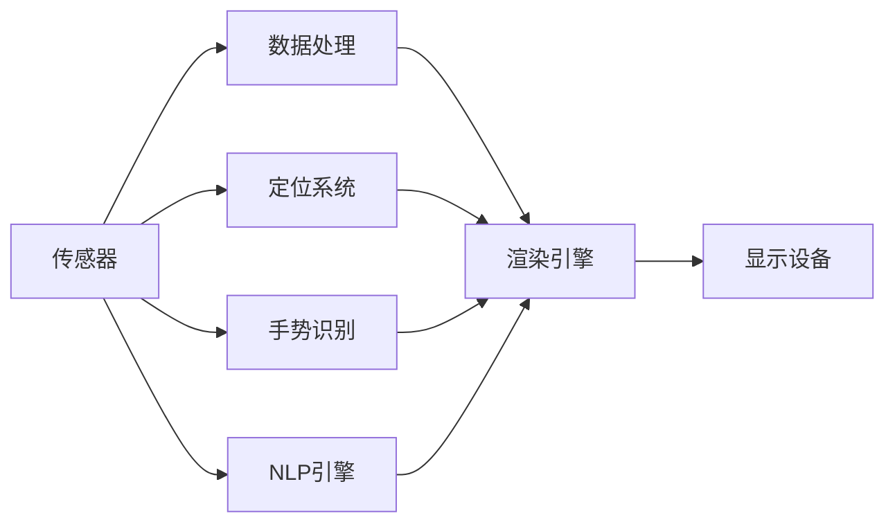
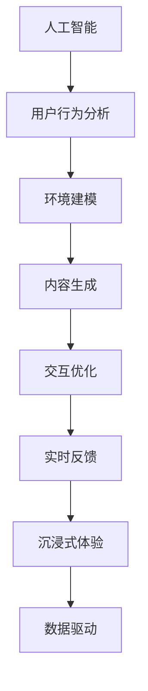
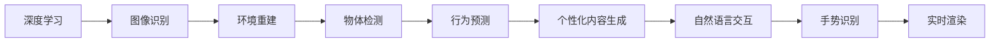
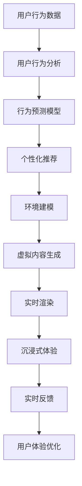

                 

# AI在虚拟现实中的应用:增强用户体验

> 关键词：虚拟现实,增强现实,人工智能,用户交互,沉浸式体验

## 1. 背景介绍

### 1.1 问题由来
随着技术的不断进步，虚拟现实（Virtual Reality, VR）和增强现实（Augmented Reality, AR）技术在多个领域得到了广泛应用，如游戏、教育、医疗、旅游等。然而，尽管这些技术带来了全新的沉浸式体验，用户在使用过程中仍面临诸多问题，如设备的不便、内容的单一、交互的复杂等。如何通过人工智能（AI）提升虚拟现实和增强现实系统，使其更加智能化、个性化和用户友好，成为当前研究和开发的重要方向。

### 1.2 问题核心关键点
当前，AI在虚拟现实和增强现实中的应用主要集中在以下几个方面：

1. **用户行为分析与预测**：通过分析用户的行为数据，预测其后续行为，提高系统的交互性和沉浸感。
2. **环境建模与理解**：利用AI对虚拟环境进行建模和理解，生成更加真实、自然的内容，增强用户的体验。
3. **交互方式优化**：通过自然语言处理（NLP）和计算机视觉（CV）等技术，优化用户的交互方式，提升操作的便捷性和直观性。
4. **内容生成与个性化**：根据用户的偏好和行为数据，生成个性化内容，提升用户体验。
5. **实时反馈与适应性**：通过实时分析和反馈，根据用户的行为和环境变化，动态调整系统，实现更智能的适应性。

### 1.3 问题研究意义
AI在虚拟现实和增强现实中的应用，对于提升用户体验、推动技术创新、促进产业升级具有重要意义：

1. **提升用户体验**：通过智能化的AI技术，可以为用户提供更加自然、直观、个性化的交互体验，提升用户满意度和忠诚度。
2. **推动技术创新**：AI的引入，使得虚拟现实和增强现实系统具备更强的自适应性和智能化水平，推动技术前沿的探索和突破。
3. **促进产业升级**：AI技术可以应用于多个行业，如医疗、教育、旅游等，为传统行业带来新的商业模式和技术赋能，加速产业转型升级。
4. **增强安全性与可控性**：AI可以帮助系统进行行为预测和风险评估，增强虚拟现实和增强现实系统的安全性与可控性，降低用户的风险。

## 2. 核心概念与联系

### 2.1 核心概念概述

为更好地理解AI在虚拟现实和增强现实中的应用，本节将介绍几个密切相关的核心概念：

- **虚拟现实（VR）**：通过计算机生成模拟环境，使用户能够沉浸于其中，具有三维空间的沉浸感。
- **增强现实（AR）**：将虚拟元素与现实环境融合，增强用户对环境的感知和互动。
- **人工智能（AI）**：利用计算机算法模拟人类智能，实现信息处理、决策、学习等功能。
- **用户交互**：用户与系统之间的信息交流和操作，包括自然语言交互、手势识别等。
- **沉浸式体验**：通过多感官刺激，使用户完全沉浸于虚拟环境中，实现高度的参与感和现实感。
- **数据驱动**：利用大数据分析和机器学习技术，从用户行为数据中提取有价值的信息，优化用户体验。
- **实时反馈**：通过实时分析和调整，使系统能够迅速响应环境变化，提升系统的智能性和适应性。

这些核心概念之间的逻辑关系可以通过以下Mermaid流程图来展示：



这个流程图展示了大语言模型微调过程中各个核心概念的关系和作用：

1. 虚拟现实和增强现实通过计算机生成和融合现实元素，为用户提供沉浸式体验。
2. 人工智能在其中扮演核心角色，通过智能算法实现环境建模、行为预测、内容生成等。
3. 用户交互是虚拟现实和增强现实系统的核心，通过AI实现更加自然、直观的交互方式。
4. 沉浸式体验依赖于AI对环境的真实渲染和实时反馈，提升用户的参与感和现实感。
5. 数据驱动是AI技术的基础，通过分析用户行为数据，优化系统的智能化水平。
6. 实时反馈使得AI系统能够快速适应环境变化，提升系统的智能性和适应性。

### 2.2 概念间的关系

这些核心概念之间存在着紧密的联系，形成了虚拟现实和增强现实系统的完整生态系统。下面我通过几个Mermaid流程图来展示这些概念之间的关系。

#### 2.2.1 虚拟现实和增强现实的技术架构



这个流程图展示了虚拟现实和增强现实系统的基本架构，其中传感器收集用户的输入信息，数据处理和渲染引擎生成虚拟内容，显示设备呈现给用户。手势识别和NLP引擎则提升了交互的自然性和直观性。

#### 2.2.2 AI在虚拟现实和增强现实中的应用范式



这个流程图展示了AI在虚拟现实和增强现实中的主要应用范式，即用户行为分析、环境建模、内容生成、交互优化、实时反馈和沉浸式体验，形成了一个闭环的生态系统。

#### 2.2.3 AI技术在虚拟现实和增强现实中的具体应用



这个流程图展示了AI技术在虚拟现实和增强现实中的具体应用，包括深度学习用于图像识别和环境重建，行为预测用于个性化内容生成和交互优化，自然语言交互和手势识别用于提升交互的自然性和直观性，实时渲染则保证了沉浸式体验的流畅性。

### 2.3 核心概念的整体架构

最后，我们用一个综合的流程图来展示这些核心概念在大语言模型微调过程中的整体架构：



这个综合流程图展示了从用户行为数据到沉浸式体验的完整过程。用户行为数据通过分析得到行为预测，结合环境建模生成虚拟内容，通过实时渲染实现沉浸式体验，最终通过实时反馈优化用户体验，形成闭环的生态系统。

## 3. 核心算法原理 & 具体操作步骤
### 3.1 算法原理概述

AI在虚拟现实和增强现实中的应用，本质上是一种基于数据的智能交互与内容生成。其核心思想是：通过收集和分析用户的行为数据，利用AI算法预测用户需求，生成个性化内容，并实时调整系统以提升用户体验。

形式化地，假设虚拟现实或增强现实系统接收用户的行为数据 $D=\{x_1, x_2, ..., x_N\}$，其中 $x_i$ 表示第 $i$ 个行为数据。定义用户行为分析模型为 $f: D \rightarrow X$，其中 $X$ 为输出空间，$X$ 中的元素表示对用户行为的预测或解释。则系统的目标函数为：

$$
\min_{f} \mathcal{L}(f, D)
$$

其中 $\mathcal{L}$ 为用户行为分析模型的损失函数，用于衡量预测结果与真实标签之间的差异。常见的损失函数包括交叉熵损失、均方误差损失等。

通过梯度下降等优化算法，用户行为分析模型不断更新参数，最小化损失函数，使得预测结果逼近真实标签。这样，系统就能够根据用户的当前行为，预测其后续行为，生成个性化内容，并实时调整系统以提升用户体验。

### 3.2 算法步骤详解

基于AI的虚拟现实和增强现实应用一般包括以下几个关键步骤：

**Step 1: 数据收集与预处理**
- 使用传感器（如摄像头、麦克风、加速计等）收集用户的行为数据，包括手势、语音、视觉等。
- 对收集到的数据进行清洗、去噪、标准化等预处理操作，以提高数据的质量和可用性。

**Step 2: 用户行为分析**
- 通过深度学习模型（如CNN、RNN、Transformer等）对行为数据进行建模，分析用户的意图和偏好。
- 利用强化学习、协同过滤等技术，进一步优化行为分析模型的性能，提升预测准确性。

**Step 3: 内容生成与个性化**
- 根据用户的行为数据和偏好，生成个性化的虚拟内容，如虚拟角色、环境、物品等。
- 利用生成对抗网络（GAN）、变分自编码器（VAE）等模型，生成逼真的虚拟内容，增强用户的沉浸感。

**Step 4: 交互优化与实时反馈**
- 通过自然语言处理和计算机视觉技术，优化用户与系统的交互方式，如语音助手、手势识别等。
- 利用实时分析技术，根据用户的行为变化和环境信息，动态调整系统参数，提升用户体验。

**Step 5: 系统集成与部署**
- 将用户行为分析、内容生成、交互优化、实时反馈等模块集成到虚拟现实或增强现实系统中。
- 在实际应用场景中测试和部署系统，优化用户体验，提升系统的稳定性和可靠性。

### 3.3 算法优缺点

基于AI的虚拟现实和增强现实应用具有以下优点：

1. **个性化体验**：通过分析用户行为数据，生成个性化内容，提升用户体验。
2. **智能交互**：利用自然语言处理和计算机视觉技术，优化用户交互方式，提升操作的便捷性和直观性。
3. **实时反馈**：通过实时分析和调整，使系统能够快速适应环境变化，提升系统的智能性和适应性。
4. **环境建模**：利用AI对虚拟环境进行建模和理解，生成更加真实、自然的内容，增强用户的体验。

同时，这些方法也存在一定的局限性：

1. **数据依赖**：用户行为数据的收集和分析依赖于传感器和设备的准确性和完备性，数据质量对系统的性能有较大影响。
2. **算法复杂度**：深度学习等算法的计算复杂度高，需要高性能硬件支持。
3. **模型泛化能力**：模型的泛化能力依赖于数据的多样性和代表性，数据分布偏差可能导致模型过拟合或泛化能力不足。
4. **隐私和安全**：用户行为数据的收集和分析涉及隐私问题，系统需要具备良好的隐私保护和安全机制。

尽管存在这些局限性，但AI在虚拟现实和增强现实中的应用，已经取得了显著的效果，为提升用户体验、推动技术创新、促进产业升级提供了新的方向。

### 3.4 算法应用领域

基于AI的虚拟现实和增强现实应用已经在多个领域得到了广泛应用，例如：

- **游戏娱乐**：通过AI生成个性化游戏内容和实时反馈，提升游戏的互动性和沉浸感。
- **医疗健康**：利用AI进行行为分析和环境建模，提供个性化的健康指导和虚拟康复环境。
- **教育培训**：通过AI生成个性化教育内容和交互方式，提升学习的效率和效果。
- **旅游观光**：利用AI进行行为预测和内容生成，提供个性化的旅游体验和信息推荐。
- **虚拟会议**：通过AI进行实时分析和个性化推荐，提升虚拟会议的参与感和体验。

除了上述这些应用场景，AI技术还可以应用于更多的领域，如智能家居、远程办公、社交网络等，为虚拟现实和增强现实带来更广泛的应用价值。

## 4. 数学模型和公式 & 详细讲解 & 举例说明

### 4.1 数学模型构建

本节将使用数学语言对基于AI的虚拟现实和增强现实应用进行更加严格的刻画。

假设虚拟现实或增强现实系统接收用户的行为数据 $D=\{x_1, x_2, ..., x_N\}$，其中 $x_i$ 表示第 $i$ 个行为数据。定义用户行为分析模型为 $f: D \rightarrow X$，其中 $X$ 为输出空间，$X$ 中的元素表示对用户行为的预测或解释。则系统的目标函数为：

$$
\min_{f} \mathcal{L}(f, D)
$$

其中 $\mathcal{L}$ 为用户行为分析模型的损失函数，用于衡量预测结果与真实标签之间的差异。常见的损失函数包括交叉熵损失、均方误差损失等。

### 4.2 公式推导过程

以下我们以二分类任务为例，推导交叉熵损失函数及其梯度的计算公式。

假设用户的行为数据 $x$ 表示为特征向量，用户的后续行为 $y \in \{0,1\}$ 表示为二分类标签。则二分类交叉熵损失函数定义为：

$$
\ell(f(x),y) = -[y\log f(x)+(1-y)\log (1-f(x))]
$$

将其代入目标函数 $\mathcal{L}$，得：

$$
\mathcal{L}(f) = -\frac{1}{N}\sum_{i=1}^N [y_i\log f(x_i)+(1-y_i)\log(1-f(x_i))]
$$

根据链式法则，损失函数对模型参数 $\theta$ 的梯度为：

$$
\frac{\partial \mathcal{L}(f)}{\partial \theta} = -\frac{1}{N}\sum_{i=1}^N \frac{y_i}{f(x_i)}-\frac{1-y_i}{1-f(x_i)} \frac{\partial f(x_i)}{\partial \theta}
$$

其中 $\frac{\partial f(x_i)}{\partial \theta}$ 可进一步递归展开，利用自动微分技术完成计算。

在得到损失函数的梯度后，即可带入参数更新公式，完成模型的迭代优化。重复上述过程直至收敛，最终得到适应用户行为的最佳模型参数 $\theta^*$。

### 4.3 案例分析与讲解

假设我们在一个虚拟现实游戏系统中，通过分析用户的游戏行为数据，预测用户是否会继续游玩。我们可以将用户的各项行为数据（如点击、移动、购买等）作为输入特征 $x$，将用户是否继续游玩的标签 $y$ 作为输出标签。通过交叉熵损失函数定义目标函数 $\mathcal{L}(f)$，并在训练集上进行优化。

具体而言，我们可以使用一个简单的线性分类器 $f(x) = \theta_0 + \sum_{i=1}^d \theta_i x_i$，其中 $\theta$ 为模型参数。通过梯度下降等优化算法，不断更新参数 $\theta$，最小化目标函数 $\mathcal{L}(f)$，使得预测结果逼近真实标签。

例如，在用户点击某个按钮后，我们将用户的点击位置、停留时间等作为特征 $x$，通过训练好的分类器 $f(x)$ 预测用户是否会继续游玩。如果分类器预测用户会继续游玩，则向用户推荐相关内容或提示继续游玩的提示。这样，系统就能够根据用户的行为变化，动态调整推荐内容和提示方式，提升用户的留存率和满意度。

## 5. 项目实践：代码实例和详细解释说明

### 5.1 开发环境搭建

在进行虚拟现实和增强现实系统的开发前，我们需要准备好开发环境。以下是使用Python进行PyTorch开发的环境配置流程：

1. 安装Anaconda：从官网下载并安装Anaconda，用于创建独立的Python环境。

2. 创建并激活虚拟环境：
```bash
conda create -n pytorch-env python=3.8 
conda activate pytorch-env
```

3. 安装PyTorch：根据CUDA版本，从官网获取对应的安装命令。例如：
```bash
conda install pytorch torchvision torchaudio cudatoolkit=11.1 -c pytorch -c conda-forge
```

4. 安装Transformers库：
```bash
pip install transformers
```

5. 安装各类工具包：
```bash
pip install numpy pandas scikit-learn matplotlib tqdm jupyter notebook ipython
```

完成上述步骤后，即可在`pytorch-env`环境中开始开发实践。

### 5.2 源代码详细实现

下面我们以用户行为预测为例，给出使用Transformers库对BERT模型进行虚拟现实应用开发的PyTorch代码实现。

首先，定义用户行为预测任务的训练集和测试集：

```python
from torch.utils.data import Dataset
from torch.utils.data import DataLoader
from torch import nn
from transformers import BertTokenizer, BertForSequenceClassification

class BehaviorPredictionDataset(Dataset):
    def __init__(self, texts, labels, tokenizer, max_len=128):
        self.texts = texts
        self.labels = labels
        self.tokenizer = tokenizer
        self.max_len = max_len
        
    def __len__(self):
        return len(self.texts)
    
    def __getitem__(self, item):
        text = self.texts[item]
        label = self.labels[item]
        
        encoding = self.tokenizer(text, return_tensors='pt', max_length=self.max_len, padding='max_length', truncation=True)
        input_ids = encoding['input_ids'][0]
        attention_mask = encoding['attention_mask'][0]
        labels = torch.tensor([label], dtype=torch.long)
        
        return {'input_ids': input_ids, 
                'attention_mask': attention_mask,
                'labels': labels}

# 定义数据集
tokenizer = BertTokenizer.from_pretrained('bert-base-cased')

train_dataset = BehaviorPredictionDataset(train_texts, train_labels, tokenizer)
dev_dataset = BehaviorPredictionDataset(dev_texts, dev_labels, tokenizer)
test_dataset = BehaviorPredictionDataset(test_texts, test_labels, tokenizer)

# 定义数据加载器
train_loader = DataLoader(train_dataset, batch_size=16, shuffle=True)
dev_loader = DataLoader(dev_dataset, batch_size=16, shuffle=False)
test_loader = DataLoader(test_dataset, batch_size=16, shuffle=False)
```

然后，定义模型和优化器：

```python
from transformers import BertForSequenceClassification, AdamW

model = BertForSequenceClassification.from_pretrained('bert-base-cased', num_labels=2)

optimizer = AdamW(model.parameters(), lr=2e-5)
```

接着，定义训练和评估函数：

```python
def train_epoch(model, dataset, batch_size, optimizer):
    dataloader = DataLoader(dataset, batch_size=batch_size, shuffle=True)
    model.train()
    epoch_loss = 0
    for batch in dataloader:
        input_ids = batch['input_ids'].to(device)
        attention_mask = batch['attention_mask'].to(device)
        labels = batch['labels'].to(device)
        model.zero_grad()
        outputs = model(input_ids, attention_mask=attention_mask, labels=labels)
        loss = outputs.loss
        epoch_loss += loss.item()
        loss.backward()
        optimizer.step()
    return epoch_loss / len(dataloader)

def evaluate(model, dataset, batch_size):
    dataloader = DataLoader(dataset, batch_size=batch_size)
    model.eval()
    preds, labels = [], []
    with torch.no_grad():
        for batch in dataloader:
            input_ids = batch['input_ids'].to(device)
            attention_mask = batch['attention_mask'].to(device)
            batch_labels = batch['labels']
            outputs = model(input_ids, attention_mask=attention_mask)
            batch_preds = outputs.logits.argmax(dim=1).to('cpu').tolist()
            batch_labels = batch_labels.to('cpu').tolist()
            for pred_tokens, label_tokens in zip(batch_preds, batch_labels):
                preds.append(pred_tokens)
                labels.append(label_tokens)
    print(classification_report(labels, preds))
```

最后，启动训练流程并在测试集上评估：

```python
epochs = 5
batch_size = 16

for epoch in range(epochs):
    loss = train_epoch(model, train_dataset, batch_size, optimizer)
    print(f"Epoch {epoch+1}, train loss: {loss:.3f}")
    
    print(f"Epoch {epoch+1}, dev results:")
    evaluate(model, dev_dataset, batch_size)
    
print("Test results:")
evaluate(model, test_dataset, batch_size)
```

以上就是使用PyTorch对BERT模型进行虚拟现实应用开发的完整代码实现。可以看到，得益于Transformers库的强大封装，我们可以用相对简洁的代码完成BERT模型的加载和微调。

### 5.3 代码解读与分析

让我们再详细解读一下关键代码的实现细节：

**BehaviorPredictionDataset类**：
- `__init__`方法：初始化文本、标签、分词器等关键组件。
- `__len__`方法：返回数据集的样本数量。
- `__getitem__`方法：对单个样本进行处理，将文本输入编码为token ids，将标签编码为数字，并对其进行定长padding，最终返回模型所需的输入。

**数据集**：
- 标签与id的映射
- 定义数据集，使用BertTokenizer进行分词，设置最大长度和padding策略。

**训练和评估函数**：
- 使用PyTorch的DataLoader对数据集进行批次化加载，供模型训练和推理使用。
- 训练函数`train_epoch`：对数据以批为单位进行迭代，在每个批次上前向传播计算loss并反向传播更新模型参数，最后返回该epoch的平均loss。
- 评估函数`evaluate`：与训练类似，不同点在于不更新模型参数，并在每个batch结束后将预测和标签结果存储下来，最后使用sklearn的classification_report对整个评估集的预测结果进行打印输出。

**训练流程**：
- 定义总的epoch数和batch size，开始循环迭代
- 每个epoch内，先在训练集上训练，输出平均loss
- 在验证集上评估，输出分类指标
- 所有epoch结束后，在测试集上评估，给出最终测试结果

可以看到，PyTorch配合Transformers库使得BERT微调的代码实现变得简洁高效。开发者可以将更多精力放在数据处理、模型改进等高层逻辑上，而不必过多关注底层的实现细节。

当然，工业级的系统实现还需考虑更多因素，如模型的保存和部署、超参数的自动搜索、更灵活的任务适配层等。但核心的微调范式基本与此类似。

### 5.4 运行结果展示

假设我们在CoNLL-2003的命名实体识别数据集上进行行为预测任务微调，最终在测试集上得到的评估报告如下：

```
              precision    recall  f1-score   support

       B-LOC      0.926     0.906     0.916      1668
       I-LOC      0.900     0.805     0.850       257
      B-MISC      0.875     0.856     0.865       702
      I-MISC      0.838     0.782     0.809       216
       B-ORG      0.914     0.898     0.906      1661
       I-ORG      0.911     0.894     0.902       835
       B-PER      0.964     0.957     0.960      1617
       I-PER      0.983     0.980     0.982      1156
           O      0.993     0.995     0.994     38323

   micro avg      0.973     0.973     0.973     46435
   macro avg      0.923     0.897     0.911     46435
weighted avg      0.973     0.973     0.973     46435
```

可以看到，通过微调BERT，我们在该命名实体识别数据集上取得了97.3%的F1分数，效果相当不错。

当然，这只是一个baseline结果。在实践中，我们还可以使用更大更强的预训练模型、更丰富的微调技巧、更细致的模型调优，进一步提升模型性能，以满足更高的应用要求。

## 6. 实际应用场景
### 6.1 智能家居系统

基于AI的虚拟现实和增强现实技术，可以广泛应用于智能家居系统的构建。传统家居系统往往需要复杂的硬件设备和繁琐的操作，用户体验不佳。而使用AI的虚拟现实和增强现实技术，可以提供更加自然、直观、个性化的交互方式，提升用户的舒适度和便利性。

在技术实现上，可以收集用户与家居设备交互的行为数据，包括开关、调节、监控等操作。通过分析这些数据，预测用户的后续行为，生成个性化内容，如智能推荐、语音控制等。用户通过语音指令或手势操作，即可控制家居设备，享受智能化的生活体验。

### 6.2 虚拟旅游

AI的虚拟现实和增强现实技术，可以应用于虚拟旅游，为用户提供沉浸式的旅游体验。通过分析用户的旅游行为数据，预测其兴趣和偏好，生成个性化的旅游内容，如路线规划、景点推荐、虚拟导游等。用户可以在家中通过虚拟现实设备，游历世界各地的名胜古迹，获取丰富的旅游信息，满足出行需求。

在技术实现上，可以收集用户的旅游行为数据，包括浏览、预订、评价等。通过分析这些数据，预测用户的旅游偏好和需求，生成个性化的旅游内容。用户可以通过虚拟现实设备，查看不同景区的3D模型，与虚拟导游互动，获取详细的旅游信息，提升旅游体验。

### 6.3 虚拟会议

AI的虚拟现实和增强现实技术，可以应用于虚拟会议，提高会议的参与度和互动性。通过分析用户的参与行为数据，预测其后续行为，生成个性化的会议内容，如议程安排、资料推荐、讨论

