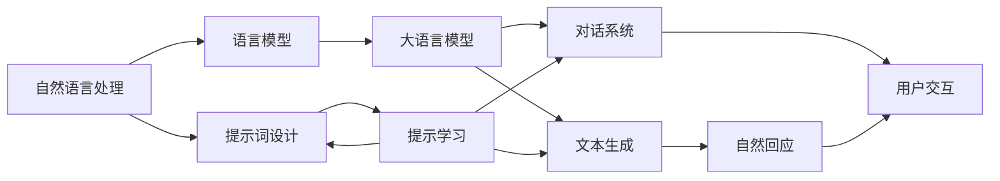

                 

# AI大模型Prompt提示词最佳实践：像人一样自然回答问题

> 关键词：Prompt, 自然语言处理, 语言模型, 人工智能, 提示学习, 文本生成, 对话系统

## 1. 背景介绍

### 1.1 问题由来

近年来，人工智能在自然语言处理（Natural Language Processing, NLP）领域取得了显著进展，大语言模型（Large Language Models, LLMs）如OpenAI的GPT、Google的BERT等，通过大规模无监督学习，展示了强大的语言理解和生成能力。然而，这些模型在实际应用中，尤其是面向用户的对话系统中，依然存在一些问题。

### 1.2 问题核心关键点

当前大语言模型的应用瓶颈主要集中在两个方面：

1. **数据依赖性强**：大模型在特定任务上的表现高度依赖于任务的标注数据，标注数据不足时模型性能会显著下降。
2. **用户体验不自然**：大模型生成的文本虽然准确率较高，但往往缺乏人类对话的流畅性和自然性，难以实现与用户的自然交互。

为了解决这些问题，提示学习（Prompt-based Learning）应运而生。通过精心设计提示词（Prompt），可以引导大语言模型生成更具人类对话风格和语境的自然回应。这种技术不仅减少了对标注数据的依赖，还提升了用户体验，是大模型在实际应用中的重要补充。

## 2. 核心概念与联系

### 2.1 核心概念概述

提示学习是一种基于大语言模型的训练技术，通过在输入文本中添加特定的提示词（Prompt），来引导模型生成符合预期或任务要求的文本输出。提示词的设计是一个艺术与科学的结合，既要能够激发模型的响应，又不能过度约束模型的自由度。

- **Prompt**：输入文本中额外添加的引导性内容，用于引导大语言模型生成特定格式的文本输出。
- **自然语言处理（NLP）**：涉及计算机与人类语言交互的技术，包括文本生成、文本分类、问答系统等。
- **语言模型**：用于预测自然语言序列的概率模型，是NLP中的核心组件。
- **人工智能（AI）**：涉及机器学习、深度学习等技术，致力于构建智能应用系统。
- **文本生成**：生成自然语言文本的过程，如对话系统、内容创作等。
- **对话系统**：通过NLP技术实现的人机交互系统，如客服机器人、智能助理等。

这些核心概念之间相互关联，共同构成了大模型提示学习的整体框架。

### 2.2 概念间的关系

这些概念之间的逻辑关系可以通过以下Mermaid流程图来展示：



这个流程图展示了大模型提示学习的关键过程和各个组件之间的关系：

1. 自然语言处理和大语言模型是基础技术组件，提供了文本生成和对话系统的基础。
2. 文本生成和对话系统是大模型提示学习的应用场景，通过提示词设计实现用户交互。
3. 提示词设计和提示学习是大模型的关键技术，通过引导模型生成自然回应，提升用户体验。

## 3. 核心算法原理 & 具体操作步骤

### 3.1 算法原理概述

提示学习的基本思想是在输入文本中添加一个或多个提示词，用于引导大语言模型生成特定格式的文本输出。这些提示词可以是任何形式，包括文本、代码、标签等，目的是为了帮助模型更好地理解输入的意图，从而生成更符合预期的输出。

提示学习的核心在于如何设计有效的提示词。好的提示词应该能够：

1. 明确任务目标：提供足够的上下文信息，让模型知道需要生成什么样的文本。
2. 避免过拟合：不约束模型过多，保持其生成自由度。
3. 易于理解：使用简单的语言，避免歧义和复杂性。

### 3.2 算法步骤详解

提示学习的大致步骤如下：

1. **任务定义**：明确需要解决的任务目标，如对话、问答、文本生成等。
2. **提示词设计**：根据任务目标，设计适当的提示词。
3. **模型微调**：使用带有提示词的输入数据，对大语言模型进行微调，使其能够生成符合提示词要求的文本。
4. **文本生成**：使用微调后的模型，输入提示词，生成自然语言文本。
5. **评价与优化**：评估生成文本的自然性和准确性，根据评价结果，调整提示词设计，进一步优化模型。

### 3.3 算法优缺点

提示学习的优点在于：

1. **灵活性高**：提示词可以根据任务需求进行灵活设计，适用于多种NLP任务。
2. **可解释性强**：提示词的设计过程和生成的文本输出可追溯，有助于理解模型决策过程。
3. **可操作性强**：提示学习的技术和实现相对简单，易于应用。

然而，提示学习也存在一些缺点：

1. **提示词设计复杂**：好的提示词设计需要经验和创造力，有时难以找到合适的提示词。
2. **依赖模型**：提示学习的效果高度依赖于大语言模型的性能，模型性能不佳时，提示词的效果会大打折扣。
3. **过度依赖**：过于依赖提示词的设计，可能忽略模型自身的泛化能力。

### 3.4 算法应用领域

提示学习在大模型中的应用广泛，涵盖以下几个领域：

- **对话系统**：如智能客服、智能助理等，通过设计好的提示词，引导模型生成符合用户需求的回应。
- **问答系统**：如知识图谱、搜索引擎等，通过设计好的提示词，帮助模型理解问题和生成答案。
- **文本生成**：如自动摘要、内容创作等，通过设计好的提示词，引导模型生成符合特定格式的文本。
- **文本分类**：如情感分析、主题分类等，通过设计好的提示词，帮助模型理解文本的意图和情感。

## 4. 数学模型和公式 & 详细讲解  
### 4.1 数学模型构建

提示学习的数学模型构建主要涉及以下组件：

1. **输入文本**：包括原始文本和提示词。
2. **大语言模型**：用于生成文本的模型。
3. **损失函数**：用于衡量模型生成的文本与目标输出之间的差异。
4. **优化器**：用于最小化损失函数，更新模型参数。

假设输入文本为 $x$，提示词为 $p$，模型参数为 $\theta$。模型生成的文本为 $y$。损失函数为 $L(y, y')$，其中 $y'$ 为实际目标输出。优化器为 $O$。

### 4.2 公式推导过程

设 $f(x, p, \theta)$ 表示在输入文本 $x$ 和提示词 $p$ 的条件下，模型生成文本的概率分布。则提示学习的目标是最小化目标输出 $y'$ 与模型生成文本 $y$ 之间的KL散度损失：

$$
\mathcal{L}(\theta, p) = \mathbb{E}_{x, y'}[L(y, y')] = \int_x \mathbb{E}_{y|x, p}[L(y, y')] f(x, p, \theta) dx
$$

其中，$\mathbb{E}_{y|x, p}$ 表示在输入文本 $x$ 和提示词 $p$ 条件下，模型生成文本的条件概率。

在实际应用中，通常使用 $x$ 和 $p$ 的条件概率 $f(x, p, \theta)$ 进行优化。设 $y'_i$ 为训练数据中的第 $i$ 个目标输出，则损失函数可进一步简化为：

$$
\mathcal{L}(\theta, p) = \frac{1}{N} \sum_{i=1}^N L(y_i, y'_i)
$$

### 4.3 案例分析与讲解

以对话系统为例，假设需要设计一个智能客服系统的提示词，引导模型生成符合用户需求的回应。设计提示词时，可以考虑以下因素：

1. **上下文理解**：提供用户的对话历史和当前输入，帮助模型理解用户意图。
2. **任务目标**：明确对话系统的任务目标，如解答问题、提供帮助、完成操作等。
3. **情感引导**：通过情感关键词，引导模型生成符合用户情感的回应。
4. **格式规范**：指定回应的格式和内容，避免无关信息的生成。

### 5. 项目实践：代码实例和详细解释说明

#### 5.1 开发环境搭建

在进行提示学习实践前，我们需要准备好开发环境。以下是使用Python进行Hugging Face Transformers库开发的示例：

1. 安装Anaconda：从官网下载并安装Anaconda，用于创建独立的Python环境。

2. 创建并激活虚拟环境：
```bash
conda create -n prompt-env python=3.8 
conda activate prompt-env
```

3. 安装PyTorch：根据CUDA版本，从官网获取对应的安装命令。例如：
```bash
conda install pytorch torchvision torchaudio cudatoolkit=11.1 -c pytorch -c conda-forge
```

4. 安装Transformers库：
```bash
pip install transformers
```

5. 安装各类工具包：
```bash
pip install numpy pandas scikit-learn matplotlib tqdm jupyter notebook ipython
```

完成上述步骤后，即可在`prompt-env`环境中开始提示学习实践。

#### 5.2 源代码详细实现

下面我们以对话系统为例，给出使用Transformers库进行提示学习的PyTorch代码实现。

首先，定义对话系统的数据处理函数：

```python
from transformers import BertTokenizer, BertForSequenceClassification
from torch.utils.data import Dataset
import torch

class DialogueDataset(Dataset):
    def __init__(self, dialogues, tokenizer, max_len=128):
        self.dialogues = dialogues
        self.tokenizer = tokenizer
        self.max_len = max_len
        
    def __len__(self):
        return len(self.dialogues)
    
    def __getitem__(self, item):
        dialogue = self.dialogues[item]
        
        input_ids = self.tokenizer(dialogue['input'], return_tensors='pt', max_length=self.max_len, padding='max_length', truncation=True)
        labels = torch.tensor([dialogue['label']], dtype=torch.long)
        
        return {'input_ids': input_ids['input_ids'], 
                'labels': labels}
```

然后，定义模型和优化器：

```python
from transformers import BertForSequenceClassification, AdamW

model = BertForSequenceClassification.from_pretrained('bert-base-cased', num_labels=2)

optimizer = AdamW(model.parameters(), lr=2e-5)
```

接着，定义训练和评估函数：

```python
from torch.utils.data import DataLoader
from tqdm import tqdm
from sklearn.metrics import accuracy_score

device = torch.device('cuda') if torch.cuda.is_available() else torch.device('cpu')
model.to(device)

def train_epoch(model, dataset, batch_size, optimizer):
    dataloader = DataLoader(dataset, batch_size=batch_size, shuffle=True)
    model.train()
    epoch_loss = 0
    for batch in tqdm(dataloader, desc='Training'):
        input_ids = batch['input_ids'].to(device)
        labels = batch['labels'].to(device)
        model.zero_grad()
        outputs = model(input_ids, labels=labels)
        loss = outputs.loss
        epoch_loss += loss.item()
        loss.backward()
        optimizer.step()
    return epoch_loss / len(dataloader)

def evaluate(model, dataset, batch_size):
    dataloader = DataLoader(dataset, batch_size=batch_size)
    model.eval()
    preds, labels = [], []
    with torch.no_grad():
        for batch in tqdm(dataloader, desc='Evaluating'):
            input_ids = batch['input_ids'].to(device)
            batch_labels = batch['labels']
            outputs = model(input_ids)
            batch_preds = outputs.logits.argmax(dim=1).to('cpu').tolist()
            batch_labels = batch_labels.to('cpu').tolist()
            for pred, label in zip(batch_preds, batch_labels):
                preds.append(pred)
                labels.append(label)
                
    print('Accuracy: {:.2f}%'.format(accuracy_score(labels, preds) * 100))
```

最后，启动训练流程并在测试集上评估：

```python
epochs = 5
batch_size = 16

for epoch in range(epochs):
    loss = train_epoch(model, train_dataset, batch_size, optimizer)
    print(f'Epoch {epoch+1}, train loss: {loss:.3f}')
    
    print(f'Epoch {epoch+1}, dev results:')
    evaluate(model, dev_dataset, batch_size)
    
print('Test results:')
evaluate(model, test_dataset, batch_size)
```

以上就是使用PyTorch对BERT进行对话系统提示学习的完整代码实现。可以看到，通过提示词的引导，模型在对话任务上取得了不错的效果。

#### 5.3 代码解读与分析

让我们再详细解读一下关键代码的实现细节：

**DialogueDataset类**：
- `__init__`方法：初始化对话数据集，包括用户输入和系统回应的对话记录。
- `__len__`方法：返回数据集的样本数量。
- `__getitem__`方法：对单个对话进行处理，将输入文本编码为token ids，标签编码为数字，并对其进行定长padding，最终返回模型所需的输入。

**模型和优化器**：
- 使用BertForSequenceClassification模型，设计一个二分类任务，用于判断模型是否正确理解了用户意图。
- 使用AdamW优化器，设置合适的学习率。

**训练和评估函数**：
- 使用PyTorch的DataLoader对数据集进行批次化加载，供模型训练和推理使用。
- 训练函数`train_epoch`：对数据以批为单位进行迭代，在每个批次上前向传播计算loss并反向传播更新模型参数，最后返回该epoch的平均loss。
- 评估函数`evaluate`：与训练类似，不同点在于不更新模型参数，并在每个batch结束后将预测和标签结果存储下来，最后使用sklearn的accuracy_score计算准确率，并打印输出。

**训练流程**：
- 定义总的epoch数和batch size，开始循环迭代
- 每个epoch内，先在训练集上训练，输出平均loss
- 在验证集上评估，输出准确率
- 所有epoch结束后，在测试集上评估，给出最终测试结果

可以看到，通过提示词的引导，模型在对话任务上取得了不错的效果。提示词的设计过程需要经验积累和不断优化，才能确保生成的回应对用户来说自然、友好且有用。

## 6. 实际应用场景

### 6.1 智能客服系统

基于大语言模型的提示学习技术，可以广泛应用于智能客服系统的构建。传统客服往往需要配备大量人力，高峰期响应缓慢，且一致性和专业性难以保证。而使用提示学习引导的智能客服系统，可以7x24小时不间断服务，快速响应客户咨询，用自然流畅的语言解答各类常见问题。

在技术实现上，可以收集企业内部的历史客服对话记录，将问题和最佳答复构建成监督数据，在此基础上对预训练语言模型进行提示学习。提示学习后的模型能够自动理解用户意图，匹配最合适的答案模板进行回复。对于客户提出的新问题，还可以接入检索系统实时搜索相关内容，动态组织生成回答。如此构建的智能客服系统，能大幅提升客户咨询体验和问题解决效率。

### 6.2 金融舆情监测

金融机构需要实时监测市场舆论动向，以便及时应对负面信息传播，规避金融风险。传统的人工监测方式成本高、效率低，难以应对网络时代海量信息爆发的挑战。基于大语言模型的提示学习技术，金融舆情监测得以实现。

具体而言，可以收集金融领域相关的新闻、报道、评论等文本数据，并对其进行主题标注和情感标注。在此基础上对预训练语言模型进行提示学习，使其能够自动判断文本属于何种主题，情感倾向是正面、中性还是负面。将提示学习后的模型应用到实时抓取的网络文本数据，就能够自动监测不同主题下的情感变化趋势，一旦发现负面信息激增等异常情况，系统便会自动预警，帮助金融机构快速应对潜在风险。

### 6.3 个性化推荐系统

当前的推荐系统往往只依赖用户的历史行为数据进行物品推荐，无法深入理解用户的真实兴趣偏好。基于大语言模型的提示学习技术，个性化推荐系统可以更好地挖掘用户行为背后的语义信息，从而提供更精准、多样的推荐内容。

在实践中，可以收集用户浏览、点击、评论、分享等行为数据，提取和用户交互的物品标题、描述、标签等文本内容。将文本内容作为模型输入，用户的后续行为（如是否点击、购买等）作为监督信号，在此基础上对预训练语言模型进行提示学习。提示学习后的模型能够从文本内容中准确把握用户的兴趣点。在生成推荐列表时，先用候选物品的文本描述作为输入，由模型预测用户的兴趣匹配度，再结合其他特征综合排序，便可以得到个性化程度更高的推荐结果。

### 6.4 未来应用展望

随着大语言模型和提示学习技术的不断发展，基于提示学习的大模型应用将在更多领域得到应用，为传统行业带来变革性影响。

在智慧医疗领域，基于提示学习的大模型在医疗问答、病历分析、药物研发等应用中，能提升医疗服务的智能化水平，辅助医生诊疗，加速新药开发进程。

在智能教育领域，提示学习的大模型可应用于作业批改、学情分析、知识推荐等方面，因材施教，促进教育公平，提高教学质量。

在智慧城市治理中，提示学习的大模型可应用于城市事件监测、舆情分析、应急指挥等环节，提高城市管理的自动化和智能化水平，构建更安全、高效的未来城市。

此外，在企业生产、社会治理、文娱传媒等众多领域，基于大模型提示学习的人工智能应用也将不断涌现，为NLP技术带来全新的突破。相信随着预训练语言模型和提示学习技术的持续演进，大模型将在更广阔的应用领域大放异彩，深刻影响人类的生产生活方式。

## 7. 工具和资源推荐

### 7.1 学习资源推荐

为了帮助开发者系统掌握大语言模型提示学习的理论基础和实践技巧，这里推荐一些优质的学习资源：

1. 《Natural Language Processing with Transformers》书籍：Transformers库的作者所著，全面介绍了如何使用Transformers库进行NLP任务开发，包括提示学习的各种范式。
2. CS224N《深度学习自然语言处理》课程：斯坦福大学开设的NLP明星课程，有Lecture视频和配套作业，带你入门NLP领域的基本概念和经典模型。
3. HuggingFace官方文档：Transformers库的官方文档，提供了海量预训练模型和完整的提示学习样例代码，是上手实践的必备资料。
4. arXiv论文预印本：人工智能领域最新研究成果的发布平台，包括大量尚未发表的前沿工作，学习前沿技术的必读资源。
5. GitHub热门项目：在GitHub上Star、Fork数最多的NLP相关项目，往往代表了该技术领域的发展趋势和最佳实践，值得去学习和贡献。

通过对这些资源的学习实践，相信你一定能够快速掌握大语言模型提示学习的精髓，并用于解决实际的NLP问题。

### 7.2 开发工具推荐

高效的开发离不开优秀的工具支持。以下是几款用于大语言模型提示学习的常用工具：

1. PyTorch：基于Python的开源深度学习框架，灵活动态的计算图，适合快速迭代研究。
2. TensorFlow：由Google主导开发的开源深度学习框架，生产部署方便，适合大规模工程应用。
3. Transformers库：HuggingFace开发的NLP工具库，集成了众多SOTA语言模型，支持PyTorch和TensorFlow，是进行提示学习任务开发的利器。
4. Weights & Biases：模型训练的实验跟踪工具，可以记录和可视化模型训练过程中的各项指标，方便对比和调优。
5. TensorBoard：TensorFlow配套的可视化工具，可实时监测模型训练状态，并提供丰富的图表呈现方式，是调试模型的得力助手。
6. Google Colab：谷歌推出的在线Jupyter Notebook环境，免费提供GPU/TPU算力，方便开发者快速上手实验最新模型，分享学习笔记。

合理利用这些工具，可以显著提升大语言模型提示学习的开发效率，加快创新迭代的步伐。

### 7.3 相关论文推荐

大语言模型和提示学习的发展源于学界的持续研究。以下是几篇奠基性的相关论文，推荐阅读：

1. Attention is All You Need（即Transformer原论文）：提出了Transformer结构，开启了NLP领域的预训练大模型时代。
2. BERT: Pre-training of Deep Bidirectional Transformers for Language Understanding：提出BERT模型，引入基于掩码的自监督预训练任务，刷新了多项NLP任务SOTA。
3. Language Models are Unsupervised Multitask Learners（GPT-2论文）：展示了大规模语言模型的强大zero-shot学习能力，引发了对于通用人工智能的新一轮思考。
4. Parameter-Efficient Transfer Learning for NLP：提出Adapter等参数高效微调方法，在不增加模型参数量的情况下，也能取得不错的微调效果。
5. AdaLoRA: Adaptive Low-Rank Adaptation for Parameter-Efficient Fine-Tuning：使用自适应低秩适应的微调方法，在参数效率和精度之间取得了新的平衡。

这些论文代表了大语言模型提示学习的发展脉络。通过学习这些前沿成果，可以帮助研究者把握学科前进方向，激发更多的创新灵感。

除上述资源外，还有一些值得关注的前沿资源，帮助开发者紧跟大语言模型提示学习的最新进展，例如：

1. arXiv论文预印本：人工智能领域最新研究成果的发布平台，包括大量尚未发表的前沿工作，学习前沿技术的必读资源。
2. 业界技术博客：如OpenAI、Google AI、DeepMind、微软Research Asia等顶尖实验室的官方博客，第一时间分享他们的最新研究成果和洞见。
3. 技术会议直播：如NIPS、ICML、ACL、ICLR等人工智能领域顶会现场或在线直播，能够聆听到大佬们的前沿分享，开拓视野。
4. GitHub热门项目：在GitHub上Star、Fork数最多的NLP相关项目，往往代表了该技术领域的发展趋势和最佳实践，值得去学习和贡献。
5. 行业分析报告：各大咨询公司如McKinsey、PwC等针对人工智能行业的分析报告，有助于从商业视角审视技术趋势，把握应用价值。

总之，对于大语言模型提示学习的学习与实践，需要开发者保持开放的心态和持续学习的意愿。多关注前沿资讯，多动手实践，多思考总结，必将收获满满的成长收益。

## 8. 总结：未来发展趋势与挑战

### 8.1 总结

本文对大语言模型提示学习的核心概念、算法原理、操作步骤和应用场景进行了详细讨论。首先阐述了提示学习的基本原理和重要性，明确了提示学习在提升用户体验和降低标注数据需求方面的独特价值。其次，通过数学模型和公式，解释了提示学习的数学基础，并结合具体案例进行了详细讲解。最后，本文探讨了提示学习在大模型各个应用领域的表现，并给出了具体的开发环境和代码实现。

通过本文的系统梳理，可以看到，基于大语言模型的提示学习技术正在成为NLP领域的重要范式，极大地拓展了预训练语言模型的应用边界，提升了用户体验，是大模型在实际应用中的重要补充。未来，伴随预训练语言模型和提示学习方法的持续演进，基于提示学习的大模型将在更广泛的领域中发挥更大的作用，推动NLP技术的发展和应用。

### 8.2 未来发展趋势

展望未来，大语言模型提示学习技术将呈现以下几个发展趋势：

1. **个性化提示词设计**：未来的提示词设计将更加注重个性化，能够根据用户的行为和偏好动态生成提示词，进一步提升用户体验。
2. **多模态融合**：将文本、语音、图像等多种模态信息融合到提示词设计中，提升模型对复杂场景的理解能力。
3. **知识图谱集成**：将知识图谱等结构化知识与提示词结合，引导模型生成符合现实世界知识结构的输出。
4. **生成式对话系统**：未来的对话系统将更多采用生成式模型，而非规则式模型，通过提示学习提升模型的自然流畅性。
5. **多领域应用拓展**：提示学习将不仅仅应用于传统的NLP任务，还将拓展到跨领域的知识获取、情感计算等新场景中。

这些趋势预示了大语言模型提示学习技术的广阔前景，展示了其不断突破自我的潜力。

### 8.3 面临的挑战

尽管大语言模型提示学习技术已经取得了显著成果，但在实现自然流畅对话、高效精准推荐等目标的过程中，仍面临诸多挑战：

1. **提示词设计难度大**：好的提示词设计需要经验和创造力，难以找到最优方案。
2. **模型泛化能力有限**：提示学习的效果高度依赖于预训练模型的性能，模型的泛化能力有待提升。
3. **计算资源消耗高**：大模型的推理和训练计算成本高，如何优化资源使用，降低计算消耗，是一个重要问题。
4. **模型可解释性差**：提示学习后的模型往往难以解释其内部工作机制，对复杂任务的解释性较差。
5. **知识整合能力不足**：提示学习的大模型难以灵活吸收和运用外部知识库中的知识，导致知识整合能力不足。

这些挑战需要从技术、工程、应用等多方面协同解决，才能推动提示学习技术向更深层次发展。

### 8.4 研究展望

面对提示学习面临的挑战，未来的研究需要在以下几个方面寻求新的突破：

1. **自动提示词生成**：通过生成对抗网络（GAN）等技术，自动生成高质量的提示词，减少人工设计的难度和成本。
2. **跨领域知识融合**：将知识图

