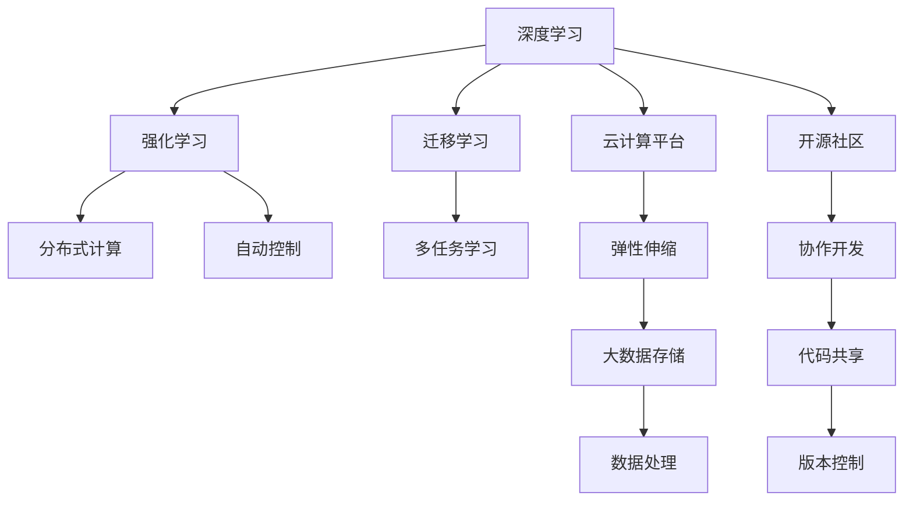
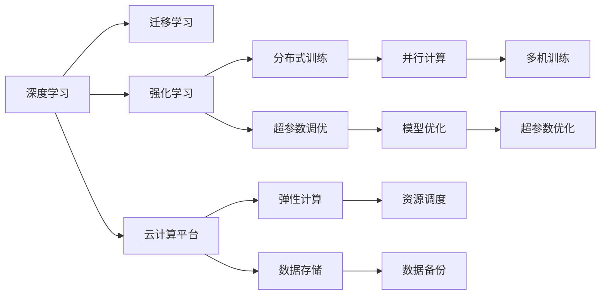
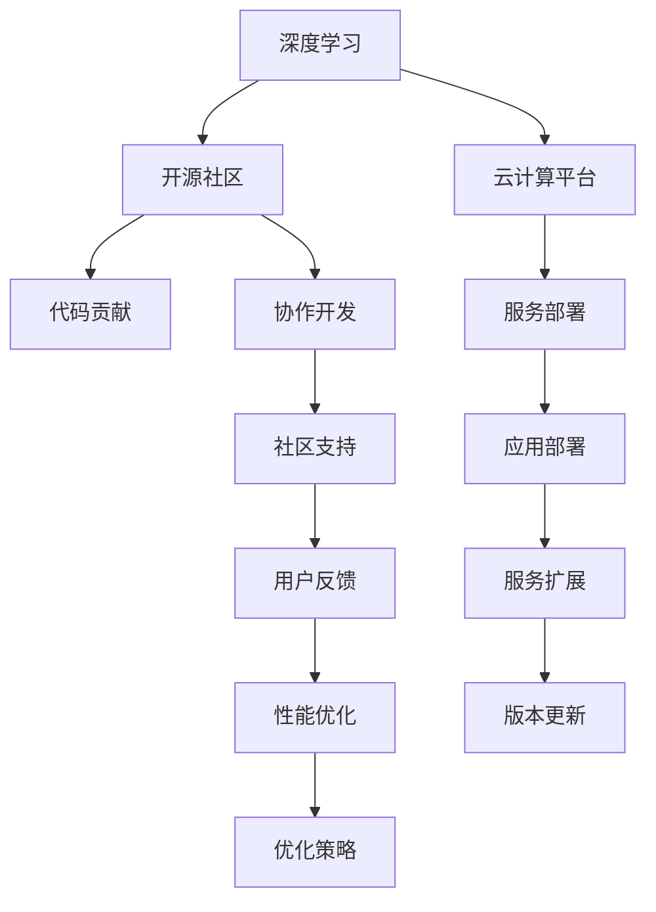

                 

# AI底层创新体系的构成要素

## 1. 背景介绍

### 1.1 问题由来
人工智能（AI）的迅猛发展，深刻影响着社会的各个领域，从智能客服到自动驾驶，从智能推荐到精准医疗，AI技术正在改变我们的生活方式。然而，当前AI技术仍然存在诸多挑战，诸如算力瓶颈、数据稀疏、模型泛化能力不足等问题，制约了AI技术的进一步发展。为了应对这些挑战，构建一个强大的AI底层创新体系显得尤为重要。

### 1.2 问题核心关键点
AI底层创新体系的构建，涵盖了从基础算法、计算平台到应用生态的全方位要素，旨在为AI技术提供坚实的理论基础和高效的工具支持。核心要素包括：

- 基础算法：如深度学习、强化学习、迁移学习等，为AI提供强大的数学模型和方法论支撑。
- 计算平台：如GPU、TPU、云计算平台等，提供高效的计算能力和资源支持。
- 应用生态：如开源社区、API接口、软件工具等，构建AI技术的通用接口和生态系统。
- 数据资源：如数据集、数据标注、数据清洗等，为AI模型训练和优化提供必要的原材料。

本文聚焦于AI底层创新体系的构建，分析了各个核心要素之间的联系和作用，以期为AI技术的发展提供更全面的指导。

## 2. 核心概念与联系

### 2.1 核心概念概述

为了更好地理解AI底层创新体系，本节将介绍几个密切相关的核心概念：

- 深度学习（Deep Learning）：一种基于神经网络的机器学习方法，通过多层非线性变换，实现对复杂数据的高级特征提取和模式识别。
- 强化学习（Reinforcement Learning）：通过与环境的交互，智能体通过试错学习最优策略，从而实现任务自动化的过程。
- 迁移学习（Transfer Learning）：将一个领域学到的知识迁移到另一个领域，提高在新任务上的学习效率。
- 云计算平台（Cloud Computing Platform）：基于互联网的分布式计算和存储服务，提供弹性、按需的计算资源。
- 开源社区（Open Source Community）：以开源理念为核心，汇集开发者、研究者、用户，共同开发、分享和改进软件工具的生态系统。
- 数据集（Dataset）：用于机器学习模型训练、测试和验证的数据集合。

这些核心概念之间的逻辑关系可以通过以下Mermaid流程图来展示：



这个流程图展示了大模型构建的基础要素及其之间的关系：

1. 深度学习通过多层神经网络实现数据的高级特征提取，是AI的基础。
2. 强化学习通过智能体与环境的交互，实现复杂决策任务的自动化。
3. 迁移学习通过领域知识迁移，提高模型在新任务上的适应性。
4. 云计算平台提供弹性的计算和存储资源，支持大规模模型训练和推理。
5. 开源社区汇集开发者，推动软件工具的协作开发和开源分享。
6. 数据集为模型的训练和验证提供原材料，是AI模型的基础。

这些核心概念共同构成了AI底层创新体系的生态系统，为AI技术的研发和应用提供了坚实的理论基础和高效的工具支持。

### 2.2 概念间的关系

这些核心概念之间存在着紧密的联系，形成了AI底层创新体系的完整生态系统。下面我们通过几个Mermaid流程图来展示这些概念之间的关系。

#### 2.2.1 AI技术的构建范式



这个流程图展示了AI技术的构建范式，包括深度学习、迁移学习、强化学习的结合，以及云计算平台、分布式计算、数据存储等基础设施的支持。

#### 2.2.2 AI生态系统的演化



这个流程图展示了AI生态系统的演化过程，从深度学习、开源社区、云计算平台的结合，到社区协作开发、服务部署、应用扩展等环节，最终形成了完整的AI技术生态系统。

#### 2.2.3 AI底层架构的设计

```mermaid
graph TB
    A[深度学习] --> B[分布式训练]
    A --> C[超参数调优]
    A --> D[模型压缩]
    B --> E[并行计算]
    C --> F[自动化调优]
    D --> G[量化加速]
    E --> H[资源调度]
    F --> I[自动优化]
    G --> J[模型压缩]
    H --> K[任务调度]
    I --> L[自适应优化]
    J --> M[模型量化]
    K --> N[资源分配]
    L --> O[动态优化]
    M --> P[资源管理]
    N --> Q[任务管理]
    O --> R[实时优化]
    P --> S[资源监控]
    Q --> T[任务调度]
    R --> U[实时响应]
    S --> V[性能监测]
    T --> W[任务管理]
    U --> X[实时分析]
    V --> Y[性能优化]
    W --> Z[任务调度]
    X --> $[任务管理]
    Y --> [实时优化]
    Z --> [任务调度]
    [实时分析] --> [实时优化]
    [性能优化] --> [实时优化]
```

这个流程图展示了AI底层架构的设计，包括深度学习、分布式训练、超参数调优、模型压缩等基础架构设计，以及分布式计算、资源调度、任务管理等系统架构的设计。

### 2.3 核心概念的整体架构

最后，我们用一个综合的流程图来展示这些核心概念在大模型构建过程中的整体架构：

```mermaid
graph TB
    A[深度学习] --> B[强化学习]
    A --> C[迁移学习]
    A --> D[云计算平台]
    A --> E[开源社区]
    B --> F[分布式计算]
    B --> G[自动控制]
    C --> H[多任务学习]
    D --> I[弹性伸缩]
    E --> J[协作开发]
    I --> K[大数据存储]
    J --> L[代码共享]
    K --> M[数据处理]
    L --> N[版本控制]
    F --> O[并行计算]
    G --> P[超参数调优]
    H --> Q[多任务学习]
    I --> R[资源调度]
    J --> S[社区支持]
    K --> T[数据备份]
    L --> U[版本更新]
    M --> V[数据处理]
    N --> W[版本控制]
    O --> X[并行计算]
    P --> Y[模型优化]
    Q --> Z[多任务学习]
    R --> $[任务调度]
    S --> [代码共享]
    T --> [数据备份]
    U --> [版本更新]
    V --> [数据处理]
    W --> [版本控制]
    X --> [并行计算]
    Y --> [模型优化]
    Z --> [多任务学习]
    $ --> [任务调度]
```

这个综合流程图展示了从深度学习到云计算、开源社区、数据集等各个核心要素在大模型构建过程中的整体架构。

## 3. 核心算法原理 & 具体操作步骤

### 3.1 算法原理概述

AI底层创新体系的构建，涉及多个核心要素，包括算法、平台、生态、数据等。这些要素相互协作，共同构成了一个高效、灵活、可持续的AI创新体系。

#### 3.1.1 深度学习算法

深度学习算法通过多层神经网络，实现对复杂数据的高级特征提取和模式识别。其主要原理包括：

- 前向传播：将输入数据通过多层神经网络，逐步进行特征提取和抽象。
- 反向传播：通过损失函数的计算，反向传播误差，更新网络参数，优化模型性能。
- 参数初始化：采用如Xavier、He等初始化策略，合理设置网络参数，避免梯度消失或爆炸。
- 激活函数：引入如ReLU、Sigmoid等激活函数，增强网络的非线性特性。
- 正则化：采用L1、L2正则化等方法，防止过拟合，提高模型泛化能力。

#### 3.1.2 强化学习算法

强化学习算法通过智能体与环境的交互，实现复杂决策任务的自动化。其主要原理包括：

- 状态表示：通过状态空间映射，将问题转化为可计算的形式。
- 动作空间：定义智能体的动作空间，通过动作选择实现任务执行。
- 奖励函数：设计合适的奖励函数，激励智能体向最优决策方向前进。
- 探索与利用：通过$\epsilon$-greedy等策略，在探索和利用之间取得平衡，避免陷入局部最优。
- 策略更新：通过Q-learning、SARSA等方法，更新智能体的决策策略，优化任务执行效率。

#### 3.1.3 迁移学习算法

迁移学习算法通过领域知识迁移，提高模型在新任务上的适应性。其主要原理包括：

- 领域对齐：通过特征映射对齐，将源任务和目标任务的数据分布统一起来。
- 知识迁移：将源任务学到的知识迁移到目标任务中，提高新任务的性能。
- 多任务学习：通过多个任务的联合训练，提高模型对复杂任务的泛化能力。
- 网络架构：采用如VGG、ResNet等网络架构，提高模型的特征提取能力。
- 超参数调优：通过网格搜索、贝叶斯优化等方法，优化模型的超参数设置。

### 3.2 算法步骤详解

#### 3.2.1 深度学习算法步骤

1. 数据预处理：将原始数据进行归一化、去噪等预处理，提高数据质量。
2. 网络架构设计：选择合适的网络架构，包括卷积神经网络、循环神经网络等。
3. 模型训练：使用梯度下降等优化算法，迭代训练模型，更新网络参数。
4. 模型验证：使用验证集评估模型性能，调整超参数，优化模型。
5. 模型测试：在测试集上评估模型性能，完成模型的部署和应用。

#### 3.2.2 强化学习算法步骤

1. 环境设计：定义智能体的环境，包括状态空间、动作空间和奖励函数。
2. 智能体设计：定义智能体的决策策略，包括Q-learning、SARSA等方法。
3. 训练过程：通过智能体与环境的交互，进行迭代训练，更新决策策略。
4. 性能评估：使用测试集评估智能体的决策效果，调整超参数。
5. 部署应用：将训练好的智能体应用于实际任务中，实现自动化决策。

#### 3.2.3 迁移学习算法步骤

1. 数据预处理：将原始数据进行归一化、去噪等预处理，提高数据质量。
2. 网络架构设计：选择合适的网络架构，包括卷积神经网络、循环神经网络等。
3. 模型训练：使用梯度下降等优化算法，迭代训练模型，更新网络参数。
4. 迁移学习：将源任务学到的知识迁移到目标任务中，提高新任务的性能。
5. 模型验证：使用验证集评估模型性能，调整超参数，优化模型。
6. 模型测试：在测试集上评估模型性能，完成模型的部署和应用。

### 3.3 算法优缺点

AI底层创新体系的构建涉及多个核心要素，每个要素都有其优点和局限性。

#### 3.3.1 深度学习算法的优缺点

深度学习算法的主要优点包括：

- 强大的特征提取能力：通过多层神经网络，实现对复杂数据的高级特征提取和模式识别。
- 泛化能力强：通过大量数据的训练，提高模型的泛化能力，适应不同数据分布。
- 算法成熟度高：深度学习算法已经经过多年的研究和实践，理论基础和算法工具都相对成熟。

其主要缺点包括：

- 计算资源消耗大：深度学习算法需要大量计算资源进行模型训练和推理。
- 过拟合风险高：模型参数过多，容易发生过拟合，需要采取正则化等策略。
- 模型可解释性差：深度学习模型通常被视为"黑盒"系统，难以解释其内部工作机制。

#### 3.3.2 强化学习算法的优缺点

强化学习算法的主要优点包括：

- 自适应能力强：通过智能体与环境的交互，实现动态调整，适应复杂多变的环境。
- 鲁棒性强：通过奖励函数设计，提高模型对环境变化的鲁棒性。
- 应用场景广：强化学习算法适用于各种决策任务，如机器人控制、自动驾驶等。

其主要缺点包括：

- 训练时间较长：需要大量的训练时间和计算资源。
- 状态空间复杂：环境状态空间复杂，难以设计合适的奖励函数。
- 策略优化难度大：智能体的决策策略优化难度大，需要结合多种方法进行优化。

#### 3.3.3 迁移学习算法的优缺点

迁移学习算法的主要优点包括：

- 知识迁移效率高：通过领域知识迁移，提高模型在新任务上的学习效率。
- 数据需求低：在少量数据上也可以实现高效的迁移学习。
- 多任务学习能力强：通过多任务学习，提高模型对复杂任务的泛化能力。

其主要缺点包括：

- 领域对齐难度大：不同领域的知识迁移难度大，需要设计合适的对齐策略。
- 知识共性不足：不同领域之间的知识共性不足，难以实现高效的迁移。
- 数据稀疏风险高：在稀疏数据上迁移学习效果可能不理想。

### 3.4 算法应用领域

AI底层创新体系的构建，涉及多个核心要素，可以应用于各种场景。

#### 3.4.1 深度学习算法应用领域

深度学习算法主要应用于：

- 计算机视觉：如图像分类、目标检测、人脸识别等。
- 自然语言处理：如文本分类、情感分析、机器翻译等。
- 语音识别：如语音识别、语音合成等。
- 推荐系统：如推荐算法、广告投放等。

#### 3.4.2 强化学习算法应用领域

强化学习算法主要应用于：

- 机器人控制：如自动驾驶、无人机控制等。
- 游戏AI：如AlphaGo、星际争霸AI等。
- 金融交易：如量化交易、高频交易等。
- 自然语言处理：如智能客服、机器翻译等。

#### 3.4.3 迁移学习算法应用领域

迁移学习算法主要应用于：

- 医学影像：如病理图像分类、医学图像分割等。
- 自然语言处理：如情感分析、文本分类等。
- 推荐系统：如推荐算法、广告投放等。
- 机器视觉：如物体检测、图像分类等。

## 4. 数学模型和公式 & 详细讲解 & 举例说明

### 4.1 数学模型构建

AI底层创新体系的构建，涉及多个核心要素，包括算法、平台、生态、数据等。这些要素相互协作，共同构成了一个高效、灵活、可持续的AI创新体系。

#### 4.1.1 深度学习数学模型

深度学习模型主要基于神经网络，其数学模型可以表示为：

$$
f(x; \theta) = \sigma \left( \sum_{i=1}^{n} W_i x_i + b_i \right)
$$

其中 $x$ 为输入向量，$\theta$ 为网络参数，$\sigma$ 为激活函数，$W_i$ 为权重矩阵，$b_i$ 为偏置向量。

#### 4.1.2 强化学习数学模型

强化学习模型主要基于智能体的决策策略，其数学模型可以表示为：

$$
Q(s, a) = r + \gamma \max_{a'} Q(s', a')
$$

其中 $s$ 为状态空间，$a$ 为动作空间，$r$ 为即时奖励，$\gamma$ 为折扣因子，$s'$ 为下一状态。

#### 4.1.3 迁移学习数学模型

迁移学习模型主要基于领域知识迁移，其数学模型可以表示为：

$$
f(x; \theta) = \sigma \left( \sum_{i=1}^{n} W_i x_i + b_i \right)
$$

其中 $x$ 为输入向量，$\theta$ 为网络参数，$\sigma$ 为激活函数，$W_i$ 为权重矩阵，$b_i$ 为偏置向量。

### 4.2 公式推导过程

#### 4.2.1 深度学习公式推导

深度学习模型的前向传播公式为：

$$
y = \sigma \left( \sum_{i=1}^{n} W_i x_i + b_i \right)
$$

其中 $\sigma$ 为激活函数，$W_i$ 为权重矩阵，$b_i$ 为偏置向量。

其反向传播公式为：

$$
\frac{\partial L}{\partial W_i} = \frac{\partial L}{\partial y} \frac{\partial y}{\partial x_i}
$$

其中 $L$ 为损失函数，$y$ 为输出向量。

#### 4.2.2 强化学习公式推导

强化学习模型的决策策略为：

$$
\pi(a | s) = \frac{\exp(Q(s, a))}{\sum_{a'} \exp(Q(s, a'))}
$$

其中 $\pi(a | s)$ 为智能体的决策策略，$Q(s, a)$ 为状态动作价值函数。

其状态动作价值函数的更新公式为：

$$
Q(s, a) = r + \gamma \max_{a'} Q(s', a')
$$

其中 $s$ 为状态空间，$a$ 为动作空间，$r$ 为即时奖励，$\gamma$ 为折扣因子，$s'$ 为下一状态。

#### 4.2.3 迁移学习公式推导

迁移学习模型的前向传播公式为：

$$
y = \sigma \left( \sum_{i=1}^{n} W_i x_i + b_i \right)
$$

其中 $\sigma$ 为激活函数，$W_i$ 为权重矩阵，$b_i$ 为偏置向量。

其迁移学习算法为：

$$
f(x; \theta) = \sigma \left( \sum_{i=1}^{n} W_i x_i + b_i \right)
$$

其中 $x$ 为输入向量，$\theta$ 为网络参数，$\sigma$ 为激活函数，$W_i$ 为权重矩阵，$b_i$ 为偏置向量。

### 4.3 案例分析与讲解

#### 4.3.1 深度学习案例

以图像分类为例，深度学习算法可以构建卷积神经网络（CNN）模型，实现对图像的高效分类。具体步骤如下：

1. 数据预处理：将原始图像进行归一化、去噪等预处理，提高数据质量。
2. 网络架构设计：采用卷积层、池化层、全连接层等结构，构建CNN模型。
3. 模型训练：使用梯度下降等优化算法，迭代训练模型，更新网络参数。
4. 模型验证：使用验证集评估模型性能，调整超参数，优化模型。
5. 模型测试：在测试集上评估模型性能，完成模型的部署和应用。

#### 4.3.2 强化学习案例

以自动驾驶为例，强化学习算法可以构建智能体，实现对环境的动态调整，实现自动驾驶。具体步骤如下：

1. 环境设计：定义智能体的环境，包括状态空间、动作空间和奖励函数。
2. 智能体设计：定义智能体的决策策略，包括Q-learning、SARSA等方法。
3. 训练过程：通过智能体与环境的交互，进行迭代训练，更新决策策略。
4. 性能评估：使用测试集评估智能体的决策效果，调整超参数。
5. 部署应用：将训练好的智能体应用于实际任务中，实现自动化决策。

#### 4.3.3 迁移学习案例

以医学影像分类为例，迁移学习算法可以构建医学影像分类模型，实现对病理图像的高效分类。具体步骤如下：

1. 数据预处理：将原始图像进行归一化、去噪等预处理，提高数据质量。
2. 网络架构设计：采用卷积神经网络、循环神经网络等结构，构建分类模型。
3. 模型训练：使用梯度下降等优化算法，迭代训练模型，更新网络参数。
4. 迁移学习：将源任务学到的知识迁移到目标任务中，提高新任务的性能。
5. 模型验证：使用验证集评估模型性能，调整超参数，优化模型。
6. 模型测试：在测试集上评估模型性能，完成模型的部署和应用。

## 5. 项目实践：代码实例和详细解释说明

### 5.1 开发环境搭建

在进行AI底层创新体系的构建和实践前，我们需要准备好开发环境。以下是使用Python进行PyTorch开发的环境配置流程：

1. 安装Anaconda：从官网下载并安装Anaconda，用于创建独立的Python环境。

2. 创建并激活虚拟环境：
```bash
conda create -n pytorch-env python=3.8 
conda activate pytorch-env
```

3. 安装PyTorch：根据CUDA版本，从官网获取对应的安装命令。例如：
```bash
conda install pytorch torchvision torchaudio cudatoolkit=11.1 -c pytorch -c conda-forge
```

4. 安装Transformers库：
```bash
pip install transformers
```

5. 安装各类工具包：
```bash
pip install numpy pandas scikit-learn matplotlib tqdm jupyter notebook ipython
```

完成上述步骤后，即可在`pytorch-env`环境中开始AI底层创新体系的构建和实践。

### 5.2 源代码详细实现

这里我们以深度学习模型为例，给出使用PyTorch进行图像分类任务的PyTorch代码实现。

首先，定义数据处理函数：

```python
import torch
import torchvision
from torchvision import transforms

# 定义数据预处理
transform = transforms.Compose([
    transforms.Resize(256),
    transforms.CenterCrop(224),
    transforms.ToTensor(),
    transforms.Normalize(mean=[0.485, 0.456, 0.406],
                        std=[0.229, 0.224, 0.225])
])

# 加载数据集
train_dataset = torchvision.datasets.CIFAR10(root='./data', train=True,
                                           transform=transform, download=True)
test_dataset = torchvision.datasets.CIFAR10(root='./data', train=False,
                                          transform=transform, download=True)

# 创建数据加载器
train_loader = torch.utils.data.DataLoader(train_dataset, batch_size=32,
                                         shuffle=True, num_workers=4)
test_loader = torch.utils.data.DataLoader(test_dataset, batch_size=32,
                                        shuffle=False, num_workers=4)
```

然后，定义模型和优化器：

```python
import torch.nn as nn
import torch.optim as optim

# 定义模型
class Net(nn.Module):
    def __init__(self):
        super(Net, self).__init__()
        self.conv1 = nn.Conv2d(3, 64, kernel_size=3, stride=1, padding=1)
        self.pool = nn.MaxPool2d(kernel_size=2, stride=2)
        self.conv2 = nn.Conv2d(64, 128, kernel_size=3, stride=1, padding=1)
        self.fc1 = nn.Linear(128 * 7 * 7, 512)
        self.fc2 = nn.Linear(512, 10)

    def forward(self, x):
        x = self.pool(F.relu(self.conv1(x)))
        x = self.pool(F.relu(self.conv2(x)))
        x = x.view(-1, 128 * 7 * 7)
        x = F.relu(self.fc1(x))
        x = self.fc2(x)
        return x

# 定义优化器
model = Net()
optimizer = optim.SGD(model.parameters(), lr=0.001, momentum=0.9)
```

接着，定义训练和评估函数：

```python
import torch.nn.functional as F

# 定义训练函数
def train(epoch):
    model.train()
    for batch_idx, (data, target) in enumerate(train_loader):
        optimizer.zero_grad()
        output = model(data)
        loss = F.cross_entropy(output, target)
        loss.backward()
        optimizer.step()
        if (batch_idx+1) % 100 == 0:
            print('Train Epoch: {} [{}/{} ({:.0f}%)]\tLoss: {:.6f}'.format(
                epoch, batch_idx * len(data), len(train_loader.dataset),
                100. * batch_idx / len(train_loader), loss.item()))

# 定义评估函数
def test():
    model.eval()
    correct = 0
    

