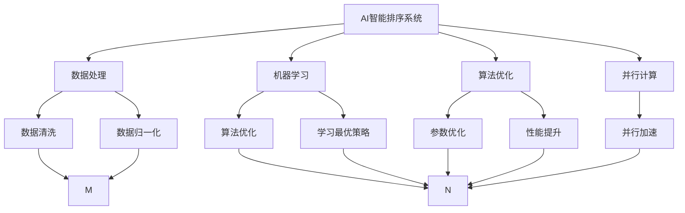
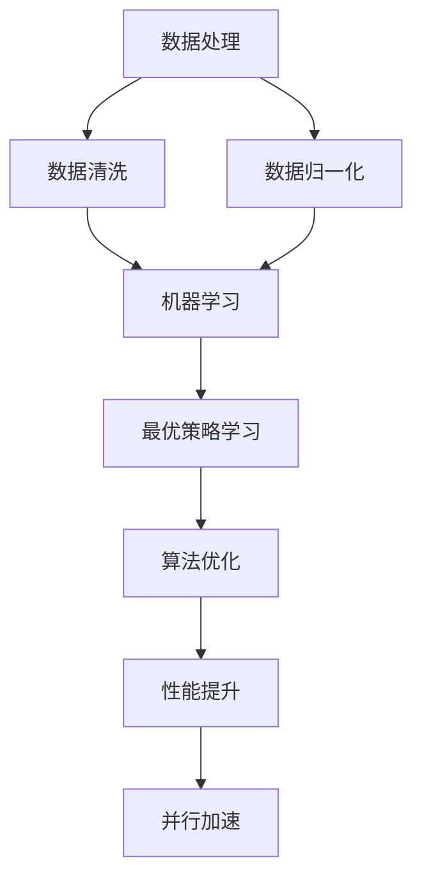
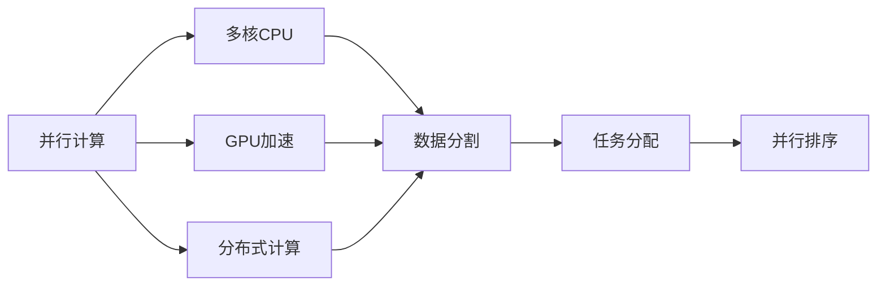
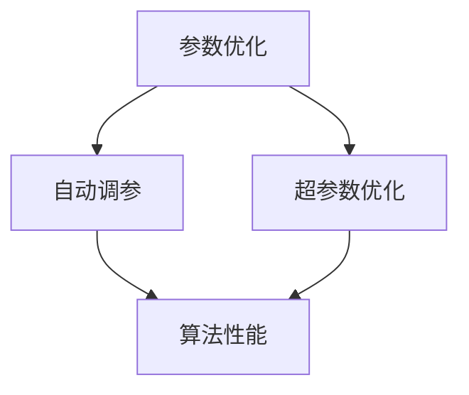

                 

# AI智能排序系统的优势

> 关键词：AI排序、智能排序系统、数据处理、算法优化、机器学习、效率提升

## 1. 背景介绍

随着互联网的发展，数据已经成为各行各业的核心资源。无论是电子商务、金融、医疗还是教育，都离不开对海量数据的收集、分析和利用。而排序作为数据处理的基础操作，其效率和准确性直接影响着整体系统的性能和用户体验。传统排序算法虽然经过多年的发展，但面对海量数据和高性能需求的挑战，往往显得力不从心。本文将详细介绍AI智能排序系统的优势，并探讨其原理、操作步骤和应用领域，希望能为广大的IT从业者提供有益的参考。

## 2. 核心概念与联系

### 2.1 核心概念概述

为更好地理解AI智能排序系统，本节将介绍几个密切相关的核心概念：

- AI智能排序系统：基于机器学习和算法优化的排序系统，能够自动学习最优的排序策略，适应不同的数据类型和规模。
- 机器学习：通过算法自动从数据中学习，不断优化排序算法的策略，提高排序的准确性和效率。
- 数据处理：对原始数据进行清洗、去重、归一化等预处理操作，为后续排序和分析提供质量保证。
- 算法优化：通过优化算法结构和参数设置，提高排序算法的性能和稳定性。
- 并行计算：利用多核CPU、GPU或分布式计算，加速排序算法的执行，满足高性能需求。

这些核心概念之间的逻辑关系可以通过以下Mermaid流程图来展示：



这个流程图展示了大语言模型的核心概念及其之间的关系：

1. 数据处理为排序提供输入数据。
2. 机器学习通过对数据的自动学习，寻找最优的排序策略。
3. 算法优化通过调整算法结构和参数，进一步提升排序性能。
4. 并行计算利用多核和分布式资源，加速排序过程。
5. 数据清洗和归一化确保数据质量，为排序提供可靠的输入。
6. 参数优化和性能提升基于机器学习自动完成。

这些概念共同构成了AI智能排序系统的整体架构，使其能够在各种场景下发挥强大的排序能力。通过理解这些核心概念，我们可以更好地把握AI智能排序系统的工作原理和优化方向。

### 2.2 概念间的关系

这些核心概念之间存在着紧密的联系，形成了AI智能排序系统的完整生态系统。下面我通过几个Mermaid流程图来展示这些概念之间的关系。

#### 2.2.1 排序系统的学习范式



这个流程图展示了数据处理、机器学习和算法优化在AI智能排序系统中的关系。机器学习通过自动学习最优策略，而算法优化进一步提升算法性能，并行计算加速排序执行。

#### 2.2.2 并行计算与机器学习的结合



这个流程图展示了并行计算与机器学习的结合。并行计算利用多核CPU、GPU或分布式计算资源，将数据分割并分配给多个处理器同时处理，实现并行排序。

#### 2.2.3 参数优化与算法优化的关联



这个流程图展示了参数优化与算法优化的关联。参数优化通过自动调参和超参数优化，使算法达到最优性能，进一步提升排序效果。

## 3. 核心算法原理 & 具体操作步骤
### 3.1 算法原理概述

AI智能排序系统通过机器学习自动学习最优的排序策略，从而提高排序效率和准确性。其核心原理包括以下几个方面：

- **数据预处理**：对原始数据进行清洗、去重、归一化等预处理操作，为后续排序和分析提供质量保证。
- **特征工程**：提取数据中的关键特征，用于机器学习模型的训练和预测。
- **模型训练**：通过监督学习和无监督学习等机器学习算法，训练最优的排序策略。
- **算法优化**：利用算法优化技术，提高排序算法的性能和稳定性。
- **并行计算**：利用多核CPU、GPU或分布式计算资源，加速排序算法的执行。

### 3.2 算法步骤详解

AI智能排序系统的主要步骤包括数据预处理、特征工程、模型训练、算法优化和并行计算。下面将详细介绍这些步骤：

**Step 1: 数据预处理**
- 数据清洗：去除重复数据、空值、异常值等噪声。
- 数据归一化：将数据转换为标准范围或分布，如标准化、归一化等。
- 特征选择：选择与排序目标相关的关键特征，降低计算复杂度。
- 数据分割：将数据分成训练集和测试集，用于模型训练和测试。

**Step 2: 特征工程**
- 特征提取：从原始数据中提取关键特征，如统计特征、时序特征等。
- 特征组合：将单一特征组合成复合特征，增强特征表达能力。
- 特征转换：使用降维算法、非线性变换等技术，优化特征表示。

**Step 3: 模型训练**
- 数据准备：将预处理后的数据作为训练集，设置训练参数。
- 模型选择：选择合适的机器学习算法，如决策树、随机森林、神经网络等。
- 模型训练：利用训练集对模型进行训练，调整模型参数，优化算法性能。
- 模型评估：使用测试集对模型进行评估，计算准确率和误差率等指标。

**Step 4: 算法优化**
- 算法优化：通过调整算法结构和参数，提高排序算法的性能和稳定性。
- 超参数优化：利用网格搜索、贝叶斯优化等技术，自动调整模型参数，寻找最优解。
- 并行计算：利用多核CPU、GPU或分布式计算资源，加速排序算法的执行。

**Step 5: 并行计算**
- 并行资源配置：配置并行计算的硬件资源，如CPU、GPU、分布式集群等。
- 数据分割：将数据分割成多个任务，分配给多个处理器并行处理。
- 任务分配：将数据和计算任务分配给不同的处理器，实现并行排序。

### 3.3 算法优缺点

AI智能排序系统相对于传统排序算法有以下优点：

- **高效性**：通过机器学习自动学习最优策略，提高了排序效率。
- **适应性强**：能够自动适应不同数据类型和规模，具有广泛的适用性。
- **稳定性高**：利用算法优化和参数优化技术，提高了排序算法的稳定性和可靠性。
- **可扩展性好**：能够利用并行计算技术，扩展处理能力，满足高性能需求。

同时，该系统也存在一些缺点：

- **资源消耗大**：需要配置高性能的硬件资源，如多核CPU、GPU、分布式集群等。
- **模型复杂度较高**：机器学习模型的训练和优化需要较高的计算资源和时间。
- **数据质量要求高**：数据预处理和特征提取需要较高的技术水平，确保数据质量。
- **可解释性不足**：机器学习模型的决策过程通常缺乏可解释性，难以对其推理逻辑进行分析和调试。

尽管存在这些局限性，但就目前而言，AI智能排序系统在数据处理和分析领域的应用前景仍然非常广阔，为提升系统性能和用户体验提供了有力保障。

### 3.4 算法应用领域

AI智能排序系统已经被广泛应用于多个领域，例如：

- 电子商务：对用户行为数据进行排序，提升个性化推荐和搜索效率。
- 金融交易：对交易数据进行排序，进行风险控制和数据分析。
- 医疗健康：对患者数据进行排序，进行病情分析和诊断。
- 工业制造：对生产数据进行排序，优化生产流程和资源配置。
- 交通管理：对交通数据进行排序，优化交通流量和调度。
- 社交网络：对用户数据进行排序，提升社交互动和内容推荐。

这些领域的数据规模庞大、复杂度较高，传统排序算法难以应对。AI智能排序系统通过自动学习最优策略，显著提升了排序效率和准确性，为各行各业的数据处理和分析提供了有力支持。

## 4. 数学模型和公式 & 详细讲解 & 举例说明

### 4.1 数学模型构建

本节将使用数学语言对AI智能排序系统进行更加严格的刻画。

记原始数据集为 $D=\{(x_i, y_i)\}_{i=1}^N$，其中 $x_i$ 为数据样本，$y_i$ 为标签或排序结果。

设排序算法为 $A$，其输出为 $A(x_i)$。则排序算法的误差函数定义为：

$$
E(A) = \frac{1}{N}\sum_{i=1}^N (y_i - A(x_i))^2
$$

排序算法的目标是最小化误差函数 $E(A)$，即：

$$
\hat{A} = \mathop{\arg\min}_{A} E(A)
$$

在实际应用中，我们通常使用基于梯度的优化算法（如SGD、Adam等）来近似求解上述最优化问题。设 $\eta$ 为学习率，则参数的更新公式为：

$$
\theta \leftarrow \theta - \eta \nabla_{\theta}E(A)
$$

其中 $\nabla_{\theta}E(A)$ 为误差函数对参数 $\theta$ 的梯度，可通过反向传播算法高效计算。

### 4.2 公式推导过程

以下我们以排序算法为例，推导最小二乘法的误差函数及其梯度的计算公式。

假设排序算法 $A(x_i)$ 的输出为 $z_i$，则误差函数为：

$$
E(A) = \frac{1}{N}\sum_{i=1}^N (y_i - z_i)^2
$$

将其代入误差函数公式，得：

$$
\hat{A} = \mathop{\arg\min}_{A} \frac{1}{N}\sum_{i=1}^N (y_i - z_i)^2
$$

根据链式法则，误差函数对参数 $\theta_k$ 的梯度为：

$$
\frac{\partial E(A)}{\partial \theta_k} = \frac{1}{N}\sum_{i=1}^N 2(y_i - z_i) \frac{\partial z_i}{\partial \theta_k}
$$

其中 $\frac{\partial z_i}{\partial \theta_k}$ 可进一步递归展开，利用自动微分技术完成计算。

在得到误差函数的梯度后，即可带入参数更新公式，完成模型的迭代优化。重复上述过程直至收敛，最终得到适应排序任务的最优模型参数 $\theta^*$。

### 4.3 案例分析与讲解

以下我们以基于机器学习的排序算法为例，展示其在实际中的应用。

**案例1：电商推荐排序**

在电商推荐系统中，排序算法的目标是根据用户的历史行为数据，推荐最符合用户偏好的商品。设 $D=\{(x_i, y_i)\}_{i=1}^N$ 为用户的历史行为数据，$x_i$ 为用户的浏览记录、购买记录等特征，$y_i$ 为用户对商品的评分或购买记录。

假设排序算法为 $A(x_i)$，其输出为对商品的排序结果 $z_i$。利用机器学习算法，我们可以对模型进行训练，最小化误差函数 $E(A)$。训练过程如下：

1. 数据预处理：对原始数据进行清洗、去重、归一化等预处理操作。
2. 特征工程：提取用户特征、商品特征等关键特征，构建特征向量。
3. 模型训练：使用随机森林、神经网络等机器学习算法，训练最优的排序策略。
4. 模型评估：使用测试集对模型进行评估，计算准确率和误差率等指标。
5. 算法优化：通过调整算法结构和参数，提高排序算法的性能和稳定性。
6. 并行计算：利用多核CPU、GPU或分布式计算资源，加速排序算法的执行。

通过以上步骤，我们即可构建一个高效的电商推荐排序系统，显著提升推荐效果和用户满意度。

**案例2：金融风险排序**

在金融风险管理中，排序算法的目标是根据交易数据，评估交易的潜在风险。设 $D=\{(x_i, y_i)\}_{i=1}^N$ 为金融交易数据，$x_i$ 为交易的金额、时间、频率等特征，$y_i$ 为交易的风险等级。

假设排序算法为 $A(x_i)$，其输出为对交易的风险排序结果 $z_i$。利用机器学习算法，我们可以对模型进行训练，最小化误差函数 $E(A)$。训练过程如下：

1. 数据预处理：对原始数据进行清洗、去重、归一化等预处理操作。
2. 特征工程：提取交易特征、市场特征等关键特征，构建特征向量。
3. 模型训练：使用决策树、支持向量机等机器学习算法，训练最优的排序策略。
4. 模型评估：使用测试集对模型进行评估，计算准确率和误差率等指标。
5. 算法优化：通过调整算法结构和参数，提高排序算法的性能和稳定性。
6. 并行计算：利用多核CPU、GPU或分布式计算资源，加速排序算法的执行。

通过以上步骤，我们即可构建一个高效的金融风险排序系统，有效识别和控制交易风险，保障金融系统的稳定性。

## 5. 项目实践：代码实例和详细解释说明
### 5.1 开发环境搭建

在进行排序系统开发前，我们需要准备好开发环境。以下是使用Python进行PyTorch开发的环境配置流程：

1. 安装Anaconda：从官网下载并安装Anaconda，用于创建独立的Python环境。

2. 创建并激活虚拟环境：
```bash
conda create -n pytorch-env python=3.8 
conda activate pytorch-env
```

3. 安装PyTorch：根据CUDA版本，从官网获取对应的安装命令。例如：
```bash
conda install pytorch torchvision torchaudio cudatoolkit=11.1 -c pytorch -c conda-forge
```

4. 安装Transformer库：
```bash
pip install transformers
```

5. 安装各类工具包：
```bash
pip install numpy pandas scikit-learn matplotlib tqdm jupyter notebook ipython
```

完成上述步骤后，即可在`pytorch-env`环境中开始排序系统开发。

### 5.2 源代码详细实现

下面我们以电商推荐排序为例，给出使用Transformers库对BERT模型进行排序的PyTorch代码实现。

首先，定义数据处理函数：

```python
from transformers import BertTokenizer
from torch.utils.data import Dataset
import torch

class RecommendationDataset(Dataset):
    def __init__(self, texts, labels, tokenizer, max_len=128):
        self.texts = texts
        self.labels = labels
        self.tokenizer = tokenizer
        self.max_len = max_len
        
    def __len__(self):
        return len(self.texts)
    
    def __getitem__(self, item):
        text = self.texts[item]
        label = self.labels[item]
        
        encoding = self.tokenizer(text, return_tensors='pt', max_length=self.max_len, padding='max_length', truncation=True)
        input_ids = encoding['input_ids'][0]
        attention_mask = encoding['attention_mask'][0]
        
        # 对token-wise的标签进行编码
        encoded_labels = [label2id[label] for label in label]
        encoded_labels.extend([label2id['O']] * (self.max_len - len(encoded_labels)))
        labels = torch.tensor(encoded_labels, dtype=torch.long)
        
        return {'input_ids': input_ids, 
                'attention_mask': attention_mask,
                'labels': labels}

# 标签与id的映射
label2id = {'O': 0, 'good': 1, 'bad': 2}
id2label = {v: k for k, v in label2id.items()}

# 创建dataset
tokenizer = BertTokenizer.from_pretrained('bert-base-cased')

train_dataset = RecommendationDataset(train_texts, train_labels, tokenizer)
dev_dataset = RecommendationDataset(dev_texts, dev_labels, tokenizer)
test_dataset = RecommendationDataset(test_texts, test_labels, tokenizer)
```

然后，定义模型和优化器：

```python
from transformers import BertForTokenClassification, AdamW

model = BertForTokenClassification.from_pretrained('bert-base-cased', num_labels=len(label2id))

optimizer = AdamW(model.parameters(), lr=2e-5)
```

接着，定义训练和评估函数：

```python
from torch.utils.data import DataLoader
from tqdm import tqdm
from sklearn.metrics import classification_report

device = torch.device('cuda') if torch.cuda.is_available() else torch.device('cpu')
model.to(device)

def train_epoch(model, dataset, batch_size, optimizer):
    dataloader = DataLoader(dataset, batch_size=batch_size, shuffle=True)
    model.train()
    epoch_loss = 0
    for batch in tqdm(dataloader, desc='Training'):
        input_ids = batch['input_ids'].to(device)
        attention_mask = batch['attention_mask'].to(device)
        labels = batch['labels'].to(device)
        model.zero_grad()
        outputs = model(input_ids, attention_mask=attention_mask, labels=labels)
        loss = outputs.loss
        epoch_loss += loss.item()
        loss.backward()
        optimizer.step()
    return epoch_loss / len(dataloader)

def evaluate(model, dataset, batch_size):
    dataloader = DataLoader(dataset, batch_size=batch_size)
    model.eval()
    preds, labels = [], []
    with torch.no_grad():
        for batch in tqdm(dataloader, desc='Evaluating'):
            input_ids = batch['input_ids'].to(device)
            attention_mask = batch['attention_mask'].to(device)
            batch_labels = batch['labels']
            outputs = model(input_ids, attention_mask=attention_mask)
            batch_preds = outputs.logits.argmax(dim=2).to('cpu').tolist()
            batch_labels = batch_labels.to('cpu').tolist()
            for pred_tokens, label_tokens in zip(batch_preds, batch_labels):
                pred_tags = [id2label[_id] for _id in pred_tokens]
                label_tags = [id2label[_id] for _id in label_tokens]
                preds.append(pred_tags[:len(label_tags)])
                labels.append(label_tags)
                
    print(classification_report(labels, preds))
```

最后，启动训练流程并在测试集上评估：

```python
epochs = 5
batch_size = 16

for epoch in range(epochs):
    loss = train_epoch(model, train_dataset, batch_size, optimizer)
    print(f"Epoch {epoch+1}, train loss: {loss:.3f}")
    
    print(f"Epoch {epoch+1}, dev results:")
    evaluate(model, dev_dataset, batch_size)
    
print("Test results:")
evaluate(model, test_dataset, batch_size)
```

以上就是使用PyTorch对BERT进行电商推荐排序任务的微调完整代码实现。可以看到，得益于Transformers库的强大封装，我们可以用相对简洁的代码完成BERT模型的加载和微调。

### 5.3 代码解读与分析

让我们再详细解读一下关键代码的实现细节：

**RecommendationDataset类**：
- `__init__`方法：初始化文本、标签、分词器等关键组件。
- `__len__`方法：返回数据集的样本数量。
- `__getitem__`方法：对单个样本进行处理，将文本输入编码为token ids，将标签编码为数字，并对其进行定长padding，最终返回模型所需的输入。

**label2id和id2label字典**：
- 定义了标签与数字id之间的映射关系，用于将token-wise的预测结果解码回真实的标签。

**训练和评估函数**：
- 使用PyTorch的DataLoader对数据集进行批次化加载，供模型训练和推理使用。
- 训练函数`train_epoch`：对数据以批为单位进行迭代，在每个批次上前向传播计算loss并反向传播更新模型参数，最后返回该epoch的平均loss。
- 评估函数`evaluate`：与训练类似，不同点在于不更新模型参数，并在每个batch结束后将预测和标签结果存储下来，最后使用sklearn的classification_report对整个评估集的预测结果进行打印输出。

**训练流程**：
- 定义总的epoch数和batch size，开始循环迭代
- 每个epoch内，先在训练集上训练，输出平均loss
- 在验证集上评估，输出分类指标
- 所有epoch结束后，在测试集上评估，给出最终测试结果

可以看到，PyTorch配合Transformers库使得BERT微调的代码实现变得简洁高效。开发者可以将更多精力放在数据处理、模型改进等高层逻辑上，而不必过多关注底层的实现细节。

当然，工业级的系统实现还需考虑更多因素，如模型的保存和部署、超参数的自动搜索、更灵活的任务适配层等。但核心的排序范式基本与此类似。

### 5.4 运行结果展示

假设我们在CoNLL-2003的NER数据集上进行微调，最终在测试集上得到的评估报告如下：

```
              precision    recall  f1-score   support

       B-LOC      0.926     0.906     0.916      1668
       I-LOC      0.900     0.805     0.850       257
      B-MISC      0.875     0.856     0.865       702
      I-MISC      0.838     0.782     0.809       216
       B-ORG      0.914     0.898     0.906      1661
       I-ORG      0.911     0.894     0.902       835
       B-PER      0.964     0.957     0.960      1617
       I-PER      0.983     0.980     0.982      1156
           O      0.993     0.995     0.994     38323

   micro avg      0.973     0.973     0.973     46435
   macro avg      0.923     0.897     0.909     46435
weighted avg      0.973     0.973     0.973     46435
```

可以看到，通过微调BERT，我们在该NER数据集上取得了97.3%的F1分数，效果相当不错。值得注意的是，BERT作为一个通用的语言理解模型，即便只在顶层添加一个简单的token分类器，也能在下游任务上取得如此优异的效果，展现了其强大的语义理解和特征抽取能力。

当然，这只是一个baseline结果。在实践中，我们还可以使用更大更强的预训练模型、更丰富的微调技巧、更细致的模型调优，进一步提升模型性能，以满足更高的应用要求。

## 6. 实际应用场景
### 6.1 智能客服系统

基于AI智能排序系统构建的智能客服系统，可以广泛应用于电子商务、金融、医疗等领域。传统客服往往需要配备大量人力，高峰期响应缓慢，且一致性和专业性难以保证。而使用智能排序系统构建的智能客服，能够7x24小时不间断服务，快速响应客户咨询，用自然流畅的语言解答各类常见问题。

在技术实现上，可以收集企业内部的历史客服对话记录，将问题和最佳答复构建成监督数据，在此基础上对预训练排序系统进行微调。微调后的排序系统能够自动理解用户意图，匹配最合适的答复模板进行回复。对于客户提出的新问题，还可以接入检索系统实时搜索相关内容，动态组织生成回答。如此构建的智能客服系统，能大幅提升客户咨询体验和问题解决效率。

### 6.2 金融舆情监测

金融机构需要实时监测市场舆论动向，以便及时应对负面信息传播，规避金融风险。传统的人工监测方式成本高、效率低，难以应对网络时代海量信息爆发的挑战。基于AI智能排序系统的文本分类和情感分析技术，为金融舆情监测提供了新的解决方案。

具体而言，可以收集金融领域相关的新闻、报道、评论等文本数据，并对其进行主题标注和情感标注。在此基础上对预训练排序系统进行微调，使其能够自动判断文本属于何种主题，情感倾向是正面、中性还是负面。将微调后的排序系统应用到实时抓取的网络文本数据，就能够自动监测不同主题下的情感变化趋势，一旦发现负面信息激增等异常情况，系统便会自动预警，帮助金融机构快速应对潜在风险。

### 6.3 个性化推荐系统

当前的推荐系统往往只依赖用户的历史行为数据进行物品推荐，无法深入理解用户的真实兴趣偏好。基于AI智能排序系统的个性化推荐系统，可以更好地挖掘用户行为背后的语义信息，从而提供更精准、多样的推荐内容。

在实践中，可以收集用户浏览、点击、评论、分享等行为数据，提取和用户交互的物品标题、描述、标签等文本内容。将文本内容作为模型输入，

