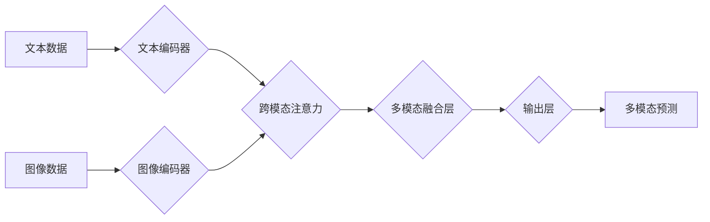

## 多模态大模型：技术原理与实战 工具和算法框架介绍

> 关键词：多模态大模型、Transformer、视觉语言模型、文本图像生成、自然语言处理、计算机视觉、深度学习、算法框架

## 1. 背景介绍

近年来，人工智能领域取得了令人瞩目的进展，其中大模型技术作为重要驱动力，在自然语言处理 (NLP)、计算机视觉 (CV) 等领域展现出强大的能力。然而，传统的单模态大模型仅处理单一类型数据，例如文本或图像，难以捕捉现实世界中多模态信息的丰富性和复杂性。

多模态大模型 (Multimodal Large Models) 应运而生，旨在融合不同模态数据 (如文本、图像、音频、视频等) 的信息，构建更全面、更智能的认知模型。这种融合能够打破模态之间的信息孤岛，实现跨模态理解、生成和交互，为人工智能的应用拓展了新的边界。

## 2. 核心概念与联系

多模态大模型的核心概念是将不同模态数据进行统一表示和学习，从而实现跨模态的理解和交互。

**2.1 多模态数据融合**

多模态数据融合是指将来自不同模态的数据进行有效整合，提取其潜在的关联性和互补性。常用的融合方法包括：

* **早期融合:** 在特征提取阶段将不同模态数据进行拼接或连接，形成联合特征向量。
* **晚期融合:** 在决策阶段将不同模态模型的输出进行融合，例如平均、加权求和或投票等。
* **跨模态注意力机制:** 利用注意力机制学习不同模态数据之间的关系，动态地权衡不同模态信息的贡献。

**2.2 多模态表示学习**

多模态表示学习是指将不同模态数据映射到一个统一的语义空间，使得不同模态的数据在该空间中具有相似的表示。常用的方法包括：

* **共享嵌入:** 使用相同的参数矩阵将不同模态数据映射到同一个嵌入空间。
* **跨模态对比学习:** 通过对比不同模态数据之间的相似性和差异性，学习更有效的表示。

**2.3 多模态模型架构**

多模态大模型通常基于 Transformer 架构，其强大的序列建模能力和自注意力机制能够有效地处理不同模态数据的长程依赖关系。常见的多模态 Transformer 架构包括：

* **Vision Transformer (ViT):** 将图像分割成固定大小的patch，并将其作为文本序列进行处理。
* **BERT-Vision:** 将 BERT 模型与图像特征提取器结合，实现文本和图像的联合表示学习。
* **CLIP:** 使用对比学习方法训练文本和图像的联合表示，能够实现零样本图像分类和文本描述等任务。

**Mermaid 流程图**



## 3. 核心算法原理 & 具体操作步骤

### 3.1 算法原理概述

多模态大模型的核心算法原理是基于深度学习，特别是 Transformer 架构，通过大量的训练数据学习不同模态数据的表示和关系。

* **文本编码器:** 使用 Transformer 模型或其变体 (如 BERT、GPT) 对文本数据进行编码，将文本转换为固定长度的向量表示。
* **图像编码器:** 使用 CNN 或 Vision Transformer 模型对图像数据进行编码，将图像转换为固定长度的向量表示。
* **跨模态注意力机制:** 学习不同模态数据之间的关系，动态地权衡不同模态信息的贡献。
* **多模态融合层:** 将不同模态的编码结果进行融合，形成联合表示。
* **输出层:** 根据任务类型，使用不同的输出层进行预测，例如分类、回归、生成等。

### 3.2 算法步骤详解

1. **数据预处理:** 将文本和图像数据进行预处理，例如文本分词、词嵌入、图像裁剪、增强等。
2. **模型训练:** 使用训练数据训练多模态大模型，包括文本编码器、图像编码器、跨模态注意力机制和多模态融合层。
3. **模型评估:** 使用验证集或测试集评估模型的性能，例如准确率、召回率、F1-score等。
4. **模型调优:** 根据评估结果，调整模型参数、超参数或训练策略，以提高模型性能。
5. **模型部署:** 将训练好的模型部署到实际应用场景中，例如图像字幕生成、文本问答、多模态检索等。

### 3.3 算法优缺点

**优点:**

* 能够融合不同模态数据，捕捉更丰富的语义信息。
* 能够实现跨模态理解、生成和交互。
* 在许多任务中表现出优于单模态模型的性能。

**缺点:**

* 训练数据量大，计算资源需求高。
* 模型复杂度高，推理速度相对较慢。
* 跨模态数据对齐和融合仍然是一个挑战。

### 3.4 算法应用领域

多模态大模型在许多领域都有广泛的应用，例如：

* **计算机视觉:** 图像字幕生成、文本问答、图像检索、目标检测、场景理解等。
* **自然语言处理:** 文本摘要、机器翻译、情感分析、对话系统等。
* **人机交互:** 多模态对话系统、虚拟助手、增强现实等。
* **医疗保健:** 病理图像诊断、医学影像分析、患者问诊等。
* **教育:** 智能辅导系统、个性化学习平台等。

## 4. 数学模型和公式 & 详细讲解 & 举例说明

### 4.1 数学模型构建

多模态大模型的数学模型通常基于深度学习框架，例如 PyTorch 或 TensorFlow。模型的结构由多个层组成，每个层都有特定的数学公式进行计算。

**4.1.1 Transformer 层**

Transformer 层的核心是自注意力机制，其数学公式如下：

$$
Attention(Q, K, V) = \frac{exp(Q \cdot K^T / \sqrt{d_k})}{exp(Q \cdot K^T / \sqrt{d_k})} \cdot V
$$

其中：

* $Q$：查询矩阵
* $K$：键矩阵
* $V$：值矩阵
* $d_k$：键向量的维度

自注意力机制能够学习不同词之间的关系，并赋予每个词不同的权重，从而捕捉文本序列中的长程依赖关系。

**4.1.2 多模态融合层**

多模态融合层将不同模态的编码结果进行融合，常用的方法包括：

* **加权求和:**

$$
F = \alpha_t * T + \alpha_v * V
$$

其中：

* $F$：融合后的特征向量
* $T$：文本编码结果
* $V$：图像编码结果
* $\alpha_t$ 和 $\alpha_v$：文本和图像的权重

* **跨模态注意力机制:**

$$
F = Attention(T, V) * V
$$

其中：

* $F$：融合后的特征向量
* $T$：文本编码结果
* $V$：图像编码结果

### 4.2 公式推导过程

多模态大模型的训练过程通常使用交叉熵损失函数，其目标是最小化模型预测结果与真实标签之间的差异。

**4.2.1 交叉熵损失函数:**

$$
Loss = - \sum_{i=1}^{N} y_i * log(p_i)
$$

其中：

* $N$：样本数量
* $y_i$：真实标签
* $p_i$：模型预测概率

### 4.3 案例分析与讲解

**4.3.1 图像字幕生成:**

多模态大模型可以将图像作为输入，生成相应的文本描述。例如，给定一张图片，模型可以生成描述该图片的内容的句子，例如“一只小狗在公园里玩耍”。

**4.3.2 文本问答:**

多模态大模型可以结合文本和图像作为输入，回答用户的问题。例如，用户提供一张图片和一个问题“这是什么动物？”，模型可以根据图片和文本信息回答“这是一只猫”。

## 5. 项目实践：代码实例和详细解释说明

### 5.1 开发环境搭建

* **操作系统:** Linux 或 macOS
* **编程语言:** Python
* **深度学习框架:** PyTorch 或 TensorFlow
* **其他依赖库:** torchvision, transformers, numpy, pandas等

### 5.2 源代码详细实现

```python
# 使用 PyTorch 实现简单的多模态融合模型

import torch
import torch.nn as nn

class MultimodalFusionModel(nn.Module):
    def __init__(self, text_encoder, image_encoder):
        super(MultimodalFusionModel, self).__init__()
        self.text_encoder = text_encoder
        self.image_encoder = image_encoder
        self.fusion_layer = nn.Linear(text_encoder.output_dim + image_encoder.output_dim, 1)

    def forward(self, text_input, image_input):
        text_features = self.text_encoder(text_input)
        image_features = self.image_encoder(image_input)
        fused_features = torch.cat((text_features, image_features), dim=1)
        output = self.fusion_layer(fused_features)
        return output

# 实例化模型
text_encoder =... # 使用预训练的文本编码器
image_encoder =... # 使用预训练的图像编码器
model = MultimodalFusionModel(text_encoder, image_encoder)

# 训练模型
#...

```

### 5.3 代码解读与分析

* **模型结构:** 该模型由文本编码器、图像编码器和融合层组成。
* **文本编码器和图像编码器:** 可以使用预训练的模型，例如 BERT 或 ViT。
* **融合层:** 将文本和图像的编码结果进行拼接，并使用线性层进行分类或回归。
* **训练过程:** 使用交叉熵损失函数和优化器进行训练。

### 5.4 运行结果展示

训练好的模型可以用于各种多模态任务，例如图像字幕生成、文本问答等。

## 6. 实际应用场景

### 6.1 图像字幕生成

多模态大模型可以将图像作为输入，生成相应的文本描述，例如用于辅助视障人士理解图像内容、为图片添加描述信息、生成图片的自动标签等。

### 6.2 文本问答

多模态大模型可以结合文本和图像作为输入，回答用户的问题，例如用于问答系统、知识图谱构建、图像检索等。

### 6.3 多模态检索

多模态大模型可以根据文本或图像查询，检索相关的多模态数据，例如用于图像搜索、视频检索、跨模态信息检索等。

### 6.4 未来应用展望

多模态大模型在未来将有更广泛的应用，例如：

* **虚拟现实和增强现实:** 创建更沉浸式的虚拟体验，例如虚拟旅游、虚拟购物等。
* **机器人交互:** 帮助机器人更好地理解人类的语言和行为，实现更自然的人机交互。
* **个性化教育:** 根据学生的学习风格和需求，提供个性化的学习内容和辅导。
* **医疗诊断:** 辅助医生进行疾病诊断，提高诊断准确率。

## 7. 工具和资源推荐

### 7.1 学习资源推荐

* **书籍:**
    * 《深度学习》 - Ian Goodfellow, Yoshua Bengio, Aaron Courville
    * 《Transformer 详解》 - Jay Alammar
* **在线课程:**
    * Coursera: Deep Learning Specialization
    * fast.ai: Practical Deep Learning for Coders
* **博客和网站:**
    * Jay Alammar's Blog: https://jalammar.github