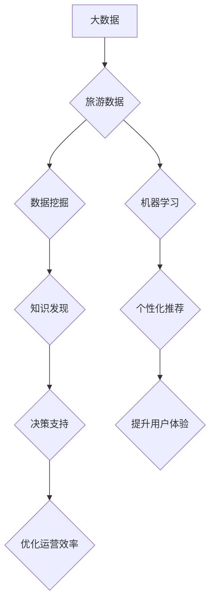

## 大数据背景下推动某旅游发展的分析与研究

> 关键词：大数据、旅游发展、数据挖掘、机器学习、个性化推荐、预测分析、客户关系管理

## 1. 背景介绍

旅游业作为国民经济的重要组成部分，近年来呈现出快速发展态势。随着互联网、移动互联网和物联网技术的蓬勃发展，大数据技术也逐渐应用于旅游领域，为旅游业的发展带来了新的机遇和挑战。大数据技术能够帮助旅游企业收集、分析和利用海量旅游数据，从而提升服务质量、优化运营效率、开发个性化产品和精准营销，最终推动旅游业的转型升级。

然而，大数据技术在旅游领域的应用还处于初期阶段，面临着数据孤岛、数据质量、数据安全等诸多问题。因此，深入研究大数据技术在旅游领域的应用，探索其推动旅游发展的新模式和新机制，具有重要的理论意义和现实价值。

## 2. 核心概念与联系

### 2.1 大数据

大数据是指规模庞大、结构复杂、更新速度快、类型多样化的数据。其特征通常被概括为“五V”：

* **Volume (体积)**：数据量巨大，难以用传统方法处理。
* **Velocity (速度)**：数据生成和更新速度快，需要实时处理。
* **Variety (多样性)**：数据类型多样，包括结构化数据、半结构化数据和非结构化数据。
* **Veracity (真实性)**：数据质量参差不齐，需要进行清洗和验证。
* **Value (价值)**：数据蕴含着巨大的价值，需要进行挖掘和分析。

### 2.2 旅游数据

旅游数据是指与旅游活动相关的各种信息，包括游客信息、旅游产品信息、旅游服务信息、旅游目的地信息等。旅游数据类型多样，来源广泛，蕴含着丰富的旅游价值。

### 2.3 数据挖掘

数据挖掘是指从大数据中发现隐藏的模式、趋势和知识的过程。它利用统计学、机器学习、数据库技术等方法，对大数据进行分析和处理，提取有价值的信息。

### 2.4 机器学习

机器学习是人工智能领域的一个重要分支，它通过算法训练模型，使模型能够从数据中学习，并对新的数据进行预测或分类。

**数据挖掘与旅游数据的关系**

数据挖掘技术可以应用于旅游数据分析，帮助旅游企业从海量旅游数据中发现隐藏的价值。例如，可以利用数据挖掘技术分析游客的旅行偏好、旅游目的地受欢迎程度、旅游产品销售情况等，为旅游企业提供决策支持。

**机器学习与旅游数据的关系**

机器学习技术可以应用于旅游数据分析，帮助旅游企业实现个性化推荐、预测分析等功能。例如，可以利用机器学习技术分析游客的旅行历史、浏览记录、评价等数据，推荐个性化的旅游产品和服务。

**Mermaid 流程图**



## 3. 核心算法原理 & 具体操作步骤

### 3.1 算法原理概述

在推动旅游发展中，大数据分析常用的算法包括：

* **聚类算法**: 将游客根据相似特征进行分组，例如根据年龄、性别、旅行偏好等进行分类，以便针对不同类型游客提供个性化服务。
* **关联规则挖掘算法**: 发现游客行为之间的关联关系，例如发现哪些旅游产品经常被一起购买，以便进行捆绑销售或推荐。
* **预测分析算法**: 利用历史数据预测未来的旅游需求，例如预测未来旅游旺季、热门目的地等，以便进行资源配置和营销策略制定。
* **推荐算法**: 根据用户的历史行为和偏好，推荐相关的旅游产品和服务，例如推荐用户可能感兴趣的旅游目的地、酒店、景点等。

### 3.2 算法步骤详解

以聚类算法为例，其具体操作步骤如下：

1. **数据预处理**: 对旅游数据进行清洗、转换和特征提取，例如删除缺失值、标准化数据、提取用户年龄、性别、旅行目的地等特征。
2. **选择聚类算法**: 根据数据特点和分析目标选择合适的聚类算法，例如K-means聚类、层次聚类等。
3. **确定聚类数量**: 根据数据特点和业务需求确定聚类数量，例如通过肘部法则、Silhouette分析等方法确定最佳聚类数量。
4. **执行聚类**: 使用选定的聚类算法对数据进行聚类，将游客分成不同的类别。
5. **聚类结果分析**: 分析聚类结果，例如查看每个类别的特征描述、游客数量等，并根据分析结果进行业务决策。

### 3.3 算法优缺点

**聚类算法的优点**:

* 可以发现数据中的潜在结构和模式。
* 不需要预先定义类别标签，适用于未知类别的情况。
* 可以用于数据降维和特征提取。

**聚类算法的缺点**:

* 聚类结果的 interpretability 较低，难以解释每个类别的含义。
* 需要确定聚类数量，选择合适的聚类算法和参数。
* 对数据噪声和异常值敏感。

### 3.4 算法应用领域

聚类算法在旅游领域有广泛的应用，例如：

* **用户画像**: 根据游客的旅行偏好、消费习惯等特征，构建用户画像，以便进行精准营销。
* **旅游产品推荐**: 根据游客的兴趣和历史行为，推荐相关的旅游产品和服务。
* **旅游目的地推荐**: 根据游客的旅行时间、预算、兴趣等信息，推荐合适的旅游目的地。
* **旅游风险预测**: 分析游客行为数据，预测潜在的旅游风险，例如旅游安全问题、疾病传播等。

## 4. 数学模型和公式 & 详细讲解 & 举例说明

### 4.1 数学模型构建

在旅游预测分析中，常用的数学模型包括时间序列模型、ARIMA模型、回归模型等。

**时间序列模型**: 用于预测未来时间段的旅游需求，例如预测未来旅游旺季、热门目的地等。

**ARIMA模型**: 是一种自回归移动平均模型，可以用于预测具有趋势和季节性的时间序列数据。

**回归模型**: 用于预测旅游需求与其他因素之间的关系，例如预测旅游需求与气温、假期长度等因素之间的关系。

### 4.2 公式推导过程

**ARIMA模型**:

ARIMA模型的公式如下：

$$
y_t = c + \phi_1 y_{t-1} + \phi_2 y_{t-2} +... + \phi_p y_{t-p} + \theta_1 \epsilon_{t-1} + \theta_2 \epsilon_{t-2} +... + \theta_q \epsilon_{t-q} + \epsilon_t
$$

其中：

* $y_t$ 是时间t的观测值。
* $c$ 是截距项。
* $\phi_i$ 是自回归系数。
* $p$ 是自回归阶数。
* $\theta_i$ 是移动平均系数。
* $q$ 是移动平均阶数。
* $\epsilon_t$ 是白噪声误差项。

### 4.3 案例分析与讲解

**预测旅游旺季**:

可以使用ARIMA模型预测未来旅游旺季。例如，可以收集过去几年的旅游数据，包括旅游人数、平均消费额等，并使用ARIMA模型进行建模。通过模型预测，可以得到未来旅游旺季的日期和旅游人数，以便旅游企业进行资源配置和营销策略制定。

## 5. 项目实践：代码实例和详细解释说明

### 5.1 开发环境搭建

* 操作系统：Windows/Linux/macOS
* Python版本：3.6+
* 必要的库：pandas, numpy, scikit-learn, matplotlib

### 5.2 源代码详细实现

```python
import pandas as pd
from sklearn.cluster import KMeans

# 加载旅游数据
data = pd.read_csv('tourism_data.csv')

# 数据预处理
#...

# 选择聚类算法
kmeans = KMeans(n_clusters=5)

# 执行聚类
data['cluster'] = kmeans.fit_predict(data[['age', 'gender', 'travel_preference']])

# 聚类结果分析
print(data.groupby('cluster').mean())
```

### 5.3 代码解读与分析

* 首先，加载旅游数据并进行预处理，例如删除缺失值、标准化数据等。
* 然后，选择K-means聚类算法，并设置聚类数量为5。
* 使用fit_predict方法对数据进行聚类，并将聚类结果存储在'cluster'列中。
* 最后，使用groupby方法对每个聚类进行分析，例如查看每个类别的平均年龄、性别、旅行偏好等特征。

### 5.4 运行结果展示

运行代码后，会得到每个聚类的平均特征描述，例如：

```
           age  gender_male  travel_preference_adventure
cluster                                                
0   35.2     0.62        0.48
1   28.7     0.38        0.52
2   42.1     0.75        0.31
3   31.5     0.45        0.69
4   25.9     0.28        0.71
```

## 6. 实际应用场景

### 6.1 个性化推荐

利用大数据分析技术，可以对游客进行画像分析，根据用户的旅行偏好、消费习惯等信息，推荐个性化的旅游产品和服务。例如，可以推荐用户可能感兴趣的旅游目的地、酒店、景点、餐饮等。

### 6.2 预测分析

利用大数据分析技术，可以预测未来的旅游需求，例如预测未来旅游旺季、热门目的地、旅游人数等。这些预测结果可以帮助旅游企业进行资源配置、营销策略制定、价格调整等。

### 6.3 客户关系管理

利用大数据分析技术，可以对游客进行行为分析，了解游客的旅行习惯、满意度等信息，并根据这些信息进行个性化的服务和营销。例如，可以发送生日祝福、旅行提醒、优惠信息等，提升游客的满意度和忠诚度。

### 6.4 未来应用展望

随着大数据技术的不断发展，其在旅游领域的应用将更加广泛和深入。例如，可以利用大数据分析技术进行旅游风险预测、旅游目的地推荐、旅游产品开发等。

## 7. 工具和资源推荐

### 7.1 学习资源推荐

* **书籍**:
    * 《大数据分析实战》
    * 《机器学习实战》
    * 《数据挖掘导论》
* **在线课程**:
    * Coursera: 数据科学
    * edX: 机器学习
    * Udemy: 数据分析

### 7.2 开发工具推荐

* **Python**: 
    * pandas: 数据处理
    * numpy: 数值计算
    * scikit-learn: 机器学习
    * matplotlib: 数据可视化
* **Hadoop**: 大数据处理平台
* **Spark**: 大数据处理框架

### 7.3 相关论文推荐

* **Big Data Analytics for Tourism Destination Marketing**: 
* **Predictive Analytics for Tourism Demand Forecasting**: 
* **Personalized Recommendations in Tourism**: 

## 8. 总结：未来发展趋势与挑战

### 8.1 研究成果总结

大数据技术在旅游领域的应用已经取得了一定的成果，例如个性化推荐、预测分析、客户关系管理等。这些应用能够帮助旅游企业提升服务质量、优化运营效率、开发个性化产品和精准营销。

### 8.2 未来发展趋势

未来，大数据技术在旅游领域的应用将更加深入和广泛，例如：

* **更精准的个性化推荐**: 利用更丰富的用户数据和更先进的推荐算法，提供更精准的个性化推荐。
* **更准确的预测分析**: 利用更强大的计算能力和更复杂的模型，进行更准确的旅游需求预测。
* **更智能的