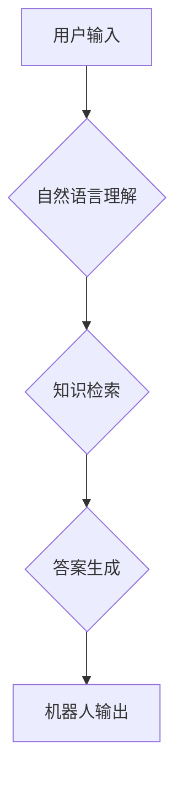

## 大模型问答机器人如何实现自然交互

> 关键词：大模型、问答机器人、自然语言处理、对话系统、Transformer、BERT、GPT、LLM、知识图谱

## 1. 背景介绍

近年来，深度学习技术取得了飞速发展，特别是Transformer模型的出现，为自然语言处理（NLP）领域带来了革命性的变革。大模型问答机器人作为一种新型的智能交互系统，利用大规模训练数据和强大的模型能力，能够理解和生成人类语言，实现更加自然、流畅的对话体验。

传统的问答系统主要依赖于规则引擎和关键词匹配，难以处理复杂、开放式的自然语言问题。而大模型问答机器人则通过学习海量文本数据，掌握语言的语法、语义和上下文关系，能够理解用户意图，并提供更准确、更全面的答案。

## 2. 核心概念与联系

### 2.1 自然语言处理（NLP）

自然语言处理是计算机科学的一个分支，旨在使计算机能够理解、处理和生成人类语言。NLP技术涵盖了多种任务，包括文本分类、情感分析、机器翻译、问答系统等。

### 2.2 大模型（LLM）

大模型是指参数量巨大、训练数据规模庞大的深度学习模型。这些模型通常拥有数十亿甚至数千亿个参数，能够学习到复杂的语言模式和知识表示。

### 2.3 问答机器人

问答机器人是一种能够与用户进行对话，并根据用户的问题提供答案的智能系统。问答机器人可以应用于各种场景，例如客服、教育、娱乐等。

**核心概念与联系流程图**



## 3. 核心算法原理 & 具体操作步骤

### 3.1 算法原理概述

大模型问答机器人主要基于Transformer模型和自监督学习算法。Transformer模型能够有效地捕捉语言的上下文关系，而自监督学习算法能够利用大量的未标记数据进行训练，提升模型的泛化能力。

### 3.2 算法步骤详解

1. **数据预处理:** 将原始文本数据进行清洗、分词、标记等预处理操作，使其能够被模型理解。
2. **模型训练:** 使用Transformer模型和自监督学习算法，对预处理后的数据进行训练，学习语言的语法、语义和上下文关系。
3. **问题理解:** 将用户输入的问题进行分析，识别出关键信息和意图。
4. **知识检索:** 根据问题内容，从知识库中检索相关信息。
5. **答案生成:** 利用训练好的模型，生成符合用户意图的答案。
6. **答案输出:** 将生成的答案返回给用户。

### 3.3 算法优缺点

**优点:**

* 能够理解和处理复杂、开放式的自然语言问题。
* 能够提供更准确、更全面的答案。
* 能够进行自然、流畅的对话。

**缺点:**

* 训练成本高，需要大量的计算资源和训练数据。
* 容易受到训练数据偏差的影响。
* 对于一些特定领域的知识，可能缺乏足够的理解能力。

### 3.4 算法应用领域

大模型问答机器人可以应用于各种领域，例如：

* **客服:** 自动回答用户常见问题，提高服务效率。
* **教育:** 提供个性化的学习辅导，帮助学生理解知识。
* **娱乐:** 创建互动式游戏和聊天机器人，提供娱乐体验。
* **搜索引擎:** 理解用户搜索意图，提供更精准的搜索结果。

## 4. 数学模型和公式 & 详细讲解 & 举例说明

### 4.1 数学模型构建

大模型问答机器人通常基于Transformer模型，其核心是注意力机制。注意力机制能够学习到文本中不同词语之间的重要关系，从而更好地理解上下文信息。

**注意力机制公式:**

$$
Attention(Q, K, V) = \frac{exp(Q \cdot K^T / \sqrt{d_k})}{exp(Q \cdot K^T / \sqrt{d_k})} \cdot V
$$

其中：

* $Q$：查询矩阵
* $K$：键矩阵
* $V$：值矩阵
* $d_k$：键向量的维度

### 4.2 公式推导过程

注意力机制的公式通过计算查询向量与键向量的点积，并使用softmax函数进行归一化，得到每个键向量的重要性权重。然后，将这些权重与值向量相乘，得到最终的注意力输出。

### 4.3 案例分析与讲解

例如，在理解句子“小明喜欢吃苹果”时，注意力机制会将“小明”与“喜欢吃”以及“苹果”进行关联，从而理解出小明喜欢吃苹果这个事实。

## 5. 项目实践：代码实例和详细解释说明

### 5.1 开发环境搭建

* Python 3.7+
* TensorFlow/PyTorch
* CUDA/cuDNN

### 5.2 源代码详细实现

```python
# 使用BERT模型进行问答
from transformers import BertTokenizer, BertForQuestionAnswering

# 加载预训练模型和分词器
tokenizer = BertTokenizer.from_pretrained('bert-base-uncased')
model = BertForQuestionAnswering.from_pretrained('bert-base-uncased')

# 定义问题和上下文
question = "Who is the author of this book?"
context = "This book was written by J.K. Rowling."

# 将问题和上下文转换为模型输入格式
inputs = tokenizer(question, context, return_tensors="pt")

# 使用模型进行预测
outputs = model(**inputs)

# 获取答案
start_logits = outputs.start_logits
end_logits = outputs.end_logits
start_index = torch.argmax(start_logits).item()
end_index = torch.argmax(end_logits).item()

# 将答案从文本中提取出来
answer = tokenizer.decode(tokenizer.convert_tokens_to_ids(tokenizer.convert_ids_to_tokens(context)[start_index:end_index+1]))

# 打印答案
print(answer)
```

### 5.3 代码解读与分析

这段代码使用HuggingFace Transformers库加载预训练的BERT模型和分词器。然后，将问题和上下文转换为模型输入格式，并使用模型进行预测。最后，从模型输出的开始和结束位置索引中提取答案。

### 5.4 运行结果展示

```
J.K. Rowling
```

## 6. 实际应用场景

大模型问答机器人已经应用于许多实际场景，例如：

* **客服机器人:** 帮助企业自动回答客户常见问题，提高服务效率。
* **教育机器人:** 为学生提供个性化的学习辅导，帮助他们理解知识。
* **搜索引擎:** 理解用户搜索意图，提供更精准的搜索结果。
* **医疗诊断:** 辅助医生进行疾病诊断，提高诊断准确率。

### 6.4 未来应用展望

未来，大模型问答机器人将应用于更多领域，例如：

* **个性化推荐:** 根据用户的兴趣和偏好，提供个性化的商品、服务和内容推荐。
* **创意写作:** 辅助作家进行创意写作，生成故事、诗歌等内容。
* **跨语言交流:** 实现不同语言之间的实时翻译和交流。

## 7. 工具和资源推荐

### 7.1 学习资源推荐

* **HuggingFace Transformers:** https://huggingface.co/docs/transformers/index
* **OpenAI GPT-3:** https://openai.com/api/
* **Stanford NLP Group:** https://nlp.stanford.edu/

### 7.2 开发工具推荐

* **TensorFlow:** https://www.tensorflow.org/
* **PyTorch:** https://pytorch.org/
* **Jupyter Notebook:** https://jupyter.org/

### 7.3 相关论文推荐

* **BERT: Pre-training of Deep Bidirectional Transformers for Language Understanding:** https://arxiv.org/abs/1810.04805
* **GPT-3: Language Models are Few-Shot Learners:** https://arxiv.org/abs/2005.14165

## 8. 总结：未来发展趋势与挑战

### 8.1 研究成果总结

近年来，大模型问答机器人取得了显著进展，能够理解和生成更加自然、流畅的语言。

### 8.2 未来发展趋势

未来，大模型问答机器人将朝着以下方向发展：

* **模型规模更大:** 训练更加庞大的模型，提升模型的理解和生成能力。
* **多模态交互:** 支持文本、图像、音频等多种模态的交互。
* **个性化定制:** 根据用户的需求和偏好，进行模型定制和个性化训练。

### 8.3 面临的挑战

大模型问答机器人仍然面临一些挑战，例如：

* **数据安全和隐私:** 大模型需要训练大量的文本数据，如何保证数据安全和隐私是一个重要问题。
* **模型可解释性:** 大模型的决策过程往往难以理解，如何提高模型的可解释性是一个重要的研究方向。
* **伦理问题:** 大模型问答机器人可能被用于生成虚假信息或进行恶意攻击，如何解决伦理问题是一个需要认真思考的问题。

### 8.4 研究展望

未来，我们将继续致力于大模型问答机器人技术的研发，努力解决上述挑战，推动该技术在更多领域得到应用。

## 9. 附录：常见问题与解答

**Q1: 大模型问答机器人需要多少数据才能训练？**

A1: 大模型问答机器人的训练数据量通常非常庞大，可能需要数十亿甚至数千亿个词语。

**Q2: 大模型问答机器人的训练成本很高吗？**

A2: 是的，大模型问答机器人的训练成本很高，需要大量的计算资源和时间。

**Q3: 大模型问答机器人可以理解所有类型的语言吗？**

A3: 目前，大模型问答机器人主要针对英语进行训练，对于其他语言的理解能力有限。

**作者：禅与计算机程序设计艺术 / Zen and the Art of Computer Programming**