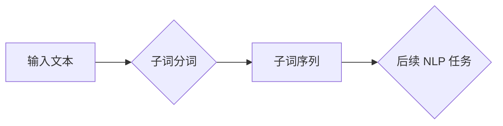

## 大语言模型原理基础与前沿 子词分词

> 关键词：大语言模型、子词分词、自然语言处理、中文分词、BERT、Transformer、深度学习

## 1. 背景介绍

自然语言处理 (NLP) 作为人工智能领域的重要分支，致力于使计算机能够理解、处理和生成人类语言。在 NLP 任务中，文本的预处理环节至关重要，其中子词分词 (Word Segmentation) 是一个基础且关键的步骤。子词分词是指将自然语言文本分割成更小的语义单元，这些单元可以是单词、词语或子词。

传统的中文分词方法主要依赖于规则和统计模型，例如切词规则、HMM (隐马尔可夫模型) 和 CRF (条件随机场)。然而，这些方法在面对复杂句式、歧义词和新词时往往表现不佳。

近年来，随着深度学习的兴起，基于深度学习的子词分词方法取得了显著进展。这些方法利用 Transformer 架构和大量的语料数据，能够更好地捕捉文本的语义和上下文信息，从而实现更准确和高效的子词分词。

## 2. 核心概念与联系

子词分词是自然语言处理中一个重要的预处理步骤，它将文本分割成更小的语义单元，为后续的 NLP 任务提供基础。

**子词分词与其他 NLP 任务的关系:**

* **词性标注:** 子词分词的结果可以作为词性标注的输入，帮助识别每个词语的词性。
* **依存句法分析:** 子词分词可以帮助构建句子的依存关系树，分析句子结构和语义。
* **机器翻译:** 子词分词可以将文本分割成更小的语义单元，方便机器翻译模型进行翻译。
* **文本摘要:** 子词分词可以帮助识别文本中的关键信息，用于文本摘要生成。

**子词分词与大语言模型的关系:**

大语言模型 (LLM) 通常需要对输入文本进行子词分词，以便更好地理解文本语义。一些 LLM 模型，例如 BERT 和 GPT，甚至将子词分词作为其训练的一部分。

**Mermaid 流程图:**



## 3. 核心算法原理 & 具体操作步骤

### 3.1  算法原理概述

基于深度学习的子词分词算法通常采用 Transformer 架构，利用自注意力机制和多头注意力机制来捕捉文本的语义和上下文信息。

**Transformer 架构:**

Transformer 架构由编码器和解码器组成。编码器负责将输入文本序列编码成语义表示，解码器则根据编码后的语义表示生成输出序列。

**自注意力机制:**

自注意力机制允许模型关注输入序列中的不同位置，并计算每个位置之间的相关性。

**多头注意力机制:**

多头注意力机制使用多个自注意力头，每个头关注不同的方面，从而捕捉更丰富的语义信息。

### 3.2  算法步骤详解

1. **输入文本预处理:** 将输入文本转换为数字表示，例如使用词典将每个词语映射到一个唯一的整数。
2. **编码器:** 将预处理后的文本序列输入到编码器中，编码器会使用 Transformer 架构和自注意力机制生成每个词语的语义表示。
3. **解码器:** 将编码器输出的语义表示输入到解码器中，解码器会使用 Transformer 架构和多头注意力机制生成子词序列。
4. **输出结果:** 将解码器输出的子词序列转换为文本形式，输出最终的子词分词结果。

### 3.3  算法优缺点

**优点:**

* **准确率高:** 基于深度学习的子词分词算法能够更好地捕捉文本的语义和上下文信息，从而实现更高的准确率。
* **可扩展性强:** Transformer 架构具有良好的可扩展性，可以处理更长的文本序列。
* **泛化能力强:** 基于深度学习的算法能够从大量的语料数据中学习，具有较强的泛化能力。

**缺点:**

* **训练成本高:** 训练深度学习模型需要大量的计算资源和时间。
* **解释性差:** 深度学习模型的内部机制比较复杂，难以解释其决策过程。
* **数据依赖性强:** 深度学习模型的性能依赖于训练数据的质量和数量。

### 3.4  算法应用领域

基于深度学习的子词分词算法在以下领域具有广泛的应用:

* **搜索引擎:** 子词分词可以帮助搜索引擎更好地理解用户查询意图，提高搜索结果的准确率。
* **机器翻译:** 子词分词可以将文本分割成更小的语义单元，方便机器翻译模型进行翻译。
* **聊天机器人:** 子词分词可以帮助聊天机器人更好地理解用户输入，提供更准确的回复。
* **文本摘要:** 子词分词可以帮助识别文本中的关键信息，用于文本摘要生成。

## 4. 数学模型和公式 & 详细讲解 & 举例说明

### 4.1  数学模型构建

基于 Transformer 架构的子词分词模型通常使用以下数学模型:

* **词嵌入:** 将每个词语映射到一个低维向量空间，例如 Word2Vec 和 GloVe。
* **自注意力机制:** 计算每个词语与其他词语之间的相关性，例如 Scaled Dot-Product Attention。
* **多头注意力机制:** 使用多个自注意力头，每个头关注不同的方面，例如 Multi-Head Attention。
* **前馈神经网络:** 对每个词语的语义表示进行进一步处理，例如 Feed-Forward Network。

### 4.2  公式推导过程

**Scaled Dot-Product Attention:**

$$
Attention(Q, K, V) = \frac{exp(\frac{QK^T}{\sqrt{d_k}})}{softmax(QK^T/\sqrt{d_k})}V
$$

其中:

* $Q$ 是查询矩阵
* $K$ 是键矩阵
* $V$ 是值矩阵
* $d_k$ 是键向量的维度

**Multi-Head Attention:**

$$
MultiHead(Q, K, V) = Concat(head_1, head_2,..., head_h)W^O
$$

其中:

* $head_i$ 是第 $i$ 个注意力头的输出
* $h$ 是注意力头的数量
* $W^O$ 是最终输出层的权重矩阵

### 4.3  案例分析与讲解

**举例说明:**

假设我们有一个句子 "我爱学习编程"，我们需要对其进行子词分词。

使用基于 Transformer 架构的子词分词模型，我们可以将每个词语映射到一个低维向量空间，然后使用自注意力机制和多头注意力机制计算每个词语与其他词语之间的相关性。最终，模型会根据这些相关性预测每个词语是否属于一个子词。

## 5. 项目实践：代码实例和详细解释说明

### 5.1  开发环境搭建

* Python 3.6+
* TensorFlow 或 PyTorch
* CUDA 和 cuDNN (可选，用于 GPU 加速)

### 5.2  源代码详细实现

```python
# 使用 TensorFlow 实现基于 Transformer 架构的子词分词模型

import tensorflow as tf

# 定义 Transformer Encoder
class TransformerEncoder(tf.keras.layers.Layer):
    def __init__(self, d_model, num_heads, dff, rate=0.1):
        super(TransformerEncoder, self).__init__()
        self.mha = tf.keras.layers.MultiHeadAttention(num_heads=num_heads, key_dim=d_model)
        self.ffn = tf.keras.layers.Dense(dff, activation="relu")
        self.layernorm1 = tf.keras.layers.LayerNormalization(epsilon=1e-6)
        self.layernorm2 = tf.keras.layers.LayerNormalization(epsilon=1e-6)
        self.dropout1 = tf.keras.layers.Dropout(rate)
        self.dropout2 = tf.keras.layers.Dropout(rate)

    def call(self, x, training):
        attn_output = self.mha(x, x, x)
        attn_output = self.dropout1(attn_output, training=training)
        out1 = self.layernorm1(x + attn_output)
        ffn_output = self.ffn(out1)
        ffn_output = self.dropout2(ffn_output, training=training)
        out2 = self.layernorm2(out1 + ffn_output)
        return out2

# 定义子词分词模型
class WordSegmentationModel(tf.keras.Model):
    def __init__(self, vocab_size, d_model, num_heads, dff, num_layers, rate=0.1):
        super(WordSegmentationModel, self).__init__()
        self.embedding = tf.keras.layers.Embedding(vocab_size, d_model)
        self.encoder = TransformerEncoder(d_model, num_heads, dff, rate)
        self.decoder = tf.keras.layers.Dense(vocab_size, activation="softmax")

    def call(self, x, training):
        x = self.embedding(x)
        x = self.encoder(x, training=training)
        x = self.decoder(x)
        return x

# 训练模型
model = WordSegmentationModel(vocab_size=..., d_model=..., num_heads=..., dff=..., num_layers=...)
model.compile(optimizer="adam", loss="sparse_categorical_crossentropy", metrics=["accuracy"])
model.fit(train_data, train_labels, epochs=...)

```

### 5.3  代码解读与分析

* **词嵌入层:** 将每个词语映射到一个低维向量空间。
* **Transformer Encoder:** 使用多层 Transformer 结构，捕捉文本的语义和上下文信息。
* **Decoder:** 将编码后的语义表示转换为子词序列。
* **训练过程:** 使用训练数据训练模型，并使用交叉熵损失函数和 Adam 优化器进行优化。

### 5.4  运行结果展示

训练完成后，可以使用测试数据评估模型的性能，例如计算准确率和 F1 值。

## 6. 实际应用场景

### 6.1  搜索引擎

子词分词可以帮助搜索引擎更好地理解用户查询意图，提高搜索结果的准确率。例如，对于查询 "苹果手机"，子词分词可以将它分割成 "苹果" 和 "手机" 两个关键词，从而更准确地匹配相关网页。

### 6.2  机器翻译

子词分词可以将文本分割成更小的语义单元，方便机器翻译模型进行翻译。例如，对于句子 "我爱学习编程"，子词分词可以将它分割成 "我"、"爱"、"学习"、"编程" 四个子词，每个子词都可以独立翻译，从而提高翻译的准确性和流畅度。

### 6.3  聊天机器人

子词分词可以帮助聊天机器人更好地理解用户输入，提供更准确的回复。例如，对于用户输入 "今天天气怎么样"，子词分词可以将它分割成 "今天"、"天气"、"怎么样" 三个子词，聊天机器人可以根据这些子词判断用户想要了解天气信息，并提供相应的回复。

### 6.4  未来应用展望

随着深度学习技术的不断发展，子词分词算法的性能将会进一步提升，并应用于更多领域，例如：

* **文本摘要:** 子词分词可以帮助识别文本中的关键信息，用于文本摘要生成。
* **问答系统:** 子词分词可以帮助问答系统更好地理解用户问题，并提供更准确的答案。
* **情感分析:** 子词分词可以帮助情感分析系统更好地理解文本的情感表达。

## 7. 工具和资源推荐

### 7.1  学习资源推荐

* **书籍:**
    * "深度学习" by Ian Goodfellow, Yoshua Bengio, and Aaron Courville
    