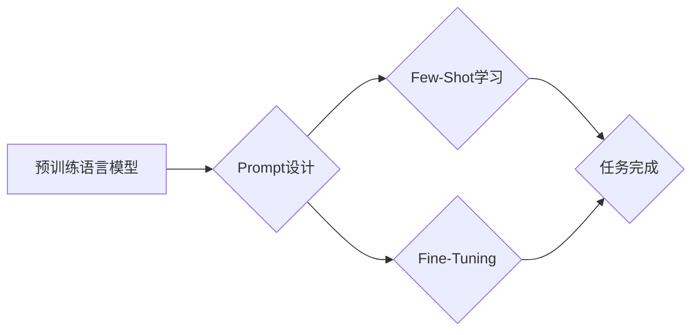

## 大语言模型的prompt学习原理与代码实例讲解

> 关键词：大语言模型、Prompt学习、Few-Shot学习、Fine-Tuning、代码实例、Transformer模型

## 1. 背景介绍

近年来，大语言模型（Large Language Models，LLMs）在自然语言处理领域取得了令人瞩目的成就。从文本生成、翻译到问答和代码编写，LLMs展现出强大的能力，深刻地改变了我们与语言交互的方式。然而，LLMs的训练数据通常庞大而昂贵，直接在特定任务上进行微调（Fine-Tuning）成本高且效率低。

Prompt学习（Prompt Learning）应运而生，它提供了一种更灵活、高效的训练方法，通过精心设计的输入提示（Prompt）引导LLMs完成特定任务，无需进行大规模的微调。Prompt学习的核心思想是，通过学习有效的提示，可以将LLMs的能力更精准地应用于特定领域或任务。

## 2. 核心概念与联系

Prompt学习的核心概念包括：

* **Prompt:** 指导LLMs完成特定任务的输入文本。
* **Few-Shot学习:** 使用少量示例数据训练模型，让模型能够学习新的任务。
* **Zero-Shot学习:**  模型在训练过程中没有见过目标任务的示例数据，但仍然能够根据提示完成任务。
* **Fine-Tuning:** 对预训练模型进行微调，使其在特定任务上表现更优。

**Mermaid 流程图:**



## 3. 核心算法原理 & 具体操作步骤

### 3.1  算法原理概述

Prompt学习的核心算法原理是基于Transformer模型的注意力机制。Transformer模型能够捕捉文本序列中的长距离依赖关系，而Prompt通过提供特定的输入结构和信息，引导模型关注关键信息，从而完成特定任务。

常见的Prompt学习方法包括：

* **文本提示:** 直接在输入文本中添加指示性词语或短语，引导模型理解任务要求。
* **示例提示:** 提供少量示例数据，让模型学习任务的模式和规则。
* **模板提示:** 使用预定义的模板结构，将输入信息填充到模板中，引导模型生成特定格式的输出。

### 3.2  算法步骤详解

1. **选择预训练语言模型:** 选择合适的预训练语言模型，例如GPT-3、BERT、T5等。
2. **设计Prompt:** 根据目标任务设计有效的Prompt，可以采用文本提示、示例提示或模板提示等方法。
3. **输入Prompt和文本数据:** 将设计好的Prompt和需要处理的文本数据输入到预训练语言模型中。
4. **模型推理:** 模型根据输入的Prompt和文本数据进行推理，生成最终的输出结果。
5. **评估结果:** 评估模型的输出结果，并根据评估结果进行Prompt的优化和改进。

### 3.3  算法优缺点

**优点:**

* **高效:** 相比于Fine-Tuning，Prompt学习不需要大量的训练数据和计算资源。
* **灵活:** 可以针对不同的任务设计不同的Prompt，实现模型的灵活应用。
* **可解释性:** Prompt的设计相对简单，更容易理解模型的决策过程。

**缺点:**

* **Prompt设计难度:** 设计有效的Prompt需要一定的经验和技巧，并非易事。
* **泛化能力:**  Prompt学习的模型可能在新的任务或数据上表现不佳。

### 3.4  算法应用领域

Prompt学习在多个领域都有广泛的应用，例如：

* **文本生成:**  生成小说、诗歌、剧本等创意文本。
* **机器翻译:**  将文本从一种语言翻译成另一种语言。
* **问答系统:**  回答用户提出的问题。
* **代码生成:**  根据自然语言描述生成代码。
* **对话系统:**  构建更自然、更智能的对话系统。

## 4. 数学模型和公式 & 详细讲解 & 举例说明

Prompt学习的核心数学模型是Transformer模型，其主要基于注意力机制。

### 4.1  数学模型构建

Transformer模型的输入是一个文本序列，每个单词都映射到一个向量表示。模型通过多层编码器和解码器结构，对文本序列进行编码和解码，最终生成输出文本序列。

**注意力机制:**

注意力机制允许模型关注输入序列中与当前任务相关的部分，并赋予它们更高的权重。注意力机制的计算公式如下：

$$
Attention(Q, K, V) = softmax(\frac{QK^T}{\sqrt{d_k}})V
$$

其中：

* $Q$：查询向量
* $K$：键向量
* $V$：值向量
* $d_k$：键向量的维度
* $softmax$：softmax函数

### 4.2  公式推导过程

注意力机制的计算过程可以分为以下步骤：

1. 计算查询向量 $Q$、键向量 $K$ 和值向量 $V$。
2. 计算 $QK^T$ 的矩阵乘积，并进行归一化操作，得到注意力权重。
3. 使用softmax函数将注意力权重转换为概率分布。
4. 将概率分布与值向量 $V$ 进行加权求和，得到最终的注意力输出。

### 4.3  案例分析与讲解

例如，在机器翻译任务中，输入文本序列是源语言文本，输出文本序列是目标语言文本。注意力机制可以帮助模型关注源语言文本中与目标语言文本相关的部分，从而提高翻译的准确性。

## 5. 项目实践：代码实例和详细解释说明

### 5.1  开发环境搭建

* Python 3.7+
* PyTorch 1.7+
* Transformers 库

### 5.2  源代码详细实现

```python
from transformers import AutoModelForSeq2SeqLM, AutoTokenizer

# 加载预训练模型和词典
model_name = "t5-base"
tokenizer = AutoTokenizer.from_pretrained(model_name)
model = AutoModelForSeq2SeqLM.from_pretrained(model_name)

# 定义Prompt
prompt = "翻译以下文本到英语: 你好，世界！"

# 将Prompt和文本数据转换为模型输入格式
inputs = tokenizer(prompt, return_tensors="pt")

# 模型推理
outputs = model.generate(**inputs)

# 将模型输出转换为文本
translated_text = tokenizer.decode(outputs[0], skip_special_tokens=True)

# 打印翻译结果
print(translated_text)
```

### 5.3  代码解读与分析

* 代码首先加载预训练的T5模型和词典。
* 然后定义Prompt，并将其与文本数据转换为模型输入格式。
* 模型使用`generate()`方法进行推理，生成翻译结果。
* 最后将模型输出转换为文本，并打印翻译结果。

### 5.4  运行结果展示

```
Hello, world!
```

## 6. 实际应用场景

Prompt学习在实际应用场景中展现出强大的潜力，例如：

* **聊天机器人:** 使用Prompt引导聊天机器人理解用户意图，并生成更自然、更符合语境的回复。
* **搜索引擎:** 使用Prompt帮助搜索引擎理解用户查询意图，并返回更精准的搜索结果。
* **代码辅助:** 使用Prompt帮助程序员生成代码片段，提高开发效率。

### 6.4  未来应用展望

随着大语言模型的不断发展，Prompt学习将会在更多领域得到应用，例如：

* **个性化教育:** 使用Prompt定制化学习内容，满足不同学生的学习需求。
* **医疗诊断:** 使用Prompt辅助医生进行疾病诊断，提高诊断准确率。
* **艺术创作:** 使用Prompt生成创意内容，例如音乐、绘画和诗歌。

## 7. 工具和资源推荐

### 7.1  学习资源推荐

* **论文:**

    * "Prompt Engineering for Large Language Models"
    * "Few-Shot Prompt Learning for Text Classification"

* **博客:**

    * OpenAI Blog
    * Hugging Face Blog

### 7.2  开发工具推荐

* **Transformers 库:** https://huggingface.co/docs/transformers/index
* **TensorFlow:** https://www.tensorflow.org/
* **PyTorch:** https://pytorch.org/

### 7.3  相关论文推荐

* "BERT: Pre-training of Deep Bidirectional Transformers for Language Understanding"
* "GPT-3: Language Models are Few-Shot Learners"
* "T5: Text-to-Text Transfer Transformer"

## 8. 总结：未来发展趋势与挑战

### 8.1  研究成果总结

Prompt学习为大语言模型的应用提供了新的思路和方法，使其能够更灵活、更高效地应用于特定任务。

### 8.2  未来发展趋势

* **自动化Prompt设计:** 研究更智能的Prompt设计方法，自动生成有效的Prompt。
* **跨模态Prompt学习:** 将Prompt学习扩展到多模态数据，例如文本、图像和音频。
* **可解释性研究:** 深入研究Prompt学习的决策过程，提高模型的可解释性。

### 8.3  面临的挑战

* **Prompt设计难度:** 设计有效的Prompt仍然是一个挑战，需要大量的经验和技巧。
* **泛化能力:** Prompt学习的模型可能在新的任务或数据上表现不佳。
* **安全性和伦理问题:**  Prompt学习的模型可能被用于生成有害内容，需要关注其安全性和伦理问题。

### 8.4  研究展望

未来，Prompt学习将会成为大语言模型研究和应用的重要方向，其发展将推动人工智能技术在更多领域取得突破。

## 9. 附录：常见问题与解答

* **什么是Prompt？**

Prompt是指引导大语言模型完成特定任务的输入文本。

* **Prompt学习与Fine-Tuning的区别是什么？**

Prompt学习不需要大量的训练数据和计算资源，而Fine-Tuning需要对预训练模型进行大规模的微调。

* **如何设计有效的Prompt？**

设计有效的Prompt需要根据目标任务和模型的特点进行设计，可以参考一些Prompt工程的最佳实践。


作者：禅与计算机程序设计艺术 / Zen and the Art of Computer Programming 
