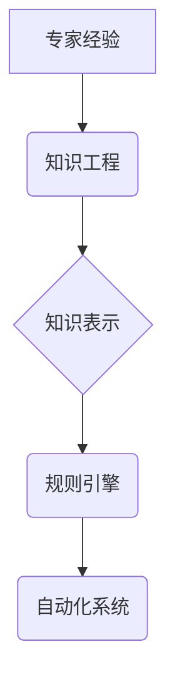

## 工业革命的精髓：专家经验融入自动化

> 关键词：自动化、专家系统、机器学习、知识工程、规则引擎、深度学习、人工智能

### 1. 背景介绍

自工业革命以来，人类社会经历了前所未有的变革。机器取代了大量体力劳动，生产效率大幅提升，社会结构和生活方式也随之改变。如今，我们正站在新的技术革命的门口——人工智能时代。人工智能技术正在以惊人的速度发展，其应用领域不断拓展，对人类社会的影响将更加深远。

然而，人工智能技术的发展也面临着挑战。传统的机器学习算法依赖于海量数据训练，而许多领域的数据难以获取或难以标注。此外，机器学习算法难以解释其决策过程，这使得其应用在一些需要透明度和可解释性的领域受到限制。

为了解决这些问题，专家经验融入自动化成为一个重要的研究方向。专家系统、规则引擎、知识图谱等技术可以将人类专家积累的知识和经验转化为机器可理解的形式，从而提高人工智能系统的性能和可靠性。

### 2. 核心概念与联系

**2.1 专家系统**

专家系统是一种利用人工智能技术模拟人类专家决策能力的软件系统。它通过知识库和推理引擎来处理问题。知识库包含专家在特定领域积累的知识和经验，而推理引擎则根据知识库中的规则和事实进行逻辑推理，得出结论。

**2.2 规则引擎**

规则引擎是一种用于执行业务规则的软件系统。它可以根据预先定义的规则，对输入数据进行处理，并生成相应的输出结果。规则引擎通常用于处理复杂业务流程，例如保险理赔、信用评估等。

**2.3 知识图谱**

知识图谱是一种结构化的知识表示形式，它将实体和关系以图的形式表示。知识图谱可以存储和推理大量知识，并支持复杂的查询和分析。

**2.4 流程图**



**2.5 联系**

专家经验可以被转化为知识库，并通过知识工程技术进行组织和表示。知识表示可以以规则的形式存储在规则引擎中，从而实现自动化决策。规则引擎可以与其他系统集成，构建完整的自动化系统。

### 3. 核心算法原理 & 具体操作步骤

**3.1 算法原理概述**

专家系统和规则引擎的核心算法原理是基于逻辑推理和规则匹配。

* **逻辑推理:** 专家系统使用逻辑推理规则来从知识库中提取信息，并得出结论。常见的逻辑推理方法包括前向推理和后向推理。
* **规则匹配:** 规则引擎根据预先定义的规则，匹配输入数据，并执行相应的动作。规则通常以“如果-那么”的形式表示。

**3.2 算法步骤详解**

**专家系统:**

1. **知识获取:** 从专家那里收集相关知识和经验，并将其转化为可被计算机理解的形式。
2. **知识表示:** 将获取的知识表示为知识库，可以使用符号逻辑、帧结构等方法。
3. **推理引擎设计:** 设计推理引擎，实现对知识库中规则的推理和应用。
4. **系统测试和评估:** 对专家系统进行测试和评估，确保其能够准确地解决问题。

**规则引擎:**

1. **规则定义:** 定义规则，描述特定业务场景下的决策逻辑。
2. **规则库构建:** 将定义的规则存储在规则库中。
3. **数据输入:** 将需要处理的数据输入到规则引擎中。
4. **规则匹配:** 规则引擎根据输入数据匹配规则，并执行相应的动作。
5. **结果输出:** 将规则引擎处理的结果输出到外部系统。

**3.3 算法优缺点**

**专家系统:**

* **优点:** 可以模拟人类专家的决策能力，解决复杂问题。
* **缺点:** 知识获取和表示成本高，难以维护和更新。

**规则引擎:**

* **优点:** 易于理解和维护，可以灵活地调整规则。
* **缺点:** 规则定义需要专业知识，难以处理复杂、模糊的业务场景。

**3.4 算法应用领域**

* **医疗诊断:** 专家系统可以辅助医生诊断疾病。
* **金融风险评估:** 规则引擎可以用于评估客户的信用风险。
* **制造业质量控制:** 规则引擎可以用于检测产品缺陷。
* **法律咨询:** 专家系统可以提供法律咨询服务。

### 4. 数学模型和公式 & 详细讲解 & 举例说明

**4.1 数学模型构建**

专家系统和规则引擎的数学模型主要基于逻辑学和概率论。

* **逻辑学:** 用于表示知识和规则，例如命题逻辑、谓词逻辑等。
* **概率论:** 用于处理不确定性，例如贝叶斯网络、决策树等。

**4.2 公式推导过程**

例如，在医疗诊断领域，可以使用贝叶斯网络来表示疾病和症状之间的关系。

$$P(D|S) = \frac{P(S|D)P(D)}{P(S)}$$

其中：

* $P(D|S)$ 是给定症状 $S$ 的情况下患病 $D$ 的概率。
* $P(S|D)$ 是患病 $D$ 的情况下出现症状 $S$ 的概率。
* $P(D)$ 是患病 $D$ 的概率。
* $P(S)$ 是出现症状 $S$ 的概率。

**4.3 案例分析与讲解**

假设一个专家系统用于诊断感冒。

* 知识库包含感冒的症状、病因和治疗方法。
* 规则引擎根据患者的症状匹配知识库中的规则，并给出诊断结果。

例如，如果患者出现发烧、咳嗽、流鼻涕等症状，规则引擎会根据知识库中的规则判断患者可能患有感冒。

### 5. 项目实践：代码实例和详细解释说明

**5.1 开发环境搭建**

可以使用 Python 语言和相关库来开发专家系统和规则引擎。

* Python 语言：通用编程语言，易于学习和使用。
* Rule Engine 库：例如 Drools、Jess 等。

**5.2 源代码详细实现**

```python
# 使用 Drools 规则引擎

from drools import Drools

# 创建规则引擎实例
engine = Drools()

# 定义规则
engine.add_rule("if fever and cough then diagnosis:感冒")

# 设置事实
engine.set_fact("fever", True)
engine.set_fact("cough", True)

# 执行规则
engine.run()

# 获取结果
diagnosis = engine.get_fact("diagnosis")
print(diagnosis)  # 输出: 感冒
```

**5.3 代码解读与分析**

* 使用 Drools 库创建规则引擎实例。
* 定义规则，使用 "if-then" 的形式表示。
* 设置事实，例如患者的症状。
* 执行规则，引擎会根据规则匹配事实，并得出结论。
* 获取结果，例如诊断结果。

**5.4 运行结果展示**

运行代码后，输出结果为 "感冒"，表明引擎根据规则匹配事实，判断患者可能患有感冒。

### 6. 实际应用场景

**6.1 医疗诊断辅助系统**

专家系统可以辅助医生诊断疾病，例如根据患者的症状和病史，判断患者可能患有哪种疾病。

**6.2 金融风险评估系统**

规则引擎可以用于评估客户的信用风险，例如根据客户的收入、支出、信用记录等信息，判断客户是否能够偿还贷款。

**6.3 制造业质量控制系统**

规则引擎可以用于检测产品缺陷，例如根据产品的尺寸、重量、外观等信息，判断产品是否符合标准。

**6.4 未来应用展望**

随着人工智能技术的不断发展，专家经验融入自动化将有更广泛的应用场景。例如，可以用于自动驾驶、个性化教育、智能客服等领域。

### 7. 工具和资源推荐

**7.1 学习资源推荐**

* **书籍:**
    * 《人工智能：现代方法》
    * 《专家系统》
    * 《规则引擎》
* **在线课程:**
    * Coursera 上的《人工智能》课程
    * edX 上的《机器学习》课程

**7.2 开发工具推荐**

* **Drools:** 开源规则引擎
* **Jess:** 开源专家系统 shells
* **Protégé:** 开源知识表示和推理工具

**7.3 相关论文推荐**

* **专家系统:**
    * "A General Problem Solver" by Allen Newell, Herbert A. Simon, and J.C. Shaw
* **规则引擎:**
    * "Rule Engines: A Survey" by Michael R. Genesereth and Nils J. Nilsson

### 8. 总结：未来发展趋势与挑战

**8.1 研究成果总结**

专家经验融入自动化取得了显著成果，在多个领域得到了应用。

**8.2 未来发展趋势**

* **深度学习:** 将深度学习技术与专家系统和规则引擎相结合，提高人工智能系统的性能和智能化程度。
* **知识图谱:** 利用知识图谱存储和推理大量知识，构建更智能、更全面的自动化系统。
* **解释性AI:** 研究如何使人工智能系统的决策过程更加透明和可解释，提高其在安全和可靠性要求高的领域的应用。

**8.3 面临的挑战**

* **知识获取:** 从专家那里获取高质量的知识仍然是一个挑战。
* **知识表示:** 如何将专家知识有效地表示为机器可理解的形式也是一个难题。
* **系统维护:** 随着知识和规则的不断更新，专家系统和规则引擎需要进行维护和更新，这需要投入大量的人力和时间。

**8.4 研究展望**

未来，专家经验融入自动化将继续是一个重要的研究方向。通过不断探索新的技术和方法，我们可以构建更智能、更可靠、更具普适性的自动化系统，推动人工智能技术更好地服务于人类社会。

### 9. 附录：常见问题与解答

**9.1 如何获取专家知识？**

可以使用访谈、问卷调查、案例分析等方法从专家那里获取知识。

**9.2 如何表示专家知识？**

可以使用符号逻辑、帧结构、规则等方法表示专家知识。

**9.3 如何维护专家系统？**

随着知识和规则的不断更新，需要定期维护和更新专家系统。


作者：禅与计算机程序设计艺术 / Zen and the Art of Computer Programming 
