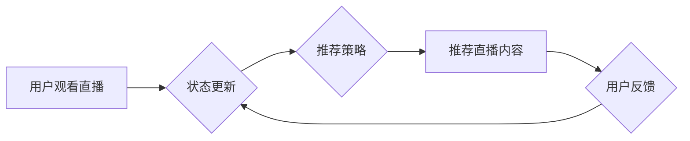

## 强化学习：在直播推荐系统中的应用

> 关键词：强化学习、直播推荐系统、推荐算法、用户行为预测、深度学习、Q-learning、价值函数

## 1. 背景介绍

直播行业近年来发展迅速，用户对直播内容的需求日益增长。然而，海量直播内容的涌现也给用户带来了选择困难。如何精准推荐用户感兴趣的直播内容，提升用户体验，是直播平台面临的重要挑战。传统的基于内容或协同过滤的推荐算法难以有效应对直播内容的多样性和用户行为的动态性。

强化学习 (Reinforcement Learning, RL) 作为一种能够学习用户行为模式并优化推荐策略的机器学习方法，在直播推荐系统中展现出巨大的潜力。RL 算法通过与环境交互，学习最优的行动策略，以最大化累积奖励。在直播推荐系统中，用户观看直播、点赞、评论等行为可以作为奖励信号，RL 算法可以根据这些信号不断调整推荐策略，最终实现精准推荐的目标。

## 2. 核心概念与联系

**2.1 强化学习核心概念**

强化学习的核心概念包括：

* **Agent (智能体):**  推荐系统，负责做出推荐决策。
* **Environment (环境):** 直播平台，包含所有直播内容和用户行为数据。
* **State (状态):** 系统当前的状态，例如用户历史观看记录、用户偏好等。
* **Action (动作):** 智能体可以采取的行动，例如推荐特定直播内容。
* **Reward (奖励):** 环境对智能体动作的反馈，例如用户观看直播时长、点赞数等。
* **Policy (策略):** 智能体根据当前状态选择动作的规则。

**2.2 强化学习与直播推荐系统的联系**

在直播推荐系统中，RL 算法可以被视为一个智能推荐代理。该代理通过学习用户行为模式，不断优化推荐策略，以最大化用户观看直播时长、互动频率等奖励信号。

**2.3  RL 应用于直播推荐系统的流程图**



## 3. 核心算法原理 & 具体操作步骤

**3.1 算法原理概述**

Q-learning 是一种经典的强化学习算法，它通过学习一个 Q-table 来评估每个状态-动作对的价值。Q-table 中存储了每个状态下，采取每个动作所能获得的期望回报。通过不断与环境交互，Q-learning 算法会更新 Q-table，最终学习到最优的策略。

**3.2 算法步骤详解**

1. **初始化 Q-table:** 创建一个 Q-table，其中每个状态-动作对的价值初始化为 0。
2. **选择动作:** 根据当前状态，使用 ε-贪婪策略选择动作。ε-贪婪策略是指以概率 ε 选择随机动作，以概率 1-ε 选择 Q-table 中价值最高的动作。
3. **执行动作:** 执行选择的动作，并观察环境的反馈，即获得奖励和下一个状态。
4. **更新 Q-table:** 使用 Bellman 方程更新 Q-table 中当前状态-动作对的价值：

 $$Q(s,a) = Q(s,a) + \alpha [r + \gamma \max_{a'} Q(s',a') - Q(s,a)]$$

其中：

* $Q(s,a)$ 是当前状态 s 下采取动作 a 的价值。
* $r$ 是获得的奖励。
* $\gamma$ 是折扣因子，控制未来奖励的权重。
* $\alpha$ 是学习率，控制学习速度。
* $s'$ 是下一个状态。
* $a'$ 是下一个状态下采取的动作。

5. **重复步骤 2-4:** 直到达到终止条件，例如达到最大迭代次数或 Q-table 收敛。

**3.3 算法优缺点**

**优点:**

* 能够学习复杂的决策策略。
* 不需要事先定义奖励函数。
* 适用于离散状态和动作空间。

**缺点:**

* 训练时间长，需要大量数据和计算资源。
* 容易陷入局部最优解。
* 难以处理连续状态和动作空间。

**3.4 算法应用领域**

Q-learning 广泛应用于各种领域，例如：

* 游戏 AI
* 机器人控制
* 自动驾驶
* 医疗诊断
* 金融投资

## 4. 数学模型和公式 & 详细讲解 & 举例说明

**4.1 数学模型构建**

在直播推荐系统中，我们可以构建一个马尔可夫决策过程 (MDP) 模型来描述用户与直播平台的交互过程。

* **状态空间 (S):** 用户的历史观看记录、用户偏好、当前时间等。
* **动作空间 (A):** 推荐给用户的直播内容。
* **转移概率 (P):** 从一个状态到另一个状态的概率，取决于用户对推荐内容的反应。
* **奖励函数 (R):** 用户观看直播时长、点赞数、评论数等行为可以作为奖励信号。

**4.2 公式推导过程**

Q-learning 算法的目标是学习一个 Q-function，即 Q(s,a)，表示在状态 s 下采取动作 a 的期望回报。Q-function 的更新规则如下：

$$Q(s,a) = Q(s,a) + \alpha [r + \gamma \max_{a'} Q(s',a') - Q(s,a)]$$

其中：

* $Q(s,a)$ 是当前状态 s 下采取动作 a 的价值。
* $r$ 是获得的奖励。
* $\gamma$ 是折扣因子，控制未来奖励的权重。
* $\alpha$ 是学习率，控制学习速度。
* $s'$ 是下一个状态。
* $a'$ 是下一个状态下采取的动作。

**4.3 案例分析与讲解**

假设一个用户观看过 A、B、C 三个直播内容，当前状态为 (A,B,C)。推荐系统可以选择推荐 D、E、F 三个直播内容。

* 如果用户选择观看 D，并获得奖励 r1，则 Q(A,B,C,D) 更新为：

$$Q(A,B,C,D) = Q(A,B,C,D) + \alpha [r1 + \gamma \max_{a'} Q(s',a')]$$

其中 $s'$ 是用户观看 D 后进入的新状态，$a'$ 是用户在 $s'$ 状态下可能采取的动作。

* 类似地，如果用户选择观看 E 或 F，则相应的 Q-values 也将被更新。

通过不断更新 Q-values，Q-learning 算法最终可以学习到最优的推荐策略，即在每个状态下选择最能获得高奖励的动作。

## 5. 项目实践：代码实例和详细解释说明

**5.1 开发环境搭建**

* Python 3.x
* TensorFlow 或 PyTorch 深度学习框架
* NumPy 科学计算库
* Matplotlib 数据可视化库

**5.2 源代码详细实现**

```python
import numpy as np
from tensorflow.keras.models import Sequential
from tensorflow.keras.layers import Dense

# 定义 Q-learning 算法
class QLearningAgent:
    def __init__(self, state_size, action_size, learning_rate=0.1, discount_factor=0.9):
        self.state_size = state_size
        self.action_size = action_size
        self.learning_rate = learning_rate
        self.discount_factor = discount_factor
        self.q_table = np.zeros((state_size, action_size))

    def choose_action(self, state):
        # 使用 ε-贪婪策略选择动作
        if np.random.rand() < 0.1:
            return np.random.randint(self.action_size)
        else:
            return np.argmax(self.q_table[state])

    def update_q_table(self, state, action, reward, next_state):
        # 更新 Q-table
        self.q_table[state, action] = self.q_table[state, action] + self.learning_rate * (
            reward + self.discount_factor * np.max(self.q_table[next_state]) - self.q_table[state, action]
        )

# 定义直播推荐系统环境
class LiveStreamingEnvironment:
    #...

# 实例化 Q-learning 代理和环境
agent = QLearningAgent(state_size, action_size)
environment = LiveStreamingEnvironment()

# 训练 Q-learning 代理
for episode in range(1000):
    state = environment.reset()
    done = False
    while not done:
        action = agent.choose_action(state)
        next_state, reward, done = environment.step(action)
        agent.update_q_table(state, action, reward, next_state)
        state = next_state

# 使用训练好的代理进行推荐
state = environment.reset()
while True:
    action = agent.choose_action(state)
    next_state, reward, done = environment.step(action)
    print(f"推荐直播内容: {action}")
    state = next_state
```

**5.3 代码解读与分析**

* `QLearningAgent` 类实现了 Q-learning 算法的核心逻辑，包括初始化 Q-table、选择动作、更新 Q-table 等。
* `LiveStreamingEnvironment` 类模拟了直播推荐系统的环境，包括状态、动作、奖励等。
* 训练过程使用循环迭代的方式，不断更新 Q-table，最终学习到最优的推荐策略。
* 推荐过程使用训练好的 Q-table 选择最优的动作，即推荐最合适的直播内容。

**5.4 运行结果展示**

运行代码后，会输出推荐的直播内容。随着训练的进行，推荐的直播内容会越来越符合用户的兴趣。

## 6. 实际应用场景

**6.1 直播平台推荐**

* 推荐用户感兴趣的直播内容，提高用户粘性和观看时长。
* 个性化推荐，根据用户的观看历史、偏好等信息，推荐更精准的内容。
* 推广新主播和新节目，帮助平台发现和推广优质内容。

**6.2 直播电商推荐**

* 推荐用户可能感兴趣的商品，提高直播电商转化率。
* 根据用户的购买历史和浏览记录，推荐个性化的商品。
* 推广新品和限时优惠活动，刺激用户消费。

**6.3 直播教育推荐**

* 推荐用户感兴趣的课程和讲师，提高用户学习效率。
* 根据用户的学习进度和知识点，推荐个性化的课程。
* 推广新课程和活动，吸引更多用户参与学习。

**6.4 未来应用展望**

* **多模态推荐:** 将用户观看直播时的多模态数据 (例如文本、图像、音频) 融入推荐系统，实现更精准的推荐。
* **实时推荐:** 利用实时数据流，动态调整推荐策略，提供更及时和个性化的推荐。
* **协同推荐:** 利用用户之间的交互关系，例如关注、点赞、评论等，实现协同推荐，推荐更符合用户群体兴趣的内容。

## 7. 工具和资源推荐

**7.1 学习资源推荐**

* **书籍:**
    * Reinforcement Learning: An Introduction by Richard S. Sutton and Andrew G. Barto
    * Deep Reinforcement Learning Hands-On by Maxim Lapan
* **在线课程:**
    * Coursera: Reinforcement Learning Specialization
    * Udacity: Deep Reinforcement Learning Nanodegree
* **博客和网站:**
    * OpenAI Blog
    * DeepMind Blog
    * Towards Data Science

**7.2 开发工具推荐**

* **TensorFlow:** 开源深度学习框架，支持 Q-learning 算法的实现。
* **PyTorch:** 开源深度学习框架，支持 Q-learning 算法的实现。
* **Gym:** 强化学习环境库，提供各种标准强化学习任务的仿真环境。

**7.3 相关论文推荐**

* **Deep Q-Network (DQ