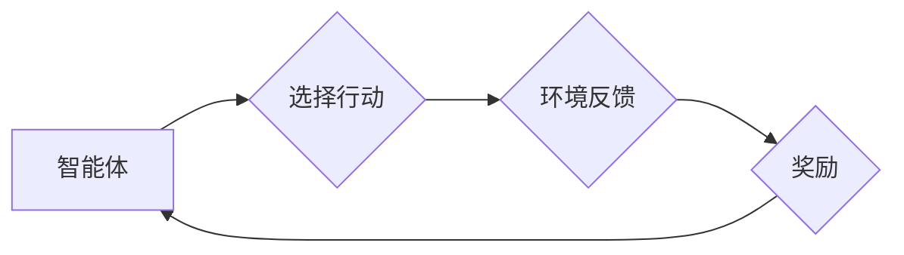

## 强化学习：在音乐生成中的应用

> 关键词：强化学习、音乐生成、深度学习、奖励机制、策略梯度

## 1. 背景介绍

音乐，作为人类文明的重要组成部分，一直以来都吸引着人们的探索和创作。随着人工智能技术的快速发展，音乐生成领域也迎来了新的机遇。传统音乐生成方法主要依赖于规则和模式，难以捕捉音乐的复杂性和创造性。而强化学习（Reinforcement Learning，RL）作为一种能够学习复杂行为的机器学习方法，为音乐生成带来了新的可能性。

强化学习的核心思想是通过一个智能体与环境的交互，通过不断尝试和学习，最终找到最优的策略来最大化奖励。在音乐生成领域，智能体可以是一个音乐模型，环境可以是音乐评价系统，奖励可以是音乐的质量得分。通过这种方式，强化学习可以训练出能够生成高质量音乐的模型。

## 2. 核心概念与联系

### 2.1 强化学习的基本概念

强化学习的核心概念包括：

* **智能体 (Agent):**  执行行动并与环境交互的实体。在音乐生成中，智能体可以是一个音乐生成模型。
* **环境 (Environment):** 智能体所处的外部世界，会根据智能体的行动产生相应的反馈。在音乐生成中，环境可以是一个音乐评价系统。
* **状态 (State):** 智能体在环境中所处的状态，例如当前生成的音乐片段。
* **行动 (Action):** 智能体可以执行的各种操作，例如选择下一个音符、改变音调等。
* **奖励 (Reward):** 环境对智能体行动的反馈，可以是正向奖励（例如音乐质量得分高）或负向奖励（例如音乐质量得分低）。
* **策略 (Policy):** 智能体根据当前状态选择行动的规则。

### 2.2 强化学习与音乐生成的联系

强化学习可以用于音乐生成的各个环节，例如：

* **旋律生成:**  训练智能体生成具有流畅性和情感共鸣的旋律。
* **和声生成:**  训练智能体生成符合音乐规律的和声。
* **节奏生成:**  训练智能体生成具有节奏感的音乐片段。
* **音乐风格迁移:**  训练智能体将一种音乐风格迁移到另一种音乐风格。

**Mermaid 流程图**



## 3. 核心算法原理 & 具体操作步骤

### 3.1 算法原理概述

强化学习算法的核心是通过不断地与环境交互，学习一个最优的策略，使得智能体在环境中获得最大的总奖励。常见的强化学习算法包括：

* **Q-学习:**  通过构建一个Q表，存储每个状态-行动对的期望奖励，并通过迭代更新Q表来学习最优策略。
* **SARSA:**  与Q-学习类似，但SARSA在更新Q表时会使用当前的策略，而不是最优策略。
* **策略梯度:**  直接优化策略函数，通过梯度上升算法来找到最优策略。

### 3.2 算法步骤详解

以Q-学习为例，其具体操作步骤如下：

1. **初始化Q表:**  将Q表中的所有值初始化为0。
2. **选择初始状态:**  从环境中获取初始状态。
3. **选择行动:**  根据当前状态和Q表中的值，选择一个行动。
4. **执行行动:**  在环境中执行选择的行动。
5. **获取奖励和下一个状态:**  从环境中获取奖励和下一个状态。
6. **更新Q表:**  根据Bellman方程更新Q表中的值。
7. **重复步骤3-6:**  重复以上步骤，直到达到终止条件。

### 3.3 算法优缺点

**优点:**

* 可以学习复杂的行为。
* 可以处理连续状态和行动空间。
* 可以应用于各种不同的任务。

**缺点:**

* 训练过程可能很慢。
* 需要大量的训练数据。
* 容易陷入局部最优解。

### 3.4 算法应用领域

强化学习算法在音乐生成领域有着广泛的应用，例如：

* **自动作曲:**  训练智能体生成完整的音乐作品。
* **音乐伴奏:**  训练智能体根据旋律生成伴奏。
* **音乐风格转换:**  训练智能体将一种音乐风格转换为另一种音乐风格。
* **音乐人声合成:**  训练智能体生成逼真的人声。

## 4. 数学模型和公式 & 详细讲解 & 举例说明

### 4.1 数学模型构建

在强化学习中，我们通常使用马尔可夫决策过程（Markov Decision Process，MDP）来建模智能体与环境的交互。MDP由以下几个要素组成：

* **状态空间 S:**  智能体可能处于的所有状态的集合。
* **行动空间 A:**  智能体在每个状态下可以执行的所有行动的集合。
* **转移概率 P(s' | s, a):**  从状态 s 执行行动 a 后转移到状态 s' 的概率。
* **奖励函数 R(s, a):**  在状态 s 执行行动 a 后获得的奖励。
* **折扣因子 γ:**  未来奖励的权重因子，通常取值在0到1之间。

### 4.2 公式推导过程

Q-学习算法的目标是学习一个Q函数，Q(s, a)，表示在状态 s 执行行动 a 后获得的期望总奖励。Q函数的更新规则如下：

$$Q(s, a) \leftarrow Q(s, a) + \alpha [R(s, a) + \gamma \max_{a'} Q(s', a') - Q(s, a)]$$

其中：

* α 是学习率，控制着Q函数更新的步长。
* s' 是执行行动 a 后到达的状态。
* a' 是在状态 s' 下选择执行的最佳行动。

### 4.3 案例分析与讲解

假设我们有一个简单的音乐生成任务，智能体需要选择下一个音符。状态空间 S 包含当前生成的音乐片段，行动空间 A 包含所有可能的音符。奖励函数 R(s, a) 可以根据音乐片段的质量得分来定义。

通过Q-学习算法，我们可以训练智能体学习一个Q函数，该函数可以告诉智能体在每个状态下选择哪个音符可以获得最大的总奖励。

## 5. 项目实践：代码实例和详细解释说明

### 5.1 开发环境搭建

为了实现音乐生成项目，我们需要搭建一个开发环境。常用的开发环境包括：

* **Python:**  作为主要的编程语言。
* **TensorFlow 或 PyTorch:**  作为深度学习框架。
* **MIDI 库:**  用于处理MIDI音乐数据。

### 5.2 源代码详细实现

以下是一个使用TensorFlow实现音乐生成的简单代码示例：

```python
import tensorflow as tf

# 定义音乐模型
model = tf.keras.Sequential([
    tf.keras.layers.LSTM(128, return_sequences=True),
    tf.keras.layers.LSTM(64),
    tf.keras.layers.Dense(128, activation='relu'),
    tf.keras.layers.Dense(num_notes, activation='softmax')
])

# 定义损失函数和优化器
loss_fn = tf.keras.losses.CategoricalCrossentropy()
optimizer = tf.keras.optimizers.Adam()

# 训练模型
for epoch in range(num_epochs):
    for batch in dataset:
        with tf.GradientTape() as tape:
            predictions = model(batch)
            loss = loss_fn(batch, predictions)
        gradients = tape.gradient(loss, model.trainable_variables)
        optimizer.apply_gradients(zip(gradients, model.trainable_variables))

# 生成音乐
initial_state = model.reset_states()
generated_notes = []
for _ in range(num_notes):
    prediction = model(initial_state)
    next_note = tf.argmax(prediction, axis=-1).numpy()
    generated_notes.append(next_note)
    initial_state = model.states
```

### 5.3 代码解读与分析

这段代码定义了一个简单的音乐生成模型，使用LSTM网络来学习音乐序列的模式。模型的输入是一个音乐片段，输出是下一个音符的概率分布。

训练过程使用交叉熵损失函数和Adam优化器，通过反向传播算法来更新模型参数。

生成音乐时，首先使用模型的初始状态，然后根据模型的输出选择下一个音符，并将该音符添加到生成的音乐序列中。

### 5.4 运行结果展示

运行这段代码后，可以生成一段简单的音乐片段。

## 6. 实际应用场景

强化学习在音乐生成领域有着广泛的应用场景，例如：

* **自动作曲:**  训练智能体生成完整的音乐作品，可以用于创作背景音乐、游戏音乐、电影配乐等。
* **音乐伴奏:**  根据用户输入的旋律，训练智能体生成相应的伴奏，可以用于音乐创作、表演和教学。
* **音乐风格迁移:**  训练智能体将一种音乐风格转换为另一种音乐风格，可以用于音乐创作、风格实验和音乐考古。
* **音乐人声合成:**  训练智能体生成逼真的人声，可以用于音乐制作、语音合成和虚拟助手。

### 6.4 未来应用展望

随着强化学习技术的不断发展，未来在音乐生成领域将有更多新的应用场景出现，例如：

* **个性化音乐推荐:**  根据用户的音乐偏好，训练智能体生成个性化的音乐推荐。
* **音乐情绪分析:**  训练智能体分析音乐的情绪，并根据用户的需求生成相应的音乐。
* **音乐治疗:**  训练智能体生成能够帮助治疗音乐相关疾病的音乐。

## 7. 工具和资源推荐

### 7.1 学习资源推荐

* **强化学习书籍:**  《Reinforcement Learning: An Introduction》 by Richard S. Sutton and Andrew G. Barto
* **强化学习课程:**  Stanford CS234: Reinforcement Learning
* **强化学习博客:**  OpenAI Blog, DeepMind Blog

### 7.2 开发工具推荐

* **TensorFlow:**  https://www.tensorflow.org/
* **PyTorch:**  https://pytorch.org/
* **MIDI 库:**  Mido, Music21

### 7.3 相关论文推荐

* **Sequence Modeling with Deep Learning** by Graves et al.
* **Generative Adversarial Networks** by Goodfellow et al.
* **Attention Is All You Need** by Vaswani et al.

## 8. 总结：未来发展趋势与挑战

### 8.1 研究成果总结

强化学习在音乐生成领域取得了显著的成果，能够生成具有流畅性和情感共鸣的音乐。

### 8.2 未来发展趋势

未来强化学习在音乐生成领域的发展趋势包括：

* **更复杂的音乐生成模型:**  使用更深层次的网络结构和更丰富的音乐特征来生成更复杂的音乐。
* **多模态音乐生成:**  结合文本、图像等其他模态信息来生成更具创意和表达力的音乐。
* **个性化音乐生成:**  根据用户的音乐偏好和需求生成个性化的音乐。

### 8.3 面临的挑战

强化学习在音乐生成领域仍然面临一些挑战，例如：

* **评价音乐质量的标准:**  音乐质量是一个主观概念，难以用客观指标来衡量。
* **训练数据不足:**  高质量的音乐数据难以获取，这限制了强化学习模型的训练效果。
* **计算资源需求:**  训练复杂的强化学习模型需要大量的计算资源。

### 8.4 研究展望

未来研究方向包括：

* **开发新的音乐评价指标:**  寻找更客观和有效的评价音乐质量的标准。
* **探索新的数据获取方法:**  开发新的方法来获取高质量的音乐数据。
* **研究更有效的训练算法:**  开发更有效的训练算法来降低训练成本和提高训练效率。

## 9. 附录：常见问题与解答

**Q1: 强化学习与传统音乐生成方法相比有什么优势？**

**A1:** 强化学习能够学习复杂的音乐模式，并根据奖励机制生成具有流畅性和情感