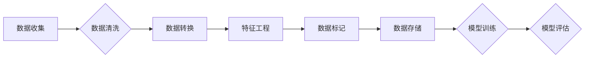

## 1. 背景介绍

人工智能 (AI) 正在迅速改变世界，从自动驾驶到医疗诊断，AI 的应用领域日益广泛。然而，AI 的成功依赖于高质量的数据集。数据集工程，即构建、管理和维护用于训练和评估 AI 模型的数据集，已成为 AI 应用的关键环节。

随着 AI 技术的快速发展，对高质量数据集的需求也越来越高。传统的 AI 模型训练方法依赖于人工标注数据，这不仅耗时费力，而且容易引入人为偏差。而深度学习的兴起，则进一步加剧了对大规模、高质量数据集的需求。深度学习模型的训练需要海量数据才能达到最佳性能，而数据质量直接影响模型的准确性和泛化能力。

## 2. 核心概念与联系

数据集工程涵盖了从数据收集到数据预处理、特征工程、数据标记和数据存储等多个环节。其核心目标是构建一个能够满足 AI 模型训练和评估需求的可靠、高效、可维护的数据集。

**数据流程图:**



**数据流程图说明:**

1. **数据收集:** 从各种来源收集原始数据，例如传感器数据、文本数据、图像数据等。
2. **数据清洗:** 去除数据中的噪声、缺失值和重复数据，确保数据质量。
3. **数据转换:** 将数据转换为 AI 模型可以理解的格式，例如将文本数据转换为词向量。
4. **特征工程:** 从原始数据中提取有价值的特征，提高模型的性能。
5. **数据标记:** 为数据添加标签，以便训练分类、回归等监督学习模型。
6. **数据存储:** 将数据存储在高效、可访问的存储系统中。
7. **模型训练:** 使用训练好的数据训练 AI 模型。
8. **模型评估:** 使用测试数据评估模型的性能。

## 3. 核心算法原理 & 具体操作步骤

数据集工程中涉及多种算法和技术，例如数据清洗算法、特征工程算法和数据标记算法。

### 3.1  算法原理概述

* **数据清洗算法:** 主要用于处理数据中的缺失值、噪声和重复数据。常见的算法包括均值填充、中位数填充、K 近邻插值和删除异常值等。
* **特征工程算法:** 主要用于从原始数据中提取有价值的特征。常见的算法包括主成分分析 (PCA)、线性判别分析 (LDA)、特征选择和特征组合等。
* **数据标记算法:** 主要用于为数据添加标签。常见的算法包括监督学习、半监督学习和无监督学习等。

### 3.2  算法步骤详解

**数据清洗算法步骤:**

1. **数据探索:** 了解数据的结构、类型和分布。
2. **缺失值处理:** 使用合适的算法填充缺失值。
3. **噪声处理:** 使用滤波算法或异常值检测算法去除噪声。
4. **重复数据处理:** 删除重复数据。

**特征工程算法步骤:**

1. **数据预处理:** 对数据进行清洗、转换和归一化。
2. **特征选择:** 选择与目标变量相关性高的特征。
3. **特征组合:** 将多个特征组合成新的特征。
4. **特征转换:** 将特征转换为不同的形式，例如对数转换、平方根转换等。

**数据标记算法步骤:**

1. **数据标注:** 根据任务需求，为数据添加标签。
2. **标注策略:** 选择合适的标注策略，例如主动学习、众包标注等。
3. **标注质量控制:** 确保标注质量，并进行标注纠正。

### 3.3  算法优缺点

**数据清洗算法:**

* **优点:** 可以有效地提高数据质量。
* **缺点:** 可能会丢失一些有用信息。

**特征工程算法:**

* **优点:** 可以提高模型的性能。
* **缺点:** 需要一定的专业知识和经验。

**数据标记算法:**

* **优点:** 可以训练监督学习模型。
* **缺点:** 需要人工标注数据，耗时费力。

### 3.4  算法应用领域

* **图像识别:** 数据清洗算法用于去除图像中的噪声和模糊，特征工程算法用于提取图像特征，数据标记算法用于标注图像类别。
* **自然语言处理:** 数据清洗算法用于去除文本中的停用词和标点符号，特征工程算法用于提取文本特征，数据标记算法用于标注文本情感、主题等。
* **推荐系统:** 数据清洗算法用于处理用户行为数据中的缺失值和异常值，特征工程算法用于提取用户兴趣特征，数据标记算法用于标注用户对商品的评分。

## 4. 数学模型和公式 & 详细讲解 & 举例说明

数据集工程中涉及多种数学模型和公式，例如概率模型、统计模型和机器学习模型。

### 4.1  数学模型构建

**概率模型:** 用于描述数据之间的概率关系。例如，贝叶斯网络是一种概率图模型，用于表示变量之间的依赖关系。

**统计模型:** 用于描述数据的统计特征。例如，均值和标准差是描述数据的中心趋势和离散程度的统计指标。

**机器学习模型:** 用于学习数据中的模式和规律。例如，线性回归模型用于预测连续变量，决策树模型用于分类。

### 4.2  公式推导过程

**贝叶斯公式:**

$$P(A|B) = \frac{P(B|A)P(A)}{P(B)}$$

其中:

* $P(A|B)$ 是在已知事件 B 发生的情况下，事件 A 发生的概率。
* $P(B|A)$ 是在已知事件 A 发生的情况下，事件 B 发生的概率。
* $P(A)$ 是事件 A 发生的概率。
* $P(B)$ 是事件 B 发生的概率。

**线性回归模型:**

$$y = \beta_0 + \beta_1x_1 + \beta_2x_2 +... + \beta_nx_n + \epsilon$$

其中:

* $y$ 是预测变量。
* $x_1, x_2,..., x_n$ 是解释变量。
* $\beta_0, \beta_1, \beta_2,..., \beta_n$ 是模型参数。
* $\epsilon$ 是误差项。

### 4.3  案例分析与讲解

**贝叶斯公式案例:**

假设我们有一个疾病检测模型，该模型的准确率为 90%。如果一个人被检测出患有该疾病，那么该疾病的真实发生概率是多少？

**解:**

* $P(A)$ 是患有该疾病的概率，假设为 1%。
* $P(B|A)$ 是在患有该疾病的情况下被检测出的概率，为 90%。
* $P(B)$ 是被检测出的概率，可以计算为：

$$P(B) = P(B|A)P(A) + P(B|A^c)P(A^c)$$

其中 $A^c$ 是不患有该疾病的事件，假设其概率为 99%。

* $P(B|A^c)$ 是在不患有该疾病的情况下被检测出的概率，假设为 10%。

**最终，我们可以使用贝叶斯公式计算出患有该疾病的真实发生概率:**

$$P(A|B) = \frac{P(B|A)P(A)}{P(B)}$$

**线性回归模型案例:**

假设我们想要预测房价，并收集了房屋面积、房间数量、地理位置等数据。我们可以使用线性回归模型来建立房价预测模型。

**解:**

* $y$ 是房价。
* $x_1$ 是房屋面积。
* $x_2$ 是房间数量。
* $x_3$ 是地理位置特征。

我们可以使用最小二乘法来估计模型参数 $\beta_0, \beta_1, \beta_2, \beta_3$。

## 5. 项目实践：代码实例和详细解释说明

### 5.1  开发环境搭建

* **操作系统:** Linux 或 macOS
* **编程语言:** Python
* **库:** pandas, numpy, scikit-learn

### 5.2  源代码详细实现

```python
import pandas as pd
from sklearn.model_selection import train_test_split
from sklearn.linear_model import LinearRegression
from sklearn.metrics import mean_squared_error

# 加载数据
data = pd.read_csv('house_price.csv')

# 划分训练集和测试集
X = data[['area', 'rooms', 'location']]
y = data['price']
X_train, X_test, y_train, y_test = train_test_split(X, y, test_size=0.2, random_state=42)

# 创建线性回归模型
model = LinearRegression()

# 训练模型
model.fit(X_train, y_train)

# 预测测试集数据
y_pred = model.predict(X_test)

# 计算模型性能
mse = mean_squared_error(y_test, y_pred)
print(f'Mean Squared Error: {mse}')
```

### 5.3  代码解读与分析

* **数据加载:** 使用 pandas 库加载数据。
* **数据划分:** 使用 train_test_split 函数将数据划分成训练集和测试集。
* **模型创建:** 使用 LinearRegression 类创建线性回归模型。
* **模型训练:** 使用 fit 方法训练模型。
* **模型预测:** 使用 predict 方法预测测试集数据。
* **模型性能评估:** 使用 mean_squared_error 函数计算模型性能。

### 5.4  运行结果展示

运行代码后，会输出模型的均方误差 (MSE) 值。MSE 值越小，模型的性能越好。

## 6. 实际应用场景

数据集工程在各个领域都有广泛的应用，例如：

* **医疗保健:** 用于训练疾病诊断模型、药物研发模型等。
* **金融:** 用于训练欺诈检测模型、信用评分模型等。
* **电商:** 用于训练推荐系统、个性化营销模型等。
* **自动驾驶:** 用于训练感知模型、决策模型等。

### 6.4  未来应用展望

随着 AI 技术的不断发展，数据集工程将变得更加重要。未来，数据集工程将朝着以下方向发展:

* **自动化:** 使用自动化工具和技术来简化数据集工程流程。
* **可解释性:** 开发可解释的 AI 模型，以便更好地理解模型的决策过程。
* **联邦学习:** 在不共享原始数据的情况下，训练共享模型。
* **数据隐私保护:** 开发新的技术来保护数据隐私。

## 7. 工具和资源推荐

### 7.1  学习资源推荐

* **书籍:**
    * "Hands-On Machine Learning with Scikit-Learn, Keras & TensorFlow" by Aurélien Géron
    * "The Hundred-Page Machine Learning Book" by Andriy Burkov
* **在线课程:**
    * Coursera: Machine Learning by Andrew Ng
    * Udacity: Machine Learning Engineer Nanodegree
* **博客:**
    * Towards Data Science
    * Machine Learning Mastery

### 7.2  开发工具推荐

* **数据处理:** pandas, NumPy
* **机器学习:** scikit-learn, TensorFlow, PyTorch
* **数据可视化:** matplotlib, seaborn

### 7.3  相关论文推荐

* "Data Engineering for Machine Learning" by Matei Zaharia et al.
* "The Elements of Statistical Learning" by Trevor Hastie et al.

## 8. 总结：未来发展趋势与挑战

### 8.1  研究成果总结

数据集工程已经取得了显著的成果，为 AI 应用提供了高质量的数据支持。

### 8.2  未来发展趋势

数据集工程将朝着自动化、可解释性、联邦学习和数据隐私保护等方向发展。

### 8.3  面临的挑战

数据集工程面临着数据质量、数据标注