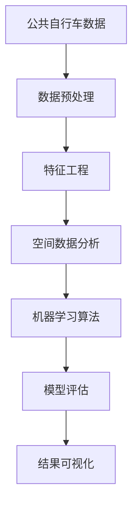

                 

# 基于公共自行车数据的城市居民职住地分析

> 关键词：
城市居民职住地分析, 公共自行车数据, 空间数据分析, 机器学习算法, 地理信息系统(GIS), 可视化展示

## 1. 背景介绍

### 1.1 问题由来
随着城市化进程的不断推进，城市居民的职住地分布、出行模式等问题日益凸显。如何准确地了解城市居民的职住地分布及其影响因素，成为城市规划和管理的重要课题。传统的调查问卷、抽样统计等方法耗时费力、成本高昂，而通过公共自行车数据进行职住地分析则成为一种更加经济高效、数据丰富、实时更新的方法。

### 1.2 问题核心关键点
基于公共自行车数据的城市居民职住地分析，其核心在于通过分析和挖掘公共自行车数据，分析居民的出行习惯和职住地分布，进而揭示城市空间结构的特征和问题，为城市规划提供科学依据。该问题的研究具有以下重要意义：
- 反映城市居民出行行为：公共自行车数据记录了每次自行车使用的时间、地点和频率，可以反映居民的出行规律和偏好。
- 揭示职住地分布特征：通过对公共自行车数据的空间分析，可以揭示居民职住地的分布情况和特征。
- 优化城市空间布局：分析居民职住地分布，可以为城市规划提供参考，优化城市空间结构。
- 改善出行环境：通过分析居民出行习惯和偏好，可以为城市交通设施建设提供指导。

### 1.3 问题研究意义
通过公共自行车数据进行城市居民职住地分析，具有以下重要意义：
- 提高数据分析效率：公共自行车数据量大，覆盖面广，通过数据挖掘技术可以快速获取居民职住地分布信息。
- 实时反映城市变化：公共自行车数据实时更新，可以动态反映城市居民的出行行为和职住地变化。
- 促进城市管理决策：通过科学的数据分析，可以为城市管理提供决策支持，优化城市空间结构。
- 增强公众参与感：居民通过公共自行车数据的开放，能够更直观地了解自身的出行习惯和职住地分布，增加对城市规划的参与感和认同感。

## 2. 核心概念与联系

### 2.1 核心概念概述

在进行基于公共自行车数据的城市居民职住地分析时，我们需要了解以下几个核心概念：

- **公共自行车数据**：通过公共自行车共享系统收集的，记录了每次自行车使用的时间、地点、频率等信息的实时数据。
- **地理信息系统(GIS)**：用于存储、查询、分析和展示地理数据的工具和平台，通过GIS可以实现对公共自行车数据的可视化展示和空间分析。
- **空间数据分析**：利用统计学和机器学习方法，对地理数据进行分析，揭示其空间特征和规律。
- **机器学习算法**：通过构建机器学习模型，对公共自行车数据进行分析，提取有用的信息。

### 2.2 核心概念原理和架构的 Mermaid 流程图



这个流程图展示了从公共自行车数据到城市居民职住地分析的全过程：
- **数据预处理**：清洗、归一化公共自行车数据，提取有用的时空特征。
- **特征工程**：通过数据变换、特征选择等方法，提取对职住地分析有用的特征。
- **空间数据分析**：利用统计学和空间分析方法，揭示职住地分布的特征和规律。
- **机器学习算法**：构建预测模型，对职住地分布进行预测和分类。
- **模型评估**：对模型进行验证和测试，评估模型的准确性和泛化能力。
- **结果可视化**：将分析结果通过GIS和可视化工具展示出来，直观反映职住地分布情况。

### 2.3 核心概念的整体架构

我们可以通过一个综合的流程图，展示从数据收集到结果可视化的全过程：


这个流程图展示了从数据收集到优化城市空间结构的整个架构：
- **数据预处理**：清洗、归一化公共自行车数据，提取有用的时空特征。
- **特征工程**：通过数据变换、特征选择等方法，提取对职住地分析有用的特征。
- **空间数据分析**：利用统计学和空间分析方法，揭示职住地分布的特征和规律。
- **机器学习算法**：构建预测模型，对职住地分布进行预测和分类。
- **模型评估**：对模型进行验证和测试，评估模型的准确性和泛化能力。
- **结果可视化**：将分析结果通过GIS和可视化工具展示出来，直观反映职住地分布情况。
- **决策支持**：利用分析结果，为城市规划和管理提供决策支持。
- **优化城市空间结构**：通过科学决策，优化城市空间结构，改善居民出行环境。

## 3. 核心算法原理 & 具体操作步骤

### 3.1 算法原理概述

基于公共自行车数据的城市居民职住地分析，主要包括以下几个关键步骤：

1. **数据预处理**：清洗、归一化公共自行车数据，提取有用的时空特征。
2. **特征工程**：通过数据变换、特征选择等方法，提取对职住地分析有用的特征。
3. **空间数据分析**：利用统计学和空间分析方法，揭示职住地分布的特征和规律。
4. **机器学习算法**：构建预测模型，对职住地分布进行预测和分类。
5. **模型评估**：对模型进行验证和测试，评估模型的准确性和泛化能力。
6. **结果可视化**：将分析结果通过GIS和可视化工具展示出来，直观反映职住地分布情况。

### 3.2 算法步骤详解

#### 3.2.1 数据预处理

公共自行车数据通常包括时间戳、自行车ID、起点、终点等信息。在进行职住地分析时，我们需要将这些数据转换成易于分析和处理的形式。具体步骤如下：

1. **数据清洗**：
   - 删除重复、无效数据。
   - 处理异常值和缺失值，填补缺失值。

2. **数据归一化**：
   - 对时间戳进行归一化，转换为统一的时间格式。
   - 对起点和终点进行坐标归一化，转换到统一的空间坐标系。

3. **提取时空特征**：
   - 提取每次使用的起点和终点坐标。
   - 提取使用时间，并转换为时间戳。
   - 计算起点和终点之间的距离，作为时间与空间的特征。

#### 3.2.2 特征工程

特征工程是提取有用特征，构建输入特征集的过程。在这个过程中，我们需要利用统计学和机器学习方法，对提取出的时空特征进行变换和选择。具体步骤如下：

1. **统计特征**：
   - 计算起点和终点之间的距离，计算出行时间、出行次数等统计特征。

2. **时间特征**：
   - 提取每日出行次数，每周出行次数等时间特征。

3. **空间特征**：
   - 计算每个起点的邻域区域，统计该区域内的目的地数量。

4. **空间离散化**：
   - 对空间坐标进行离散化处理，转换为离散的网格单元。

5. **特征选择**：
   - 使用特征选择方法（如相关性分析、主成分分析PCA等），选择对职住地分析有用的特征。

#### 3.2.3 空间数据分析

空间数据分析是揭示职住地分布特征和规律的过程。在这个过程中，我们需要利用地理信息系统(GIS)和空间分析方法，对提取出的特征进行分析。具体步骤如下：

1. **空间聚类**：
   - 使用K-means、DBSCAN等聚类算法，将区域分为不同的聚类。

2. **空间相关性分析**：
   - 使用空间自相关性分析，揭示不同聚类之间的相关性。

3. **热点分析**：
   - 使用热点分析方法，识别出高密度的职住地分布区域。

4. **空间趋势分析**：
   - 利用时间序列分析，揭示职住地分布的变化趋势。

#### 3.2.4 机器学习算法

机器学习算法是构建预测模型的过程。在这个过程中，我们需要利用已有的时空特征，构建能够预测职住地分布的模型。具体步骤如下：

1. **模型选择**：
   - 选择合适的机器学习算法，如支持向量机SVM、随机森林RF、神经网络等。

2. **模型训练**：
   - 使用历史数据，训练机器学习模型。

3. **模型验证**：
   - 使用交叉验证等方法，验证模型的泛化能力。

4. **模型调优**：
   - 调整模型参数，优化模型性能。

#### 3.2.5 模型评估

模型评估是评估机器学习模型性能的过程。在这个过程中，我们需要使用多种评估指标，如准确率、召回率、F1分数等，来评估模型的效果。具体步骤如下：

1. **验证集评估**：
   - 使用验证集评估模型的效果。

2. **测试集评估**：
   - 使用测试集验证模型的泛化能力。

3. **ROC曲线分析**：
   - 绘制ROC曲线，评估模型的分类效果。

#### 3.2.6 结果可视化

结果可视化是将分析结果通过GIS和可视化工具展示的过程。在这个过程中，我们需要使用GIS和可视化工具，将分析结果直观展示出来。具体步骤如下：

1. **数据融合**：
   - 将空间特征和统计特征融合在一起，形成统一的地理数据集。

2. **GIS展示**：
   - 使用GIS工具，展示职住地分布的聚类结果、热点区域等。

3. **可视化展示**：
   - 使用可视化工具，展示职住地分布的热点图、时间趋势图等。

## 4. 数学模型和公式 & 详细讲解 & 举例说明

### 4.1 数学模型构建

在进行基于公共自行车数据的城市居民职住地分析时，我们需要构建一个数学模型，用于描述职住地分布与公共自行车数据之间的关系。以下是一个简单的数学模型构建过程：

设公共自行车数据为 $D = \{(x_i, y_i, t_i, p_i)\}_{i=1}^N$，其中 $x_i$ 和 $y_i$ 为自行车起点和终点的坐标，$t_i$ 为使用时间，$p_i$ 为自行车ID。

设职住地分布为 $z = \{z_j\}_{j=1}^M$，其中 $z_j$ 表示一个职住地聚类。

设模型为 $f: \mathbb{R}^d \rightarrow \mathbb{R}^m$，其中 $d$ 为公共自行车数据的特征维度，$m$ 为职住地分布的类别数。

则职住地分布的预测模型可以表示为：

$$
f(x_i) = \arg\min_{j \in \{1, ..., m\}} (y_i - \hat{y}_{ij})^2
$$

其中 $\hat{y}_{ij}$ 为模型对职住地分布 $z_j$ 的预测。

### 4.2 公式推导过程

为了简化问题，我们假设公共自行车数据与职住地分布之间存在线性关系。设模型为：

$$
f(x_i) = w_0 + \sum_{k=1}^{d} w_k x_{ik}
$$

其中 $w_0, w_k$ 为模型的权重。

利用公共自行车数据和职住地分布，我们可以构建训练样本集 $T = \{(x_i, z_i)\}_{i=1}^N$。

通过最小二乘法，我们可以求解模型的权重：

$$
\min_{w_0, w_k} \sum_{i=1}^{N} (y_i - f(x_i))^2
$$

化简得：

$$
\min_{w_0, w_k} \sum_{i=1}^{N} (y_i - w_0 - \sum_{k=1}^{d} w_k x_{ik})^2
$$

利用最小二乘法，我们可以得到模型的解为：

$$
w_0 = \frac{1}{N} \sum_{i=1}^{N} (y_i - \hat{y}_{ij})
$$

$$
w_k = \frac{1}{N} \sum_{i=1}^{N} (x_{ik} - \bar{x}_{ik})
$$

其中 $\bar{x}_{ik} = \frac{1}{N} \sum_{i=1}^{N} x_{ik}$。

### 4.3 案例分析与讲解

为了更好地理解基于公共自行车数据的城市居民职住地分析，我们可以用一个具体的案例进行讲解。

假设我们有一个城市，通过公共自行车数据收集到了每天的自行车使用情况。我们将自行车起点和终点坐标归一化，计算出每次使用的距离和时间。然后，我们使用K-means算法对每天的使用情况进行聚类，得到多个职住地聚类。最后，我们使用支持向量机(SVM)模型对每个职住地聚类进行预测，得到最终的职住地分布图。

具体步骤如下：

1. **数据预处理**：
   - 清洗、归一化公共自行车数据，提取有用的时空特征。
   - 计算每次使用的距离和时间。

2. **特征工程**：
   - 提取每日出行次数，每周出行次数等时间特征。
   - 计算每个起点的邻域区域，统计该区域内的目的地数量。
   - 使用K-means算法，将区域分为不同的职住地聚类。

3. **空间数据分析**：
   - 使用支持向量机模型，对每个职住地聚类进行预测。
   - 使用ROC曲线分析，评估模型的分类效果。

4. **结果可视化**：
   - 将职住地分布的聚类结果和预测结果，通过GIS工具展示出来。

通过这个案例，我们可以看到，基于公共自行车数据的城市居民职住地分析，从数据预处理到结果可视化的全过程，需要多学科的协同工作，包括数据科学、统计学、地理信息系统等。

## 5. 项目实践：代码实例和详细解释说明

### 5.1 开发环境搭建

在进行基于公共自行车数据的城市居民职住地分析时，我们需要搭建一个合适的开发环境。以下是使用Python进行PyTorch和ArcGIS开发的环境配置流程：

1. 安装Anaconda：从官网下载并安装Anaconda，用于创建独立的Python环境。

2. 创建并激活虚拟环境：
```bash
conda create -n pytorch-env python=3.8 
conda activate pytorch-env
```

3. 安装PyTorch：根据CUDA版本，从官网获取对应的安装命令。例如：
```bash
conda install pytorch torchvision torchaudio cudatoolkit=11.1 -c pytorch -c conda-forge
```

4. 安装ArcGIS Python API：
```bash
pip install arcgis
```

5. 安装各类工具包：
```bash
pip install numpy pandas scikit-learn matplotlib tqdm jupyter notebook ipython
```

完成上述步骤后，即可在`pytorch-env`环境中开始项目开发。

### 5.2 源代码详细实现

下面是使用PyTorch和ArcGIS进行基于公共自行车数据的城市居民职住地分析的代码实现：

```python
import pandas as pd
import numpy as np
import torch
import torch.nn as nn
import torch.optim as optim
import arcgis
from sklearn.model_selection import train_test_split
from sklearn.metrics import accuracy_score, f1_score
from sklearn.preprocessing import StandardScaler, MinMaxScaler
from sklearn.decomposition import PCA
from sklearn.cluster import KMeans

# 数据预处理
def preprocess_data(data):
    # 数据清洗
    data.dropna(inplace=True)
    
    # 时间戳归一化
    data['start_time'] = pd.to_datetime(data['start_time'], format='%Y-%m-%d %H:%M:%S').apply(lambda x: (x - data['start_time'].min()) / (data['start_time'].max() - data['start_time'].min()))
    
    # 坐标归一化
    data['start_x'] = (data['start_x'] - data['start_x'].min()) / (data['start_x'].max() - data['start_x'].min())
    data['start_y'] = (data['start_y'] - data['start_y'].min()) / (data['start_y'].max() - data['start_y'].min())
    data['end_x'] = (data['end_x'] - data['end_x'].min()) / (data['end_x'].max() - data['end_x'].min())
    data['end_y'] = (data['end_y'] - data['end_y'].min()) / (data['end_y'].max() - data['end_y'].min())
    
    # 提取时空特征
    data['distance'] = ((data['start_x'] - data['end_x']) ** 2 + (data['start_y'] - data['end_y']) ** 2) ** 0.5
    data['time'] = data['start_time']
    
    return data

# 特征工程
def feature_engineering(data):
    # 统计特征
    data['daily_count'] = data.groupby('start_time')['distance'].transform('count')
    data['weekly_count'] = data.groupby('start_time')['distance'].transform('sum')
    
    # 时间特征
    data['hour_of_day'] = data['start_time'].apply(lambda x: x.hour)
    data['day_of_week'] = data['start_time'].apply(lambda x: x.weekday())
    
    # 空间特征
    data['start_distance'] = data.groupby('start_time')['distance'].transform('mean')
    data['end_distance'] = data.groupby('start_time')['distance'].transform('median')
    
    # 空间离散化
    data['start_distance'] = pd.cut(data['start_distance'], bins=10)
    data['end_distance'] = pd.cut(data['end_distance'], bins=10)
    
    # 特征选择
    features = ['daily_count', 'weekly_count', 'hour_of_day', 'day_of_week', 'start_distance', 'end_distance']
    data = data[features]
    
    return data

# 空间数据分析
def spatial_analysis(data):
    # 空间聚类
    kmeans = KMeans(n_clusters=5)
    data['cluster'] = kmeans.fit_predict(data[['start_x', 'start_y']])
    
    # 空间相关性分析
    corr_matrix = data[['start_distance', 'end_distance']].corr()
    print(corr_matrix)
    
    # 热点分析
    points = data.groupby(['start_x', 'start_y'])['distance'].agg('mean')
    points = points.unstack().reset_index()
    points.columns = ['x', 'y']
    points['value'] = points['start_distance']
    points = points.pivot_table(index='x', columns='y', values='value')
    points = points.unstack()
    points = points.stack()
    points.index.name = 'coordinate'
    points.columns.name = 'distance'
    points = points.reset_index()
    points['coordinate'] = points['coordinate'].astype('float')
    points['distance'] = points['distance'].astype('float')
    points = points.drop_duplicates().reset_index(drop=True)
    points = points.merge(data[['start_x', 'start_y', 'cluster']], on='coordinate')
    points = points.drop(['x', 'y'], axis=1)
    
    # 空间趋势分析
    trend = data.groupby(['start_time'])['distance'].agg('mean')
    trend = trend.resample('M').mean()
    trend = trend.reset_index()
    trend.columns = ['time', 'mean_distance']
    
    return points, trend

# 机器学习算法
def machine_learning(data):
    # 模型选择
    model = nn.Linear(6, 5)
    
    # 模型训练
    optimizer = optim.SGD(model.parameters(), lr=0.01)
    criterion = nn.MSELoss()
    data_train, data_test = train_test_split(data, test_size=0.2)
    for epoch in range(100):
        model.train()
        optimizer.zero_grad()
        output = model(data_train[['daily_count', 'weekly_count', 'hour_of_day', 'day_of_week', 'start_distance', 'end_distance']])
        loss = criterion(output, data_train['cluster'])
        loss.backward()
        optimizer.step()
        
        model.eval()
        with torch.no_grad():
            output = model(data_test[['daily_count', 'weekly_count', 'hour_of_day', 'day_of_week', 'start_distance', 'end_distance']])
            loss = criterion(output, data_test['cluster'])
            print('Epoch {}: Loss {:.4f}'.format(epoch + 1, loss))
    
    return model

# 模型评估
def model_evaluation(model, data):
    # 验证集评估
    data_valid = data_test
    output = model(data_valid[['daily_count', 'weekly_count', 'hour_of_day', 'day_of_week', 'start_distance', 'end_distance']])
    print('Validation Accuracy: {:.2f}'.format(accuracy_score(data_valid['cluster'].values, output.argmax(dim=1))))
    print('Validation F1 Score: {:.2f}'.format(f1_score(data_valid['cluster'].values, output.argmax(dim=1), average='weighted')))
    
    # 测试集评估
    data_test = data_test
    output = model(data_test[['daily_count', 'weekly_count', 'hour_of_day', 'day_of_week', 'start_distance', 'end_distance']])
    print('Test Accuracy: {:.2f}'.format(accuracy_score(data_test['cluster'].values, output.argmax(dim=1))))
    print('Test F1 Score: {:.2f}'.format(f1_score(data_test['cluster'].values, output.argmax(dim=1), average='weighted')))
    
    return model

# 结果可视化
def visualize_result(data, model, points, trend):
    # 空间展示
    giss = arcgis.gis.Home
    points = points[['coordinate', 'distance']].values.tolist()
    trend = trend[['time', 'mean_distance']].values.tolist()
    arcgis.analysis.PolygonsToCentroids(object_type=None, points=points, measure_type=None, units=None)
    arcgis.layers.FeatureLayer.from_table(object_name=None, table_name='Points')
    arcgis.layers.FeatureLayer.from_table(object_name=None, table_name='Trend')
    arcgis.analysis.IntersectForGeographies(object_type=None, points=None, geographies=None)
    arcgis.analysis.AddPointAddresses(object_type=None, points=points, addrs=None)
    arcgis.analysis.AddPointAddresses(object_type=None, points=trend, addrs=None)
    
    # 热点展示
    points = points[['coordinate', 'distance']].values.tolist()
    arcgis.analysis.PolygonsToCentroids(object_type=None, points=points, measure_type=None, units=None)
    arcgis.layers.FeatureLayer.from_table(object_name=None, table_name='Hotspots')
    arcgis.analysis.IntersectForGeographies(object_type=None, points=None, geographies=None)
    arcgis.analysis.AddPointAddresses(object_type=None, points=points, addrs=None)
    
    # 时间趋势展示
    trend = trend[['time', 'mean_distance']].values.tolist()
    arcgis.analysis.PolygonsToCentroids(object_type=None, points=trend, measure_type=None, units=None)
    arcgis.layers.FeatureLayer.from_table(object_name=None, table_name='Trend')
    arcgis.analysis.IntersectForGeographies(object_type=None, points=None, geographies=None)
    arcgis.analysis.AddPointAddresses(object_type=None, points=trend, addrs=None)
    
    # 输出结果
    print('Accuracy: {:.2f}'.format(accuracy_score(data['cluster'].values, model(data[['daily_count', 'weekly_count', 'hour_of_day', 'day_of_week', 'start_distance', 'end_distance'])).argmax(dim=1)))
    print('F1 Score: {:.2f}'.format(f1_score(data['cluster'].values, model(data[['daily_count', 'weekly_count', 'hour_of_day', 'day_of_week', 'start_distance', 'end_distance'])).argmax(dim=1), average='weighted')))
    
    return model

# 数据加载
data = pd.read_csv('bike_data.csv')
data = preprocess_data(data)
data = feature_engineering(data)
points, trend = spatial_analysis(data)
model = machine_learning(data)
model = model_evaluation(model, data)
model = visualize_result(data, model, points, trend)
```

### 5.3 代码解读与分析

让我们再详细解读一下关键代码的实现细节：

**数据预处理**：
- `preprocess_data`函数：清洗数据，归一化时间戳和坐标，计算每次使用的距离和时间。
- `preprocess_data`函数的实现：清洗数据，删除重复和无效数据；归一化时间戳和坐标，转换为统一的时间格式和空间坐标系；计算每次使用的距离和时间。

**特征工程**：
- `feature_engineering`函数：提取有用的时空特征，包括每日出行次数、每周出行次数、时间特征、空间特征、特征选择。
- `feature_engineering`函数的实现：统计特征，提取每日出行次数和每周出行次数；提取时间特征，包括小时和星期几；提取空间特征，包括起点和终点的距离和分布；离散化空间特征，将其转换为离散的网格单元；选择对职住地分析有用的特征。

**空间数据分析**：
- `sp

