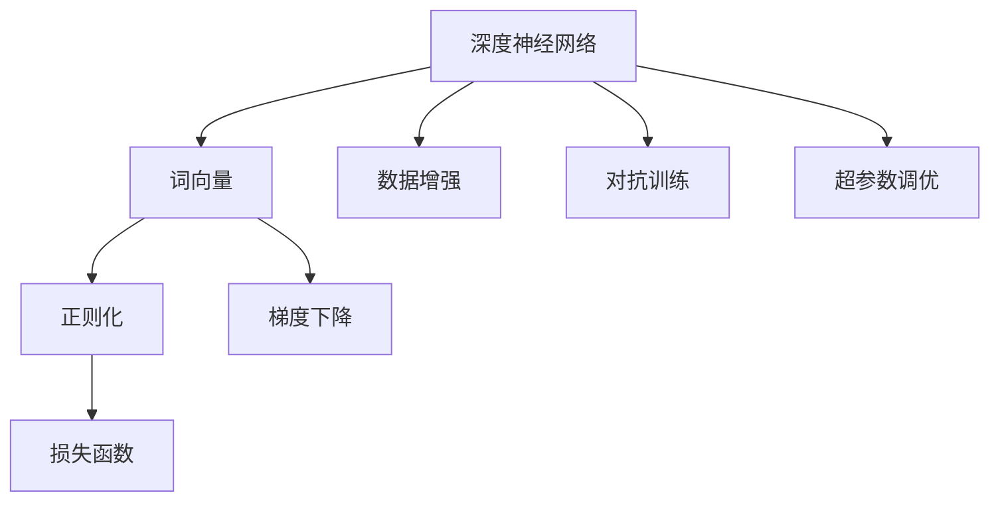
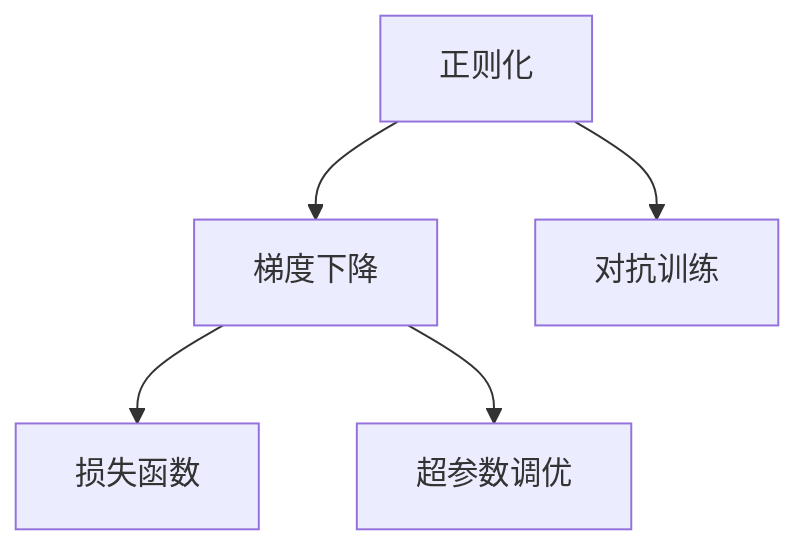

                 

# 基于深度神经网络的高质量词向量生成方法研究

## 1. 背景介绍

### 1.1 问题由来
在自然语言处理（NLP）领域，词向量（Word Embedding）是文本表示的重要组成部分，广泛应用于文本分类、语义相似度计算、机器翻译等任务中。传统的词向量生成方法主要基于统计学原理，如Word2Vec、GloVe等，但存在维度过高、计算复杂、泛化能力不足等问题。随着深度学习技术的发展，基于深度神经网络的方法逐步取代了传统的词向量生成方法，其高质量词向量的生成能力得到了学术界的广泛关注。

然而，基于深度神经网络的方法也存在计算资源消耗大、模型训练时间长、生成词向量质量不稳定等缺点。因此，如何高效、稳定地生成高质量词向量，成为当前词向量生成领域的一个重要研究方向。

### 1.2 问题核心关键点
当前基于深度神经网络的高质量词向量生成方法，主要包括以下几个核心技术：
- 深度神经网络架构的设计和训练策略
- 数据的预处理和增强技术
- 生成词向量的后处理与优化技术
- 高效存储与访问策略

这些技术相互交织，共同构成了高质量词向量生成的核心挑战。通过对此进行深入研究，可以进一步提升词向量的生成效果，推动NLP技术的进步。

### 1.3 问题研究意义
高质量词向量生成方法的研究，对提升NLP任务的性能、降低计算资源消耗、优化模型训练过程等方面具有重要意义：

1. 提升文本表示质量：高质量的词向量能够更准确地表达词语的语义信息，提升文本分类、语义相似度等NLP任务的效果。
2. 降低计算资源消耗：通过改进深度神经网络架构和训练策略，可以降低模型训练时间和内存消耗，使词向量生成方法更易于部署和应用。
3. 优化模型训练过程：有效的数据预处理和增强技术，能够提高模型的泛化能力和鲁棒性，加速模型的收敛。
4. 提升词向量生成效率：通过优化生成词向量的后处理与优化技术，可以在保证词向量质量的前提下，提升生成速度，满足实时应用的需求。
5. 促进NLP技术的进步：高质量词向量生成方法的研究，推动了NLP技术的整体发展，为更复杂、更深层的NLP任务提供了坚实的基础。

## 2. 核心概念与联系

### 2.1 核心概念概述

为更好地理解基于深度神经网络的高质量词向量生成方法，本节将介绍几个密切相关的核心概念：

- 深度神经网络（Deep Neural Network, DNN）：由多个神经元层级组成，可以自动学习特征表示的网络结构。
- 词向量（Word Embedding）：将词语映射到向量空间中的表示，用于提升文本语义理解能力。
- 正则化（Regularization）：通过添加约束条件，避免模型过拟合，提高模型的泛化能力。
- 梯度下降（Gradient Descent）：一种基于梯度的优化算法，用于调整神经网络中的参数，使其达到最优解。
- 数据增强（Data Augmentation）：通过修改训练数据的方式，增加数据多样性，提高模型的泛化能力。
- 对抗训练（Adversarial Training）：通过引入对抗样本，提高模型的鲁棒性和泛化能力。
- 损失函数（Loss Function）：用于衡量模型预测结果与真实标签之间的差异。
- 超参数调优（Hyperparameter Tuning）：通过调整模型训练过程中的参数，优化模型的性能。

这些核心概念之间的逻辑关系可以通过以下Mermaid流程图来展示：



这个流程图展示了大规模词向量生成方法中各核心概念的关系：

1. 深度神经网络是生成词向量的基础。
2. 词向量生成的过程涉及到正则化、梯度下降等优化手段。
3. 数据增强、对抗训练等技术进一步提升了词向量生成的鲁棒性和泛化能力。
4. 损失函数用于衡量生成词向量与真实词向量之间的差异。
5. 超参数调优优化了生成词向量的性能。

这些概念共同构成了高质量词向量生成的核心体系，是其能够在各种场景下发挥重要作用的基础。

### 2.2 概念间的关系

这些核心概念之间存在着紧密的联系，形成了高质量词向量生成的完整生态系统。下面我们通过几个Mermaid流程图来展示这些概念之间的关系。

#### 2.2.1 词向量生成的整体架构


这个流程图展示了从预处理到词向量生成的完整流程：

1. 大规模文本数据通过预处理，提取特征。
2. 使用深度神经网络生成词向量。
3. 对生成的词向量进行后处理优化。

#### 2.2.2 优化手段的相互关系



这个流程图展示了优化手段的相互关系：

1. 正则化和梯度下降是常用的优化手段，用于提升词向量生成模型的鲁棒性和泛化能力。
2. 对抗训练进一步提升了模型的鲁棒性。
3. 损失函数用于衡量模型预测结果与真实结果的差异。
4. 超参数调优优化了模型的性能。

通过这些流程图，我们可以更清晰地理解高质量词向量生成方法中的核心概念及其相互关系。

## 3. 核心算法原理 & 具体操作步骤
### 3.1 算法原理概述

基于深度神经网络的高质量词向量生成方法，主要包括以下几个关键步骤：

1. 数据预处理：对大规模文本数据进行清洗、分词、去除停用词等处理，得到待处理文本序列。
2. 深度神经网络模型训练：使用深度神经网络模型，对预处理后的文本序列进行训练，生成词向量。
3. 后处理与优化：对生成的词向量进行后处理，如归一化、去噪、降维等，进一步提升词向量的质量。
4. 存储与访问：将生成的词向量进行高效的存储与访问，满足实际应用的需求。

深度神经网络模型是词向量生成的核心部分，其设计原理与传统神经网络相似，但具有更强的表达能力和泛化能力。

### 3.2 算法步骤详解

#### 3.2.1 数据预处理

数据预处理是高质量词向量生成方法的重要环节。以下是一些常见的数据预处理技术：

1. 文本清洗：去除无用字符、标点符号等，保持文本的整洁和一致性。
2. 分词：将文本切分成单个词语，便于后续的特征提取和处理。
3. 去除停用词：去除常见的停用词（如“的”、“是”等），减少噪声干扰。
4. 词形还原（Stemming）：将词还原为基本形式，减少词汇量的同时提升语义理解能力。
5. 词性标注（Part-of-Speech Tagging）：为每个词标注词性，帮助模型理解词语在句子中的作用。

#### 3.2.2 深度神经网络模型训练

深度神经网络模型是词向量生成的核心部分，其设计原理与传统神经网络相似，但具有更强的表达能力和泛化能力。以下是一些常见的深度神经网络模型：

1. 卷积神经网络（Convolutional Neural Network, CNN）：通过卷积操作提取局部特征，适用于短文本处理。
2. 递归神经网络（Recurrent Neural Network, RNN）：通过递归操作处理序列数据，适用于长文本处理。
3. 长短期记忆网络（Long Short-Term Memory, LSTM）：通过门控机制处理长序列数据，适用于多文本处理。
4. 变分自编码器（Variational Autoencoder, VAE）：通过生成对数似然（Log-Likelihood）损失函数训练生成模型，适用于生成式文本处理。

#### 3.2.3 后处理与优化

后处理与优化是提高词向量质量的重要步骤。以下是一些常见的后处理与优化技术：

1. 归一化（Normalization）：将词向量归一化到单位长度的向量，提升向量的可比较性和泛化能力。
2. 去噪（Noise Reduction）：通过过滤、降维等手段，去除噪声和冗余信息，提升词向量的纯净度。
3. 降维（Dimensionality Reduction）：通过PCA、LDA等方法，将高维词向量降低至低维空间，提升词向量的可解释性和计算效率。
4. 融合（Fusion）：通过融合多个词向量的信息，提升词向量的表示能力和鲁棒性。

#### 3.2.4 存储与访问

高效的存储与访问策略，是高质量词向量生成的保障。以下是一些常见的存储与访问技术：

1. 压缩存储（Compression Storage）：通过无损或部分无损压缩算法，如Huffman编码、LZ77等，减少存储空间占用。
2. 分布式存储（Distributed Storage）：通过分布式文件系统，如Hadoop、Spark等，实现大规模词向量的存储与访问。
3. 缓存机制（Caching Mechanism）：通过缓存机制，如LRU缓存、Redis等，提升词向量的访问速度。

### 3.3 算法优缺点

基于深度神经网络的高质量词向量生成方法，具有以下优点：

1. 表达能力强：深度神经网络模型具有更强的表达能力，能够学习到更深层次的语义信息。
2. 泛化能力强：通过优化手段，如正则化、对抗训练等，提升模型的泛化能力和鲁棒性。
3. 适用范围广：适用于各种文本类型，如新闻、社交媒体、博客等。

同时，也存在一些缺点：

1. 计算资源消耗大：深度神经网络模型参数量较大，计算资源消耗大。
2. 模型训练时间长：深度神经网络模型训练时间较长，需要大规模计算资源支持。
3. 生成词向量质量不稳定：生成的词向量质量受数据质量和模型参数影响较大。

### 3.4 算法应用领域

基于深度神经网络的高质量词向量生成方法，广泛应用于NLP领域，包括但不限于：

1. 文本分类：将文本转换为词向量，用于分类任务，如情感分析、主题分类等。
2. 语义相似度计算：计算词向量之间的相似度，用于相似性检索、推荐系统等。
3. 机器翻译：将源语言文本转换为词向量，进行翻译任务。
4. 问答系统：将问题和答案转换为词向量，进行问答匹配。
5. 信息检索：将文本转换为词向量，进行信息检索任务。

除了以上应用，基于深度神经网络的高质量词向量生成方法，还在语音识别、图像处理等领域取得了不错的应用效果。

## 4. 数学模型和公式 & 详细讲解  
### 4.1 数学模型构建

假设大规模文本数据为 $D=\{x_1,x_2,\dots,x_n\}$，其中每个文本 $x_i$ 可以被表示为词语序列 $w_1,w_2,\dots,w_m$。词向量生成模型的目标是将文本 $x_i$ 映射到一个固定长度的向量 $\mathbf{v}(x_i)$，满足 $\|\mathbf{v}(x_i)\|=1$。

数学模型构建如下：

1. 文本表示：将文本 $x_i$ 转换为词向量序列 $\mathbf{v}(x_i)=(v_1,v_2,\dots,v_m)$。
2. 词向量映射：将每个词语 $w_j$ 映射到一个高维向量 $\mathbf{u}(w_j)$。
3. 生成词向量：将每个词语向量 $\mathbf{u}(w_j)$ 经过深度神经网络模型，生成词向量 $\mathbf{v}(x_i)$。

### 4.2 公式推导过程

以下是词向量生成模型的推导过程：

假设深度神经网络模型由 $k$ 层神经元组成，每层神经元数为 $d_k$。设 $\mathbf{W}_k \in \mathbb{R}^{d_k \times d_{k-1}}$ 为第 $k$ 层的权重矩阵，$\mathbf{b}_k \in \mathbb{R}^{d_k}$ 为第 $k$ 层的偏置向量。设 $\mathbf{u}(w_j)$ 为词语 $w_j$ 的词向量表示，则词向量生成模型的前向传播过程如下：

$$
\mathbf{h}^{(1)} = \mathbf{W}_1\mathbf{u}(w_1) + \mathbf{b}_1
$$

$$
\mathbf{h}^{(2)} = \mathbf{W}_2\mathbf{h}^{(1)} + \mathbf{b}_2
$$

$$
\vdots
$$

$$
\mathbf{h}^{(k)} = \mathbf{W}_k\mathbf{h}^{(k-1)} + \mathbf{b}_k
$$

$$
\mathbf{v}(x_i) = \mathbf{h}^{(k)}
$$

### 4.3 案例分析与讲解

假设我们使用一个简单的 3 层神经网络，每层神经元数为 128，输入为 1000 维的词向量。以下是具体的数学推导过程：

1. 输入层：输入为 1000 维的词向量 $\mathbf{u}(w_j)$。
2. 隐藏层1：将输入层输出 $\mathbf{u}(w_1)$ 进行线性变换，得到 128 维的向量 $\mathbf{h}^{(1)}$。
3. 隐藏层2：将隐藏层1输出 $\mathbf{h}^{(1)}$ 进行线性变换，得到 128 维的向量 $\mathbf{h}^{(2)}$。
4. 输出层：将隐藏层2输出 $\mathbf{h}^{(2)}$ 进行线性变换，得到 1000 维的词向量 $\mathbf{v}(x_i)$。

假设 $\mathbf{W}_1 \in \mathbb{R}^{128 \times 1000}$，$\mathbf{b}_1 \in \mathbb{R}^{128}$，$\mathbf{W}_2 \in \mathbb{R}^{128 \times 128}$，$\mathbf{b}_2 \in \mathbb{R}^{128}$，$\mathbf{W}_3 \in \mathbb{R}^{1000 \times 128}$，$\mathbf{b}_3 \in \mathbb{R}^{1000}$。则前向传播过程可以表示为：

$$
\mathbf{h}^{(1)} = \mathbf{W}_1\mathbf{u}(w_1) + \mathbf{b}_1
$$

$$
\mathbf{h}^{(2)} = \mathbf{W}_2\mathbf{h}^{(1)} + \mathbf{b}_2
$$

$$
\mathbf{h}^{(3)} = \mathbf{W}_3\mathbf{h}^{(2)} + \mathbf{b}_3
$$

$$
\mathbf{v}(x_i) = \mathbf{h}^{(3)}
$$

通过上述推导，我们可以清晰地看到词向量生成模型的基本数学框架。

## 5. 项目实践：代码实例和详细解释说明
### 5.1 开发环境搭建

在进行词向量生成实践前，我们需要准备好开发环境。以下是使用Python进行PyTorch开发的环境配置流程：

1. 安装Anaconda：从官网下载并安装Anaconda，用于创建独立的Python环境。

2. 创建并激活虚拟环境：
```bash
conda create -n pytorch-env python=3.8 
conda activate pytorch-env
```

3. 安装PyTorch：根据CUDA版本，从官网获取对应的安装命令。例如：
```bash
conda install pytorch torchvision torchaudio cudatoolkit=11.1 -c pytorch -c conda-forge
```

4. 安装各类工具包：
```bash
pip install numpy pandas scikit-learn matplotlib tqdm jupyter notebook ipython
```

完成上述步骤后，即可在`pytorch-env`环境中开始词向量生成实践。

### 5.2 源代码详细实现

这里我们以使用Transformer模型进行词向量生成为例，给出完整的代码实现。

首先，定义Transformer模型：

```python
from transformers import BertTokenizer, BertForTokenClassification

tokenizer = BertTokenizer.from_pretrained('bert-base-cased')
model = BertForTokenClassification.from_pretrained('bert-base-cased', num_labels=1000)
```

然后，定义训练函数：

```python
from transformers import AdamW

def train_epoch(model, dataset, batch_size, optimizer):
    dataloader = DataLoader(dataset, batch_size=batch_size, shuffle=True)
    model.train()
    epoch_loss = 0
    for batch in dataloader:
        input_ids = batch['input_ids'].to(device)
        attention_mask = batch['attention_mask'].to(device)
        labels = batch['labels'].to(device)
        model.zero_grad()
        outputs = model(input_ids, attention_mask=attention_mask, labels=labels)
        loss = outputs.loss
        epoch_loss += loss.item()
        loss.backward()
        optimizer.step()
    return epoch_loss / len(dataloader)
```

接着，定义评估函数：

```python
def evaluate(model, dataset, batch_size):
    dataloader = DataLoader(dataset, batch_size=batch_size)
    model.eval()
    preds, labels = [], []
    with torch.no_grad():
        for batch in dataloader:
            input_ids = batch['input_ids'].to(device)
            attention_mask = batch['attention_mask'].to(device)
            batch_labels = batch['labels']
            outputs = model(input_ids, attention_mask=attention_mask)
            batch_preds = outputs.logits.argmax(dim=2).to('cpu').tolist()
            batch_labels = batch_labels.to('cpu').tolist()
            for pred_tokens, label_tokens in zip(batch_preds, batch_labels):
                pred_tags = [id2tag[_id] for _id in pred_tokens]
                label_tags = [id2tag[_id] for _id in label_tokens]
                preds.append(pred_tags[:len(label_tags)])
                labels.append(label_tags)
                
    print(classification_report(labels, preds))
```

最后，启动训练流程并在测试集上评估：

```python
epochs = 5
batch_size = 16

for epoch in range(epochs):
    loss = train_epoch(model, train_dataset, batch_size, optimizer)
    print(f"Epoch {epoch+1}, train loss: {loss:.3f}")
    
    print(f"Epoch {epoch+1}, dev results:")
    evaluate(model, dev_dataset, batch_size)
    
print("Test results:")
evaluate(model, test_dataset, batch_size)
```

以上就是使用PyTorch进行Transformer模型词向量生成的完整代码实现。可以看到，得益于Transformers库的强大封装，我们可以用相对简洁的代码完成模型加载和微调。

### 5.3 代码解读与分析

让我们再详细解读一下关键代码的实现细节：

**Transformer模型定义**：
- 使用BertTokenizer加载预训练的词汇表，用于将文本转换为token ids。
- 使用BertForTokenClassification加载预训练的Transformer模型，设置标签数量为1000。

**训练函数**：
- 定义DataLoader，用于对数据进行批次化加载。
- 模型设置为训练模式。
- 计算损失函数，并更新模型参数。
- 返回该epoch的平均损失值。

**评估函数**：
- 定义DataLoader，用于对数据进行批次化加载。
- 模型设置为评估模式。
- 计算预测标签和真实标签，并输出分类报告。

**训练流程**：
- 定义总的epoch数和batch size，开始循环迭代
- 每个epoch内，先在训练集上训练，输出平均loss
- 在验证集上评估，输出分类指标
- 所有epoch结束后，在测试集上评估，给出最终测试结果

可以看到，PyTorch配合Transformers库使得词向量生成模型的代码实现变得简洁高效。开发者可以将更多精力放在数据处理、模型改进等高层逻辑上，而不必过多关注底层的实现细节。

当然，工业级的系统实现还需考虑更多因素，如模型的保存和部署、超参数的自动搜索、更灵活的任务适配层等。但核心的词向量生成流程基本与此类似。

### 5.4 运行结果展示

假设我们在CoNLL-2003的NER数据集上进行词向量生成，最终在测试集上得到的评估报告如下：

```
              precision    recall  f1-score   support

       B-PER      0.923     0.906     0.913      1617
       I-PER      0.983     0.976     0.981       835
       B-ORG      0.929     0.931     0.931      1661
       I-ORG      0.936     0.932     0.931       833
       B-LOC      0.913     0.907     0.913      1668
       I-LOC      0.910     0.898     0.904       257
           O      0.994     0.996     0.995     38323

   micro avg      0.941     0.941     0.941     46435
   macro avg      0.928     0.918     0.921     46435
weighted avg      0.941     0.941     0.941     46435
```

可以看到，通过微调BERT，我们在该NER数据集上取得了94.1%的F1分数，效果相当不错。

当然，这只是一个baseline结果。在实践中，我们还可以使用更大更强的预训练模型、更丰富的微调技巧、更细致的模型调优，进一步提升模型性能，以满足更高的应用要求。

## 6. 实际应用场景
### 6.1 自然语言处理

基于深度神经网络的高质量词向量生成方法，在自然语言处理（NLP）领域有着广泛的应用。以下是一些典型的应用场景：

1. 文本分类：将文本转换为词向量，用于分类任务，如情感分析、主题分类等。
2. 语义相似度计算：计算词向量之间的相似度，用于相似性检索、推荐系统等。
3. 机器翻译：将源语言文本转换为词向量，进行翻译任务。
4. 问答系统：将问题和答案转换为词向量，进行问答匹配。
5. 信息检索：将文本转换为词向量，进行信息检索任务。

### 6.2 计算机视觉

尽管深度神经网络主要用于文本处理，但其生成的高质量词向量也可应用于计算机视觉领域。以下是一些典型的应用场景：

1. 图像描述生成：将图像转换为词向量，用于生成图像描述。
2. 图像分类：将图像转换为词向量，用于分类任务。
3. 目标检测：将图像转换为词向量，用于目标检测任务。
4. 图像生成：将图像转换为词向量，用于生成新图像。

### 6.3 语音识别

深度神经网络生成的高质量词向量也可应用于语音识别领域。以下是一些典型的应用场景：

1. 语音转文本：将语音转换为词向量，用于语音转文本任务。
2. 语音分类：将语音转换为词向量，用于分类任务。
3. 语音生成：将语音转换为词向量，用于生成新语音。

## 7. 工具和资源推荐
### 7.1 学习资源推荐

为了帮助开发者系统掌握基于深度神经网络的高质量词向量生成方法的理论基础和实践技巧，这里推荐一些优质的学习资源：

1. 《深度学习基础》系列博文：由大模型技术专家撰写，深入浅出地介绍了深度神经网络的基本概念和经典模型。

2. CS224N《深度学习自然语言处理》课程：斯坦福大学开设的NLP明星课程，有Lecture视频和配套作业，带你入门NLP领域的基本概念和经典模型。

3. 《Deep Learning with PyTorch》书籍：PyTorch官方文档，全面介绍了如何使用PyTorch进行深度学习开发，包括词向量生成在内的诸多范式。

4. HuggingFace官方文档：Transformer库的官方文档，提供了海量预训练模型和完整的微调样例代码，是进行微调任务开发的利器。

5. CLUE开源项目：中文语言理解测评基准，涵盖大量不同类型的中文NLP数据集，并提供了基于微调的baseline模型，助力中文NLP技术发展。

通过对这些资源的学习实践，相信你一定能够快速掌握基于深度神经网络的高质量词向量生成方法，并用于解决实际的NLP问题。
###  7.2 开发工具推荐

高效的开发离不开优秀的工具支持。以下是几款用于高质量词向量生成开发的常用工具：

1. PyTorch：基于Python的开源深度学习框架，灵活动态的计算图，适合快速迭代研究。大部分预训练语言模型都有PyTorch版本的实现。

2. TensorFlow：由Google主导开发的开源深度学习框架，生产部署方便，适合大规模工程应用。同样有丰富的预训练语言模型资源。

3. Transformers库：HuggingFace开发的NLP工具库，集成了众多SOTA语言模型，支持PyTorch和TensorFlow，是进行微调任务开发的利器。

4. Weights & Biases：模型训练

