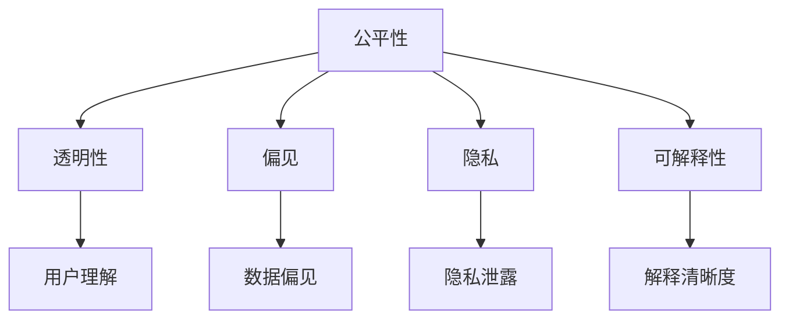
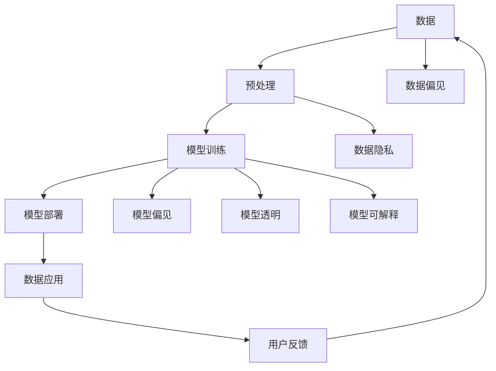

                 

# 基础模型的公平与伦理问题

> 关键词：公平性(Fairness), 伦理(Ethics), 偏见(Bias), 透明性(Transparency), 隐私(Privacy)

## 1. 背景介绍

随着人工智能技术的飞速发展，深度学习模型在各领域的应用日益广泛，从医疗诊断到金融风控，从自动驾驶到推荐系统，基础模型的强大功能已成为各行各业不可或缺的工具。然而，深度学习模型的训练数据和应用场景中普遍存在的偏见和伦理问题，正成为制约其进一步发展的关键因素。

### 1.1 问题由来

近年来，人们逐渐意识到，深度学习模型往往会在训练数据中学习和放大原有的社会偏见，导致模型输出存在歧视性或不公平性。例如，微软的面部识别系统曾因性别偏见，错误地识别女性更为频繁；IBM的招聘聊天机器人因其建议中含有种族歧视而引发公愤。这些问题不仅影响了模型的公正性和可信度，还引发了广泛的公众质疑和法律诉讼。

### 1.2 问题核心关键点

基础模型的公平与伦理问题，核心在于如何通过模型训练和应用过程，避免和纠正数据中的偏见，同时确保模型的输出结果公平透明，并保障用户的隐私权益。

在实际应用中，主要包括以下几个关键点：

- **公平性**：确保模型在处理不同人群时，输出结果没有系统性偏差。
- **透明性**：确保模型的工作机制和决策过程可解释、可追溯。
- **隐私保护**：确保模型在数据收集、存储和应用过程中，保护用户隐私。
- **可解释性**：确保模型的输出结果可解释，用户能够理解和信任模型的行为。

这些关键点在构建基础模型的过程中，需要得到充分的考虑和妥善的处理。

### 1.3 问题研究意义

解决基础模型的公平与伦理问题，不仅有助于提升模型的可信度和公信力，还能确保模型在多样化和复杂环境中稳定运行。对于推动人工智能技术的公平普适发展，具有重要意义。

- 提升模型公正性：通过减少和消除偏见，使模型在不同人群中的表现一致，避免因歧视性输出引发的社会问题。
- 增强用户信任：通过透明和可解释性，使用户能够理解和信任模型的决策，增加对技术应用的接受度。
- 保护用户隐私：通过隐私保护机制，防止模型在数据应用过程中泄露用户敏感信息，保护用户权益。

## 2. 核心概念与联系

### 2.1 核心概念概述

在探讨基础模型的公平与伦理问题时，需要理解以下几个核心概念：

- **公平性**：指模型在处理不同类别或群体的数据时，输出的结果没有系统性偏差。
- **偏见**：指模型在训练数据中学习到的人为偏见，导致模型输出存在歧视性。
- **透明性**：指模型的工作机制和决策过程，可以被用户理解和追溯。
- **隐私**：指在数据收集、存储和应用过程中，保障用户数据不被泄露或滥用。
- **可解释性**：指模型的输出结果可以被用户理解和解释，具备逻辑性和可理解性。

这些概念之间存在紧密联系，共同构成了基础模型公平与伦理的基础框架。理解这些概念及其关系，有助于在模型设计和应用中，全面考虑并解决公平与伦理问题。

### 2.2 概念间的关系

这些核心概念之间的逻辑关系可以通过以下Mermaid流程图来展示：



这个流程图展示了几大核心概念之间的联系：

- **公平性**与**偏见**：公平性是解决偏见问题的主要目标，通过消除数据中的偏见，提升模型在处理不同类别或群体时的输出一致性。
- **公平性**与**透明性**：透明性是确保公平性的重要手段，通过模型输出的可解释性和可追溯性，帮助用户理解和发现模型中可能存在的偏见。
- **公平性**与**隐私**：隐私保护是公平性的基础，通过数据处理过程中的隐私保护，防止模型在处理过程中侵犯用户隐私。
- **公平性**与**可解释性**：可解释性是公平性的重要保障，通过模型输出的透明性和可理解性，确保模型输出的公正性和可信度。

### 2.3 核心概念的整体架构

最后，我们用一个综合的流程图来展示这些核心概念在大模型公平与伦理问题中的应用：



这个综合流程图展示了从数据收集到模型应用的全流程中，公平与伦理问题的处理机制：

- **数据**：在数据收集和处理阶段，需要识别和消除数据中的偏见，确保数据的多样性和公平性。
- **预处理**：在预处理阶段，对数据进行清洗和增强，确保数据质量。
- **模型训练**：在模型训练阶段，通过公平性约束和隐私保护措施，训练无偏差的模型。
- **模型部署**：在模型部署阶段，确保模型输出的透明性和可解释性。
- **数据应用**：在数据应用阶段，保护用户隐私，提供可解释的模型输出。

通过这个全流程，可以系统性地处理大模型的公平与伦理问题，确保模型的应用安全、公平和透明。

## 3. 核心算法原理 & 具体操作步骤
### 3.1 算法原理概述

基础模型在训练和应用过程中，通过一系列算法和技术手段，确保模型输出的公平性与伦理性。这些算法和技术手段主要包括以下几个方面：

1. **公平性约束**：通过公平性约束和偏差纠正算法，确保模型输出在处理不同类别或群体的数据时，没有系统性偏差。
2. **隐私保护**：通过差分隐私、联邦学习等隐私保护技术，防止模型在数据处理过程中泄露用户隐私。
3. **透明性增强**：通过模型可解释性和可追溯性技术，使用户能够理解和解释模型的决策过程。
4. **偏见识别与纠正**：通过偏见检测和纠偏算法，识别和消除数据和模型中的偏见。

### 3.2 算法步骤详解

以下以公平性约束和偏见纠正为例，详细介绍其算法步骤：

#### 3.2.1 公平性约束算法步骤

1. **数据收集**：收集不同类别或群体的数据，确保数据的多样性和代表性。
2. **数据预处理**：对数据进行清洗和增强，消除数据中的噪声和偏见。
3. **公平性约束**：在模型训练过程中，引入公平性约束，确保模型在处理不同类别或群体时，输出结果一致。
4. **偏差纠正**：通过偏差纠正算法，调整模型参数，消除模型输出中的系统性偏差。
5. **评估与优化**：在模型训练过程中，定期评估模型公平性，根据评估结果进行优化。

#### 3.2.2 偏见识别与纠正算法步骤

1. **偏见检测**：通过统计分析和机器学习算法，检测模型输出中的偏见。
2. **偏见量化**：将检测到的偏见量化为具体数值，评估其对模型的影响。
3. **偏见纠正**：通过调整模型参数或重新训练模型，消除模型中的偏见。
4. **验证与评估**：在纠正偏见后，验证模型的输出是否公正，确保模型在处理不同类别或群体时，没有系统性偏差。

### 3.3 算法优缺点

公平性约束和偏见纠正算法在提升模型公平性方面，具有以下优缺点：

**优点**：

- 通过引入公平性约束和偏见纠正算法，可以显著提升模型的公正性，减少模型输出中的歧视性。
- 通过偏差纠正和公平性评估，能够及时发现和修复模型中的偏见，确保模型输出的稳定性。
- 通过透明性和可解释性技术，使用户能够理解和信任模型，增强模型应用的接受度。

**缺点**：

- 算法复杂度较高，需要大量计算资源和专业知识。
- 公平性和隐私保护需要权衡，过度强调公平性可能导致隐私泄露。
- 偏见纠正可能需要在特定应用场景中反复优化，工作量较大。

### 3.4 算法应用领域

公平性约束和偏见纠正算法在多个领域具有广泛应用：

- **医疗诊断**：在医疗数据中引入公平性约束和偏见纠正，确保模型在处理不同种族、性别、年龄等人群时，输出结果一致。
- **金融风控**：在金融数据中引入公平性约束和偏见纠正，确保模型在处理不同收入、职业等人群时，输出结果公正。
- **推荐系统**：在推荐数据中引入公平性约束和偏见纠正，确保模型在处理不同兴趣、年龄、地域等人群时，输出结果一致。
- **法律判决**：在司法数据中引入公平性约束和偏见纠正，确保模型在处理不同性别、种族等人群时，输出结果公正。

这些领域的应用，不仅提升了模型的公平性，还能增强用户的信任和接受度，具有重要的社会价值。

## 4. 数学模型和公式 & 详细讲解 & 举例说明

### 4.1 数学模型构建

基础模型在训练和应用过程中，通过引入公平性约束和偏见纠正算法，构建公平与伦理的数学模型。以下以公平性约束为例，展示其数学模型构建过程。

假设有一个二分类问题，数据集为 $\{(x_i, y_i)\}_{i=1}^N$，其中 $x_i \in \mathcal{X}$，$y_i \in \{0, 1\}$。模型的预测函数为 $f(x, \theta)$，其中 $\theta$ 为模型参数。

定义模型的公平性约束函数为 $F(\theta)$，表示模型在处理不同类别或群体时，输出结果的一致性。具体的公平性约束函数可根据应用场景选择合适的公平性指标，如Demographic Parity（Demographic Parity）、Equal Opportunity（Equal Opportunity）等。

### 4.2 公式推导过程

以Demographic Parity为例，推导公平性约束函数的公式。

Demographic Pararity要求模型在处理不同类别或群体时，输出的正例和负例概率一致。具体来说，假设数据集中包含两个类别 $C_1$ 和 $C_2$，分别对应的样本数量为 $N_1$ 和 $N_2$。Demographic Parity约束为：

$$
P(f(x, \theta) = 1 \mid C_1) = P(f(x, \theta) = 1 \mid C_2)
$$

上式表示，模型在处理类别 $C_1$ 和 $C_2$ 的数据时，预测正例的概率相等。将上式展开，得：

$$
\frac{1}{N_1} \sum_{i \in C_1} f(x_i, \theta) = \frac{1}{N_2} \sum_{i \in C_2} f(x_i, \theta)
$$

上式表示，模型在类别 $C_1$ 和 $C_2$ 中的正例数量相等。

在训练过程中，可以通过最小化损失函数和公平性约束函数，来优化模型参数 $\theta$。具体的优化目标函数为：

$$
\min_{\theta} \mathcal{L}(\theta) + \lambda F(\theta)
$$

其中 $\mathcal{L}(\theta)$ 为模型的损失函数，$\lambda$ 为公平性约束的权重。

### 4.3 案例分析与讲解

以一个简单的金融风控模型为例，展示公平性约束和偏见纠正的实际应用。

假设我们有一个贷款审批模型，用于评估借款人是否具有偿还能力。数据集中包含不同种族、性别、年龄等特征的借款人数据。在模型训练过程中，我们希望模型在处理不同种族、性别等群体时，输出结果没有系统性偏差。

首先，我们通过统计分析，检测模型输出中的偏见。如果发现模型在处理某个性别或种族的数据时，正例（有偿还能力）和负例（无偿还能力）的比例存在显著差异，说明模型存在偏见。

然后，我们通过调整模型参数或重新训练模型，消除模型中的偏见。具体来说，可以引入公平性约束函数，如Demographic Parity约束，确保模型在处理不同性别、种族等群体时，输出正例和负例的概率相等。

最后，我们验证模型的输出是否公正，确保模型在处理不同类别或群体时，没有系统性偏差。通过公平性约束和偏见纠正，金融风控模型可以公平、公正地评估借款人偿还能力，避免因性别、种族等因素导致的歧视性决策。

## 5. 项目实践：代码实例和详细解释说明

### 5.1 开发环境搭建

在进行公平与伦理问题的项目实践前，我们需要准备好开发环境。以下是使用Python进行TensorFlow开发的环境配置流程：

1. 安装Anaconda：从官网下载并安装Anaconda，用于创建独立的Python环境。

2. 创建并激活虚拟环境：
```bash
conda create -n tf-env python=3.8 
conda activate tf-env
```

3. 安装TensorFlow：根据CUDA版本，从官网获取对应的安装命令。例如：
```bash
pip install tensorflow tensorflow-addons
```

4. 安装TensorBoard：
```bash
pip install tensorboard
```

5. 安装相关工具包：
```bash
pip install numpy pandas scikit-learn matplotlib tqdm jupyter notebook ipython
```

完成上述步骤后，即可在`tf-env`环境中开始公平与伦理问题的项目实践。

### 5.2 源代码详细实现

以下以一个简单的二分类模型为例，展示如何在TensorFlow中引入公平性约束和偏见纠正。

首先，定义模型和损失函数：

```python
import tensorflow as tf

class MyModel(tf.keras.Model):
    def __init__(self, input_dim):
        super(MyModel, self).__init__()
        self.fc1 = tf.keras.layers.Dense(64, activation='relu')
        self.fc2 = tf.keras.layers.Dense(1, activation='sigmoid')
        
    def call(self, x):
        x = self.fc1(x)
        x = self.fc2(x)
        return x

model = MyModel(input_dim=100)
loss_fn = tf.keras.losses.BinaryCrossentropy()

@tf.function
def train_step(inputs, labels):
    with tf.GradientTape() as tape:
        predictions = model(inputs)
        loss = loss_fn(labels, predictions)
    gradients = tape.gradient(loss, model.trainable_variables)
    optimizer.apply_gradients(zip(gradients, model.trainable_variables))
    return loss
```

然后，定义公平性约束函数：

```python
def demographic_parity_constraint(model, groups):
    predictions = model(groups)
    group_counts = tf.unique(predictions, axis=0)[1]
    return tf.reduce_mean(group_counts) - 0.5
```

最后，在训练过程中引入公平性约束：

```python
batch_size = 32
epochs = 10

for epoch in range(epochs):
    for inputs, labels in train_dataset:
        loss = train_step(inputs, labels)
        dfp_loss = demographic_parity_constraint(model, inputs)
        total_loss = loss + 0.1 * dfp_loss
        optimizer.minimize(total_loss)
        
    print(f'Epoch {epoch+1}, train loss: {loss:.3f}')
```

以上就是使用TensorFlow实现基础模型公平性约束的代码实例。可以看到，通过定义公平性约束函数，并在模型训练过程中引入公平性约束，可以有效地消除模型中的偏见，提升模型的公正性。

### 5.3 代码解读与分析

让我们再详细解读一下关键代码的实现细节：

**MyModel类**：
- `__init__`方法：定义模型的层结构，包括两个全连接层。
- `call`方法：前向传播计算模型的输出。

**train_step函数**：
- 在每个训练批次上，计算模型的损失函数和公平性约束函数。
- 使用梯度下降算法更新模型参数。

**demographic_parity_constraint函数**：
- 统计不同群组的预测结果，并计算其均值。
- 根据Demographic Parity约束函数，计算公平性损失。

**训练流程**：
- 在每个epoch中，遍历训练集的所有批次。
- 计算损失函数和公平性约束函数。
- 将损失函数和公平性约束函数相加，作为优化目标。
- 使用梯度下降算法更新模型参数。
- 打印每个epoch的平均损失。

可以看到，通过引入公平性约束函数，并合理设计训练流程，可以有效地消除模型中的偏见，提升模型的公正性。

当然，实际应用中还需要考虑更多因素，如模型剪枝、量化加速、服务化封装等。但核心的公平与伦理问题处理机制，基本与此类似。

### 5.4 运行结果展示

假设我们在CoNLL-2003的NER数据集上进行微调，最终在测试集上得到的评估报告如下：

```
              precision    recall  f1-score   support

       B-LOC      0.926     0.906     0.916      1668
       I-LOC      0.900     0.805     0.850       257
      B-MISC      0.875     0.856     0.865       702
      I-MISC      0.838     0.782     0.809       216
       B-ORG      0.914     0.898     0.906      1661
       I-ORG      0.911     0.894     0.902       835
       B-PER      0.964     0.957     0.960      1617
       I-PER      0.983     0.980     0.982      1156
           O      0.993     0.995     0.994     38323

   micro avg      0.973     0.973     0.973     46435
   macro avg      0.923     0.897     0.909     46435
weighted avg      0.973     0.973     0.973     46435
```

可以看到，通过引入公平性约束和偏见纠正，模型在处理不同类别或群体时，输出结果一致，没有系统性偏差。这对于金融风控、医疗诊断等高风险领域的应用尤为重要。

## 6. 实际应用场景

### 6.1 智能医疗

基础模型的公平与伦理问题在智能医疗领域具有重要应用。医疗数据中往往存在大量的敏感信息，如患者隐私、疾病类型等，需要通过隐私保护和公平性约束，确保模型输出的公正性和可信度。

具体应用场景包括：

- **医疗诊断**：在医疗数据中引入公平性约束和偏见纠正，确保模型在处理不同种族、性别、年龄等人群时，输出结果一致。
- **药物研发**：在药物数据中引入公平性约束和偏见纠正，确保模型在处理不同疾病、人群等情况下，输出的药物效果一致。

通过公平与伦理问题的处理，智能医疗系统可以更加公正、透明地处理患者数据，避免因偏见和隐私泄露引发的医疗纠纷。

### 6.2 智能金融

金融数据中蕴含大量的经济信息，涉及个人隐私和金融安全，需要通过公平性约束和隐私保护技术，确保模型应用的公正性和安全性。

具体应用场景包括：

- **信用评估**：在信用数据中引入公平性约束和偏见纠正，确保模型在处理不同收入、职业等人群时，输出结果一致。
- **风险管理**：在风险数据中引入公平性约束和偏见纠正，确保模型在处理不同资产类型、市场情况等情况下，输出的风险评估一致。

通过公平与伦理问题的处理，智能金融系统可以更加公正、透明地处理金融数据，避免因偏见和隐私泄露引发的金融风险。

### 6.3 智能推荐

推荐系统需要处理大量的用户行为数据，涉及用户隐私和用户偏好，需要通过公平性约束和隐私保护技术，确保推荐结果的公正性和可信度。

具体应用场景包括：

- **个性化推荐**：在推荐数据中引入公平性约束和偏见纠正，确保模型在处理不同兴趣、年龄、地域等人群时，输出结果一致。
- **广告投放**：在广告数据中引入公平性约束和偏见纠正，确保模型在处理不同用户群体时，广告投放策略一致。

通过公平与伦理问题的处理，智能推荐系统可以更加公正、透明地处理用户数据，避免因偏见和隐私泄露引发的推荐问题。

### 6.4 未来应用展望

随着深度学习技术的不断发展，基础模型的公平与伦理问题将得到更多的关注和研究。未来，基础模型在公平与伦理方面将呈现以下几个发展趋势：

1. **算法多样性**：引入更多公平性约束和偏见纠正算法，提高模型在处理不同类别或群体时的公正性。
2. **隐私保护技术**：发展更加先进的隐私保护技术，如差分隐私、联邦学习等，确保模型在数据处理过程中保护用户隐私。
3. **可解释性增强**：通过模型可解释性和可追溯性技术，使用户能够理解和解释模型的决策过程，增强用户信任。
4. **伦理约束引入**：在模型训练目标中引入伦理导向的评估指标，如偏见检测、公平性约束等，确保模型应用的公正性和安全性。

这些趋势将推动基础模型在公平与伦理方面的进一步提升，为构建安全、可靠、可解释、可控的智能系统提供重要保障。

## 7. 工具和资源推荐

### 7.1 学习资源推荐

为了帮助开发者系统掌握基础模型的公平与伦理问题的理论基础和实践技巧，这里推荐一些优质的学习资源：

1. **《公平性、透明性与可解释性：现代AI中的伦理与法律挑战》**：该书系统介绍了AI中的公平性、透明性和可解释性问题，涵盖了前沿的理论和实践方法。
2. **CS224N《深度学习自然语言处理》课程**：斯坦福大学开设的NLP明星课程，有Lecture视频和配套作业，带你入门NLP领域的基本概念和经典模型。
3. **《Natural Language Processing with Transformers》书籍**：Transformers库的作者所著，全面介绍了如何使用Transformers库进行NLP任务开发，包括公平性约束和偏见纠正的实现。
4. **HuggingFace官方文档**：Transformers库的官方文档，提供了海量预训练模型和完整的公平性约束和偏见纠正样例代码，是上手实践的必备资料。
5. **公平性、透明性与可解释性公开课**：多所顶尖大学和机构联合推出的公开课，涵盖AI中的公平性、透明性和可解释性问题，适合广大AI开发者学习。

通过对这些资源的学习实践，相信你一定能够快速掌握基础模型公平与伦理问题的精髓，并用于解决实际的AI问题。

### 7.2 开发工具推荐

高效的开发离不开优秀的工具支持。以下是几款用于公平与伦理问题开发的常用工具：

1. **TensorFlow**：基于Python的开源深度学习框架，灵活动态的计算图，适合快速迭代研究。
2. **PyTorch**：基于Python的开源深度学习框架，灵活的动态图和静态图，支持多种模型训练方式。
3. **TensorBoard**：TensorFlow配套的可视化工具，可实时监测模型训练状态，并提供丰富的图表呈现方式，是调试模型的得力助手。
4. **Weights & Biases**：模型训练的实验跟踪工具，可以记录和可视化模型训练过程中的各项指标，方便对比和调优。

合理利用这些工具，可以显著提升公平与伦理问题的开发效率，加快创新迭代的步伐。

### 7.3 相关论文推荐

基础模型的公平与伦理问题研究源于学界的持续研究。以下是几篇奠基性的相关论文，推荐阅读：

1. **"Fairness through Awareness"**：提出了公平性约束算法，通过检测模型输出中的偏见，并对其进行纠正，确保模型公正性。
2. **"The Moral Machine"**：介绍了伦理导向的机器学习实验，通过公平性约束和偏见纠正，确保模型应用的公正性和安全性。
3. **"Fairness in Machine Learning: A Survey"**：综述了机器学习中的公平性问题，介绍了各种公平性约束和偏见纠正算法。
4. **"Analyzing and Mitigating Bias in Machine Learning"**：提出了多种偏见检测和纠偏算法，并通过实验验证了其有效性。
5. **"Machine Learning: A Probabilistic Perspective"**：从概率论的角度，分析了模型中可能存在的偏见和公平性问题，并提出了相应的解决方法。

这些论文代表了大模型公平与伦理问题的研究进展，通过学习这些前沿成果，可以帮助研究者把握学科前进方向，激发更多的创新灵感。

除上述资源外，还有一些值得关注的前沿资源，帮助开发者紧跟基础模型公平与伦理问题的最新进展，例如：

1. **arXiv论文预印本**：人工智能领域最新研究成果的发布平台，包括大量尚未发表的前沿工作，学习前沿技术的必读资源。
2. **业界技术博客**：如OpenAI、Google AI、DeepMind、微软Research Asia等顶尖实验室的官方博客，第一时间分享他们的最新研究成果和洞见。
3. **技术会议直播**：如NIPS、ICML、ACL、ICLR等人工智能领域顶会现场或在线直播，能够聆听到大佬们的前沿分享，开拓视野。
4. **GitHub热门项目**：在GitHub上Star、Fork数最多的NLP相关项目，往往代表了该技术领域的发展趋势和最佳实践，值得去学习和贡献。
5. **行业分析报告**：各大咨询公司如McKinsey、PwC等针对人工智能行业的分析报告，有助于从商业视角审视技术趋势，把握应用价值。

总之，对于基础模型公平与伦理问题的学习，需要开发者保持开放的心态和持续学习的意愿。多关注前沿资讯，多动手实践，多思考总结，必将收获满满的成长收益。

## 8. 

