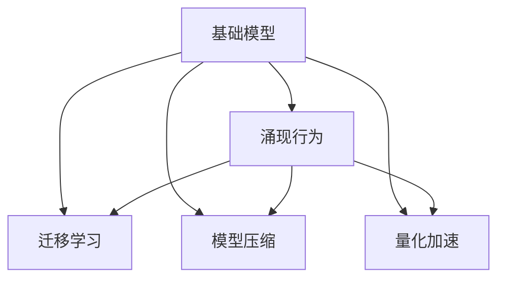
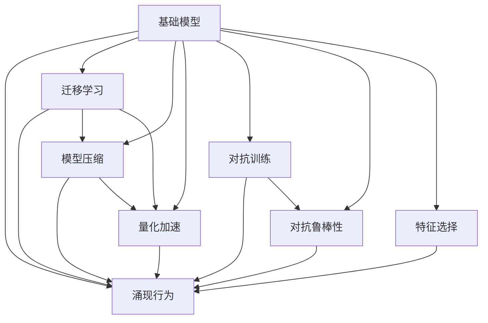
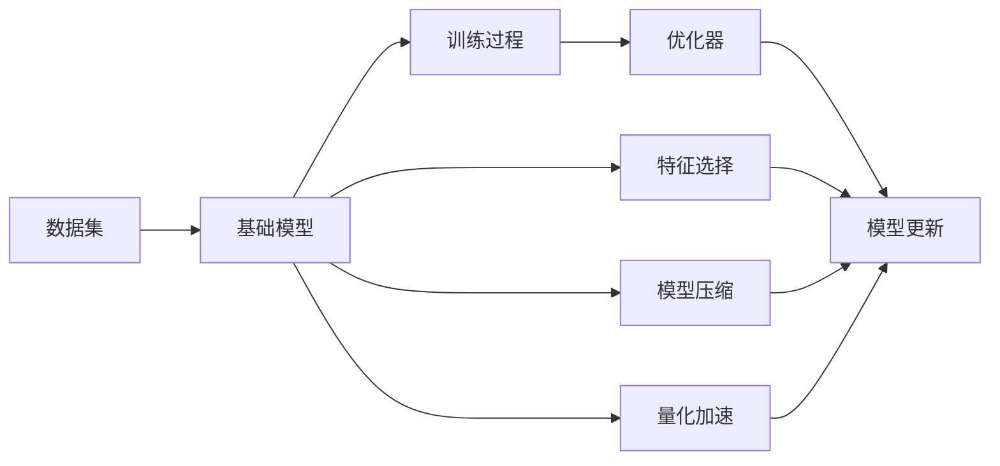
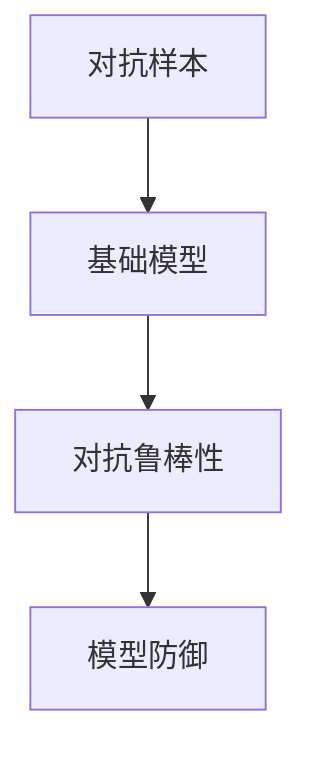
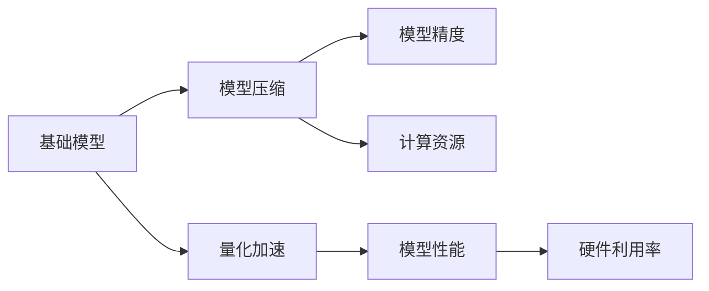
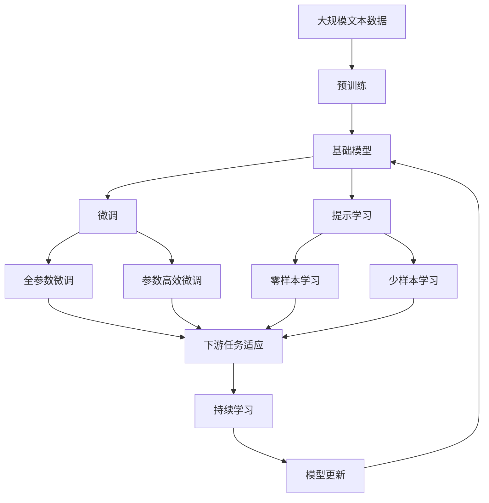

                 

# 基础模型的涌现行为与部署

> 关键词：基础模型,涌现行为,部署,迁移学习,模型压缩,量化加速

## 1. 背景介绍

### 1.1 问题由来

近年来，深度学习技术取得了飞速进展，其中深度神经网络（DNNs），特别是基础模型（如ResNet、Inception等），在图像识别、语音识别、自然语言处理（NLP）等多个领域取得了显著成果。然而，随着模型规模的不断增大，训练和推理的成本也在急剧增加，部署效率和硬件资源消耗成为制约因素。

为解决这些问题，研究者提出了多种优化方案，包括迁移学习、模型压缩和量化加速等技术。这些技术不仅显著提升了模型的效率，还使得基础模型在各垂直领域的应用更加广泛。本博客将从基础模型涌现行为的本质出发，详细探讨这些技术的应用及其前景。

### 1.2 问题核心关键点

- **基础模型**：指深度神经网络中具有较高抽象层次和泛化能力的核心组件，如卷积核、Transformer等。
- **涌现行为**：指在深度神经网络中，基础模型的内部表示逐渐自组织形成的能力，如特征学习、结构归纳等。
- **迁移学习**：指通过将基础模型在某一领域的预训练结果迁移到另一领域，以提升在新领域上的性能。
- **模型压缩**：指通过减少基础模型的参数、尺寸和计算量，以实现更高效的部署。
- **量化加速**：指将基础模型的浮点计算转化为定点计算，进一步提升推理速度和硬件利用率。

这些关键点之间的逻辑关系可以通过以下Mermaid流程图来展示：



这个流程图展示了基础模型的核心概念以及与其相关的主要技术路径。

### 1.3 问题研究意义

研究基础模型的涌现行为与部署，对于加速人工智能技术的落地应用，提升模型效率和硬件利用率具有重要意义：

1. **加速模型训练和推理**：通过优化基础模型，减少训练和推理成本，显著提升模型的响应速度。
2. **降低硬件成本**：压缩基础模型的尺寸和参数，减少硬件资源的需求，降低部署成本。
3. **拓展应用场景**：通过迁移学习和模型压缩技术，使基础模型在各垂直领域得到广泛应用，促进技术产业化和商业化。
4. **提升系统性能**：量化加速技术使得基础模型能够在资源有限的环境中高效运行，提升系统整体性能。

## 2. 核心概念与联系

### 2.1 核心概念概述

为更好地理解基础模型及其涌现行为与部署方法，本节将介绍几个密切相关的核心概念：

- **基础模型**：深度神经网络中具有较高抽象层次和泛化能力的核心组件，如卷积核、Transformer等。
- **涌现行为**：指在深度神经网络中，基础模型的内部表示逐渐自组织形成的能力，如特征学习、结构归纳等。
- **迁移学习**：指通过将基础模型在某一领域的预训练结果迁移到另一领域，以提升在新领域上的性能。
- **模型压缩**：指通过减少基础模型的参数、尺寸和计算量，以实现更高效的部署。
- **量化加速**：指将基础模型的浮点计算转化为定点计算，进一步提升推理速度和硬件利用率。
- **对抗训练**：指在基础模型训练过程中引入对抗样本，以提高模型的鲁棒性和泛化能力。
- **对抗鲁棒性**：指模型在面对对抗性输入时，仍能保持稳定的输出能力。
- **特征选择**：指通过分析基础模型的表现，选择最优的特征子集，以提升模型的性能。

这些核心概念之间的逻辑关系可以通过以下Mermaid流程图来展示：



这个流程图展示了基础模型的核心概念以及与其相关的主要技术路径。

### 2.2 概念间的关系

这些核心概念之间存在着紧密的联系，形成了基础模型涌现行为与部署的完整生态系统。下面我通过几个Mermaid流程图来展示这些概念之间的关系。

#### 2.2.1 基础模型训练与优化



这个流程图展示了基础模型的训练和优化过程。数据集输入基础模型，通过训练和优化器更新模型参数，同时通过特征选择、模型压缩和量化加速技术提升模型效率。

#### 2.2.2 迁移学习与应用


这个流程图展示了迁移学习的基本原理。源领域数据用于基础模型的预训练，然后通过迁移学习将模型应用到目标领域数据上，最后在新领域进行具体应用。

#### 2.2.3 对抗鲁棒性与保护



这个流程图展示了对抗训练和对抗鲁棒性的基本流程。对抗样本输入基础模型，通过对抗训练提升模型的鲁棒性，最后通过模型防御技术保护模型免受对抗攻击。

#### 2.2.4 模型压缩与量化



这个流程图展示了模型压缩和量化加速的基本流程。基础模型经过模型压缩和量化加速，以提升计算资源利用率和模型性能。

### 2.3 核心概念的整体架构

最后，我们用一个综合的流程图来展示这些核心概念在大语言模型微调过程中的整体架构：



这个综合流程图展示了从预训练到微调，再到持续学习的完整过程。基础模型首先在大规模文本数据上进行预训练，然后通过微调（包括全参数微调和参数高效微调）或提示学习（包括零样本和少样本学习）来适应下游任务。最后，通过持续学习技术，模型可以不断学习新知识，同时避免遗忘旧知识。

## 3. 核心算法原理 & 具体操作步骤

### 3.1 算法原理概述

基础模型的涌现行为是指在深度神经网络中，模型通过反向传播和正向传播自适应调整其内部表示，逐渐形成有用的特征表示和结构归纳能力的过程。这种涌现行为使得基础模型能够从数据中学习到更高层次的抽象表示，提升其在各种任务上的性能。

迁移学习是一种通过将基础模型在某一领域的预训练结果迁移到另一领域，以提升在新领域上的性能的技术。这种技术可以显著减少新领域数据集的需求，同时提升模型的泛化能力。

模型压缩和量化加速技术通过减少基础模型的参数、尺寸和计算量，以实现更高效的部署。这些技术可以显著降低模型训练和推理的计算成本，提升模型的实时响应能力。

对抗训练和对抗鲁棒性技术通过在基础模型训练过程中引入对抗样本，提高模型的鲁棒性和泛化能力。对抗样本的引入使得模型能够在面对各种形式的干扰时，仍然保持稳定的输出能力。

特征选择技术通过分析基础模型的表现，选择最优的特征子集，以提升模型的性能。这种技术可以显著减少模型的计算量和存储空间，同时提升模型的泛化能力和鲁棒性。

### 3.2 算法步骤详解

#### 3.2.1 基础模型的涌现行为

1. **数据准备**：收集大量有标签或无标签的数据集，准备用于基础模型的训练。
2. **模型初始化**：选择合适的基础模型结构，并进行随机初始化。
3. **训练过程**：通过反向传播算法，使用梯度下降等优化算法更新模型参数。
4. **特征学习**：在训练过程中，基础模型逐渐学习到数据的特征表示，形成内部表示的涌现行为。
5. **结构归纳**：基础模型能够自适应地调整其内部结构，归纳出更高级别的抽象表示。

#### 3.2.2 迁移学习

1. **数据准备**：收集源领域的标注数据集，准备用于基础模型的预训练。
2. **模型初始化**：选择合适的基础模型结构，并进行随机初始化。
3. **预训练**：在源领域数据集上训练基础模型，使其学习到领域特定的特征表示。
4. **迁移学习**：将预训练后的基础模型应用于目标领域数据集，通过微调或提示学习，适应新领域的任务。
5. **性能评估**：在目标领域数据集上评估迁移学习后的基础模型性能，调整参数以提升模型效果。

#### 3.2.3 模型压缩

1. **量化加速**：将基础模型的浮点计算转换为定点计算，以提升推理速度和硬件利用率。
2. **参数剪枝**：通过剪枝技术，减少模型的参数数量，提升模型的计算效率。
3. **低秩分解**：通过矩阵的低秩分解技术，降低模型的大小和复杂度。
4. **模型集成**：将多个基础模型进行集成，提升整体的性能和鲁棒性。

#### 3.2.4 量化加速

1. **模型量化**：将基础模型的浮点计算转换为定点计算，以提升推理速度和硬件利用率。
2. **量化策略**：选择合适的量化策略，如权重剪枝、激活函数量化等。
3. **量化训练**：在量化后的基础模型上进行训练，调整模型参数以优化量化效果。
4. **量化推理**：使用量化后的基础模型进行推理，评估推理速度和精度。

#### 3.2.5 对抗训练

1. **生成对抗样本**：通过生成对抗性样本，对基础模型进行攻击测试。
2. **训练对抗样本**：将对抗样本输入基础模型，进行反向传播更新模型参数。
3. **验证鲁棒性**：在新的对抗样本上评估基础模型的鲁棒性，调整参数以提升模型鲁棒性。
4. **鲁棒性评估**：使用不同来源的对抗样本，对基础模型的鲁棒性进行全面评估。

#### 3.2.6 对抗鲁棒性

1. **攻击测试**：在基础模型上应用不同类型的攻击测试，如扰动攻击、差分攻击等。
2. **鲁棒性分析**：分析基础模型在攻击测试中的表现，找出模型的脆弱点。
3. **防御策略**：根据鲁棒性分析结果，选择合适的防御策略，如梯度裁剪、数据增强等。
4. **鲁棒性优化**：通过防御策略优化基础模型，提升其鲁棒性。

#### 3.2.7 特征选择

1. **特征提取**：在基础模型上进行特征提取，分析模型的表现。
2. **特征分析**：分析特征的重要性，选择最优的特征子集。
3. **特征优化**：通过特征优化技术，提升模型在特定任务上的性能。
4. **模型评估**：在特定任务上评估模型性能，调整特征选择策略。

### 3.3 算法优缺点

基础模型涌现行为与部署技术具有以下优点：

1. **高效性**：通过模型压缩和量化加速技术，显著减少计算资源的需求，提升模型的实时响应能力。
2. **泛化性**：通过迁移学习和对抗训练技术，提升模型的泛化能力和鲁棒性，适应各种新领域和新场景。
3. **稳定性**：通过对抗鲁棒性技术，确保模型在面对对抗性攻击时仍能保持稳定的输出能力。
4. **可解释性**：通过特征选择技术，帮助理解模型的内部表示，提高模型的可解释性。

同时，这些技术也存在一定的局限性：

1. **精度损失**：量化和压缩技术可能会降低模型的精度，影响模型性能。
2. **计算成本**：对抗训练和对抗鲁棒性技术需要额外的计算资源和时间，增加训练成本。
3. **可扩展性**：部分技术（如对抗训练）可能难以扩展到大规模模型上。

尽管存在这些局限性，但就目前而言，这些技术仍是大语言模型微调的重要组成部分，在提高模型效率和性能方面具有重要价值。

### 3.4 算法应用领域

基础模型的涌现行为与部署技术在以下几个领域得到了广泛应用：

1. **计算机视觉**：基础模型在图像识别、目标检测、图像分割等任务上取得了显著成果，通过模型压缩和量化加速技术，大幅提升模型的实时响应能力。
2. **自然语言处理**：基础模型在语言理解、文本生成、语音识别等任务上表现出色，通过迁移学习和对抗训练技术，提升模型的泛化能力和鲁棒性。
3. **语音识别**：基础模型在语音识别、语音合成、情感分析等任务上应用广泛，通过模型压缩和量化加速技术，提升系统的实时响应能力和资源利用率。
4. **推荐系统**：基础模型在推荐算法、广告推荐、个性化推荐等任务上取得了显著成果，通过迁移学习和特征选择技术，提升系统的精准度和用户满意度。
5. **医疗诊断**：基础模型在医学影像分析、疾病诊断、基因序列分析等任务上表现出色，通过对抗鲁棒性技术，提升模型的可靠性和鲁棒性。

## 4. 数学模型和公式 & 详细讲解 & 举例说明

### 4.1 数学模型构建

本节将使用数学语言对基础模型的涌现行为与部署过程进行更加严格的刻画。

记基础模型为 $M_{\theta}$，其中 $\theta$ 为模型参数。假设在源领域数据集 $D_{\text{src}}$ 上进行预训练，目标领域数据集 $D_{\text{tgt}}$ 上进行微调。

定义基础模型在数据样本 $(x,y)$ 上的损失函数为 $\ell(M_{\theta}(x),y)$，则在数据集 $D$ 上的经验风险为：

$$
\mathcal{L}(\theta) = \frac{1}{N} \sum_{i=1}^N \ell(M_{\theta}(x_i),y_i)
$$

微调的优化目标是最小化经验风险，即找到最优参数：

$$
\theta^* = \mathop{\arg\min}_{\theta} \mathcal{L}(\theta)
$$

在实践中，我们通常使用基于梯度的优化算法（如SGD、Adam等）来近似求解上述最优化问题。设 $\eta$ 为学习率，$\lambda$ 为正则化系数，则参数的更新公式为：

$$
\theta \leftarrow \theta - \eta \nabla_{\theta}\mathcal{L}(\theta) - \eta\lambda\theta
$$

其中 $\nabla_{\theta}\mathcal{L}(\theta)$ 为损失函数对参数 $\theta$ 的梯度，可通过反向传播算法高效计算。

### 4.2 公式推导过程

以下我们以迁移学习为例，推导基础模型的迁移学习过程。

假设在源领域数据集 $D_{\text{src}}$ 上进行预训练，得到预训练后的基础模型 $M_{\theta_{\text{src}}}$。在目标领域数据集 $D_{\text{tgt}}$ 上进行微调，得到微调后的基础模型 $M_{\theta_{\text{tgt}}}$。

基础模型在源领域数据集上的预训练过程如下：

1. **数据准备**：收集大量有标签的源领域数据集 $D_{\text{src}}$。
2. **模型初始化**：选择基础模型结构，并进行随机初始化。
3. **预训练**：在源领域数据集 $D_{\text{src}}$ 上进行预训练，更新模型参数。
4. **特征学习**：在预训练过程中，基础模型逐渐学习到数据的特征表示，形成内部表示的涌现行为。
5. **结构归纳**：基础模型能够自适应地调整其内部结构，归纳出更高级别的抽象表示。

基础模型在目标领域数据集上的迁移学习过程如下：

1. **数据准备**：收集少量有标签的目标领域数据集 $D_{\text{tgt}}$。
2. **模型初始化**：选择基础模型结构，并进行随机初始化。
3. **微调**：在目标领域数据集 $D_{\text{tgt}}$ 上进行微调，更新模型参数。
4. **特征优化**：在微调过程中，基础模型逐渐学习到目标领域数据集的特征表示，优化模型性能。
5. **性能评估**：在目标领域数据集上评估微调后的基础模型性能，调整参数以提升模型效果。

### 4.3 案例分析与讲解

以ResNet在图像分类任务中的应用为例，分析基础模型的涌现行为与部署技术。

1. **数据准备**：收集大量图像分类数据集，如CIFAR-10、ImageNet等。
2. **模型初始化**：选择ResNet模型结构，并进行随机初始化。
3. **预训练**：在ImageNet数据集上进行预训练，更新模型参数。
4. **特征学习**：在预训练过程中，ResNet逐渐学习到图像的特征表示，形成内部表示的涌现行为。
5. **结构归纳**：ResNet能够自适应地调整其内部结构，归纳出更高级别的抽象表示。

在ImageNet数据集上进行迁移学习：

1. **数据准备**：收集少量目标领域数据集，如CIFAR-10。
2. **模型初始化**：选择ResNet模型结构，并进行随机初始化。
3. **微调**：在CIFAR-10数据集上进行微调，更新模型参数。
4. **特征优化**：在微调过程中，ResNet逐渐学习到CIFAR-10数据集的特征表示，优化模型性能。
5. **性能评估**：在CIFAR-10数据集上评估微调后的ResNet性能，调整参数以提升模型效果。

在ResNet上进行模型压缩：

1. **量化加速**：将ResNet的浮点计算转换为定点计算，以提升推理速度和硬件利用率。
2. **参数剪枝**：通过剪枝技术，减少模型的参数数量，提升模型的计算效率。
3. **低秩分解**：通过矩阵的低秩分解技术，降低模型的大小和复杂度。
4. **模型集成**：将多个ResNet进行集成，提升整体的性能和鲁棒性。

在ResNet上进行对抗鲁棒性提升：

1. **攻击测试**：在ResNet上应用不同类型的攻击测试，如扰动攻击、差分攻击等。
2. **鲁棒性分析**：分析ResNet在攻击测试中的表现，找出模型的脆弱点。
3. **防御策略**：根据鲁棒性分析结果，选择合适的防御策略，如梯度裁剪、数据增强等。
4. **鲁棒性优化**：通过防御策略优化ResNet，提升其鲁棒性。

## 5. 项目实践：代码实例和详细解释说明

### 5.1 开发环境搭建

在进行基础模型涌现行为与部署实践前，我们需要准备好开发环境。以下是使用Python进行PyTorch开发的环境配置流程：

1. 安装Anaconda：从官网下载并安装Anaconda，用于创建独立的Python环境。

2. 创建并激活虚拟环境：
```bash
conda create -n pytorch-env python=3.8 
conda activate pytorch-env
```

3. 安装PyTorch：根据CUDA版本，从官网获取对应的安装命令。例如：
```bash
conda install pytorch torchvision torchaudio cudatoolkit=11.1 -c pytorch -c conda-forge
```

4. 安装各类工具包：
```bash
pip install numpy pandas scikit-learn matplotlib tqdm jupyter notebook ipython
```

完成上述步骤后，即可在`pytorch-env`环境中开始实践。

### 5.2 源代码详细实现

这里我们以ResNet在图像分类任务中的应用为例，给出使用PyTorch对ResNet进行微调的PyTorch代码实现。

首先，定义ResNet模型：

```python
import torch
import torch.nn as nn
import torch.nn.functional as F

class ResNet(nn.Module):
    def __init__(self, num_classes=1000):
        super(ResNet, self).__init__()
        self.conv1 = nn.Conv2d(3, 64, kernel_size=7, stride=2, padding=3, bias=False)
        self.bn1 = nn.BatchNorm2d(64)
        self.relu = nn.ReLU(inplace=True)
        self.maxpool = nn.MaxPool2d(kernel_size=3, stride=2, padding=1)
        self.layer1 = self._make_layer(64, blocks=3)
        self.layer2 = self._make_layer(128, blocks=4)
        self.layer3 = self._make_layer(256, blocks=6)
        self.layer4 = self._make_layer(512, blocks=3)
        self.avgpool = nn.AvgPool2d(7, stride=1)
        self.fc = nn.Linear(512 * block_num * 1, num_classes)

    def _make_layer(self, planes, blocks, stride=1):
        downsample = None
        if stride != 1 or self.inplanes != planes * block_num:
            downsample = nn.Sequential(
                nn.Conv2d(self.inplanes, planes * block_num, kernel_size=1, stride=stride, bias=False),
                nn.BatchNorm2d(planes * block_num),
            )

        layers = []
        layers.append(nn.Conv2d(self.inplanes, planes, kernel_size=3, stride=stride, padding=1, bias=False))
        layers.append(nn.BatchNorm2d(planes))
        layers.append(self.relu)
        layers.append(nn.MaxPool2d(kernel_size=3, stride=stride, padding=1))

        for i in range(1, blocks):
            layers.append(self._make_block(planes, planes, stride=1))
        layers.append(self._transition(planes, planes * block_num, downsample))
        self.inplanes = planes * block_num

        return nn.Sequential(*layers)

    def _make_block(self, planes, planes, stride=1):
        downsample = None
        if stride != 1 or self.inplanes != planes * block_num:
            downsample = nn.Sequential(
                nn.Conv2d(self.inplanes, planes, kernel_size=1, stride=stride, bias=False),
                nn.BatchNorm2d(planes),
            )

        layers = []
        layers.append(nn.Conv2d(self.inplanes, planes, kernel_size=3, stride=stride, padding=1, bias=False))
        layers.append(nn.BatchNorm2d(planes))
        layers.append(self.relu)
        layers.append(nn.MaxPool2d(kernel_size=3, stride=stride, padding=1))

        for i in range(1, blocks):
            layers.append(self._make_layer(planes, planes, stride=1))
        layers.append(self._transition(planes, planes * block_num, downsample))
        self.inplanes = planes * block_num

        return nn.Sequential(*layers)

    def _transition(self, planes, planes_num, downsample):
        layers = []
        layers.append(nn.Conv2d(self.inplanes, planes_num, kernel_size=1, stride=1, bias=False))
        layers.append(nn.BatchNorm2d(planes_num))
        if downsample is not None:
            layers.append(downsample)
        layers.append(nn.MaxPool2d(kernel_size=2, stride=2))

        return nn.Sequential(*layers)

    def forward(self, x):
        x = self.conv1(x)
        x = self.bn1(x)
        x = self.relu(x)
        x = self.maxpool(x)

        x = self.layer1(x)
        x = self.layer2(x)
        x = self.layer3(x)
        x = self.layer4(x)

        x = self.avgpool(x)
        x = x.view(x.size(0), -1)
        x = self.fc(x)

        return x
```

然后，定义模型训练和评估函数：

```python
from torch.utils.data import DataLoader
from tqdm import tqdm
from sklearn.metrics import classification_report

device = torch.device('cuda') if torch.cuda.is_available() else torch.device('cpu')

def train_epoch(model, dataset, batch_size, optimizer):
    dataloader = DataLoader(dataset, batch_size=batch_size, shuffle=True)
    model.train()
    epoch_loss = 0
    for batch in tqdm(dataloader, desc='Training'):
        input = batch[0].to(device)
        target = batch[1].to(device)
        model.zero_grad()
        output = model(input)
        loss = F.cross_entropy(output, target)
        epoch_loss += loss.item()
        loss.backward()
        optimizer.step

