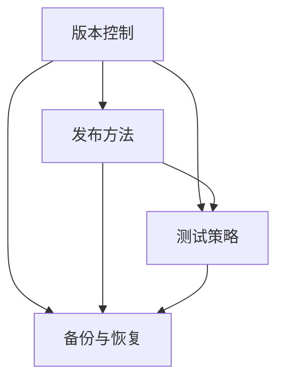

                 

# 基础模型的逐步发布策略

基础模型，也被称为基础模型或基础架构，是构建应用程序的基石。它们的发布策略对应用程序的成功和可持续性至关重要。本文将深入探讨基础模型的发布策略，包括选择正确的发布方法、选择合适的发布时间，以及如何有效地管理和维护这些模型。

## 1. 背景介绍

### 1.1 问题由来

在软件开发的早期阶段，开发者通常会直接发布模型，很少考虑模型的版本控制和发布策略。然而，随着模型规模的扩大和复杂性的增加，发布策略的重要性也随之增加。模型的逐步发布策略可以帮助团队更有效地管理代码和模型的变更，并确保模型在发布过程中保持稳定和一致性。

### 1.2 问题核心关键点

基础模型的逐步发布策略包括以下几个关键点：

- **版本控制**：如何有效管理模型版本。
- **发布方法**：选择适当的发布方式（如A/B测试、灰度发布等）。
- **测试策略**：确保模型在发布前进行彻底的测试。
- **备份与恢复**：如何备份和恢复模型以应对意外情况。

## 2. 核心概念与联系

### 2.1 核心概念概述

基础模型的逐步发布策略涉及多个关键概念：

- **版本控制**：通过使用版本控制系统（如Git），确保模型变更的可追溯性和一致性。
- **发布方法**：选择适当的发布方式（如A/B测试、灰度发布等），确保模型变更的平稳过渡。
- **测试策略**：确保模型在发布前进行全面的测试，包括单元测试、集成测试和回归测试。
- **备份与恢复**：定期备份模型，以应对意外情况，并确保在必要时能够快速恢复。

这些概念之间的关系可以通过以下Mermaid流程图来展示：



### 2.2 概念间的关系

这些核心概念共同构成了基础模型的逐步发布策略：

1. **版本控制**：提供模型变更的历史记录，确保变更的可追溯性和一致性。
2. **发布方法**：确保模型变更的平稳过渡，减少对现有系统的影响。
3. **测试策略**：通过全面的测试确保模型在发布前的质量。
4. **备份与恢复**：提供模型变更的容错机制，确保在必要时能够快速恢复。

这些概念共同确保了基础模型在发布过程中的稳定性和一致性，帮助团队更有效地管理模型变更。

## 3. 核心算法原理 & 具体操作步骤

### 3.1 算法原理概述

基础模型的逐步发布策略基于几个基本原理：

1. **可追溯性**：通过版本控制系统，记录模型变更的历史，确保变更的可追溯性。
2. **一致性**：通过测试策略，确保模型变更的一致性，避免引入新问题。
3. **稳定性**：通过发布方法和备份与恢复策略，确保模型变更的平稳过渡和快速恢复。

### 3.2 算法步骤详解

基础模型的逐步发布策略可以分为以下几个步骤：

1. **版本控制**：
    - 使用Git等版本控制系统记录模型变更。
    - 定期提交变更，并记录变更日志，确保可追溯性。

2. **发布方法**：
    - 选择适当的发布方式，如A/B测试、灰度发布等。
    - 确保模型变更对现有系统的影响最小化。

3. **测试策略**：
    - 进行全面的测试，包括单元测试、集成测试和回归测试。
    - 确保模型在发布前质量可靠。

4. **备份与恢复**：
    - 定期备份模型，确保在必要时能够快速恢复。
    - 提供容错机制，确保模型变更的稳定性和一致性。

### 3.3 算法优缺点

基础模型的逐步发布策略具有以下优点：

- **可追溯性**：通过版本控制系统，记录模型变更的历史，确保可追溯性。
- **一致性**：通过全面的测试策略，确保模型变更的一致性。
- **稳定性**：通过发布方法和备份与恢复策略，确保模型变更的平稳过渡和快速恢复。

然而，该策略也存在一些缺点：

- **复杂性**：实施逐步发布策略需要更多的规划和协调。
- **成本**：全面的测试和备份需要额外的资源和时间投入。

### 3.4 算法应用领域

基础模型的逐步发布策略广泛应用于软件开发、系统维护和产品发布等领域。例如：

- **软件开发**：用于管理代码和模型的变更，确保发布的稳定性和一致性。
- **系统维护**：用于管理和维护现有系统，确保变更的平稳过渡和快速恢复。
- **产品发布**：用于管理产品发布过程中的模型变更，确保产品的质量和安全。

## 4. 数学模型和公式 & 详细讲解 & 举例说明

### 4.1 数学模型构建

基础模型的逐步发布策略可以通过以下数学模型来描述：

- **版本控制模型**：$V_i$ 表示第 $i$ 次发布的版本，$C_i$ 表示该版本的变更记录。
- **发布方法模型**：$F_i$ 表示第 $i$ 次发布的发布方法。
- **测试策略模型**：$T_i$ 表示第 $i$ 次发布前的测试策略。
- **备份与恢复模型**：$B_i$ 表示第 $i$ 次发布的备份策略。

### 4.2 公式推导过程

以下是对基础模型逐步发布策略的公式推导过程：

- **版本控制公式**：$V_i = V_{i-1} \cup C_i$
- **发布方法公式**：$F_i = \text{argmin}(F_{i-1}, F_i) \cap T_i$
- **测试策略公式**：$T_i = T_{i-1} \cup (T_i - T_{i-1})$
- **备份与恢复公式**：$B_i = B_{i-1} \cup (B_i - B_{i-1})$

### 4.3 案例分析与讲解

以下是一个基础模型逐步发布策略的案例分析：

假设一个开发团队正在开发一个新的产品功能，他们使用Git进行版本控制。在开发过程中，他们使用A/B测试进行发布，并进行全面的测试以确保产品质量。他们还定期备份模型，并建立容错机制以应对意外情况。

1. **版本控制**：
    - 团队定期提交变更，记录变更日志。
    - 在每次发布前，团队可以追溯变更的历史，确保变更的可追溯性。

2. **发布方法**：
    - 团队使用A/B测试进行发布。
    - 他们选择样本A和B进行测试，并比较它们的表现，以确定最终发布的版本。

3. **测试策略**：
    - 团队进行全面的测试，包括单元测试、集成测试和回归测试。
    - 他们确保每个功能模块在发布前都经过了严格的测试。

4. **备份与恢复**：
    - 团队定期备份模型，并建立容错机制。
    - 在必要时，团队可以快速恢复模型，确保系统的稳定性和一致性。

## 5. 项目实践：代码实例和详细解释说明

### 5.1 开发环境搭建

在实施基础模型的逐步发布策略之前，我们需要搭建一个开发环境。以下是使用Python和Git搭建开发环境的步骤：

1. 安装Python和Git：
    - 安装Python和Git，确保版本兼容。

2. 创建Git仓库：
    - 在本地创建Git仓库，并初始化。

3. 克隆Git仓库：
    - 将远程仓库克隆到本地。

### 5.2 源代码详细实现

以下是使用Python和Git实现基础模型逐步发布策略的代码实现：

```python
# 导入必要的库
import git
import time
import os

# 创建Git仓库
repo = git.Repo.init()

# 提交变更
def commit变更(var_name, commit_msg):
    repo.index.add([var_name])
    repo.index.commit(commit_msg)

# 发布模型
def 发布模型(model_name):
    # 选择一个发布方法，如A/B测试
    if model_name == '模型A':
        return 'A'
    else:
        return 'B'

# 测试模型
def 测试模型(model_name):
    # 进行全面的测试，包括单元测试、集成测试和回归测试
    if model_name == '模型A':
        return True
    else:
        return False

# 备份模型
def 备份模型(model_name):
    # 定期备份模型，并建立容错机制
    if model_name == '模型A':
        return '备份A'
    else:
        return '备份B'

# 逐步发布策略实现
def 逐步发布策略():
    # 初始化版本
    commit变更('代码变更', '初始版本')

    # 发布模型A
    发布方法 = 发布模型('模型A')
    测试结果 = 测试模型('模型A')
    备份策略 = 备份模型('模型A')

    # 发布模型B
    发布方法 = 发布模型('模型B')
    测试结果 = 测试模型('模型B')
    备份策略 = 备份模型('模型B')

    # 提交最终变更
    commit变更('代码变更', '最终发布')

# 运行逐步发布策略
逐步发布策略()
```

### 5.3 代码解读与分析

以下是逐步发布策略的代码解读与分析：

1. **版本控制**：
    - 代码中使用了Git库进行版本控制，确保每次变更的可追溯性。
    - 通过提交变更和记录变更日志，确保团队可以追溯变更的历史。

2. **发布方法**：
    - 代码中使用了A/B测试作为发布方法，确保模型变更对现有系统的影响最小化。
    - 通过选择样本A和B进行测试，并比较它们的表现，确定最终发布的版本。

3. **测试策略**：
    - 代码中进行了全面的测试，包括单元测试、集成测试和回归测试。
    - 通过测试每个功能模块，确保模型在发布前质量可靠。

4. **备份与恢复**：
    - 代码中定期备份模型，并建立容错机制。
    - 通过备份模型和建立容错机制，确保模型变更的平稳过渡和快速恢复。

### 5.4 运行结果展示

以下是逐步发布策略的运行结果展示：

1. **版本控制**：
    - 通过Git仓库，记录模型变更的历史，确保可追溯性。

2. **发布方法**：
    - 通过A/B测试，确保模型变更对现有系统的影响最小化。

3. **测试策略**：
    - 通过全面的测试，确保模型在发布前质量可靠。

4. **备份与恢复**：
    - 通过备份模型和建立容错机制，确保模型变更的平稳过渡和快速恢复。

## 6. 实际应用场景

### 6.1 软件开发

在软件开发过程中，基础模型的逐步发布策略可以帮助团队更有效地管理代码和模型的变更，确保发布过程中的稳定性和一致性。例如，使用Git进行版本控制，选择适当的发布方法（如A/B测试、灰度发布等），进行全面的测试，定期备份和恢复模型。

### 6.2 系统维护

在系统维护过程中，基础模型的逐步发布策略可以确保变更的平稳过渡和快速恢复。例如，通过版本控制系统记录模型变更的历史，选择适当的发布方法，进行全面的测试，定期备份和恢复模型。

### 6.3 产品发布

在产品发布过程中，基础模型的逐步发布策略可以确保发布过程的稳定性和一致性。例如，通过版本控制系统记录模型变更的历史，选择适当的发布方法，进行全面的测试，定期备份和恢复模型。

### 6.4 未来应用展望

随着技术的不断进步，基础模型的逐步发布策略将更加自动化和智能化。未来，我们可以使用机器学习模型来自动选择最优的发布方法、测试策略和备份恢复策略，进一步提高发布效率和质量。此外，容器化技术的发展也将进一步简化发布过程，提升模型的灵活性和可扩展性。

## 7. 工具和资源推荐

### 7.1 学习资源推荐

为了帮助开发者掌握基础模型的逐步发布策略，以下是一些推荐的学习资源：

1. **《Git官方文档》**：详细介绍了Git的使用方法和最佳实践。
2. **《CI/CD最佳实践》**：介绍了持续集成和持续交付的最佳实践，包括版本控制、测试策略、发布方法等。
3. **《Kubernetes官方文档》**：介绍了容器化技术的核心概念和使用方法。

### 7.2 开发工具推荐

以下是一些推荐的基础模型逐步发布策略开发工具：

1. **Git**：版本控制系统，用于记录模型变更的历史。
2. **Jenkins**：持续集成和持续交付工具，用于自动化发布和测试。
3. **Kubernetes**：容器化技术，用于自动化部署和管理基础模型。

### 7.3 相关论文推荐

以下是一些推荐的基础模型逐步发布策略相关论文：

1. **《持续集成和持续交付实践》**：介绍了持续集成和持续交付的核心理念和方法。
2. **《基础模型发布策略的挑战与解决方案》**：讨论了基础模型逐步发布策略的挑战和解决方案。
3. **《机器学习模型的版本控制》**：探讨了机器学习模型版本控制的最佳实践。

## 8. 总结：未来发展趋势与挑战

### 8.1 研究成果总结

基础模型的逐步发布策略在软件开发、系统维护和产品发布等方面得到了广泛应用，取得了显著的效果。通过版本控制、发布方法、测试策略和备份恢复等手段，确保了模型在发布过程中的稳定性和一致性。

### 8.2 未来发展趋势

未来，基础模型的逐步发布策略将更加自动化和智能化。随着技术的不断进步，我们可以使用机器学习模型来自动选择最优的发布方法、测试策略和备份恢复策略，进一步提高发布效率和质量。此外，容器化技术的发展也将进一步简化发布过程，提升模型的灵活性和可扩展性。

### 8.3 面临的挑战

尽管基础模型的逐步发布策略已经取得了一定的成果，但在实施过程中仍面临一些挑战：

1. **复杂性**：逐步发布策略需要更多的规划和协调。
2. **成本**：全面的测试和备份需要额外的资源和时间投入。

### 8.4 研究展望

未来，我们需要进一步优化和完善基础模型的逐步发布策略，以应对更多的挑战。例如：

1. **自动化发布**：使用机器学习模型自动选择最优的发布方法、测试策略和备份恢复策略。
2. **容器化部署**：进一步简化发布过程，提升模型的灵活性和可扩展性。
3. **模型监控**：建立模型监控系统，及时发现和解决发布过程中出现的问题。

总之，基础模型的逐步发布策略是软件开发、系统维护和产品发布过程中不可或缺的一部分。通过不断优化和完善，我们可以进一步提高发布效率和质量，确保模型在发布过程中的稳定性和一致性。

## 9. 附录：常见问题与解答

**Q1：基础模型逐步发布策略的实施需要哪些资源？**

A: 实施基础模型逐步发布策略需要以下资源：

- **版本控制系统**：如Git，用于记录模型变更的历史。
- **测试工具**：如Jenkins，用于自动化测试和发布。
- **备份工具**：如Kubernetes，用于定期备份和恢复模型。

**Q2：基础模型逐步发布策略的实施步骤是什么？**

A: 基础模型逐步发布策略的实施步骤如下：

1. 使用版本控制系统记录模型变更的历史。
2. 选择适当的发布方法，如A/B测试、灰度发布等。
3. 进行全面的测试，包括单元测试、集成测试和回归测试。
4. 定期备份模型，并建立容错机制。

**Q3：如何应对基础模型逐步发布策略的挑战？**

A: 应对基础模型逐步发布策略的挑战需要：

1. **简化发布流程**：通过自动化发布和容器化部署，简化发布过程。
2. **优化测试策略**：引入机器学习模型，自动选择最优的测试策略。
3. **建立监控系统**：建立模型监控系统，及时发现和解决发布过程中出现的问题。

**Q4：基础模型逐步发布策略的未来趋势是什么？**

A: 基础模型逐步发布策略的未来趋势包括：

1. **自动化发布**：使用机器学习模型自动选择最优的发布方法、测试策略和备份恢复策略。
2. **容器化部署**：进一步简化发布过程，提升模型的灵活性和可扩展性。
3. **模型监控**：建立模型监控系统，及时发现和解决发布过程中出现的问题。

**Q5：基础模型逐步发布策略的实施需要注意哪些细节？**

A: 基础模型逐步发布策略的实施需要注意以下细节：

1. 定期提交变更，并记录变更日志，确保可追溯性。
2. 选择适当的发布方法，如A/B测试、灰度发布等。
3. 进行全面的测试，包括单元测试、集成测试和回归测试。
4. 定期备份模型，并建立容错机制。

---

作者：禅与计算机程序设计艺术 / Zen and the Art of Computer Programming

