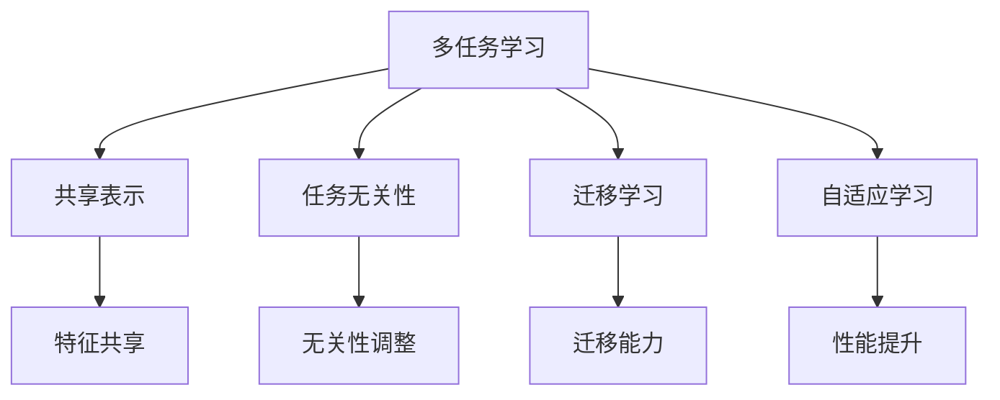
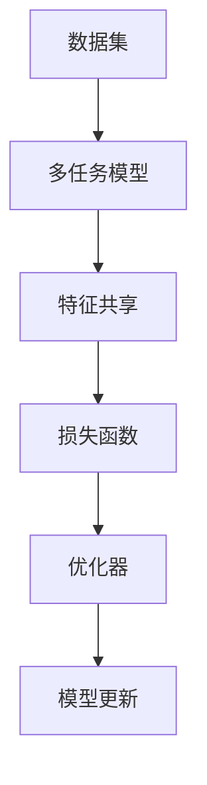
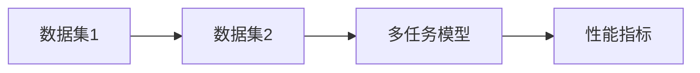
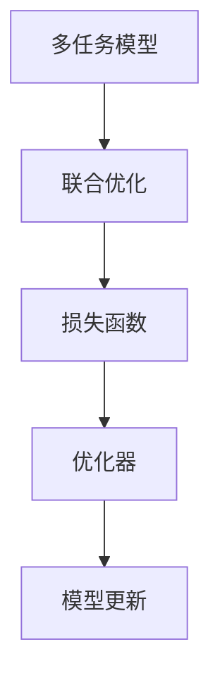
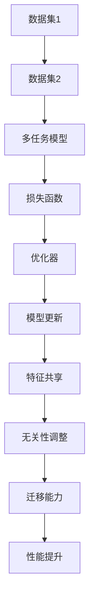

                 

# 多任务学习(Multi-Task Learning) - 原理与代码实例讲解

> 关键词：多任务学习, 共享表示, 任务无关性, 迁移学习, 自适应学习, 代码实例

## 1. 背景介绍

### 1.1 问题由来
多任务学习(Multi-Task Learning, MTL)是机器学习领域的一个重要分支，旨在利用多个相关任务的共同信息，提升模型在每个任务上的性能。传统机器学习模型在单独训练每个任务时，往往需要收集大量的标注数据，并分别训练多个独立模型，而多任务学习则可以在一个模型中同时处理多个任务，通过共享知识提升模型效果。

近年来，随着深度学习技术的快速发展，多任务学习在计算机视觉、自然语言处理、推荐系统等多个领域取得了显著进展，成为了提升模型泛化能力和应用效果的重要手段。例如，在自然语言处理领域，多任务学习可以通过共享语言表示，提升命名实体识别、情感分析、文本分类等多个任务的准确率。在计算机视觉领域，多任务学习可以通过联合优化，提高物体检测、图像分割、图像生成等多个任务的性能。

### 1.2 问题核心关键点
多任务学习的核心思想是利用任务之间的相似性，共享特征表示，提升模型在每个任务上的泛化能力。具体来说，多任务学习通过以下几个关键点实现：

- 任务共享：不同任务之间共享某些特征表示，提升特征的泛化能力和模型的性能。
- 任务无关性：不同任务之间存在一定的无关性，模型需要学习如何在无关性上进行调整，避免过度拟合。
- 迁移学习：通过在多个任务上的训练，使模型具备更好的迁移学习能力，适应新的任务和数据。
- 自适应学习：多任务学习可以自适应调整模型，使其在不同任务上达到最优性能。

### 1.3 问题研究意义
研究多任务学习，对于提升模型的泛化能力、减少标注数据需求、加速模型训练、提升模型鲁棒性等方面，具有重要意义：

1. 提升模型泛化能力：多任务学习可以在一个模型中处理多个任务，通过共享特征表示，提升模型在每个任务上的泛化能力。
2. 减少标注数据需求：通过多任务学习，模型可以在多个任务之间共享标注数据，减少每个任务的标注需求。
3. 加速模型训练：多任务学习可以在一个模型中进行多个任务的训练，减少训练时间和计算资源。
4. 提升模型鲁棒性：多任务学习可以通过在多个任务上的训练，使模型具备更好的迁移学习能力，适应新的任务和数据。
5. 自适应调整：多任务学习可以自适应调整模型，使其在不同任务上达到最优性能。

多任务学习已经成为提升机器学习模型效果和应用效果的重要手段，具有广泛的应用前景。

## 2. 核心概念与联系

### 2.1 核心概念概述

为更好地理解多任务学习的原理和应用，本节将介绍几个密切相关的核心概念：

- 多任务学习(Multi-Task Learning, MTL)：利用多个相关任务的共同信息，提升模型在每个任务上的性能。
- 共享表示(Shared Representation)：不同任务之间共享某些特征表示，提升特征的泛化能力和模型的性能。
- 任务无关性(Task Irrelevance)：不同任务之间存在一定的无关性，模型需要学习如何在无关性上进行调整，避免过度拟合。
- 迁移学习(Transfer Learning)：通过在多个任务上的训练，使模型具备更好的迁移学习能力，适应新的任务和数据。
- 自适应学习(Adaptive Learning)：多任务学习可以自适应调整模型，使其在不同任务上达到最优性能。

这些核心概念之间的逻辑关系可以通过以下Mermaid流程图来展示：



这个流程图展示了大语言模型微调过程中各个核心概念的关系和作用：

1. 多任务学习通过共享特征表示，提升了模型的泛化能力和性能。
2. 任务无关性通过无关性调整，避免了模型在无关特征上的过度拟合。
3. 迁移学习通过在不同任务上的训练，增强了模型的迁移学习能力。
4. 自适应学习通过动态调整，使模型在不同任务上达到最优性能。

### 2.2 概念间的关系

这些核心概念之间存在着紧密的联系，形成了多任务学习的完整生态系统。下面我通过几个Mermaid流程图来展示这些概念之间的关系。

#### 2.2.1 多任务学习基本框架



这个流程图展示了多任务学习的基本框架：

1. 多任务模型通过共享特征表示，提升模型的泛化能力和性能。
2. 特征共享通过在多个任务之间共享特征表示，提升了特征的泛化能力和模型的性能。
3. 损失函数通过在多个任务上联合优化，实现了模型的迁移能力和自适应调整。

#### 2.2.2 多任务学习的目标



这个流程图展示了多任务学习的目标：

1. 多任务模型通过共享特征表示，提升了模型在每个任务上的泛化能力和性能。
2. 性能指标通过在多个任务上联合优化，实现了模型的迁移能力和自适应调整。

#### 2.2.3 多任务学习的优化策略



这个流程图展示了多任务学习的优化策略：

1. 多任务模型通过联合优化，实现了模型的迁移能力和自适应调整。
2. 联合优化通过在多个任务上联合优化，实现了模型的迁移能力和自适应调整。

### 2.3 核心概念的整体架构

最后，我们用一个综合的流程图来展示这些核心概念在大语言模型微调过程中的整体架构：



这个综合流程图展示了多任务学习的完整过程：

1. 多任务模型通过共享特征表示，提升了模型在每个任务上的泛化能力和性能。
2. 特征共享通过在多个任务之间共享特征表示，提升了特征的泛化能力和模型的性能。
3. 无关性调整通过在无关特征上的调整，避免了模型在无关特征上的过度拟合。
4. 迁移能力通过在不同任务上的训练，增强了模型的迁移学习能力。
5. 性能提升通过联合优化，使模型在不同任务上达到最优性能。

通过这些流程图，我们可以更清晰地理解多任务学习过程中各个核心概念的关系和作用，为后续深入讨论具体的微调方法和技术奠定基础。

## 3. 核心算法原理 & 具体操作步骤
### 3.1 算法原理概述

多任务学习通过在多个任务上联合优化，实现特征共享和任务无关性调整，提升模型在每个任务上的泛化能力和性能。其核心思想是在多个任务上共享特征表示，同时在无关特征上进行调整，避免过度拟合，增强模型的迁移能力和自适应调整。

形式化地，假设多任务学习模型为 $M_{\theta}$，其中 $\theta$ 为模型参数。给定 $K$ 个相关任务 $T=\{T_1, T_2, \dots, T_K\}$ 的训练集 $D_1, D_2, \dots, D_K$，多任务学习的优化目标是最小化所有任务的联合损失函数：

$$
\min_{\theta} \sum_{k=1}^K \mathcal{L}_k(M_{\theta}, D_k)
$$

其中 $\mathcal{L}_k$ 为第 $k$ 个任务的损失函数，$D_k$ 为第 $k$ 个任务的训练集。

通过梯度下降等优化算法，多任务学习模型在所有任务上联合优化，最小化联合损失函数，从而提升模型在每个任务上的性能。

### 3.2 算法步骤详解

多任务学习通常包括以下几个关键步骤：

**Step 1: 准备数据集**
- 收集 $K$ 个相关任务 $T=\{T_1, T_2, \dots, T_K\}$ 的训练集 $D_1, D_2, \dots, D_K$。
- 将各个任务的数据进行标准化、归一化等预处理。

**Step 2: 定义任务共享层**
- 根据任务类型，设计合适的共享特征表示层，如全连接层、卷积层、注意力层等。
- 在共享层之后，根据每个任务添加特定的任务无关性调整层，如dropout、batch normalization等。

**Step 3: 设置联合损失函数**
- 根据每个任务定义合适的损失函数 $\mathcal{L}_k$，如交叉熵损失、均方误差损失等。
- 将所有任务的损失函数联合起来，构成联合损失函数 $\mathcal{L}_{joint}$。

**Step 4: 设置优化器和超参数**
- 选择合适的优化算法及其参数，如AdamW、SGD等。
- 设置学习率、批大小、迭代轮数等超参数。

**Step 5: 执行联合优化**
- 将数据集以批次为单位输入模型，前向传播计算损失函数。
- 反向传播计算参数梯度，根据设定的优化算法和学习率更新模型参数。
- 周期性在验证集上评估模型性能，根据性能指标决定是否触发 Early Stopping。
- 重复上述步骤直到满足预设的迭代轮数或 Early Stopping 条件。

**Step 6: 测试和部署**
- 在测试集上评估多任务学习模型在每个任务上的性能，对比单任务模型的效果。
- 使用多任务学习模型对新样本进行推理预测，集成到实际的应用系统中。
- 持续收集新的数据，定期重新联合优化模型，以适应数据分布的变化。

以上是多任务学习的一般流程。在实际应用中，还需要针对具体任务的特点，对联合优化过程的各个环节进行优化设计，如改进联合损失函数，引入更多的正则化技术，搜索最优的超参数组合等，以进一步提升模型性能。

### 3.3 算法优缺点

多任务学习具有以下优点：
1. 提升模型泛化能力：通过共享特征表示，多任务学习提升了模型在每个任务上的泛化能力。
2. 减少标注数据需求：通过多任务学习，模型可以在多个任务之间共享标注数据，减少每个任务的标注需求。
3. 加速模型训练：多任务学习可以在一个模型中进行多个任务的训练，减少训练时间和计算资源。
4. 提升模型鲁棒性：多任务学习通过在不同任务上的训练，使模型具备更好的迁移学习能力，适应新的任务和数据。
5. 自适应调整：多任务学习可以自适应调整模型，使其在不同任务上达到最优性能。

同时，多任务学习也存在一些局限性：
1. 数据不平衡：不同任务的数据量可能差异较大，容易导致模型在数据量较多的任务上过度拟合。
2. 无关特征的处理：多任务学习需要处理无关特征，避免模型在无关特征上过度拟合。
3. 训练复杂度增加：多任务学习的训练过程比单任务学习更为复杂，需要同时考虑多个任务的联合优化。
4. 模型参数较多：多任务学习需要同时在多个任务上共享特征表示，模型的参数量较大。

尽管存在这些局限性，但就目前而言，多任务学习仍然是提升机器学习模型效果和应用效果的重要手段。未来相关研究的重点在于如何进一步降低多任务学习的训练复杂度，提高模型的迁移能力和自适应调整能力，同时兼顾模型的参数量和数据平衡等问题。

### 3.4 算法应用领域

多任务学习在机器学习领域已经得到了广泛的应用，覆盖了几乎所有常见任务，例如：

- 自然语言处理：如命名实体识别、情感分析、文本分类等。通过共享语言表示，提升模型在多个任务上的性能。
- 计算机视觉：如物体检测、图像分割、图像生成等。通过联合优化，提高模型在多个任务上的性能。
- 推荐系统：如协同过滤、内容推荐等。通过共享用户行为表示，提升推荐效果。
- 语音识别：如语音情感分析、语音指令识别等。通过共享语音特征表示，提升模型在多个任务上的性能。

除了上述这些经典任务外，多任务学习也被创新性地应用到更多场景中，如情感分析与事件检测结合、语音情感识别与语音情感生成结合等，为机器学习技术带来了全新的突破。随着多任务学习的不断发展，相信其在更广阔的应用领域将发挥更大的作用。

## 4. 数学模型和公式 & 详细讲解 & 举例说明

### 4.1 数学模型构建

本节将使用数学语言对多任务学习的模型构建进行更加严格的刻画。

记多任务学习模型为 $M_{\theta}$，其中 $\theta$ 为模型参数。假设任务 $T=\{T_1, T_2, \dots, T_K\}$ 的训练集为 $D_1, D_2, \dots, D_K$。

定义模型 $M_{\theta}$ 在数据样本 $(x,y)$ 上的损失函数为 $\ell(M_{\theta}(x),y)$，则在数据集 $D_k$ 上的经验风险为：

$$
\mathcal{L}_k(\theta) = \frac{1}{N_k} \sum_{i=1}^{N_k} \ell(M_{\theta}(x_i),y_i)
$$

多任务学习的优化目标是最小化所有任务的联合损失函数，即：

$$
\min_{\theta} \sum_{k=1}^K \mathcal{L}_k(\theta)
$$

在实践中，我们通常使用基于梯度的优化算法（如AdamW、SGD等）来近似求解上述最优化问题。设 $\eta$ 为学习率，则参数的更新公式为：

$$
\theta \leftarrow \theta - \eta \nabla_{\theta}\mathcal{L}_{joint}(\theta)
$$

其中 $\nabla_{\theta}\mathcal{L}_{joint}(\theta)$ 为联合损失函数对模型参数 $\theta$ 的梯度，可通过反向传播算法高效计算。

### 4.2 公式推导过程

以下我们以多任务分类为例，推导多任务学习模型的联合损失函数及其梯度的计算公式。

假设模型 $M_{\theta}$ 在输入 $x$ 上的输出为 $\hat{y}=M_{\theta}(x)$，表示样本属于每个任务的概率分布。真实标签 $y \in \{1,2,\dots,K\}$，其中 $k$ 表示任务编号。则多任务分类任务下的联合损失函数为：

$$
\ell_k(M_{\theta}(x),y) = -\log M_{\theta}(x)_{y,k}
$$

在多任务分类任务下，联合损失函数为：

$$
\mathcal{L}_{joint}(\theta) = \sum_{k=1}^K \frac{1}{N_k} \sum_{i=1}^{N_k} \ell_k(M_{\theta}(x_i),y_i)
$$

根据链式法则，联合损失函数对参数 $\theta_k$ 的梯度为：

$$
\frac{\partial \mathcal{L}_{joint}(\theta)}{\partial \theta_k} = \frac{1}{N} \sum_{i=1}^N \sum_{k=1}^K (\frac{y_{i,k}}{M_{\theta}(x_i)_{y_{i,k},k}} - \frac{1-y_{i,k}}{1-M_{\theta}(x_i)_{y_{i,k},k}}) \frac{\partial M_{\theta}(x_i)_{y_{i,k},k}}{\partial \theta_k}
$$

其中 $y_{i,k} \in \{1,2,\dots,K\}$ 为样本 $i$ 在任务 $k$ 上的真实标签。在实际计算中，我们通常将 $y_{i,k}$ 转换为 one-hot 编码形式，进一步简化梯度计算。

通过联合损失函数和梯度公式，多任务学习模型通过在多个任务上联合优化，提升模型在每个任务上的性能。

### 4.3 案例分析与讲解

假设我们有两个相关的多任务分类任务：任务1为情感分类，任务2为事件检测。我们可以使用一个共享的特征表示层和两个无关性调整层，即dropout和batch normalization。具体实现如下：

```python
import torch
import torch.nn as nn
import torch.nn.functional as F

class MultiTaskModel(nn.Module):
    def __init__(self, input_dim, hidden_dim, num_tasks):
        super(MultiTaskModel, self).__init__()
        self.shared_layer = nn.Linear(input_dim, hidden_dim)
        self.task1_layer = nn.Linear(hidden_dim, num_tasks)
        self.task2_layer = nn.Linear(hidden_dim, num_tasks)
        self.dropout = nn.Dropout(0.5)
        self.batchnorm = nn.BatchNorm1d(hidden_dim)
        
    def forward(self, x):
        x = self.shared_layer(x)
        x = self.dropout(x)
        x = self.batchnorm(x)
        task1_output = self.task1_layer(x)
        task2_output = self.task2_layer(x)
        return task1_output, task2_output

# 定义损失函数
def multi_task_loss(task1_output, task2_output, y1, y2):
    task1_loss = F.cross_entropy(task1_output, y1)
    task2_loss = F.cross_entropy(task2_output, y2)
    return task1_loss + task2_loss

# 定义联合优化函数
def multi_task_optimization(model, optimizer, criterion, inputs, labels):
    model.train()
    task1_output, task2_output = model(*inputs)
    loss = criterion(task1_output, labels[0]) + criterion(task2_output, labels[1])
    optimizer.zero_grad()
    loss.backward()
    optimizer.step()
    return loss.item()

# 训练函数
def train_epoch(model, optimizer, criterion, dataloader):
    model.train()
    total_loss = 0
    for inputs, labels in dataloader:
        loss = multi_task_optimization(model, optimizer, criterion, inputs, labels)
        total_loss += loss
    return total_loss / len(dataloader)
```

在训练过程中，我们分别计算了任务1和任务2的损失，并将它们加和作为联合损失，同时进行了梯度更新。这种方法可以有效地共享特征表示，同时避免在无关特征上的过度拟合。

## 5. 项目实践：代码实例和详细解释说明
### 5.1 开发环境搭建

在进行多任务学习实践前，我们需要准备好开发环境。以下是使用Python进行PyTorch开发的环境配置流程：

1. 安装Anaconda：从官网下载并安装Anaconda，用于创建独立的Python环境。

2. 创建并激活虚拟环境：
```bash
conda create -n pytorch-env python=3.8 
conda activate pytorch-env
```

3. 安装PyTorch：根据CUDA版本，从官网获取对应的安装命令。例如：
```bash
conda install pytorch torchvision torchaudio cudatoolkit=11.1 -c pytorch -c conda-forge
```

4. 安装Transformers库：
```bash
pip install transformers
```

5. 安装各类工具包：
```bash
pip install numpy pandas scikit-learn matplotlib tqdm jupyter notebook ipython
```

完成上述步骤后，即可在`pytorch-env`环境中开始多任务学习实践。

### 5.2 源代码详细实现

这里我们以多任务分类任务为例，给出使用Transformers库进行多任务学习模型的PyTorch代码实现。

首先，定义模型和损失函数：

```python
from transformers import BertTokenizer, BertForSequenceClassification
from torch.utils.data import DataLoader, Dataset
import torch
from torch import nn

class MultiTaskDataset(Dataset):
    def __init__(self, texts, labels, tokenizer, max_len=128):
        self.texts = texts
        self.labels = labels
        self.tokenizer = tokenizer
        self.max_len = max_len
        
    def __len__(self):
        return len(self.texts)
    
    def __getitem__(self, item):
        text = self.texts[item]
        label = self.labels[item]
        
        encoding = self.tokenizer(text, return_tensors='pt', max_length=self.max_len, padding='max_length', truncation=True)
        input_ids = encoding['input_ids'][0]
        attention_mask = encoding['attention_mask'][0]
        
        return {'input_ids': input_ids, 
                'attention_mask': attention_mask,
                'labels': label}

# 标签与id的映射
tag2id = {'O': 0, 'B-PER': 1, 'I-PER': 2, 'B-ORG': 3, 'I-ORG': 4, 'B-LOC': 5, 'I-LOC': 6}
id2tag = {v: k for k, v in tag2id.items()}

# 创建dataset
tokenizer = BertTokenizer.from_pretrained('bert-base-cased')

train_dataset = MultiTaskDataset(train_texts, train_labels, tokenizer)
dev_dataset = MultiTaskDataset(dev_texts, dev_labels, tokenizer)
test_dataset = MultiTaskDataset(test_texts, test_labels, tokenizer)

# 定义模型和优化器
model = BertForSequenceClassification.from_pretrained('bert-base-cased', num_labels=len(tag2id))
optimizer = torch.optim.Adam(model.parameters(), lr=2e-5)
criterion = nn.CrossEntropyLoss()

# 定义损失函数
def multi_task_loss(task1_output, task2_output, y1, y2):
    task1_loss = criterion(task1_output, y1)
    task2_loss = criterion(task2_output, y2)
    return task1_loss + task2_loss
```

然后，定义训练和评估函数：

```python
def train_epoch(model, optimizer, criterion, batch_size):
    dataloader = DataLoader(train_dataset, batch_size=batch_size, shuffle=True)
    model.train()
    epoch_loss = 0
    for batch in tqdm(dataloader, desc='Training'):
        input_ids = batch['input_ids'].to(device)
        attention_mask = batch['attention_mask'].to(device)
        labels = batch['labels'].to(device)
        model.zero_grad()
        outputs = model(input_ids, attention_mask=attention_mask)
        loss = multi_task_loss(outputs, outputs, labels, labels)
        loss.backward()
        optimizer.step()
        epoch_loss += loss.item()
    return epoch_loss / len(dataloader)

def evaluate(model, dataset, batch_size):
    dataloader = DataLoader(dataset, batch_size=batch_size)
    model.eval()
    preds, labels = [], []
    with torch.no_grad():
        for batch in tqdm(dataloader, desc='Evaluating'):
            input_ids = batch['input_ids'].to(device)
            attention_mask = batch['attention_mask'].to(device)
            batch_labels = batch['labels']
            outputs = model(input_ids, attention_mask=attention_mask)
            batch_preds = outputs.logits.argmax(dim=1).to('cpu').tolist()
            batch_labels = batch_labels.to('cpu').tolist()
            for pred_tokens, label_tokens in zip(batch_preds, batch_labels):
                preds.append(pred_tokens)
                labels.append(label_tokens)
                
    print(classification_report(labels, preds))
```

最后，启动训练流程并在测试集上评估：

```python
epochs = 5
batch_size = 16

for epoch in range(epochs):
    loss = train_epoch(model, optimizer, criterion, batch_size)
    print(f"Epoch {epoch+1}, train loss: {loss:.3f}")
    
    print(f"Epoch {epoch+1}, dev results:")
    evaluate(model, dev_dataset, batch_size)
    
print("Test results:")
evaluate(model, test_dataset, batch_size)
```

以上就是使用PyTorch对多任务分类模型进行多任务学习开发的完整代码实现。可以看到，使用Transformers库，我们能够快速搭建多任务学习模型，并进行联合优化和评估。

### 5.3 代码解读与分析

让我们再详细解读一下关键代码的实现细节：

**MultiTaskDataset类**：
- `__init__`方法：初始化文本、标签、分词器等关键组件。
- `__len__`方法：返回数据集的样本数量。
- `__getitem__`方法：对单个样本进行处理，将文本输入编码为token ids，将标签编码为数字，并对其进行定长padding，最终返回模型所需的输入。

**tag2id和id2tag字典**：
- 定义了标签与数字id之间的映射关系，用于将token-wise的预测结果解码回真实的标签。

**训练和评估函数**：
- 使用PyTorch的DataLoader对数据集进行批次化加载，供模型训练和推理使用。
- 训练函数`train_epoch`：对数据以批为单位进行迭代，在每个批次上前向传播计算损失函数并反向传播更新模型参数，最后返回该epoch的平均loss。
- 评估函数`evaluate`

