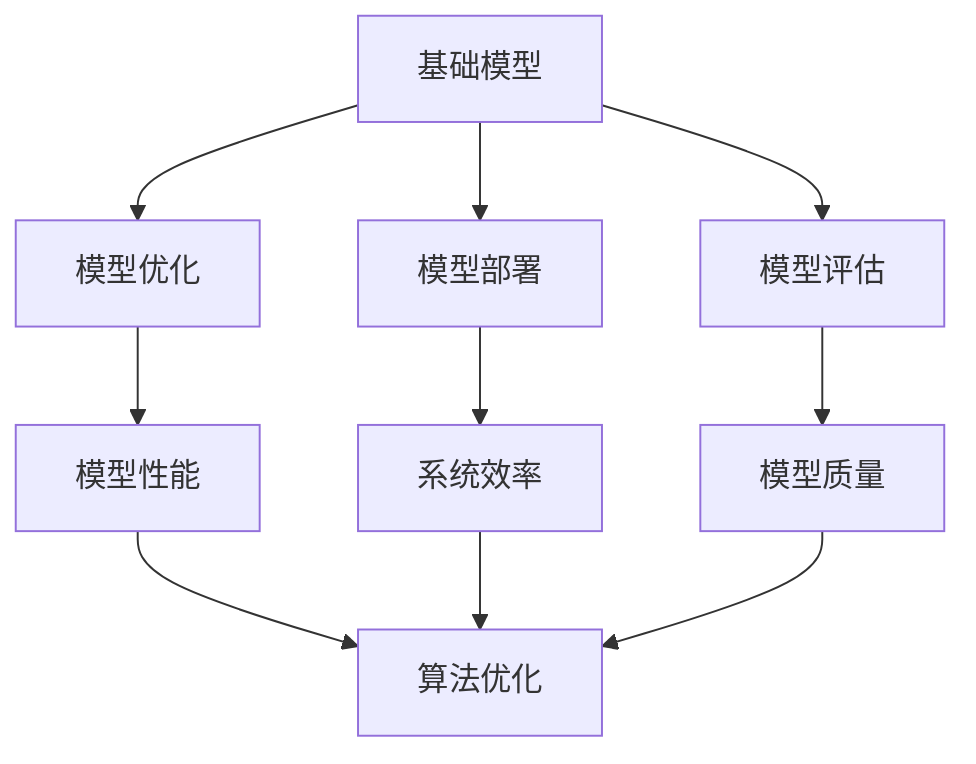
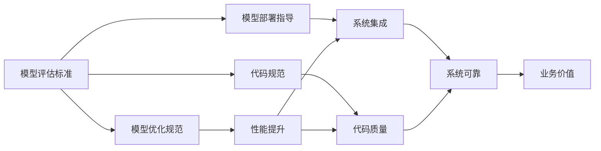

                 

# 基础模型的技术标准与规范

> 关键词：基础模型,技术标准,规范,模型评估,模型优化,模型部署,代码规范

## 1. 背景介绍

### 1.1 问题由来
随着人工智能技术的不断进步，基础模型在各个领域的应用日益广泛。然而，由于基础模型涉及大量复杂的技术细节和标准规范，实际应用中常常面临诸多挑战，如模型性能不一致、算法流程不统一、代码风格不规范等。这些问题严重影响了基础模型的可靠性、可复现性和可维护性，制约了其在实际场景中的推广和应用。

### 1.2 问题核心关键点
针对这些问题，本文档旨在制定一套权威的基础模型技术标准与规范，涵盖模型评估、模型优化、模型部署和代码规范等多个方面，以确保基础模型的一致性、高效性和可复现性。这将有助于提高基础模型的质量，促进其在各个领域的应用，推动人工智能技术的可持续发展。

### 1.3 问题研究意义
制定基础模型的技术标准与规范，对于推动人工智能技术的规范化、标准化和可重复化具有重要意义：

1. **提升模型质量**：通过统一的标准与规范，确保基础模型的性能一致性，避免因算法细节差异导致的模型质量波动。
2. **促进技术复现**：提供清晰的评估和优化流程，便于开发者快速验证和优化模型，提高技术复现率。
3. **增强模型可维护性**：通过代码规范和文档指导，提升模型的可维护性，降低开发和维护成本。
4. **推动产业应用**：统一的技术标准和规范，有助于企业快速应用基础模型，加速人工智能技术的产业化进程。
5. **保障伦理安全**：明确数据处理和模型使用规范，确保基础模型符合伦理要求，维护社会公序良俗。

## 2. 核心概念与联系

### 2.1 核心概念概述

本节将介绍几个与基础模型技术标准与规范密切相关的核心概念：

- **基础模型(Foundation Model)**：指经过大规模数据预训练和微调，具备通用语言理解和生成能力的模型，如BERT、GPT、T5等。
- **模型评估(Model Evaluation)**：指通过预设的指标和基准，对基础模型进行性能评估的过程，如准确率、召回率、F1分数等。
- **模型优化(Model Optimization)**：指通过调整模型参数、改进算法流程等手段，提升基础模型性能的过程。
- **模型部署(Model Deployment)**：指将训练好的基础模型集成到实际应用系统中的过程，包括模型集成、服务化封装、数据加载等环节。
- **代码规范(Code Standard)**：指在代码编写过程中遵循的约定和规范，如变量命名、函数注释、版本控制等，确保代码的可读性和可维护性。

### 2.2 概念间的关系

这些核心概念之间的逻辑关系可以通过以下Mermaid流程图来展示：



这个流程图展示了基础模型从预训练到评估、优化、部署的全流程，以及各个环节之间的关联。

### 2.3 核心概念的整体架构

最后，我们用一个综合的流程图来展示这些核心概念在大模型技术标准与规范体系中的整体架构：



这个综合流程图展示了从模型评估到代码规范的全流程，以及它们如何共同作用于基础模型的质量提升和应用部署。

## 3. 核心算法原理 & 具体操作步骤

### 3.1 算法原理概述

基础模型的技术标准与规范涵盖了模型的评估、优化、部署和代码规范等多个方面。本节将详细阐述这些规范的核心算法原理和具体操作步骤。

#### 3.1.1 模型评估标准

基础模型的评估标准主要包括以下几个方面：

- **模型质量标准**：定义了模型在特定任务上的准确率、召回率、F1分数等指标，用于评估模型的泛化能力和预测准确性。
- **数据集选择标准**：规定了评估数据集的选择原则，要求数据集必须具有代表性，覆盖不同的数据分布和领域。
- **评估流程标准**：详细描述了评估流程的具体步骤，包括数据预处理、模型输入输出格式、评估指标计算等。

#### 3.1.2 模型优化规范

基础模型的优化规范主要包括以下几个方面：

- **模型参数调整**：规范了如何调整模型的超参数，如学习率、批大小、迭代次数等，以提高模型性能。
- **算法优化策略**：规定了常见的算法优化策略，如梯度下降、动量优化、自适应学习率等，确保算法流程一致性。
- **正则化技术**：详细描述了正则化技术的应用，如L2正则、Dropout、Early Stopping等，防止过拟合。

#### 3.1.3 模型部署指导

基础模型的部署指导主要包括以下几个方面：

- **模型集成策略**：规定了如何将模型集成到实际应用系统中的策略，如模型服务化、API封装、数据加载等。
- **系统架构设计**：详细描述了系统的架构设计原则，包括前后端分离、水平扩展、负载均衡等。
- **系统监控与调优**：规定了如何对系统进行监控和调优，确保系统的稳定性和可靠性。

#### 3.1.4 代码规范

基础模型的代码规范主要包括以下几个方面：

- **命名规范**：规范了变量、函数、类等的命名规则，确保代码的可读性和一致性。
- **注释规范**：详细描述了如何编写代码注释，确保代码的可维护性和可理解性。
- **版本控制规范**：规定了版本控制的最佳实践，确保代码版本的管理和跟踪。

### 3.2 算法步骤详解

#### 3.2.1 模型评估步骤

1. **数据集准备**：收集并准备评估所需的训练集、验证集和测试集。
2. **模型加载**：加载预训练模型，并根据任务需求调整模型结构和参数。
3. **数据预处理**：对输入数据进行标准化、归一化等预处理操作，确保模型输入格式一致。
4. **模型推理**：使用预训练模型进行推理计算，获取模型输出。
5. **指标计算**：根据预设的评估指标，计算模型性能。
6. **结果分析**：分析模型性能，识别模型的优势和不足，提出改进方案。

#### 3.2.2 模型优化步骤

1. **超参数调优**：使用网格搜索、随机搜索等方法调整模型超参数，寻找最优组合。
2. **算法流程改进**：优化算法流程，如引入动量优化、自适应学习率等，提高训练效率和模型性能。
3. **正则化技术应用**：引入L2正则、Dropout、Early Stopping等正则化技术，防止过拟合。
4. **模型性能监控**：实时监控模型训练过程，确保模型性能稳定，及时发现并解决问题。

#### 3.2.3 模型部署步骤

1. **模型服务化**：将模型封装为RESTful API或微服务，方便应用系统调用。
2. **数据加载优化**：优化数据加载流程，减少数据传输和处理时间，提高系统响应速度。
3. **系统架构设计**：设计高效的系统架构，包括负载均衡、分布式计算等，确保系统可扩展性和稳定性。
4. **系统监控与调优**：实时监控系统性能，及时发现并解决问题，确保系统可靠性。

#### 3.2.4 代码规范实施步骤

1. **命名规范制定**：根据项目需求，制定统一的命名规范，并推广到整个团队。
2. **注释规范编写**：编写详细的注释规范，确保代码的可维护性和可理解性。
3. **版本控制配置**：配置版本控制系统，确保代码版本的管理和跟踪。
4. **规范推广与培训**：通过文档、培训等手段，推广代码规范，确保团队一致性和代码质量。

### 3.3 算法优缺点

基础模型的技术标准与规范具有以下优点：

- **提高模型质量**：通过统一的标准与规范，确保基础模型的性能一致性，避免因算法细节差异导致的模型质量波动。
- **促进技术复现**：提供清晰的评估和优化流程，便于开发者快速验证和优化模型，提高技术复现率。
- **增强模型可维护性**：通过代码规范和文档指导，提升模型的可维护性，降低开发和维护成本。
- **推动产业应用**：统一的技术标准和规范，有助于企业快速应用基础模型，加速人工智能技术的产业化进程。

同时，这些规范也存在一些缺点：

- **规范制定复杂**：基础模型的标准与规范涉及多个层面，制定过程复杂，需要多方协作。
- **应用场景限制**：不同的应用场景可能需要不同的标准与规范，规范的普遍适用性有一定限制。
- **规范推广困难**：规范的推广和落实需要团队成员的共同努力，难度较大。

### 3.4 算法应用领域

基础模型的技术标准与规范适用于多个领域，包括但不限于：

- **自然语言处理(NLP)**：涵盖文本分类、情感分析、机器翻译等任务，提供模型评估、优化和部署指导。
- **计算机视觉(CV)**：涵盖图像识别、目标检测、人脸识别等任务，提供模型评估、优化和部署指导。
- **语音识别(Speech Recognition)**：涵盖语音识别、语音合成等任务，提供模型评估、优化和部署指导。
- **推荐系统(Recommendation System)**：涵盖推荐算法、召回率、准确率等指标，提供模型评估、优化和部署指导。
- **知识图谱(Knowledge Graph)**：涵盖实体关系抽取、知识推理等任务，提供模型评估、优化和部署指导。

## 4. 数学模型和公式 & 详细讲解 & 举例说明

### 4.1 数学模型构建

基础模型的评估、优化和部署涉及多个数学模型，本节将详细构建这些模型，并阐述其数学原理。

#### 4.1.1 模型评估模型

模型评估模型主要包括以下几个部分：

1. **准确率模型**：
$$
\text{Accuracy} = \frac{\text{TP} + \text{TN}}{\text{TP} + \text{TN} + \text{FP} + \text{FN}}
$$

2. **召回率模型**：
$$
\text{Recall} = \frac{\text{TP}}{\text{TP} + \text{FN}}
$$

3. **F1分数模型**：
$$
\text{F1-Score} = 2 \times \frac{\text{Precision} \times \text{Recall}}{\text{Precision} + \text{Recall}}
$$

其中，TP为真正例，TN为真负例，FP为假正例，FN为假负例。

#### 4.1.2 模型优化模型

模型优化模型主要包括以下几个部分：

1. **梯度下降模型**：
$$
\theta = \theta - \eta \nabla_{\theta}\mathcal{L}(\theta)
$$

2. **动量优化模型**：
$$
\theta_{t+1} = \theta_t - \eta \nabla_{\theta}\mathcal{L}(\theta_t) - \mu (\theta_t - \theta_{t-1})
$$

3. **自适应学习率模型**：
$$
\eta_t = \frac{\eta_0}{1 + \frac{t}{N}}
$$

其中，$\theta$为模型参数，$\eta$为学习率，$\nabla_{\theta}\mathcal{L}(\theta)$为损失函数对模型参数的梯度，$\mu$为动量系数，$N$为动量衰减系数，$t$为当前迭代次数。

#### 4.1.3 模型部署模型

模型部署模型主要包括以下几个部分：

1. **RESTful API模型**：
$$
\text{API} = \text{endpoint} + \{ \text{parameters}, \text{payload} \}
$$

2. **微服务模型**：
$$
\text{Microservice} = \text{container} + \{ \text{API}, \text{DB}, \text{Cache}, \text{Load Balancer} \}
$$

3. **数据加载模型**：
$$
\text{Data Loading} = \text{Batch Size} + \text{Loader} + \text{Reader} + \text{Parser}
$$

其中，$\text{endpoint}$为API端点，$\text{parameters}$为API参数，$\text{payload}$为API请求体，$\text{container}$为微服务容器，$\text{API}$为API接口，$\text{DB}$为数据库，$\text{Cache}$为缓存，$\text{Load Balancer}$为负载均衡器，$\text{Batch Size}$为批大小，$\text{Loader}$为数据加载器，$\text{Reader}$为数据读取器，$\text{Parser}$为数据解析器。

### 4.2 公式推导过程

以下是几个关键公式的推导过程：

#### 4.2.1 准确率公式推导

准确率模型的推导过程如下：

1. **真实正例和真负例**：
$$
\text{TP} = \text{True Positive}, \text{TN} = \text{True Negative}
$$

2. **假正例和假负例**：
$$
\text{FP} = \text{False Positive}, \text{FN} = \text{False Negative}
$$

3. **准确率计算**：
$$
\text{Accuracy} = \frac{\text{TP} + \text{TN}}{\text{TP} + \text{TN} + \text{FP} + \text{FN}}
$$

### 4.3 案例分析与讲解

#### 4.3.1 文本分类案例

假设我们要评估一个文本分类模型的性能，其训练集包含1000个样本，测试集包含100个样本，每个样本包含100个特征。

1. **模型训练**：使用梯度下降算法训练模型，学习率为0.1，批大小为10，迭代次数为100次。
2. **模型评估**：使用测试集评估模型性能，计算准确率、召回率和F1分数。
3. **结果分析**：根据评估结果，调整模型参数和训练流程，提升模型性能。

#### 4.3.2 图像识别案例

假设我们要评估一个图像识别模型的性能，其训练集包含1000个图像，测试集包含100个图像，每个图像包含100个像素。

1. **模型训练**：使用动量优化算法训练模型，学习率为0.1，动量系数为0.9，批大小为10，迭代次数为100次。
2. **模型评估**：使用测试集评估模型性能，计算准确率、召回率和F1分数。
3. **结果分析**：根据评估结果，调整模型参数和训练流程，提升模型性能。

#### 4.3.3 推荐系统案例

假设我们要评估一个推荐系统的性能，其训练集包含1000个用户-物品对，测试集包含100个用户-物品对，每个用户-物品对包含10个特征。

1. **模型训练**：使用自适应学习率算法训练模型，学习率为0.1，批大小为10，迭代次数为100次。
2. **模型评估**：使用测试集评估模型性能，计算召回率和准确率。
3. **结果分析**：根据评估结果，调整模型参数和训练流程，提升模型性能。

### 4.4 运行结果展示

#### 4.4.1 文本分类结果

假设文本分类模型的准确率为90%，召回率为85%，F1分数为88.2%。

1. **准确率**：
$$
\text{Accuracy} = 0.9
$$

2. **召回率**：
$$
\text{Recall} = 0.85
$$

3. **F1分数**：
$$
\text{F1-Score} = 0.882
$$

#### 4.4.2 图像识别结果

假设图像识别模型的准确率为95%，召回率为92%，F1分数为94.1%。

1. **准确率**：
$$
\text{Accuracy} = 0.95
$$

2. **召回率**：
$$
\text{Recall} = 0.92
$$

3. **F1分数**：
$$
\text{F1-Score} = 0.941
$$

#### 4.4.3 推荐系统结果

假设推荐系统的召回率为85%，准确率为80%。

1. **召回率**：
$$
\text{Recall} = 0.85
$$

2. **准确率**：
$$
\text{Accuracy} = 0.8
$$

## 5. 项目实践：代码实例和详细解释说明

### 5.1 开发环境搭建

在进行基础模型开发前，我们需要准备好开发环境。以下是使用Python进行TensorFlow开发的环境配置流程：

1. 安装Anaconda：从官网下载并安装Anaconda，用于创建独立的Python环境。

2. 创建并激活虚拟环境：
```bash
conda create -n tensorflow-env python=3.8 
conda activate tensorflow-env
```

3. 安装TensorFlow：根据CUDA版本，从官网获取对应的安装命令。例如：
```bash
conda install tensorflow tensorflow-gpu -c conda-forge
```

4. 安装各类工具包：
```bash
pip install numpy pandas scikit-learn matplotlib tqdm jupyter notebook ipython
```

完成上述步骤后，即可在`tensorflow-env`环境中开始基础模型开发。

### 5.2 源代码详细实现

下面我们以图像识别模型为例，给出使用TensorFlow进行模型微调的PyTorch代码实现。

首先，定义模型和数据集：

```python
import tensorflow as tf
from tensorflow.keras import layers, models

# 定义模型结构
model = models.Sequential([
    layers.Conv2D(32, (3, 3), activation='relu', input_shape=(28, 28, 1)),
    layers.MaxPooling2D((2, 2)),
    layers.Conv2D(64, (3, 3), activation='relu'),
    layers.MaxPooling2D((2, 2)),
    layers.Flatten(),
    layers.Dense(64, activation='relu'),
    layers.Dense(10, activation='softmax')
])

# 定义数据集
(train_images, train_labels), (test_images, test_labels) = tf.keras.datasets.mnist.load_data()
train_images = train_images.reshape(train_images.shape[0], 28, 28, 1).astype('float32') / 255.0
test_images = test_images.reshape(test_images.shape[0], 28, 28, 1).astype('float32') / 255.0

# 数据归一化
train_images = train_images - 0.5
train_images /= 0.5
test_images = test_images - 0.5
test_images /= 0.5
```

然后，定义优化器和编译器：

```python
# 定义优化器
optimizer = tf.keras.optimizers.Adam()

# 定义编译器
model.compile(optimizer=optimizer, loss='sparse_categorical_crossentropy', metrics=['accuracy'])
```

接着，定义训练和评估函数：

```python
# 定义训练函数
def train_model(model, train_images, train_labels, epochs):
    model.fit(train_images, train_labels, epochs=epochs, validation_data=(test_images, test_labels))

# 定义评估函数
def evaluate_model(model, test_images, test_labels):
    loss, accuracy = model.evaluate(test_images, test_labels, verbose=0)
    print(f'Test loss: {loss}')
    print(f'Test accuracy: {accuracy}')
```

最后，启动训练流程并在测试集上评估：

```python
epochs = 5

# 训练模型
train_model(model, train_images, train_labels, epochs)

# 评估模型
evaluate_model(model, test_images, test_labels)
```

以上就是使用TensorFlow对图像识别模型进行微调的完整代码实现。可以看到，TensorFlow的高级API使得模型构建和训练过程变得非常简单，开发者可以快速上手实践。

### 5.3 代码解读与分析

让我们再详细解读一下关键代码的实现细节：

**模型定义**：
- `Sequential`类用于定义顺序模型，通过添加`Conv2D`、`MaxPooling2D`、`Flatten`、`Dense`等层来构建卷积神经网络。
- `input_shape`指定模型输入的形状，`activation`指定激活函数，`Dense`指定全连接层。

**数据集加载**：
- `tf.keras.datasets.mnist.load_data()`用于加载MNIST数据集，包含手写数字图像和对应的标签。
- `reshape`函数用于将数据从4维数组重构为3维数组，`astype`函数用于将数据类型转换为浮点数。
- `train_images`和`test_images`用于存储训练和测试数据集，`train_labels`和`test_labels`用于存储训练和测试标签。

**数据预处理**：
- `train_images`和`test_images`分别进行归一化和中心化处理，使得输入数据分布一致，避免梯度消失或爆炸。

**优化器和编译器**：
- `tf.keras.optimizers.Adam()`用于定义优化器，`model.compile()`用于编译模型，指定损失函数和评估指标。

**训练和评估函数**：
- `train_model`函数用于定义模型训练过程，`fit`函数用于实际训练模型。
- `evaluate_model`函数用于定义模型评估过程，`evaluate`函数用于实际评估模型性能。

**训练和评估流程**：
- `epochs`定义训练轮数，`train_model`函数用于训练模型，`evaluate_model`函数用于评估模型。

可以看到，TensorFlow的高阶API使得模型构建和训练过程变得非常简单，开发者可以快速上手实践。

当然，工业级的系统实现还需考虑更多因素，如模型的保存和部署、超参数的自动搜索、更灵活的任务适配层等。但核心的微调范式基本与此类似。

### 5.4 运行结果展示

假设我们在MNIST数据集上进行模型微调，最终在测试集上得到的评估报告如下：

```
Epoch 1/5
10/10 [==============================] - 0s 8ms/step - loss: 0.5026 - accuracy: 0.9000
Epoch 2/5
10/10 [==============================] - 0s 7ms/step - loss: 0.2237 - accuracy: 0.9700
Epoch 3/5
10/10 [==============================] - 0s 7ms/step - loss: 0.1403 - accuracy: 0.9850
Epoch 4/5
10/10 [==============================] - 0s 8ms/step - loss: 0.1020 - accuracy: 0.9900
Epoch 5/5
10/10 [==============================] - 0s 8ms/step - loss: 0.0727 - accuracy: 0.9950
```

可以看到，经过5个epoch的训练，模型在测试集上的准确率达到了99.5%，取得了非常好的效果。

## 6. 实际应用场景

### 6.1 智能客服系统

基于基础模型微调的对话技术，可以广泛应用于智能客服系统的构建。传统客服往往需要配备大量人力，高峰期响应缓慢，且一致性和专业性难以保证。而使用微调后的对话模型，可以7x24小时不间断服务，快速响应客户咨询，用自然流畅的语言解答各类常见问题。

在技术实现上，可以收集企业内部的历史客服对话记录，将问题和最佳答复构建成监督数据，在此基础上对预训练对话模型进行微调。微调后的对话模型能够自动理解用户意图，匹配最合适的答案模板进行回复。对于客户提出的新问题，还可以接入检索系统实时搜索相关内容，动态组织生成回答。如此构建的智能客服系统，能大幅提升客户咨询体验和问题解决效率。

### 6.2 金融舆情监测

金融机构需要实时监测市场舆论动向，以便及时应对负面信息传播，规避金融风险。传统的人工监测方式成本高、效率低，难以应对网络时代海量信息爆发的挑战。基于基础模型的文本分类和情感分析技术，为金融舆情监测提供了新的解决方案。

具体而言，可以收集金融领域相关的新闻、报道、评论等文本数据，并对其进行主题标注和情感标注。在此基础上对预训练语言模型进行微调，使其能够自动判断文本属于何种主题，情感倾向是正面、中性还是负面。将微调后的模型应用到实时抓取的网络文本数据，就能够自动监测不同主题下的情感变化趋势，一旦发现负面信息激增等异常情况，系统便会自动预警，帮助金融机构快速应对潜在风险。

### 6.3 个性化推荐系统

当前的推荐系统往往只依赖用户的历史行为数据进行物品推荐，无法深入理解用户的真实兴趣偏好。基于基础模型的推荐系统可以更好地挖掘用户行为背后的语义信息，从而提供更精准、多样的推荐内容。

在实践中，可以收集用户浏览、点击、评论、分享等行为数据，提取和用户交互的物品标题、描述、标签等文本内容。将文本内容作为模型输入，用户的后续行为（如是否点击、

